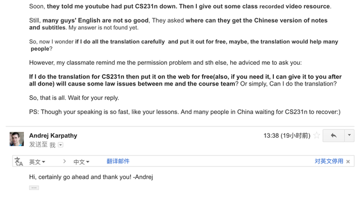

# 获得授权翻译斯坦福 CS231n 课程笔记系列

> 来源：[`zhuanlan.zhihu.com/p/20870307`](https://zhuanlan.zhihu.com/p/20870307)

一切都要从这个回答说起：

[应该选择 TensorFlow 还是 Theano？ - 杜客的回答](https://www.zhihu.com/question/41907061/answer/99226587)

斯坦福 CS231n-Convolutional Neural Networks for Visual Recognition(Winter 2016)是一个很好的课程，个人在学习过程中获益良多。

在和大家的交流中，发现菜鸟如自己可以为更多热爱机器学习的同学尽一份力。于是邮件了讲师 Andrej Karpathy，表达了翻译的想法，询问是否存在问题。

Andrej Karpathy 表示没有问题，欢迎翻译并表示感谢。回复截图如下：

接下来，我和小伙伴们会利用课余时间，逐步为大家发布 CS231n 课程的 notes 翻译文章，欢迎大家批评指正，共同学习提高。

啊！真开心！！