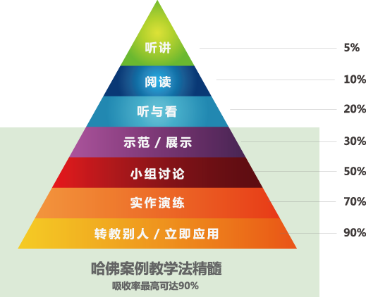

# 贺完结！CS231n 官方笔记授权翻译总集篇发布

> 来源：[`zhuanlan.zhihu.com/p/20870307`](https://zhuanlan.zhihu.com/p/21930884)

> 哈哈哈！我们也是不谦虚，几个“业余水平”的网友，怎么就“零星”地把这件事给搞完了呢！**总之就是非常开心**，废话不多说，进入正题吧！

## CS231n 简介

CS231n 的全称是[CS231n: Convolutional Neural Networks for Visual Recognition](https://link.zhihu.com/?target=http%3A//vision.stanford.edu/teaching/cs231n/index.html)*，即**面向视觉识别的卷积神经网络**。该课程是[斯坦福大学计算机视觉实验室](https://link.zhihu.com/?target=http%3A//vision.stanford.edu/index.html)*推出的课程。需要注意的是，目前大家说 CS231n，大都指的是 2016 年冬季学期（一月到三月）的最新版本。**

 ****课程描述**：请允许我们引用课程主页上的**官方描述**如下。

> 计算机视觉在社会中已经逐渐普及，并广泛运用于搜索检索、图像理解、手机应用、地图导航、医疗制药、无人机和无人驾驶汽车等领域。而这些应用的核心技术就是图像分类、图像定位和图像探测等视觉识别任务。近期神经网络（也就是“深度学习”）方法上的进展极大地提升了这些代表当前发展水平的视觉识别系统的性能。
> 
> 本课程将深入讲解深度学习框架的细节问题，聚焦面向视觉识别任务（尤其是图像分类任务）的端到端学习模型。在 10 周的课程中，学生们将会学习如何实现、训练和调试他们自己的神经网络，并建立起对计算机视觉领域的前沿研究方向的细节理解。最终的作业将包括训练一个有几百万参数的卷积神经网络，并将其应用到最大的图像分类数据库（ImageNet）上。我们将会聚焦于教授如何确定图像识别问题，学习算法（比如反向传播算法），对网络的训练和精细调整（fine-tuning）中的工程实践技巧，指导学生动手完成课程作业和最终的课程项目。本课程的大部分背景知识和素材都来源于[ImageNet Challenge](https://link.zhihu.com/?target=http%3A//image-net.org/challenges/LSVRC/2014/index)*竞赛。*

 ***课程内容**：官方课程安排及资源获取请点击[这里](https://link.zhihu.com/?target=http%3A//vision.stanford.edu/teaching/cs231n/syllabus.html)*，课程视频请在 Youtube 上查看[Andrej Karpathy](https://link.zhihu.com/?target=https%3A//www.youtube.com/channel/UCPk8m_r6fkUSYmvgCBwq-sw)*创建的[播放列表](https://link.zhihu.com/?target=https%3A//www.youtube.com/playlist%3Flist%3DPLkt2uSq6rBVctENoVBg1TpCC7OQi31AlC)*，也可私信我们获取云盘视频资源。通过查看官方课程表，我们可以看到：CS231n 课程资源主要由**授课视频与 PPT**，**授课知识详解笔记**和**课程作业**三部分组成。其中：***

 ****   **授课视频 15 课**。每节课时约 1 小时左右，每节课一份 PPT。

*   **授课知识详解笔记共 9 份**。光看课程视频是不够的，深入理解课程笔记才能比较扎实地学习到知识。
*   **课程作业 3 次**。其中每次作业中又包含多个小作业，完成作业能确保对于课程关键知识的深入理解和实现。
*   **课程项目 1 个**。这个更多是面向斯坦福的学生，组队实现课程项目。
*   **拓展阅读若干**。课程推荐的拓展阅读大多是领域内的经典著作节选或论文，推荐想要深入学习的同学阅读。

**课程评价**：我们觉得赞！很多人都觉得赞！当然也有人觉得不好。具体如何，大家搜搜 CS231n 在网络，在知乎上的评价不就好了嘛！**个人认为**：入门深度学习的**一门良心课**。**适合绝大多数**想要学习深度学习知识的人。

**课程不足**：课程后期从 RCNN 开始就没有课程笔记。

## 课程学习方法

三句话总结：

*   **看授课视频形成概念，发现个人感兴趣方向。**
*   **读课程笔记理解细节，夯实工程实现的基础。** 
*   **码课程作业实现算法，积累实验技巧与经验。**

引用一下学习金字塔的图，意思大家都懂的：

## 我们的工作

*   **完成了 CS231n 全部 9 篇课程知识详解笔记的翻译**：

原文：[[python/numpy tutorial]](https://link.zhihu.com/?target=http%3A//cs231n.github.io/python-numpy-tutorial)*。*

 *翻译：[Python Numpy 教程](https://zhuanlan.zhihu.com/p/20878530?refer=intelligentunit)。

> 我们将使用 Python 编程语言来完成本课程的所有作业。Python 是一门伟大的通用编程语言，在一些常用库（numpy, scipy, matplotlib）的帮助下，它又会变成一个强大的科学计算环境。我们期望你们中大多数人对于 Python 语言和 Numpy 库比较熟悉，而对于没有 Python 经验的同学，这篇教程可以帮助你们快速了解 Python 编程环境和如何使用 Python 作为科学计算工具。

原文：[[image classification notes]](https://link.zhihu.com/?target=http%3A//cs231n.github.io/classification)*。*

 *翻译：[图像分类笔记（上）](https://zhuanlan.zhihu.com/p/20894041?refer=intelligentunit)[（下）](https://zhuanlan.zhihu.com/p/20900216?refer=intelligentunit)。

> 该笔记是一篇介绍性教程，面向非计算机视觉领域的同学。教程将向同学们介绍图像分类问题和数据驱动方法，内容列表：
> 
> *   图像分类、数据驱动方法和流程
>     
> *   Nearest Neighbor 分类器
> 
> *   k-Nearest Neighbor *译者注：上篇翻译截止处*
>     
> 
> *   验证集、交叉验证集和超参数调参
>     
> *   Nearest Neighbor 的优劣
>     
> *   小结
>     
> *   小结：应用 kNN 实践
>     
> *   拓展阅读

原文：[[linear classification notes]](https://link.zhihu.com/?target=http%3A//cs231n.github.io/linear-classify)*。* 

 *翻译：线性分类笔记[（上）](https://zhuanlan.zhihu.com/p/20918580?refer=intelligentunit)[（中）](https://zhuanlan.zhihu.com/p/20945670?refer=intelligentunit)[（下）](https://zhuanlan.zhihu.com/p/21102293?refer=intelligentunit)。

> 我们将要实现一种更强大的方法来解决图像分类问题，该方法可以自然地延伸到神经网络和卷积神经网络上。这种方法主要有两部分组成：一个是**评分函数（score function）**，它是原始图像数据到类别分值的映射。另一个是**损失函数（loss function）**，它是用来量化预测分类标签的得分与真实标签之间一致性的。该方法可转化为一个最优化问题，在最优化过程中，将通过更新评分函数的参数来最小化损失函数值。内容列表：
> 
> *   线性分类器简介
> *   线性评分函数
> *   阐明线性分类器 *译者注：上篇翻译截止处*
> *   损失函数
> 
> *   多类 SVM
> *   Softmax 分类器
> *   SVM 和 Softmax 的比较
> 
> *   基于 Web 的可交互线性分类器原型
> *   小结

原文：[[optimization notes]](https://link.zhihu.com/?target=http%3A//cs231n.github.io/optimization-1)*。* 

 *翻译：最优化笔记[（上）](https://zhuanlan.zhihu.com/p/21360434?refer=intelligentunit)[（下）](https://zhuanlan.zhihu.com/p/21387326?refer=intelligentunit)。

> 该笔记介绍了图像分类任务的第三个关键部分：最优化。内容列表如下：
> 
> *   简介
>     
> *   损失函数可视化
> *   最优化
> 
> *   策略#1：随机搜索
> *   策略#2：随机局部搜索
> *   策略#3：跟随梯度 *译者注：上篇截止处*
> 
> *   梯度计算
> 
> *   使用有限差值进行数值计算
> *   微分计算梯度
> 
> *   梯度下降
> *   小结

原文：[[backprop notes]](https://link.zhihu.com/?target=http%3A//cs231n.github.io/optimization-2)*。*

 *翻译：[反向传播笔记](https://zhuanlan.zhihu.com/p/21407711?refer=intelligentunit)。

> 该笔记本将帮助读者**对反向传播形成直观而专业的理解**。反向传播是利用链式法则递归计算表达式的梯度的方法。理解反向传播过程及其精妙之处，对于理解、实现、设计和调试神经网络非常关键。内容里列表如下：
> 
> *   简介
> *   简单表达式和理解梯度
> *   复合表达式，链式法则，反向传播
> *   直观理解反向传播
> *   模块：Sigmoid 例子
> *   反向传播实践：分段计算
> *   回传流中的模式
> *   用户向量化操作的梯度
> *   小结

原文：[Neural Nets notes 1](https://link.zhihu.com/?target=http%3A//cs231n.github.io/neural-networks-1/)*。*

 *翻译：神经网络笔记 1[（上）](https://zhuanlan.zhihu.com/p/21462488?refer=intelligentunit)[（下）](https://zhuanlan.zhihu.com/p/21513367?refer=intelligentunit)。

> 该笔记介绍了神经网络的建模与结构，内容列表如下：
> 
> *   不用大脑做类比的快速简介
> *   单个神经元建模
>     *   生物动机和连接
>     *   作为线性分类器的单个神经元
>     *   常用的激活函数
> *   神经网络结构
>     *   层组织
>     *   前向传播计算例子
>     *   表达能力
>     *   设置层的数量和尺寸
> *   小节
> *   参考文献

原文：[Neural Nets notes 2](https://link.zhihu.com/?target=http%3A//cs231n.github.io/neural-networks-2/)*。*

 *翻译：[神经网络笔记 2](https://zhuanlan.zhihu.com/p/21560667?refer=intelligentunit)。

> 该笔记介绍了数据的预处理，正则化和损失函数，内容列表如下：
> 
> *   设置数据和模型
>     *   数据预处理
>     *   权重初始化
>     *   批量归一化（Batch Normalization）
>     *   正则化（L2/L1/Maxnorm/Dropout）
> *   损失函数
> *   小结

原文：[Neural Nets notes 3](https://link.zhihu.com/?target=http%3A//cs231n.github.io/neural-networks-3/)*。*

 *翻译：神经网络笔记 3[（上）](https://zhuanlan.zhihu.com/p/21741716?refer=intelligentunit)[（下）](https://zhuanlan.zhihu.com/p/21798784?refer=intelligentunit)。

> 该笔记讲解了神经网络的动态部分，即神经网络学习参数和搜索最优超参数的过程。内容列表如下：
> 
> *   梯度检查*   合理性（Sanity）检查*   检查学习过程
>     *   损失函数
>     *   训练集与验证集准确率
>     *   权重：更新比例
>     *   每层的激活数据与梯度分布
>     *   可视化 *译者注：上篇翻译截止处**   参数更新
>     *   一阶（随机梯度下降）方法，动量方法，Nesterov 动量方法
>     *   学习率退火
>     *   二阶方法
>     *   逐参数适应学习率方法（Adagrad，RMSProp）*   超参数调优*   评价
>     *   模型集成*   总结*   拓展引用

原文：[ConvNet notes](https://link.zhihu.com/?target=http%3A//cs231n.github.io/convolutional-networks/)*。*

 *翻译：[卷积神经网络笔记](https://zhuanlan.zhihu.com/p/22038289?refer=intelligentunit)。

> 内容列表：
> 
> *   **结构概述**
> *   **用来构建卷积神经网络的各种层**
>     
>     *   卷积层
>     *   汇聚层
>     *   归一化层
>     *   全连接层
>     *   将全连接层转化成卷积层
> *   **卷积神经网络的结构**
>     *   层的排列规律
>     *   层的尺寸设置规律
>     *   案例学习（LeNet / AlexNet / ZFNet / GoogLeNet / VGGNet）
>     *   计算上的考量
> *   **拓展资源**

*   **完成了 3 个课程作业页面的翻译**：

原文：[[Assignment #1]](https://link.zhihu.com/?target=http%3A//cs231n.github.io/assignments2016/assignment1/)*。* 

 *翻译：[CS231n 课程作业#1 简介](https://zhuanlan.zhihu.com/p/21441838?refer=intelligentunit)。

> 作业内容：实现 k-NN，SVM 分类器，Softmax 分类器和两层神经网络，实践一个简单的图像分类流程。

原文：[[Assignment #2]](https://link.zhihu.com/?target=http%3A//cs231n.github.io/assignments2016/assignment2/)*。* 

 *翻译：[CS231n 课程作业#2 简介](https://zhuanlan.zhihu.com/p/21941485?refer=intelligentunit)。

> 作业内容：练习编写反向传播代码，训练神经网络和卷积神经网络。

原文：[[Assignment #3]](https://link.zhihu.com/?target=http%3A//cs231n.github.io/assignments2016/assignment3/)*。* 

 *翻译：[CS231n 课程作业#3 简介](https://zhuanlan.zhihu.com/p/21946525?refer=intelligentunit)。

> 作业内容：实现循环网络，并将其应用于在微软的 COCO 数据库上进行图像标注。实现 DeepDream 等有趣应用。

*   **帮助知友[@智靖远](https://www.zhihu.com/people/313544833f1060900fcb4f6a75c9f6b6)发起了在 Youtube 上合力翻译课程字幕的倡议**：

原文：[知友智靖远关于 CS231n 课程字幕翻译的倡议](https://zhuanlan.zhihu.com/p/21354230?refer=intelligentunit)。当时，[@智靖远](https://www.zhihu.com/people/313544833f1060900fcb4f6a75c9f6b6)已经贡献了他对第一课字幕的翻译，目前这个翻译项目仍在进行中，欢迎各位知友积极参与。具体操作方式在倡议原文中有，请大家点击查看。

有很多知友私信我们，询问为何不做字幕。现在统一答复：**请大家积极参加[@智靖远](https://www.zhihu.com/people/313544833f1060900fcb4f6a75c9f6b6)的字幕翻译项目。**他先进行的字幕贡献与翻译，我们**不能夺人之美**。**后续，我们也会向该翻译项目进行贡献**。

## 翻译团队

CS231n 课程笔记的翻译，始于[@杜客](https://www.zhihu.com/people/928affb05b0b70a2c12e109d63b6bae5)在一次回答问题“[应该选择 TensorFlow 还是 Theano？](https://www.zhihu.com/question/41907061)”中的机缘巧合，在[取得了授权](https://zhuanlan.zhihu.com/p/20870307?refer=intelligentunit)后申请了知乎专栏[智能单元 - 知乎专栏](https://zhuanlan.zhihu.com/intelligentunit)独自翻译。随着翻译的进行，更多的知友参与进来。他们是[@ShiqingFan](https://www.zhihu.com/people/584f06e4ed2edc6007e4793179e7cdc1)，@[猴子](https://www.zhihu.com/people/hmonkey)，[@堃堃](https://www.zhihu.com/people/e7fcc05b0cf8a90a3e676d0206f888c9)和[@李艺颖](https://www.zhihu.com/people/f11e78650e8185db2b013af42fd9a481)。

**大家因为认同这件事而聚集在一起**，牺牲了很多个人的时间来进行翻译，校对和润色。而翻译的质量，我们不愿意自我表扬，还是**请各位知友自行阅读评价**吧。现在笔记翻译告一段落，下面是**团队成员的简短感言**：

[@ShiqingFan](https://www.zhihu.com/people/584f06e4ed2edc6007e4793179e7cdc1) ：一个偶然的机会让自己加入到这个翻译小队伍里来。CS231n 给予了我知识的源泉和思考的灵感，前期的翻译工作也督促自己快速了学习了这门课程。虽然科研方向是大数据与并行计算，不过因为同时对深度学习比较感兴趣，于是乎现在的工作与两者都紧密相连。Merci!

@[猴子](https://www.zhihu.com/people/hmonkey)：在 CS231n 翻译小组工作的两个多月的时间非常难忘。我向杜客申请加入翻译小组的时候，才刚接触这门课不久，翻译和校对的工作让我对这门课的内容有了更深刻的理解。作为一个机器学习的初学者，我非常荣幸能和翻译小组一起工作并做一点贡献。希望以后能继续和翻译小组一起工作和学习。

[@堃堃](https://www.zhihu.com/people/e7fcc05b0cf8a90a3e676d0206f888c9) ：感谢组内各位成员的辛勤付出，很幸运能够参与这份十分有意义的工作，希望自己的微小工作能够帮助到大家，谢谢！

[@李艺颖](https://www.zhihu.com/people/f11e78650e8185db2b013af42fd9a481) ：当你真正沉下心来要做一件事情的时候才是学习和提高最好的状态；当你有热情做事时，并不会觉得是在牺牲时间，因为那是有意义并能带给你成就感和充实感的；不需要太过刻意地在乎大牛的巨大光芒，你只需像傻瓜一样坚持下去就好了，也许回头一看，你已前进了很多。就像老杜说的，我们就是每一步慢慢走，怎么就“零星”地把这件事给搞完了呢？

[@杜客](https://www.zhihu.com/people/928affb05b0b70a2c12e109d63b6bae5) ：做了一点微小的工作，哈哈。

## 未来工作

目前通过大家的反馈，之后会有新的创作方向，会更多与大家互动，敬请期待吧！

## 感谢

感谢**所有给我们的翻译提出过批评指正的知友**，每篇文章末尾处的译者反馈部分我们都列出了大家的具体指正与贡献；

感谢**所有给我们的翻译点赞的知友**，你们的赞是我们的精神粮食；

感谢**给文章赞赏小钱钱的知友**，谢谢老板们：）

## 最后

**恳请大家点赞和分享到其他社交网络上**，让更多**想要入门与系统学习深度学习**的小伙伴能够看到这篇总集。同时，也欢迎大家在来专栏分享你的知识，发现志同道合的朋友！

**这个世界需要更多的英雄！********************