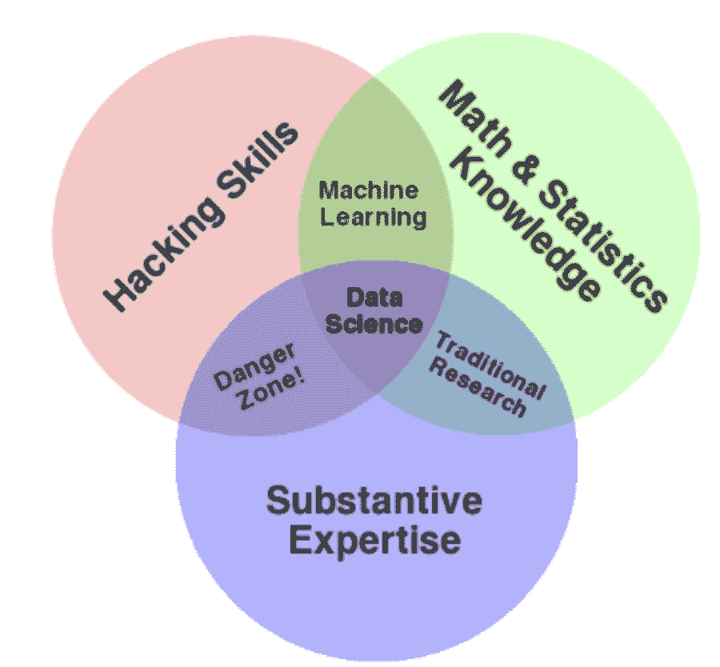
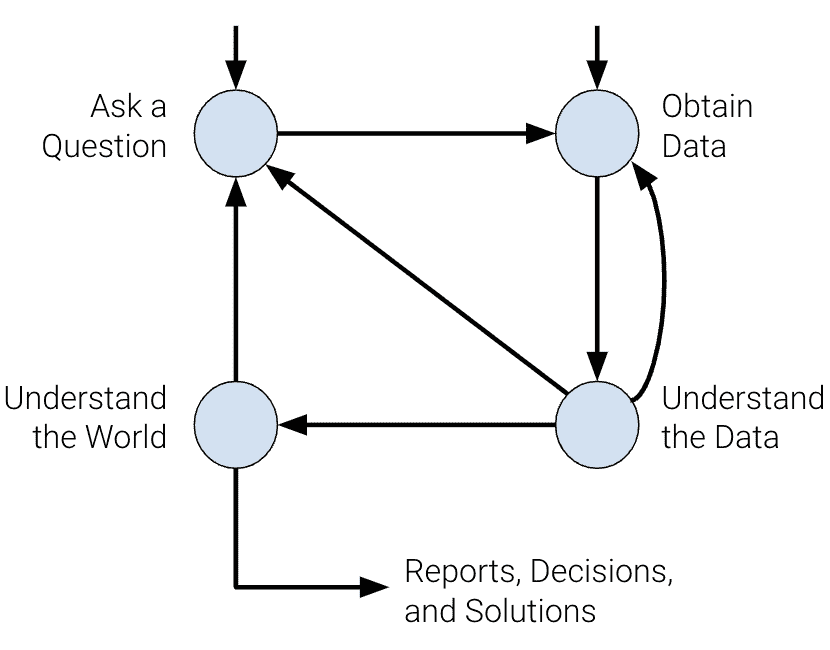
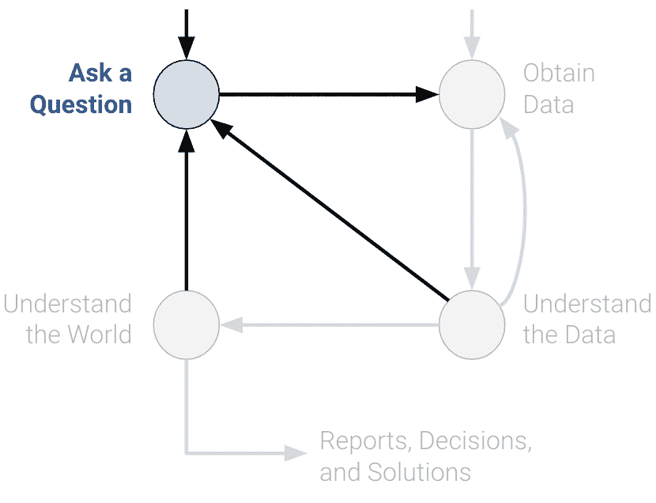
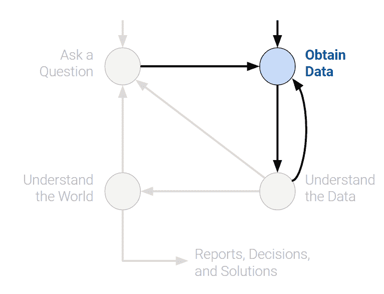
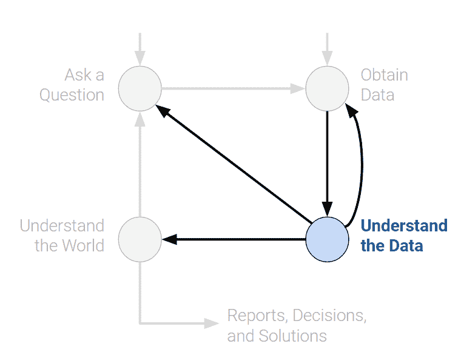
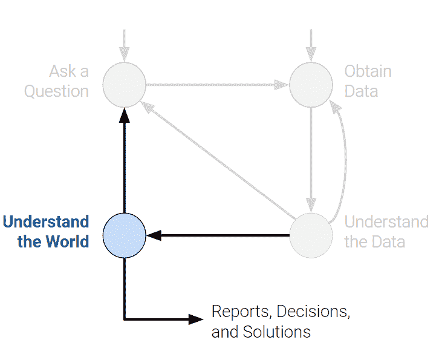

# 一、引言

> 原文：[Introduction](https://ds100.org/course-notes/intro_lec/introduction.html)
> 
> 译者：[飞龙](https://github.com/wizardforcel)
> 
> 协议：[CC BY-NC-SA 4.0](https://creativecommons.org/licenses/by-nc-sa/4.0/)

*学习成果* 

+   了解 Data 100 的总体目标

+   了解数据科学生命周期的阶段

数据科学是一个跨学科领域，具有各种应用，并且在解决具有挑战性的社会问题方面具有巨大潜力。通过建立数据科学技能，您可以赋予自己参与和引领塑造您的生活和整个社会对话的能力，无论是与气候变化作斗争、推出多样性倡议，还是其他方面。

这个领域正在迅速发展；现代数据科学中许多关键技术基础在 21 世纪初得到了普及。

它基本上是以人为中心的，并通过定量平衡权衡来促进决策。为了可靠地量化事物，我们必须适当地使用和分析数据，对每一步都要进行批判性思考和怀疑，并考虑我们的决定如何影响他人。

最终，数据科学是将以数据为中心的、计算性的和推理性的思维应用于：

+   了解世界（科学）。

+   解决问题（工程）。

对数据科学的真正掌握需要深刻的理论理解和对领域专业知识的牢固掌握。本课程将帮助您建立在前者基础上的技术知识，使您能够获取数据并对世界上最具挑战性和模糊的问题产生有用的见解。

*课程目标* 

+   为您准备伯克利高级课程，包括数据管理、机器学习和统计学

+   使您能够在数据科学领域开展职业生涯

+   使您能够通过计算和推理思维解决现实世界的问题

*我们将涵盖的一些主题*

+   Pandas 和 NumPy

+   探索性数据分析

+   正则表达式

+   可视化

+   抽样

+   模型设计和损失公式

+   线性回归

+   梯度下降

+   逻辑回归

+   还有更多！

为了让您成功，我们将 Data 100 中的概念组织成了**数据科学生命周期**：一个*迭代*过程，涵盖了数据科学的各种统计和计算构建模块。

## 1.1 数据科学生命周期

数据科学生命周期是对数据科学工作流程的高级概述。这是一个数据科学家在对数据驱动的问题进行彻底分析时应该探索的阶段循环。

数据科学生命周期中存在许多关键思想的变体。在 Data 100 中，我们使用流程图来可视化生命周期的各个阶段。请注意，有两个入口点。

### 1.1.1 提出问题

无论是出于好奇还是出于必要，数据科学家不断提出问题。例如，在商业世界中，数据科学家可能对预测某项投资产生的利润感兴趣。在医学领域，他们可能会问一些患者是否比其他人更有可能从治疗中受益。

提出问题是数据科学生命周期开始的主要方式之一。它有助于充分定义问题。在构建问题之前，以下是一些您应该问自己的事情。

+   我们想要知道什么？

    +   一个过于模糊的问题可能会导致混乱。

+   我们试图解决什么问题？

    +   问一个问题的目标应该是清晰的，以便为利益相关者的努力提供合理的理由。

+   我们想要测试的假设是什么？

    +   这为我们提供了一个清晰的视角，以分析最终结果。

+   我们的成功指标是什么？

    +   这为我们建立了一个明确的观点，知道何时结束项目。

### 1.1.2 获取数据

生命周期的第二个入口是通过获取数据。对任何问题的仔细分析都需要使用数据。数据可能对我们而言是 readily available，或者我们可能不得不着手收集数据。在这样做时，至关重要的是要问以下问题：

+   我们有什么数据，我们需要什么数据？

    +   定义数据的单位（人、城市、时间点等）和要测量的特征。

+   我们如何取样更多的数据？

    +   抓取网页，手动收集，进行实验等。

+   我们的数据是否代表我们想研究的人群？

    +   如果我们的数据不代表我们感兴趣的人群，那么我们可能得出错误的结论。

关键程序：*数据获取*，*数据清洗*

### 1.1.3 理解数据

原始数据本身并不具有固有的用处。如果不仔细调查，就不可能辨别出所有变量之间的模式和关系。因此，将纯数据转化为可操作的见解是数据科学家的一项关键工作。例如，我们可以选择问：

+   我们的数据是如何组织的，它包含了什么？

    +   了解数据对世界有何影响有助于我们更好地理解世界。

+   我们有相关的数据吗？

    +   如果我们收集的数据对于手头的问题没有用处，那么我们必须收集更多的数据。

+   数据中存在什么偏见、异常或其他问题？

    +   如果忽视这些问题，可能会导致许多错误的结论，因此数据科学家必须始终注意这些问题。

+   我们如何转换数据以进行有效分析？

    +   数据并不总是一眼就容易解释的，因此数据科学家应该努力揭示隐藏的见解。

关键程序：*探索性数据分析*，*数据可视化*。

### 1.1.4 理解世界

在观察了数据中的模式之后，我们可以开始回答我们的问题。这可能需要我们预测一个数量（机器学习），或者衡量某种处理的效果（推断）。

从这里，我们可以选择报告我们的结果，或者可能进行更多的分析。我们可能对我们的发现不满意，或者我们的初步探索可能提出了需要新数据的新问题。

+   数据对世界有何影响？

    +   根据我们的模型，数据将引导我们对真实世界的某些结论。

+   它是否回答了我们的问题或准确解决了问题？

    +   如果我们的模型和数据不能实现我们的目标，那么我们必须改革我们的问题、模型，或者两者兼而有之。

+   我们的结论有多可靠，我们能相信这些预测吗？

    +   不准确的模型可能导致错误的结论。

关键程序：*模型创建*，*预测*，*推断*。

## 1.2 结论

数据科学生命周期旨在成为一组一般性指导方针，而不是一套硬性要求。在探索生命周期的过程中，我们将涵盖数据科学中使用的基本理论和技术。在课程结束时，我们希望您开始把自己看作是一名数据科学家。

因此，我们将首先介绍探索性数据分析中最重要的工具之一：`pandas`。
