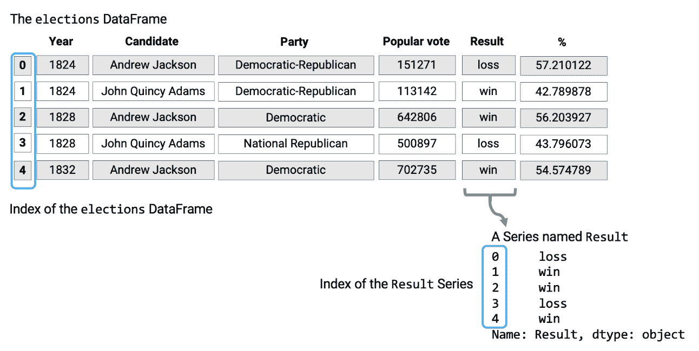
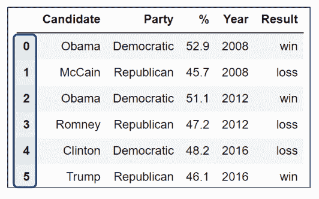
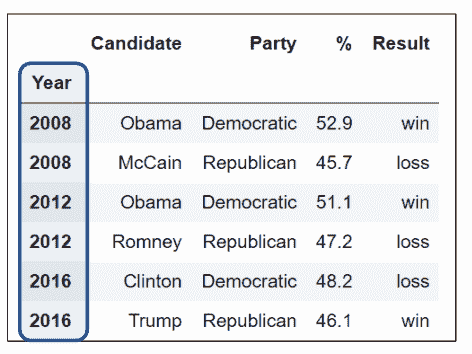
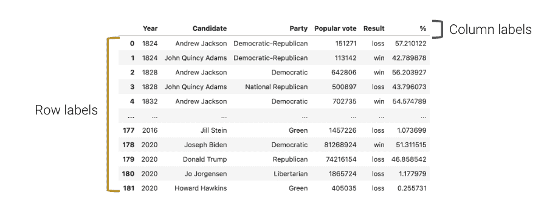

# 二、Pandas I

> 原文：[Pandas I](https://ds100.org/course-notes/pandas_1/pandas_1.html)
> 
> 译者：[飞龙](https://github.com/wizardforcel)
> 
> 协议：[CC BY-NC-SA 4.0](https://creativecommons.org/licenses/by-nc-sa/4.0/)

*学习成果*

+   建立对`pandas`和`pandas`语法的熟悉度。

+   学习关键数据结构：`DataFrame`、`Series`和`Index`。

+   了解提取数据的方法：`.loc`、`.iloc`和`[]`。

在这一系列讲座中，我们将让您直接探索和操纵真实世界的数据。我们将首先介绍`pandas`，这是一个流行的 Python 库，用于与**表格数据**交互。

## 2.1 表格数据

数据科学家使用各种格式存储的数据。本课程的主要重点是理解*表格数据*——存储在表格中的数据。

表格数据是数据科学家用来组织数据的最常见系统之一。这在很大程度上是因为表格的简单性和灵活性。表格允许我们将每个**观察**，或者从个体收集数据的实例，表示为其自己的*行*。我们可以将每个观察的不同特征，或者**特征**，记录在单独的*列*中。

为了看到这一点，我们将探索`elections`数据集，该数据集存储了以前年份竞选美国总统的政治候选人的信息。

代码

```py
import pandas as pd
pd.read_csv("data/elections.csv")
```

|  | Year | Candidate | Party | Popular vote | Result | % |
| --- | --- | --- | --- | --- | --- | --- |
| 0 | 1824 | Andrew Jackson | Democratic-Republican | 151271 | loss | 57.210122 |
| 1 | 1824 | John Quincy Adams | Democratic-Republican | 113142 | win | 42.789878 |
| 2 | 1828 | Andrew Jackson | Democratic | 642806 | win | 56.203927 |
| 3 | 1828 | John Quincy Adams | National Republican | 500897 | loss | 43.796073 |
| 4 | 1832 | Andrew Jackson | Democratic | 702735 | win | 54.574789 |
| ... | ... | ... | ... | ... | ... | ... |
| 177 | 2016 | Jill Stein | Green | 1457226 | loss | 1.073699 |
| 178 | 2020 | Joseph Biden | Democratic | 81268924 | win | 51.311515 |
| 179 | 2020 | Donald Trump || Republican | 74216154 | loss | 46.858542 |
| 180 | 2020 | Jo Jorgensen | Libertarian | 1865724 | loss | 1.177979 |
| 181 | 2020 | Howard Hawkins | Green | 405035 | loss | 0.255731 |

182 行×6 列

在`elections`数据集中，每一行代表一个候选人在特定年份竞选总统的一个实例。例如，第一行代表安德鲁·杰克逊在 1824 年竞选总统。每一列代表每个总统候选人的一个特征信息。例如，名为“结果”的列存储候选人是否赢得选举。

你在 Data 8 中的工作帮助你非常熟悉使用和解释以表格格式存储的数据。那时，你使用了`datascience`库的`Table`类，这是专门为 Data 8 学生创建的特殊编程库。

在 Data 100 中，我们将使用编程库`pandas`，这在数据科学界被普遍接受为操纵表格数据的行业和学术标准工具（也是我们熊猫吉祥物 Petey 的灵感来源）。

使用`pandas`，我们可以

+   以表格格式排列数据。

+   提取由特定条件过滤的有用信息。

+   对数据进行操作以获得新的见解。

+   将`NumPy`函数应用于我们的数据（我们来自 Data 8 的朋友）。

+   执行矢量化计算以加快我们的分析速度（实验室 1）。

## 2.2 `Series`、`DataFrame`和索引

要开始我们在`pandas`中的工作，我们必须首先将库导入到我们的 Python 环境中。这将允许我们在我们的代码中使用`pandas`数据结构和方法。

```py
# `pd` is the conventional alias for Pandas, as `np` is for NumPy
import pandas as pd
```

`pandas`中有三种基本数据结构：

1.  **Series**：1D 带标签的数组数据；最好将其视为列数据。

1.  **DataFrame**：带有行和列的 2D 表格数据。

1.  **索引**：一系列行/列标签。

`DataFrame`，`Series`和索引可以在以下图表中以可视化方式表示，该图表考虑了`elections`数据集的前几行。



注意**DataFrame**是一个二维对象——它包含行和列。上面的**Series**是这个`DataFrame`的一个单独的列，即`Result`列。两者都包含一个**索引**，或者共享的行标签列表（从 0 到 4 的整数，包括 0）。

### 2.2.1 系列

Series 表示`DataFrame`的一列；更一般地，它可以是任何 1 维类似数组的对象。它包含：

+   相同类型的**值**序列。

+   索引称为数据标签的序列。

在下面的单元格中，我们创建了一个名为`s`的`Series`。

```py
s = pd.Series(["welcome", "to", "data 100"])
s
```

```py
0     welcome
1          to
2    data 100
dtype: object
```

```py
s.values # Data values contained within the Series
```

```py
array(['welcome', 'to', 'data 100'], dtype=object)
```

```py
s.index # The Index of the Series
```

```py
RangeIndex(start=0, stop=3, step=1)
```

默认情况下，Series 的索引是从 0 开始的整数的顺序列表。可以将所需索引的手动指定列表传递给`index`参数。

```py
s = pd.Series([-1, 10, 2], index = ["a", "b", "c"])
s
```

```py
a    -1
b    10
c     2
dtype: int64
```

```py
s.index
```

```py
Index(['a', 'b', 'c'], dtype='object')
```

初始化后也可以更改索引。

```py
s.index = ["first", "second", "third"]
s
```

```py
first     -1
second    10
third      2
dtype: int64
```

```py
s.index
```

```py
Index(['first', 'second', 'third'], dtype='object')
```

#### 2.2.1.1 `Series`中的选择

就像在使用`NumPy`数组时一样，我们可以从`Series`中选择单个值或一组值。为此，有三种主要方法：

1.  单个标签。

1.  标签列表。

1.  过滤条件。

为了证明这一点，让我们定义`ser`系列。

```py
ser = pd.Series([4, -2, 0, 6], index = ["a", "b", "c", "d"])
ser
```

```py
a    4
b   -2
c    0
d    6
dtype: int64
```

##### 2.2.1.1.1 单个标签

```py
ser["a"] # We return the value stored at the Index label "a"
```

```py
4
```

##### 2.2.1.1.2 标签列表

```py
ser[["a", "c"]] # We return a *Series* of the values stored at the Index labels "a" and "c"
```

```py
a    4
c    0
dtype: int64
```

##### 2.2.1.1.3 过滤条件

也许从`Series`中选择数据的最有趣（和有用）的方法是使用过滤条件。

首先，我们对`Series`应用布尔运算。这将创建**一个新的布尔值系列**。

```py
ser > 0 # Filter condition: select all elements greater than 0
```

```py
a     True
b    False
c    False
d     True
dtype: bool
```

然后，我们使用这个布尔条件来索引我们原始的`Series`。`pandas`将只选择原始`Series`中满足条件的条目。

```py
ser[ser > 0] 
```

```py
a    4
d    6
dtype: int64
```

### 2.2.2 数据框

通常，我们将使用`Series`的角度来处理它们，认为它们是`DataFrame`中的列。我们可以将**DataFrame**视为所有共享相同**索引**的**Series**的集合。

在 Data 8 中，您遇到了`datascience`库的`Table`类，它表示表格数据。在 Data 100 中，我们将使用`pandas`库的`DataFrame`类。

#### 2.2.2.1 创建`DataFrame`

有许多创建`DataFrame`的方法。在这里，我们将介绍最流行的方法：

1.  从 CSV 文件中。

1.  使用列名和列表。

1.  从字典中。

1.  从`Series`中。

更一般地，创建`DataFrame`的语法是：`pandas.DataFrame(data, index, columns)`。

##### 2.2.2.1.1 从 CSV 文件中

在 Data 100 中，我们的数据通常以 CSV（逗号分隔值）文件格式存储。我们可以通过将数据路径作为参数传递给以下`pandas`函数来将 CSV 文件导入`DataFrame`。

`pd.read_csv("filename.csv")`

现在，我们可以认识到`pandas` DataFrame 表示的是`elections`数据集。

```py
elections = pd.read_csv("data/elections.csv")
elections
```

|  | Year | Candidate | Party | Popular vote | Result | % |
| --- | --- | --- | --- | --- | --- | --- |
| 0 | 1824 | Andrew Jackson | Democratic-Republican | 151271 | loss | 57.210122 |
| 1 | 1824 | John Quincy Adams | Democratic-Republican | 113142 | win | 42.789878 |
| 2 | 1828 | Andrew Jackson | Democratic | 642806 | win | 56.203927 |
| 3 | 1828 | John Quincy Adams | National Republican | 500897 | loss | 43.796073 |
| 4 | 1832 | Andrew Jackson | Democratic | 702735 | win | 54.574789 |
| ... | ... | ... | ... | ... | ... | ... |
| 177 | 2016 | Jill Stein | Green | 1457226 | loss | 1.073699 |
| 178 | 2020 | Joseph Biden | Democratic | 81268924 | win | 51.311515 |
| 179 | 2020 | Donald Trump | Republican | 74216154 | loss | 46.858542 |
| 180 | 2020 | Jo Jorgensen | Libertarian | 1865724 | loss | 1.177979 |
| 181 | 2020 | Howard Hawkins | Green | 405035 | loss | 0.255731 |

182 行×6 列

这段代码将我们的`DataFrame`对象存储在“选举”变量中。经过检查，我们的“选举”DataFrame 有 182 行和 6 列（“年份”，“候选人”，“党派”，“普选票”，“结果”，“%”）。每一行代表一条记录——在我们的例子中，是某一年的总统候选人。每一列代表记录的一个属性或特征。

##### 2.2.2.1.2 使用列表和列名

我们现在将探讨如何使用我们自己的数据创建`DataFrame`。

考虑以下例子。第一个代码单元创建了一个只有一个列`Numbers`的`DataFrame`。第二个创建了一个有`Numbers`和`Description`两列的`DataFrame`。请注意，需要一个二维值列表来初始化第二个`DataFrame`——每个嵌套列表代表一行数据。

```py
df_list = pd.DataFrame([1, 2, 3], columns=["Numbers"])
df_list
```

|  | Numbers |
| --- | --- |
| 0 | 1 |
| 1 | 2 |
| 2 | 3 |

```py
df_list = pd.DataFrame([[1, "one"], [2, "two"]], columns = ["Number", "Description"])
df_list
```

|  | Numbers | Description |
| --- | --- | --- |
| 0 | 1 | one |
| 1 | 2 | two |

##### 2.2.2.1.3 从字典

第三种（更常见的）创建`DataFrame`的方法是使用字典。字典的键代表列名，字典的值代表列的值。

以下是实现这种方法的两种方式。第一种是基于指定`DataFrame`的列，而第二种是基于指定`DataFrame`的行。

```py
df_dict = pd.DataFrame({"Fruit": ["Strawberry", "Orange"], "Price": [5.49, 3.99]})
df_dict
```

|  | Fruit | Price |
| --- | --- | --- |
| 0 | Strawberry | 5.49 |
| 1 | Orange | 3.99 |

```py
df_dict = pd.DataFrame([{"Fruit":"Strawberry", "Price":5.49}, {"Fruit": "Orange", "Price":3.99}])
df_dict
```

|  | Fruit | Price |
| --- | --- | --- |
| 0 | Strawberry | 5.49 |
| 1 | Orange | 3.99 |

##### 2.2.2.1.4 从`Series`

早些时候，我们解释了`Series`与`DataFrame`中的列是同义词。因此，`DataFrame`相当于共享相同索引的`Series`集合。

事实上，我们可以通过合并两个或更多的`Series`来初始化`DataFrame`。

```py
# Notice how our indices, or row labels, are the same

s_a = pd.Series(["a1", "a2", "a3"], index = ["r1", "r2", "r3"])
s_b = pd.Series(["b1", "b2", "b3"], index = ["r1", "r2", "r3"])

pd.DataFrame({"A-column": s_a, "B-column": s_b})
```

|  | A-column | B-column |
| --- | --- | --- |
| r1 | a1 | b1 |
| r2 | a2 | b2 |
| r3 | a3 | b3 |

```py
pd.DataFrame(s_a)
```

|  | 0 |
| --- | --- |
| r1 | a1 |
| r2 | a2 |
| r3 | a3 |

```py
s_a.to_frame()
```

|  | 0 |
| --- | --- |
| r1 | a1 |
| r2 | a2 |
| r3 | a3 |

### 2.2.3 索引

在技术上，索引不一定是整数，也不一定是唯一的。例如，我们可以将“选举”DataFrame 的索引设置为总统候选人的名字。

```py
# Creating a DataFrame from a CSV file and specifying the Index column
elections = pd.read_csv("data/elections.csv", index_col = "Candidate")
elections
```

|  | Year | Party | Popular vote | Result | % |
| --- | --- | --- | --- | --- | --- |
| Candidate |  |  |  |  |  |
| Andrew Jackson | 1824 | Democratic-Republican | 151271 | loss | 57.210122 |
| John Quincy Adams | 1824 | Democratic-Republican | 113142 | win | 42.789878 |
| Andrew Jackson | 1828 | Democratic | 642806 | win | 56.203927 |
| John Quincy Adams | 1828 | National Republican | 500897 | loss | 43.796073 |
| Andrew Jackson | 1832 | Democratic | 702735 | win | 54.574789 |
| ... | ... | ... | ... | ... | ... |
| Jill Stein | 2016 | Green | 1457226 | loss | 1.073699 |
| Joseph Biden | 2020 | Democratic | 81268924 | win | 51.311515 |
| Donald Trump | 2020 | Republican | 74216154 | loss | 46.858542 |
| Jo Jorgensen | 2020 | Libertarian | 1865724 | loss | 1.177979 |
| Howard Hawkins | 2020 | Green | 405035 | loss | 0.255731 |

182 行×5 列

我们还可以选择一个新的列，并将其设置为 DataFrame 的索引。例如，我们可以将“选举”DataFrame 的索引设置为候选人的党派。

```py
elections.reset_index(inplace = True) # Resetting the index so we can set the Index again
# This sets the index to the "Party" column
elections.set_index("Party")
```

|  | Candidate | Year | Popular vote | Result | % |
| --- | --- | --- | --- | --- | --- |
| Party |  |  |  |  |  |
| Democratic-Republican | Andrew Jackson | 1824 | 151271 | loss | 57.210122 |
| Democratic-Republican | John Quincy Adams | 1824 | 113142 | win | 42.789878 |
| Democratic | Andrew Jackson | 1828 | 642806 | win | 56.203927 |
| National Republican | John Quincy Adams | 1828 | 500897 | loss | 43.796073 |
| Democratic | Andrew Jackson | 1832 | 702735 | win | 54.574789 |
| ... | ... | ... | ... | ... | ... |
| Green | Jill Stein | 2016 | 1457226 | loss | 1.073699 |
| Democratic | Joseph Biden | 2020 | 81268924 | win | 51.311515 |
| Republican | Donald Trump || 2020 | 74216154 | loss | 46.858542 |
| Libertarian | Jo Jorgensen | 2020 | 1865724 | loss | 1.177979 |
| Green | Howard Hawkins | 2020 | 405035 | loss | 0.255731 |

182 行×5 列

如果需要，我们可以将索引恢复为默认的整数列表。

```py
# This resets the index to be the default list of integer
elections.reset_index(inplace=True) 
elections.index
```

```py
RangeIndex(start=0, stop=182, step=1)
```

还需要注意的是，构成索引的行标签不一定是唯一的。虽然索引值可以是唯一的和数字的，充当行号，但它们也可以是命名的和非唯一的。

这里我们看到唯一和数字的索引值。

然而，这里的索引值是非唯一的。

## 2.3 `DataFrame`属性：索引、列和形状

另一方面，`DataFrame`中的列名几乎总是唯一的。回顾`elections`数据集，有两列命名为`Candidate`是没有意义的。

有时，您可能希望提取这些不同的值，特别是行和列标签的列表。

对于索引/行标签，请使用`DataFrame.index`：

```py
elections.set_index("Party", inplace = True)
elections.index
```

```py
Index(['Democratic-Republican', 'Democratic-Republican', 'Democratic',
       'National Republican', 'Democratic', 'National Republican',
       'Anti-Masonic', 'Whig', 'Democratic', 'Whig',
       ...
       'Constitution', 'Republican', 'Independent', 'Libertarian',
       'Democratic', 'Green', 'Democratic', 'Republican', 'Libertarian',
       'Green'],
      dtype='object', name='Party', length=182)
```

对于列标签，请使用`DataFrame.columns`：

```py
elections.columns
```

```py
Index(['index', 'Candidate', 'Year', 'Popular vote', 'Result', '%'], dtype='object')
```

对于 DataFrame 的形状，我们可以使用`DataFrame.shape`：

```py
elections.shape
```

```py
(182, 6)
```

## 2.4 `DataFrame`中的切片

现在我们已经更多地了解了`DataFrame`，让我们深入了解它们的功能。

`DataFrame`类的 API（应用程序编程接口）是庞大的。在本节中，我们将讨论`DataFrame` API 的几种方法，这些方法允许我们提取数据子集。

操作`DataFrame`最简单的方法是提取行和列的子集，称为**切片**。

我们可能希望提取数据的常见方式包括：

+   `DataFrame`中的第一行或最后一行。

+   具有特定标签的数据。

+   特定位置的数据。

我们将使用 DataFrame 类的四种主要方法：

1.  `.head`和`.tail`

1.  `.loc`

1.  `.iloc`

1.  `[]`

### 2.4.1 使用`.head`和`.tail`提取数据

我们希望提取数据的最简单的情况是当我们只想选择`DataFrame`的前几行或最后几行时。

要提取 DataFrame `df`的前`n`行，我们使用语法`df.head(n)`。

```py
elections = pd.read_csv("data/elections.csv")

# Extract the first 5 rows of the DataFrame
elections.head(5)
```

|  | Year | Candidate | Party | Popular vote | Result | % |
| --- | --- | --- | --- | --- | --- | --- |
| 0 | 1824 | Andrew Jackson | Democratic-Republican | 151271 | loss | 57.210122 |
| 1 | 1824 | John Quincy Adams | Democratic-Republican | 113142 | win | 42.789878 |
| 2 | 1828 | Andrew Jackson | Democratic | 642806 | win | 56.203927 |
| 3 | 1828 | John Quincy Adams | National Republican | 500897 | loss | 43.796073 |
| 4 | 1832 | Andrew Jackson | Democratic | 702735 | win | 54.574789 |

类似地，调用`df.tail(n)`允许我们提取 DataFrame 的最后`n`行。

```py
# Extract the last 5 rows of the DataFrame
elections.tail(5)
```

|  | Year | Candidate | Party | Popular vote | Result | % |
| --- | --- | --- | --- | --- | --- | --- |
| 177 | 2016 | Jill Stein | Green | 1457226 | loss | 1.073699 |
| 178 | 2020 | Joseph Biden | Democratic | 81268924 | win | 51.311515 |
| 179 | 2020 | Donald Trump || Republican | 74216154 | loss | 46.858542 |
| 180 | 2020 | Jo Jorgensen | Libertarian | 1865724 | loss | 1.177979 |
| 181 | 2020 | Howard Hawkins | Green | 405035 | loss | 0.255731 |

### 2.4.2 基于标签的提取：使用`.loc`进行索引

对于使用特定列或索引标签提取数据的更复杂任务，我们可以使用`.loc`。`.loc`访问器允许我们指定我们希望提取的行和列的***标签***。**标签**（通常称为**索引**）是 DataFrame 最左边的粗体文本，而**列标签**是 DataFrame 顶部的列名。



使用`.loc`获取数据时，我们必须指定数据所在的行和列标签。行标签是`.loc`函数的第一个参数；列标签是第二个参数。

`.loc`的参数可以是：

+   一个单一的值。

+   一个切片。

+   一个列表。

例如，要选择单个值，我们可以从`elections` `DataFrame`中选择标记为`0`的行和标记为`Candidate`的列。

```py
elections.loc[0, 'Candidate']
```

```py
'Andrew Jackson'
```

请记住，只传入一个参数作为单个值将产生一个`Series`。下面，我们提取了`"Popular vote"`列的子集作为`Series`。

```py
elections.loc[[87, 25, 179], "Popular vote"]
```

```py
87     15761254
25       848019
179    74216154
Name: Popular vote, dtype: int64
```

要选择*多个*行和列，我们可以使用 Python 切片表示法。在这里，我们选择从标签`0`到`3`的行和从标签`"Year"`到`"Popular vote"`的列。

```py
elections.loc[0:3, 'Year':'Popular vote']
```

|  | Year | Candidate | Party | Popular vote |
| --- | --- | --- | --- | --- |
| 0 | 1824 | Andrew Jackson | Democratic-Republican | 151271 |
| 1 | 1824 | John Quincy Adams | Democratic-Republican | 113142 |
| 2 | 1828 | Andrew Jackson | Democratic | 642806 |
| 3 | 1828 | John Quincy Adams | National Republican | 500897 |

假设相反，我们想要提取`elections` DataFrame 中前四行的*所有*列值。这时，缩写`:`就很有用。

```py
elections.loc[0:3, :]
```

|  | Year | Candidate | Party | Popular vote | Result | % |
| --- | --- | --- | --- | --- | --- | --- |
| 0 | 1824 | Andrew Jackson | Democratic-Republican | 151271 | loss | 57.210122 |
| 1 | 1824 | John Quincy Adams | Democratic-Republican | 113142 | win | 42.789878 |
| 2 | 1828 | Andrew Jackson | Democratic | 642806 | win | 56.203927 |
| 3 | 1828 | John Quincy Adams | National Republican | 500897 | loss | 43.796073 |

我们可以使用相同的缩写来提取所有行。

```py
elections.loc[:, ["Year", "Candidate", "Result"]]
```

|  | Year | Candidate | Result |
| --- | --- | --- | --- |
| 0 | 1824 | Andrew Jackson | loss |
| 1 | 1824 | John Quincy Adams | win |
| 2 | 1828 | Andrew Jackson | win |
| 3 | 1828 | John Quincy Adams | loss |
| 4 | 1832 | Andrew Jackson | win |
| ... | ... | ... | ... |
| 177 | 2016 | Jill Stein | loss |
| 178 | 2020 | Joseph Biden | win |
| 179 | 2020 | Donald Trump || loss |
| 180 | 2020 | Jo Jorgensen | loss |
| 181 | 2020 | Howard Hawkins | loss |

182 行×3 列

有几件事情我们应该注意。首先，与传统的 Python 不同，`pandas`允许我们切片字符串值（在我们的例子中，是列标签）。其次，使用`.loc`进行切片是*包含*的。请注意，我们的结果`DataFrame`包括我们指定的切片标签之间和包括这些标签的每一行和列。

同样，我们可以使用列表在`elections` DataFrame 中获取多行和多列。

```py
elections.loc[[0, 1, 2, 3], ['Year', 'Candidate', 'Party', 'Popular vote']]
```

|  | Year | Candidate | Party | Popular vote |
| --- | --- | --- | --- | --- |
| 0 | 1824 | Andrew Jackson | Democratic-Republican | 151271 |
| 1 | 1824 | John Quincy Adams | Democratic-Republican | 113142 |
| 2 | 1828 | Andrew Jackson | Democratic | 642806 |
| 3 | 1828 | John Quincy Adams | National Republican | 500897 |

最后，我们可以互换列表和切片表示法。

```py
elections.loc[[0, 1, 2, 3], :]
```

|  | Year | Candidate | Party | Popular vote | Result | % |
| --- | --- | --- | --- | --- | --- | --- |
| 0 | 1824 | Andrew Jackson | Democratic-Republican | 151271 | loss | 57.210122 |
| 1 | 1824 | John Quincy Adams | Democratic-Republican | 113142 | win | 42.789878 |
| 2 | 1828 | Andrew Jackson | Democratic | 642806 | win | 56.203927 |
| 3 | 1828 | John Quincy Adams | National Republican | 500897 | loss | 43.796073 |

### 2.4.3 基于整数的提取：使用`.iloc`进行索引

使用`.iloc`进行切片与`.loc`类似。但是，`.iloc`使用的是行和列的*索引位置*，而不是标签（想一想：**l**oc 使用**l**abels；**i**loc 使用**i**ndices）。`.iloc`函数的参数也类似地行为 —— 允许单个值、列表、索引和这些的任意组合。

让我们开始重现上面的结果。我们将从我们的`elections` DataFrame 中选择第一个总统候选人开始：

```py
# elections.loc[0, "Candidate"] - Previous approach
elections.iloc[0, 1]
```

```py
'Andrew Jackson'
```

请注意，`.loc`和`.iloc`的第一个参数是相同的。这是因为标签为 0 的行恰好在`elections` DataFrame 的$0^{th}$（或者说第一个位置）上。通常情况下，任何 DataFrame 中的行标签都是从 0 开始递增的，这一点是正确的。 

并且，就像以前一样，如果我们只传入一个单一的值参数，我们的结果将是一个`Series`。

```py
elections.iloc[[1,2,3],1]
```

```py
1    John Quincy Adams
2       Andrew Jackson
3    John Quincy Adams
Name: Candidate, dtype: object
```

然而，当我们使用`.iloc`选择前四行和列时，我们注意到了一些东西。

```py
# elections.loc[0:3, 'Year':'Popular vote'] - Previous approach
elections.iloc[0:4, 0:4]
```

|  | Year | Candidate | Party | Popular vote |
| --- | --- | --- | --- | --- |
| 0 | 1824 | Andrew Jackson | Democratic-Republican | 151271 |
| 1 | 1824 | John Quincy Adams | Democratic-Republican | 113142 |
| 2 | 1828 | Andrew Jackson | Democratic | 642806 |
| 3 | 1828 | John Quincy Adams | National Republican | 500897 |

切片在`.iloc`中不再是包容的——它是*排他的*。换句话说，使用`.iloc`时，切片的右端点不包括在内。这是`pandas`语法的微妙之处之一；通过练习你会习惯的。

列表行为与预期的一样。

```py
#elections.loc[[0, 1, 2, 3], ['Year', 'Candidate', 'Party', 'Popular vote']] - Previous Approach
elections.iloc[[0, 1, 2, 3], [0, 1, 2, 3]]
```

|  | Year | Candidate | Party | Popular vote |
| --- | --- | --- | --- | --- |
| 0 | 1824 | Andrew Jackson | Democratic-Republican | 151271 |
| 1 | 1824 | John Quincy Adams | Democratic-Republican | 113142 |
| 2 | 1828 | Andrew Jackson | Democratic | 642806 |
| 3 | 1828 | John Quincy Adams | National Republican | 500897 |

就像使用`.loc`一样，我们可以使用冒号与`.iloc`一起提取所有行或列。

```py
elections.iloc[:, 0:3]
```

|  | Year | Candidate | Party |
| --- | --- | --- | --- |
| 0 | 1824 | Andrew Jackson | Democratic-Republican |
| 1 | 1824 | John Quincy Adams | Democratic-Republican |
| 2 | 1828 | Andrew Jackson | Democratic |
| 3 | 1828 | John Quincy Adams | National Republican |
| 4 | 1832 | Andrew Jackson | Democratic |
| ... | ... | ... | ... |
| 177 | 2016 | Jill Stein | Green |
| 178 | 2020 | Joseph Biden | Democratic |
| 179 | 2020 | Donald Trump | Republican |
| 180 | 2020 | Jo Jorgensen | Libertarian |
| 181 | 2020 | Howard Hawkins | Green |

182 行×3 列

这个讨论引出了一个问题：我们什么时候应该使用`.loc`和`.iloc`？在大多数情况下，`.loc`通常更安全。你可以想象，当应用于数据集的顺序可能会改变时，`.iloc`可能会返回不正确的值。然而，`.iloc`仍然是有用的——例如，如果你正在查看一个排序好的电影收入的`DataFrame`，并且想要得到给定年份的收入中位数，你可以使用`.iloc`来索引到中间。

总的来说，重要的是要记住：

+   `.loc`执行**l**abel-based 提取。

+   `.iloc`执行**i**nteger-based 提取。

### 2.4.4 上下文相关的提取：使用`[]`进行索引

`[]`选择运算符是最令人困惑的，但也是最常用的。它只接受一个参数，可以是以下之一：

1.  一系列行号。

1.  一系列列标签。

1.  单列标签。

也就是说，`[]`是*上下文相关的*。让我们看一些例子。

#### 2.4.4.1 一系列行号

假设我们想要我们的`elections` DataFrame 的前四行。

```py
elections[0:4]
```

|  | Year | Candidate | Party | Popular vote | Result | % |
| --- | --- | --- | --- | --- | --- | --- |
| 0 | 1824 | Andrew Jackson | Democratic-Republican | 151271 | loss | 57.210122 |
| 1 | 1824 | John Quincy Adams | Democratic-Republican | 113142 | win | 42.789878 |
| 2 | 1828 | Andrew Jackson | Democratic | 642806 | win | 56.203927 |
| 3 | 1828 | John Quincy Adams | National Republican | 500897 | loss | 43.796073 |

#### 2.4.4.2 一系列列标签

假设我们现在想要前四列。

```py
elections[["Year", "Candidate", "Party", "Popular vote"]]
```

|  | Year | Candidate | Party | Popular vote |
| --- | --- | --- | --- | --- |
| 0 | 1824 | Andrew Jackson | Democratic-Republican | 151271 |
| 1 | 1824 | John Quincy Adams | Democratic-Republican | 113142 |
| 2 | 1828 | Andrew Jackson | Democratic | 642806 |
| 3 | 1828 | John Quincy Adams | National Republican | 500897 |
| 4 | 1832 | Andrew Jackson | Democratic | 702735 |
| ... | ... | ... | ... | ... |
| 177 | 2016 | Jill Stein | Green | 1457226 |
| 178 | 2020 | Joseph Biden | Democratic | 81268924 |
| 179 | 2020 | Donald Trump | Republican | 74216154 |
| 180 | 2020 | Jo Jorgensen | Libertarian | 1865724 |
| 181 | 2020 | Howard Hawkins | Green | 405035 |

182 行×4 列

#### 2.4.4.3 单列标签

最后，`[]`允许我们仅提取`Candidate`列。

```py
elections["Candidate"]
```

```py
0         Andrew Jackson
1      John Quincy Adams
2         Andrew Jackson
3      John Quincy Adams
4         Andrew Jackson
             ...        
177           Jill Stein
178         Joseph Biden
179         Donald Trump
180         Jo Jorgensen
181       Howard Hawkins
Name: Candidate, Length: 182, dtype: object
```

输出是一个`Series`！在本课程中，我们将非常熟悉`[]`，特别是用于选择列。在实践中，`[]`比`.loc`更常见，特别是因为它更加简洁。

## 2.5 结语

`pandas`库非常庞大，包含许多有用的函数。这是一个指向[文档](https://pandas.pydata.org/docs/)的链接。我们当然不指望您记住库中的每一个方法。

入门级的 Data 100 `pandas` 讲座将提供对关键数据结构和方法的高层次视图，这些将构成您`pandas`知识的基础。本课程的目标是帮助您建立对真实世界编程实践的熟悉度……谷歌搜索！您的问题的答案可以在文档、Stack Overflow 等地方找到。能够搜索、阅读和实施文档是任何数据科学家的重要生活技能。

有了这个，我们将继续学习 Pandas II。
