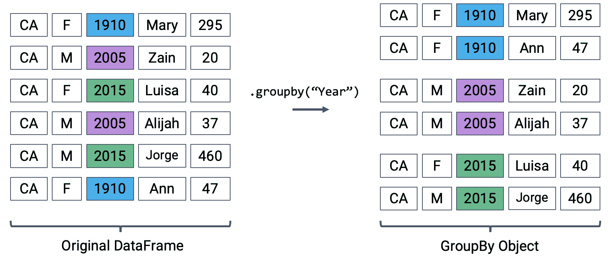
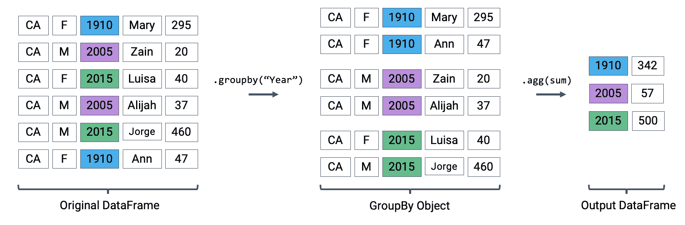
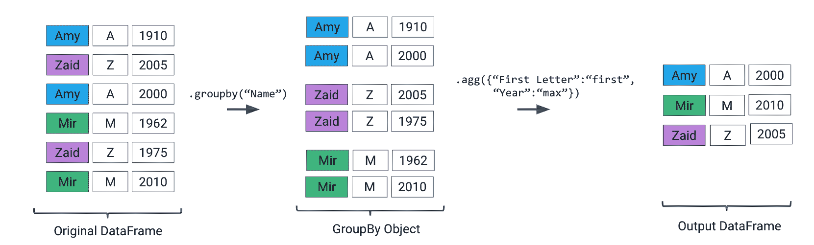

# 三、Pandas II

> 原文：[Pandas II](https://ds100.org/course-notes/pandas_2/pandas_2.html)
> 
> 译者：[飞龙](https://github.com/wizardforcel)
> 
> 协议：[CC BY-NC-SA 4.0](https://creativecommons.org/licenses/by-nc-sa/4.0/)

*学习成果*

+   继续熟悉`pandas`语法。

+   使用条件选择从`DataFrame`中提取数据。

+   识别聚合有用的情况，并确定执行聚合的正确技术。

上次，我们介绍了`pandas`库作为处理数据的工具包。我们学习了`DataFrame`和`Series`数据结构，熟悉了操作表格数据的基本语法，并开始编写我们的第一行`pandas`代码。

在本讲座中，我们将开始深入了解一些高级的`pandas`语法。当我们逐步学习这些新的代码片段时，您可能会发现跟着自己的笔记本会很有帮助。

我们将开始加载`babynames`数据集。

代码

```py
# This code pulls census data and loads it into a DataFrame
# We won't cover it explicitly in this class, but you are welcome to explore it on your own
import pandas as pd
import numpy as np
import urllib.request
import os.path
import zipfile

data_url = "https://www.ssa.gov/oact/babynames/state/namesbystate.zip"
local_filename = "data/babynamesbystate.zip"
if not os.path.exists(local_filename): # If the data exists don't download again
 with urllib.request.urlopen(data_url) as resp, open(local_filename, 'wb') as f:
 f.write(resp.read())

zf = zipfile.ZipFile(local_filename, 'r')

ca_name = 'STATE.CA.TXT'
field_names = ['State', 'Sex', 'Year', 'Name', 'Count']
with zf.open(ca_name) as fh:
 babynames = pd.read_csv(fh, header=None, names=field_names)

babynames.head()
```

|  | State | Sex | Year | Name | Count |
| --- | --- | --- | --- | --- | --- |
| 0 | CA | F | 1910 | Mary | 295 |
| 1 | CA | F | 1910 | Helen | 239 |
| 2 | CA | F | 1910 | Dorothy | 220 |
| 3 | CA | F | 1910 | Margaret | 163 |
| 4 | CA | F | 1910 | Frances | 134 |

## 3.1 条件选择

条件选择允许我们选择满足某些指定条件的`DataFrame`中的行的子集。

要了解如何使用条件选择，我们必须看一下`.loc`和`[]`方法的另一个可能的输入 - 布尔数组，它只是一个数组或`Series`，其中每个元素都是`True`或`False`。这个布尔数组的长度必须等于`DataFrame`中的行数。它将返回数组中对应`True`值的所有行。我们在上一堂课中从`Series`中执行条件提取时使用了非常类似的技术。

为了看到这一点，让我们选择我们`DataFrame`的前 10 行中的所有偶数索引行。

```py
# Ask yourself: why is :9 is the correct slice to select the first 10 rows?
babynames_first_10_rows = babynames.loc[:9, :]

# Notice how we have exactly 10 elements in our boolean array argument
babynames_first_10_rows[[True, False, True, False, True, False, True, False, True, False]]
```

|  | State | Sex | Year | Name | Count |
| --- | --- | --- | --- | --- | --- |
| 0 | CA | F | 1910 | Mary | 295 |
| 2 | CA | F | 1910 | Dorothy | 220 |
| 4 | CA | F | 1910 | Frances | 134 |
| 6 | CA | F | 1910 | Evelyn | 126 |
| 8 | CA | F | 1910 | Virginia | 101 |

我们可以使用`.loc`执行类似的操作。

```py
babynames_first_10_rows.loc[[True, False, True, False, True, False, True, False, True, False], :]
```

|  | State | Sex | Year | Name | Count |
| --- | --- | --- | --- | --- | --- |
| 0 | CA | F | 1910 | Mary | 295 |
| 2 | CA | F | 1910 | Dorothy | 220 |
| 4 | CA | F | 1910 | Frances | 134 |
| 6 | CA | F | 1910 | Evelyn | 126 |
| 8 | CA | F | 1910 | Virginia | 101 |

这些技术在这个例子中运行良好，但是你可以想象在更大的`DataFrame`中为每一行列出`True`和`False`可能会有多么乏味。为了简化事情，我们可以提供一个逻辑条件作为`.loc`或`[]`的输入，返回一个具有必要长度的布尔数组。

例如，要返回与`F`性别相关的所有名称：

```py
# First, use a logical condition to generate a boolean array
logical_operator = (babynames["Sex"] == "F")

# Then, use this boolean array to filter the DataFrame
babynames[logical_operator].head()
```

|  | State | Sex | Year | Name | Count |
| --- | --- | --- | --- | --- | --- |
| 0 | CA | F | 1910 | Mary | 295 |
| 1 | CA | F | 1910 | Helen | 239 |
| 2 | CA | F | 1910 | Dorothy | 220 |
| 3 | CA | F | 1910 | Margaret | 163 |
| 4 | CA | F | 1910 | Frances | 134 |

从上一讲中回忆，`.head()`将只返回`DataFrame`中的前几行。实际上，`babynames[logical operator]`包含与原始`babynames` `DataFrame`中性别为`"F"`的条目一样多的行。 

在这里，`logical_operator`评估为长度为 407428 的布尔值`Series`。

代码

```py
print("There are a total of {} values in 'logical_operator'".format(len(logical_operator)))
```

```py
There are a total of 407428 values in 'logical_operator'
```

从第 0 行开始到第 239536 行的行评估为`True`，因此在`DataFrame`中返回。从第 239537 行开始的行评估为`False`，因此在输出中被省略。

代码

```py
print("The 0th item in this 'logical_operator' is: {}".format(logical_operator.iloc[0]))
print("The 239536th item in this 'logical_operator' is: {}".format(logical_operator.iloc[239536]))
print("The 239537th item in this 'logical_operator' is: {}".format(logical_operator.iloc[239537]))
```

```py
The 0th item in this 'logical_operator' is: True
The 239536th item in this 'logical_operator' is: True
The 239537th item in this 'logical_operator' is: False
```

将`Series`作为`babynames[]`的参数传递与使用布尔数组具有相同的效果。实际上，`[]`选择运算符可以将布尔`Series`、数组和列表作为参数。在整个课程中，这三种方法可以互换使用。

我们也可以使用`.loc`来实现类似的结果。

```py
babynames.loc[babynames["Sex"] == "F"].head()
```

|  | State | Sex | Year | Name | Count |
| --- | --- | --- | --- | --- | --- |
| 0 | CA | F | 1910 | Mary | 295 |
| 1 | CA | F | 1910 | Helen | 239 |
| 2 | CA | F | 1910 | Dorothy | 220 |
| 3 | CA | F | 1910 | Margaret | 163 |
| 4 | CA | F | 1910 | Frances | 134 |

布尔条件可以使用各种位运算符进行组合，从而可以根据多个条件过滤结果。在下表中，p 和 q 是布尔数组或`Series`。

| 符号 | 用法 | 意义 |
| --- | --- | --- |
| `~` | `~p` | 返回 p 的否定 |
| <code>&#124;</code> | <code>p &#124; q</code> | p 或 q |
| `&` | `p & q` | p 和 q |
| `^` | `p ^ q` | p 异或 q（排他或） |

当使用逻辑运算符结合多个条件时，我们用一组括号`()`括起每个单独的条件。这样可以对`pandas`评估您的逻辑施加操作顺序，并可以避免代码错误。

例如，如果我们想要返回所有性别为`F`，出生在 2000 年之前的名字数据，我们可以写成：

```py
babynames[(babynames["Sex"] == "F") & (babynames["Year"] < 2000)].head()
```

|  | State | Sex | Year | Name | Count |
| --- | --- | --- | --- | --- | --- |
| 0 | CA | F | 1910 | Mary | 295 |
| 1 | CA | F | 1910 | Helen | 239 |
| 2 | CA | F | 1910 | Dorothy | 220 |
| 3 | CA | F | 1910 | Margaret | 163 |
| 4 | CA | F | 1910 | Frances | 134 |

如果我们想要返回所有性别为`F`或出生在 2000 年之前的所有名字数据，我们可以写成：

```py
babynames[(babynames["Sex"] == "F") | (babynames["Year"] < 2000)].head()
```

|  | State | Sex | Year | Name | Count |
| --- | --- | --- | --- | --- | --- |
| 0 | CA | F | 1910 | Mary | 295 |
| 1 | CA | F | 1910 | Helen | 239 |
| 2 | CA | F | 1910 | Dorothy | 220 |
| 3 | CA | F | 1910 | Margaret | 163 |
| 4 | CA | F | 1910 | Frances | 134 |

布尔数组选择是一个有用的工具，但对于复杂条件可能导致代码过于冗长。在下面的示例中，我们的布尔条件足够长，以至于需要多行代码来编写。

```py
# Note: The parentheses surrounding the code make it possible to break the code on to multiple lines for readability
(
 babynames[(babynames["Name"] == "Bella") | 
 (babynames["Name"] == "Alex") |
 (babynames["Name"] == "Ani") |
 (babynames["Name"] == "Lisa")]
).head()
```

|  | State | Sex | Year | Name | Count |
| --- | --- | --- | --- | --- | --- |
| 6289 | CA | F | 1923 | Bella | 5 |
| 7512 | CA | F | 1925 | Bella | 8 |
| 12368 | CA | F | 1932 | Lisa | 5 |
| 14741 | CA | F | 1936 | Lisa | 8 |
| 17084 | CA | F | 1939 | Lisa | 5 |

幸运的是，`pandas`提供了许多构建布尔过滤器的替代方法。

`.isin`函数就是一个例子。该方法评估`Series`中的值是否包含在不同序列（列表、数组或`Series`）的值中。在下面的单元格中，我们用更简洁的代码实现了与上面的`DataFrame`等效的结果。

```py
names = ["Bella", "Alex", "Narges", "Lisa"]
babynames["Name"].isin(names).head()
```

```py
0    False
1    False
2    False
3    False
4    False
Name: Name, dtype: bool
```

```py
babynames[babynames["Name"].isin(names)].head()
```

|  | State | Sex | Year | Name | Count |
| --- | --- | --- | --- | --- | --- |
| 6289 | CA | F | 1923 | Bella | 5 |
| 7512 | CA | F | 1925 | Bella | 8 |
| 12368 | CA | F | 1932 | Lisa | 5 |
| 14741 | CA | F | 1936 | Lisa | 8 |
| 17084 | CA | F | 1939 | Lisa | 5 |

函数`str.startswith`可用于基于`Series`对象中的字符串值定义过滤器。它检查`Series`中的字符串值是否以特定字符开头。

```py
# Identify whether names begin with the letter "N"
babynames["Name"].str.startswith("N").head()
```

```py
0    False
1    False
2    False
3    False
4    False
Name: Name, dtype: bool
```

```py
# Extracting names that begin with the letter "N"
babynames[babynames["Name"].str.startswith("N")].head()
```

|  | State | Sex | Year | Name | Count |
| --- | --- | --- | --- | --- | --- |
| 76 | CA | F | 1910 | Norma | 23 |
| 83 | CA | F | 1910 | Nellie | 20 |
| 127 | CA | F | 1910 | Nina | 11 |
| 198 | CA | F | 1910 | Nora | 6 |
| 310 | CA | F | 1911 | Nellie | 23 |

## 3.2 添加、删除和修改列

在许多数据科学任务中，我们可能需要以某种方式更改`DataFrame`中包含的列。幸运的是，这样做的语法非常简单。

要向`DataFrame`添加新列，我们使用的语法与访问现有列时类似。通过写入`df["column"]`来指定新列的名称，然后将其分配给包含将填充此列的值的`Series`或数组。

```py
# Create a Series of the length of each name. 
babyname_lengths = babynames["Name"].str.len()

# Add a column named "name_lengths" that includes the length of each name
babynames["name_lengths"] = babyname_lengths
babynames.head(5)
```

|  | State | Sex | Year | Name | Count | name_lengths |
| --- | --- | --- | --- | --- | --- | --- |
| 0 | CA | F | 1910 | Mary | 295 | 4 |
| 1 | CA | F | 1910 | Helen | 239 | 5 |
| 2 | CA | F | 1910 | Dorothy | 220 | 7 |
| 3 | CA | F | 1910 | Margaret | 163 | 8 |
| 4 | CA | F | 1910 | Frances | 134 | 7 |

如果我们需要稍后修改现有列，可以通过再次引用该列的语法`df["column"]`，然后将其重新分配给适当长度的新`Series`或数组来实现。

```py
# Modify the “name_lengths” column to be one less than its original value
babynames["name_lengths"] = babynames["name_lengths"] - 1
babynames.head()
```

|  | State | Sex | Year | Name | Count | name_lengths |
| --- | --- | --- | --- | --- | --- | --- |
| 0 | CA | F | 1910 | Mary | 295 | 3 |
| 1 | CA | F | 1910 | Helen | 239 | 4 |
| 2 | CA | F | 1910 | Dorothy | 220 | 6 |
| 3 | CA | F | 1910 | Margaret | 163 | 7 |
| 4 | CA | F | 1910 | Frances | 134 | 6 |

我们可以使用`.rename()`方法重命名列。`.rename()`接受一个将旧列名映射到新列名的字典。

```py
# Rename “name_lengths” to “Length”
babynames = babynames.rename(columns={"name_lengths":"Length"})
babynames.head()
```

|  | State | Sex | Year | Name | Count | Length |
| --- | --- | --- | --- | --- | --- | --- |
| 0 | CA | F | 1910 | Mary | 295 | 3 |
| 1 | CA | F | 1910 | Helen | 239 | 4 |
| 2 | CA | F | 1910 | Dorothy | 220 | 6 |
| 3 | CA | F | 1910 | Margaret | 163 | 7 |
| 4 | CA | F | 1910 | Frances | 134 | 6 |

如果我们想要删除`DataFrame`的列或行，我们可以调用[`.drop`](https://pandas.pydata.org/pandas-docs/stable/reference/api/pandas.DataFrame.drop.html)方法。使用`axis`参数来指定是应该删除列还是行。除非另有说明，否则`pandas`将默认假定我们要删除一行。

```py
# Drop our new "Length" column from the DataFrame
babynames = babynames.drop("Length", axis="columns")
babynames.head(5)
```

|  | State | Sex | Year | Name | Count |
| --- | --- | --- | --- | --- | --- |
| 0 | CA | F | 1910 | Mary | 295 |
| 1 | CA | F | 1910 | Helen | 239 |
| 2 | CA | F | 1910 | Dorothy | 220 |
| 3 | CA | F | 1910 | Margaret | 163 |
| 4 | CA | F | 1910 | Frances | 134 |

请注意，我们*重新分配*了`babynames`到`babynames.drop(...)`的结果。这是一个微妙但重要的观点：`pandas`表操作**不会发生在原地**。调用`df.drop(...)`将输出一个删除感兴趣的行/列的*副本*`df`，而不会修改原始的`df`表。

换句话说，如果我们简单地调用：

```py
# This creates a copy of `babynames` and removes the column "Name"...
babynames.drop("Name", axis="columns")

# ...but the original `babynames` is unchanged! 
# Notice that the "Name" column is still present
babynames.head(5)
```

|  | State | Sex | Year | Name | Count |
| --- | --- | --- | --- | --- | --- |
| 0 | CA | F | 1910 | Mary | 295 |
| 1 | CA | F | 1910 | Helen | 239 |
| 2 | CA | F | 1910 | Dorothy | 220 |
| 3 | CA | F | 1910 | Margaret | 163 |
| 4 | CA | F | 1910 | Frances | 134 |

## 3.3 实用程序函数

`pandas`包含大量的函数库，可以帮助缩短设置和从其数据结构中获取信息的过程。在接下来的部分中，我们将概述每个主要实用程序函数，这些函数将帮助我们在 Data 100 中使用。

讨论`pandas`提供的所有功能可能需要一个学期的时间！我们将带领您了解最常用的功能，并鼓励您自行探索和实验。

+   `NumPy`和内置函数支持

+   `.shape`

+   `.size`

+   `.describe()`

+   `.sample()`

+   `.value_counts()`

+   `.unique()`

+   `.sort_values()`

`pandas` [文档](https://pandas.pydata.org/docs/reference/index.html)将是 Data 100 及以后的宝贵资源。

### 3.3.1 `NumPy`

`pandas`旨在与您在[Data 8](https://www.data8.org/su23/reference/#array-functions-and-methods)中遇到的数组计算框架`NumPy`良好配合。几乎任何`NumPy`函数都可以应用于`pandas`的`DataFrame`和`Series`。

```py
# Pull out the number of babies named Yash each year
yash_count = babynames[babynames["Name"] == "Yash"]["Count"]
yash_count.head()
```

```py
331824     8
334114     9
336390    11
338773    12
341387    10
Name: Count, dtype: int64
```

```py
# Average number of babies named Yash each year
np.mean(yash_count)
```

```py
17.142857142857142
```

```py
# Max number of babies named Yash born in any one year
np.max(yash_count)
```

```py
29
```

### 3.3.2 `.shape` 和 `.size`

`.shape`和`.size`是`Series`和`DataFrame`的属性，用于测量结构中存储的数据的“数量”。调用`.shape`返回一个元组，其中包含`DataFrame`或`Series`中存在的行数和列数。`.size`用于找到结构中元素的总数，相当于行数乘以列数。

许多函数严格要求参数沿着某些轴的维度匹配。调用这些维度查找函数比手动计算所有项目要快得多。

```py
# Return the shape of the DataFrame, in the format (num_rows, num_columns)
babynames.shape
```

```py
(407428, 5)
```

```py
# Return the size of the DataFrame, equal to num_rows * num_columns
babynames.size
```

```py
2037140
```

### 3.3.3 `.describe()`

如果需要从`DataFrame`中获取许多统计信息（最小值，最大值，平均值等），则可以使用[`.describe()`](https://pandas.pydata.org/docs/reference/api/pandas.DataFrame.describe.html) 一次计算所有这些统计信息。

```py
babynames.describe()
```

|  | Year | Count |
| --- | --- | --- |
| count | 407428.000000 | 407428.000000 |
| mean | 1985.733609 | 79.543456 |
| std | 27.007660 | 293.698654 |
| min | 1910.000000 | 5.000000 |
| 25% | 1969.000000 | 7.000000 |
| 50% | 1992.000000 | 13.000000 |
| 75% | 2008.000000 | 38.000000 |
| max | 2022.000000 | 8260.000000 |

如果在`Series`上调用`.describe()`，将报告一组不同的统计信息。

```py
babynames["Sex"].describe()
```

```py
count     407428
unique         2
top            F
freq      239537
Name: Sex, dtype: object
```

### 3.3.4 `.sample()`

正如我们将在本学期后面看到的，随机过程是许多数据科学技术的核心（例如，训练-测试拆分，自助法和交叉验证）。[`.sample()`](https://pandas.pydata.org/docs/reference/api/pandas.DataFrame.sample.html) 让我们快速选择随机条目（如果从`DataFrame`调用，则是一行，如果从`Series`调用，则是一个值）。

默认情况下，`.sample()` 选择*不*替换的条目。传入参数 `replace=True` 以进行替换采样。

```py
# Sample a single row
babynames.sample()
```

|  | State | Sex | Year | Name | Count |
| --- | --- | --- | --- | --- | --- |
| 119438 | CA | F | 1991 | Madaline | 6 |

当然，这可以与其他方法和运算符（`iloc`等）链接在一起。

```py
# Sample 5 random rows, and select all columns after column 2
babynames.sample(5).iloc[:, 2:]
```

|  | Year | Name | Count |
| --- | --- | --- | --- |
| 360264 | 2006 | Rosalio | 7 |
| 103104 | 1987 | Paola | 86 |
| 261680 | 1950 | Perry | 62 |
| 68249 | 1973 | Lilian | 13 |
| 239652 | 1910 | Eddie | 5 |

```py
# Randomly sample 4 names from the year 2000, with replacement, and select all columns after column 2
babynames[babynames["Year"] == 2000].sample(4, replace = True).iloc[:, 2:]
```

|  | Year | Name | Count |
| --- | --- | --- | --- |
| 150871 | 2000 | Josette | 12 |
| 151230 | 2000 | Alanah | 9 |
| 342709 | 2000 | Conner | 147 |
| 150683 | 2000 | Kaci | 14 |

### 3.3.5 `.value_counts()`

[`Series.value_counts()`](https://pandas.pydata.org/docs/reference/api/pandas.Series.value_counts.html) 方法计算`Series`中每个唯一值的出现次数。换句话说，它*计算*每个唯一*值*出现的次数。这通常对于确定`Series`中最常见或最不常见的条目很有用。

在下面的示例中，我们可以通过计算每个名称在`babynames`的`"Name"`列中出现的次数来确定至少有一个人在该名称下使用了最多年份的名称。请注意，返回值也是一个`Series`。

```py
babynames["Name"].value_counts().head()
```

```py
Jean         223
Francis      221
Guadalupe    218
Jessie       217
Marion       214
Name: Name, dtype: int64
```

### 3.3.6 `.unique()`

如果我们有一个具有许多重复值的`Series`，那么[`.unique()`](https://pandas.pydata.org/docs/reference/api/pandas.unique.html) 可以用于仅识别*唯一*值。在这里，我们返回`babynames`中所有名称的数组。

```py
babynames["Name"].unique()
```

```py
array(['Mary', 'Helen', 'Dorothy', ..., 'Zae', 'Zai', 'Zayvier'],
      dtype=object)
```

### 3.3.7 `.sort_values()`

对`DataFrame`进行排序可以用于隔离极端值。例如，按降序排序的行的前 5 个条目（即从最高到最低）是最大的 5 个值。[`.sort_values`](https://pandas.pydata.org/docs/reference/api/pandas.DataFrame.sort_values.html) 允许我们按指定列对`DataFrame`或`Series`进行排序。我们可以选择按`升序`（默认）或`降序`的顺序接收行。

```py
# Sort the "Count" column from highest to lowest
babynames.sort_values(by="Count", ascending=False).head()
```

|  | State | Sex | Year | Name | Count |
| --- | --- | --- | --- | --- | --- |
| 268041 | CA | M | 1957 | Michael | 8260 |
| 267017 | CA | M | 1956 | Michael | 8258 |
| 317387 | CA | M | 1990 | Michael | 8246 |
| 281850 | CA | M | 1969 | Michael | 8245 |
| 283146 | CA | M | 1970 | Michael | 8196 |

与在`DataFrame`上调用`.value_counts()`不同，当在`Series`上调用`.value_counts()`时，我们不需要显式指定用于排序的列。我们仍然可以指定排序范式 - 即值是按升序还是降序排序。

```py
# Sort the "Name" Series alphabetically
babynames["Name"].sort_values(ascending=True).head()
```

```py
366001      Aadan
384005      Aadan
369120      Aadan
398211    Aadarsh
370306      Aaden
Name: Name, dtype: object
```

## 3.4 自定义排序

现在让我们尝试应用我们刚刚学到的知识来解决一个排序问题，使用不同的方法。假设我们想要找到最长的婴儿名字，并相应地对我们的数据进行排序。

### 3.4.1 方法 1：创建一个临时列

其中一种方法是首先创建一个包含名字长度的列。

```py
# Create a Series of the length of each name
babyname_lengths = babynames["Name"].str.len()

# Add a column named "name_lengths" that includes the length of each name
babynames["name_lengths"] = babyname_lengths
babynames.head(5)
```

|  | State | Sex | Year | Name | Count | name_lengths |
| --- | --- | --- | --- | --- | --- | --- |
| 0 | CA | F | 1910 | Mary | 295 | 4 |
| 1 | CA | F | 1910 | Helen | 239 | 5 |
| 2 | CA | F | 1910 | Dorothy | 220 | 7 |
| 3 | CA | F | 1910 | Margaret | 163 | 8 |
| 4 | CA | F | 1910 | Frances | 134 | 7 |

然后，我们可以使用`.sort_values()`按该列对`DataFrame`进行排序：

```py
# Sort by the temporary column
babynames = babynames.sort_values(by="name_lengths", ascending=False)
babynames.head(5)
```

|  | State | Sex | Year | Name | Count | name_lengths |
| --- | --- | --- | --- | --- | --- | --- |
| 334166 | CA | M | 1996 | Franciscojavier | 8 | 15 |
| 337301 | CA | M | 1997 | Franciscojavier | 5 | 15 |
| 339472 | CA | M | 1998 | Franciscojavier | 6 | 15 |
| 321792 | CA | M | 1991 | Ryanchristopher | 7 | 15 |
| 327358 | CA | M | 1993 | Johnchristopher | 5 | 15 |

最后，我们可以从`babynames`中删除`name_length`列，以防止我们的表变得混乱。

```py
# Drop the 'name_length' column
babynames = babynames.drop("name_lengths", axis='columns')
babynames.head(5)
```

|  | State | Sex | Year | Name | Count |
| --- | --- | --- | --- | --- | --- |
| 334166 | CA | M | 1996 | Franciscojavier | 8 |
| 337301 | CA | M | 1997 | Franciscojavier | 5 |
| 339472 | CA | M | 1998 | Franciscojavier | 6 |
| 321792 | CA | M | 1991 | Ryanchristopher | 7 |
| 327358 | CA | M | 1993 | Johnchristopher | 5 |

### 3.4.2 方法 2：使用`key`参数进行排序

另一种方法是使用`.sort_values()`的`key`参数。在这里，我们可以指定我们想要按长度对`"Name"`值进行排序。

```py
babynames.sort_values("Name", key=lambda x: x.str.len(), ascending=False).head()
```

|  | State | Sex | Year | Name | Count |
| --- | --- | --- | --- | --- | --- |
| 334166 | CA | M | 1996 | Franciscojavier | 8 |
| 327472 | CA | M | 1993 | Ryanchristopher | 5 |
| 337301 | CA | M | 1997 | Franciscojavier | 5 |
| 337477 | CA | M | 1997 | Ryanchristopher | 5 |
| 312543 | CA | M | 1987 | Franciscojavier | 5 |

### 3.4.3 方法 3：使用`map`函数进行排序

我们还可以在`Series`上使用`map`函数来解决这个问题。假设我们想要按每个“名字”中的`dr`和`ea`的数量对`babynames`表进行排序。我们将定义函数`dr_ea_count`来帮助我们。

```py
# First, define a function to count the number of times "dr" or "ea" appear in each name
def dr_ea_count(string):
 return string.count('dr') + string.count('ea')

# Then, use `map` to apply `dr_ea_count` to each name in the "Name" column
babynames["dr_ea_count"] = babynames["Name"].map(dr_ea_count)

# Sort the DataFrame by the new "dr_ea_count" column so we can see our handiwork
babynames = babynames.sort_values(by="dr_ea_count", ascending=False)
babynames.head()
```

|  | State | Sex | Year | Name | Count | dr_ea_count |
| --- | --- | --- | --- | --- | --- | --- |
| 115957 | CA | F | 1990 | Deandrea | 5 | 3 |
| 101976 | CA | F | 1986 | Deandrea | 6 | 3 |
| 131029 | CA | F | 1994 | Leandrea | 5 | 3 |
| 108731 | CA | F | 1988 | Deandrea | 5 | 3 |
| 308131 | CA | M | 1985 | Deandrea | 6 | 3 |

我们可以在使用完`dr_ea_count`后删除它，以保持一个整洁的表格。

```py
# Drop the `dr_ea_count` column
babynames = babynames.drop("dr_ea_count", axis = 'columns')
babynames.head(5)
```

|  | State | Sex | Year | Name | Count |
| --- | --- | --- | --- | --- | --- |
| 115957 | CA | F | 1990 | Deandrea | 5 |
| 101976 | CA | F | 1986 | Deandrea | 6 |
| 131029 | CA | F | 1994 | Leandrea | 5 |
| 108731 | CA | F | 1988 | Deandrea | 5 |
| 308131 | CA | M | 1985 | Deandrea | 6 |

## 3.5 使用`.groupby`聚合数据

直到这一点，我们一直在处理`DataFrame`的单个行。作为数据科学家，我们经常希望调查我们数据的更大*子集*中的趋势。例如，我们可能希望计算我们`DataFrame`中一组行的一些摘要统计（均值、中位数、总和等）。为此，我们将使用`pandas`的`GroupBy`对象。

假设我们想要聚合`babynames`中给定年份的所有行。

```py
babynames.groupby("Year")
```

```py
<pandas.core.groupby.generic.DataFrameGroupBy object at 0x117197460>
```

这个奇怪的输出是什么意思？调用[`.groupby`](https://pandas.pydata.org/pandas-docs/stable/reference/api/pandas.DataFrame.groupby.html)生成了一个`GroupBy`对象。你可以把它想象成一组“迷你”子数据框，其中每个子框包含与特定年份对应的`babynames`的所有行。

下面的图表显示了`babynames`的简化视图，以帮助说明这个想法。



创建一个 GroupBy 对象

我们不能直接使用`GroupBy`对象——这就是为什么你之前看到了奇怪的输出，而不是`DataFrame`的标准视图。要实际操作这些“迷你”DataFrame 中的值，我们需要调用*聚合方法*。这是一种告诉`pandas`如何聚合`GroupBy`对象中的值的方法。一旦应用了聚合，`pandas`将返回一个正常的（现在是分组的）`DataFrame`。

我们将考虑的第一种聚合方法是`.agg`。`.agg`方法将函数作为其参数；然后将该函数应用于“迷你”分组的每一列 DataFrame。我们最终得到一个新的`DataFrame`，每个子框架都有一行聚合。

```py
babynames[["Year", "Count"]].groupby("Year").agg(sum).head(5)
```

|  | Count |
| --- | --- |
| Year |  |
| 1910 | 9163 |
| 1911 | 9983 |
| 1912 | 17946 |
| 1913 | 22094 |
| 1914 | 26926 |

我们可以将这一点与我们之前使用的图表联系起来。请记住，图表使用了`babynames`的简化版本，这就是为什么我们看到总计数的值较小。



执行聚合

调用`.agg`已将每个子框架压缩为单个行。这给了我们最终的输出：一个现在由`Year`索引的`DataFrame`，原始`babynames`DataFrame 中每个唯一年份都有一行。

也许你会想：`"State"`、`"Sex"`和`"Name"`列去哪了？从逻辑上讲，对这些列中的字符串数据进行`sum`是没有意义的（我们怎么将`Mary`+`Ann`相加呢？）。因此，在对`DataFrame`进行聚合时，我们需要省略这些列。

```py
# Same result, but now we explicitly tell pandas to only consider the "Count" column when summing
babynames.groupby("Year")[["Count"]].agg(sum).head(5)
```

|  | Count |
| --- | --- |
| Year |  |
| 1910 | 9163 |
| 1911 | 9983 |
| 1912 | 17946 |
| 1913 | 22094 |
| 1914 | 26926 |

有许多不同的聚合可以应用于分组数据。主要要求是聚合函数必须：

+   接收一系列数据（分组子框架的单个列）。

+   返回一个聚合了这个`Series`的单个值。

由于这个相当广泛的要求，`pandas`提供了许多计算聚合的方法。

**内置**的 Python 操作——如`sum`、`max`和`min`——会被`pandas`自动识别。

```py
# What is the minimum count for each name in any year?
babynames.groupby("Name")[["Count"]].agg(min).head()
```

|  | Count |
| --- | --- |
| Name |  |
| Aadan | 5 |
| Aadarsh | 6 |
| Aaden | 10 |
| Aadhav | 6 |
| Aadhini | 6 |

```py
# What is the largest single-year count of each name?
babynames.groupby("Name")[["Count"]].agg(max).head()
```

|  | Count |
| --- | --- |
| Name |  |
| Aadan | 7 |
| Aadarsh | 6 |
| Aaden | 158 |
| Aadhav | 8 |
| Aadhini | 6 |

如前所述，`NumPy`库中的函数，如`np.mean`、`np.max`、`np.min`和`np.sum`，也是`pandas`中的合理选择。

```py
# What is the average count for each name across all years?
babynames.groupby("Name")[["Count"]].agg(np.mean).head()
```

|  | Count |
| --- | --- |
| Name |  |
| Aadan | 6.000000 |
| Aadarsh | 6.000000 |
| Aaden | 46.214286 |
| Aadhav | 6.750000 |
| Aadhini | 6.000000 |

`pandas`还提供了许多内置函数。`pandas`本地的函数可以在调用`.agg`时使用它们的字符串名称进行引用。一些例子包括：

+   `.agg("sum")`

+   `.agg("max")`

+   `.agg("min")`

+   `.agg("mean")`

+   `.agg("first")`

+   `.agg("last")`

列表中的后两个条目——`first`和`last`——是`pandas`独有的。它们返回子框架列中的第一个或最后一个条目。为什么这可能有用呢？考虑一个情况，即组中的*多个*列共享相同的信息。为了在分组输出中表示这些信息，我们可以简单地获取第一个或最后一个条目，我们知道它将与所有其他条目相同。

让我们举个例子来说明这一点。假设我们向`babynames`添加一个新列，其中包含每个名字的第一个字母。

```py
# Imagine we had an additional column, "First Letter". We'll explain this code next week
babynames["First Letter"] = babynames["Name"].str[0]

# We construct a simplified DataFrame containing just a subset of columns
babynames_new = babynames[["Name", "First Letter", "Year"]]
babynames_new.head()
```

|  | Name | First Letter | Year |
| --- | --- | --- | --- |
| 115957 | Deandrea | D | 1990 |
| 101976 | Deandrea | D | 1986 |
| 131029 | Leandrea | L | 1994 |
| 108731 | Deandrea | D | 1988 |
| 308131 | Deandrea | D | 1985 |

如果我们为数据集中的每个名称形成分组，`“首字母”`将对该组的所有成员都相同。这意味着如果我们只是选择组中`“首字母”`的第一个条目，我们将代表该组中的所有数据。

我们可以使用字典在分组期间对每列应用不同的聚合函数。



使用`first`进行聚合

```py
babynames_new.groupby("Name").agg({"First Letter":"first", "Year":"max"}).head()
```

|  | First Letter | Year |
| --- | --- | --- |
| Name |  |  |
| Aadan | A | 2014 |
| Aadarsh | A | 2019 |
| Aaden | A | 2020 |
| Aadhav | A | 2019 |
| Aadhini | A | 2022 |

一些聚合函数非常常见，以至于`pandas`允许直接调用它们，而无需显式使用`.agg`。

```py
babynames.groupby("Name")[["Count"]].mean().head()
```

|  | Count |
| --- | --- |
| Name |  |
| Aadan | 6.000000 |
| Aadarsh | 6.000000 |
| Aaden | 46.214286 |
| Aadhav | 6.750000 |
| Aadhini | 6.000000 |

我们还可以定义自己的聚合函数！这可以使用`def`或`lambda`语句来完成。同样，自定义聚合函数的条件是它必须接受一个`Series`并输出单个标量值。

```py
babynames = babynames.sort_values(by="Year", ascending=True)
def ratio_to_peak(series):
 return series.iloc[-1]/max(series)

babynames.groupby("Name")[["Year", "Count"]].agg(ratio_to_peak)
```

|  | Year | Count |
| --- | --- | --- |
| Name |  |  |
| Aadan | 1.0 | 0.714286 |
| Aadarsh | 1.0 | 1.000000 |
| Aaden | 1.0 | 0.063291 |
| Aadhav | 1.0 | 0.750000 |
| Aadhini | 1.0 | 1.000000 |
| ... | ... | ... |
| Zymir | 1.0 | 1.000000 |
| Zyon | 1.0 | 1.000000 |
| Zyra | 1.0 | 1.000000 |
| Zyrah | 1.0 | 0.833333 |
| Zyrus | 1.0 | 1.000000 |

20437 行×2 列

```py
# Alternatively, using lambda
babynames.groupby("Name")[["Year", "Count"]].agg(lambda s: s.iloc[-1]/max(s))
```

|  | Year | Count |
| --- | --- | --- |
| Name |  |  |
| Aadan | 1.0 | 0.714286 |
| Aadarsh | 1.0 | 1.000000 |
| Aaden | 1.0 | 0.063291 |
| Aadhav | 1.0 | 0.750000 |
| Aadhini | 1.0 | 1.000000 |
| ... | ... | ... |
| Zymir | 1.0 | 1.000000 |
| Zyon | 1.0 | 1.000000 |
| Zyra | 1.0 | 1.000000 |
| Zyrah | 1.0 | 0.833333 |
| Zyrus | 1.0 | 1.000000 |

20437 行×2 列

## 3.6 结语

操纵`DataFrames`不是一天就能掌握的技能。由于`pandas`的灵活性，有许多不同的方法可以从 A 点到 B 点。我们建议尝试多种不同的方法来解决同一个问题，以获得更多的练习并更快地达到精通的水平。

接下来，我们将开始深入挖掘数据分组背后的机制。**
