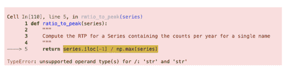

# 四、Pandas III

> 原文：[Pandas III](https://ds100.org/course-notes/pandas_3/pandas_3.html)
> 
> 译者：[飞龙](https://github.com/wizardforcel)
> 
> 协议：[CC BY-NC-SA 4.0](https://creativecommons.org/licenses/by-nc-sa/4.0/)

*学习成果*

+   使用`.groupby()`执行高级聚合

+   使用`pd.pivot_table`方法构建一个数据透视表

+   使用`pd.merge()`在 DataFrame 之间执行简单的合并

上次，我们介绍了数据聚合的概念 - 我们熟悉了`GroupBy`对象，并将它们用作汇总和总结 DataFrame 的工具。在本讲座中，我们将探讨使用不同的聚合函数以及深入研究一些高级的`.groupby`方法，以展示它们在理解我们的数据方面有多么强大。我们还将介绍其他数据聚合技术，以提供在如何操作我们的表格方面的灵活性。

## 4.1 重新审视`.agg()`函数

我们将从加载`babynames`数据集开始。请注意，此数据集已经被过滤，只包含来自加利福尼亚州的数据。

代码

```py
# This code pulls census data and loads it into a DataFrame
# We won't cover it explicitly in this class, but you are welcome to explore it on your own
import pandas as pd
import numpy as np
import urllib.request
import os.path
import zipfile

data_url = "https://www.ssa.gov/oact/babynames/state/namesbystate.zip"
local_filename = "data/babynamesbystate.zip"
if not os.path.exists(local_filename): # If the data exists don't download again
 with urllib.request.urlopen(data_url) as resp, open(local_filename, 'wb') as f:
 f.write(resp.read())

zf = zipfile.ZipFile(local_filename, 'r')

ca_name = 'STATE.CA.TXT'
field_names = ['State', 'Sex', 'Year', 'Name', 'Count']
with zf.open(ca_name) as fh:
 babynames = pd.read_csv(fh, header=None, names=field_names)

babynames.tail(10)
```

|  | State | Sex | Year | Name | Count |
| --- | --- | --- | --- | --- | --- |
| 407418 | CA | M | 2022 | Zach | 5 |
| 407419 | CA | M | 2022 | Zadkiel | 5 |
| 407420 | CA | M | 2022 | Zae | 5 |
| 407421 | CA | M | 2022 | Zai | 5 |
| 407422 | CA | M | 2022 | Zay | 5 |
| 407423 | CA | M | 2022 | Zayvier | 5 |
| 407424 | CA | M | 2022 | Zia | 5 |
| 407425 | CA | M | 2022 | Zora | 5 |
| 407426 | CA | M | 2022 | Zuriel | 5 |
| 407427 | CA | M | 2022 | Zylo | 5 |

让我们首先使用`.agg`来找出每年出生的婴儿总数。回想一下，使用`.agg`和`.groupby()`的格式是：`df.groupby(column_name).agg(aggregation_function)`。下面的代码行给出了每年出生的婴儿总数。

```py
babynames.groupby("Year")[["Count"]].agg(sum).head(5)
```

|  | Count |
| --- | --- |
| Year |  |
| 1910 | 9163 |
| 1911 | 9983 |
| 1912 | 17946 |
| 1913 | 22094 |
| 1914 | 26926 |

这里有一个过程的示例：


现在让我们深入研究`groupby`。正如我们在上一堂课中学到的，`groupby`操作涉及将 DataFrame 拆分为分组的子框架，应用函数，并组合结果的某种组合。

对于下面的任意 DataFrame `df`，代码`df.groupby("year").agg(sum)`执行以下操作：

+   **将**`DataFrame`拆分为属于同一年份的子`DataFrame`。

+   **将**`sum`函数应用到每个子`DataFrame`的每一列。

+   **将**`sum`的结果组合成一个由`year`索引的单个`DataFrame`。


### 4.1.1 聚合函数

可以应用许多不同的聚合函数到分组的数据上。`.agg()`可以接受任何将多个值聚合为一个摘要值的函数。

因为这个相当广泛的要求，`pandas`提供了许多计算聚合的方法。

`pandas`会自动识别内置的 Python 操作。例如：

+   `.agg(sum)`

+   `.agg(max)`

+   `.agg(min)`

`pandas`中也可以使用**`NumPy`**函数：

+   `.agg(np.sum)`

+   `.agg(np.max)`

+   `.agg(np.min)`

+   `.agg("mean")`

`pandas`还提供了许多内置函数，包括：

+   `.agg("sum")`

+   `.agg("max")`

+   `.agg("min")`

+   `.agg("mean")`

+   `.agg("first")`

+   `.agg("last")`

一些常用的聚合函数甚至可以直接调用，而不需要显式使用`.agg()`。例如，我们可以在`.groupby()`上调用`.mean()`：

```py
babynames.groupby("Year").mean().head()
```

现在我们可以将所有这些付诸实践。假设我们想要找出在加利福尼亚州最不受欢迎的`F`性别的婴儿名字。为了计算这个，我们可以首先创建一个指标：“峰值比”（RTP）。RTP 是 2022 年出生具有给定名字的婴儿与*任何*年份出生具有该名字的*最大*数量之比。

让我们从计算一个名为`Jennifer`的婴儿开始。

```py
# We filter by babies with sex "F" and sort by "Year"
f_babynames = babynames[babynames["Sex"] == "F"]
f_babynames = f_babynames.sort_values(["Year"])

# Determine how many Jennifers were born in CA per year
jenn_counts_series = f_babynames[f_babynames["Name"] == "Jennifer"]["Count"]

# Determine the max number of Jennifers born in a year and the number born in 2022 
# to calculate RTP
max_jenn = max(f_babynames[f_babynames["Name"] == "Jennifer"]["Count"])
curr_jenn = f_babynames[f_babynames["Name"] == "Jennifer"]["Count"].iloc[-1]
rtp = curr_jenn / max_jenn
rtp
```

```py
0.018796372629843364
```

通过创建一个计算 RTP 并将其应用到我们的`DataFrame`的函数，我们可以一次轻松计算所有名字的 RTP！

```py
def ratio_to_peak(series):
 return series.iloc[-1] / max(series)

#Using .groupby() to apply the function
rtp_table = f_babynames.groupby("Name")[["Year", "Count"]].agg(ratio_to_peak)
rtp_table.head()
```

|  | Year | Count |
| --- | --- | --- |
| Name |  |  |
| Aadhini | 1.0 | 1.000000 |
| Aadhira | 1.0 | 0.500000 |
| Aadhya | 1.0 | 0.660000 |
| Aadya | 1.0 | 0.586207 |
| Aahana | 1.0 | 0.269231 |

在上面显示的行中，我们可以看到每一行都有一个`年`值为`1.0`。

这是你在 Data 8 中看到的逻辑的“**`pandas`**-ification”。你在 Data 8 中学到的许多逻辑在 Data 100 中也会对你有所帮助。

### 4.1.2 烦人的列

请注意，你必须小心选择哪些列应用`.agg()`函数。如果我们尝试通过`f_babynames.groupby("Name").agg(ratio_to_peak)`对整个表应用我们的函数，执行`.agg()`调用将导致`TypeError`。



我们可以通过在调用`.agg()`**之前**显式选择要应用聚合函数的列来避免这个问题（并防止无意中丢失数据），

### 4.1.3 分组后重命名列

默认情况下，`.groupby`不会重命名任何聚合列。正如我们在上表中看到的，聚合列仍然被命名为`Count`，即使它现在代表 RTP。为了更好地可读性，我们可以将`Count`重命名为`Count RTP`

```py
rtp_table = rtp_table.rename(columns = {"Count": "Count RTP"})
rtp_table
```

|  | Year | Count RTP |
| --- | --- | --- |
| Name |  |  |
| Aadhini | 1.0 | 1.000000 |
| Aadhira | 1.0 | 0.500000 |
| Aadhya | 1.0 | 0.660000 |
| Aadya | 1.0 | 0.586207 |
| Aahana | 1.0 | 0.269231 |
| ... | ... | ... |
| Zyanya | 1.0 | 0.466667 |
| Zyla | 1.0 | 1.000000 |
| Zylah | 1.0 | 1.000000 |
| Zyra | 1.0 | 1.000000 |
| Zyrah | 1.0 | 0.833333 |

13782 行×2 列

### 4.1.4 一些数据科学回报

通过对`rtp_table`进行排序，我们可以看到受欢迎程度下降最多的名字。

```py
rtp_table = rtp_table.rename(columns = {"Count": "Count RTP"})
rtp_table.sort_values("Count RTP").head()
```

|  | Year | Count RTP |
| --- | --- | --- |
| Name |  |  |
| Debra | 1.0 | 0.001260 |
| Debbie | 1.0 | 0.002815 |
| Carol | 1.0 | 0.003180 |
| Tammy | 1.0 | 0.003249 |
| Susan | 1.0 | 0.003305 |

要可视化上述`Dataframe`，让我们看看下面的折线图：

代码

```py
import plotly.express as px
px.line(f_babynames[f_babynames["Name"] == "Debra"], x = "Year", y = "Count")
```

我们可以得到前 10 个名字的列表，然后用以下代码绘制受欢迎程度：

```py
top10 = rtp_table.sort_values("Count RTP").head(10).index
px.line(
 f_babynames[f_babynames["Name"].isin(top10)], 
 x = "Year", 
 y = "Count", 
 color = "Name"
)
```

作为一个快速练习，考虑一下什么样的代码可以计算每个名字的婴儿总数。

代码

```py
babynames.groupby("Name")[["Count"]].agg(sum).head()
# alternative solution: 
# babynames.groupby("Name")[["Count"]].sum()
```

|  | Count |
| --- | --- |
| Name |  |
| Aadan | 18 |
| Aadarsh | 6 |
| Aaden | 647 |
| Aadhav | 27 |
| Aadhini | 6 |

现在，让我们考虑计算每年出生的婴儿总数的代码。你会看到有多种方法可以实现这一点，其中一些列在下面列出。

代码

```py
babynames.groupby("Year")[["Count"]].agg(sum).head()
# Alternative 1
# babynames.groupby("Year")[["Count"]].sum()
# Alternative 2
# babynames.groupby("Year").sum(numeric_only=True)
```

|  | Count |
| --- | --- |
| Year |  |
| 1910 | 9163 |
| 1911 | 9983 |
| 1912 | 17946 |
| 1913 | 22094 |
| 1914 | 26926 |

对于第二种选择，注意我们如何通过向`groupby`传递`numeric_only=True`参数来避免我们之前在聚合非数字列时遇到的错误。

### 4.1.5 绘制出生计数

绘制`Dataframe`后，我们得到了一个有趣的故事。

代码

```py
import plotly.express as px
puzzle2 = babynames.groupby("Year")[["Count"]].agg(sum)
px.line(puzzle2, y = "Count")
```

**警告**: 当我们决定使用这个数据集来估计出生率时，我们做出了一个巨大的假设。根据[来自立法分析办公室的这篇文章](https://lao.ca.gov/LAOEconTax/Article/Detail/691)，2020 年加利福尼亚州出生的婴儿实际数量为 421,275。然而，我们的图表显示 362,882 个婴儿 - 发生了什么？

## 4.2 `GroupBy()`，继续

我们将再次使用`elections` DataFrame。

代码

```py
import pandas as pd
import numpy as np

elections = pd.read_csv("data/elections.csv")
elections.head(5)
```

|  | Year | Candidate | Party | Popular vote | Result | % |
| --- | --- | --- | --- | --- | --- | --- |
| 0 | 1824 | Andrew Jackson | Democratic-Republican | 151271 | loss | 57.210122 |
| 1 | 1824 | John Quincy Adams | Democratic-Republican | 113142 | win | 42.789878 |
| 2 | 1828 | Andrew Jackson | Democratic | 642806 | win | 56.203927 |
| 3 | 1828 | John Quincy Adams | National Republican | 500897 | loss | 43.796073 |
| 4 | 1832 | Andrew Jackson | Democratic | 702735 | win | 54.574789 |

### 4.2.1 原始`GroupBy`对象

应用于`DataFrame`的`groupby`的结果是一个`DataFrameGroupBy`对象，**而不是**一个`DataFrame`。

```py
grouped_by_year = elections.groupby("Year")
type(grouped_by_year)
```

```py
pandas.core.groupby.generic.DataFrameGroupBy
```

有几种方法可以查看`DataFrameGroupBy`对象：

```py
grouped_by_party = elections.groupby("Party")
grouped_by_party.groups
```

```py
{'American': [22, 126], 'American Independent': [115, 119, 124], 'Anti-Masonic': [6], 'Anti-Monopoly': [38], 'Citizens': [127], 'Communist': [89], 'Constitution': [160, 164, 172], 'Constitutional Union': [24], 'Democratic': [2, 4, 8, 10, 13, 14, 17, 20, 28, 29, 34, 37, 39, 45, 47, 52, 55, 57, 64, 70, 74, 77, 81, 83, 86, 91, 94, 97, 100, 105, 108, 111, 114, 116, 118, 123, 129, 134, 137, 140, 144, 151, 158, 162, 168, 176, 178], 'Democratic-Republican': [0, 1], 'Dixiecrat': [103], 'Farmer–Labor': [78], 'Free Soil': [15, 18], 'Green': [149, 155, 156, 165, 170, 177, 181], 'Greenback': [35], 'Independent': [121, 130, 143, 161, 167, 174], 'Liberal Republican': [31], 'Libertarian': [125, 128, 132, 138, 139, 146, 153, 159, 163, 169, 175, 180], 'National Democratic': [50], 'National Republican': [3, 5], 'National Union': [27], 'Natural Law': [148], 'New Alliance': [136], 'Northern Democratic': [26], 'Populist': [48, 61, 141], 'Progressive': [68, 82, 101, 107], 'Prohibition': [41, 44, 49, 51, 54, 59, 63, 67, 73, 75, 99], 'Reform': [150, 154], 'Republican': [21, 23, 30, 32, 33, 36, 40, 43, 46, 53, 56, 60, 65, 69, 72, 79, 80, 84, 87, 90, 96, 98, 104, 106, 109, 112, 113, 117, 120, 122, 131, 133, 135, 142, 145, 152, 157, 166, 171, 173, 179], 'Socialist': [58, 62, 66, 71, 76, 85, 88, 92, 95, 102], 'Southern Democratic': [25], 'States' Rights': [110], 'Taxpayers': [147], 'Union': [93], 'Union Labor': [42], 'Whig': [7, 9, 11, 12, 16, 19]}
```

```py
grouped_by_party.get_group("Socialist")
```

|  | Year | Candidate | Party | Popular vote | Result | % |
| --- | --- | --- | --- | --- | --- | --- |
| 58 | 1904 | Eugene V. Debs | Socialist | 402810 | loss | 2.985897 |
| 62 | 1908 | Eugene V. Debs | Socialist | 420852 | loss | 2.850866 |
| 66 | 1912 | Eugene V. Debs | Socialist | 901551 | loss | 6.004354 |
| 71 | 1916 | Allan L. Benson | Socialist | 590524 | loss | 3.194193 |
| 76 | 1920 | Eugene V. Debs | Socialist | 913693 | loss | 3.428282 |
| 85 | 1928 | Norman Thomas | Socialist | 267478 | loss | 0.728623 |
| 88 | 1932 | Norman Thomas | Socialist | 884885 | loss | 2.236211 |
| 92 | 1936 | Norman Thomas | Socialist | 187910 | loss | 0.412876 |
| 95 | 1940 | Norman Thomas | Socialist | 116599 | loss | 0.234237 |
| 102 | 1948 | Norman Thomas | Socialist | 139569 | loss | 0.286312 |

### 4.2.2 其他`GroupBy`方法

有许多聚合方法可以使用`.agg`。一些有用的选项是：

+   [`.mean`](https://pandas.pydata.org/docs/reference/api/pandas.core.groupby.DataFrameGroupBy.mean.html#pandas.core.groupby.DataFrameGroupBy.mean)：创建一个新的`DataFrame`，其中包含每个组的平均值

+   [`.sum`](https://pandas.pydata.org/docs/reference/api/pandas.core.groupby.DataFrameGroupBy.sum.html#pandas.core.groupby.DataFrameGroupBy.sum)：创建一个新的`DataFrame`，其中包含每个组的总和

+   [`.max`](https://pandas.pydata.org/docs/reference/api/pandas.core.groupby.DataFrameGroupBy.max.html#pandas.core.groupby.DataFrameGroupBy.max)和[`.min`](https://pandas.pydata.org/docs/reference/api/pandas.core.groupby.DataFrameGroupBy.min.html#pandas.core.groupby.DataFrameGroupBy.min)：创建一个新的`DataFrame`，其中包含每个组的最大/最小值

+   [`.first`](https://pandas.pydata.org/docs/reference/api/pandas.core.groupby.DataFrameGroupBy.first.html#pandas.core.groupby.DataFrameGroupBy.first)和[`.last`](https://pandas.pydata.org/docs/reference/api/pandas.core.groupby.DataFrameGroupBy.last.html#pandas.core.groupby.DataFrameGroupBy.last)：创建一个新的`DataFrame`，其中包含每个组的第一行/最后一行

+   [`.size`](https://pandas.pydata.org/docs/reference/api/pandas.core.groupby.DataFrameGroupBy.size.html#pandas.core.groupby.DataFrameGroupBy.size)：创建一个新的**Series**，其中包含每个组的条目数

+   [`.count`](https://pandas.pydata.org/docs/reference/api/pandas.core.groupby.DataFrameGroupBy.count.html#pandas.core.groupby.DataFrameGroupBy.count)：创建一个新的**DataFrame**，其中包含条目数，不包括缺失值。

让我们通过创建一个名为`df`的`DataFrame`来举例说明一些例子。

```py
df = pd.DataFrame({'letter':['A','A','B','C','C','C'], 
 'num':[1,2,3,4,np.NaN,4], 
 'state':[np.NaN, 'tx', 'fl', 'hi', np.NaN, 'ak']})
df
```

|  | letter | num | State |
| --- | --- | --- | --- |
| 0 | A | 1.0 | NaN |
| 1 | A | 2.0 | tx |
| 2 | B | 3.0 | fl |
| 3 | C | 4.0 | hi |
| 4 | C | NaN | NaN |
| 5 | C | 4.0 | ak |

请注意`.size()`和`.count()`之间的细微差别：虽然`.size()`返回一个`Series`并计算包括缺失值在内的条目数，`.count()`返回一个`DataFrame`并计算每列中不包括缺失值的条目数。

```py
df.groupby("letter").size()
```

```py
letter
A    2
B    1
C    3
dtype: int64
```

```py
df.groupby("letter").count()
```

|  | num | State |
| --- | --- | --- |
| letter |  |  |
| --- | --- | --- |
| A | 2 | 1 |
| B | 1 | 1 |
| C | 2 | 2 |

您可能还记得前一个笔记中的`value_counts()`函数做了类似的事情。原来`value_counts()`和`groupby.size()`是一样的，只是`value_counts()`会自动按降序排序结果`Series`。

```py
df["letter"].value_counts()
```

```py
C    3
A    2
B    1
Name: letter, dtype: int64
```

这些（和其他）聚合函数是如此常见，以至于 `pandas` 允许使用简写。我们可以直接在 `GroupBy` 对象上调用函数，而不是明确地声明使用 `.agg`。

例如，以下是等价的：

+   `elections.groupby("Candidate").agg(mean)`

+   `elections.groupby("Candidate").mean()`

`pandas` 还支持许多其他方法。您可以在[`pandas`文档](https://pandas.pydata.org/docs/reference/groupby.html)中查看它们。

### 4.2.3 按组进行过滤

`GroupBy` 对象的另一个常见用途是按组过滤数据。

`groupby.filter` 接受一个参数 `func`，其中 `func` 是一个函数，它：

+   以 `DataFrame` 对象作为输入

+   返回每个子 `DataFrame` 的单个 `True` 或 `False`

返回对应于 `True` 的子 `DataFrame`，而具有 `False` 值的则不返回。重要的是，`groupby.filter` 与 `groupby.agg` 不同，因为最终的 `DataFrame` 中返回的是*整个*子 `DataFrame`，而不仅仅是单行。因此，`groupby.filter` 保留了原始索引。


为了说明这是如何发生的，让我们回到 `elections` 数据集。假设我们想要识别“紧张”的选举年份 - 也就是说，我们想要找到所有对应于那一年的行，其中所有候选人在那一年赢得了相似比例的总票数。具体来说，让我们找到所有对应于没有候选人赢得超过总票数 45%的年份的行。

换句话说，我们想要：

+   找到最大 `%` 小于 45% 的年份

+   返回对应于这些年份的所有 `DataFrame` 行

对于每一年，我们需要找到该年*所有*行中的最大 `%`。如果这个最大 `%` 小于 45%，我们将告诉 `pandas` 保留该年对应的所有行。

```py
elections.groupby("Year").filter(lambda sf: sf["%"].max() < 45).head(9)
```

|  | Year | Candidate | Party | Popular vote | Result | % |
| --- | --- | --- | --- | --- | --- | --- |
| 23 | 1860 | Abraham Lincoln | Republican | 1855993 | win | 39.699408 |
| 24 | 1860 | John Bell | Constitutional Union | 590901 | loss | 12.639283 |
| 25 | 1860 | John C. Breckinridge | Southern Democratic | 848019 | loss | 18.138998 |
| 26 | 1860 | Stephen A. Douglas | Northern Democratic | 1380202 | loss | 29.522311 |
| 66 | 1912 | Eugene V. Debs | Socialist | 901551 | loss | 6.004354 |
| 67 | 1912 | Eugene W. Chafin | Prohibition | 208156 | loss | 1.386325 |
| 68 | 1912 | Theodore Roosevelt | Progressive | 4122721 | loss | 27.457433 |
| 69 | 1912 | William Taft | Republican | 3486242 | loss | 23.218466 |
| 70 | 1912 | Woodrow Wilson | Democratic | 6296284 | win | 41.933422 |

这里发生了什么？在这个例子中，我们将我们的过滤函数 `func` 定义为 `lambda sf: sf["%"].max() < 45`。这个过滤函数将在分组的子 `DataFrame` 中的所有条目中找到最大的 `"%"` 值，我们称之为 `sf`。如果最大值小于 45，则过滤函数将返回 `True`，并且该分组的所有行将出现在最终的输出 `DataFrame` 中。

检查上面的 `DataFrame`。请注意，在这个前 9 行的预览中，所有来自 1860 年和 1912 年的条目都出现了。这意味着在 1860 年和 1912 年，那一年没有候选人赢得超过总票数 45%。

你可能会问：`groupby.filter` 过程与我们之前看到的布尔过滤有何不同？布尔过滤在应用布尔条件时考虑*单个*行。例如，代码 `elections[elections["%"] < 45]` 将检查 `elections` 中每一行的 `"%"` 值；如果小于 45，则该行将保留在输出中。相比之下，`groupby.filter` 在整个组的所有行上应用布尔条件。如果该组中并非所有行都满足过滤器指定的条件，则整个组将在输出中被丢弃。

### 4.2.4 使用 `lambda` 函数进行聚合

如果我们希望使用非标准函数（例如我们自己设计的函数）对我们的`DataFrame`进行聚合，我们可以通过将`.agg`与`lambda`表达式结合使用来实现。

让我们首先考虑一个谜题来唤起我们的记忆。我们将尝试找到每个`Party`中获得最高`%`选票的`Candidate`。

一个天真的方法可能是按`Party`列分组并按最大值聚合。

```py
elections.groupby("Party").agg(max).head(10)
```

|  | Year | Candidate | Popular vote | Result | % |
| --- | --- | --- | --- | --- | --- |
| Party |  |  |  |  |  |
| American | 1976 | Thomas J. Anderson | 873053 | loss | 21.554001 |
| American Independent | 1976 | Lester Maddox | 9901118 | loss | 13.571218 |
| Anti-Masonic | 1832 | William Wirt | 100715 | loss | 7.821583 |
| Anti-Monopoly | 1884 | Benjamin Butler | 134294 | loss | 1.335838 |
| Citizens | 1980 | Barry Commoner | 233052 | loss | 0.270182 |
| Communist | 1932 | William Z. Foster | 103307 | loss | 0.261069 |
| Constitution | 2016 | Michael Peroutka | 203091 | loss | 0.152398 |
| Constitutional Union | 1860 | John Bell | 590901 | loss | 12.639283 |
| Democratic | 2020 | 	Woodrow Wilson | 81268924 | win | 61.344703 |
| Democratic-Republican | 1824 | John Quincy Adams | 151271 | win | 57.210122 |

这种方法显然是错误的-`DataFrame`声称伍德罗·威尔逊在 2020 年赢得了总统大选。

为什么会发生这种情况？这里，`max`聚合函数是独立地应用于每一列。在民主党人中，`max`正在计算：

+   民主党候选人竞选总统的最近年份（2020）

+   具有字母顺序“最大”名称（“伍德罗·威尔逊”）的`Candidate`

+   具有字母顺序“最大”结果（“赢”）的`Result`

相反，让我们尝试一种不同的方法。我们将：

1.  对数据框进行排序，使行按`%`的降序排列

1.  按`Party`分组并选择每个子数据框的第一行

虽然这可能看起来不直观，但按`%`的降序对`elections`进行排序非常有帮助。然后，如果我们按`Party`分组，每个 groupby 对象的第一行将包含有关具有最高选民`%`的`Candidate`的信息。

```py
elections_sorted_by_percent = elections.sort_values("%", ascending=False)
elections_sorted_by_percent.head(5)
```

|  | Year | Candidate | Party | Popular vote | Result | % |
| --- | --- | --- | --- | --- | --- | --- |
| 114 | 1964 | Lyndon Johnson | Democratic | 43127041 | win | 61.344703 |
| 91 | 1936 | 	Franklin Roosevelt | Democratic | 27752648 | win | 60.978107 |
| 120 | 1972 | 	Richard Nixon | Republican | 47168710 | win | 60.907806 |
| 79 | 1920 | Warren Harding | Republican | 16144093 | win | 60.574501 |
| 133 | 1984 | Ronald Reagan | Republican | 54455472 | win | 59.023326 |

```py
elections_sorted_by_percent.groupby("Party").agg(lambda x : x.iloc[0]).head(10)

# Equivalent to the below code
# elections_sorted_by_percent.groupby("Party").agg('first').head(10)
```

|  | Year | Candidate | Popular vote | Result | % |
| --- | --- | --- | --- | --- | --- |
| Party |  |  |  |  |  |
| American | 1856 | Millard Fillmore | 873053 | loss | 21.554001 |
| American Independent | 1968 | George Wallace | 9901118 | loss | 13.571218 |
| Anti-Masonic | 1832 | William Wirt | 100715 | loss | 7.821583 |
| Anti-Monopoly | 1884 | Benjamin Butler | 134294 | loss | 1.335838 |
| Citizens | 1980 | Barry Commoner | 233052 | loss | 0.270182 |
| Communist | 1932 | William Z. Foster | 103307 | loss | 0.261069 |
| Constitution | 2008 | Chuck Baldwin | 199750 | loss | 0.152398 |
| Constitutional Union | 1860 | 	John Bell | 590901 | loss | 12.639283 |
| Democratic | 1964 | Lyndon Johnson | 43127041 | win | 61.344703 |
| Democratic-Republican | 1824 | Andrew Jackson | 151271 | loss | 57.210122 |

以下是该过程的示例：


请注意，我们的代码正确确定了来自民主党的林登·约翰逊拥有最高的选民`%`。

更一般地，`lambda`函数用于设计 Python 中未预定义的自定义聚合函数。`lambda`函数的输入参数`x`是一个`GroupBy`对象。因此，`lambda x : x.iloc[0]`选择每个 groupby 对象中的第一行应该是有意义的。

事实上，解决这个问题有几种不同的方法。每种方法在可读性、性能、内存消耗、复杂性等方面都有不同的权衡。我们在下面给出了一些示例。

**注意**：不需要理解这些替代解决方案。它们是为了展示`pandas`中众多问题解决方法的多样性。

```py
# Using the idxmax function
best_per_party = elections.loc[elections.groupby('Party')['%'].idxmax()]
best_per_party.head(5)
```

|  | Year | Candidate | Party | Popular vote | Result | % |
| --- | --- | --- | --- | --- | --- | --- |
| 22 | 1856 | Millard Fillmore | American | 873053 | loss | 21.554001 |
| 115 | 1968 | George Wallace | American Independent | 9901118 | loss | 13.571218 |
| 6 | 1832 | William Wirt | Anti-Masonic | 100715 | loss | 7.821583 |
| 38 | 1884 | Benjamin Butler | Anti-Monopoly | 134294 | loss | 1.335838 |
| 127 | 1980 | Barry Commoner | Citizens | 233052 | loss | 0.270182 |

```py
# Using the .drop_duplicates function
best_per_party2 = elections.sort_values('%').drop_duplicates(['Party'], keep='last')
best_per_party2.head(5)
```

|  | Year | Candidate | Party | Popular vote | Result | % |
| --- | --- | --- | --- | --- | --- | --- |
| 148 | 1996 | John Hagelin | Natural Law | 113670 | loss | 0.118219 |
| 164 | 2008 | Chuck Baldwin | Constitution | 199750 | loss | 0.152398 |
| 110 | 1956 | T. Coleman Andrews | States' Rights | 107929 | loss | 0.174883 |
| 147 | 1996 | Howard Phillips | Taxpayers | 184656 | loss | 0.192045 |
| 136 | 1988 | Lenora Fulani | New Alliance | 217221 | loss | 0.237804 |

## 4.3 使用数据透视表聚合数据

我们现在知道`.groupby`让我们能够在 DataFrame 中对数据进行分组和聚合。上面的示例使用 DataFrame 中的一列形成了分组。通过传递一个列名的列表给`.groupby`，可以一次按多列进行分组。

让我们再次考虑`babynames`数据集。在这个问题中，我们将找到与每个年份和性别相关联的婴儿名字的总数。为此，我们将*同时*按`"年份"`和`"性别"`列进行分组。

```py
babynames.head()
```

|  | State | Sex | Year | Name | Count |
| --- | --- | --- | --- | --- | --- |
| 0 | CA | F | 1910 | Mary | 295 |
| 1 | CA | F | 1910 | Helen | 239 |
| 2 | CA | F | 1910 | Dorothy | 220 |
| 3 | CA | F | 1910 | Margaret | 163 |
| 4 | CA | F | 1910 | Frances | 134 |

```py
# Find the total number of baby names associated with each sex for each 
# year in the data
babynames.groupby(["Year", "Sex"])[["Count"]].agg(sum).head(6)
```

|  |  | Count |
| --- | --- | --- |
| Year | Sex |  |
| --- | --- | --- |
| 1910 | F | 5950 |
| M | 3213 |
| 1911 | F | 6602 |
| M | 3381 |
| 1912 | F | 9804 |
| M | 8142 |

请注意，"年份"和"性别"都作为 DataFrame 的索引（它们都以粗体呈现）。我们创建了一个*多索引*DataFrame，其中使用两个不同的索引值，年份和性别，来唯一标识每一行。

这不是表示这些数据的最直观的方式 - 而且，因为多索引的 DataFrame 在其索引中有多个维度，它们通常很难使用。

另一种跨两列进行聚合的策略是创建一个数据透视表。你在[Data 8](https://inferentialthinking.com/chapters/08/3/Cross-Classifying_by_More_than_One_Variable.html#pivot-tables-rearranging-the-output-of-group)中看到过这些。一组值用于创建数据透视表的索引；另一组用于定义列名。表中每个单元格中包含的值对应于每个索引-列对的聚合数据。

这是一个过程的示例：


理解数据透视表的最佳方法是看它的实际应用。让我们回到我们最初的目标，即对每个年份和性别组合的名字总数进行求和。我们将调用`pandas`的[`.pivot_table`](https://pandas.pydata.org/pandas-docs/stable/reference/api/pandas.pivot_table.html)方法来创建一个新表。

```py
# The `pivot_table` method is used to generate a Pandas pivot table
import numpy as np
babynames.pivot_table(
 index = "Year", 
 columns = "Sex", 
 values = "Count", 
 aggfunc = np.sum,
).head(5)
```

| Sex | F | M |
| --- | --- | --- |
| Year |  |  |
| --- | --- | --- |
| 1910 | 5950 | 3213 |
| 1911 | 6602 | 3381 |
| 1912 | 9804 | 8142 |
| 1913 | 11860 | 10234 |
| 1914 | 13815 | 13111 |

看起来好多了！现在，我们的 DataFrame 结构清晰，具有清晰的索引列组合。数据透视表中的每个条目表示给定`Year`和`Sex`组合的名称总数。

让我们更仔细地看一下上面实施的代码。

+   `index = "Year"` 指定应用于数据透视表的原始`DataFrame`中用作索引的列名

+   `columns = "Sex"` 指定应用于生成数据透视表的列的原始`DataFrame`中的列名

+   `values = "Count"` 指示应用于填充每个索引列组合的条目的原始`DataFrame`中的哪些值

+   `aggfunc = np.sum` 告诉`pandas`在聚合由`values`指定的数据时使用什么函数。在这里，我们正在对每对`Year`和`Sex`的名称计数求和

我们甚至可以在数据透视表的索引或列中包含多个值。

```py
babynames_pivot = babynames.pivot_table(
 index="Year",     # the rows (turned into index)
 columns="Sex",    # the column values
 values=["Count", "Name"], 
 aggfunc=max,   # group operation
)
babynames_pivot.head(6)
```

|  | Count | Name |
| --- | --- | --- |
| Sex | F | M | F | M |
| Year |  |  |  |  |
| 1910 | 295 | 237 | Yvonne | William |
| 1911 | 390 | 214 | Zelma | Willis |
| 1912 | 534 | 501 | Yvonne | Woodrow |
| 1913 | 584 | 614 | Zelma | Yoshio |
| 1914 | 773 | 769 | Zelma | Yoshio |
| 1915 | 998 | 1033 | Zita | Yukio |

## 4.4 连接表

在进行数据科学项目时，我们不太可能在单个`DataFrame`中包含我们想要的所有数据-现实世界的数据科学家需要处理来自多个来源的数据。如果我们可以访问具有相关信息的多个数据集，我们可以将两个或多个表连接成一个单独的 DataFrame。

要将其付诸实践，我们将重新审视`elections`数据集。

```py
elections.head(5)
```

|  | Year | Candidate | Party | Popular vote | Result | % |
| --- | --- | --- | --- | --- | --- | --- |
| 0 | 1824 | Andrew Jackson | Democratic-Republican | 151271 | loss | 57.210122 |
| 1 | 1824 | John Quincy Adams | Democratic-Republican | 113142 | win | 42.789878 |
| 2 | 1828 | Andrew Jackson | Democratic | 642806 | win | 56.203927 |
| 3 | 1828 | John Quincy Adams | National Republican | 500897 | loss | 43.796073 |
| 4 | 1832 | Andrew Jackson | Democratic | 702735 | win | 54.574789 |

假设我们想了解 2022 年每位总统候选人的名字的受欢迎程度。为此，我们需要`babynames`和`elections`的合并数据。

我们将首先创建一个新列，其中包含每位总统候选人的名字。这将帮助我们将`elections`中的每个名字与`babynames`中的相应名字数据连接起来。

```py
# This `str` operation splits each candidate's full name at each 
# blank space, then takes just the candidiate's first name
elections["First Name"] = elections["Candidate"].str.split().str[0]
elections.head(5)
```

|  | Year | Candidate | Party | Popular vote | Result | % | First Name |
| --- | --- | --- | --- | --- | --- | --- | --- |
| 0 | 1824 | Andrew Jackson | Democratic-Republican | 151271 | loss | 57.210122 | Andrew |
| 1 | 1824 | John Quincy Adams | Democratic-Republican | 113142 | win | 42.789878 | John |
| 2 | 1828 | Andrew Jackson | Democratic | 642806 | win | 56.203927 | Andrew |
| 3 | 1828 | John Quincy Adams | National Republican | 500897 | loss | 43.796073 | John |
| 4 | 1832 | Andrew Jackson | Democratic | 702735 | win | 54.574789 | Andrew |

```py
# Here, we'll only consider `babynames` data from 2022
babynames_2022 = babynames[babynames["Year"]==2020]
babynames_2022.head()
```

|  | State | Sex | Year | Name | Count |
| --- | --- | --- | --- | --- | --- |
| 228550 | CA | F | 2020 | Olivia | 2353 |
| 228551 | CA | F | 2020 | Camila | 2187 |
| 228552 | CA | F | 2020 | Emma | 2110 |
| 228553 | CA | F | 2020 | Mia | 2043 |
| 228554 | CA | F | 2020 | Sophia | 1999 |

现在，我们准备好连接这两个表了。[`pd.merge`](https://pandas.pydata.org/docs/reference/api/pandas.DataFrame.merge.html) 是用于将 DataFrame 连接在一起的`pandas`方法。

```py
merged = pd.merge(left = elections, right = babynames_2022, \
 left_on = "First Name", right_on = "Name")
merged.head()
# Notice that pandas automatically specifies `Year_x` and `Year_y` 
# when both merged DataFrames have the same column name to avoid confusion
```

|  | Year_x | Candidate | Party | Popular vote | Result | % | First Name | State | Sex | Year_y | Name | Count |
| --- | --- | --- | --- | --- | --- | --- | --- | --- | --- | --- | --- | --- |
| 0 | 1824 | Andrew Jackson | Democratic-Republican | 151271 | loss | 57.210122 | Andrew | CA | M | 2020 | Andrew | 874 |
| 1 | 1828 | Andrew Jackson | Democratic | 642806 | win | 56.203927 | Andrew | CA | M | 2020 | Andrew | 874 |
| 2 | 1832 | Andrew Jackson | Democratic | 702735 | win | 54.574789 | Andrew | CA | M | 2020 | Andrew | 874 |
| 3 | 1824 | John Quincy Adams | Democratic-Republican | 113142 | win | 42.789878 | John | CA | M | 2020 | John | 623 |
| 4 | 1828 | John Quincy Adams | National Republican | 500897 | loss | 43.796073 | John | CA | M | 2020 | John | 623 |

让我们更仔细地看看这些参数：

+   `left`和`right`参数用于指定要连接的数据框。

+   `left_on`和`right_on`参数被分配给要在执行连接时使用的列的字符串名称。这两个`on`参数告诉`pandas`应该将哪些值作为配对键来确定要在数据框之间合并的行。我们将在下一堂课上更多地讨论这个配对键的概念。

## 4.5 结语

恭喜！我们终于解决了`pandas`。如果你对它仍然感到不太舒服，不要担心——在接下来的几周里，你将有足够的机会练习。

接下来，我们将动手处理一些真实世界的数据集，并利用我们的`pandas`知识进行一些探索性数据分析。
