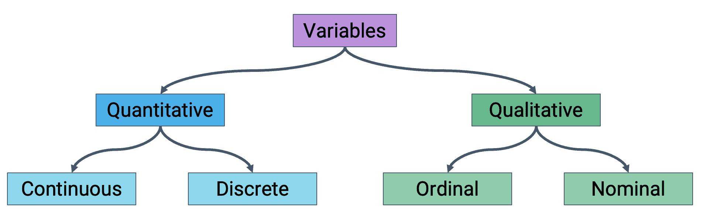
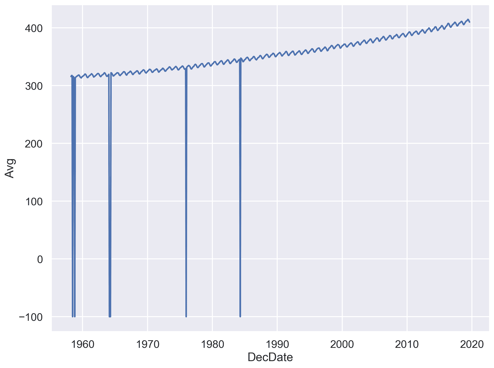
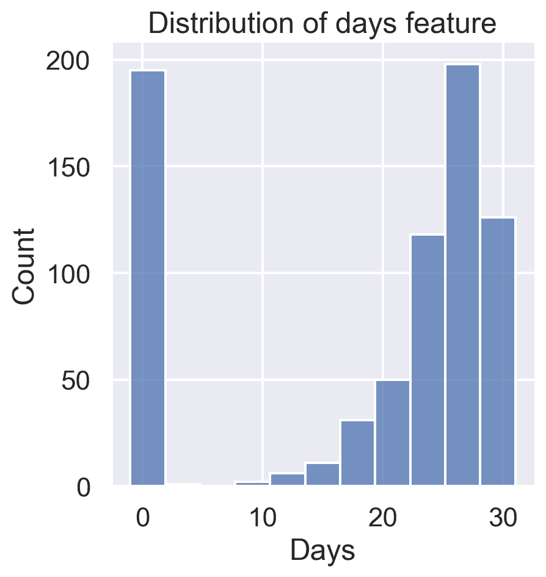
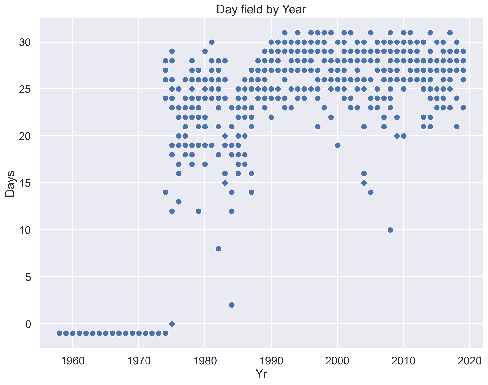
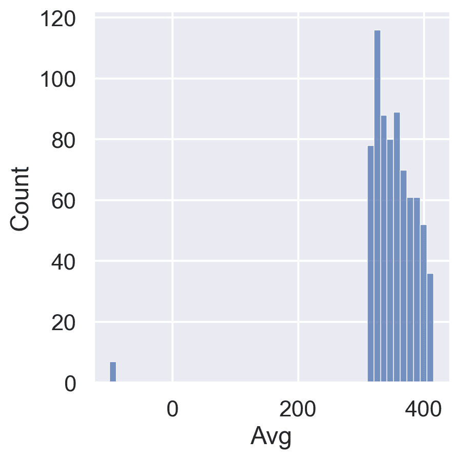
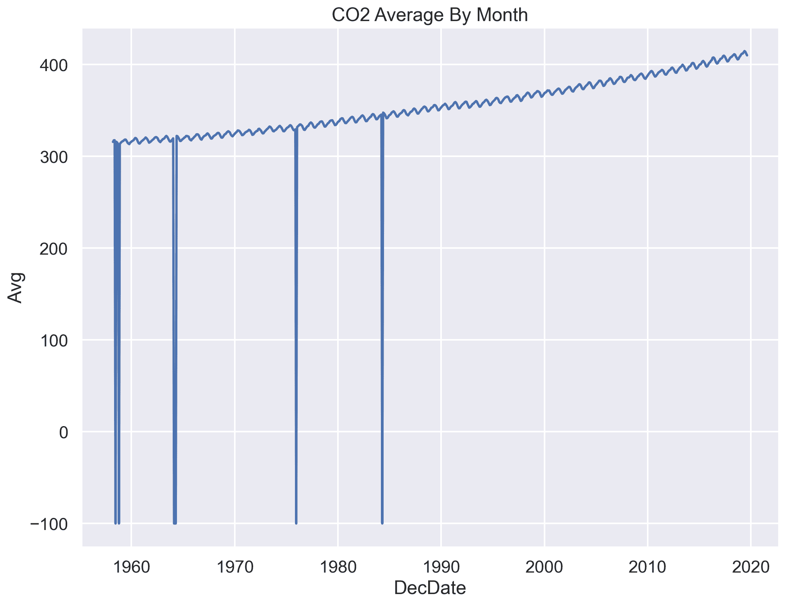
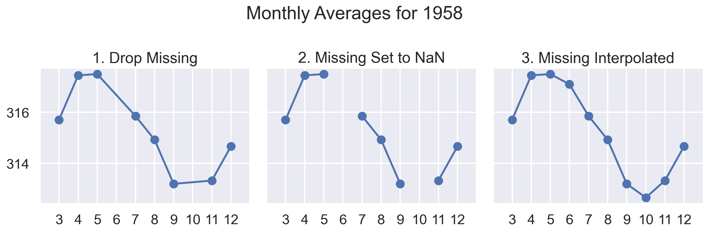
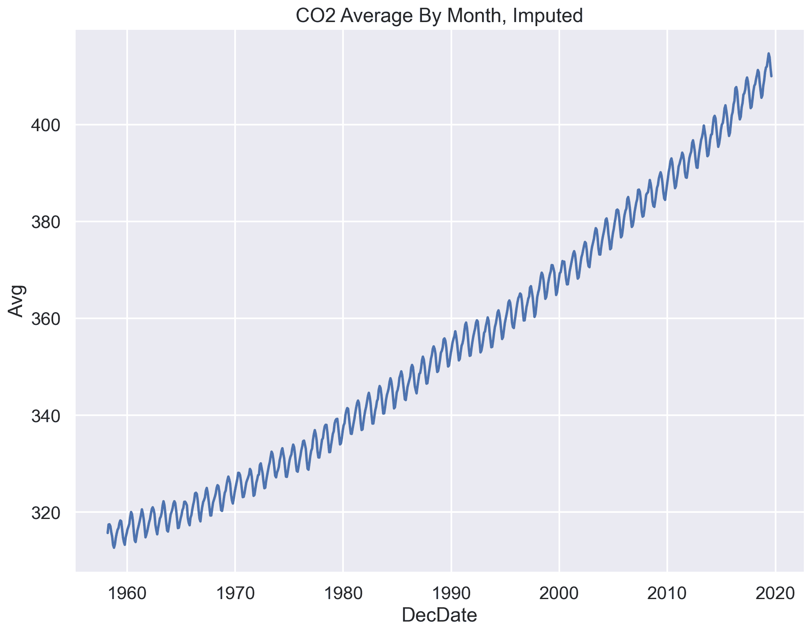
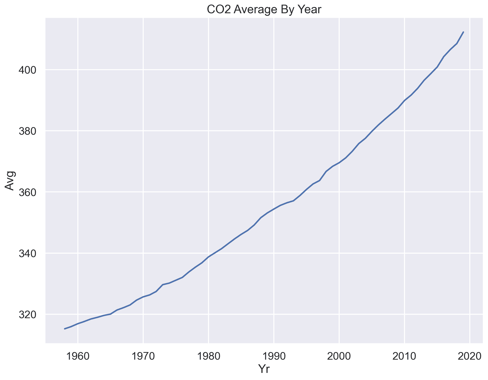

# 五、数据清洗和探索性数据分析

> 原文：[Data Cleaning and EDA](https://ds100.org/course-notes/eda/eda.html)
> 
> 译者：[飞龙](https://github.com/wizardforcel)
> 
> 协议：[CC BY-NC-SA 4.0](https://creativecommons.org/licenses/by-nc-sa/4.0/)

代码

```py
import numpy as np
import pandas as pd

import matplotlib.pyplot as plt
import seaborn as sns
#%matplotlib inline
plt.rcParams['figure.figsize'] = (12, 9)

sns.set()
sns.set_context('talk')
np.set_printoptions(threshold=20, precision=2, suppress=True)
pd.set_option('display.max_rows', 30)
pd.set_option('display.max_columns', None)
pd.set_option('display.precision', 2)
# This option stops scientific notation for pandas
pd.set_option('display.float_format', '{:.2f}'.format)

# Silence some spurious seaborn warnings
import warnings
warnings.filterwarnings("ignore", category=FutureWarning)
``` 

*学习成果*

+   识别常见文件格式

+   按其变量类型对数据进行分类

+   建立对数据可信度问题的认识，并制定有针对性的解决方案

**此内容在第 4、5 和 6 讲中涵盖。**

在过去的几堂课上，我们已经学到`pandas`是一个重塑、修改和探索数据集的工具包。我们还没有涉及的是*如何*做出这些数据转换决策。当我们从“现实世界”收到一组新数据时，我们如何知道我们应该做什么处理来将这些数据转换为可用的形式？

**数据清洗**，也称为**数据整理**，是将原始数据转换为便于后续分析的过程。它通常用于解决诸如：

+   结构不清晰或格式不正确

+   缺失或损坏的值

+   单位转换

+   ...等等

**探索性数据分析（EDA）**是了解新数据集的过程。这是一种开放式、非正式的分析，涉及熟悉数据中存在的变量，发现潜在的假设，并识别数据可能存在的问题。这最后一点通常会激发进一步的数据清洗，以解决数据集格式的任何问题；因此，EDA 和数据清洗通常被认为是一个“无限循环”，每个过程都推动着另一个过程。

在本讲座中，我们将考虑在进行数据清洗和 EDA 时要考虑的数据的关键属性。在这个过程中，我们将为您制定一个“清单”，以便在处理新数据集时考虑。通过这个过程，我们将更深入地了解数据科学生命周期的这个早期阶段（但非常重要！）。

## 5.1 结构

### 5.1.1 文件格式

有许多用于存储结构化数据的文件类型：TSV、JSON、XML、ASCII、SAS 等。在讲座中，我们只会涵盖 CSV、TSV 和 JSON，但在处理不同数据集时，您可能会遇到其他格式。阅读文档是了解如何处理多种不同文件类型的最佳方法。

#### 5.1.1.1 CSV

CSV，代表**逗号分隔值**，是一种常见的表格数据格式。在过去的两堂`pandas`讲座中，我们简要涉及了文件格式的概念：数据在文件中的编码方式。具体来说，我们的`elections`和`babynames`数据集是以 CSV 格式存储和加载的：

```py
pd.read_csv("data/elections.csv").head(5)
```

|  | Year | Candidate | Party | Popular vote | Result | % |
| --- | --- | --- | --- | --- | --- | --- |
| 0 | 1824 | Andrew Jackson | Democratic-Republican | 151271 | loss | 57.21 |
| 1 | 1824 | John Quincy Adams | Democratic-Republican | 113142 | win | 42.79 |
| 2 | 1828 | Andrew Jackson | Democratic | 642806 | win | 56.20 |
| 3 | 1828 | John Quincy Adams | National Republican | 500897 | loss | 43.80 |
| 4 | 1832 | Andrew Jackson | Democratic | 702735 | win | 54.57 |

为了更好地了解 CSV 的属性，让我们来看看原始数据文件的前几行，看看在加载到`DataFrame`之前它是什么样子的。我们将使用`repr()`函数返回带有特殊字符的原始字符串：

```py
with open("data/elections.csv", "r") as table:
 i = 0
 for row in table:
 print(repr(row))
 i += 1
 if i > 3:
 break
```

```py
'Year,Candidate,Party,Popular vote,Result,%\n'
'1824,Andrew Jackson,Democratic-Republican,151271,loss,57.21012204\n'
'1824,John Quincy Adams,Democratic-Republican,113142,win,42.78987796\n'
'1828,Andrew Jackson,Democratic,642806,win,56.20392707\n'
```

数据中的每一行，或**记录**，由换行符`\n`分隔。数据中的每一列，或**字段**，由逗号`,`分隔（因此是逗号分隔的！）。

#### 5.1.1.2 TSV

另一种常见的文件类型是**TSV（制表符分隔值）**。在 TSV 中，记录仍然由换行符`\n`分隔，而字段由制表符`\t`分隔。

让我们来看看原始 TSV 文件的前几行。同样，我们将使用`repr()`函数，以便`print`显示特殊字符。

```py
with open("data/elections.txt", "r") as table:
 i = 0
 for row in table:
 print(repr(row))
 i += 1
 if i > 3:
 break
```

```py
'\ufeffYear\tCandidate\tParty\tPopular vote\tResult\t%\n'
'1824\tAndrew Jackson\tDemocratic-Republican\t151271\tloss\t57.21012204\n'
'1824\tJohn Quincy Adams\tDemocratic-Republican\t113142\twin\t42.78987796\n'
'1828\tAndrew Jackson\tDemocratic\t642806\twin\t56.20392707\n'
```

TSV 可以使用`pd.read_csv`加载到`pandas`中。我们需要使用参数`sep='\t'`来指定**分隔符**[(文档)](https://pandas.pydata.org/docs/reference/api/pandas.read_csv.html)。

```py
pd.read_csv("data/elections.txt", sep='\t').head(3)
```

|  | Year | Candidate | Party | Popular vote | Result | % |
| --- | --- | --- | --- | --- | --- | --- |
| 0 | 1824 | Andrew Jackson | Democratic-Republican | 151271 | loss | 57.21 |
| 1 | 1824 | John Quincy Adams | Democratic-Republican | 113142 | win | 42.79 |
| 2 | 1828 | Andrew Jackson | Democratic | 642806 | win | 56.20 |

CSV 和 TSV 的问题出现在记录中有逗号或制表符的情况下。`pandas`如何区分逗号分隔符与字段本身中的逗号，例如`8,900`？为了解决这个问题，可以查看[`quotechar`参数](https://pandas.pydata.org/docs/reference/api/pandas.read_csv.html)。

#### 5.1.1.3 JSON

**JSON（JavaScript 对象表示）**文件的行为类似于 Python 字典。下面显示了原始 JSON。

```py
with open("data/elections.json", "r") as table:
 i = 0
 for row in table:
 print(row)
 i += 1
 if i > 8:
 break
```

```py
[

 {

   "Year": 1824,

   "Candidate": "Andrew Jackson",

   "Party": "Democratic-Republican",

   "Popular vote": 151271,

   "Result": "loss",

   "%": 57.21012204

 }, 
```

可以使用`pd.read_json`将 JSON 文件加载到`pandas`中。

```py
pd.read_json('data/elections.json').head(3)
```

|  | Year | Candidate | Party | Popular vote | Result | % |
| --- | --- | --- | --- | --- | --- | --- |
| 0 | 1824 | Andrew Jackson | Democratic-Republican | 151271 | loss | 57.21 |
| 1 | 1824 | John Quincy Adams | Democratic-Republican | 113142 | win | 42.79 |
| 2 | 1828 | Andrew Jackson | Democratic | 642806 | win | 56.20 |

##### 5.1.1.3.1 使用 JSON 进行 EDA：伯克利 COVID-19 数据

伯克利市政府开放数据[网站](https://data.cityofberkeley.info/Health/COVID-19-Confirmed-Cases/xn6j-b766)有一个关于伯克利居民 COVID-19 确诊病例的数据集。让我们下载文件并将其保存为 JSON（请注意，源 URL 文件类型也是 JSON）。为了可重复的数据科学，我们将以程序方式下载数据。我们在[`ds100_utils.py`](https://ds100.org/fa23/resources/assets/lectures/lec05/lec05-eda.html)文件中定义了一些辅助函数，我们可以在许多不同的笔记本中重用这些辅助函数。

```py
from ds100_utils import fetch_and_cache

covid_file = fetch_and_cache(
 "https://data.cityofberkeley.info/api/views/xn6j-b766/rows.json?accessType=DOWNLOAD",
 "confirmed-cases.json",
 force=False)
covid_file          # a file path wrapper object
```

```py
Using cached version that was downloaded (UTC): Fri Aug 18 22:19:42 2023
```

```py
PosixPath('data/confirmed-cases.json')
```

###### 5.1.1.3.1.1 文件大小

让我们通过对数据集的大小进行粗略估计来确定我们用于查看数据的工具。对于相对较小的数据集，我们可以使用文本编辑器或电子表格。对于较大的数据集，更多的编程探索或分布式计算工具可能更合适。在这里，我们将使用`Python`工具来探查文件。

由于似乎存在文本文件，让我们调查一下行数，这通常对应于记录的数量。

```py
import os

print(covid_file, "is", os.path.getsize(covid_file) / 1e6, "MB")

with open(covid_file, "r") as f:
 print(covid_file, "is", sum(1 for l in f), "lines.")
```

```py
data/confirmed-cases.json is 0.116367 MB
data/confirmed-cases.json is 1110 lines.
```

###### 5.1.1.3.1.2 Unix Commands

作为 EDA 工作流的一部分，Unix 命令非常有用。事实上，有一本名为[“Data Science at the Command Line”](https://datascienceatthecommandline.com/)的整本书深入探讨了这个想法！在 Jupyter/IPython 中，您可以使用`!`前缀执行任意的 Unix 命令，并且在这些行内，您可以使用`{expr}`语法引用`Python`变量和表达式。

在这里，我们使用`ls`命令列出文件，使用`-lh`标志，请求“以人类可读的形式显示详细信息”。我们还使用`wc`命令进行“字数统计”，但使用`-l`标志，该标志请求行数而不是单词数。

这两个代码给出了与上面的代码相同的信息，尽管形式略有不同：

```py
!ls -lh {covid_file}
!wc -l {covid_file}
```

```py
-rw-r--r--  1 Ishani  staff   114K Aug 18 22:19 data/confirmed-cases.json
```

```py
 1109 data/confirmed-cases.json
```

###### 5.1.1.3.1.3 文件内容

让我们使用`Python`来探索数据格式。

```py
with open(covid_file, "r") as f:
 for i, row in enumerate(f):
 print(repr(row)) # print raw strings
 if i >= 4: break
```

```py
'{\n'
'  "meta" : {\n'
'    "view" : {\n'
'      "id" : "xn6j-b766",\n'
'      "name" : "COVID-19 Confirmed Cases",\n'
```

我们可以使用`head` Unix 命令（这也是`pandas`的`head`方法的来源！）来查看文件的前几行：

```py
!head -5 {covid_file}
```

```py
{
  "meta" : {
    "view" : {
      "id" : "xn6j-b766",
      "name" : "COVID-19 Confirmed Cases",
```

为了将 JSON 文件加载到`pandas`中，让我们首先使用`Python`的`json`包进行一些 EDA，以了解 JSON 文件的特定结构，以便决定是否（以及如何）将其加载到`pandas`中。由于 JSON 数据与内部 Python 对象模型非常匹配，`Python`对 JSON 数据有相对良好的支持。在下面的单元格中，我们使用`json`包将整个 JSON 数据文件导入 Python 字典。

```py
import json

with open(covid_file, "rb") as f:
 covid_json = json.load(f)
```

`covid_json`变量现在是一个编码文件中数据的字典：

```py
type(covid_json)
```

```py
dict
```

我们可以通过列出键来检查顶级 JSON 对象中有哪些键。

```py
covid_json.keys()
```

```py
dict_keys(['meta', 'data'])
```

**观察**：JSON 字典包含一个`meta`键，这可能是指元数据（关于数据的数据）。元数据通常与数据一起维护，并且可以成为额外信息的良好来源。

我们可以通过检查与元数据相关联的键来进一步调查元数据。

```py
covid_json['meta'].keys()
```

```py
dict_keys(['view'])
```

`meta`键包含另一个名为`view`的字典。这可能是关于某个基础数据库的特定“视图”的元数据。我们将在后面的课程中学习更多关于视图的知识。

```py
covid_json['meta']['view'].keys()
```

```py
dict_keys(['id', 'name', 'assetType', 'attribution', 'averageRating', 'category', 'createdAt', 'description', 'displayType', 'downloadCount', 'hideFromCatalog', 'hideFromDataJson', 'newBackend', 'numberOfComments', 'oid', 'provenance', 'publicationAppendEnabled', 'publicationDate', 'publicationGroup', 'publicationStage', 'rowsUpdatedAt', 'rowsUpdatedBy', 'tableId', 'totalTimesRated', 'viewCount', 'viewLastModified', 'viewType', 'approvals', 'columns', 'grants', 'metadata', 'owner', 'query', 'rights', 'tableAuthor', 'tags', 'flags'])
```

请注意，这是一个嵌套/递归数据结构。随着我们深入挖掘，我们会揭示更多的键和相应的数据：

```py
meta
|-> data
    | ... (haven't explored yet)
|-> view
    | -> id
    | -> name
    | -> attribution 
    ...
    | -> description
    ...
    | -> columns
    ...
```

在视图子字典中有一个名为描述的键。这可能包含了数据的描述：

```py
print(covid_json['meta']['view']['description'])
```

```py
Counts of confirmed COVID-19 cases among Berkeley residents by date.
```

###### 5.1.1.3.1.4 检查记录的数据字段

我们可以查看`data`字段中的一些条目。这是我们将加载到`pandas`中的数据。

```py
for i in range(3):
 print(f"{i:03} | {covid_json['data'][i]}")
```

```py
000 | ['row-kzbg.v7my-c3y2', '00000000-0000-0000-0405-CB14DE51DAA7', 0, 1643733903, None, 1643733903, None, '{ }', '2020-02-28T00:00:00', '1', '1']
001 | ['row-jkyx_9u4r-h2yw', '00000000-0000-0000-F806-86D0DBE0E17F', 0, 1643733903, None, 1643733903, None, '{ }', '2020-02-29T00:00:00', '0', '1']
002 | ['row-qifg_4aug-y3ym', '00000000-0000-0000-2DCE-4D1872F9B216', 0, 1643733903, None, 1643733903, None, '{ }', '2020-03-01T00:00:00', '0', '1']
```

观察：* 这些看起来像等长的记录，所以也许`data`是一个表格！* 但记录中的每个值代表什么？我们在哪里可以找到列标题？

为此，我们需要元数据字典中的`columns`键。这将返回一个列表：

```py
type(covid_json['meta']['view']['columns'])
```

```py
list
```

###### 5.1.1.3.1.5 探索 JSON 文件的总结

1.  上述**元数据**告诉我们很多关于数据中的列，包括列名、潜在的数据异常和基本统计信息。

1.  由于其非表格结构，JSON 比 CSV 更容易创建**自描述数据**，这意味着数据的信息存储在与数据相同的文件中。

1.  自描述数据可能会有所帮助，因为它保留了自己的描述，并且这些描述更有可能随着数据的变化而更新。

###### 5.1.1.3.1.6 将 COVID 数据加载到`pandas`中

最后，让我们将数据（而不是元数据）加载到`pandas`的`DataFrame`中。在下面的代码块中，我们：

1.  将 JSON 记录翻译成`DataFrame`：

    +   字段：`covid_json['meta']['view']['columns']`

    +   记录：`covid_json['data']`

1.  删除没有元数据描述的列。一般来说，这是一个坏主意，但在这里我们删除这些列，因为上面的分析表明它们不太可能包含有用的信息。

1.  检查表的`tail`。

```py
# Load the data from JSON and assign column titles
covid = pd.DataFrame(
 covid_json['data'],
 columns=[c['name'] for c in covid_json['meta']['view']['columns']])

covid.tail()
```

|  | sid | id | position | created_at | created_meta | updated_at | updated_meta | meta | Date | New Cases | Cumulative Cases |
| --- | --- | --- | --- | --- | --- | --- | --- | --- | --- | --- | --- |
| 699 | row-49b6_x8zv.gyum | 00000000-0000-0000-A18C-9174A6D05774 | 0 | 1643733903 | None | 1643733903 | None | { } | 2022-01-27T00:00:00 | 106 | 10694 |
| 700 | row-gs55-p5em.y4v9 | 00000000-0000-0000-F41D-5724AEABB4D6 | 0 | 1643733903 | None | 1643733903 | None | { } | 2022-01-28T00:00:00 | 223 | 10917 |
| 701 | row-3pyj.tf95-qu67 | 00000000-0000-0000-BEE3-B0188D2518BD | 0 | 1643733903 | None | 1643733903 | None | { } | 2022-01-29T00:00:00 | 139 | 11056 |
| 702 | row-cgnd.8syv.jvjn | 00000000-0000-0000-C318-63CF75F7F740 | 0 | 1643733903 | None | 1643733903 | None | { } | 2022-01-30T00:00:00 | 33 | 11089 |
| 703 | row-qywv_24x6-237y | 00000000-0000-0000-FE92-9789FED3AA20 | 0 | 1643733903 | None | 1643733903 | None | { } | 2022-01-31T00:00:00 | 42 | 11131 |

### 5.1.2 变量类型

将数据加载到文件后，花时间了解数据集中编码的信息是一个好主意。特别是，我们想要确定我们的数据中存在哪些变量类型。广义上说，我们可以将变量分类为两种主要类型之一。

**定量变量**描述一些数值数量或量。我们可以进一步将定量数据分为：

+   **连续定量变量**：可以在连续尺度上以任意精度测量的数值数据。连续变量没有严格的可能值集 - 它们可以记录到任意数量的小数位。例如，重量、GPA 或 CO[2]浓度。

+   **离散定量变量**：只能取有限可能值的数值数据。例如，某人的年龄或他们的兄弟姐妹数量。

**定性变量**，也称为**分类变量**，描述的是不测量某种数量或量的数据。分类数据的子类别包括：

+   **有序定性变量**：具有有序级别的类别。具体来说，有序变量是指级别之间的差异没有一致的、可量化的含义。一些例子包括教育水平（高中、本科、研究生等）、收入档次（低、中、高）或 Yelp 评分。

+   **无序定性变量**：没有特定顺序的类别。例如，某人的政治立场或 Cal ID 号码。



变量类型的分类

请注意，许多变量不会完全属于这些类别中的一个。定性变量可能具有数值级别，反之亦然，定量变量可以存储为字符串。

### 5.1.3 主键和外键

上次，我们介绍了`.merge`作为`pandas`方法，用于将多个`DataFrame`连接在一起。在我们讨论连接时，我们提到了使用“键”来确定应该从每个表中合并哪些行的想法。让我们花点时间更仔细地研究这个想法。

**主键**是表中*唯一*确定其余列值的列或列集。它可以被认为是表中每一行的唯一标识符。例如，Data 100 学生表可能使用每个学生的 Cal ID 作为主键。

|  | Cal ID | Name | Major |
| --- | --- | --- | --- |
| 0 | 3034619471 | Oski | Data Science |
| 1 | 3035619472 | Ollie | Computer Science |
| 2 | 3025619473 | Orrie | Data Science |
| 3 | 3046789372 | Ollie | Economics |

**外键**是表中引用其他表主键的列或列集。在分配`.merge`的`left_on`和`right_on`参数时，了解数据集的外键可以很有用。在下面的办公时间票表中，`Cal ID`是引用前表的外键。

|  | OH Request | Cal ID | Question |
| --- | --- | --- | --- |
| 0 | 1 | 3034619471 | 	HW 2 Q1 |
| 1 | 2 | 3035619472 | 	HW 2 Q3 |
| 2 | 3 | 3025619473 | 	Lab 3 Q4 |
| 3 | 4 | 3035619472 | 	HW 2 Q7 |

## 5.2 粒度、范围和时间性

在了解数据集的结构之后，下一个任务是确定数据究竟代表什么。我们将通过考虑数据的粒度、范围和时间性来做到这一点。

### 5.2.1 粒度

数据集的**粒度**是单行代表的内容。您也可以将其视为数据中包含的细节级别。要确定数据的粒度，可以问：数据集中的每一行代表什么？细粒度数据包含大量细节，单行代表一个小的个体单位。例如，每条记录可能代表一个人。粗粒度数据被编码，以便单行代表一个大的个体单位-例如，每条记录可能代表一组人。

### 5.2.2 范围

数据集的**范围**是数据所涵盖的人口子集。如果我们调查数据科学课程中学生的表现，一个范围较窄的数据集可能包括所有注册 Data 100 课程的学生，而一个范围较广的数据集可能包括加利福尼亚州的所有学生。

### 5.2.3 时间性

数据集的**时间性**描述了数据收集的周期性，以及数据最近收集或更新的时间。

数据集的时间和日期字段可能代表一些内容：

1.  “事件”发生的时间

1.  数据收集的时间，或者数据输入系统的时间

1.  数据复制到数据库中的时间

为了充分了解数据的时间性，还可能需要标准化时区或检查数据中的重复时间趋势（模式是否在 24 小时内重复？一个月内？季节性？）。标准化时间的惯例是协调世界时（UTC），这是一个国际时间标准，在 0 度纬度上测量，整年保持一致（没有夏令时）。我们可以表示伯克利的时区，太平洋标准时间（PST），为 UTC-7（夏令时）。

#### 5.2.3.1 使用`pandas`的`dt`访问器进行时间处理

让我们简要地看一下如何使用`pandas`的`dt`访问器来处理数据集中的日期/时间，使用你在实验 3 中看到的数据集：伯克利警察服务呼叫数据集。

Code

```py
calls = pd.read_csv("data/Berkeley_PD_-_Calls_for_Service.csv")
calls.head()
```

|  | CASENO | OFFENSE | EVENTDT | EVENTTM | CVLEGEND | CVDOW | InDbDate | Block_Location | BLKADDR | City | State |
| --- | --- | --- | --- | --- | --- | --- | --- | --- | --- | --- | --- |
| 0 | 21014296 | THEFT MISD. (UNDER $950) | 04/01/2021 12:00:00 AM | 10:58 | LARCENY | 4 | 06/15/2021 12:00:00 AM | Berkeley, CA\n(37.869058, -122.270455) | NaN | Berkeley | CA |
| 1 | 21014391 | THEFT MISD. (UNDER $950) | 04/01/2021 12:00:00 AM | 10:38 | LARCENY | 4 | 06/15/2021 12:00:00 AM | Berkeley, CA\n(37.869058, -122.270455) | NaN | Berkeley | CA |
| 2 | 21090494 | THEFT MISD. (UNDER $950) | 04/19/2021 12:00:00 AM | 12:15 | LARCENY | 1 | 06/15/2021 12:00:00 AM | 2100 BLOCK HASTE ST\nBerkeley, CA\n(37.864908,... | 2100 BLOCK HASTE ST | Berkeley | CA |
| 3 | 21090204 | THEFT FELONY (OVER $950) | 02/13/2021 12:00:00 AM | 17:00 | LARCENY | 6 | 06/15/2021 12:00:00 AM | 2600 BLOCK WARRING ST\nBerkeley, CA\n(37.86393... | 2600 BLOCK WARRING ST | Berkeley | CA |
| 4 | 21090179 | BURGLARY AUTO | 02/08/2021 12:00:00 AM | 6:20 | BURGLARY - VEHICLE | 1 | 06/15/2021 12:00:00 AM | 2700 BLOCK GARBER ST\nBerkeley, CA\n(37.86066,... | 2700 BLOCK GARBER ST | Berkeley | CA |

看起来有三列带有日期/时间：`EVENTDT`，`EVENTTM`和`InDbDate`。

很可能，`EVENTDT`代表事件发生的日期，`EVENTTM`代表事件发生的时间（24 小时制），`InDbDate`是这个呼叫被记录到数据库的日期。

如果我们检查这些列的数据类型，我们会发现它们被存储为字符串。我们可以使用 pandas 的`to_datetime`函数将它们转换为`datetime`对象。

```py
calls["EVENTDT"] = pd.to_datetime(calls["EVENTDT"])
calls.head()
```

|  | CASENO | OFFENSE | EVENTDT | EVENTTM | CVLEGEND | CVDOW | InDbDate | Block_Location | BLKADDR | City | State |
| --- | --- | --- | --- | --- | --- | --- | --- | --- | --- | --- | --- |
| 0 | 21014296 | THEFT MISD. (UNDER $950) | 2021-04-01 | 10:58 | LARCENY | 4 | 06/15/2021 12:00:00 AM | Berkeley, CA\n(37.869058, -122.270455) | NaN | Berkeley | CA |
| 1 | 21014391 | THEFT MISD. (UNDER $950) | 2021-04-01 | 10:38 | LARCENY | 4 | 06/15/2021 12:00:00 AM | Berkeley, CA\n(37.869058, -122.270455) | NaN | Berkeley | CA |
| 2 | 21090494 | THEFT MISD. (UNDER $950) | 2021-04-19 | 12:15 | LARCENY | 1 | 06/15/2021 12:00:00 AM | 2100 BLOCK HASTE ST\nBerkeley, CA\n(37.864908,... | 2100 BLOCK HASTE ST | Berkeley | CA |
| 3 | 21090204 | THEFT FELONY (OVER $950) | 2021-02-13 | 17:00 | LARCENY | 6 | 06/15/2021 12:00:00 AM | 2600 BLOCK WARRING ST\nBerkeley, CA\n(37.86393... | 2600 BLOCK WARRING ST | Berkeley | CA |
| 4 | 21090179 | BURGLARY AUTO | 2021-02-08 | 6:20 | BURGLARY - VEHICLE | 1 | 06/15/2021 12:00:00 AM | 2700 BLOCK GARBER ST\nBerkeley, CA\n(37.86066,... | 2700 BLOCK GARBER ST | Berkeley | CA |

现在，我们可以在这一列上使用`dt`访问器。

我们可以得到月份：

```py
calls["EVENTDT"].dt.month.head()
```

```py
0    4
1    4
2    4
3    2
4    2
Name: EVENTDT, dtype: int64
```

日期是一周中的哪一天：

```py
calls["EVENTDT"].dt.dayofweek.head()
```

```py
0    3
1    3
2    0
3    5
4    0
Name: EVENTDT, dtype: int64
```

检查最小值，看看是否有任何看起来可疑的 70 年代日期：

```py
calls.sort_values("EVENTDT").head()
```

|  | CASENO | OFFENSE | EVENTDT | EVENTTM | CVLEGEND | CVDOW | InDbDate | Block_Location | BLKADDR | City | State |
| --- | --- | --- | --- | --- | --- | --- | --- | --- | --- | --- | --- |
| 2513 | 20057398 | BURGLARY COMMERCIAL | 2020-12-17 | 16:05 | BURGLARY - COMMERCIAL | 4 | 06/15/2021 12:00:00 AM | 600 BLOCK GILMAN ST\nBerkeley, CA\n(37.878405,... | 600 BLOCK GILMAN ST | Berkeley | CA |
| 624 | 20057207 | ASSAULT/BATTERY MISD. | 2020-12-17 | 16:50 | ASSAULT | 4 | 06/15/2021 12:00:00 AM | 2100 BLOCK SHATTUCK AVE\nBerkeley, CA\n(37.871... | 2100 BLOCK SHATTUCK AVE | Berkeley | CA |
| 154 | 20092214 | THEFT FROM AUTO | 2020-12-17 | 18:30 | LARCENY - FROM VEHICLE | 4 | 06/15/2021 12:00:00 AM | 800 BLOCK SHATTUCK AVE\nBerkeley, CA\n(37.8918... | 800 BLOCK SHATTUCK AVE | Berkeley | CA |
| 659 | 20057324 | THEFT MISD. (UNDER $950) | 2020-12-17 | 15:44 | LARCENY | 4 | 06/15/2021 12:00:00 AM | 1800 BLOCK 4TH ST\nBerkeley, CA\n(37.869888, -... | 1800 BLOCK 4TH ST | Berkeley | CA |
| 993 | 20057573 | BURGLARY RESIDENTIAL | 2020-12-17 | 22:15 | BURGLARY - RESIDENTIAL | 4 | 06/15/2021 12:00:00 AM | 1700 BLOCK STUART ST\nBerkeley, CA\n(37.857495... | 1700 BLOCK STUART ST | Berkeley | CA |

看起来不像！我们做得很好！

我们还可以使用`dt`访问器执行许多操作，例如切换时区和将时间转换回 UNIX/POSIX 时间。查看[`.dt`访问器](https://pandas.pydata.org/docs/user_guide/basics.html#basics-dt-accessors)和[时间序列/日期功能](https://pandas.pydata.org/docs/user_guide/timeseries.html#)的文档。

## 5.3 忠实度

在数据清理和 EDA 工作流的这个阶段，我们已经取得了相当大的成就：我们已经确定了数据的结构，了解了它所编码的信息，并获得了有关它是如何生成的见解。在整个过程中，我们应该始终记住数据科学工作的最初目的 - 使用数据更好地理解和建模现实世界。为了实现这一目标，我们需要确保我们使用的数据忠实于现实；也就是说，我们的数据准确地捕捉了“真实世界”。

用于研究或工业的数据通常是“混乱的” - 可能存在影响数据集忠实度的错误或不准确性。数据可能不忠实的迹象包括：

+   不切实际或“错误”的值，例如负计数、不存在的位置或设置在未来的日期

+   违反明显依赖关系的迹象，例如年龄与生日不匹配

+   明显表明数据是手工输入的迹象，这可能导致拼写错误或字段错误移位

+   数据伪造的迹象，例如虚假的电子邮件地址或重复使用相同的名称

+   包含相同信息的重复记录或字段

+   截断数据，例如 Microsoft Excel 将行数限制为 655536，列数限制为 255

我们通常通过以下方式解决一些更常见的问题：

+   拼写错误：应用更正或删除不在字典中的记录

+   时区不一致：转换为通用时区（例如 UTC）

+   重复的记录或字段：识别和消除重复项（使用主键）

+   未指定或不一致的单位：推断单位并检查数据中的值是否在合理范围内

### 5.3.1 缺失值

现实世界数据集经常遇到的另一个常见问题是缺失数据。解决这个问题的一种策略是从数据集中简单地删除任何具有缺失值的记录。然而，这会引入引入偏见的风险 - 缺失或损坏的记录可能与数据中感兴趣的某些特征有系统关联。另一个解决方案是将数据保留为`NaN`值。

解决缺失数据的第三种方法是执行**插补**：使用数据集中的其他数据推断缺失值。可以实施各种插补技术；以下是一些最常见的插补技术。

+   平均插补：用该字段的平均值替换缺失值

+   热卡插补：用某个随机值替换缺失值

+   回归插补：开发模型以预测缺失值

+   多重插补：用多个随机值替换缺失值

无论使用何种策略来处理缺失数据，我们都应该仔细考虑*为什么*特定记录或字段可能丢失 - 这可以帮助确定这些值的缺失是否重要或有意义。

# 6 EDA 演示 1：美国的结核病

现在，让我们走一遍数据清理和 EDA 工作流程，看看我们能从美国的结核病情况中学到什么！

我们将检查[2021 年发表的原始 CDC 文章](https://www.cdc.gov/mmwr/volumes/71/wr/mm7112a1.htm?s_cid=mm7112a1_w#T1_down)中包含的数据。

## 6.1 CSV 和字段名称

假设表 1 被保存为位于`data/cdc_tuberculosis.csv`的 CSV 文件。

然后，我们可以以多种方式探索 CSV（这是一个文本文件，不包含二进制编码数据）：1. 使用文本编辑器如 emacs，vim，VSCode 等。2. 直接在 DataHub（只读），Excel，Google Sheets 等中打开 CSV。3. `Python`文件对象 4. `pandas`，使用`pd.read_csv()`

要尝试选项 1 和 2，您可以在左侧菜单中的`data`文件夹下查看或下载来自[演示笔记本](https://data100.datahub.berkeley.edu/hub/user-redirect/git-pull?repo=https%3A%2F%2Fgithub.com%2FDS-100%2Ffa23-student&urlpath=lab%2Ftree%2Ffa23-student%2Flecture%2Flec05%2Flec04-eda.ipynb&branch=main)的结核病数据。请注意，CSV 文件是一种**矩形数据（即表格数据），存储为逗号分隔的值**。

接下来，让我们尝试使用`Python`文件对象的选项 3。我们将查看前四行：

代码

```py
with open("data/cdc_tuberculosis.csv", "r") as f:
 i = 0
 for row in f:
 print(row)
 i += 1
 if i > 3:
 break
```

```py
,No. of TB cases,,,TB incidence,,

U.S. jurisdiction,2019,2020,2021,2019,2020,2021

Total,"8,900","7,173","7,860",2.71,2.16,2.37

Alabama,87,72,92,1.77,1.43,1.83 
```

哇，为什么在 CSV 的行之间有空行？

您可能还记得文本文件中的所有换行符都被编码为特殊的换行符`\n`。 Python 的`print()`打印每个字符串（包括换行符），并在此基础上再添加一个换行符。

如果您感兴趣，我们可以使用`repr()`函数返回带有所有特殊字符的原始字符串：

代码

```py
with open("data/cdc_tuberculosis.csv", "r") as f:
 i = 0
 for row in f:
 print(repr(row)) # print raw strings
 i += 1
 if i > 3:
 break
```

```py
',No. of TB cases,,,TB incidence,,\n'
'U.S. jurisdiction,2019,2020,2021,2019,2020,2021\n'
'Total,"8,900","7,173","7,860",2.71,2.16,2.37\n'
'Alabama,87,72,92,1.77,1.43,1.83\n'
```

最后，让我们尝试选项 4，并使用经过验证的 Data 100 方法：`pandas`。

```py
tb_df = pd.read_csv("data/cdc_tuberculosis.csv")
tb_df.head()
```

|  | Unnamed:  0 | TB cases | Unnamed:  2 | Unnamed:  3 | TB incidence | Unnamed:  5 | Unnamed:  6 |
| --- | --- | --- | --- | --- | --- | --- | --- |
| 0 | U.S. jurisdiction | 2019 | 2020 | 2021 | 2019.00 | 2020.00 | 2021.00 |
| 1 | Total | 8,900 | 7,173 | 7,860 | 2.71 | 2.16 | 2.37 |
| 2 | Alabama | 87 | 72 | 92 | 1.77 | 1.43 | 1.83 |
| 3 | Alaska | 58 | 58 | 58 | 7.91 | 7.92 | 7.92 |
| 4 | Arizona | 183 | 136 | 129 | 2.51 | 1.89 | 1.77 |

您可能会注意到这个表格有一些奇怪的地方：列名中的“未命名”是怎么回事，以及第一行是什么？

恭喜 - 您已经准备好整理您的数据了！由于数据的存储方式，我们需要稍微清理一下数据，以更好地命名我们的列。

一个合理的第一步是识别正确标题的行。`pd.read_csv()`函数（[文档](https://pandas.pydata.org/docs/reference/api/pandas.read_csv.html)）具有方便的`header`参数，我们可以将其设置为使用第 1 行的元素作为适当的列：

```py
tb_df = pd.read_csv("data/cdc_tuberculosis.csv", header=1) # row index
tb_df.head(5)
```

|  | U.S. jurisdiction | 2019 | 2020 | 2021 | 2019.1 | 2020.1 | 2021.1 |
| --- | --- | --- | --- | --- | --- | --- | --- |
| 0 | Total | 8,900 | 7,173 | 7,860 | 2.71 | 2.16 | 2.37 |
| 1 | Alabama | 87 | 72 | 92 | 1.77 | 1.43 | 1.83 |
| 2 | Alaska | 58 | 58 | 58 | 7.91 | 7.92 | 7.92 |
| 3 | Arizona | 183 | 136 | 129 | 2.51 | 1.89 | 1.77 |
| 4 | Arkansas | 64 | 59 | 69 | 2.12 | 1.96 | 2.28 |

等等...现在我们无法区分“结核病病例数”和“结核病发生率”年列。 `pandas`已经尝试通过自动向后面的列添加`.1`来简化我们的生活，但这并不能帮助我们，作为人类，理解数据。

我们可以使用`df.rename()`（[文档](https://pandas.pydata.org/docs/reference/api/pandas.DataFrame.rename.html?highlight=rename#pandas.DataFrame.rename)）手动执行此操作：

```py
rename_dict = {'2019': 'TB cases 2019',
 '2020': 'TB cases 2020',
 '2021': 'TB cases 2021',
 '2019.1': 'TB incidence 2019',
 '2020.1': 'TB incidence 2020',
 '2021.1': 'TB incidence 2021'}
tb_df = tb_df.rename(columns=rename_dict)
tb_df.head(5)
```

|  | U.S. jurisdiction | TB cases 2019 | TB cases 2020 | TB cases 2021 | TB incidence 2019 | TB incidence 2020 | TB incidence 2021 |
| --- | --- | --- | --- | --- | --- | --- | --- |
| 0 | Total | 8,900 | 7,173 | 7,860 | 2.71 | 2.16 | 2.37 |
| 1 | Alabama | 87 | 72 | 92 | 1.77 | 1.43 | 1.83 |
| 2 | Alaska | 58 | 58 | 58 | 7.91 | 7.92 | 7.92 |
| 3 | Arizona | 183 | 136 | 129 | 2.51 | 1.89 | 1.77 |
| 4 | Arkansas | 64 | 59 | 69 | 2.12 | 1.96 | 2.28 |

## 6.2 记录粒度

你可能已经在想：第一条记录怎么了？

第 0 行是我们所谓的**汇总记录**，或摘要记录。在向人类显示表格时，它通常很有用。记录 0（总计）的**粒度**与其他记录（州）的粒度不同。

好的，探索性数据分析第二步。汇总记录是如何聚合的？

让我们检查总结核病例是否是所有州结核病例的总和。如果我们对所有行求和，我们应该得到每年结核病病例的总数的**2 倍**（你认为这是为什么？）。

代码

```py
tb_df.sum(axis=0)
```

```py
U.S. jurisdiction    TotalAlabamaAlaskaArizonaArkansasCaliforniaCol...
TB cases 2019        8,9008758183642,111666718245583029973261085237...
TB cases 2020        7,1737258136591,706525417194122219282169239376...
TB cases 2021        7,8609258129691,750585443194992281064255127494...
TB incidence 2019                                               109.94
TB incidence 2020                                                93.09
TB incidence 2021                                               102.94
dtype: object
```

哇，2019 年、2020 年和 2021 年的结核病病例怎么了？查看列类型：

代码

```py
tb_df.dtypes
```

```py
U.S. jurisdiction     object
TB cases 2019         object
TB cases 2020         object
TB cases 2021         object
TB incidence 2019    float64
TB incidence 2020    float64
TB incidence 2021    float64
dtype: object
```

由于结核病病例的值中有逗号，数字被读取为`object`数据类型，或**存储类型**（接近`Python`字符串数据类型），因此`pandas`正在连接字符串而不是添加整数（回想一下`Python`可以“求和”或连接字符串在一起：`"data" + "100"`的结果是`"data100"`）。

幸运的是，`read_csv`还有一个`thousands`参数（[文档](https://pandas.pydata.org/docs/reference/api/pandas.read_csv.html)）：

```py
# improve readability: chaining method calls with outer parentheses/line breaks
tb_df = (
 pd.read_csv("data/cdc_tuberculosis.csv", header=1, thousands=',')
 .rename(columns=rename_dict)
)
tb_df.head(5)
```

|  | U.S. jurisdiction | TB cases 2019 | TB cases 2020 | TB cases 2021 | TB incidence 2019 | TB incidence 2020 | TB incidence 2021 |
| --- | --- | --- | --- | --- | --- | --- | --- |
| 0 | Total | 8900 | 7173 | 7860 | 2.71 | 2.16 | 2.37 |
| 1 | Alabama | 87 | 72 | 92 | 1.77 | 1.43 | 1.83 |
| 2 | Alaska | 58 | 58 | 58 | 7.91 | 7.92 | 7.92 |
| 3 | Arizona | 183 | 136 | 129 | 2.51 | 1.89 | 1.77 |
| 4 | Arkansas | 64 | 59 | 69 | 2.12 | 1.96 | 2.28 |

```py
tb_df.sum()
```

```py
U.S. jurisdiction    TotalAlabamaAlaskaArizonaArkansasCaliforniaCol...
TB cases 2019                                                    17800
TB cases 2020                                                    14346
TB cases 2021                                                    15720
TB incidence 2019                                               109.94
TB incidence 2020                                                93.09
TB incidence 2021                                               102.94
dtype: object
```

总结核病例看起来没问题。哦！

让我们只看具有**州级粒度**的记录：

代码

```py
state_tb_df = tb_df[1:]
state_tb_df.head(5)
```

|  | U.S. jurisdiction | TB cases 2019 | TB cases 2020 | TB cases 2021 | TB incidence 2019 | TB incidence 2020 | TB incidence 2021 |
| --- | --- | --- | --- | --- | --- | --- | --- |
| 1 | Alabama | 87 | 72 | 92 | 1.77 | 1.43 | 1.83 |
| 2 | Alaska | 58 | 58 | 58 | 7.91 | 7.92 | 7.92 |
| 3 | Arizona | 183 | 136 | 129 | 2.51 | 1.89 | 1.77 |
| 4 | Arkansas | 64 | 59 | 69 | 2.12 | 1.96 | 2.28 |
| 5 | California | 2111 | 1706 | 1750 | 5.35 | 4.32 | 4.46 |

## 6.3 收集人口普查数据

美国人口普查人口估计[来源](https://www.census.gov/data/tables/time-series/demo/popest/2010s-state-total.html)（2019 年），[来源](https://www.census.gov/data/tables/time-series/demo/popest/2020s-state-total.html)（2020-2021 年）。

运行下面的单元格清理数据。这里有一些新的方法：* `df.convert_dtypes()` ([文档](https://pandas.pydata.org/docs/reference/api/pandas.DataFrame.convert_dtypes.html))方便地将所有浮点数类型转换为整数，超出了课程范围。* `df.drop_na()` ([文档](https://pandas.pydata.org/docs/reference/api/pandas.DataFrame.dropna.html))将在下次详细解释。

代码

```py
# 2010s census data
census_2010s_df = pd.read_csv("data/nst-est2019-01.csv", header=3, thousands=",")
census_2010s_df = (
 census_2010s_df
 .reset_index()
 .drop(columns=["index", "Census", "Estimates Base"])
 .rename(columns={"Unnamed: 0": "Geographic Area"})
 .convert_dtypes()                 # "smart" converting of columns, use at your own risk
 .dropna()                         # we'll introduce this next time
)
census_2010s_df['Geographic Area'] = census_2010s_df['Geographic Area'].str.strip('.')

# with pd.option_context('display.min_rows', 30): # shows more rows
#     display(census_2010s_df)

census_2010s_df.head(5)
```

|  | Geographic Area | 2010 | 2011 | 2012 | 2013 | 2014 | 2015 | 2016 | 2017 | 2018 | 2019 |
| --- | --- | --- | --- | --- | --- | --- | --- | --- | --- | --- | --- |
| 0 | American | 309,321,666 | 311,556,874 | 313,830,990 | 315,993,715 | 318,301,008 | 320,635,163 | 322,941,311 | 324,985,539 | 326,687,501 | 328,239,523 |
| 1 | Northeast | 55380134 | 55604223 | 55775216 | 55901806 | 56006011 | 56034684 | 56042330 | 56059240 | 56046620 | 55982803 |
| 2 | Midwest | 66974416 | 67157800 | 67336743 | 67560379 | 67745167 | 67860583 | 67987540 | 68126781 | 68236628 | 68329004 |
| 3 | South | 114866680 | 116006522 | 117241208 | 118364400 | 119624037 | 120997341 | 122351760 | 123542189 | 124569433 | 125580448 |
| 4 | West | 72100436 | 72788329 | 73477823 | 74167130 | 74925793 | 75742555 | 76559681 | 77257329 | 77834820 | 78347268 |

有时，您会想要修改导入的代码。要重新导入这些修改，您可以使用`python`的`importlib`库：

```py
from importlib import reload
reload(utils)
```

或者使用`iPython`魔术，它将在文件更改时智能地导入代码：

```py
%load_ext autoreload
%autoreload 2
```

代码

```py
# census 2020s data
census_2020s_df = pd.read_csv("data/NST-EST2022-POP.csv", header=3, thousands=",")
census_2020s_df = (
 census_2020s_df
 .reset_index()
 .drop(columns=["index", "Unnamed: 1"])
 .rename(columns={"Unnamed: 0": "Geographic Area"})
 .convert_dtypes()                 # "smart" converting of columns, use at your own risk
 .dropna()                         # we'll introduce this next time
)
census_2020s_df['Geographic Area'] = census_2020s_df['Geographic Area'].str.strip('.')

census_2020s_df.head(5)
```

|  | Geographic Area | 2020 | 2021 | 2022 |
| --- | --- | --- | --- | --- |
| 0 | American | 331511512 | 332031554 | 333287557 |
| 1 | Northeast | 57448898 | 57259257 | 57040406 |
| 2 | Midwest | 68961043 | 68836505 | 68787595 |
| 3 | South | 126450613 | 127346029 | 128716192 |
| 4 | West | 78650958 | 78589763 | 78743364 |

## 6.4 合并数据（合并`DataFrame`）

时间`merge`！这里我们使用`DataFrame`方法`df1.merge(right=df2, ...)`在`DataFrame` `df1`上（[文档](https://pandas.pydata.org/docs/reference/api/pandas.DataFrame.merge.html)）。与函数`pd.merge(left=df1, right=df2, ...)`（[文档](https://pandas.pydata.org/docs/reference/api/pandas.merge.html?highlight=pandas%20merge#pandas.merge)）进行对比。可以随意使用任何一个。

```py
# merge TB DataFrame with two US census DataFrames
tb_census_df = (
 tb_df
 .merge(right=census_2010s_df,
 left_on="U.S. jurisdiction", right_on="Geographic Area")
 .merge(right=census_2020s_df,
 left_on="U.S. jurisdiction", right_on="Geographic Area")
)
tb_census_df.head(5)
```

|  | U.S. jurisdiction | TB cases 2019 | TB cases 2020 | TB cases 2021 | TB incidence 2019 | TB incidence 2020 | TB incidence 2021 | Geographic Area_x | 2010 | 2011 | 2012 | 2013 | 2014 | 2015 | 2016 | 2017 | 2018 | 2019 | Geographic Area_y | 2020 | 2021 | 2022 |
| --- | --- | --- | --- | --- | --- | --- | --- | --- | --- | --- | --- | --- | --- | --- | --- | --- | --- | --- | --- | --- | --- | --- |
| 0 | Alabama | 87 | 72 | 92 | 1.77 | 1.43 | 1.83 | Alabama | 4785437 | 4799069 | 4815588 | 4830081 | 4841799 | 4852347 | 4863525 | 4874486 | 4887681 | 4903185 | Alabama | 5031362 | 5049846 | 5074296 |
| 1 | Alaska | 58 | 58 | 58 | 7.91 | 7.92 | 7.92 | Alaska | 713910 | 722128 | 730443 | 737068 | 736283 | 737498 | 741456 | 739700 | 735139 | 731545 | Alaska | 732923 | 734182 | 733583 |
| 2 | Arizona | 183 | 136 | 129 | 2.51 | 1.89 | 1.77 | Arizona | 6407172 | 6472643 | 6554978 | 6632764 | 6730413 | 6829676 | 6941072 | 7044008 | 7158024 | 7278717 | Arizona | 7179943 | 7264877 | 7359197 |
| 3 | Arkansas | 64 | 59 | 69 | 2.12 | 1.96 | 2.28 | Arkansas | 2921964 | 2940667 | 2952164 | 2959400 | 2967392 | 2978048 | 2989918 | 3001345 | 3009733 | 3017804 | Arkansas | 3014195 | 3028122 | 3045637 |
| 4 | California | 2111 | 1706 | 1750 | 5.35 | 4.32 | 4.46 | California | 37319502 | 37638369 | 37948800 | 38260787 | 38596972 | 38918045 | 39167117 | 39358497 | 39461588 | 39512223 | California | 39501653 | 39142991 | 39029342 |

拥有所有这些列有点不方便。我们现在可以删除不需要的列，或者只是合并较小的人口普查`DataFrame`。让我们选择后者。

```py
# try merging again, but cleaner this time
tb_census_df = (
 tb_df
 .merge(right=census_2010s_df[["Geographic Area", "2019"]],
 left_on="U.S. jurisdiction", right_on="Geographic Area")
 .drop(columns="Geographic Area")
 .merge(right=census_2020s_df[["Geographic Area", "2020", "2021"]],
 left_on="U.S. jurisdiction", right_on="Geographic Area")
 .drop(columns="Geographic Area")
)
tb_census_df.head(5)
```

|  | U.S. jurisdiction | TB cases 2019 | TB cases 2020 | TB cases 2021 | TB incidence 2019 | TB incidence 2020 | TB incidence 2021 | 2019 | 2020 | 2021 |
| --- | --- | --- | --- | --- | --- | --- | --- | --- | --- | --- |
| 0 | Alabama | 87 | 72 | 92 | 1.77 | 1.43 | 1.83 | 4903185 | 5031362 | 5049846 |
| 1 | Alaska | 58 | 58 | 58 | 7.91 | 7.92 | 7.92 | 731545 | 732923 | 734182 |
| 2 | Arizona | 183 | 136 | 129 | 2.51 | 1.89 | 1.77 | 7278717 | 7179943 | 7264877 |
| 3 | Arkansas | 64 | 59 | 69 | 2.12 | 1.96 | 2.28 | 3017804 | 3014195 | 3028122 |
| 4 | California | 2111 | 1706 | 1750 | 5.35 | 4.32 | 4.46 | 39512223 | 39501653 | 39142991 |

## 6.5 再现数据：计算发病率

让我们重新计算发病率，以确保我们知道原始 CDC 数字来自何处。

根据[疾病控制和预防中心的报告](https://www.cdc.gov/mmwr/volumes/71/wr/mm7112a1.htm?s_cid=mm7112a1_w#T1_down)：TB 发病率计算为“使用美国人口普查局的中期人口估计，每 10 万人的病例数”。

如果我们将一个群体定义为 10 万人，那么我们可以计算给定州人口的 TB 发病率为

$$\text{TB 发病率} = \frac{\text{人口中的 TB 病例}}{\text{人口中的群体}} = \frac{\text{人口中的 TB 病例}}{\text{人口}/100000} $$

$$= \frac{\text{人口中的 TB 病例}}{\text{人口}} \times 100000$$

让我们尝试 2019 年的情况：

```py
tb_census_df["recompute incidence 2019"] = tb_census_df["TB cases 2019"]/tb_census_df["2019"]*100000
tb_census_df.head(5)
```

|  | U.S. jurisdiction | TB Cases 2019 | TB Cases 2020 | TB Cases 2021 | TB Incidents 2019 | TB Incidents 2020 | TB Incidents 2021 | 2019 | 2020 | 2021 | recompute incidence 2019 |
| --- | --- | --- | --- | --- | --- | --- | --- | --- | --- | --- | --- |
| 0 | Alabama | 87 | 72 | 92 | 1.77 | 1.43 | 1.83 | 4903185 | 5031362 | 5049846 | 1.77 |
| 1 | Alaska | 58 | 58 | 58 | 7.91 | 7.92 | 7.92 | 731545 | 732923 | 734182 | 7.93 |
| 2 | Arizona | 183 | 136 | 129 | 2.51 | 1.89 | 1.77 | 7278717 | 7179943 | 7264877 | 2.51 |
| 3 | Arkansas | 64 | 59 | 69 | 2.12 | 1.96 | 2.28 | 3017804 | 3014195 | 3028122 | 2.12 |
| 4 | California | 2111 | 1706 | 1750 | 5.35 | 4.32 | 4.46 | 39512223 | 39501653 | 39142991 | 5.34 |

太棒了！！！

让我们使用 for 循环和`Python`格式字符串来计算所有年份的 TB 发病率。`Python` f-strings 仅用于此演示目的，但在探索本课程之外的数据时，它们很方便（[文档](https://docs.python.org/3/tutorial/inputoutput.html)）。

```py
# recompute incidence for all years
for year in [2019, 2020, 2021]:
 tb_census_df[f"recompute incidence {year}"] = tb_census_df[f"TB cases {year}"]/tb_census_df[f"{year}"]*100000
tb_census_df.head(5)
```

|  | U.S. jurisdiction | TB Cases 2019 | TB Cases 2020 | TB Cases 2021 | TB Incidents 2019 | TB Incidents 2020 | TB Incidents 2021 | 2019 | 2020 | 2021 | recompute incidence 2019 | recompute incidence 2020 | recompute incidence 2021 |
| --- | --- | --- | --- | --- | --- | --- | --- | --- | --- | --- | --- | --- | --- |
| 0 | Alabama | 87 | 72 | 92 | 1.77 | 1.43 | 1.83 | 4903185 | 5031362 | 5049846 | 1.77 | 1.43 | 1.82 |
| 1 | Alaska | 58 | 58 | 58 | 7.91 | 7.92 | 7.92 | 731545 | 732923 | 734182 | 7.93 | 7.91 | 7.90 |
| 2 | Arizona | 183 | 136 | 129 | 2.51 | 1.89 | 1.77 | 7278717 | 7179943 | 7264877 | 2.51 | 1.89 | 1.78 |
| 3 | Arkansas | 64 | 59 | 69 | 2.12 | 1.96 | 2.28 | 3017804 | 3014195 | 3028122 | 2.12 | 1.96 | 2.28 |
| 4 | California | 2111 | 1706 | 1750 | 5.35 | 4.32 | 4.46 | 39512223 | 39501653 | 39142991 | 5.34 | 4.32 | 4.47 |

这些数字看起来非常接近！！！特别是在 2021 年，百分位数的小数位上有一些错误。进一步探讨这种差异背后的原因可能是有用的。

```py
tb_census_df.describe()
```

|  | TB Cases 2019 | TB Cases 2020 | TB Cases 2021 | TB Incidents 2019 | TB Incidents 2020 | TB Incidents 2021 | 2019 | 2020 | 2021 | recompute incidence 2019 | recompute incidence 2020 | recompute incidence 2021 |
| --- | --- | --- | --- | --- | --- | --- | --- | --- | --- | --- | --- | --- |
| count | 51.00 | 51.00 | 51.00 | 51.00 | 51.00 | 51.00 | 51.00 | 51.00 | 51.00 | 51.00 | 51.00 | 51.00 |
| mean | 174.51 | 140.65 | 154.12 | 2.10 | 1.78 | 1.97 | 6436069.08 | 6500225.73 | 6510422.63 | 2.10 | 1.78 | 1.97 |
| mean | 341.74 | 271.06 | 286.78 | 1.50 | 1.34 | 1.48 | 7360660.47 | 7408168.46 | 7394300.08 | 1.50 | 1.34 | 1.47 |
| min | 1.00 | 0.00 | 2.00 | 0.17 | 0.00 | 0.21 | 578759.00 | 577605.00 | 579483.00 | 0.17 | 0.00 | 0.21 |
| 25% | 25.50 | 29.00 | 23.00 | 1.29 | 1.21 | 1.23 | 1789606.00 | 1820311.00 | 1844920.00 | 1.30 | 1.21 | 1.23 |
| 50% | 70.00 | 67.00 | 69.00 | 1.80 | 1.52 | 1.70 | 4467673.00 | 4507445.00 | 4506589.00 | 1.81 | 1.52 | 1.69 |
| 75% | 180.50 | 139.00 | 150.00 | 2.58 | 1.99 | 2.22 | 7446805.00 | 7451987.00 | 7502811.00 | 2.58 | 1.99 | 2.22 |
| min | 2111.00 | 1706.00 | 1750.00 | 7.91 | 7.92 | 7.92 | 39512223.00 | 39501653.00 | 39142991.00 | 7.93 | 7.91 | 7.90 |

## 6.6 奖励 EDA：重现报告的统计数据

**我们如何重现原始[CDC 报告](https://www.cdc.gov/mmwr/volumes/71/wr/mm7112a1.htm?s_cid=mm7112a1_w)中报告的统计数据？**

> 报告的结核病发病率（每 10 万人口的病例数）增加了**9.4%**，从 2020 年的**2.2**增加到 2021 年的**2.4**，但低于 2019 年的发病率（2.7）。美国出生和非美国出生人群的发病率均有所增加。

这是在整个美国人口中计算的结核病发病率！我们如何重现这一点？*我们需要重现我们滚动记录中的“总”结核病发病率。*但是我们当前的`tb_census_df`只有 51 个条目（50 个州加上华盛顿特区）。没有滚动记录。*发生了什么…？

让我们开始探索吧！

在我们继续探索之前，我们将所有索引设置为更有意义的值，而不仅仅是与某一行相关的数字。这将使我们的清理稍微容易一些。

代码

```py
tb_df = tb_df.set_index("U.S. jurisdiction")
tb_df.head(5)
```

|  | TB Cases 2019 | TB Cases 2020 | TB Cases 2021 | TB Incidents 2019 | TB Incidents 2020 | TB Incidents 2021 |
| --- | --- | --- | --- | --- | --- | --- |
| U.S. jurisdiction |  |  |  |  |  |  |
| Total | 8900 | 7173 | 7860 | 2.71 | 2.16 | 2.37 |
| Alabama | 87 | 72 | 92 | 1.77 | 1.43 | 1.83 |
| Alaska | 58 | 58 | 58 | 7.91 | 7.92 | 7.92 |
| Arizona | 183 | 136 | 129 | 2.51 | 1.89 | 1.77 |
| Arkansas | 64 | 59 | 69 | 2.12 | 1.96 | 2.28 |

```py
census_2010s_df = census_2010s_df.set_index("Geographic Area")
census_2010s_df.head(5)
```

|  | 2010 | 2011 | 2012 | 2013 | 2014 | 2015 | 2016 | 2017 | 2018 | 2019 |
| --- | --- | --- | --- | --- | --- | --- | --- | --- | --- | --- |
| Geographic Area |  |  |  |  |  |  |  |  |  |  |
| American | 309321666 | 311556874 | 313830990 | 315993715 | 318301008 | 320635163 | 322941311 | 324985539 | 326687501 | 328239523 |
| Northeast | 55380134 | 55604223 | 55775216 | 55901806 | 56006011 | 56034684 | 56042330 | 56059240 | 56046620 | 55982803 |
| Midwest | 66974416 | 67157800 | 67336743 | 67560379 | 67745167 | 67860583 | 67987540 | 68126781 | 68236628 | 68329004 |
| South | 114866680 | 116006522 | 117241208 | 118364400 | 119624037 | 120997341 | 122351760 | 123542189 | 124569433 | 125580448 |
| West | 72100436 | 72788329 | 73477823 | 74167130 | 74925793 | 75742555 | 76559681 | 77257329 | 77834820 | 78347268 |

```py
census_2020s_df = census_2020s_df.set_index("Geographic Area")
census_2020s_df.head(5)
```

|  | 2020 | 2021 | 2022 |
| --- | --- | --- | --- |
| Geographic Area |  |  |  |
| American | 331511512 | 332031554 | 333287557 |
| Northeast | 57448898 | 57259257 | 57040406 |
| Midwest | 68961043 | 68836505 | 68787595 |
| South | 126450613 | 127346029 | 128716192 |
| West | 78650958 | 78589763 | 78743364 |

事实证明，我们上面的合并只保留了州记录，即使我们原始的`tb_df`中有“总计”滚动记录：

```py
tb_df.head()
```

|  | TB Cases 2019 | TB Cases 2020 | TB Cases 2021 | TB Incidents 2019 | TB Incidents 2020 | TB Incidents 2021 |
| --- | --- | --- | --- | --- | --- | --- |
| U.S. jurisdiction |  |  |  |  |  |  |
| Total | 8900 | 7173 | 7860 | 2.71 | 2.16 | 2.37 |
| Alabama | 87 | 72 | 92 | 1.77 | 1.43 | 1.83 |
| Alaska | 58 | 58 | 58 | 7.91 | 7.92 | 7.92 |
| Arizona | 183 | 136 | 129 | 2.51 | 1.89 | 1.77 |
| Arkansas | 64 | 59 | 69 | 2.12 | 1.96 | 2.28 |

请记住，默认情况下，`merge`执行**内部**合并，默认情况下，这意味着它只保留在**两个**`DataFrame`中都存在的键。

我们人口普查`DataFrame`中的滚动记录具有不同的`地理区域`字段，这是我们合并的关键：

```py
census_2010s_df.head(5)
```

|  | 2010 | 2011 | 2012 | 2013 | 2014 | 2015 | 2016 | 2017 | 2018 | 2019 |
| --- | --- | --- | --- | --- | --- | --- | --- | --- | --- | --- |
| Geographic Area |  |  |  |  |  |  |  |  |  |  |
| American | 309321666 | 311556874 | 313830990 | 315993715 | 318301008 | 320635163 | 322941311 | 324985539 | 326687501 | 328239523 |
| Northeast | 55380134 | 55604223 | 55775216 | 55901806 | 56006011 | 56034684 | 56042330 | 56059240 | 56046620 | 55982803 |
| Midwest | 66974416 | 67157800 | 67336743 | 67560379 | 67745167 | 67860583 | 67987540 | 68126781 | 68236628 | 68329004 |
| South | 114866680 | 116006522 | 117241208 | 118364400 | 119624037 | 120997341 | 122351760 | 123542189 | 124569433 | 125580448 |
| West | 72100436 | 72788329 | 73477823 | 74167130 | 74925793 | 75742555 | 76559681 | 77257329 | 77834820 | 78347268 |

人口普查`DataFrame`有几个已经合并的记录。我们正在寻找的聚合记录实际上将地理区域命名为“美国”。

有一个直接的方法来获得正确的合并，那就是重命名值本身。因为我们现在有地理区域索引，我们将使用`df.rename()` ([文档](https://pandas.pydata.org/docs/reference/api/pandas.DataFrame.rename.html))：

```py
# rename rolled record for 2010s
census_2010s_df.rename(index={'United States':'Total'}, inplace=True)
census_2010s_df.head(5)
```

|  | 2010 | 2011 | 2012 | 2013 | 2014 | 2015 | 2016 | 2017 | 2018 | 2019 |
| --- | --- | --- | --- | --- | --- | --- | --- | --- | --- | --- |
| Geographic Area |  |  |  |  |  |  |  |  |  |  |
| Total | 309321666 | 311556874 | 313830990 | 315993715 | 318301008 | 320635163 | 322941311 | 324985539 | 326687501 | 328239523 |
| Northeast | 55380134 | 55604223 | 55775216 | 55901806 | 56006011 | 56034684 | 56042330 | 56059240 | 56046620 | 55982803 |
| Midwest | 66974416 | 67157800 | 67336743 | 67560379 | 67745167 | 67860583 | 67987540 | 68126781 | 68236628 | 68329004 |
| South | 114866680 | 116006522 | 117241208 | 118364400 | 119624037 | 120997341 | 122351760 | 123542189 | 124569433 | 125580448 |
| West | 72100436 | 72788329 | 73477823 | 74167130 | 74925793 | 75742555 | 76559681 | 77257329 | 77834820 | 78347268 |

```py
# same, but for 2020s rename rolled record
census_2020s_df.rename(index={'United States':'Total'}, inplace=True)
census_2020s_df.head(5)
```

|  | 2020 | 2021 | 2022 |
| --- | --- | --- | --- |
| Geographic Area |  |  |  |
| Total | 331511512 | 332031554 | 333287557 |
| Northeast | 57448898 | 57259257 | 57040406 |
| Midwest | 68961043 | 68836505 | 68787595 |
| South | 126450613 | 127346029 | 128716192 |
| West | 78650958 | 78589763 | 78743364 |

接下来让我们重新运行我们的合并。请注意不同的链接方式，因为我们现在是在索引上进行合并(`df.merge()` [文档](https://pandas.pydata.org/docs/reference/api/pandas.DataFrame.merge.html))。

```py
tb_census_df = (
 tb_df
 .merge(right=census_2010s_df[["2019"]],
 left_index=True, right_index=True)
 .merge(right=census_2020s_df[["2020", "2021"]],
 left_index=True, right_index=True)
)
tb_census_df.head(5)
```

|  | TB Cases 2019 | TB Cases 2020 | TB Cases 2021 | TB Incidents 2019 | TB Incidents 2020 | TB Incidents 2021 | 2019 | 2020 | 2021 |
| --- | --- | --- | --- | --- | --- | --- | --- | --- | --- |
| Total | 8900 | 7173 | 7860 | 2.71 | 2.16 | 2.37 | 328239523 | 331511512 | 332031554 |
| Alabama | 87 | 72 | 92 | 1.77 | 1.43 | 1.83 | 4903185 | 5031362 | 5049846 |
| Alaska | 58 | 58 | 58 | 7.91 | 7.92 | 7.92 | 731545 | 732923 | 734182 |
| Arizona | 183 | 136 | 129 | 2.51 | 1.89 | 1.77 | 7278717 | 7179943 | 7264877 |
| Arkansas | 64 | 59 | 69 | 2.12 | 1.96 | 2.28 | 3017804 | 3014195 | 3028122 |

最后，让我们重新计算我们的发病率：

```py
# recompute incidence for all years
for year in [2019, 2020, 2021]:
 tb_census_df[f"recompute incidence {year}"] = tb_census_df[f"TB cases {year}"]/tb_census_df[f"{year}"]*100000
tb_census_df.head(5)
```

|  | TB Cases 2019 | TB Cases 2020 | TB Cases 2021 | TB Incidents 2019 | TB Incidents 2020 | TB Incidents 2021 | 2019 | 2020 | 2021 | recompute incidence 2019 | recompute incidence 2020 | recompute incidence 2021 |
| --- | --- | --- | --- | --- | --- | --- | --- | --- | --- | --- | --- | --- |
| Total | 8900 | 7173 | 7860 | 2.71 | 2.16 | 2.37 | 328239523 | 331511512 | 332031554 | 2.71 | 2.16 | 2.37 |
| Alabama | 87 | 72 | 92 | 1.77 | 1.43 | 1.83 | 4903185 | 5031362 | 5049846 | 1.77 | 1.43 | 1.82 |
| Alaska | 58 | 58 | 58 | 7.91 | 7.92 | 7.92 | 731545 | 732923 | 734182 | 7.93 | 7.91 | 7.90 |
| Arizona | 183 | 136 | 129 | 2.51 | 1.89 | 1.77 | 7278717 | 7179943 | 7264877 | 2.51 | 1.89 | 1.78 |
| Arkansas | 64 | 59 | 69 | 2.12 | 1.96 | 2.28 | 3017804 | 3014195 | 3028122 | 2.12 | 1.96 | 2.28 |

我们正确地重现了美国的总发病率！

我们快要完成了。让我们重新审视这段引用：

> 报告的结核病发病率（每 10 万人口的病例）增加了**9.4%**，从 2020 年的**2.2**增加到 2021 年的**2.4**，但低于 2019 年的发病率（2.7）。美国出生和非美国出生人群的发病率均有所增加。

回想一下，从$A$到$B$的百分比变化计算公式为$\text{percent change} = \frac{B - A}{A} \times 100$。

```py
incidence_2020 = tb_census_df.loc['Total', 'recompute incidence 2020']
incidence_2020
```

```py
2.1637257652759883
```

```py
incidence_2021 = tb_census_df.loc['Total', 'recompute incidence 2021']
incidence_2021
```

```py
2.3672448914298068
```

```py
difference = (incidence_2021 - incidence_2020)/incidence_2020 * 100
difference
```

```py
9.405957511804143
```

# 7 EDA 演示 2：毛纳罗亚 CO[2]数据 - 数据忠实度的一课

[毛纳罗亚观测站](https://gml.noaa.gov/ccgg/trends/data.html) 自 1958 年以来一直在监测二氧化碳浓度

```py
co2_file = "data/co2_mm_mlo.txt"
```

让我们做一些**EDA**！

## 7.1 将此文件读入 Pandas？

让我们来看看这个`.txt`文件。要记住的一些问题：我们信任这个文件扩展名吗？它的结构是什么？

第 71-78 行（包括）如下所示：

```py
line number |                            file contents

71          |   #            decimal     average   interpolated    trend    #days
72          |   #             date                             (season corr)
73          |   1958   3    1958.208      315.71      315.71      314.62     -1
74          |   1958   4    1958.292      317.45      317.45      315.29     -1
75          |   1958   5    1958.375      317.50      317.50      314.71     -1
76          |   1958   6    1958.458      -99.99      317.10      314.85     -1
77          |   1958   7    1958.542      315.86      315.86      314.98     -1
78          |   1958   8    1958.625      314.93      314.93      315.94     -1
```

注意：

+   这些值由空格分隔，可能是制表符。

+   数据在行上排列。例如，每行的第 7 到第 8 个位置显示了月份。

+   文件的第 71 和 72 行包含分布在两行上的列标题。

我们可以使用`read_csv`将数据读入`pandas`的`DataFrame`，并提供几个参数来指定分隔符是空格，没有标题（**我们将设置自己的列名**），并跳过文件的前 72 行。

```py
co2 = pd.read_csv(
 co2_file, header = None, skiprows = 72,
 sep = r'\s+'       #delimiter for continuous whitespace (stay tuned for regex next lecture))
)
co2.head()
```

0	1	2	3	4	5	6

---	---	---	---	---	---	---

0	1958	3	1958.21	315.71	315.71	314.62	-1

1	1958	4	1958.29	317.45	317.45	315.29	-1

2	1958	5	1958.38	317.50	317.50	314.71	-1

3	1958	6	1958.46	-99.99	317.10	314.85	-1

4	1958	7	1958.54	315.86	315.86	314.98	-1

恭喜！你已经整理好了数据！

…但是我们的列没有命名。**我们需要做更多的 EDA。**

## 7.2 探索变量特征类型

NOAA [网页](https://gml.noaa.gov/ccgg/trends/) 可能有一些有用的信息（在这种情况下没有）。

利用这些信息，我们将重新运行`pd.read_csv`，但这次使用一些**自定义列名**。

```py
co2 = pd.read_csv(
 co2_file, header = None, skiprows = 72,
 sep = '\s+', #regex for continuous whitespace (next lecture)
 names = ['Yr', 'Mo', 'DecDate', 'Avg', 'Int', 'Trend', 'Days']
)
co2.head()
```

Yr	Mo	DecDate	Avg	Int	Trend	Days

---	---	---	---	---	---	---

0	1958	3	1958.21	315.71	315.71	314.62	-1

1	1958	4	1958.29	317.45	317.45	315.29	-1

2	1958	5	1958.38	317.50	317.50	314.71	-1

3	1958	6	1958.46	-99.99	317.10	314.85	-1

4	1958	7	1958.54	315.86	315.86	314.98	-1

## 7.3 可视化 CO[2]

科学研究往往具有非常干净的数据，对吧…？让我们立即制作二氧化碳月均值的时间序列图。

代码

```py
sns.lineplot(x='DecDate', y='Avg', data=co2);
```



上面的代码使用了`seaborn`绘图库（缩写为`sns`）。我们将在可视化讲座中介绍这一点，但现在你不需要担心它是如何工作的！

天啊！绘制数据揭示了一个问题。明显的垂直线表明我们有一些**缺失值**。这里发生了什么？

```py
co2.head()
```

Yr	Mo	DecDate	Avg	Int	Trend	Days

---	---	---	---	---	---	---

0	1958	3	1958.21	315.71	315.71	314.62	-1

1	1958	4	1958.29	317.45	317.45	315.29	-1

2	1958	5	1958.38	317.50	317.50	314.71	-1

3	1958	6	1958.46	-99.99	317.10	314.85	-1

4	1958	7	1958.54	315.86	315.86	314.98	-1

```py
co2.tail()
```

Yr	Mo	DecDate	Avg	Int	Trend	Days

---	---	---	---	---	---	---

733	2019	4	2019.29	413.32	413.32	410.49	26

734	2019	5	2019.38	414.66	414.66	411.20	28

735	2019	6	2019.46	413.92	413.92	411.58	27

736	2019	7	2019.54	411.77	411.77	411.43	23

737	2019	8	2019.62	409.95	409.95	411.84	29

一些数据有异常值，如-1 和-99.99。

让我们再次检查文件顶部的描述。

+   -1 表示该月设备运行的天数`Days`的缺失值。

+   -99.99 表示缺失的月度平均`Avg`

我们该如何解决这个问题？首先，让我们探索数据的其他方面。了解我们的数据将帮助我们决定如何处理缺失值。

## 7.4 合理性检查：对数据进行推理

首先，我们考虑数据的形状。我们应该有多少行？

+   如果按时间顺序，我们应该每个月有一条记录。

+   数据从 1958 年 3 月到 2019 年 8 月。

+   我们应该有$ 12 (2019-1957) - 2 - 4 = 738 $条记录。

```py
co2.shape
```

```py
(738, 7)
```

太好了！行数（即记录）与我们的预期相匹配。

现在让我们检查每个特征的质量。

## 7.5 理解缺失值 1：`Days`

`Days`是一个时间字段，所以让我们分析其他时间字段，看看是否有关于操作天数缺失的解释。

让我们从**月份**`Mo`开始。

我们有没有缺失的记录？月份的数量应该有 62 或 61 个实例（1957 年 3 月-2019 年 8 月）。

```py
co2["Mo"].value_counts().sort_index()
```

```py
1     61
2     61
3     62
4     62
5     62
6     62
7     62
8     62
9     61
10    61
11    61
12    61
Name: Mo, dtype: int64
```

如预期的那样，1 月、2 月、9 月、10 月、11 月和 12 月有 61 个实例，其余的有 62 个。

接下来让我们探索**天数**`Days`本身，这是测量设备运行的天数。

代码

```py
sns.displot(co2['Days']);
plt.title("Distribution of days feature"); # suppresses unneeded plotting output
```

```py
/Users/Ishani/micromamba/lib/python3.9/site-packages/seaborn/axisgrid.py:118: UserWarning:

The figure layout has changed to tight 
```



就数据质量而言，少数月份的平均值是基于少于一半天数的测量得出的。此外，有近 200 个缺失值-**大约占数据的 27%**！

最后，让我们检查最后一个时间特征，**年份**`Yr`。

让我们检查一下缺失和记录年份之间是否有任何联系。

代码

```py
sns.scatterplot(x="Yr", y="Days", data=co2);
plt.title("Day field by Year"); # the ; suppresses output
```



**观察**：

+   所有缺失的数据都在运营初期。

+   似乎 80 年代中后期可能出现了设备问题。

**潜在的下一步**：

+   通过有关历史读数的文档来确认这些解释。

+   也许删除最早的记录？但是，在我们检查时间趋势并评估是否存在潜在问题之后，我们会推迟这样的行动。

## 7.6 理解缺失值 2：`Avg`

接下来，让我们回到`Avg`中的-99.99 值，分析二氧化碳测量的整体质量。我们将绘制平均 CO[2]测量的直方图

代码

```py
# Histograms of average CO2 measurements
sns.displot(co2['Avg']);
```

```py
/Users/Ishani/micromamba/lib/python3.9/site-packages/seaborn/axisgrid.py:118: UserWarning:

The figure layout has changed to tight 
```



非缺失值在 300-400 范围内（二氧化碳水平的常规范围）。

我们还看到只有少数缺失的`Avg`值（**&lt;1%的值**）。让我们检查所有这些值：

```py
co2[co2["Avg"] < 0]
```

|  | Yr | Mo | DecDate | Avg | Int | Trend | Days |
| --- | --- | --- | --- | --- | --- | --- | --- |
| 3 | 1958 | 6 | 1958.46 | -99.99 | 317.10 | 314.85 | -1 |
| 7 | 1958 | 10 | 1958.79 | -99.99 | 312.66 | 315.61 | -1 |
| 71 | 1964 | 2 | 1964.12 | -99.99 | 320.07 | 319.61 | -1 |
| 72 | 1964 | 3 | 1964.21 | -99.99 | 320.73 | 319.55 | -1 |
| 73 | 1964 | 4 | 1964.29 | -99.99 | 321.77 | 319.48 | -1 |
| 213 | 1975 | 12 | 1975.96 | -99.99 | 330.59 | 331.60 | 0 |
| 313 | 1984 | 4 | 1984.29 | -99.99 | 346.84 | 344.27 | 2 |

这些值似乎没有任何模式，除了大多数记录也缺少了`Days`数据。

## 7.7 删除、`NaN`或填补缺失的`Avg`数据？

我们应该如何处理无效的`Avg`数据？

1.  删除记录

1.  设置为 NaN

1.  使用某种策略填补

记住我们想要修复以下的图表：

代码

```py
sns.lineplot(x='DecDate', y='Avg', data=co2)
plt.title("CO2 Average By Month");
```



由于我们正在绘制`Avg` vs `DecDate`，我们应该专注于处理`Avg`的缺失值。

让我们考虑几个选项：1. 删除这些记录 2. 用 NaN 替换-99.99 3. 用平均 CO2 的可能值替换它？

你认为每种可能行动的利弊是什么？

让我们检查这三个选项。

```py
# 1\. Drop missing values
co2_drop = co2[co2['Avg'] > 0]
co2_drop.head()
```

|  | Yr | Mo | DecDate | Avg | Int | Trend | Days |
| --- | --- | --- | --- | --- | --- | --- | --- |
| 0 | 1958 | 3 | 1958.21 | 315.71 | 315.71 | 314.62 | -1 |
| 1 | 1958 | 4 | 1958.29 | 317.45 | 317.45 | 315.29 | -1 |
| 2 | 1958 | 5 | 1958.38 | 317.50 | 317.50 | 314.71 | -1 |
| 4 | 1958 | 7 | 1958.54 | 315.86 | 315.86 | 314.98 | -1 |
| 5 | 1958 | 8 | 1958.62 | 314.93 | 314.93 | 315.94 | -1 |

```py
# 2\. Replace NaN with -99.99
co2_NA = co2.replace(-99.99, np.NaN)
co2_NA.head()
```

|  | Year | Month | DecDate | Avg | Int | Trend | Days |
| --- | --- | --- | --- | --- | --- | --- | --- |
| 0 | 1958 | 3 | 1958.21 | 315.71 | 315.71 | 314.62 | -1 |
| 1 | 1958 | 4 | 1958.29 | 317.45 | 317.45 | 315.29 | -1 |
| 2 | 1958 | 5 | 1958.38 | 317.50 | 317.50 | 314.71 | -1 |
| 3 | 1958 | 6 | 1958.46 | NaN | 317.10 | 314.85 | -1 |
| 4 | 1958 | 7 | 1958.54 | 315.86 | 315.86 | 314.98 | -1 |

我们还将使用数据的第三个版本。

首先，我们注意到数据集已经为-99.99 提供了一个**替代值**。

从文件描述：

> “插值”列包括前一列（“平均值”）的平均值和数据缺失时的**插值值**。插值值是通过两个步骤计算出来的…

`Int`特征的值与`Avg`完全匹配，只有当`Avg`为-99.99 时，才会使用一个**合理的**估计。

因此，我们的数据的第三个版本将使用`Int`特征而不是`Avg`。

```py
# 3\. Use interpolated column which estimates missing Avg values
co2_impute = co2.copy()
co2_impute['Avg'] = co2['Int']
co2_impute.head()
```

|  | Year | Month | DecDate | Avg | Int | Trend | Days |
| --- | --- | --- | --- | --- | --- | --- | --- |
| 0 | 1958 | 3 | 1958.21 | 315.71 | 315.71 | 314.62 | -1 |
| 1 | 1958 | 4 | 1958.29 | 317.45 | 317.45 | 315.29 | -1 |
| 2 | 1958 | 5 | 1958.38 | 317.50 | 317.50 | 314.71 | -1 |
| 3 | 1958 | 6 | 1958.46 | 317.10 | 317.10 | 314.85 | -1 |
| 4 | 1958 | 7 | 1958.54 | 315.86 | 315.86 | 314.98 | -1 |

一个**合理的**估计是什么？

为了回答这个问题，让我们放大到一个短时间段，比如 1958 年的测量数据（我们知道有两个缺失值）。

代码

```py
# results of plotting data in 1958

def line_and_points(data, ax, title):
 # assumes single year, hence Mo
 ax.plot('Mo', 'Avg', data=data)
 ax.scatter('Mo', 'Avg', data=data)
 ax.set_xlim(2, 13)
 ax.set_title(title)
 ax.set_xticks(np.arange(3, 13))

def data_year(data, year):
 return data[data["Yr"] == 1958]

# uses matplotlib subplots
# you may see more next week; focus on output for now
fig, axes = plt.subplots(ncols = 3, figsize=(12, 4), sharey=True)

year = 1958
line_and_points(data_year(co2_drop, year), axes[0], title="1\. Drop Missing")
line_and_points(data_year(co2_NA, year), axes[1], title="2\. Missing Set to NaN")
line_and_points(data_year(co2_impute, year), axes[2], title="3\. Missing Interpolated")

fig.suptitle(f"Monthly Averages for {year}")
plt.tight_layout()
```



从大局来看，由于只有 7 个`Avg`值缺失（占 738 个月的 **&lt;1%**），任何这些方法都可以使用。

然而，**选项 C：插补**也有一定吸引力：

+   显示二氧化碳的季节性趋势

+   我们正在绘制数据中所有月份的线图

让我们用选项 3 重新绘制我们的原始图表：

代码

```py
sns.lineplot(x='DecDate', y='Avg', data=co2_impute)
plt.title("CO2 Average By Month, Imputed");
```



看起来与 NOAA [网站](https://gml.noaa.gov/ccgg/trends/)上看到的差不多！

## 7.8 展示数据：关于数据粒度的讨论

从描述：

+   月度测量是平均每日测量的平均值。

+   NOAA GML 网站也有每日/每小时测量的数据集。

您呈现的数据取决于您的研究问题。

**二氧化碳水平如何随季节变化？**

+   您可能希望保留每月的平均数据。

**过去 50 多年来，二氧化碳水平是否上升，与全球变暖的预测一致？**

+   您可能更喜欢使用年平均数据的**粗粒度**！

代码

```py
co2_year = co2_impute.groupby('Yr').mean()
sns.lineplot(x='Yr', y='Avg', data=co2_year)
plt.title("CO2 Average By Year");
```



事实上，自从毛纳罗亚开始记录以来，二氧化碳上升了近 100ppm。

# 8 总结

我们在本讲座中涵盖了很多内容；让我们总结一下最重要的要点：

## 8.1 处理缺失值

我们可以采取几种方法来处理缺失数据：

+   删除缺失记录

+   保留`NaN`缺失值

+   使用插值列进行插补

## 8.2 探索性数据分析和数据整理

有几种方法可以处理探索性数据分析和数据整理：

+   分析**数据和元数据**：数据的日期、大小、组织和结构是什么？

+   逐个检查每个**字段/属性/维度**。

+   逐对相关维度进行检查（例如，按专业分解等级）。

+   在这个过程中，我们可以：

    +   **可视化**或总结数据。

    +   **验证**关于数据及其收集过程的假设。特别注意数据收集的时间。

    +   识别和**解决异常**。

    +   应用数据转换和校正（我们将在即将到来的讲座中介绍）。

    +   **记录你所做的一切！**在 Jupyter Notebook 中开发可以促进你自己工作的*可重复性*！
