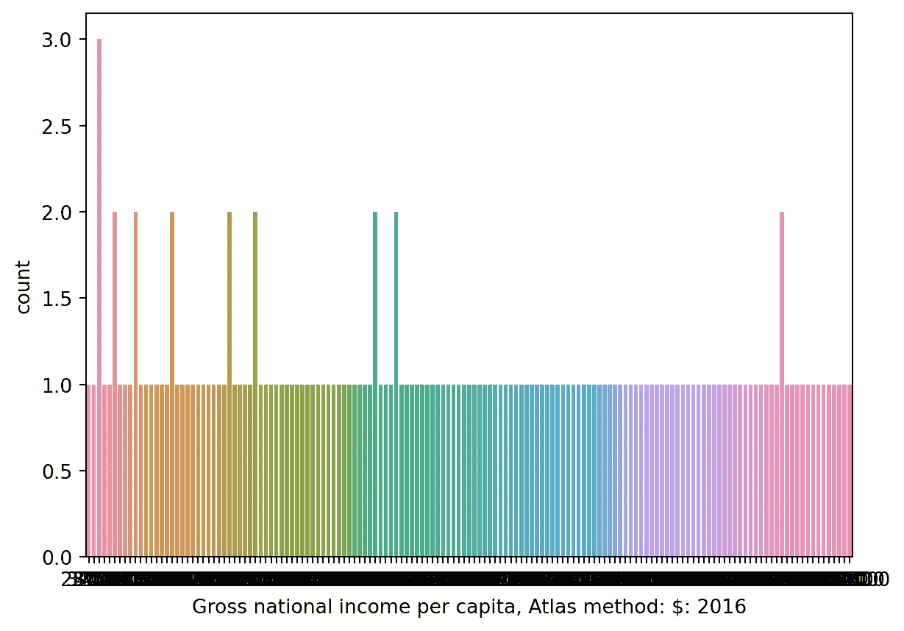

# 七、可视化 I

> 原文：[Visualization I](https://ds100.org/course-notes/visualization_1/visualization_1.html)
> 
> 译者：[飞龙](https://github.com/wizardforcel)
> 
> 协议：[CC BY-NC-SA 4.0](https://creativecommons.org/licenses/by-nc-sa/4.0/)

*学习成果*

+   使用`matplotlib`和`seaborn`创建数据可视化。

+   分析直方图，识别偏斜、潜在异常值和众数。

+   使用`boxplot`和`violinplot`比较两个分布。

**这个内容在第 7 讲中涵盖。**

在我们的数据科学生命周期中，我们已经开始探索广阔的探索性数据分析世界。最近，我们学会了使用各种数据处理技术对数据进行预处理。当我们努力理解我们的数据时，我们的工具中缺少一个关键组件——即可视化和识别现有数据中的关系的能力。

接下来的两节课将向您介绍各种数据可视化的例子及其基本理论。通过这样做，我们将以绘图库的使用在真实世界的例子中激发它们的重要性。

## 7.1 Data 8 和 Data 100 中的可视化（到目前为止）

在学习过程中，您可能遇到了几种形式的数据可视化。您可能还记得 Data 8 中的两个例子：折线图和直方图。每个都有独特的用途。例如，折线图显示了数值数量随时间的变化，而直方图有助于理解变量的分布。

**折线图**


**直方图**


## 7.2 可视化的目标

可视化有许多用途。在 Data 100 中，我们特别考虑了两个领域：

1.  为了扩大您对数据的理解

    +   探索性数据分析中的关键部分。

    +   有助于调查变量之间的关系。

1.  向他人传达结果/结论

    +   可视化理论在这里尤为重要。

可视化最常见的应用之一是理解数据的分布。

本课程笔记将重点介绍 Data 100 中可视化主题的前半部分。这里的目标是了解如何根据不同的变量类型选择“正确”的图表，其次是如何使用代码生成这些图表。

## 7.3 分布概述

分布描述了变量中唯一值的频率。分布必须满足两个属性：

1.  每个数据点必须属于一个类别。

1.  所有类别的总频率必须相加等于 100%。换句话说，它们的总计数应等于考虑的值的数量。

**无效的分布**


**有效的分布**


左图：这不是一个有效的分布，因为个体可以与多个类别相关联，条形值表示的是分钟而不是概率。

右图：这个例子满足了分布的两个属性，因此它是一个有效的分布。

## 7.4 变量类型应指导绘图选择

不同的图表更或者更不适合显示特定类型的变量，如下图所示：


## 7.5 条形图

正如我们上面看到的，**条形图**是显示**定性**（分类）变量分布的最常见方式之一。条形图的长度编码了类别的频率；宽度没有编码有用的信息。颜色*可能*表示一个子类别，但这并不一定是这样。

让我们通过一个例子来加以说明。我们将在分析中使用世界银行数据集（`wb`）。

代码

```py
import pandas as pd
import numpy as np

wb = pd.read_csv("data/world_bank.csv", index_col=0)
wb.head()
```

| | Continent | Country | Primary completion rate: Male: % of relevant age group: 2015 | Primary completion rate: Female: % of relevant age group: 2015 | Lower secondary completion rate: Male: % of relevant age group: 2015 | Lower secondary completion rate: Female: % of relevant age group: 2015 | Youth literacy rate: Male: % of ages 15-24: 2005-14 | Youth literacy rate: Female: % of ages 15-24: 2005-14 | Adult literacy rate: Male: % ages 15 and older: 2005-14 | Adult literacy rate: Female: % ages 15 and older: 2005-14 | ... | Access to improved sanitation facilities: % of population: 1990 | Access to improved sanitation facilities: % of population: 2015 | Child immunization rate: Measles: % of children ages 12-23 months: 2015 | Child immunization rate: DTP3: % of children ages 12-23 months: 2015 | Children with acute respiratory infection taken to health provider: % of children under age 5 with ARI: 2009-2016 | Children with diarrhea who received oral rehydration and continuous feeding: % of children under age 5 with diarrhea: 2009-2016 | Children sleeping under treated bed nets: % of children under age 5: 2009-2016 | Children with fever receiving antimalarial drugs: % of children under age 5 with fever: 2009-2016 | Tuberculosis: Treatment success rate: % of new cases: 2014 | Tuberculosis: Cases detection rate: % of new estimated cases: 2015 |
| --- | --- | --- | --- | --- | --- | --- | --- | --- | --- | --- | --- | --- | --- | --- | --- | --- | --- | --- | --- | --- | --- |
| 0 | Africa | Algeria | 106.0 | 105.0 | 68.0 | 85.0 | 96.0 | 92.0 | 83.0 | 68.0 | ... | 80.0 | 88.0 | 95.0 | 95.0 | 66.0 | 42.0 | NaN | NaN | 88.0 | 80.0 |
| 1 | Africa | Angola | NaN | NaN | NaN | NaN | 79.0 | 67.0 | 82.0 | 60.0 | ... | 22.0 | 52.0 | 55.0 | 64.0 | NaN | NaN | 25.9 | 28.3 | 34.0 | 64.0 |
| 2 | Africa | Benin | 83.0 | 73.0 | 50.0 | 37.0 | 55.0 | 31.0 | 41.0 | 18.0 | ... | 7.0 | 20.0 | 75.0 | 79.0 | 23.0 | 33.0 | 72.7 | 25.9 | 89.0 | 61.0 |
| 3 | Africa | Botswana | 98.0 | 101.0 | 86.0 | 87.0 | 96.0 | 99.0 | 87.0 | 89.0 | ... | 39.0 | 63.0 | 97.0 | 95.0 | NaN | NaN | NaN | NaN | 77.0 | 62.0 |
| 5 | Africa | Burundi | 58.0 | 66.0 | 35.0 | 30.0 | 90.0 | 88.0 | 89.0 | 85.0 | ... | 42.0 | 48.0 | 93.0 | 94.0 | 55.0 | 43.0 | 53.8 | 25.4 | 91.0 | 51.0 |

5 行 × 47 列

我们可以使用条形图来可视化 `Continent` 列的分布。有几种方法可以做到这一点。

### 7.5.1 在 Pandas 中绘图

```py
wb['Continent'].value_counts().plot(kind = 'bar');
```


回想一下，`.value_counts()` 返回一个 `Series`，其中包含每个唯一值的总计数。我们在这个结果上调用 `.plot(kind = 'bar')` 来将这些计数可视化为条形图。

`pandas` 中的绘图方法是最不受欢迎的，也不受 Data 100 的支持，因为它们的功能有限。相反，未来的示例将专注于其他专门用于可视化数据的库。这里最知名的库是 `matplotlib`。

### 7.5.2 在 Matplotlib 中绘图

```py
import matplotlib.pyplot as plt # matplotlib is typically given the alias plt

continent = wb['Continent'].value_counts()
plt.bar(continent.index, continent)
plt.xlabel('Continent')
plt.ylabel('Count');
```


虽然需要更多的代码来实现相同的结果，但 `matplotlib` 通常比 `pandas` 更常用，因为它能够绘制更复杂的可视化效果，其中一些很快就会讨论。

然而，请注意我们需要使用 `plt.xlabel` 和 `plt.ylabel` 标记轴 - `matplotlib` 不支持自动轴标记。为了避免这些不便，我们可以使用更高效的绘图库 `seaborn`。

### 7.5.3 在 Seaborn 中绘图

```py
import seaborn as sns # seaborn is typically given the alias sns
sns.countplot(data = wb, x = 'Continent');
```


`seaborn.countplot` 既计算又可视化给定列中唯一值的数量。这一列由 `x` 参数指定为 `sns.countplot`，而 `DataFrame` 由 `data` 参数指定。与 `matplotlib` 相反，`seaborn` 调用的一般结构涉及传入整个 `DataFrame`，然后指定要绘制的列。

对于绝大多数可视化，`seaborn`比`matplotlib`更简洁和美观。然而，这个特定条形图的颜色方案是任意的 - 它并不额外编码有关类别本身的任何信息。这并不总是正确的；颜色可能在其他可视化中表示有意义的细节。我们将在下一讲中更深入地探讨这一点。

到目前为止，您可能已经注意到这些绘图库的语法各不相同。与`pandas`一样，我们将教您`matplotlib`和`seaborn`中的重要方法，但您将通过文档学到更多。

1.  [Matplotlib 文档](https://matplotlib.org/stable/index.html)

1.  [Seaborn 文档](https://seaborn.pydata.org/)

回想我们的第二个目标，当我们想要使用可视化来向他人传达结果/结论时，我们必须考虑：

+   我们应该使用什么颜色？

+   条的宽度应该是多少？

+   图例是否存在？

+   条形和坐标轴应该有深色边框吗？

为了实现这一点，以下是我们可以改进绘图的一些方法：

+   为每个条引入不同的颜色

+   包括图例

+   包括标题

+   标记 y 轴

+   使用色盲友好的调色板

+   重新定位标签

+   增加字体大小

## 7.6 定量变量的分布

重新审视我们的`wb` DataFrame 的示例，让我们绘制`人均国民总收入`的分布。

代码

```py
wb.head(5)
```

| | Continent | Country | Primary completion rate: Male: % of relevant age group: 2015 | Primary completion rate: Female: % of relevant age group: 2015 | Lower secondary completion rate: Male: % of relevant age group: 2015 | Lower secondary completion rate: Female: % of relevant age group: 2015 | Youth literacy rate: Male: % of ages 15-24: 2005-14 | Youth literacy rate: Female: % of ages 15-24: 2005-14 | Adult literacy rate: Male: % ages 15 and older: 2005-14 | Adult literacy rate: Female: % ages 15 and older: 2005-14 | ... | Access to improved sanitation facilities: % of population: 1990 | Access to improved sanitation facilities: % of population: 2015 | Child immunization rate: Measles: % of children ages 12-23 months: 2015 | Child immunization rate: DTP3: % of children ages 12-23 months: 2015 | Children with acute respiratory infection taken to health provider: % of children under age 5 with ARI: 2009-2016 | Children with diarrhea who received oral rehydration and continuous feeding: % of children under age 5 with diarrhea: 2009-2016 | Children sleeping under treated bed nets: % of children under age 5: 2009-2016 | Children with fever receiving antimalarial drugs: % of children under age 5 with fever: 2009-2016 | Tuberculosis: Treatment success rate: % of new cases: 2014 | Tuberculosis: Cases detection rate: % of new estimated cases: 2015 |
| --- | --- | --- | --- | --- | --- | --- | --- | --- | --- | --- | --- | --- | --- | --- | --- | --- | --- | --- | --- | --- | --- |
| 0 | Africa | Algeria | 106.0 | 105.0 | 68.0 | 85.0 | 96.0 | 92.0 | 83.0 | 68.0 | ... | 80.0 | 88.0 | 95.0 | 95.0 | 66.0 | 42.0 | NaN | NaN | 88.0 | 80.0 |
| 1 | Africa | Angola | NaN | NaN | NaN | NaN | 79.0 | 67.0 | 82.0 | 60.0 | ... | 22.0 | 52.0 | 55.0 | 64.0 | NaN | NaN | 25.9 | 28.3 | 34.0 | 64.0 |
| 2 | Africa | Benin | 83.0 | 73.0 | 50.0 | 37.0 | 55.0 | 31.0 | 41.0 | 18.0 | ... | 7.0 | 20.0 | 75.0 | 79.0 | 23.0 | 33.0 | 72.7 | 25.9 | 89.0 | 61.0 |
| 3 | Africa | Botswana | 98.0 | 101.0 | 86.0 | 87.0 | 96.0 | 99.0 | 87.0 | 89.0 | ... | 39.0 | 63.0 | 97.0 | 95.0 | NaN | NaN | NaN | NaN | 77.0 | 62.0 |
| 5 | Africa | Burundi | 58.0 | 66.0 | 35.0 | 30.0 | 90.0 | 88.0 | 89.0 | 85.0 | ... | 42.0 | 48.0 | 93.0 | 94.0 | 55.0 | 43.0 | 53.8 | 25.4 | 91.0 | 51.0 |

5 行×47 列

我们应该如何定义这个变量的类别？在前面的例子中，这些是`Continent`列的几个唯一值。如果我们在这里使用类似的逻辑，我们的类别就是`人均国民总收入`列中包含的不同数值。

在这个假设下，让我们使用`seaborn.countplot`函数绘制这个分布。

```py
sns.countplot(data = wb, x = 'Gross national income per capita, Atlas method: $: 2016');
```



发生了什么？条形图（`plt.bar`或`sns.countplot`）将为变量的每个唯一值创建一个单独的条。对于连续变量，我们可能没有有限数量的可能值，这可能导致我们需要许多条来显示每个唯一值的情况。

具体来说，我们可以说这个直方图受到**重叠绘图**的影响，因为我们无法解释图表并获得任何有意义的见解。

与条形图不同，为了可视化连续变量的分布，我们使用以下类型的图之一：

+   直方图

+   箱线图

+   小提琴图

## 7.7 箱线图和小提琴图

箱线图和小提琴图是两种非常相似的可视化类型。两者都使用四分位数的信息显示变量的分布。

在箱线图中，箱子在任意点的宽度不编码含义。在小提琴图中，图的宽度表示每个可能值的分布密度。

```py
sns.boxplot(data=wb, y='Gross national income per capita, Atlas method: $: 2016');
```


```py
sns.violinplot(data=wb, y="Gross national income per capita, Atlas method: $: 2016");
```


四分位数代表数据的 25%部分。我们说：

+   第一四分位数（Q1）代表第 25 百分位数-25%的数据位于第一四分位数以下。

+   第二四分位数（Q2）代表第 50 百分位数，也称为中位数-50%的数据位于第二四分位数以下。

+   第三四分位数（Q3）代表第 75 百分位数-75%的数据位于第三四分位数以下。

这意味着数据的中间 50%位于第一和第三四分位数之间。这在下面的直方图中得到了证明。三个四分位数用红色垂直线标记。

```py
gdp = wb['Gross domestic product: % growth : 2016']
gdp = gdp[~gdp.isna()]

q1, q2, q3 = np.percentile(gdp, [25, 50, 75])

wb_quartiles = wb.copy()
wb_quartiles['category'] = None
wb_quartiles.loc[(wb_quartiles['Gross domestic product: % growth : 2016'] < q1) | (wb_quartiles['Gross domestic product: % growth : 2016'] > q3), 'category'] = 'Outside of the middle 50%'
wb_quartiles.loc[(wb_quartiles['Gross domestic product: % growth : 2016'] > q1) & (wb_quartiles['Gross domestic product: % growth : 2016'] < q3), 'category'] = 'In the middle 50%'

sns.histplot(wb_quartiles, x="Gross domestic product: % growth : 2016", hue="category")
sns.rugplot([q1, q2, q3], c="firebrick", lw=6, height=0.1);
```


在箱线图中，箱子的下限位于 Q1，而箱子的上限位于 Q3。箱子中间的水平线对应于 Q2（或者说中位数）。

```py
sns.boxplot(data=wb, y='Gross domestic product: % growth : 2016');
```


箱线图的**须**是位于[（1 四分位-（1.5×IQR））]和[（3 四分位+（1.5×IQR））]的两个点。它们是“正常”数据的下限和上限范围（不包括异常值的点）。

箱线图中包含的不同形式的信息可以总结如下：


小提琴图显示四分位数信息，尽管有点微妙。仔细看下面小提琴图的中心垂直条！

```py
sns.violinplot(data=wb, y='Gross domestic product: % growth : 2016');
```


## 7.8 并列箱线图和小提琴图

绘制并列的箱线图或小提琴图可以让我们比较不同类别的分布。换句话说，它们使我们能够在一个可视化中绘制定性变量和定量连续变量。

使用`seaborn`，我们可以通过指定 x 和 y 列轻松创建并列图。

```py
sns.boxplot(data=wb, x="Continent", y='Gross domestic product: % growth : 2016');
```


## 7.9 绘制直方图

您可能熟悉 Data 8 中的直方图。直方图将连续数据收集到箱中，然后绘制这些分箱数据。每个箱反映了数值位于箱的左右端之间的数据点的密度。

```py
# The `edgecolor` argument controls the color of the bin edges
gni = wb["Gross national income per capita, Atlas method: $: 2016"]
plt.hist(gni, density=True, edgecolor="white")

# Add labels
plt.xlabel("Gross national income per capita")
plt.ylabel("Density")
plt.title("Distribution of gross national income per capita");
```


```py
sns.histplot(data=wb, x="Gross national income per capita, Atlas method: $: 2016", stat="density")
plt.title("Distribution of gross national income per capita");
```


### 7.9.1 重叠直方图

我们可以叠加直方图（或密度曲线）来比较定性类别的分布。

`sns.histplot`的`hue`参数指定应该用于确定每个类别颜色的列。`hue`可以在许多`seaborn`绘图函数中使用。

请注意，生成的图表包括一个图例，描述每个半球对应的颜色 - 如果颜色用于编码可视化中的信息，则应始终包括图例！

```py
# Create a new variable to store the hemisphere in which each country is located
north = ["Asia", "Europe", "N. America"]
south = ["Africa", "Oceania", "S. America"]
wb.loc[wb["Continent"].isin(north), "Hemisphere"] = "Northern"
wb.loc[wb["Continent"].isin(south), "Hemisphere"] = "Southern"
```

```py
sns.histplot(data=wb, x="Gross national income per capita, Atlas method: $: 2016", hue="Hemisphere", stat="density")
plt.title("Distribution of gross national income per capita");
```


直方图的每个箱子都经过缩放，使其面积等于其包含的所有数据点的百分比。

```py
densities, bins, _ = plt.hist(gni, density=True, edgecolor="white", bins=5)
plt.xlabel("Gross national income per capita")
plt.ylabel("Density")

print(f"First bin has width {bins[1]-bins[0]} and height {densities[0]}")
print(f"This corresponds to {bins[1]-bins[0]} * {densities[0]} = {(bins[1]-bins[0])*densities[0]*100}% of the data")
```

```py
First bin has width 16410.0 and height 4.7741589911386953e-05
This corresponds to 16410.0 * 4.7741589911386953e-05 = 78.343949044586% of the data
```


## 7.10 评估直方图

直方图允许我们通过它们的形状来评估分布。我们可以分析直方图的一些属性：

1.  偏斜和尾部

    +   左偏 vs 右偏

    +   左尾 vs 右尾

1.  异常值

    +   使用百分位数

1.  模式

    +   最常出现的数据

### 7.10.1 偏斜和尾部

直方图的偏斜描述了其“尾巴”延伸的方向。- 具有较长右尾的分布是**右偏的**（例如`人均国民总收入`）。在右偏分布中，少数大的异常值将均值“拉”到中位数的**右侧**。- 具有较长左尾的分布是**左偏的**（例如`改善的饮水来源`）。在左偏分布中，少数小的异常值将均值“拉”到中位数的**左侧**。

在分布的右尾和左尾大小相等的情况下，它是**对称的**。均值大约等于中位数。将均值视为分布的平衡点。

```py
sns.histplot(data = wb, x = 'Gross national income per capita, Atlas method: $: 2016', stat = 'density');
plt.title('Distribution with a long right tail')
```

```py
Text(0.5, 1.0, 'Distribution with a long right tail')
```


```py
sns.histplot(data = wb, x = 'Access to an improved water source: % of population: 2015', stat = 'density');
plt.title('Distribution with a long left tail')
```

```py
Text(0.5, 1.0, 'Distribution with a long left tail')
```


### 7.10.2 异常值

粗略地说，**异常值**被定义为与其他值相比距离异常大的数据点。让我们更具体地描述一下。正如您可能在之前的箱线图信息图表中观察到的，我们将**异常值**定义为超出触须的数据点。具体来说，小于[$第 1 四分位数 - (1.5 \times$ IQR)]或大于[$第 3 四分位数 + (1.5 \times$ IQR)]的值。

### 7.10.3 模式

在 Data 100 中，我们将直方图的“模式”描述为分布中的峰值。然而，通常很难确定什么算作自己的“峰值”。例如，HIV 率在不同国家之间的分布的峰值数量取决于我们绘制的直方图箱数。

如果我们将箱数设置为 5，则分布呈单峰分布。

```py
# Rename the very long column name for convenience
wb = wb.rename(columns={'Antiretroviral therapy coverage: % of people living with HIV: 2015':"HIV rate"})
# With 5 bins, it seems that there is only one peak
sns.histplot(data=wb, x="HIV rate", stat="density", bins=5)
plt.title("5 histogram bins");
```


```py
# With 10 bins, there seem to be two peaks

sns.histplot(data=wb, x="HIV rate", stat="density", bins=10)
plt.title("10 histogram bins");
```


```py
# And with 20 bins, it becomes hard to say what counts as a "peak"!

sns.histplot(data=wb, x ="HIV rate", stat="density", bins=20)
plt.title("20 histogram bins");
```


在某种程度上，正是这些模糊性促使我们考虑使用核密度估计（KDE），我们将在下一讲中更多地探讨。
