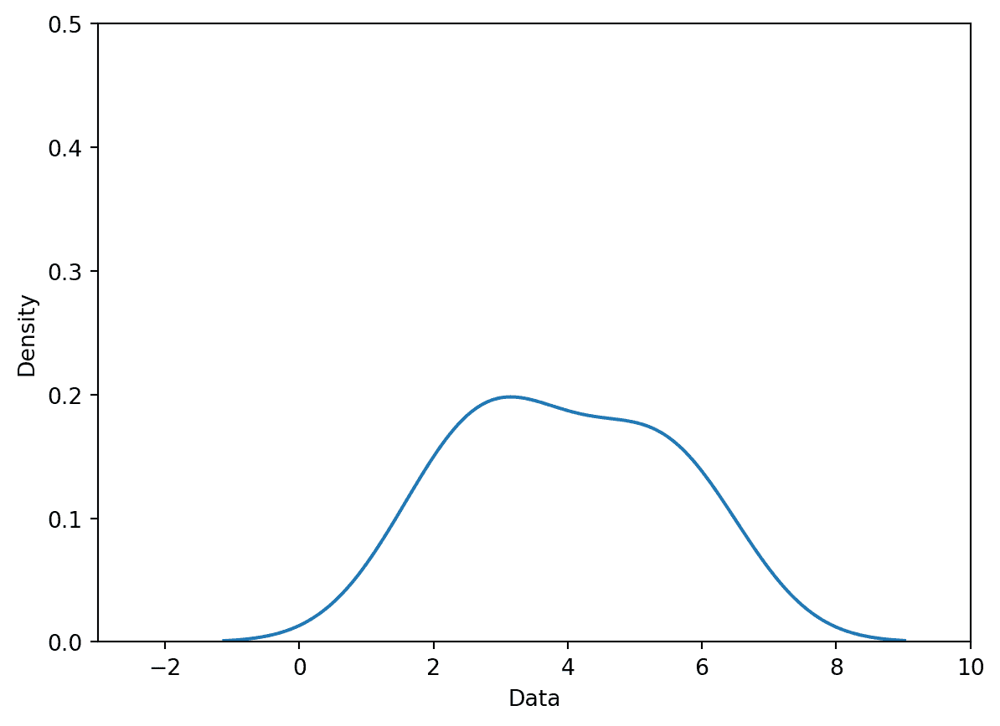
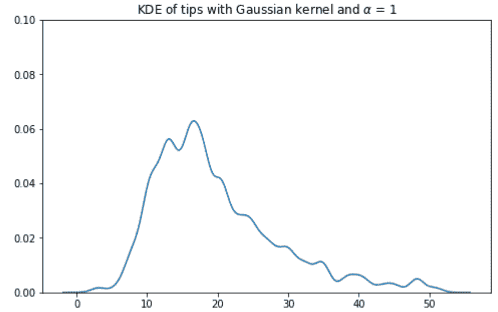
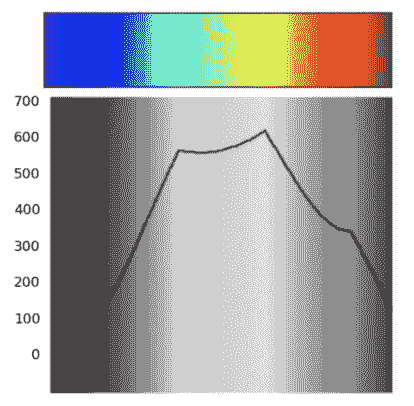

# 八、可视化 II

> 原文：[Visualization II](https://ds100.org/course-notes/visualization_2/visualization_2.html)
> 
> 译者：[飞龙](https://github.com/wizardforcel)
> 
> 协议：[CC BY-NC-SA 4.0](https://creativecommons.org/licenses/by-nc-sa/4.0/)

*学习成果*

+   了解用于绘制分布和估计密度曲线的 KDE。

+   使用转换分析两个变量之间的关系。

+   根据可视化理论概念评估可视化的质量。

### 8.0.1 核密度估计

#### 8.0.1.1 KDE 理论

现在让我们深入研究核密度估计。**核密度估计（KDE）**是一种平滑的连续函数，它近似表示一条曲线。它们允许我们表示分布的一般趋势，而不专注于细节，这对于分析数据集的广泛结构是有用的。

更正式地说，KDE 试图近似我们的数据集抽取的潜在**概率分布**。您可能在其他课程中遇到过概率分布的概念；如果没有，我们将在下一讲中详细讨论。现在，您可以将概率分布视为描述我们在数据集中抽取特定值的可能性有多大。

KDE 曲线估计随机变量的概率密度函数。考虑下面的例子，我们使用`sns.displot`绘制了直方图（包含我们实际收集的数据点）和 KDE 曲线（代表*近似*概率分布，从中抽取了这些数据）使用我们之前使用过的世界银行数据集（`wb`）。

代码

```py
import pandas as pd
import numpy as np
import matplotlib.pyplot as plt
import seaborn as sns

wb = pd.read_csv("data/world_bank.csv", index_col=0)
wb = wb.rename(columns={'Antiretroviral therapy coverage: % of people living with HIV: 2015':"HIV rate",
 'Gross national income per capita, Atlas method: $: 2016':'gni'})
wb.head()
```

| | Continent | Country | Primary completion rate: Male: % of relevant age group: 2015 | Primary completion rate: Female: % of relevant age group: 2015 | Lower secondary completion rate: Male: % of relevant age group: 2015 | Lower secondary completion rate: Female: % of relevant age group: 2015 | Youth literacy rate: Male: % of ages 15-24: 2005-14 | Youth literacy rate: Female: % of ages 15-24: 2005-14 | Adult literacy rate: Male: % ages 15 and older: 2005-14 | Adult literacy rate: Female: % ages 15 and older: 2005-14 | ... | Access to improved sanitation facilities: % of population: 1990 | Access to improved sanitation facilities: % of population: 2015 | Child immunization rate: Measles: % of children ages 12-23 months: 2015 | Child immunization rate: DTP3: % of children ages 12-23 months: 2015 | Children with acute respiratory infection taken to health provider: % of children under age 5 with ARI: 2009-2016 | Children with diarrhea who received oral rehydration and continuous feeding: % of children under age 5 with diarrhea: 2009-2016 | Children sleeping under treated bed nets: % of children under age 5: 2009-2016 | Children with fever receiving antimalarial drugs: % of children under age 5 with fever: 2009-2016 | Tuberculosis: Treatment success rate: % of new cases: 2014 | Tuberculosis: Cases detection rate: % of new estimated cases: 2015 |
| --- | --- | --- | --- | --- | --- | --- | --- | --- | --- | --- | --- | --- | --- | --- | --- | --- | --- | --- | --- | --- | --- |
| 0 | Africa | Algeria | 106.0 | 105.0 | 68.0 | 85.0 | 96.0 | 92.0 | 83.0 | 68.0 | ... | 80.0 | 88.0 | 95.0 | 95.0 | 66.0 | 42.0 | NaN | NaN | 88.0 | 80.0 |
| 1 | Africa | Angola | NaN | NaN | NaN | NaN | 79.0 | 67.0 | 82.0 | 60.0 | ... | 22.0 | 52.0 | 55.0 | 64.0 | NaN | NaN | 25.9 | 28.3 | 34.0 | 64.0 |
| 2 | Africa | Benin | 83.0 | 73.0 | 50.0 | 37.0 | 55.0 | 31.0 | 41.0 | 18.0 | ... | 7.0 | 20.0 | 75.0 | 79.0 | 23.0 | 33.0 | 72.7 | 25.9 | 89.0 | 61.0 |
| 3 | Africa | Botswana | 98.0 | 101.0 | 86.0 | 87.0 | 96.0 | 99.0 | 87.0 | 89.0 | ... | 39.0 | 63.0 | 97.0 | 95.0 | NaN | NaN | NaN | NaN | 77.0 | 62.0 |
| 5 | Africa | Burundi | 58.0 | 66.0 | 35.0 | 30.0 | 90.0 | 88.0 | 89.0 | 85.0 | ... | 42.0 | 48.0 | 93.0 | 94.0 | 55.0 | 43.0 | 53.8 | 25.4 | 91.0 | 51.0 |

5 行×47 列

```py
import seaborn as sns
import matplotlib.pyplot as plt

sns.displot(data = wb, x = 'HIV rate', \
 kde = True, stat = "density")

plt.title("Distribution of HIV rates");
```

```py
/Users/Ishani/micromamba/lib/python3.9/site-packages/seaborn/axisgrid.py:118: UserWarning:

The figure layout has changed to tight 
```


注意，平滑的 KDE 曲线在直方图箱更高时更高。你可以将 KDE 曲线的高度看作代表我们随机抽样具有相应值的数据点的“可能性”有多大。这在直观上是有意义的 - 如果我们已经收集了更多具有特定值的数据点（导致一个高的直方图箱），那么如果我们随机抽样另一个数据点，我们更有可能抽样到一个具有类似值的数据点（导致高的 KDE 曲线）。

概率密度函数下的面积应该始终积分为 1，表示分布的总概率应始终总和为 100%。因此，KDE 曲线下始终有一个面积为 1。

#### 8.0.1.2 构建 KDE

我们使用三个步骤进行核密度估计。

1.  在每个数据点放置一个核。

1.  将核函数归一化，使其总面积为 1（跨所有核函数）。

1.  对归一化的核求和。

我们马上会解释“核”是什么。

为了简化，让我们为一个由 5 个数据点构成的小型人工生成的数据集$[2.2, 2.8, 3.7, 5.3, 5.7]$构建一个 KDE。在下面的图中，每个垂直条代表一个数据点。

代码

```py
data = [2.2, 2.8, 3.7, 5.3, 5.7]

sns.rugplot(data, height=0.3)

plt.xlabel("Data")
plt.ylabel("Density")
plt.xlim(-3, 10)
plt.ylim(0, 0.5);
```


我们的目标是创建以下由`sns.kdeplot`自动生成的 KDE 曲线。

代码

```py
sns.kdeplot(data)

plt.xlabel("Data")
plt.xlim(-3, 10)
plt.ylim(0, 0.5);
```



##### 8.0.1.2.1 步骤 1：在每个数据点上放置一个核

要开始生成密度曲线，我们需要选择一个**核**和**带宽值（$\alpha$)**。这些究竟是什么？

**核**是一个密度曲线。它是试图捕捉我们采样数据中每个数据点的随机性的数学函数。为了解释这意味着什么，考虑我们数据集中的*一个*数据点：$2.2$。我们通过随机抽样得到了这个数据点（你可以想象$2.2$代表实验中进行的单次测量，例如）。如果我们抽样一个新的数据点，可能会得到一个略有不同的值。它可能高于$2.2$；也可能低于$2.2$。我们假设任何未来抽样的数据点可能与我们已经绘制的数据值相似。这意味着我们的*核* - 我们对随机抽样任何新值的概率的描述 - 在我们已经绘制的数据点处最大，但在其上下仍具有非零概率。任何核下的面积应该积分为 1，表示抽取新数据点的总概率。

**带宽值**通常用 $\alpha$ 表示，表示核的宽度。 $\alpha$ 的值越大，核函数就会变得宽而短，而值越小，核函数就会变得窄而高。

下面，我们在数据点$2.2$上放置了一个**高斯核**，用橙色绘制。高斯核简单地是正态分布，在 Data 8 中可能称为钟形曲线。

代码

```py
def gaussian_kernel(x, z, a):
 # We'll discuss where this mathematical formulation came from later
 return (1/np.sqrt(2*np.pi*a**2)) * np.exp((-(x - z)**2 / (2 * a**2)))

# Plot our datapoint
sns.rugplot([2.2], height=0.3)

# Plot the kernel
x = np.linspace(-3, 10, 1000)
plt.plot(x, gaussian_kernel(x, 2.2, 1))

plt.xlabel("Data")
plt.ylabel("Density")
plt.xlim(-3, 10)
plt.ylim(0, 0.5);
```


要开始创建我们的 KDE，我们在我们的数据集中的*每个*数据点上放置一个核。对于我们的 5 个数据点的数据集，我们将有 5 个核。

代码

```py
# You will work with the functions below in Lab 4
def create_kde(kernel, pts, a):
 # Takes in a kernel, set of points, and alpha
 # Returns the KDE as a function
 def f(x):
 output = 0
 for pt in pts:
 output += kernel(x, pt, a)
 return output / len(pts) # Normalization factor
 return f

def plot_kde(kernel, pts, a):
 # Calls create_kde and plots the corresponding KDE
 f = create_kde(kernel, pts, a)
 x = np.linspace(min(pts) - 5, max(pts) + 5, 1000)
 y = [f(xi) for xi in x]
 plt.plot(x, y);

def plot_separate_kernels(kernel, pts, a, norm=False):
 # Plots individual kernels, which are then summed to create the KDE
 x = np.linspace(min(pts) - 5, max(pts) + 5, 1000)
 for pt in pts:
 y = kernel(x, pt, a)
 if norm:
 y /= len(pts)
 plt.plot(x, y)

 plt.show();

plt.xlim(-3, 10)
plt.ylim(0, 0.5)
plt.xlabel("Data")
plt.ylabel("Density")

plot_separate_kernels(gaussian_kernel, data, a = 1)
```


##### 8.0.1.2.2 步骤 2：将核归一化为总面积为 1

前面我们说*每个*核的面积为 1。早些时候，我们还说我们的目标是使用这些核构建一个*总*面积为 1 的 KDE 曲线。如果我们直接将核求和，我们将得到一个积分面积为（5 个核）$\times$（每个 1 的面积）= 5。为了避免这种情况，我们将**归一化**我们的每个核。这涉及将每个核乘以$1/(\#\:\text{数据点})$。

在下面的单元格中，我们将我们的 5 个核心中的每一个乘以$\frac{1}{5}$来应用归一化。

代码

```py
plt.xlim(-3, 10)
plt.ylim(0, 0.5)
plt.xlabel("Data")
plt.ylabel("Density")

# The `norm` argument specifies whether or not to normalize the kernels
plot_separate_kernels(gaussian_kernel, data, a = 1, norm = True)
```


##### 8.0.1.2.3 步骤 3：求和归一化核心

我们的 KDE 曲线是归一化核心的总和。请注意，最终曲线与我们之前看到的`sns.kdeplot`生成的图相同！

代码

```py
plt.xlim(-3, 10)
plt.ylim(0, 0.5)
plt.xlabel("Data")
plt.ylabel("Density")

plot_kde(gaussian_kernel, data, a = 1)
```


#### 8.0.1.3 核函数和带宽

一个**核心**（对我们来说）是一个有效的密度函数。这意味着它：

+   对于所有输入，必须为非负。

+   必须积分为 1。


上面给出了一个一般的“KDE 公式”函数。

1.  $K_{\alpha}(x, x_i)$是以观察`i`为中心的核心。

    +   每个核心单独的面积为 1。

    +   x 代表数轴上的任何数字。它是我们函数的输入。

1.  $n$是我们观察到的数据点的数量。

    +   我们乘以$\frac{1}{n}$，以便 KDE 的总面积仍然为 1。

1.  每个$x_i \in \{x_1, x_2, \dots, x_n\}$代表一个观察到的数据点。

    +   这些是我们用来通过对这些点进行多次移位的核心来创建我们的 KDE 的。

$\alpha$（alpha）是带宽或平滑参数。

##### 8.0.1.3.1 高斯核

最常见的核心是**高斯核**。高斯核等同于以观察值为中心，标准差为（这被称为**带宽**参数）的高斯概率密度函数。

$$K_a(x, x_i) = \frac{1}{\sqrt{2\pi\alpha^{2}}}e^{-\frac{(x-x_i)^{2}}{2\alpha^{2}}}$$

在这个公式中：

+   $x$（无下标）代表我们绘图的 x 轴上的值

+   $x_i$代表我们数据集中的第$i$个数据点。这是我们在数据采样过程中实际收集到的值之一。在我们之前的例子中，$x_i=2.2$。那些上过概率课的人可能会认出$x_i$是正态分布的**均值**。

+   $\alpha$是带宽参数，代表我们核心的宽度。更正式地说，$\alpha$是高斯曲线的**标准差**。

这个（令人生畏的）公式的细节不如理解它在核密度估计中的作用重要-这个方程给了我们每个核心的形状。

较大的$\alpha$值会产生一个更宽更短的核心-当这些核心被求和时，这会导致更平滑的 KDE。相反，较小的$\alpha$值会产生一个更窄更高的核心，以及一个更嘈杂的 KDE。

**高斯核，$\alpha$ = 0.1**


**高斯核，$\alpha$ = 1**



**高斯核，$\alpha$ = 2**


**高斯核，$\alpha$ = 10**


#### 8.0.1.4 矩箱核

核心的另一个例子是**矩箱核**。矩箱核为观察点内的点分配均匀密度，其他地方的密度为 0。下面的方程是以$x_i$为中心，带宽为$\alpha$的矩箱核。

$$K_a(x, x_i) = \begin{cases} \frac{1}{\alpha}, & |x - x_i| \le \frac{\alpha}{2}\\ 0, & \text{else } \end{cases}$$

矩箱核在实践中很少使用-我们在这里包括它是为了演示核函数可以采用任何您喜欢的形式，只要它积分为 1 并且不输出负值。

代码

```py
def boxcar_kernel(alpha, x, z):
 return (((x-z)>=-alpha/2)&((x-z)<=alpha/2))/alpha

xs = np.linspace(-5, 5, 200)
alpha=1
kde_curve = [boxcar_kernel(alpha, x, 0) for x in xs]
plt.plot(xs, kde_curve);
```


以带宽$\alpha$ = 1 为中心的矩箱核。

右侧的图表显示了我们的 5 个数据点数据集使用 Boxcar 核和带宽$\alpha$ = 1 时的密度曲线。


#### 8.0.1.5 深入了解`displot`

正如我们之前看到的，我们可以使用`seaborn`的`displot`函数来绘制各种分布。特别是，`displot`允许您指定绘图的`kind`，并且是`histplot`、`kdeplot`和`ecdfplot`的包装器。

下面，我们可以看到一些示例，说明了如何使用`sns.displot`来绘制各种分布。

首先，我们可以通过将`kind`设置为`"hist"`来绘制直方图。请注意，这里我们指定了`stat = density`，以使直方图归一化，使得直方图下面积等于 1。

```py
sns.displot(data=wb, 
 x="gni", 
 kind="hist", 
 stat="density") # default: stat=count and density integrates to 1
plt.title("Distribution of gross national income per capita");
```

```py
/Users/Ishani/micromamba/lib/python3.9/site-packages/seaborn/axisgrid.py:118: UserWarning:

The figure layout has changed to tight 
```


现在，如果我们想生成一个 KDE 图呢？我们可以将`kind`设置为`"kde"`！

```py
sns.displot(data=wb, 
 x="gni", 
 kind='kde')
plt.title("Distribution of gross national income per capita");
```

```py
/Users/Ishani/micromamba/lib/python3.9/site-packages/seaborn/axisgrid.py:118: UserWarning:

The figure layout has changed to tight 
```


最后，如果我们想生成一个经验累积分布函数（ECDF），我们可以指定`kind = "ecdf"`。

```py
sns.displot(data=wb, 
 x="gni", 
 kind='ecdf')
plt.title("Cumulative Distribution of gross national income per capita");
```

```py
/Users/Ishani/micromamba/lib/python3.9/site-packages/seaborn/axisgrid.py:118: UserWarning:

The figure layout has changed to tight 
```


## 8.1 定量变量之间的关系

到目前为止，我们已经讨论了如何可视化单变量分布。除此之外，我们还想了解数值变量对之间的关系。

#### 8.1.0.1 散点图

**散点图**是表示两个定量变量之间关系的最有用的工具之一。它们在评估变量之间的关系强度或相关性方面特别重要。对这些关系的了解可以激发我们建模过程中的决策。

在`matplotlib`中，我们使用函数`plt.scatter`来生成散点图。请注意，与我们绘制单变量分布的示例不同，现在我们指定要沿 x 轴和 y 轴绘制的值序列。

```py
plt.scatter(wb["per capita: % growth: 2016"], \
 wb['Adult literacy rate: Female: % ages 15 and older: 2005-14'])

plt.xlabel("% growth per capita")
plt.ylabel("Female adult literacy rate")
plt.title("Female adult literacy against % growth");
```


在`seaborn`中，我们调用函数`sns.scatterplot`。我们使用`x`和`y`参数来指示要沿 x 轴和 y 轴绘制的值。通过使用`hue`参数，我们可以指定用于给每个散点着色的第三个变量。

```py
sns.scatterplot(data = wb, x = "per capita: % growth: 2016", \
 y = "Adult literacy rate: Female: % ages 15 and older: 2005-14", 
 hue = "Continent")

plt.title("Female adult literacy against % growth");
```


尽管上面的图表传达了两个变量之间的一般关系，但它们都存在一个主要限制——**过度绘制**。当具有相似值的散点堆叠在一起时，就会发生过度绘制，这使得很难看出实际绘制的散点数量。请注意，在图表的右上方区域，我们无法轻易地判断出有多少点已经被绘制。这使得我们的可视化难以解释。

我们有一些方法可以帮助减少过度绘制：

+   减小散点标记的大小可以提高可读性。我们可以通过将`plt.scatter`或`sns.scatterplot`的大小参数`s`设置为新值来实现这一点。

+   **抖动**是向所有 x 和 y 值添加少量随机噪声的过程，以略微移动每个数据点的位置。通过随机移动所有数据一小段距离，我们可以更清楚地区分各个点，而不会改变原始数据集的主要趋势。

在下面的单元格中，我们首先使用`np.random.uniform`对数据进行抖动，然后使用较小的标记重新绘制。结果图更容易解释。

```py
# Setting a seed ensures that we produce the same plot each time
# This means that the course notes will not change each time you access them
np.random.seed(150)

# This call to np.random.uniform generates random numbers between -1 and 1
# We add these random numbers to the original x data to jitter it slightly
x_noise = np.random.uniform(-1, 1, len(wb))
jittered_x = wb["per capita: % growth: 2016"] + x_noise

# Repeat for y data
y_noise = np.random.uniform(-5, 5, len(wb))
jittered_y = wb["Adult literacy rate: Female: % ages 15 and older: 2005-14"] + y_noise

# Setting the size parameter `s` changes the size of each point
plt.scatter(jittered_x, jittered_y, s=15)

plt.xlabel("% growth per capita (jittered)")
plt.ylabel("Female adult literacy rate (jittered)")
plt.title("Female adult literacy against % growth");
```


#### 8.1.0.2 `lmplot`和`jointplot`

`seaborn`还包括几个内置函数，用于创建更复杂的散点图。其中最常用的两个例子是`sns.lmplot`和`sns.jointplot`。

`sns.lmplot`在一个函数调用中绘制了散点图和线性回归线。我们将在几节课中讨论线性回归。

```py
sns.lmplot(data = wb, x = "per capita: % growth: 2016", \
 y = "Adult literacy rate: Female: % ages 15 and older: 2005-14")

plt.title("Female adult literacy against % growth");
```

```py
/Users/Ishani/micromamba/lib/python3.9/site-packages/seaborn/axisgrid.py:118: UserWarning:

The figure layout has changed to tight 
```


`sns.jointplot` 创建了一个可视化，包括三个组件：散点图、x 值分布的直方图和 y 值分布的直方图。

```py
sns.jointplot(data = wb, x = "per capita: % growth: 2016", \
 y = "Adult literacy rate: Female: % ages 15 and older: 2005-14")

# plt.suptitle allows us to shift the title up so it does not overlap with the histogram
plt.suptitle("Female adult literacy against % growth")
plt.subplots_adjust(top=0.9);
```


#### 8.1.0.3 六边形图

对于具有大量数据点的数据集，抖动不太可能完全解决重叠绘图的问题。在这种情况下，我们可以尝试通过*密度*来可视化我们的数据，而不是显示每个单独的数据点。

**六边形图**可以被看作是显示两个变量之间联合分布的二维直方图。在处理非常密集的数据时，这是特别有用的。在六边形图中，x-y 平面被分成六边形。颜色较深的六边形表示数据的密度更大 - 也就是说，在六边形所围区域内有更多的数据点。

我们可以使用带有`kind`参数修改的`sns.jointplot`生成六边形图。

```py
sns.jointplot(data = wb, x = "per capita: % growth: 2016", \
 y = "Adult literacy rate: Female: % ages 15 and older: 2005-14", \
 kind = "hex")

# plt.suptitle allows us to shift the title up so it does not overlap with the histogram
plt.suptitle("Female adult literacy against % growth")
plt.subplots_adjust(top=0.9);
```


#### 8.1.0.4 等高线图

**等高线图**是绘制两个变量的联合分布的另一种方式。你可以把它们看作是 KDE 图的二维版本。等高线图可以类似于[等高线地图](https://gisgeography.com/contour-lines-topographic-map/)。每条等高线代表一个具有相同*数据密度*的区域。深色标记的等高线包含更多的数据点（更高的密度）。

如果我们指定了 x 和 y 数据，`sns.kdeplot`将生成等高线图。

```py
sns.kdeplot(data = wb, x = "per capita: % growth: 2016", \
 y = "Adult literacy rate: Female: % ages 15 and older: 2005-14", \
 fill = True)

plt.title("Female adult literacy against % growth");
```


## 8.2 转换

我们现在已经深入研究了可视化，涉及各种形式的可视化、绘图库和高层理论。

这些工作的大部分是为了发现数据中的见解，在课程后期构建数据模型时将证明是必要的。两个变量之间的强烈图形相关性暗示着一个我们可能想要更详细研究的潜在关系。然而，仅依赖于视觉关系是有限的 - 并非所有的图表都显示出关联。异常值和其他统计异常使得难以解释数据。

**转换**是操纵数据以找到变量之间显著关系的过程。通常通过将数学函数应用于“转换”它们的可能值范围，并突出一些以前隐藏的数据关联来找到这些关系。

要了解为什么我们可能需要转换数据，请考虑以下成年人识字率与国民总收入的图表。

代码

```py
# Some data cleaning to help with the next example
df = pd.DataFrame(index=wb.index)
df['lit'] = wb['Adult literacy rate: Female: % ages 15 and older: 2005-14'] \
 + wb["Adult literacy rate: Male: % ages 15 and older: 2005-14"]
df['inc'] = wb['gni']
df.dropna(inplace=True)

plt.scatter(df["inc"], df["lit"])
plt.xlabel("Gross national income per capita")
plt.ylabel("Adult literacy rate")
plt.title("Adult literacy rate against GNI per capita");
```


这个图很难解释，原因有两个：

+   可视化中显示的数据似乎几乎“挤压”在一起 - 它在图表的左上方区域非常集中。即使我们对数据集进行了抖动，我们可能也无法完全评估该区域内的所有数据点。

+   很难概括出两个变量之间的明确关系。虽然成年人识字率似乎与国民总收入有一些正向关系，但我们无法详细描述这一趋势的具体情况。

转换将使我们能够更清晰地可视化这些数据，从而使我们能够描述我们感兴趣的变量之间的潜在关系。

我们最常应用变换来**线性化变量之间的关系**。如果我们找到一个变换使得两个变量的散点图呈线性关系，我们可以“回溯”找到变量之间的确切关系。这在两个主要方面帮助我们。首先，线性关系特别容易解释 - 我们直观地知道线性趋势的斜率和截距代表什么，以及它们如何帮助我们理解两个变量之间的关系。其次，线性关系是线性模型的基础。我们将在下周开始详细探讨线性建模。正如我们将很快看到的，当我们处理线性化的数据时，线性模型变得更加有效。

在本笔记的其余部分，我们将讨论如何对数据集进行线性化，以产生下面的结果。请注意，所得的图显示了 x 和 y 轴上绘制的值之间的粗略线性关系。


### 8.2.1 线性化和应用变换

要线性化一个关系，请先问自己：是什么使数据非线性？对于可视化中的每个变量，重复这个问题是有帮助的。

让我们首先考虑上面图中的国民总收入变量。观察散点图中的 y 值，我们可以看到许多大的 y 值都聚集在一起，压缩了垂直轴。水平轴的比例也受到右侧少数大的离群 x 值的影响而被扭曲。


如果我们相对于大部分数据减小这些离群值的大小，我们可以减少水平轴的扭曲。我们如何做到这一点呢？我们需要一个变换，它将：

+   显著减小大 x 值的幅度。

+   不会大幅改变小 x 值的幅度。

产生这种结果的一个函数是**对数变换**。当我们取一个大数的对数时，原始数值的幅度会急剧减小。相反，当我们取一个小数的对数时，原始数值的值不会发生显著的变化（为了说明这一点，考虑一下$\log{(100)} = 4.61$和$\log{(10)} = 2.3$之间的差异）。

在 Data 100（以及大多数高年级的 STEM 课程）中，$\log$用于指代以$e$为底的自然对数。

```py
# np.log takes the logarithm of an array or Series
plt.scatter(np.log(df["inc"]), df["lit"])

plt.xlabel("Log(gross national income per capita)")
plt.ylabel("Adult literacy rate")
plt.title("Adult literacy rate against Log(GNI per capita)");
```


在对 x 值取对数之后，我们的图在水平比例上显得更加平衡。我们不再有许多数据点聚集在一端，也没有少数离群值位于极端值。

让我们对 y 值重复这种推理。只考虑图的垂直轴，注意到有许多数据点集中在大的 y 值上。只有少数数据点位于较小的 y 值。

如果我们能够更加“分散”这些大的 y 值，我们将不再看到 y 轴的一个区域中有密集的集中。我们需要一个变换，它将：

+   增加 y 的大值的幅度，使这些数据点在垂直比例上更广泛地分布，

+   不要显著改变 y 的小值的比例（我们不希望大幅修改 y 轴的下限，因为它已经在垂直比例上均匀分布）。

在这种情况下，应用**幂变换**是有帮助的 - 也就是说，将我们的 y 值提高到一个幂。让我们尝试将成年识字率的值提高到 4 次方。大值提高到 4 次方会比小值提高到 4 次方增加更多的幅度（考虑$2^4 = 16$和$200^4 = 1600000000$之间的差异）。

```py
# Apply a log transformation to the x values and a power transformation to the y values
plt.scatter(np.log(df["inc"]), df["lit"]**4)

plt.xlabel("Log(gross national income per capita)")
plt.ylabel("Adult literacy rate (4th power)")
plt.suptitle("Adult literacy rate (4th power) against Log(GNI per capita)")
plt.subplots_adjust(top=0.9);
```


我们的散点图看起来好多了！现在，我们在水平轴上绘制原始 x 值的对数，垂直轴上绘制原始 y 值的 4 次方。我们开始看到我们转换变量之间的近似*线性*关系。

我们能从中得出什么？我们现在知道国民总收入的对数和成年识字率的 4 次方大致呈线性关系。如果我们将原始未转换的国民总收入值表示为 $x$，原始成年识字率值表示为 $y$，我们可以使用线性拟合的标准形式来表示这种关系：

$$y^4 = m(\log{x}) + b$$

其中，$m$ 表示线性拟合的斜率，$b$ 表示截距。

下面的单元格计算了我们转换数据的 $m$ 和 $b$。我们将在未来的讲座中讨论这段代码是如何生成的。

代码

```py
# The code below fits a linear regression model. We'll discuss it at length in a future lecture
from sklearn.linear_model import LinearRegression

model = LinearRegression()
model.fit(np.log(df[["inc"]]), df["lit"]**4)
m, b = model.coef_[0], model.intercept_

print(f"The slope, m, of the transformed data is: {m}")
print(f"The intercept, b, of the transformed data is: {b}")

df = df.sort_values("inc")
plt.scatter(np.log(df["inc"]), df["lit"]**4, label="Transformed data")
plt.plot(np.log(df["inc"]), m*np.log(df["inc"])+b, c="red", label="Linear regression")
plt.xlabel("Log(gross national income per capita)")
plt.ylabel("Adult literacy rate (4th power)")
plt.legend();
```

```py
The slope, m, of the transformed data is: 336400693.43172693
The intercept, b, of the transformed data is: -1802204836.0479977
```


如果我们想要了解在转换之前我们原始变量之间的*潜在*关系呢？我们可以简单地重新排列上面的线性表达式！

回想一下我们转换变量 $\log{x}$ 和 $y^4$ 之间的线性关系。

$$y^4 = m(\log{x}) + b$$

通过重新排列方程，我们找到了未转换变量 $x$ 和 $y$ 之间的关系。

$$y = [m(\log{x}) + b]^{(1/4)}$$

当我们代入上面计算的 $m$ 和 $b$ 的值时，有趣的事情发生了。

代码

```py
# Now, plug the values for m and b into the relationship between the untransformed x and y
plt.scatter(df["inc"], df["lit"], label="Untransformed data")
plt.plot(df["inc"], (m*np.log(df["inc"])+b)**(1/4), c="red", label="Modeled relationship")
plt.xlabel("Gross national income per capita")
plt.ylabel("Adult literacy rate")
plt.legend();
```


我们已经找到了我们原始变量——国民总收入和成年识字率之间的关系！

转换是了解我们的数据更详细的强大工具。总结我们刚刚取得的成果：

+   我们确定了适当的转换方法来**线性化**原始数据。

+   我们利用我们对线性曲线的了解来计算转换数据的斜率和截距。

+   我们使用这个斜率和截距信息来推导未转换数据中的关系。

线性化将是我们下周开始线性建模工作的重要工具。

#### 8.2.1.1 图基-莫斯特勒凸起图

**图基-莫斯特勒凸起图**是确定可能的转换以实现线性关系时的良好指南。它是我们刚刚通过的推理的视觉总结。


它是如何工作的？每个弯曲的“凸起”代表非线性数据的可能形状。要使用该图，找出四个凸起中哪一个最接近你的数据集。然后，查看该凸起的象限轴。水平轴将列出可能应用于 x 数据线性化的转换。同样，垂直轴将列出可能应用于 y 数据的转换。请注意，每个轴列出两种可能的转换。虽然*任何*这些转换都有*潜力*使您的数据集线性化，但请注意这是一个迭代过程。重要的是要尝试这些转换并查看结果，以查看您是否实际实现了线性关系。如果没有，您将需要继续测试其他可能的转换。

一般来说：

+   $\sqrt{}$ 和 $\log{}$ 将减少大值的幅度。

+   幂次（$^2$ 和 $^3$）将增加大值的幅度。


**重要：** 您仍应理解我们通过的逻辑，以确定如何最好地转换数据。凸起图只是对这种推理的总结。您应该能够解释为什么给定的转换是否适合线性化。

### 8.2.2 附加说明

可视化需要大量思考！

+   有许多用于可视化分布的工具。

    +   单个变量的分布：

        1.  Rugplot

        1.  直方图

        1.  密度图

        1.  箱线图

        1.  小提琴图

    +   两个定量变量的联合分布：

        1.  散点图

        1.  六边形图

        1.  等高线图

这门课程主要使用`seaborn`和`matplotlib`，但`pandas`也有基本的内置绘图方法。还有许多其他可视化库，其中`plotly`就是其中之一。

+   `plotly`非常容易创建交互式图。

+   `plotly`偶尔会出现在讲座代码、实验和作业中！

接下来，我们将深入探讨可视化背后的理论。

## 8.3 可视化理论

本节标志着本讲座的第二个主要主题-可视化理论。我们将讨论可视化的抽象性质，并分析它们如何传达信息。

记住，我们对可视化数据有两个目标。本节在以下方面尤为重要：

1.  帮助我们理解数据和结果，

1.  与他人交流我们的结果和结论。

### 8.3.1 信息通道

可视化能够通过各种编码传达信息。在本讲座的其余部分，我们将看看颜色、规模和深度的使用。

#### 8.3.1.1 Rugplots 中的编码

在我们早期讨论 rugplots 时，我们可能忽视了编码的重要性。Rugplots 是有效的可视化，因为它们利用线条粗细来编码频率。考虑以下图表：


#### 8.3.1.2 多维编码

编码也对表示多维数据很有用。注意以下可视化突出了数据的四个不同“维度”：

+   X 轴

+   Y 轴

+   面积

+   颜色


人类视觉感知系统只能在三维平面上可视化数据，但正如你所见，我们可以编码更多的信息通道。

### 8.3.2 利用坐标轴

#### 8.3.2.1 考虑数据的规模

然而，我们应该小心，不要通过操纵比例尺或坐标轴来误传数据中的关系。下面的可视化不正确地描绘了同一图上两个看似独立的关系。作者明显改变了 y 轴的比例尺，以误导他们的观众。


注意向下的线段包含数百万的值，而向上趋势的线段只包含接近三十万的值。这些线段不应该相交。

当数据的数量级差异很大时，建议分析百分比而不是计数。以下图表正确显示了癌症筛查和流产率的趋势。


#### 8.3.2.2 揭示数据

出色的可视化不仅考虑数据的规模，还利用坐标轴以最佳方式传达信息。例如，数据科学家通常设置某些坐标轴限制以突出他们最感兴趣的可视化部分。


右侧的可视化捕捉了 2020 年 3 月冠状病毒病例的趋势。仅仅通过观察左侧的可视化，观众可能会错误地认为冠状病毒在 2020 年 3 月 4 日开始急剧上升。然而，第二幅插图讲述了一个不同的故事-病例在 2020 年 3 月 21 日左右上升。

### 8.3.3 利用颜色

颜色是可视化中的另一个重要特征，它的作用远不止看上去的那么简单。

我们已经探讨了在散点图中使用颜色来编码分类变量。现在让我们讨论在新颖的可视化中使用颜色的用途，比如色图和热图。

世界上 5-8%的人是红绿色盲，所以我们必须非常注意我们的配色方案。我们希望尽可能地使这些配色方案易于访问。选择一组能够很好地配合的颜色显然是一项具有挑战性的任务！

#### 8.3.3.1 色图

色图是从像素数据到颜色值的映射，它们经常用于突出图像的不同部分。让我们来研究一下色图的一些特性。

**Jet Colormap** 

**Viridis Colormap** 

jet 色图因为不是感知均匀而臭名昭著。虽然它看起来比 viridis 更生动，但是激烈的颜色很差地编码了数值数据。为了理解原因，让我们分析以下图像。


左侧的图表比较了各种色图如何表示从高到低强度的像素数据。这些包括 jet 色图（a 行）和灰度（b 行）。注意灰度图像在平滑过渡像素数据方面做得最好。jet 色图在这方面是最差的 - a 行的四幅图像看起来像是一团独立的颜色。

这种差异在左侧标有(a)和(b)的图像中也是明显的。灰度图像更擅长保留垂直线条中的细节。此外，X 射线扫描中更偏好灰度图像，因为它更加中性。jet 色图中深红色的强度令人恐惧，并且表明出现了问题。

为什么 jet 色图要糟糕得多？答案在于它的颜色组合对人眼的感知。

**Jet Colormap Perception** 

**Viridis Colormap Perception** 

jet 色图在很大程度上是误导性的，因为它不是感知均匀的。**感知均匀色图**具有这样的特性，即如果像素数据从 0.1 到 0.2，感知变化与数据从 0.8 到 0.9 时的感知变化相同。

注意在 viridis 色图中显示的线性趋势中存在的均匀性。另一方面，jet 色图大部分是非线性的 - 这正是为什么它被认为是一个更糟糕的色图的原因。

### 8.3.4 利用标记

在我们之前对多维编码的讨论中，我们分析了一个带有四个伪维度的散点图：两个轴，面积和颜色。这些是否适合使用？以下图表分析了人眼在这些“标记”之间的区分能力。


从这张图表中有一些关键的收获

+   长度很容易辨别。不要使用有杂乱基线的图表 - 保持一切与坐标轴对齐。

+   避免使用饼图！角度判断不准确。

+   面积和体积很难区分（面积图，词云等）。

### 8.3.5 利用条件

条件是比较属于不同组的数据的过程。我们之前在叠加分布，并排箱线图和带有分类编码的散点图中见过这种情况。在这里，我们将介绍正式化这些例子的术语。

考虑一个例子，我们想要分析男性和女性在不同教育水平下的收入。有多种方法可以比较这些数据。


条形图是**并列**的一个例子：将多个图表并排放置，使用相同的比例尺。散点图是**叠加**的一个例子：将多个密度曲线和散点图叠加在一起。

哪种更好取决于手头的问题。在这里，叠加使得从一个快速浏览中清楚地看出了精确的工资差异。然而，许多复杂的图表传达的信息更有利于使用并列。下面是一个例子。


### 8.3.6 利用上下文

一个出色可视化的最后组成部分可能是最关键的 - 使用上下文。添加信息丰富的标题，坐标轴标签和描述性标题都是我们在 Data 8 中一再听到的最佳实践。

一张可发布的图（以及每个 Data 100 图）需要：

+   信息丰富的标题（要点，而不是描述），

+   坐标轴标签，

+   参考线，标记等，

+   图例，如果适用，

+   描述数据的标题，

标题应该：

+   要全面和自包含，

+   描述了图表中的内容，

+   吸引人们注意重要的特征，

+   描述了从图表中得出的结论。
