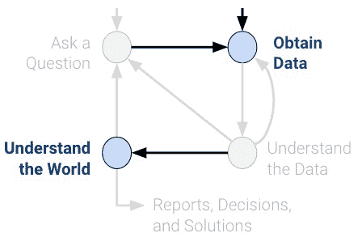
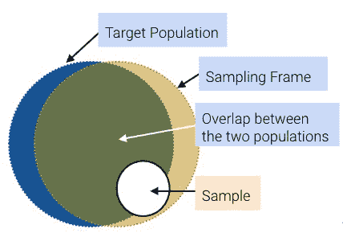
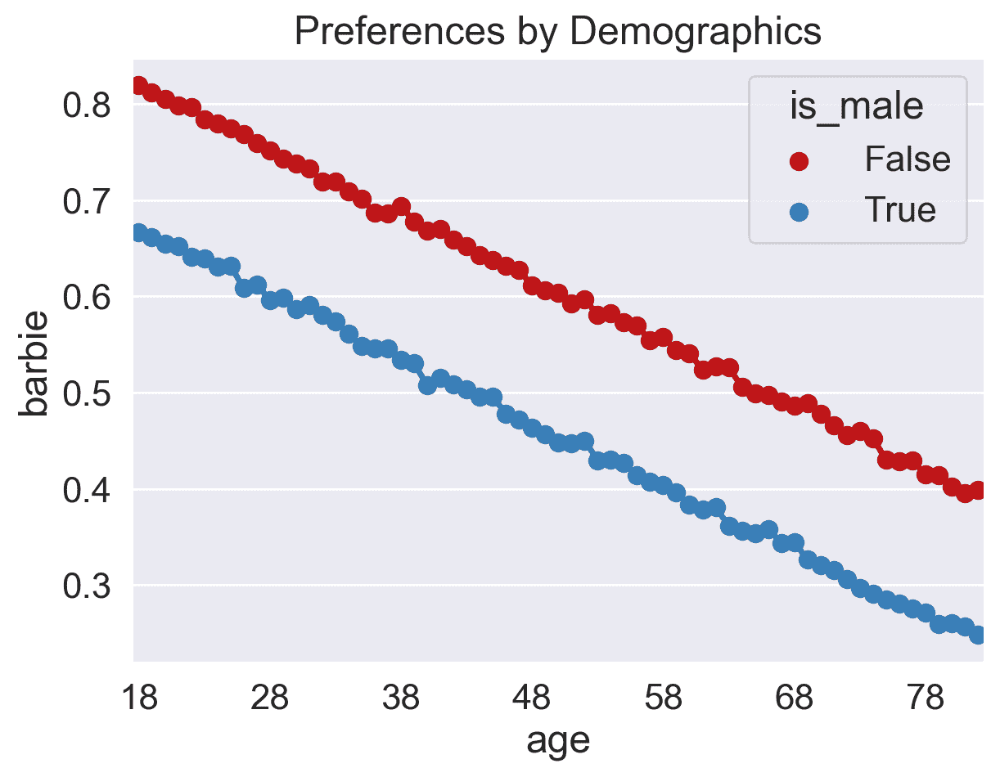
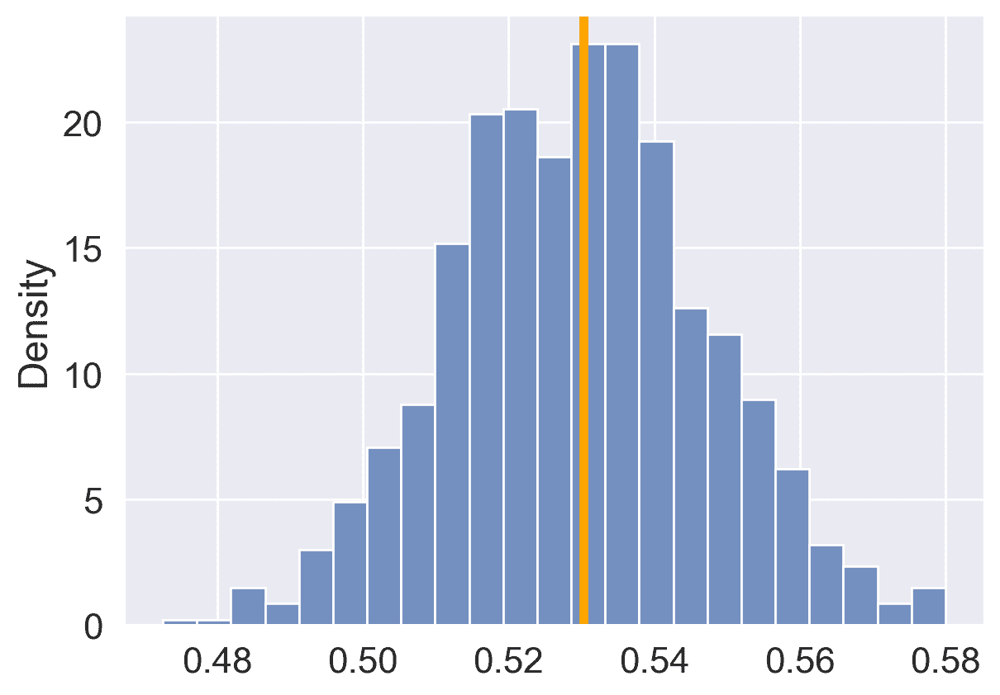
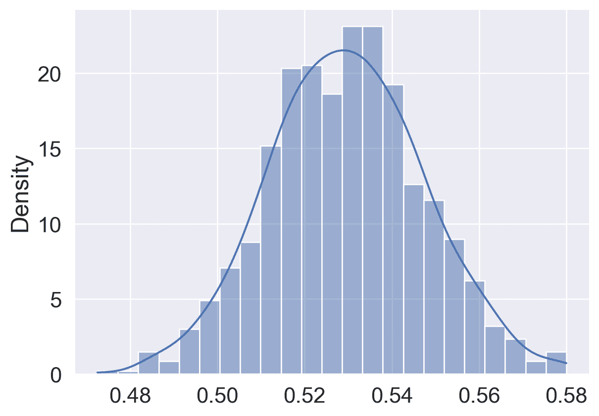

# 九、抽样

> 原文：[Sampling](https://ds100.org/course-notes/sampling/sampling.html)
> 
> 译者：[飞龙](https://github.com/wizardforcel)
> 
> 协议：[CC BY-NC-SA 4.0](https://creativecommons.org/licenses/by-nc-sa/4.0/)

*学习成果*

+   了解如何适当地收集数据以帮助回答问题。

在数据科学中，了解人口特征始于拥有质量数据进行调查。虽然通常不可能收集描述人口的所有数据，但我们可以通过适当地从人口中抽样来克服这一问题。在本文中，我们将讨论从人口中抽样的适当技术。



生命周期图

## 9.1 普查和调查

一般来说：**普查**是“对**人口**的官方计数或调查，通常记录**个体**的各种细节。”一个例子是 2020 年 4 月举行的美国十年一次人口普查。它统计了居住在所有 50 个州、哥伦比亚特区和美国领土的*每个人*，而不仅仅是公民。法律要求参与（这是由美国宪法规定的）。重要用途包括联邦资金的分配、国会代表权以及划分国会和州立法机构选区。普查由寄往美国不同住房地址的**调查**组成。

**调查**是一组问题。一个例子是工作者对个人和家庭进行抽样。提出的问题以及提问的方式可能会影响受访者的回答，甚至可能影响他们是否首先回答。

虽然普查很好，但往往很难和昂贵地对人口中的每个人进行调查。想象一下美国在 2020 年人口普查上花费的资源、金钱、时间和精力。虽然这确实给我们提供了更准确的人口信息，但通常是不可行的。因此，我们通常只对人口的一个子集进行调查。

**样本**通常是人口的子集，通常用于对人口进行推断。如果我们的样本很好地代表了我们的人口，那么我们可以使用它以较低的成本获取有用信息。也就是说，样本的抽取方式将影响这种推断的可靠性。抽样中的两个常见误差来源是**偶然误差**，随机样本可能与预期的任何方向不同，以及**偏差**，这是一个方向上的系统误差。偏差可能是许多因素的结果，例如我们的抽样方案或调查方法。

让我们定义一些有用的词汇：

+   **人口**：你想了解的群体。

    +   人口中的**个体**并不总是人。其他人口包括你肠道中的细菌（使用 DNA 测序进行抽样）、某种树木、获得小额贷款的小企业，或者学术期刊或领域中发表的结果。

+   **抽样框架**：从中抽取样本的列表。

    +   例如，如果抽样人员，则抽样框架是可能最终进入样本的所有人的集合。

+   **样本**：你最终抽样的对象。因此，样本是你的*抽样框架*的一个子集。

虽然理想情况下，这三组将完全相同，但实际上通常并非如此。例如，可能有个体在你的抽样框架（因此也在你的样本）中，而不在你的人口中。而且一般来说，样本大小要比人口大小小得多。



抽样框架

## 9.2 偏差：案例研究

以下案例研究改编自 Freedman、Pisani 和 Purves 的《统计学》，W.W. Norton NY，1978 年。

1936 年，民主党总统富兰克林·D·罗斯福竞选连任，对手是共和党的阿尔夫·兰登。和往常一样，选举前几个月进行了民意调查，试图预测结果。文学文摘是一本成功预测了 1936 年之前 5 次大选结果的杂志。在他们对 1936 年选举的调查中，他们向从电话簿、杂志订阅者名单和乡村俱乐部会员名单中找到的 1000 万人发送了调查。在大约 240 万人中，只有 43%的人报告说他们会投票给罗斯福；因此，文摘预测兰登会获胜。

在选举日，罗斯福以压倒性优势获胜，获得了约 4500 万选民中 61%的普选票。为什么文摘的民意调查会出现如此错误的情况？

事实证明，文学文摘的样本并不代表人口。他们在电话簿、杂志订阅者名单和乡村俱乐部会员名单中找到的样本更富裕，倾向于投票共和党。因此，他们的抽样框架在本质上偏向兰登。文学文摘完全忽视了仍然在大萧条中受苦的大多数选民。此外，他们的回应率很低（约 24%）；谁知道其他未回应者会如何投票？文学文摘在这场灾难后仅 18 个月就倒闭了。

与此同时，正在崛起的统计学家乔治·盖洛普也对 1936 年的选举做出了预测。尽管他的样本量“只有”5 万人（这仍然比必要的要多；我们在讨论中心极限定理时会更多），但他对 56%的选民会选择罗斯福的估计更接近实际结果（61%）。盖洛普还预测了文学文摘的预测，样本量只有 3000 人，通过预测文学文摘的富裕抽样框架并对这些个体进行子抽样，预测了文学文摘的预测，只有 1%的误差。

所以这个故事的寓意是什么？样本虽然方便，但容易受到偶然误差和偏见的影响。选举民意调查，特别是可能涉及许多偏见来源。举几个例子：

+   选择偏见系统性地排除（或偏爱）特定群体。

    +   例如：文学文摘调查排除了不在电话簿上的人。

    +   如何避免：检查抽样框架和抽样方法。

+   回应偏见是因为人们并不总是如实回答。调查设计者特别注意问题的性质和措辞，以避免这种偏见。

    +   例如：非法移民在人口普查调查中被问及公民身份问题时可能不会如实回答。

    +   如何避免：检查问题的性质和调查方法。

+   非响应偏见是因为人们并不总是回应调查请求，这可能会扭曲回应。

    +   例如：只有 1000 万人中的 240 万人回应了文学文摘的调查。

    +   如何避免：保持调查简短，坚持不懈。

今天，盖洛普民意调查是选举结果的主要民意调查之一。许多偏见来源——谁会回答民意调查？选民是否会说实话？我们如何预测投票率？——仍然存在，但盖洛普民意调查采用了几种策略来减轻这些偏见。在他们的抽样框架中，“美国大陆的成年电话家庭的非机构化人口”，他们使用随机数字拨号来包括列出/未列出的电话号码，并避免选择偏见。此外，他们使用了一个在家庭内部的选择过程，随机选择一个或多个成年人的家庭。如果没有人回答，多次重新拨号以避免非响应偏见。

## 9.3 概率样本

在取样时，关注样本的质量而不是样本的数量至关重要。庞大的样本量并不能弥补糟糕的取样方法。我们的主要目标是收集代表所在人口的样本。在本节中，我们将探讨不同类型的取样及其优缺点。

**便利样本**是你能够得到的任何样本；这种取样是*非随机*的。请注意，潦草的取样不一定是随机取样；存在许多潜在的偏差来源。

在**概率样本**中，我们提供了任何指定的**个体集**将被选入样本的**机会**（人口中的个体可以有不同的被选中机会；它们不必全部一致），我们根据这个已知的机会随机取样。因此，概率样本也被称为**随机样本**。随机性带来了一些好处：

+   因为我们知道源概率，我们可以**测量误差**。

+   随机取样使我们得到人口更具代表性的样本，从而**减少偏见**。（注意：只有在我们从中进行取样的概率分布准确时才是这样。使用“糟糕”或不准确的分布进行随机取样可能会产生对人口数量的偏见估计。）

+   概率样本使我们能够**估计**偏差和机会误差，这有助于我们**量化不确定性**（在未来的讲座中会详细介绍）。

现实世界通常更加复杂，我们经常不知道最初的概率。例如，我们通常不知道微生物组样本中某个细菌的概率，或者盖洛普打电话时人们是否会接听。尽管如此，我们仍然尽力模拟概率取样，即使取样或测量过程并不完全在我们的控制之下。

一些常见的随机取样方案：

+   **带替换的随机样本**是一个**均匀**随机**带**替换的样本。

    +   随机并不总是意味着“均匀随机”，但在这个特定的上下文中，它是这样的。

    +   人口中的一些个体可能会被多次选中。

+   **简单随机样本（SRS）**是一个**均匀**随机**不**带替换的样本。

    +   每个个体（和个体子集）被选中的机会都是相同的。

    +   每对的机会都与其他每对相同。

    +   每个三元组的机会都与其他三元组相同。

    +   等等。

+   **分层随机样本**，在这种样本中，对分层（特定群体）进行随机抽样，这些群体一起构成一个样本。

### 9.3.1 示例方案 1：概率样本

假设我们有 3 个助教（**A**lan，**B**ennett，**C**eline）：我决定按以下方式对其中 2 个进行取样：

+   我以 1.0 的概率选择 A

+   我选择 B 或 C，每个的概率为 0.5。

我们可以在表中列出所有可能的结果及其相应的概率：

| 结果 | 概率 |
| --- | --- |
| {A, B} | 0.5 |
| {A, C} | 0.5 |
| {B, C} | 0 |

这是一个**概率样本**（尽管不是很好的样本）。在我的人口中有 3 个人，我知道每个子集的机会。假设我正在测量助教离校园的平均距离。

+   这个方案没有看到整个人口！

+   我使用我取得的单个样本进行估计，这取决于我看到 AB 还是 AC 的机会误差。

+   这个方案对 A 的回应有偏见。

### 9.3.2 示例方案 2：简单随机样本

考虑以下取样方案：

+   一个班级花名册上按字母顺序列出了 1100 名学生。

+   随机选择名单上的前 10 个学生中的一个（例如学生 8）。

+   要创建你的样本，取那个学生以及其后每 10 个学生（例如学生 8、18、28、38 等）。

这是一个概率样本吗？

是的。对于一个样本[n, n + 10, n + 20, …, n + 1090]，其中 1 <= n <= 10，该样本的概率为 1/10。否则，概率为 0。

只有 10 个可能的样本！ 每个学生被选中的概率相同吗？ 是的。每个学生被选择的概率是 1/10。 这是一个简单随机样本吗？ 不是。选择(8, 18)的机会是 1/10；选择(8, 9)的机会是 0。

### 9.3.3 演示：Barbie v. Oppenheimer

我们正在尝试从伯克利居民中收集一个样本，以预测 Barbie 和 Oppenheimer 中哪一个在它们的开放日 7 月 21 日表现更好。

首先，让我们获取一个数据集，其中包含伯克利的每个居民（这是一个虚假数据集），以及他们**实际**在 7 月 21 日观看的电影。

让我们加载`movie.csv`表。我们可以假设：

+   `is_male`是一个布尔值，表示居民是否认为自己是男性。

+   他们在 7 月 21 日只能观看两部电影：Barbie 和 Oppenheimer。

+   每个居民在 7 月 21 日都会观看一部电影（要么是 Barbie，要么是 Oppenheimer）。

代码

```py
import matplotlib.pyplot as plt
import numpy as np
import pandas as pd
import seaborn as sns

sns.set_theme(style='darkgrid', font_scale = 1.5,
 rc={'figure.figsize':(7,5)})

rng = np.random.default_rng()
```

```py
movie = pd.read_csv("data/movie.csv")

# create a 1/0 int that indicates Barbie vote
movie['barbie'] = (movie['movie'] == 'Barbie').astype(int)
movie.head()
```

|  | age | is_male | movie | barbie |
| --- | --- | --- | --- | --- |
| 0 | 35 | False | Barbie | 1 |
| 1 | 42 | True | Oppenheimer | 0 |
| 2 | 55 | False | Barbie | 1 |
| 3 | 77 | True | Oppenheimer | 0 |
| 4 | 31 | False | Barbie | 1 |

伯克利居民中选择 Barbie 的比例是多少？

```py
actual_barbie = np.mean(movie["barbie"])
actual_barbie
```

```py
0.5302792307692308
```

这是比赛的**实际结果**。根据这个结果，Barbie 会获胜。我们的退休人员样本的表现如何？

#### 9.3.3.1 便利样本：退休人员

让我们方便地抽取已经退休的人（年龄>=65 岁）。其中有多少比例的人去看 Barbie 而不是 Oppenheimer？

```py
convenience_sample = movie[movie['age'] >= 65] # take a convenience sample of retirees
np.mean(convenience_sample["barbie"]) # what proportion of them saw Barbie? 
```

```py
0.3744755089093924
```

根据这个结果，我们本来会预测 Oppenheimer 会获胜！发生了什么？我们的样本可能太小或者太嘈杂了吗？

```py
# what's the size of our sample? 
len(convenience_sample)
```

```py
359396
```

```py
# what proportion of our data is in the convenience sample? 
len(convenience_sample)/len(movie)
```

```py
0.27645846153846154
```

看起来我们的样本相当大（大约 360,000 人），所以误差很可能不仅仅是由于偶然性造成的。

#### 9.3.3.2 检查偏差

让我们按年龄汇总所有选择，并可视化按性别分割的 Barbie 观看比例。

```py
votes_by_barbie = movie.groupby(["age","is_male"]).agg("mean", numeric_only=True).reset_index()
votes_by_barbie.head()
```

|  | age | is_male | barbie |
| --- | --- | --- | --- |
| 0 | 18 | False | 0.819594 |
| 1 | 18 | True | 0.667001 |
| 2 | 19 | False | 0.812214 |
| 3 | 19 | True | 0.661252 |
| 4 | 20 | False | 0.805281 |

代码

```py
# A common matplotlib/seaborn pattern: create the figure and axes object, pass ax
# to seaborn for drawing into, and later fine-tune the figure via ax.
fig, ax = plt.subplots();

red_blue = ["#bf1518", "#397eb7"]
with sns.color_palette(red_blue):
 sns.pointplot(data=votes_by_barbie, x = "age", y = "barbie", hue = "is_male", ax=ax)

new_ticks = [i.get_text() for i in ax.get_xticklabels()]
ax.set_xticks(range(0, len(new_ticks), 10), new_ticks[::10])
ax.set_title("Preferences by Demographics");
```



+   我们看到退休人员（在伯克利）倾向于观看 Oppenheimer。

+   我们还看到，认为自己不是男性的居民倾向于喜欢 Barbie。

#### 9.3.3.3 简单随机样本

假设我们取了一个与我们的退休人员样本相同大小的简单随机样本（SRS）：

```py
n = len(convenience_sample)
random_sample = movie.sample(n, replace = False) ## By default, replace = False
np.mean(random_sample["barbie"])
```

```py
0.5304483077162795
```

这与 0.5302792307692308 的实际投票结果非常接近！

事实证明，我们可以用**更小的样本量**（比如 800）得到类似的结果：

```py
n = 800
random_sample = movie.sample(n, replace = False)

# Compute the sample average and the resulting relative error
sample_barbie = np.mean(random_sample["barbie"])
err = abs(sample_barbie-actual_barbie)/actual_barbie

# We can print output with Markdown formatting too...
from IPython.display import Markdown
Markdown(f"**Actual** = {actual_barbie:.4f}, **Sample** = {sample_barbie:.4f}, "
 f"**Err** = {100*err:.2f}%.")
```

**实际** = 0.5303，**样本** = 0.5275，**误差** = 0.52%。

我们将在本学期后期（重新）学习中心极限定理时学习如何选择这个数字。

#### 9.3.3.4 量化机会误差

在我们的大小为 800 的 SRS 中，我们的机会误差会是多少？

让我们模拟从之前抽取 800 大小的 SRS 的 1000 个版本：

```py
nrep = 1000   # number of simulations
n = 800       # size of our sample
poll_result = []
for i in range(0, nrep):
 random_sample = movie.sample(n, replace = False)
 poll_result.append(np.mean(random_sample["barbie"]))
```

代码

```py
fig, ax = plt.subplots()
sns.histplot(poll_result, stat='density', ax=ax)
ax.axvline(actual_barbie, color="orange", lw=4);
```



这些模拟样本中有多少比例会预测 Barbie？

```py
poll_result = pd.Series(poll_result)
np.sum(poll_result > 0.5)/1000
```

```py
0.95
```

你可以看到曲线看起来大致呈高斯/正态分布。使用 KDE：

代码

```py
sns.histplot(poll_result, stat='density', kde=True);
```



## 9.4 总结

了解抽样过程是让我们从描述数据转向理解世界的关键。如果不知道/假设数据是如何收集的，样本和总体之间就没有联系。最终，数据集并不能告诉我们关于数据背后世界的情况。
