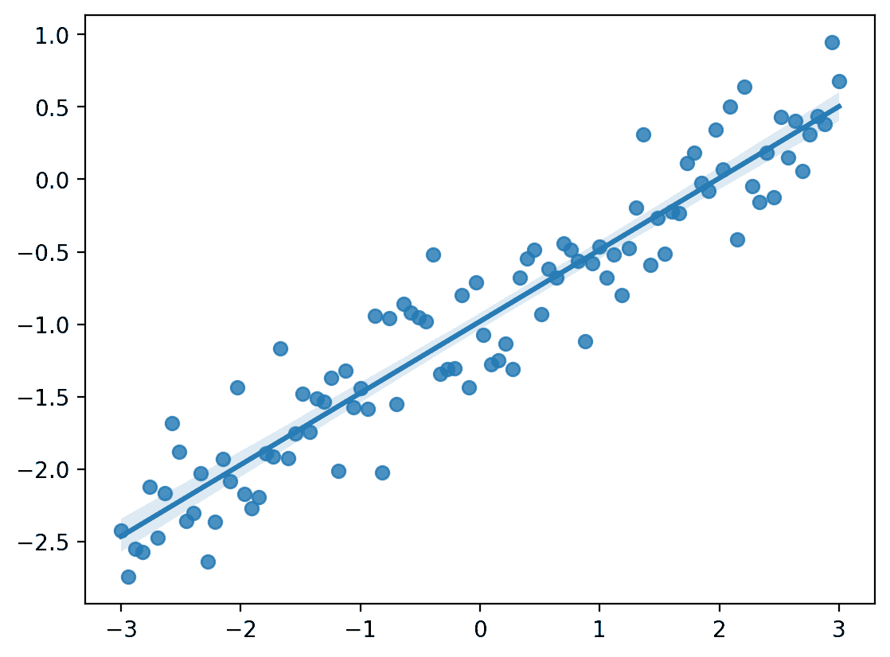
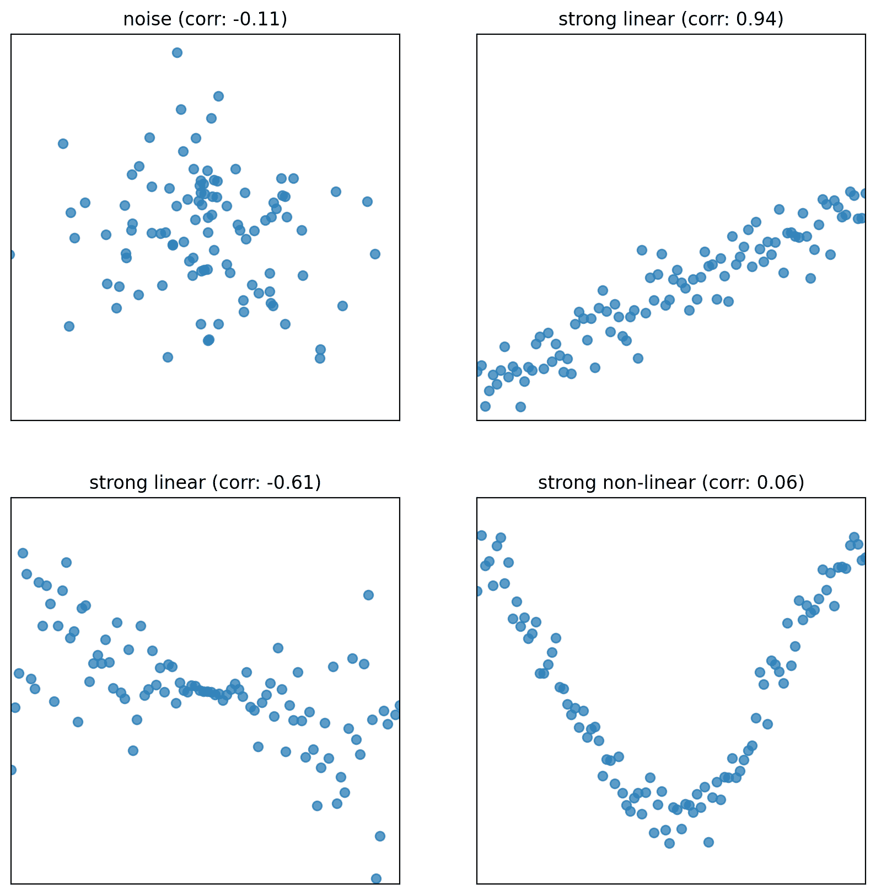
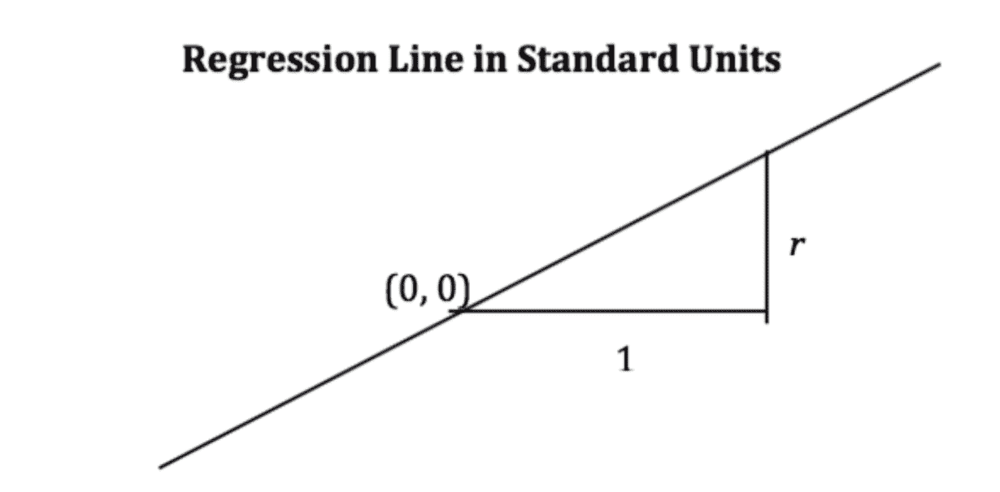
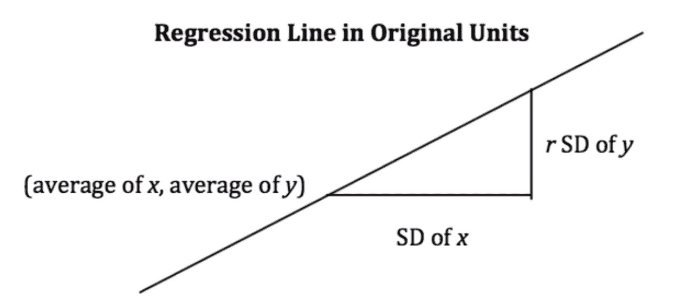

# 十、建模简介

> 原文：[Introduction to Modeling](https://ds100.org/course-notes/intro_to_modeling/intro_to_modeling.html)
> 
> 译者：[飞龙](https://github.com/wizardforcel)
> 
> 协议：[CC BY-NC-SA 4.0](https://creativecommons.org/licenses/by-nc-sa/4.0/)

*学习成果*

+   了解模型是什么，以及如何进行四步建模过程。

+   定义损失概念并熟悉$L_1$和$L_2$损失。

+   使用最小化技术拟合简单线性回归模型。**直到本学期为止，我们一直专注于分析数据集。我们已经研究了数据科学生命周期的早期阶段，重点是用于数据分析所需的编程工具、可视化技术和数据清理方法。

这节课标志着关注重点的转变。我们将不再只是检查数据集，而是实际*使用*我们的数据来更好地理解世界。具体来说，接下来的一系列讲座将探讨预测建模：生成模型以对我们周围的世界进行一些预测。在这节课上，我们将介绍建立建模任务的概念框架。在接下来的几节课中，我们将通过实现各种类型的模型来将这个框架付诸实践。

## 10.1 什么是模型？

模型是对系统的**理想化表示**。系统是一组原则或程序，根据这些原则或程序，某事物的运行方式。我们生活在一个充满系统的世界：打开灯的程序是根据一套特定的规则来进行电流流动的。任何事件发生背后的真相通常是复杂的，很多时候具体情况是未知的。世界的运作可以被视为一个巨大的程序。模型试图简化世界，并将其提炼成可操作的部分。

例如：我们将地球上物体的下落建模为受到重力加速度$9.81 m/s^2$的恒定加速度。

+   虽然这描述了我们系统的行为，但它只是一个近似。

+   它没有考虑空气阻力、地球重力的局部变化等影响。

+   在实践中，足够准确就足够有用！

### 10.1.1 建立模型的原因

为什么我们想要建立模型？就数据科学家和统计学家而言，有三个原因，每个原因都意味着对建模的不同关注点。

1.  解释我们生活中发生的复杂现象。例如：

    +   父母的平均身高与子女的平均身高有何关联？

    +   物体的速度和加速度如何影响它的行程？（物理学：$d = d_0 + vt + \frac{1}{2}at^2$）

    在这些情况下，我们关心创建*简单和可解释*的模型，使我们能够理解变量之间的关系。

1.  对未知数据进行准确预测。一些例子包括：

    +   我们能否预测一封电子邮件是否是垃圾邮件？

    +   我们能否对这篇长达 10 页的文章生成一个一句话的摘要？

    在进行预测时，我们更关心做出极其准确的预测，即使以得到一个不可解释的模型为代价。这些有时被称为黑匣子模型，在深度学习等领域很常见。

1.  衡量一个事件对另一个事件的因果效应。例如，

    +   吸烟是否*导致*肺癌？

    +   职业培训计划是否*导致*就业和工资增加？

    这是一个更难的问题，因为大多数统计工具都是设计用来推断关联而不是因果关系。我们不会在 Data 100 中专注于这个任务，但如果你感兴趣，可以参加其他关于因果推断的高级课程（例如 Stat 156，Data 102）！

大多数时候，我们的目标是在建立可解释的模型和建立准确模型之间取得平衡。

### 10.1.2 模型的常见类型

总的来说，模型可以分为两类：

1.  确定性物理（机械）模型：控制世界运行方式的法则。

    +   [开普勒的行星运动第三定律（1619）](https://en.wikipedia.org/wiki/Kepler%27s_laws_of_planetary_motion#Third_law)：物体轨道周期的平方与其轨道半长轴的立方的比值对于所有绕同一主体运行的物体都是相同的。

        +   $T^2 \propto R^3$

    +   [牛顿的三大定律：运动和引力（1687）](https://en.wikipedia.org/wiki/Newton%27s_laws_of_motion)：牛顿的第二定律模拟了物体的质量与加速所需的力之间的关系。

        +   $F = ma$

        +   $F_g = G \frac{m_1 m_2}{r^2}$

1.  概率模型：试图理解随机过程如何演变的模型。这些模型更通用，可以用来描述现实世界中的许多现象。这些模型通常对世界的性质做出简化的假设。

    +   [泊松过程模型](https://en.wikipedia.org/wiki/Poisson_point_process)：用于模拟在任何时间点以一定概率发生的随机事件，并且在计数上严格递增，例如顾客到达商店。

注意：这些具体的模型不在 Data 100 的范围内，只是作为动机存在。

## 10.2 简单线性回归

**回归线**是最小化所有直线估计的**均方误差**的唯一直线。与任何直线一样，它可以由斜率和 y-截距定义：

+   $\text{斜率} = r \cdot \frac{\text{y 的标准差}}{\text{x 的标准差}}$

+   $y\text{-截距} = \text{平均 }y - \text{斜率}\cdot\text{平均 }x$

+   $\text{回归估计} = y\text{-截距} + \text{斜率}\cdot\text{}x$

+   $\text{残差} =\text{观察到的 }y - \text{回归估计}$

代码

```py
import pandas as pd
import numpy as np
import matplotlib.pyplot as plt
import seaborn as sns
# Set random seed for consistency 
np.random.seed(43)
plt.style.use('default') 

#Generate random noise for plotting
x = np.linspace(-3, 3, 100)
y = x * 0.5 - 1 + np.random.randn(100) * 0.3

#plot regression line
sns.regplot(x=x,y=y);
```



### 10.2.1 符号和定义

对于表示我们的数据 $\mathcal{D} = \{(x_1, y_1), (x_2, y_2), \dots, (x_n, y_n)\}$ 的一对变量 $x$ 和 $y$，我们将它们的均值/平均值表示为 $\bar x$ 和 $\bar y$，标准差表示为 $\sigma_x$ 和 $\sigma_y$。

#### 10.2.1.1 标准单位

如果以下条件成立，则变量以标准单位表示：

1.  标准单位中的 0 等于原始变量单位中的均值 ($\bar{x}$)。

1.  1 个标准单位的增加等于原始变量单位中的 1 个标准差 ($\sigma_x$) 的增加。

要将变量 $x_i$ 转换为标准单位，我们从其均值中减去它，并将其除以其标准差。例如，标准单位中的 $x_i$ 是 $\frac{x_i - \bar x}{\sigma_x}$。

#### 10.2.1.2 相关性

相关性 ($r$) 是以*标准单位*测量的 $x$ 和 $y$ 的乘积的平均值。

$$r = \frac{1}{n} \sum_{i=1}^n (\frac{x_i - \bar{x}}{\sigma_x})(\frac{y_i - \bar{y}}{\sigma_y})$$

1.  相关性衡量了两个变量之间的**线性关联**的强度。

1.  相关性在-1 和 1 之间变化：$r \leq 1$, with $r=1$ 表示完美的线性关联，$r=-1$ 表示完美的负相关。 $r$ 越接近于 $0$, 线性关联越弱。

1.  相关性不能说明因果关系和非线性关联。相关性**不**意味着因果关系。当 $r = 0$ 时，两个变量是不相关的。然而，它们仍然可以通过一些非线性关系相关。

代码

```py
def plot_and_get_corr(ax, x, y, title):
 ax.set_xlim(-3, 3)
 ax.set_ylim(-3, 3)
 ax.set_xticks([])
 ax.set_yticks([])
 ax.scatter(x, y, alpha = 0.73)
 r = np.corrcoef(x, y)[0, 1]
 ax.set_title(title + " (corr: {})".format(r.round(2)))
 return r

fig, axs = plt.subplots(2, 2, figsize = (10, 10))

# Just noise
x1, y1 = np.random.randn(2, 100)
corr1 = plot_and_get_corr(axs[0, 0], x1, y1, title = "noise")

# Strong linear
x2 = np.linspace(-3, 3, 100)
y2 = x2 * 0.5 - 1 + np.random.randn(100) * 0.3
corr2 = plot_and_get_corr(axs[0, 1], x2, y2, title = "strong linear")

# Unequal spread
x3 = np.linspace(-3, 3, 100)
y3 = - x3/3 + np.random.randn(100)*(x3)/2.5
corr3 = plot_and_get_corr(axs[1, 0], x3, y3, title = "strong linear")
extent = axs[1, 0].get_window_extent().transformed(fig.dpi_scale_trans.inverted())

# Strong non-linear
x4 = np.linspace(-3, 3, 100)
y4 = 2*np.sin(x3 - 1.5) + np.random.randn(100) * 0.3
corr4 = plot_and_get_corr(axs[1, 1], x4, y4, title = "strong non-linear")

plt.show()
```



### 10.2.2 替代形式

当变量 $y$ 和 $x$ 以*标准单位*测量时，用于预测 $y$ 的回归线具有斜率 $r$ 并通过原点。

$$\hat{y}_{su} = r \cdot x_{su}$$



+   在原始单位中，这变为

$$\frac{\hat{y} - \bar{y}}{\sigma_y} = r \cdot \frac{x - \bar{x}}{\sigma_x}$$



### 10.2.3 推导

从顶部开始，我们有我们所要求的回归线的形式，并且我们希望表明它等价于最佳线性回归线：$\hat{y} = \hat{a} + \hat{b}x$。

回想一下：

+   $\hat{b} = r \cdot \frac{\text{y 的标准差}}{\text{x 的标准差}$

+   $\hat{a} = y 的平均值 - \text{斜率}\cdot x 的平均值$

证明：

$$\frac{\hat{y} - \bar{y}}{\sigma_y} = r \cdot \frac{x - \bar{x}}{\sigma_x}$$

乘以$\sigma_y$，并在两边加上$\bar{y}$。

$$\hat{y} = \sigma_y \cdot r \cdot \frac{x - \bar{x}}{\sigma_x} + \bar{y}$$

将系数$\sigma_{y}\cdot r$分配给$\frac{x - \bar{x}}{\sigma_x}$项

$$\hat{y} = (\frac{r\sigma_y}{\sigma_x} ) \cdot x + (\bar{y} - (\frac{r\sigma_y}{\sigma_x} ) \bar{x})$$

现在我们看到我们有一条符合我们要求的线：

+   斜率：$r\cdot\frac{\text{y 的标准差}}{\text{x 的标准差}} = r\cdot\frac{\sigma_y}{\sigma_x}$

+   截距：$\bar{y} - \text{斜率}\cdot \bar{x}$

请注意，第 i 个数据点的误差为：$e_i = y_i - \hat{y_i}$

## 10.3 建模过程

在高层次上，模型是表示系统的一种方式。在 Data 100 中，我们将把模型视为我们用来描述变量之间关系的一些数学规则。

我们正在对哪些变量进行建模？通常，我们使用我们收集到的样本数据中的变量子集来对该数据中的另一个变量进行建模。更正式地说，假设我们有以下数据集$\mathcal{D}$：

$$\mathcal{D} = \{(x_1, y_1), (x_2, y_2), ..., (x_n, y_n)\}$$

每一对值$(x_i, y_i)$代表一个数据点。在建模环境中，我们称这些为**观察**。$y_i$是我们试图对其进行建模的因变量，也称为**输出**或**响应**。$x_i$是输入到模型中进行预测的自变量，也称为**特征**。

我们建模的目标是使用观察到的数据$\mathcal{D}$来预测输出变量$y_i$。我们将每个预测表示为$\hat{y}_i$（读作：“y 帽下标 i”）。

我们如何生成这些预测？在接下来的几堂课中，我们将遇到一些模型的例子如下：

$$\hat{y}_i = \theta$$

$$\hat{y}_i = \theta_0 + \theta_1 x_i$$

上面的例子被称为**参数模型**。它们将收集到的数据$x_i$与我们做出的预测$\hat{y}_i$联系起来。一些参数($\theta$, $\theta_0$, $\theta_1$)用于描述$x_i$和$\hat{y}_i$之间的关系。

请注意，我们并不立即知道这些参数的值。虽然特征$x_i$是从我们观察到的数据中获取的，但我们需要决定给$\theta$、$\theta_0$和$\theta_1$什么值。这是参数建模的核心：*我们应该选择什么参数值，使我们的模型能够做出最佳的预测？*

选择我们的模型参数，我们将通过**建模过程**来进行。

1.  选择模型：我们应该如何表示世界？

1.  选择损失函数：我们如何量化预测误差？

1.  拟合模型：在给定数据的情况下，我们如何选择模型的最佳参数？

1.  评估模型性能：我们如何评估这个过程是否产生了一个好的模型？

## 10.4 选择模型

我们的第一步是选择一个模型：定义描述特征$x_i$和预测$\hat{y}_i$之间关系的数学规则。

在[Data 8](https://inferentialthinking.com/chapters/15/4/Least_Squares_Regression.html)中，您学习了**简单线性回归（SLR）模型**。您学到了该模型的形式：$$\hat{y}_i = a + bx_i$$

在 Data 100 中，我们将使用略有不同的符号：我们将用$\theta_0$替换$a$，用$\theta_1$替换$b$。这将使我们能够在课程后期探索更复杂的模型时使用相同的符号。

$$\hat{y}_i = \theta_0 + \theta_1 x_i$$

SLR 模型的参数是 $\theta_0$，也称为截距项，和 $\theta_1$，也称为斜率项。为了创建一个有效的模型，我们希望选择 $\theta_0$ 和 $\theta_1$ 的值，以最准确地预测输出变量。 “最佳”拟合模型参数被赋予特殊名称：$\hat{\theta}_0$ 和 $\hat{\theta}_1$；它们是允许我们的模型生成最佳可能预测的特定参数值。

在 Data 8 中，您学到了最佳 SLR 模型参数是：$$\hat{\theta}_0 = \bar{y} - \hat{\theta}_1\bar{x} \qquad \qquad \hat{\theta}_1 = r \frac{\sigma_y}{\sigma_x}$$

关于符号的快速提醒：

+   $\bar{y}$ 和 $\bar{x}$ 分别表示 $y$ 和 $x$ 的均值

+   $\sigma_y$ 和 $\sigma_x$ 表示 $y$ 和 $x$ 的标准偏差

+   $r$ 是[相关系数](https://inferentialthinking.com/chapters/15/1/Correlation.html#the-correlation-coefficient)，定义为 $x$ 和 $y$ 的乘积的平均值，以标准单位测量：$\frac{1}{n} \sum_{i=1}^n (\frac{x_i-\bar{x}}{\sigma_x})(\frac{y_i-\bar{y}}{\sigma_y})$

在 Data 100 中，我们想要了解如何推导出这些最佳模型系数。为此，我们将介绍损失函数的概念。

## 10.5 选择损失函数

我们已经讨论了创建“最佳”预测的想法。这引出了一个问题：我们如何决定我们模型的预测是“好”还是“坏”？

**损失函数** 描述了特定模型或模型参数选择所产生的成本、误差或拟合。这个函数，$L(y, \hat{y})$，量化了我们模型的单个预测与我们收集的数据中真实观测值之间的“坏”或“偏离”程度。

特定模型的损失函数的选择将影响估计的准确性和计算成本，并且还将取决于手头的估计任务。例如，

+   输出是定量的还是定性的？

+   异常值重要吗？

+   所有错误一样昂贵吗？（例如，癌症测试的假阴性可能比假阳性更危险）

无论使用的具体函数是什么，损失函数应遵循两个基本原则：

+   如果预测 $\hat{y}_i$ *接近* 实际值 $y_i$，损失应该很低。

+   如果预测 $\hat{y}_i$ 与实际值 $y_i$ *相距很远*，损失应该很高。

损失函数的两种常见选择是平方损失和绝对损失。

**平方损失**，也称为**L2 损失**，计算观测到的 $y_i$ 和预测的 $\hat{y}_i$ 之间的差的平方：$$L(y_i, \hat{y}_i) = (y_i - \hat{y}_i)^2$$

**绝对损失**，也称为**L1 损失**，计算观测到的 $y_i$ 和预测的 $\hat{y}_i$ 之间的绝对差：$$L(y_i, \hat{y}_i) = |y_i - \hat{y}_i|$$

L1 和 L2 损失为我们提供了一种工具，用于量化我们模型在单个数据点上的表现。这是一个很好的开始，但是理想情况下，我们希望了解我们的模型在*整个*数据集上的表现。一个自然的方法是计算数据集中所有数据点的平均损失。这被称为**成本函数**，$\hat{R}(\theta)$：$$\hat{R}(\theta) = \frac{1}{n} \sum^n_{i=1} L(y_i, \hat{y}_i)$$

在统计文献中，成本函数有许多名称。您可能还会遇到以下术语：

+   经验风险（这就是我们给成本函数命名为 $R$ 的原因）

+   错误函数

+   平均损失

我们可以将我们的 L1 和 L2 损失代入成本函数的定义中。**均方误差（MSE）** 是数据集中平均平方损失：$$\text{MSE} = \frac{1}{n} \sum_{i=1}^n (y_i - \hat{y}_i)^2$$

**平均绝对误差（MAE）** 是数据集中平均绝对损失：$$\text{MAE}= \frac{1}{n} \sum_{i=1}^n |y_i - \hat{y}_i|$$

## 10.6 拟合模型

现在我们已经建立了损失函数的概念，我们可以回到选择模型参数的原始目标。具体来说，我们希望选择最佳的模型参数集，以最小化模型在数据集上的成本。这个过程称为拟合模型。

我们知道从微积分中，当一个函数的一阶导数等于零，二阶导数为正时，函数达到最小值。我们经常称被最小化的函数为**目标函数**（我们的目标是找到它的最小值）。

为了找到最佳的模型参数，我们：

1.  对成本函数分别对该参数求导

1.  将导数设为 0

1.  解出参数

我们对模型中每个参数重复这个过程。现在，我们将忽略二阶导数条件。

为了帮助我们理解这个过程，让我们通过使用均方误差作为成本函数，推导简单线性回归的最优模型参数。记住：尽管符号可能看起来复杂，但我们所做的只是按照上面的三个步骤进行操作！

步骤 1：对成本函数分别对每个模型参数求导。我们将 SLR 模型$\hat{y}_i = \theta_0+\theta_1 x_i$代入上述 MSE 的定义中，并对$\theta_0$和$\theta_1$进行微分。

$$\frac{\partial}{\partial \theta_0} \text{MSE} = \frac{-2}{n} \sum_{i=1}^{n} y_i - \theta_0 - \theta_1 x_i$$

$$\frac{\partial}{\partial \theta_1} \text{MSE} = \frac{-2}{n} \sum_{i=1}^{n} (y_i - \theta_0 - \theta_1 x_i)x_i$$

让我们更深入地走一遍这些推导，从对$\theta_0$的 MSE 的导数开始。

根据上面的 MSE，我们知道：$$\frac{\partial}{\partial \theta_0} \text{MSE} = \frac{\partial}{\partial \theta_0} \frac{1}{n} \sum_{i=1}^{n} {(y_i - \theta_0 - \theta_1 x_i)}^{2}$$

注意，求和的导数等于导数的和，这样就变成了：$$ = \frac{1}{n} \sum_{i=1}^{n} \frac{\partial}{\partial \theta_0} {(y_i - \theta_0 - \theta_1 x_i)}^{2}$$

然后，我们可以应用链式法则。

$$ = \frac{1}{n} \sum_{i=1}^{n} 2 \cdot{(y_i - \theta_0 - \theta_1 x_i)}\dot(-1)$$

最后，我们可以简化常数，得到我们的答案。

$$\frac{\partial}{\partial \theta_0} \text{MSE} = \frac{-2}{n} \sum_{i=1}^{n}{(y_i - \theta_0 - \theta_1 x_i)}$$

按照同样的步骤，我们可以对$\theta_1$的 MSE 进行求导。

$$\frac{\partial}{\partial \theta_1} \text{MSE} = \frac{\partial}{\partial \theta_1} \frac{1}{n} \sum_{i=1}^{n} {(y_i - \theta_0 - \theta_1 x_i)}^{2}$$

$$ = \frac{1}{n} \sum_{i=1}^{n} \frac{\partial}{\partial \theta_1} {(y_i - \theta_0 - \theta_1 x_i)}^{2}$$

$$ = \frac{1}{n} \sum_{i=1}^{n} 2 \dot{(y_i - \theta_0 - \theta_1 x_i)}\dot(-x_i)$$

$$= \frac{-2}{n} \sum_{i=1}^{n} {(y_i - \theta_0 - \theta_1 x_i)}x_i$$

步骤 2：将导数设为 0。简化项后，这产生了两个**估计方程**。模型参数的最佳集合$(\hat{\theta}_0, \hat{\theta}_1)$ *必须*满足这两个最优性条件。$$0 = \frac{-2}{n} \sum_{i=1}^{n} y_i - \hat{\theta}_0 - \hat{\theta}_1 x_i \Longleftrightarrow \frac{1}{n}\sum_{i=1}^{n} y_i - \hat{y}_i = 0$$

$$0 = \frac{-2}{n} \sum_{i=1}^{n} (y_i - \hat{\theta}_0 - \hat{\theta}_1 x_i)x_i \Longleftrightarrow \frac{1}{n}\sum_{i=1}^{n} (y_i - \hat{y}_i)x_i = 0$$

步骤 3：解估计方程以计算$\hat{\theta}_0$和$\hat{\theta}_1$的估计值。

取第一个方程式给出了$\hat{\theta}_0$的估计值：$$\frac{1}{n} \sum_{i=1}^n y_i - \hat{\theta}_0 - \hat{\theta}_1 x_i = 0$$

$$\left(\frac{1}{n} \sum_{i=1}^n y_i \right) - \hat{\theta}_0 - \hat{\theta}_1\left(\frac{1}{n} \sum_{i=1}^n x_i \right) = 0$$

$$ \hat{\theta}_0 = \bar{y} - \hat{\theta}_1 \bar{x}$$

通过稍微调整，第二个方程给出了 $\hat{\theta}_1$ 的估计值。首先将第一个估计方程乘以 $\bar{x}$，然后从第二个估计方程中减去结果。

$$ \frac{1}{n} \sum_{i=1}^n (y_i - \hat{y}_i)x_i - \frac{1}{n} \sum_{i=1}^n (y_i - \hat{y}_i)\bar{x} = 0 $$

$$ \frac{1}{n} \sum_{i=1}^n (y_i - \hat{y}_i)(x_i - \bar{x}) = 0 $$

接下来，代入 $\hat{y}_i = \hat{\theta}_0 + \hat{\theta}_1 x_i = \bar{y} + \hat{\theta}_1(x_i - \bar{x})$：

$$ \frac{1}{n} \sum_{i=1}^n (y_i - \bar{y} - \hat{\theta}_1(x - \bar{x}))(x_i - \bar{x}) = 0 $$

$$ \frac{1}{n} \sum_{i=1}^n (y_i - \bar{y})(x_i - \bar{x}) = \hat{\theta}_1 \times \frac{1}{n} \sum_{i=1}^n (x_i - \bar{x})^2 $$

通过使用相关性的定义 $\left(r = \frac{1}{n} \sum_{i=1}^n (\frac{x_i-\bar{x}}{\sigma_x})(\frac{y_i-\bar{y}}{\sigma_y}) \right)$ 和标准差 $\left(\sigma_x = \sqrt{\frac{1}{n} \sum_{i=1}^n (x_i - \bar{x})^2} \right)$，我们可以得出结论：$$r \sigma_x \sigma_y = \hat{\theta}_1 \times \sigma_x^2$$

$$\hat{\theta}_1 = r \frac{\sigma_y}{\sigma_x}$$

就像在 Data 8 中给出的那样！

记住，这个推导是在使用 MSE 成本函数时找到了 SLR 的最佳模型参数。如果我们使用了不同的模型或不同的损失函数，我们很可能会找到最佳模型参数的不同值。然而，无论使用什么模型和损失，我们总是可以遵循这三个步骤来拟合模型。
