# 十一、恒定模型、损失和转换

> 原文：[Constant Model, Loss, and Transformations](https://ds100.org/course-notes/constant_model_loss_transformations/loss_transformations.html)
> 
> 译者：[飞龙](https://github.com/wizardforcel)
> 
> 协议：[CC BY-NC-SA 4.0](https://creativecommons.org/licenses/by-nc-sa/4.0/)

*学习成果*

+   推导出在 MSE 和 MAE 成本函数下恒定模型的最佳模型参数。

+   评估 MSE 和 MAE 风险之间的差异。

+   理解变量线性化的必要性，并应用图基-莫斯特勒凸图进行转换。

上次，我们介绍了建模过程。我们建立了一个框架，根据一套工作流程，预测目标变量作为我们特征的函数：

1.  选择模型 - 我们应该如何表示世界？

1.  选择损失函数 - 我们如何量化预测误差？

1.  拟合模型 - 我们如何根据我们的数据选择最佳模型参数？

1.  评估模型性能 - 我们如何评估这个过程是否产生了一个好模型？

为了说明这个过程，我们推导了简单线性回归（SLR）下均方误差（MSE）作为成本函数的最佳模型参数。SLR 建模过程的摘要如下所示：

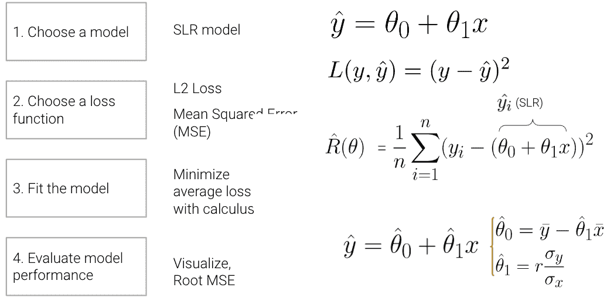

在本讲座中，我们将深入探讨步骤 4 - 评估模型性能 - 以 SLR 为例。此外，我们还将通过新模型探索建模过程，继续通过在新模型下找到最佳模型参数来熟悉建模过程，并测试两种不同的损失函数，以了解我们选择的损失如何影响模型设计。稍后，我们将考虑当线性模型不是捕捉数据趋势的最佳选择时会发生什么，以及有哪些解决方案可以创建更好的模型。

## 11.1 步骤 4：评估 SLR 模型

现在我们已经探讨了（1）选择模型、（2）选择损失函数和（3）拟合模型背后的数学原理，我们还剩下一个最后的问题 - 这个“最佳”拟合模型的预测有多“好”？为了确定这一点，我们可以：

1.  可视化数据并计算统计数据：

    +   绘制原始数据。

    +   计算每一列的均值和标准差。如果我们的预测的均值和标准差接近于原始观察到的$y_i$，我们可能会倾向于说我们的模型做得不错。

    +   （如果我们拟合线性模型）计算相关性$r$。特征和响应变量之间的相关系数的大幅度也可能表明我们的模型做得不错。

1.  性能指标：

    +   我们可以采用**均方根误差（RMSE）**。

        +   这是均方误差（MSE）的平方根，它是我们一直在最小化以确定最佳模型参数的平均损失。

        +   RMSE 与$y$的单位相同。

        +   较低的 RMSE 表示更“准确”的预测，因为我们在数据中有更低的“平均损失”。

    $$\text{RMSE} = \sqrt{\frac{1}{n} \sum_{i=1}^n (y_i - \hat{y}_i)^2}$$

1.  可视化：

    +   查看$e_i = y_i - \hat{y_i}$的残差图，以可视化实际值和预测值之间的差异。良好的残差图不应显示输入/特征$x_i$和残差值$e_i$之间的任何模式。

为了说明这个过程，让我们看看**安斯库姆的四重奏**。

### 11.1.1 四个神秘的数据集（安斯库姆的四重奏）

让我们看看四个不同的数据集。

代码

```py
import numpy as np
import pandas as pd
import matplotlib.pyplot as plt
%matplotlib inline
import seaborn as sns
import itertools
from mpl_toolkits.mplot3d import Axes3D
``` 

```py
# Big font helper
def adjust_fontsize(size=None):
 SMALL_SIZE = 8
 MEDIUM_SIZE = 10
 BIGGER_SIZE = 12
 if size != None:
 SMALL_SIZE = MEDIUM_SIZE = BIGGER_SIZE = size

 plt.rc('font', size=SMALL_SIZE)          # controls default text sizes
 plt.rc('axes', titlesize=SMALL_SIZE)     # fontsize of the axes title
 plt.rc('axes', labelsize=MEDIUM_SIZE)    # fontsize of the x and y labels
 plt.rc('xtick', labelsize=SMALL_SIZE)    # fontsize of the tick labels
 plt.rc('ytick', labelsize=SMALL_SIZE)    # fontsize of the tick labels
 plt.rc('legend', fontsize=SMALL_SIZE)    # legend fontsize
 plt.rc('figure', titlesize=BIGGER_SIZE)  # fontsize of the figure title

# Helper functions
def standard_units(x):
 return (x - np.mean(x)) / np.std(x)

def correlation(x, y):
 return np.mean(standard_units(x) * standard_units(y))

def slope(x, y):
 return correlation(x, y) * np.std(y) / np.std(x)

def intercept(x, y):
 return np.mean(y) - slope(x, y)*np.mean(x)

def fit_least_squares(x, y):
 theta_0 = intercept(x, y)
 theta_1 = slope(x, y)
 return theta_0, theta_1

def predict(x, theta_0, theta_1):
 return theta_0 + theta_1*x

def compute_mse(y, yhat):
 return np.mean((y - yhat)**2)

plt.style.use('default') # Revert style to default mpl
``` 

```py
plt.style.use('default') # Revert style to default mpl
NO_VIZ, RESID, RESID_SCATTER = range(3)
def least_squares_evaluation(x, y, visualize=NO_VIZ):
 # statistics
 print(f"x_mean : {np.mean(x):.2f}, y_mean : {np.mean(y):.2f}")
 print(f"x_stdev: {np.std(x):.2f}, y_stdev: {np.std(y):.2f}")
 print(f"r = Correlation(x, y): {correlation(x, y):.3f}")

 # Performance metrics
 ahat, bhat = fit_least_squares(x, y)
 yhat = predict(x, ahat, bhat)
 print(f"\theta_0: {ahat:.2f}, \theta_1: {bhat:.2f}")
 print(f"RMSE: {np.sqrt(compute_mse(y, yhat)):.3f}")

 # visualization
 fig, ax_resid = None, None
 if visualize == RESID_SCATTER:
 fig, axs = plt.subplots(1,2,figsize=(8, 3))
 axs[0].scatter(x, y)
 axs[0].plot(x, yhat)
 axs[0].set_title("LS fit")
 ax_resid = axs[1]
 elif visualize == RESID:
 fig = plt.figure(figsize=(4, 3))
 ax_resid = plt.gca()

 if ax_resid is not None:
 ax_resid.scatter(x, y - yhat, color = 'red')
 ax_resid.plot([4, 14], [0, 0], color = 'black')
 ax_resid.set_title("Residuals")

 return fig
``` 

```py
# Load in four different datasets: I, II, III, IV
x = [10, 8, 13, 9, 11, 14, 6, 4, 12, 7, 5]
y1 = [8.04, 6.95, 7.58, 8.81, 8.33, 9.96, 7.24, 4.26, 10.84, 4.82, 5.68]
y2 = [9.14, 8.14, 8.74, 8.77, 9.26, 8.10, 6.13, 3.10, 9.13, 7.26, 4.74]
y3 = [7.46, 6.77, 12.74, 7.11, 7.81, 8.84, 6.08, 5.39, 8.15, 6.42, 5.73]
x4 = [8, 8, 8, 8, 8, 8, 8, 19, 8, 8, 8]
y4 = [6.58, 5.76, 7.71, 8.84, 8.47, 7.04, 5.25, 12.50, 5.56, 7.91, 6.89]

anscombe = {
 'I': pd.DataFrame(list(zip(x, y1)), columns =['x', 'y']),
 'II': pd.DataFrame(list(zip(x, y2)), columns =['x', 'y']),
 'III': pd.DataFrame(list(zip(x, y3)), columns =['x', 'y']),
 'IV': pd.DataFrame(list(zip(x4, y4)), columns =['x', 'y'])
}

# Plot the scatter plot and line of best fit 
fig, axs = plt.subplots(2, 2, figsize = (10, 10))

for i, dataset in enumerate(['I', 'II', 'III', 'IV']):
 ans = anscombe[dataset]
 x, y  = ans['x'], ans['y']
 ahat, bhat = fit_least_squares(x, y)
 yhat = predict(x, ahat, bhat)
 axs[i//2, i%2].scatter(x, y, alpha=0.6, color='red') # plot the x, y points
 axs[i//2, i%2].plot(x, yhat) # plot the line of best fit 
 axs[i//2, i%2].set_xlabel(f'$x_{i+1}/details>)
 axs[i//2, i%2].set_ylabel(f'$y_{i+1}/details>)
 axs[i//2, i%2].set_title(f"Dataset {dataset}")

plt.show()
```

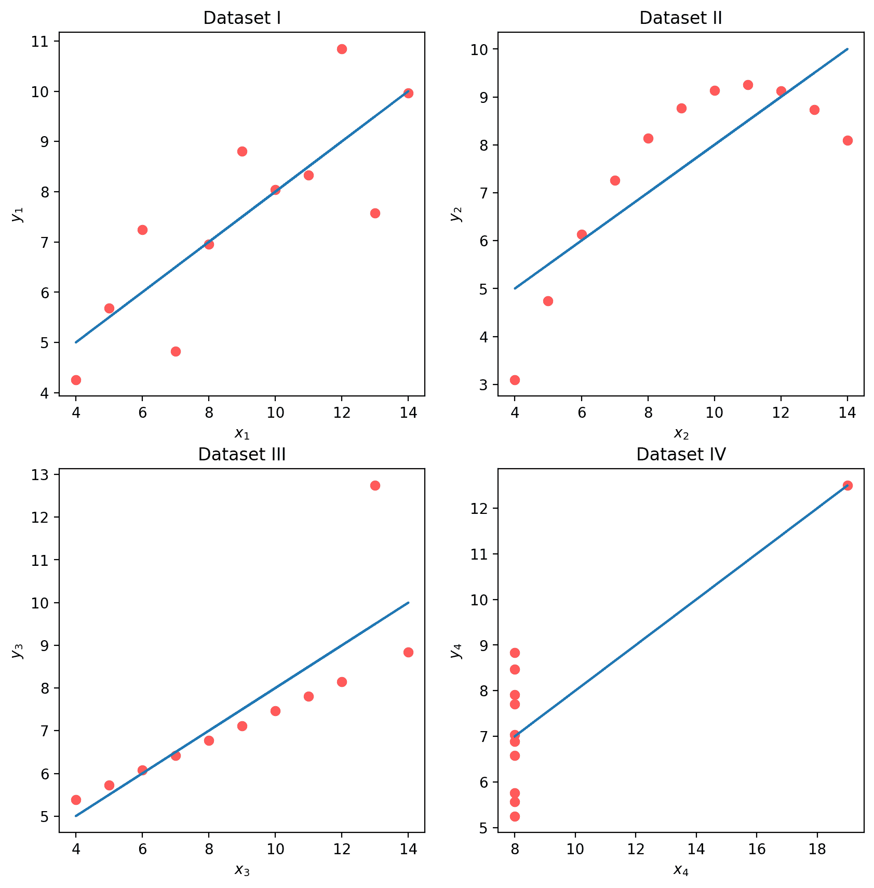

虽然这四组数据点看起来非常不同，但它们实际上都具有相同的$\bar x$、$\bar y$、$\sigma_x$、$\sigma_y$、相关性$r$和 RMSE！如果我们只看这些统计数据，我们可能会倾向于说这些数据集是相似的。

代码

```py
for dataset in ['I', 'II', 'III', 'IV']:
 print(f">>> Dataset {dataset}:")
 ans = anscombe[dataset]
 fig = least_squares_evaluation(ans['x'], ans['y'], visualize = NO_VIZ)
 print()
 print()
```

```py
>>> Dataset I:
x_mean : 9.00, y_mean : 7.50
x_stdev: 3.16, y_stdev: 1.94
r = Correlation(x, y): 0.816
    heta_0: 3.00,   heta_1: 0.50
RMSE: 1.119

>>> Dataset II:
x_mean : 9.00, y_mean : 7.50
x_stdev: 3.16, y_stdev: 1.94
r = Correlation(x, y): 0.816
    heta_0: 3.00,   heta_1: 0.50
RMSE: 1.119

>>> Dataset III:
x_mean : 9.00, y_mean : 7.50
x_stdev: 3.16, y_stdev: 1.94
r = Correlation(x, y): 0.816
    heta_0: 3.00,   heta_1: 0.50
RMSE: 1.118

>>> Dataset IV:
x_mean : 9.00, y_mean : 7.50
x_stdev: 3.16, y_stdev: 1.94
r = Correlation(x, y): 0.817
    heta_0: 3.00,   heta_1: 0.50
RMSE: 1.118 
```

我们可能还希望可视化模型的**残差**，定义为观察值和预测的$y_i$值之间的差异（$e_i = y_i - \hat{y}_i$）。这提供了每个预测与真实观察值的“偏差”的高层视图。回想一下，你在[Data 8](https://inferentialthinking.com/chapters/15/5/Visual_Diagnostics.html?highlight=heteroscedasticity#detecting-heteroscedasticity)中探讨过这个概念：一个好的回归拟合在其残差图中不应显示出明显的模式。Anscombe 的四重奏的残差图如下所示。请注意，只有第一个图显示出残差大小没有明显模式。这表明 SLR 不是剩下的三组点的最佳模型的指示。

代码

```py
# Residual visualization
fig, axs = plt.subplots(2, 2, figsize = (10, 10))

for i, dataset in enumerate(['I', 'II', 'III', 'IV']):
 ans = anscombe[dataset]
 x, y  = ans['x'], ans['y']
 ahat, bhat = fit_least_squares(x, y)
 yhat = predict(x, ahat, bhat)
 axs[i//2, i%2].scatter(x, y - yhat, alpha=0.6, color='red') # plot the x, y points
 axs[i//2, i%2].plot(x, np.zeros_like(x), color='black') # plot the residual line
 axs[i//2, i%2].set_xlabel(f'$x_{i+1}/details>)
 axs[i//2, i%2].set_ylabel(f'$e_{i+1}/details>)
 axs[i//2, i%2].set_title(f"Dataset {dataset} Residuals")

plt.show()
```

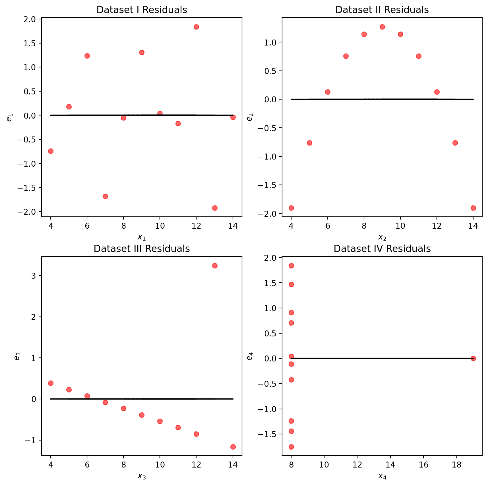

### 11.1.2 预测 vs. 估计

术语预测和估计通常在某种程度上可以互换使用，但它们之间有微妙的区别。**估计**是使用数据计算模型参数的任务。**预测**是使用模型预测未见数据的输出的任务。在我们的简单线性回归模型中

$$\hat{y} = \hat{\theta_0} + \hat{\theta_1}$$

我们通过最小化平均损失来**估计**参数；然后，我们使用这些估计来**预测**。**最小二乘估计**是选择最小化 MSE 的参数。

## 11.2 常数模型 + MSE

现在，我们将从 SLR 模型转换为**常数模型**，也称为汇总统计。常数模型与我们之前探索过的简单线性回归模型略有不同。常数模型不是从输入的特征变量生成预测，而是始终*预测相同的常数数字*。这忽略了变量之间的任何关系。例如，假设我们想要预测一家波霸店一天卖出的饮料数量。波霸茶的销售可能取决于一年中的时间、天气、顾客的感觉、学校是否在上课等等，但常数模型忽略了这些因素，而更倾向于一个更简单的模型。换句话说，常数模型采用了一个**简化的假设**。

它也是一个参数化的统计模型：

$$\hat{y}_i = \theta_0$$

$\theta_0$是常数模型的参数，就像$\theta_0$和$\theta_1$是 SLR 中的参数一样。由于我们的参数$\theta_0$是一维的（$\theta_0 \in \mathbb{R}$），我们现在的模型没有输入，将始终预测$\hat{y}_i = \theta_0$。

### 11.2.1 推导最优的$\theta_0$

我们现在的任务是确定什么值的$\theta_0$最能代表最佳模型 - 换句话说，每次猜测什么数字可以在我们的数据上获得最低可能的**平均损失**？

像以前一样，我们将使用均方误差（MSE）。回想一下，MSE 是数据$D = \{y_1, y_2, ..., y_n\}$上的平均平方损失（L2 损失）。

$$R(\theta) = \frac{1}{n}\sum^{n}_{i=1} (y_i - \hat{y_i})^2 $$

我们的建模过程现在看起来像这样：

1.  选择模型：常数模型

1.  选择损失函数：L2 损失

1.  拟合模型

1.  评估模型性能

给定**常数模型**$\hat{y}_i = \theta_0$，我们可以将 MSE 方程重写为

$$R(\theta) = \frac{1}{n}\sum^{n}_{i=1} (y_i - \theta_0)^2 $$

我们可以通过找到最优的$\theta_0$来拟合**模型**，从而最小化 MSE，使用微积分方法。

1.  对$\theta_0$求导

$$ \begin{align} \frac{d}{d\theta_0}\text{R}(\theta) & = \frac{d}{d\theta_0}\frac{1}{n}\sum^{n}_{i=1} (y_i - \theta_0)^2 \\ &= {n}\sum^{n}_{i=1} \frac{d}{d\theta_0} (y_i - \theta_0)^2 \quad \quad \text{求和的导数是导数的和} \\ &= {n}\sum^{n}_{i=1} 2 (y_i - \theta_0) (-1) \quad \quad \text{链式法则} \\ &= {\frac{-2}{n}}\sum^{n}_{i=1} (y_i - \theta_0) \quad \quad \text{简单的常数} \end{align} $$

1.  等于 0 $$ 0 = {\frac{-2}{n}}\sum^{n}_{i=1} (y_i - \theta_0) $$

1.  解出 $\theta_0$

$$ \begin{align} 0 &= {\frac{-2}{n}}\sum^{n}_{i=1} (y_i - \theta_0) \\ &= \sum^{n}_{i=1} (y_i - \theta_0) \quad \quad \text{两边同时除以} \frac{-2}{n} \\ &= \sum^{n}_{i=1} y_i - \sum^{n}_{i=1} \theta_0 \quad \quad \text{分开求和} \\ &= \sum^{n}_{i=1} y_i - n * \theta_0 \quad \quad \text{c + c + … + c = nc} \\ n * \theta_0 &= \sum^{n}_{i=1} y_i \\ \theta_0 &= \frac{1}{n} \sum^{n}_{i=1} y_i \\ \theta_0 &= \bar{y} \end{align} $$

让我们花点时间解释一下这个结果。 $\hat{\theta} = \bar{y}$ 是常数模型 + MSE 的最佳参数。无论你有什么样的数据样本，它都是成立的，并且它提供了一些正式的推理，解释了为什么均值是如此常见的摘要统计量。

我们的最佳模型参数是使成本函数最小化的参数值。成本函数的最小值可以表示为：

$$R(\hat{\theta}) = \min_{\theta} R(\theta)$$

用简单的英语重新陈述上面的内容：当成本函数以最佳参数作为输入时，我们正在查看成本函数的值。这个最佳模型参数 $\hat{\theta}$ 是使成本 $R$ 最小化的 $\theta$ 的值。

对于建模目的，我们更关心成本的最小值 $R(\hat{\theta})$，而不是导致这种最低平均损失的 * $\theta$ 的值。换句话说，我们关心找到最佳参数值，使得：

$$\hat{\theta} = \underset{\theta}{\operatorname{\arg\min}}\:R(\theta)$$

也就是说，我们想要找到使成本函数最小化的参数 $\theta$。

### 11.2.2 比较两个不同的模型，都使用 MSE 进行拟合

现在我们已经探讨了带有 L2 损失的常数模型，我们可以将其与上一讲学到的 SLR 模型进行比较。考虑下面的数据集，其中包含嘴海牛的年龄和长度信息。假设我们想要预测嘴海牛的年龄：

|  | 常数模型 | 简单线性回归 |
| --- | --- | --- |
| 模型 | $\hat{y} = \theta_0$ | $\hat{y} = \theta_0 + \theta1 x$ |
| 数据 | 年龄样本 $D = \{y_1, y_2, ..., y_m\}$ | 年龄样本 $D = \{(x_1, y_1), (x_2, y_2), ..., (x_n, y_n)\}$ |
| 维度 | $\hat{\theta_0}$ 是 1-D | $\hat{\theta} = [\hat{\theta_0}, \hat{\theta_1}]$ 是 2-D |
| 损失曲面 | 2-D 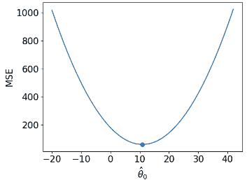 | 3-D 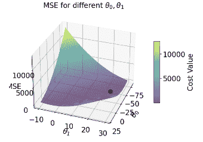 |
| 损失模型 | $\hat{R}(\theta) = \frac{1}{n}\sum^{n}_{i=1} (y_i - \theta_0)^2$ | $\hat{R}(\theta) = \frac{1}{n}\sum^{n}_{i=1} (y_i - (\theta_0 + \theta_1 x))^2$ |
| RMSE | 7.72 | 4.31 |
| 可视化预测 | 地毯图 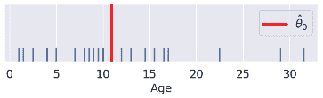 | 散点图 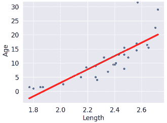 |

（注意我们的 SLR 散点图的点在视觉上并不是一个很好的线性拟合。我们会回到这个问题）。

生成图形和模型的代码如下，但我们不会深入讨论。

代码

```py
dugongs = pd.read_csv("data/dugongs.csv")
data_constant = dugongs["Age"]
data_linear = dugongs[["Length", "Age"]]
``` 

```py
# Constant Model + MSE
plt.style.use('default') # Revert style to default mpl
adjust_fontsize(size=16)
%matplotlib inline

def mse_constant(theta, data):
 return np.mean(np.array([(y_obs - theta) ** 2 for y_obs in data]), axis=0)

thetas = np.linspace(-20, 42, 1000)
l2_loss_thetas = mse_constant(thetas, data_constant)

# Plotting the loss surface
plt.plot(thetas, l2_loss_thetas)
plt.xlabel(r'$\theta_0/details>)
plt.ylabel(r'MSE')

# Optimal point
thetahat = np.mean(data_constant)
plt.scatter([thetahat], [mse_constant(thetahat, data_constant)], s=50, label = r"$\hat{\theta}_0$")
plt.legend();
# plt.show()
```

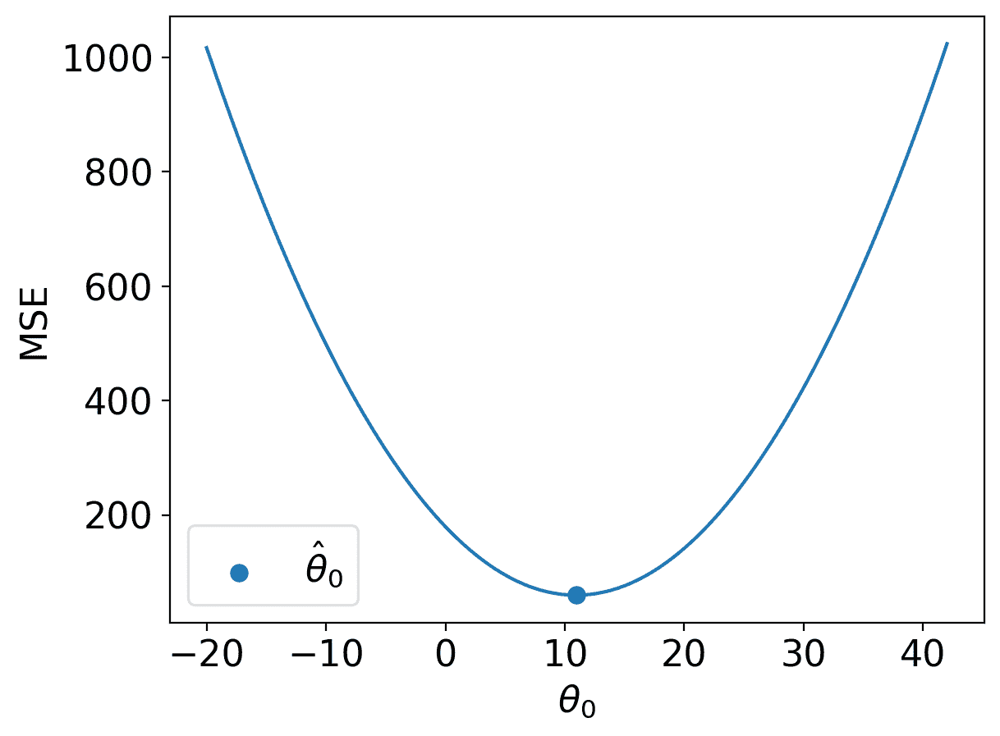

代码

```py
# SLR + MSE
def mse_linear(theta_0, theta_1, data_linear):
 data_x, data_y = data_linear.iloc[:,0], data_linear.iloc[:,1]
 return np.mean(np.array([(y - (theta_0+theta_1*x)) ** 2 for x, y in zip(data_x, data_y)]), axis=0)

# plotting the loss surface
theta_0_values = np.linspace(-80, 20, 80)
theta_1_values = np.linspace(-10, 30, 80)
mse_values = np.array([[mse_linear(x,y,data_linear) for x in theta_0_values] for y in theta_1_values])

# Optimal point
data_x, data_y = data_linear.iloc[:, 0], data_linear.iloc[:, 1]
theta_1_hat = np.corrcoef(data_x, data_y)[0, 1] * np.std(data_y) / np.std(data_x)
theta_0_hat = np.mean(data_y) - theta_1_hat * np.mean(data_x)

# Create the 3D plot
fig = plt.figure(figsize=(7, 5))
ax = fig.add_subplot(111, projection='3d')

X, Y = np.meshgrid(theta_0_values, theta_1_values)
surf = ax.plot_surface(X, Y, mse_values, cmap='viridis', alpha=0.6)  # Use alpha to make it slightly transparent

# Scatter point using matplotlib
sc = ax.scatter([theta_0_hat], [theta_1_hat], [mse_linear(theta_0_hat, theta_1_hat, data_linear)],
 marker='o', color='red', s=100, label='theta hat')

# Create a colorbar
cbar = fig.colorbar(surf, ax=ax, shrink=0.5, aspect=10)
cbar.set_label('Cost Value')

ax.set_title('MSE for different $\\theta_0, \\theta_1/details>)
ax.set_xlabel('$\\theta_0/details>)
ax.set_ylabel('$\\theta_1/details>) 
ax.set_zlabel('MSE')

# plt.show()
```

```py
Text(0.5, 0, 'MSE')
```

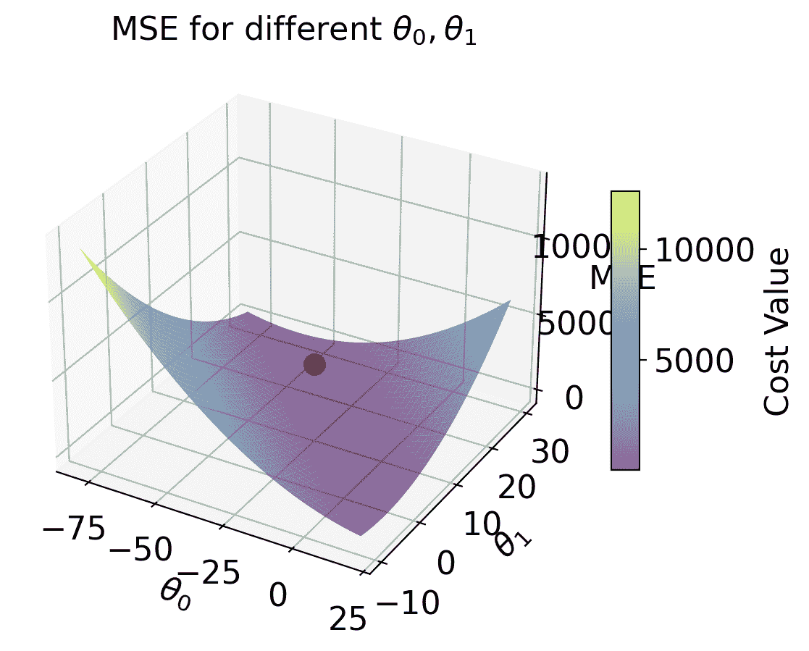

代码

```py
# Predictions
yobs = data_linear["Age"]      # The true observations y
xs = data_linear["Length"]     # Needed for linear predictions
n = len(yobs)                  # Predictions

yhats_constant = [thetahat for i in range(n)]    # Not used, but food for thought
yhats_linear = [theta_0_hat + theta_1_hat * x for x in xs]
``` 

```py
# Constant Model Rug Plot
# In case we're in a weird style state
sns.set_theme()
adjust_fontsize(size=16)
%matplotlib inline

fig = plt.figure(figsize=(8, 1.5))
sns.rugplot(yobs, height=0.25, lw=2) ;
plt.axvline(thetahat, color='red', lw=4, label=r"$\hat{\theta}_0$");
plt.legend()
plt.yticks([]);
# plt.show()
```

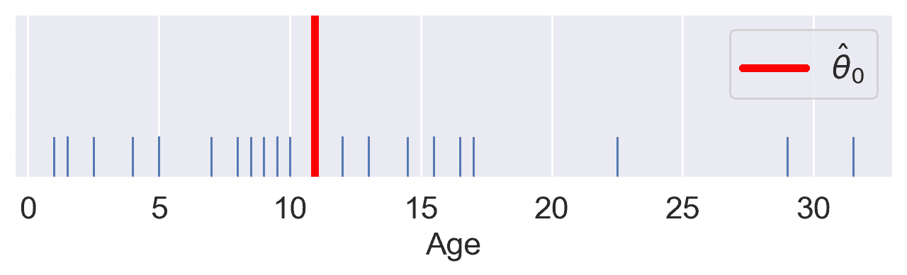

代码

```py
# SLR model scatter plot 
# In case we're in a weird style state
sns.set_theme()
adjust_fontsize(size=16)
%matplotlib inline

sns.scatterplot(x=xs, y=yobs)
plt.plot(xs, yhats_linear, color='red', lw=4);
# plt.savefig('dugong_line.png', bbox_inches = 'tight');
# plt.show()
```

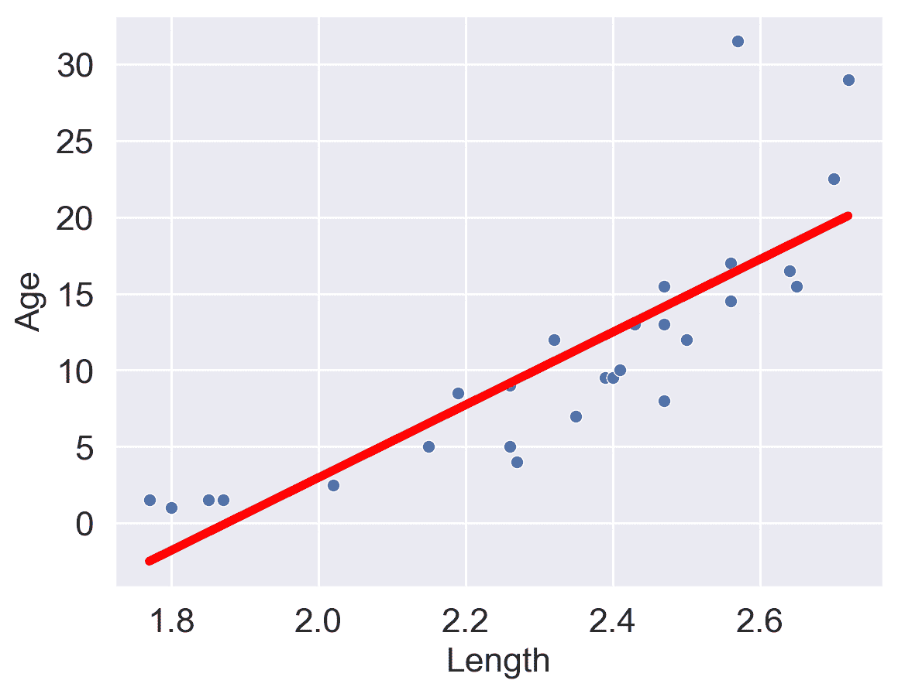

解释 RMSE（均方根误差）：* 常数误差高于线性误差。

因此，* 常数模型比线性模型更差（至少对于这个度量）。

## 11.3 常数模型 + MAE

我们现在看到，改变用于预测的模型会导致最佳模型参数的结果大不相同。如果我们改变模型评估中使用的损失函数会发生什么？

这一次，我们将考虑具有 L1（绝对损失）作为损失函数的常数模型。这意味着平均损失将被表示为**平均绝对误差（MAE）**。

1.  选择模型：常数模型

1.  选择损失函数：L1 损失

1.  拟合模型

1.  评估模型性能

### 11.3.1 求解最优 $\theta_0$

回想一下，MAE 是数据 $D = \{y_1, y_2, ..., y_m\}$ 上的平均**绝对**损失（L1 损失）。

$$\hat{R}(\theta) = \frac{1}{n}\sum^{n}_{i=1} |y_i - \hat{y_i}| $$

给定常数模型 $\hat{y} = \theta_0$，我们可以将 MAE 写成：

$$\hat{R}(\theta) = \frac{1}{n}\sum^{n}_{i=1} |y_i - \theta_0| $$

为了拟合模型，我们通过微积分方法找到最优参数值 $\hat{\theta}$：

1.  对 $\hat{\theta_0}$ 求导数。

$$\hat{R}(\theta) = \frac{1}{n}\sum^{n}_{i=1} |y_i - \theta| $$

$$\frac{d}{d\theta} R(\theta) = \frac{d}{d\theta} \left(\frac{1}{n} \sum^{n}_{i=1} |y_i - \theta| \right)$$

$$= \frac{1}{n} \sum^{n}_{i=1} \frac{d}{d\theta} |y_i - \theta| $$

+   这里，我们似乎遇到了一个问题：当参数为 0 时（即 $y_i = \theta$）绝对值的导数是未定义的。现在，我们将忽略这个问题。事实证明，忽略这种情况不会影响我们的最终结果。

+   进行导数运算时，考虑两种情况。当 $\theta$ *小于或等于* $y_i$ 时，项 $y_i - \theta$ 将为正值，绝对值不会产生影响。当 $\theta$ *大于* $y_i$ 时，项 $y_i - \theta$ 将为负值。应用绝对值将其转换为正值，我们可以表示为 $-(y_i - \theta) = \theta - y_i$。

$$|y_i - \theta| = \begin{cases} y_i - \theta \quad \text{ 如果 } \theta \le y_i \\ \theta - y_i \quad \text{如果 }\theta > y_i \end{cases}$$

+   求导：

$$\frac{d}{d\theta} |y_i - \theta| = \begin{cases} \frac{d}{d\theta} (y_i - \theta) = -1 \quad \text{如果 }\theta < y_i \\ \frac{d}{d\theta} (\theta - y_i) = 1 \quad \text{如果 }\theta > y_i \end{cases}$$

+   这意味着我们对于 $\theta < y_i$ 和 $\theta > y_i$ 的数据点得到了不同的导数值。我们可以总结为：

$$\frac{d}{d\theta} R(\theta) = \frac{1}{n} \sum^{n}_{i=1} \frac{d}{d\theta} |y_i - \theta| \\ = \frac{1}{n} \left[\sum_{\hat{\theta_0} < y_i} (-1) + \sum_{\hat{\theta_0} > y_i} (+1) \right] $$

+   换句话说，我们取 $i = 1, 2, ..., n$ 的值的总和：

    +   如果我们的观察值 $y_i$ *大于* 我们的预测值 $\hat{\theta_0}$，则为$-1$

    +   如果我们的观察值 $y_i$ *小于* 我们的预测值 $\hat{\theta_0}$，则为$+1$

1.  置为 0。$$ 0 = \frac{1}{n}\sum_{\hat{\theta_0} < y_i} (-1) + \frac{1}{n}\sum_{\hat{\theta_0} > y_i} (+1) $$

1.  求解 $\hat{\theta_0}$。$$ 0 = -\frac{1}{n}\sum_{\hat{\theta_0} < y_i} (1) + \frac{1}{n}\sum_{\hat{\theta_0} > y_i} (1)$$

$$\sum_{\hat{\theta_0} < y_i} (1) = \sum_{\hat{\theta_0} > y_i} (1) $$

因此，最小化 MAE 的常数模型参数 $\theta = \hat{\theta_0}$ 必须满足：

$$ \sum_{\hat{\theta_0} < y_i} (1) = \sum_{\hat{\theta_0} > y_i} (1) $$

换句话说，大于 $\theta_0$ 的观察数量必须等于小于 $\theta_0$ 的观察数量；方程的左右两侧必须有相等数量的点。这就是中位数的定义，因此我们的最优值是 $$ \hat{\theta_0} = median(y) $$

## 11.4 总结：损失优化、微积分和临界点

首先，将**目标函数**定义为平均损失。

+   代入 L1 或 L2 损失。

+   代入模型，使得结果表达为 $\theta$ 的函数。

然后，找到目标函数的最小值：

1.  对 $\theta$ 求导数。

1.  置为 0。

1.  求解 $\hat{\theta}$。

1.  （如果我们有多个参数）重复步骤 1-3，使用偏导数。

回想微积分中的临界点：$R(\hat{\theta})$可能是一个最小值、最大值或者鞍点！* 从技术上讲，我们还应该进行二阶导数测试，即，展示 $R''(\hat{\theta}) > 0$。* MSE 具有一个特性——**凸性**——它保证了 $R(\hat{\theta})$ 是一个全局最小值。* MAE 的凸性证明超出了本课程的范围。

## 11.5 比较损失函数

我们现在已经尝试了在 MSE 和 MAE 成本函数下拟合模型。这两个结果如何比较？

让我们考虑一个数据集，其中每个条目代表了泡泡茶店每天卖出的饮料数量。我们将拟合一个常数模型来预测明天将卖出的饮料数量。

```py
drinks = np.array([20, 21, 22, 29, 33])
drinks
```

```py
array([20, 21, 22, 29, 33])
```

根据我们上面的推导，我们知道 MSE 成本下的最佳模型参数是数据集的均值。在 MAE 成本下，最佳参数是数据集的中位数。

```py
np.mean(drinks), np.median(drinks)
```

```py
(25.0, 22.0)
```

如果我们在几个可能的 $\theta$ 值上绘制每个经验风险函数，我们会发现每个 $\hat{\theta}$ 确实对应于最低的错误值：

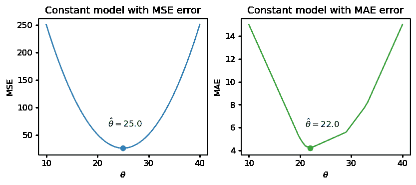

注意上面的 MSE 是一个**平滑**函数——它在所有点上都是可微的，这使得用数值方法最小化它变得容易。相比之下，MAE 在每个“拐点”处都不可微。我们将在几周内探讨成本函数的平滑性如何影响我们应用数值优化的能力。

异常值如何影响每个成本函数？想象一下，我们用 1000 替换数据集中的最大值。数据的均值显著增加，而中位数几乎不受影响。

```py
drinks_with_outlier = np.append(drinks, 1033)
display(drinks_with_outlier)
np.mean(drinks_with_outlier), np.median(drinks_with_outlier)
```

```py
array([  20,   21,   22,   29,   33, 1033])
```

```py
(193.0, 25.5)
```

这意味着在 MSE 下，最佳模型参数 $\hat{\theta}$ 受到异常值的影响。在 MAE 下，最佳参数不受异常数据的影响。我们可以通过说 MSE 对异常值**敏感**，而 MAE 对异常值**稳健**来概括这一点。

让我们尝试另一个实验。这一次，我们将向数据中添加一个额外的非异常数据点。

```py
drinks_with_additional_observation = np.append(drinks, 35)
drinks_with_additional_observation
```

```py
array([20, 21, 22, 29, 33, 35])
```

当我们再次可视化成本函数时，我们发现 MAE 现在在 22 和 29 之间绘制了一条水平线。这意味着模型参数有*无数*个最佳值：任何值 $\hat{\theta} \in [22, 29]$ 都将最小化 MAE。相比之下，MSE 仍然有一个最佳的 $\hat{\theta}$ 值。换句话说，MSE 有一个**唯一**的 $\hat{\theta}$ 解；MAE 不能保证有一个唯一的解。

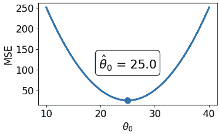 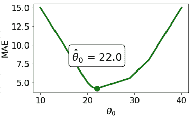

总结我们的例子，

| – | MSE（均方损失） | MAE（平均绝对损失） |
| --- | --- | --- |
| 损失函数 | $\hat{R}(\theta) = \frac{1}{n}\sum^{n}_{i=1} (y_i - \theta_0)^2$ | $\hat{R}(\theta) = \frac{1}{n}\sum^{n}_{i=1} \|;y_i - \theta_0\|$ |
| 最佳 $\hat{\theta_0}$ | $\hat{\theta_0} = mean(y) = \bar{y}$ | $\hat{\theta_0} = median(y)$ |
| 损失曲面 |  |  |
| 形状 | **平滑** - 容易使用数值方法最小化（在几周内） | **分段** - 在每个“拐点”处，它不可微。更难最小化。
| 异常值 | 对异常值敏感（因为它们会显著改变均值）。敏感性还取决于数据集的大小。 | 对异常值更加稳健。 |
| $\hat{\theta_0}$ 唯一性 | **唯一** $\hat{\theta_0}$ | **无数个** $\hat{\theta_0}$ |

## 11.6 转换以拟合线性模型

到目前为止，我们已经有了一种有效的方法来拟合模型以预测线性关系。给定一个特征变量和目标，我们可以应用我们的四步过程来找到最佳的模型参数。

上面的关键词是*线性*。当我们之前计算参数估计时，我们假设$x_i$和$y_i$之间存在大致线性的关系。现实世界中的数据并不总是那么简单，但我们可以对数据进行转换以尝试获得线性关系。

**Tukey-Mosteller Bulge Diagram**是一个总结两个变量之间关系线性化的变换的有用工具。要确定哪些变换可能合适，追踪数据形成的“凸起”的形状。找到与此凸起匹配的图表象限。该象限的垂直和水平轴上显示的变换可以帮助改善变量之间的拟合。

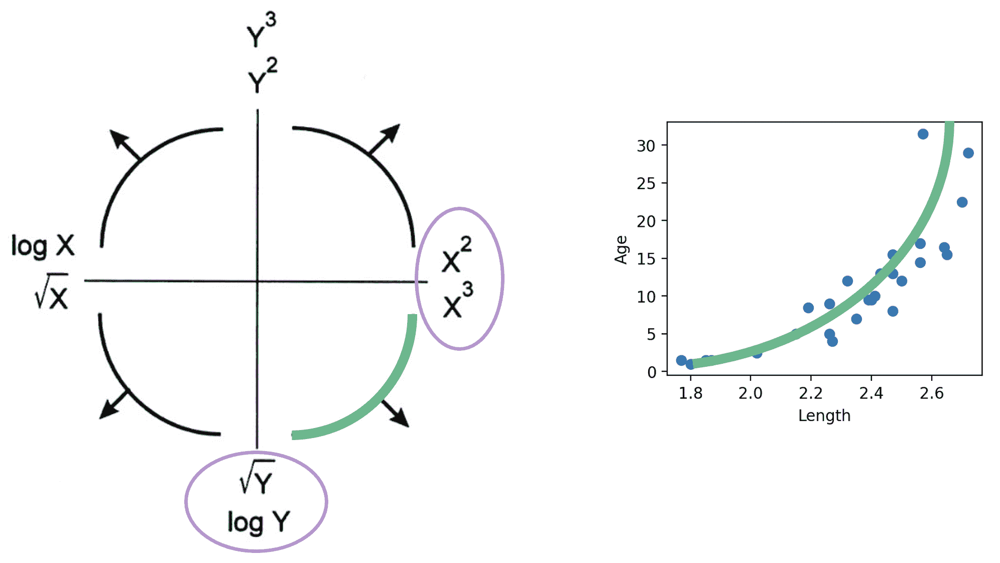

注意：

+   有多种解决方案。有些比其他的拟合效果更好。

+   sqrt 和 log 使值“变小”。

+   提高到幂会使值“变大”。

+   这些变换中的每一个都等同于增加或减少轴的比例。

除了线性之外，还有其他可能的目标，例如使数据看起来更对称。线性允许我们对转换后的数据进行拟合。

让我们重新看一下我们的儒艮示例。长度和年龄如下图所示：

代码

```py
# `corrcoef` computes the correlation coefficient between two variables
# `std` finds the standard deviation
x = dugongs["Length"]
y = dugongs["Age"]
r = np.corrcoef(x, y)[0, 1]
theta_1 = r*np.std(y)/np.std(x)
theta_0 = np.mean(y) - theta_1*np.mean(x)

fig, ax = plt.subplots(1, 2, dpi=200, figsize=(8, 3))
ax[0].scatter(x, y)
ax[0].set_xlabel("Length")
ax[0].set_ylabel("Age")

ax[1].scatter(x, y)
ax[1].plot(x, theta_0 + theta_1*x, "tab:red")
ax[1].set_xlabel("Length")
ax[1].set_ylabel("Age");
```

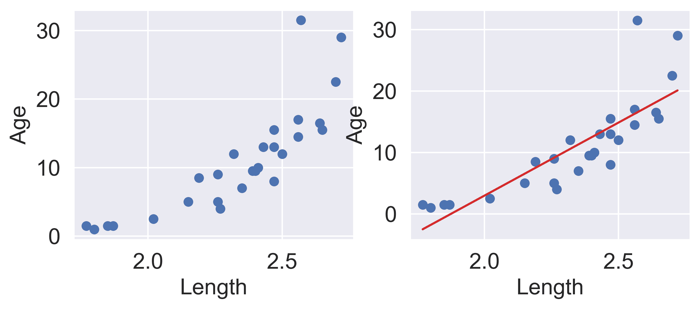

在左边的图中，我们看到数据点有轻微的曲线。在右边绘制 SLR 曲线会导致拟合效果不佳。

为了使 SLR 表现良好，我们希望“年龄”和“长度”之间存在粗略的线性趋势。是什么导致原始数据偏离线性关系？注意到“长度”大于 2.6 的数据点相对于其他数据有着不成比例的高“年龄”值。如果我们能够操纵这些数据点使其具有较低的“年龄”值，我们将“移动”这些点向下并减少数据中的曲率。对$y_i$应用对数变换（即取$\log($“年龄”$)$）就可以实现这一点。

关于$\log$的重要说明：在 Data 100（以及大多数高年级 STEM 课程）中，$\log$表示以$e$为底的自然对数。在相关情况下，以 10 为底的对数用$\log_{10}$表示。

代码

```py
z = np.log(y)

r = np.corrcoef(x, z)[0, 1]
theta_1 = r*np.std(z)/np.std(x)
theta_0 = np.mean(z) - theta_1*np.mean(x)

fig, ax = plt.subplots(1, 2, dpi=200, figsize=(8, 3))
ax[0].scatter(x, z)
ax[0].set_xlabel("Length")
ax[0].set_ylabel(r"$\log{(Age)}$")

ax[1].scatter(x, z)
ax[1].plot(x, theta_0 + theta_1*x, "tab:red")
ax[1].set_xlabel("Length")
ax[1].set_ylabel(r"$\log{(Age)}$")

plt.subplots_adjust(wspace=0.3);
```

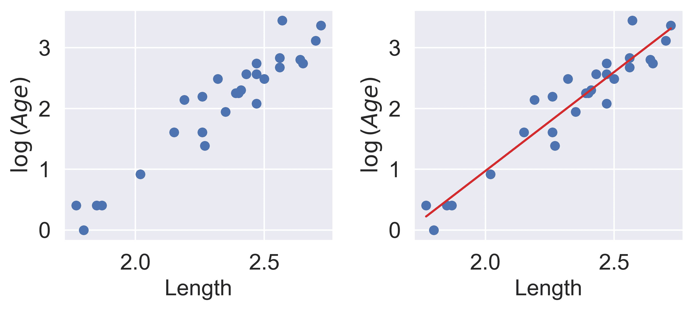

我们的 SLR 拟合看起来好多了！我们现在有了一个新的目标变量：SLR 模型现在试图预测“年龄”的*对数*，而不是未经转换的“年龄”。换句话说，我们应用了变换$z_i = \log{(y_i)}$。注意到得到的模型仍然是**参数线性**的$\theta = [\theta_0, \theta_1]$。SLR 模型变为：

$$\log{\hat{(y_i)}} = \theta_0 + \theta_1 x_i$$

$$\hat{z}_i = \theta_0 + \theta_1 x_i$$

事实证明，这种线性化关系可以帮助我们理解$x_i$和$y_i$之间的基本关系。如果我们重新排列上面的关系，我们会发现：$$ \log{(y_i)} = \theta_0 + \theta_1 x_i \\ y_i = e^{\theta_0 + \theta_1 x_i} \\ y_i = (e^{\theta_0})e^{\theta_1 x_i} \\ y_i = C e^{k x_i} $$

对于一些常数$C$和$k$。

$y_i$是$x_i$的*指数*函数。对未经转换的变量应用指数拟合可以证实这一发现。

代码

```py
plt.figure(dpi=120, figsize=(4, 3))

plt.scatter(x, y)
plt.plot(x, np.exp(theta_0)*np.exp(theta_1*x), "tab:red")
plt.xlabel("Length")
plt.ylabel("Age");
```

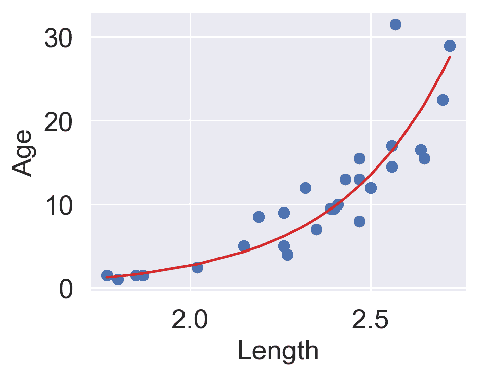

你可能会想：为什么我们选择特别应用对数变换？为什么不使用其他函数来线性化数据？

实际上，许多其他修改“年龄”和“长度”相对比例的数学运算在这里都可以起作用。
