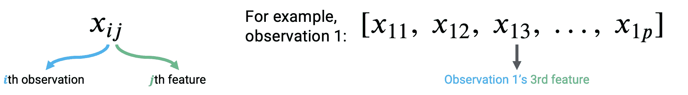

# 十二、普通最小二乘法

> 原文：[Ordinary Least Squares](https://ds100.org/course-notes/ols/ols.html)
> 
> 译者：[飞龙](https://github.com/wizardforcel)
> 
> 协议：[CC BY-NC-SA 4.0](https://creativecommons.org/licenses/by-nc-sa/4.0/)

*学习成果*

+   定义关于参数向量 $\theta$ 的线性性。

+   了解使用矩阵表示法来表达多元线性回归。

+   解释普通最小二乘法为残差向量的范数的最小化。

+   计算多元线性回归的性能指标。

我们现在已经花了很多讲座时间来探讨如何构建有效的模型 - 我们介绍了 SLR 和常数模型，选择了适合我们建模任务的成本函数，并应用了转换来改进线性拟合。

在所有这些情况下，我们考虑了一个特征的模型 ($\hat{y}_i = \theta_0 + \theta_1 x_i$) 或零个特征的模型 ($\hat{y}_i = \theta_0$)。作为数据科学家，我们通常可以访问包含 *许多* 特征的数据集。为了建立最佳模型，考虑所有可用的变量作为模型的输入将是有益的，而不仅仅是一个。在今天的讲座中，我们将介绍 **多元线性回归** 作为将多个特征合并到模型中的框架。我们还将学习如何加速建模过程 - 具体来说，我们将看到线性代数为我们提供了一组强大的工具，用于理解模型性能。

## 12.1 线性

如果一个表达式是 **关于 $\theta$** (一组参数) 是线性组合，那么它是线性的。检查一个表达式是否可以分解为两个项的矩阵乘积 - 一个 **$\theta$** 向量，和一个不涉及 **$\theta$** 的矩阵/向量 - 是线性的一个很好的指标。

例如，考虑向量 $\theta = [\theta_0, \theta_1, \theta_2]$

1.  $\hat{y} = \theta_0 + 2\theta_1 + 3\theta_2$ 在 theta 上是线性的，我们可以将其分解为两个项的矩阵乘积：

$$\hat{y} = \begin{bmatrix} 1 \space 2 \space 3 \end{bmatrix} \begin{bmatrix} \theta_0 \\ \theta_1 \\ \theta_2 \end{bmatrix}$$

1.  $\hat{y} = \theta_0\theta_1 + 2\theta_1^2 + 3log(\theta_2)$ 在 theta 上 *不* 是线性的，因为 $\theta_1$ 项是平方的，而 $\theta_2$ 项是对数的。我们无法将其分解为两个项的矩阵乘积。

## 12.2 多元线性回归的术语

在回归的背景下有几个等效的术语。我们在本课程中最常用的是加粗的。

+   $x$ 可以被称为

    +   **特征**

    +   协变量

    +   **自变量**

    +   解释变量

    +   预测变量

    +   输入

    +   回归器

+   $y$ 可以被称为

    +   **输出**

    +   结果

    +   **响应**

    +   因变量

+   $\hat{y}$ 可以被称为

    +   **预测**

    +   预测响应

    +   估计值

+   $\theta$ 可以被称为

    +   **权重**

    +   **参数**

    +   系数

+   $\hat{\theta}$ 可以被称为

    +   **估计器**

    +   **最佳参数**

+   一个数据点 $(x, y)$ 也被称为一个观测。

## 12.3 多元线性回归

多元线性回归是简单线性回归的扩展，它将额外的特征添加到模型中。多元线性回归模型的形式为：

$$\hat{y} = \theta_0\:+\:\theta_1x_{1}\:+\:\theta_2 x_{2}\:+\:...\:+\:\theta_p x_{p}$$

我们对 $y$ 的预测值 $\hat{y}$ 是单个 **观测** (特征) $x_i$ 和参数 $\theta_i$ 的线性组合。

我们可以通过查看从 2018-19 NBA 赛季下载的包含每个球员数据的数据集来进一步探讨这个想法，数据来自 [Kaggle](https://www.kaggle.com/schmadam97/nba-regular-season-stats-20182019)。

代码

```py
import pandas as pd
nba = pd.read_csv('data/nba18-19.csv', index_col=0)
nba.index.name = None # Drops name of index (players are ordered by rank)
``` 

```py
nba.head(5)
```

| | Player | Pos | Age | Tm | G | GS | MP | FG | FGA | FG% | ... | FT% | ORB | DRB | TRB | AST | STL | BLK | TOV | PF | PTS |
| --- | --- | --- | --- | --- | --- | --- | --- | --- | --- | --- | --- | --- | --- | --- | --- | --- | --- | --- | --- | --- | --- |
| 1 | Álex Abrines\abrinal01 | SG | 25 | OKC | 31 | 2 | 19.0 | 1.8 | 5.1 | 0.357 | ... | 0.923 | 0.2 | 1.4 | 1.5 | 0.6 | 0.5 | 0.2 | 0.5 | 1.7 | 5.3 |
| 2 | Quincy Acy\acyqu01 | PF | 28 | PHO | 10 | 0 | 12.3 | 0.4 | 1.8 | 0.222 | ... | 0.700 | 0.3 | 2.2 | 2.5 | 0.8 | 0.1 | 0.4 | 0.4 | 2.4 | 1.7 |
| 3 | Jaylen Adams\adamsja01 | PG | 22 | ATL | 34 | 1 | 12.6 | 1.1 | 3.2 | 0.345 | ... | 0.778 | 0.3 | 1.4 | 1.8 | 1.9 | 0.4 | 0.1 | 0.8 | 1.3 | 3.2 |
| 4 | Steven Adams\adamsst01 | C | 25 | OKC | 80 | 80 | 33.4 | 6.0 | 10.1 | 0.595 | ... | 0.500 | 4.9 | 4.6 | 9.5 | 1.6 | 1.5 | 1.0 | 1.7 | 2.6 | 13.9 |
| 5 | Bam Adebayo\adebaba01 | C | 21 | MIA | 82 | 28 | 23.3 | 3.4 | 5.9 | 0.576 | ... | 0.735 | 2.0 | 5.3 | 7.3 | 2.2 | 0.9 | 0.8 | 1.5 | 2.5 | 8.9 |

5 行×29 列

假设我们有兴趣预测一名运动员本赛季在篮球比赛中将得分的数量（`PTS`）。

假设我们想要通过使用球员的一些特征或**特征**来拟合一个线性模型。具体来说，我们将专注于投篮命中、助攻和三分球出手。

+   `FG`，每场比赛的（2 分）投篮命中数

+   `AST`，每场比赛的平均助攻数

+   `3PA`，每场比赛尝试的三分球数

代码

```py
nba[['FG', 'AST', '3PA', 'PTS']].head()
```

|  | FG | AST | 3PA | PTS |
| --- | --- | --- | --- | --- |
| 1 | 1.8 | 0.6 | 4.1 | 5.3 |
| 2 | 0.4 | 0.8 | 1.5 | 1.7 |
| 3 | 1.1 | 1.9 | 2.2 | 3.2 |
| 4 | 6.0 | 1.6 | 0.0 | 13.9 |
| 5 | 3.4 | 2.2 | 0.2 | 8.9 |

因为我们现在处理的是许多参数值，我们已经将它们全部收集到了一个维度为$(p+1) \times 1$的**参数向量**中，以保持整洁。记住$p$代表我们拥有的特征数量（在这种情况下是 3）。

$$\theta = \begin{bmatrix} \theta_{0} \\ \theta_{1} \\ \vdots \\ \theta_{p} \end{bmatrix}$$

我们在这里使用两个向量：一个表示观察数据的行向量，另一个包含模型参数的列向量。多元线性回归模型**等同于观察向量和参数向量的点（标量）积**。

$$[1,\:x_{1},\:x_{2},\:x_{3},\:...,\:x_{p}] \theta = [1,\:x_{1},\:x_{2},\:x_{3},\:...,\:x_{p}] \begin{bmatrix} \theta_{0} \\ \theta_{1} \\ \vdots \\ \theta_{p} \end{bmatrix} = \theta_0\:+\:\theta_1x_{1}\:+\:\theta_2 x_{2}\:+\:...\:+\:\theta_p x_{p}$$

请注意，我们已经在观察向量中插入了 1 作为第一个值。当计算点积时，这个 1 将与$\theta_0$相乘，得到回归模型的截距。我们称这个 1 条目为**截距**或**偏差**项。

鉴于我们这里有三个特征，我们可以将这个模型表示为：$$\hat{y} = \theta_0\:+\:\theta_1x_{1}\:+\:\theta_2 x_{2}\:+\:\theta_3 x_{3}$$

我们的特征由$x_1$（`FG`）、$x_2$（`AST`）和$x_3$（`3PA`）表示，每个特征都有对应的参数$\theta_1$、$\theta_2$和$\theta_3$。

在统计学中，这个模型+损失被称为**普通最小二乘法（OLS）**。OLS 的解是参数$\hat{\theta}$的最小损失，也称为**最小二乘估计**。

## 12.4 线性代数方法

我们现在知道如何从多个观察特征生成单个预测。数据科学家通常会进行大规模工作 - 也就是说，他们希望构建可以一次产生多个预测的模型。我们上面介绍的向量表示法为我们提供了如何加速多元线性回归的线索。我们想要使用线性代数的工具。

让我们考虑如何应用上面所做的事情。为了适应我们正在考虑多个特征变量的事实，我们将稍微调整我们的符号。现在，每个观察可以被认为是一个行向量，其中每个特征都有一个条目。



要从数据中的第一个观测中进行预测，我们取参数向量和第一个观测向量的点积。要从*第二个*观测中进行预测，我们将重复这个过程，找到参数向量和*第二个*观测向量的点积。如果我们想要找到数据集中每个观测的模型预测，我们将对数据中的所有$n$个观测重复这个过程。

$$\hat{y}_1 = \theta_0 + \theta_1 x_{11} + \theta_2 x_{12} + ... + \theta_p x_{1p} = [1,\:x_{11},\:x_{12},\:x_{13},\:...,\:x_{1p}] \theta$$

$$\hat{y}_2 = \theta_0 + \theta_1 x_{21} + \theta_2 x_{22} + ... + \theta_p x_{2p} = [1,\:x_{21},\:x_{22},\:x_{23},\:...,\:x_{2p}] \theta$$

$$\vdots$$

$$\hat{y}_n = \theta_0 + \theta_1 x_{n1} + \theta_2 x_{n2} + ... + \theta_p x_{np} = [1,\:x_{n1},\:x_{n2},\:x_{n3},\:...,\:x_{np}] \theta$$

我们的观测数据由$n$个行向量表示，每个向量的维度为$(p+1)$。我们可以将它们全部收集到一个称为$\mathbb{X}$的单个矩阵中。


矩阵$\mathbb{X}$被称为**设计矩阵**。它包含了我们$p$个特征的所有观测数据，其中每一**行**对应一个**观测**，每一**列**对应一个**特征**。它通常（但并非总是）包含一个额外的全为 1 的列来表示**截距**或**偏置列**。

回顾设计矩阵中发生的情况：每一行代表一个单独的观测。例如，数据 100 中的一个学生。每一列代表一个特征。例如，数据 100 中学生的年龄。这个约定使我们能够轻松地将我们在数据框中的先前工作转移到这种新的线性代数视角。


多元线性回归模型可以用矩阵的术语重新表述：$$ \Large \mathbb{\hat{Y}} = \mathbb{X} \theta $$

在这里，$\mathbb{\hat{Y}}$是具有$n$个元素的**预测向量**（$\mathbb{\hat{Y}} \in \mathbb{R}^{n}$）；它包含模型对每个$n$个输入观测的预测。 $\mathbb{X}$是维度为$\mathbb{X} \in \mathbb{R}^(n \times (p + 1))$的**设计矩阵**，$\theta$是维度为$\theta \in \mathbb{R}^{(p + 1)}$的**参数向量**。

作为一个复习，让我们也回顾一下**点积（或内积）**。这是一个向量运算，它：

+   只能在两个**相同长度**的向量上进行

+   对应向量的乘积求和

+   返回一个单一的数字

虽然这不在范围内，但请注意我们也可以几何地解释点积：

+   它是三个因素的乘积：两个向量的**大小**和它们之间的**角度**的**余弦**：$$\vec{u} \cdot \vec{v} = ||\vec{u}|| \cdot ||\vec{v}|| \cdot {cos \theta}$$

## 12.5 均方误差

现在我们有了一个新的理解模型的方法，以向量和矩阵为基础。为了配合这个新的约定，我们应该更新我们对风险函数和模型拟合的理解。

回想一下我们对 MSE 的定义：$$R(\theta) = \frac{1}{n} \sum_{i=1}^n (y_i - \hat{y}_i)^2$$

在本质上，MSE 是一种*距离*的度量 - 它指示了预测值与真实值之间的“距离”平均有多远。

在处理向量时，这种“距离”或向量的**大小/长度**的概念由**范数**表示。更确切地说，向量$\vec{a}$和$\vec{b}$之间的距离可以表示为：$$||\vec{a} - \vec{b}||_2 = \sqrt{(a_1 - b_1)^2 + (a_2 - b_2)^2 + \ldots + (a_n - b_n)^2} = \sqrt{\sum_{i=1}^n (a_i - b_i)^2}$$

双竖线是范数的数学表示。下标 2 表示我们正在计算 L2 范数，或平方范数。

我们需要了解 Data 100 的两种范数是 L1 和 L2 范数（听起来熟悉吗？）。在这篇笔记中，我们将专注于 L2 范数。我们将在未来的讲座中深入探讨 L1 范数。

对于 n 维向量$$\vec{x} = \begin{bmatrix} x_1 \\ x_2 \\ \vdots \\ x_n \end{bmatrix}$$，**L2 向量范数**是

$$||\vec{x}||_2 = \sqrt{(x_1)^2 + (x_2)^2 + \ldots + (x_n)^2} = \sqrt{\sum_{i=1}^n (x_i)^2}$$

L2 向量范数是$n$维中勾股定理的推广。因此，它可以用作矢量的**长度**的度量，甚至可以用作两个矢量之间的**距离**的度量。

我们可以将 MSE 表示为平方 L2 范数，如果我们用预测向量$\hat{\mathbb{Y}}$和真实目标向量$\mathbb{Y}$来重新表达它：

$$R(\theta) = \frac{1}{n} \sum_{i=1}^n (y_i - \hat{y}_i)^2 = \frac{1}{n} ||\mathbb{Y} - \hat{\mathbb{Y}}||_2^2$$

这里，范数双条之外的上标 2 表示我们正在*平方*范数。如果我们插入我们的线性模型$\hat{\mathbb{Y}} = \mathbb{X} \theta$，我们会发现 MSE 成本函数的向量表示：

$$R(\theta) = \frac{1}{n} ||\mathbb{Y} - \mathbb{X} \theta||_2^2$$

在线性代数的视角下，我们的新任务是拟合最佳参数向量$\theta$，使得成本函数最小化。等价地，我们希望最小化范数$$||\mathbb{Y} - \mathbb{X} \theta||_2 = ||\mathbb{Y} - \hat{\mathbb{Y}}||_2.$$

我们可以用两种方式重新表述这个目标：

+   最小化真实值向量$\mathbb{Y}$和预测值向量$\mathbb{\hat{Y}}$之间的**距离**

+   最小化**残差向量**的**长度**，定义为：$$e = \mathbb{Y} - \mathbb{\hat{Y}} = \begin{bmatrix} y_1 - \hat{y}_1 \\ y_2 - \hat{y}_2 \\ \vdots \\ y_n - \hat{y}_n \end{bmatrix}$$

## 12.6 几何视角

为了得出最佳参数向量以实现这一目标，我们可以利用我们建模设置的几何特性。

到目前为止，我们大多把我们的模型看作是观测值和参数向量水平堆叠的标量积。我们也可以将$\hat{\mathbb{Y}}$看作是特征向量的**线性组合**，由**参数**缩放。我们使用符号$\mathbb{X}_{:, i}$来表示设计矩阵的第$i$列。您可以将其视为在调用`.iloc`和`.loc`时使用的相同约定。`:`表示我们正在取第$i$列中的所有条目。


$$ \hat{\mathbb{Y}} = \theta_0 \begin{bmatrix} 1 \\ 1 \\ \vdots \\ 1 \end{bmatrix} + \theta_1 \begin{bmatrix} x_{11} \\ x_{21} \\ \vdots \\ x_{n1} \end{bmatrix} + \ldots + \theta_p \begin{bmatrix} x_{1p} \\ x_{2p} \\ \vdots \\ x_{np} \end{bmatrix} = \theta_0 \mathbb{X}_{:,\:1} + \theta_1 \mathbb{X}_{:,\:2} + \ldots + \theta_p \mathbb{X}_{:,\:p+1}$$

这种新方法很有用，因为它使我们能够利用线性组合的性质。

回想一下矩阵$\mathbb{X}$的**范围**或**列空间**（表示为$span(\mathbb{X})$）是矩阵列的所有可能线性组合的集合。换句话说，范围代表着可能通过添加和缩放矩阵列的某些组合到达的空间中的每一点。另外，如果$\mathbb{X}$的每一列的长度为$n$，$span(\mathbb{X})$是$\mathbb{R}^{n}$的子空间。

因为预测向量$\hat{\mathbb{Y}} = \mathbb{X} \theta$是$\mathbb{X}$的列的线性组合，我们知道**预测包含在$\mathbb{X}$的范围内**。也就是说，我们知道$\mathbb{\hat{Y}} \in \text{Span}(\mathbb{X})$。

下面的图是对$\text{Span}(\mathbb{X})$的简化视图，假设$\mathbb{X}$的每一列都有长度$n$。注意$\mathbb{X$的列定义了$\mathbb{R}^n$的子空间，子空间中的每个点都可以通过$\mathbb{X}$的列的线性组合到达。预测向量$\mathbb{\hat{Y}}$位于这个子空间的某个位置。


检查这个图，我们发现了一个问题。真实值向量$\mathbb{Y}$理论上可以位于$\mathbb{R}^n$空间中的*任何位置*——它的确切位置取决于我们在现实世界中收集的数据。然而，我们的多元线性回归模型只能在$\mathbb{X}$张成的$\mathbb{R}^n$空间的子空间中进行预测。记住我们在前一节建立的模型拟合目标：我们希望生成预测，使得真实值向量$\mathbb{Y}$和预测值向量$\mathbb{\hat{Y}}$之间的距离最小化。这意味着**我们希望$\mathbb{\hat{Y}}$是$\text{Span}(\mathbb{X})$中离$\mathbb{Y}$最近的向量**。

另一种重新表述这个目标的方式是，我们希望最小化残差向量$e$的长度，即其$L_2$范数。


在$\text{Span}(\mathbb{X})$中距离$\mathbb{Y}$最近的向量始终是$\mathbb{Y}$在$\text{Span}(\mathbb{X})$上的**正交投影**。因此，我们应该选择参数向量$\theta$，使得**残差向量与$\text{Span}(\mathbb{X})$中的任何向量正交**。你可以将这个想象成从$\mathbb{Y}$到$\mathbb{X}$的跨度上垂直投影线创建的向量。

这如何帮助我们确定最佳参数向量$\hat{\theta}$？回想一下，如果两个向量$a$和$b$正交，它们的点积为零：${a}^{T}b = 0$。如果向量$v$正交于矩阵$M$的张成空间，当且仅当$v$正交于$M$中的**每一列**。综合起来，向量$v$对于$\text{Span}(M)$正交，如果：

$$M^Tv = \vec{0}$$

请注意，$\vec{0}$代表**零向量**，一个全为 0 的$d$长度向量。

记住我们的目标是找到$\hat{\theta}$，使得我们最小化目标函数$R(\theta)$。等价地，这就是使得残差向量$e = \mathbb{Y} - \mathbb{X} \theta$与$\text{Span}(\mathbb{X})$正交的$\hat{\theta}$。

观察$\mathbb{Y} - \mathbb{X}\hat{\theta}$与$span(\mathbb{X})$正交的定义（0 是$\vec{0}$向量），我们可以写成：$$\mathbb{X}^T (\mathbb{Y} - \mathbb{X}\hat{\theta}) = \vec{0}$$

然后我们重新排列项：$$\mathbb{X}^T \mathbb{Y} - \mathbb{X}^T \mathbb{X} \hat{\theta} = \vec{0}$$

最后，我们得到了**正规方程**：$$\mathbb{X}^T \mathbb{X} \hat{\theta} = \mathbb{X}^T \mathbb{Y}$$

任何最小化数据集上均方误差的向量$\theta$必须满足这个方程。

如果$\mathbb{X}^T \mathbb{X}$是可逆的，我们可以得出结论：$$\hat{\theta} = (\mathbb{X}^T \mathbb{X})^{-1} \mathbb{X}^T \mathbb{Y}$$

这被称为$\theta$的**最小二乘估计**：它是使平方损失最小化的$\theta$的值。

请注意，最小二乘估计是在假设$\mathbb{X}^T \mathbb{X}$是*可逆*的条件下推导出来的。当$\mathbb{X}^T \mathbb{X}$是满列秩时，这个条件成立，而这又发生在$\mathbb{X}$是满列秩时。我们将在实验和作业中探讨这个事实的后果。

## 12.7 评估模型性能

我们对多元线性回归的几何视图已经有了很大的进展！我们已经确定了最小化多个特征模型中的均方误差的参数值的最佳集合。

现在，我们想要了解我们的拟合模型的表现如何。模型性能的一个度量是**均方根误差**，即 RMSE。RMSE 只是 MSE 的平方根。取平方根将值转换回$y_i$的原始、非平方单位，这对于理解模型的性能很有用。较低的 RMSE 表示更“准确”的预测-在整个数据集中有更低的平均损失。

$$\text{RMSE} = \sqrt{\frac{1}{n} \sum_{i=1}^n (y_i - \hat{y}_i)^2}$$

在处理 SLR 时，我们生成了残差与单个特征的图表，以了解残差的行为。在多元线性回归中使用多个特征时，考虑在残差图中只有一个特征不再有意义。相反，多元线性回归通过制作残差与预测值的图表来进行评估。与 SLR 一样，如果多元线性模型的残差图没有模式，则表现良好。


对于 SLR，我们使用相关系数来捕捉目标变量和单个特征变量之间的关联。在多元线性模型设置中，我们将需要一个性能度量，可以同时考虑多个特征。**多元$R^2$**，也称为**决定系数**，是我们的**拟合值**（预测）$\hat{y}_i$的**方差比例**到真实值$y_i$。它的范围从 0 到 1，实际上是模型解释观察中方差的*比例*。

$$R^2 = \frac{\text{variance of } \hat{y}_i}{\text{variance of } y_i} = \frac{\sigma^2_{\hat{y}}}{\sigma^2_y}$$

请注意，对于具有截距项的 OLS，例如$\hat{y} = \theta_0 + \theta_1x_1 + \theta_2x_2 + \cdots + \theta_px_p$，$\mathbb{R}^2$等于$y$和$\hat{y}$之间的相关性的平方。另一方面，对于 SLR，$\mathbb{R}^2$等于$r^2$，即$x$和$y$之间的相关性。这两个属性的证明超出了本课程的范围。

此外，随着我们添加更多的特征，我们的拟合值倾向于越来越接近我们的实际值。因此，$\mathbb{R}^2$增加。

然而，增加更多的特征并不总是意味着我们的模型更好！我们将在课程后面看到原因。

## 12.8 OLS 属性

1.  使用最优参数向量时，我们的残差$e = \mathbb{Y} - \hat{\mathbb{Y}}$与$span(\mathbb{X})$正交。

$$\mathbb{X}^Te = 0 $$

证明：

+   最优参数向量$\hat{\theta}$解决了正规方程$\implies \hat{\theta} = \mathbb{X}^T\mathbb{X}^{-1}\mathbb{X}^T\mathbb{Y}$

$$\mathbb{X}^Te = \mathbb{X}^T (\mathbb{Y} - \mathbb{\hat{Y}}) $$

$$\mathbb{X}^T (\mathbb{Y} - \mathbb{X}\hat{\theta}) = \mathbb{X}^T\mathbb{Y} - \mathbb{X}^T\mathbb{X}\hat{\theta}$$

+   任何矩阵与其逆矩阵相乘都是单位矩阵$\mathbb{I}$

$$\mathbb{X}^T\mathbb{Y} - (\mathbb{X}^T\mathbb{X})(\mathbb{X}^T\mathbb{X})^{-1}\mathbb{X}^T\mathbb{Y} = \mathbb{X}^T\mathbb{Y} - \mathbb{X}^T\mathbb{Y} = 0$$

2. 对于所有具有**截距项**的线性模型，**残差的总和为零**。

$$\sum_i^n e_i = 0$$

证明：

+   对于所有具有**截距项**的线性模型，预测的$y$值的平均值等于真实$y$值的平均值。$$\bar{y} = \bar{\hat{y}}$$

+   将残差总和重写为两个单独的总和，$$\sum_i^n e_i = \sum_i^n y_i - \sum_i^n\hat{y}_i$$

+   每个相应的和是平均和的倍数。$$\sum_i^n e_i = n\bar{y} - n\bar{y} = n(\bar{y} - \bar{y}) = 0$$

3. 最小二乘估计$\hat{\theta}$是**唯一**的，当且仅当$\mathbb{X}$是**满列秩**的。

证明：

+   我们知道正规方程$\mathbb{X}^T\mathbb{X}\hat{\theta} = \mathbb{Y}$的解是满足先前相等的最小二乘估计。

+   $\hat{\theta}$ 有一个**唯一**的解 $\iff$ 方阵 $\mathbb{X}^T\mathbb{X}$ 是**可逆**的。

    +   方阵的**列**秩是它包含的线性独立列的数量。

    +   一个 $n$ x $n$ 的方阵被认为是完整的列秩当且仅当它的所有列都是线性独立的。也就是说，它的秩等于 $n$。

    +   $\mathbb{X}^T\mathbb{X}$ 的形状是 $(p + 1) \times (p + 1)$，因此最大秩为 $p + 1$。

+   $rank(\mathbb{X}^T\mathbb{X})$ = $rank(\mathbb{X})$（证明超出范围）。

+   因此，$\mathbb{X}^T\mathbb{X}$ 的秩为 $p + 1$ $\iff$ $\mathbb{X}$ 的秩为 $p + 1$ $\iff \mathbb{X}$ 是完整的列秩。

总结：

|  | 模型 | 估计 | 唯一？ |
| --- | --- | --- | --- |
| 常数模型 + MSE | $\hat{y} = \theta_0$ | $\hat{\theta_0} = mean(y) = \bar{y}$ | **是**。任何一组值都有唯一的均值。 |
| 常数模型 + MAE | $\hat{y} = \theta_0$ | $\hat{\theta_0} = median(y)$ | **是**，如果是奇数。**否**，如果是偶数。返回中间 2 个值的平均值。 |
| 简单线性回归 + MSE | $\hat{y} = \theta_0 + \theta_1x$ | $\hat{\theta_0} = \bar{y} - \hat{\theta_1}\hat{x}$ $\hat{\theta_1} = r\frac{\sigma_y}{\sigma_x}$ | **是**。任何一组非常数*值都有唯一的均值、标准差和相关系数。 |
| **OLS**（线性模型 + MSE） | $\mathbb{\hat{Y}} = \mathbb{X}\mathbb{\theta}$ | $\hat{\theta} = \mathbb{X}^T\mathbb{X}^{-1}\mathbb{X}^T\mathbb{Y}$ | **是**，如果 $\mathbb{X}$ 是完整的列秩（所有列线性独立，数据点的数量 >>> 特征的数量）。 |
