# 十三、梯度下降

> 原文：[Gradient Descent](https://ds100.org/course-notes/gradient_descent/gradient_descent.html)
> 
> 译者：[飞龙](https://github.com/wizardforcel)
> 
> 协议：[CC BY-NC-SA 4.0](https://creativecommons.org/licenses/by-nc-sa/4.0/)

*学习成果*

+   优化复杂模型

+   识别直接微积分或几何论证无法帮助解决损失函数的情况

+   应用梯度下降进行数值优化

到目前为止，我们已经非常熟悉选择模型和相应损失函数的过程，并通过选择最小化损失函数的$\theta$的值来优化参数。到目前为止，我们已经通过以下两种方法优化了$\theta$：1. 使用微积分对损失函数关于$\theta$的导数进行求导，将其置为 0，并解出$\theta$。2. 使用正交性的几何论证来推导 OLS 解$\hat{\theta} = (\mathbb{X}^T \mathbb{X})^{-1}\mathbb{X}^T \mathbb{Y}$。

然而，需要注意的一点是，我们上面使用的技术只有在我们做出一些重大假设时才能应用。对于微积分方法，我们假设损失函数在所有点上都是可微的，并且代数是可管理的；对于几何方法，OLS*仅*适用于使用 MSE 损失的线性模型。当我们有更复杂的模型和不同的更复杂的损失函数时会发生什么？到目前为止我们学到的技术将不起作用，所以我们需要一种新的优化技术：**梯度下降**。

> **重要思想**：使用算法而不是求解精确答案

## 13.1 最小化 1D 函数

让我们考虑一个任意的函数。我们的目标是找到最小化这个函数的$x$的值。

代码

```py
import pandas as pd
import seaborn as sns
import plotly.express as px
import matplotlib.pyplot as plt
import numpy as np
pd.options.mode.chained_assignment = None  # default='warn'
```

```py
def arbitrary(x):
 return (x**4 - 15*x**3 + 80*x**2 - 180*x + 144)/10
```

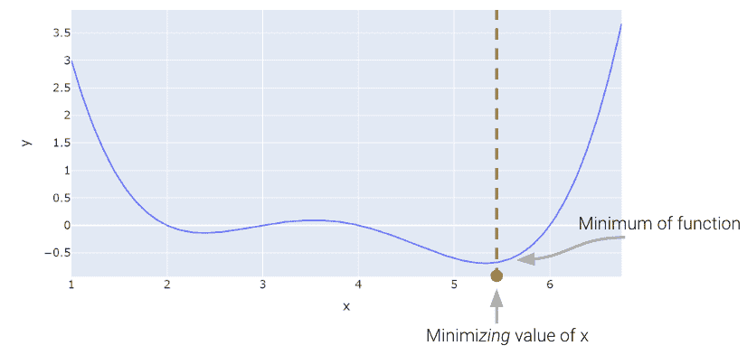

### 13.1.1 天真的方法：猜测和检查

以上，我们看到最小值大约在 5.3 左右。让我们看看我们是否能够弄清楚如何从头开始算法地找到确切的最小值。一种非常慢（而且糟糕）的方法是手动猜测和检查。

```py
arbitrary(6)
```

```py
0.0
```

一个稍微好一点（但仍然很慢）的方法是使用蛮力来尝试一堆 x 值，并返回产生最低损失的值。

```py
def simple_minimize(f, xs):
 # Takes in a function f and a set of values xs. 
 # Calculates the value of the function f at all values x in xs
 # Takes the minimum value of f(x) and returns the corresponding value x 
 y = [f(x) for x in xs] 
 return xs[np.argmin(y)]

guesses = [5.3, 5.31, 5.32, 5.33, 5.34, 5.35]
simple_minimize(arbitrary, guesses)
```

```py
5.33
```

这个过程本质上与我们以前制作图形图表的过程相同，只是我们只看了 20 个选定的点。

代码

```py
xs = np.linspace(1, 7, 200)
sparse_xs = np.linspace(1, 7, 5)

ys = arbitrary(xs)
sparse_ys = arbitrary(sparse_xs)

fig = px.line(x = xs, y = arbitrary(xs))
fig.add_scatter(x = sparse_xs, y = arbitrary(sparse_xs), mode = "markers")
fig.update_layout(showlegend= False)
fig.update_layout(autosize=False, width=800, height=600)
fig.show()
```

这种基本方法存在三个主要缺陷：1. 如果最小值在我们猜测的范围之外，答案将完全错误。2. 即使我们的猜测范围是正确的，如果猜测太粗糙，我们的答案将不准确。3. 考虑到可能庞大的无用猜测数量，这是绝对计算效率低下的。

### 13.1.2 Scipy.optimize.minimize

最小化这个数学函数的一种方法是使用`scipy.optimize.minimize`函数。它接受一个函数和一个起始猜测，并尝试找到最小值。

```py
from scipy.optimize import minimize

# takes a function f and a starting point x0 and returns a readout 
# with the optimal input value of x which minimizes f
minimize(arbitrary, x0 = 3.5)
```

```py
 message: Optimization terminated successfully.
  success: True
   status: 0
      fun: -0.13827491292966557
        x: [ 2.393e+00]
      nit: 3
      jac: [ 6.486e-06]
 hess_inv: [[ 7.385e-01]]
     nfev: 20
     njev: 10
```

`scipy.optimize.minimize`很棒。它也可能看起来有点神奇。你怎么能写一个函数来找到任何数学函数的最小值呢？有许多方法可以做到这一点，我们将在今天的讲座中探讨这些方法，最终到达`scipy.optimize.minimize`使用的**梯度下降**的重要思想。

事实证明，在幕后，`LinearRegression`模型的`fit`方法使用了梯度下降。梯度下降也是许多机器学习模型的工作原理，甚至包括先进的神经网络模型。

在 Data 100 中，梯度下降过程通常对我们来说是不可见的，隐藏在抽象层下。然而，作为优秀的数据科学家，我们知道优化函数利用的基本原理是很重要的。

## 13.2 深入研究梯度下降

在这个域中查看函数，很明显函数的最小值出现在$\theta = 5.3$附近。假设一下，我们*看不到*成本函数的完整视图。我们如何猜测最小化函数的$\theta$值？

原来，函数的一阶导数可以给我们一些线索。在下面的图中，线表示每个$\theta$值的导数值。导数为负值时为红色，为正值时为绿色。

假设我们对最小化$\theta$的值进行了猜测。记住我们从左到右读取图，并假设我们的起始$\theta$值在最佳$\hat{\theta}$的左边。如果猜测“低估”了真正的最小值 - 我们对最小化函数的$\hat{\theta}$的猜测低于真正的$\hat{\theta}$值 - 导数将是**负数**。这意味着如果我们增加$\theta$（向右移动），那么我们**可以进一步减少**我们的损失函数。如果这个猜测“高估”了真正的最小值，导数将是正数，暗示着相反。

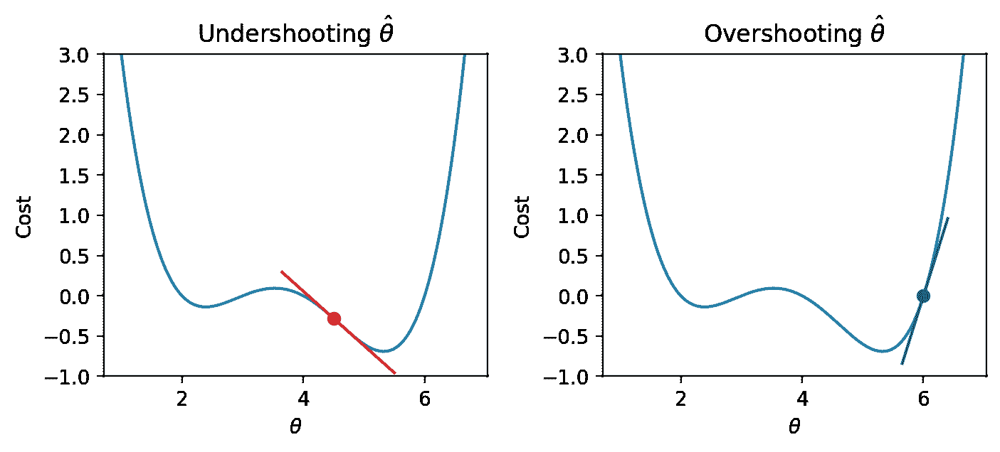

我们可以利用这种模式来帮助制定我们对最佳$\hat{\theta}$的下一个猜测。考虑一种情况，我们通过猜测一个太低的值而低估了$\theta$。我们希望我们的下一个猜测的值比上一个猜测的值更大 - 也就是说，我们希望将我们的猜测向右移动。你可以把这看作是沿着斜坡“下坡”到函数的最小值。

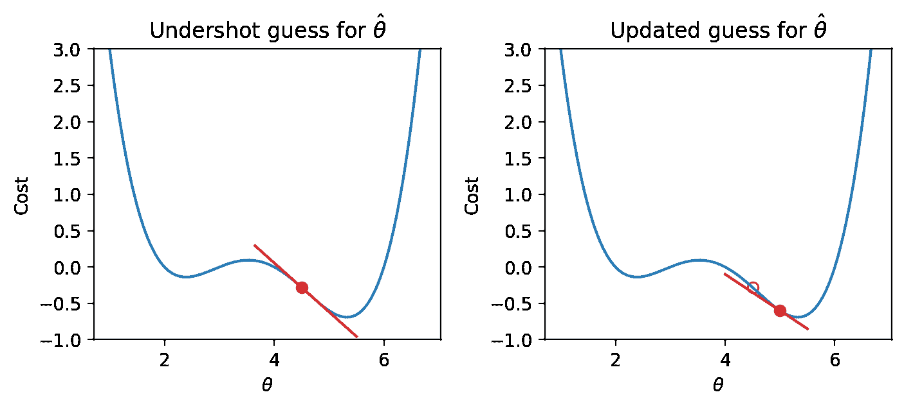

如果我们通过猜测一个太高的值而高估了$\hat{\theta}$，我们希望我们的下一个猜测的值更低 - 我们希望将$\hat{\theta}$的猜测向左移动。

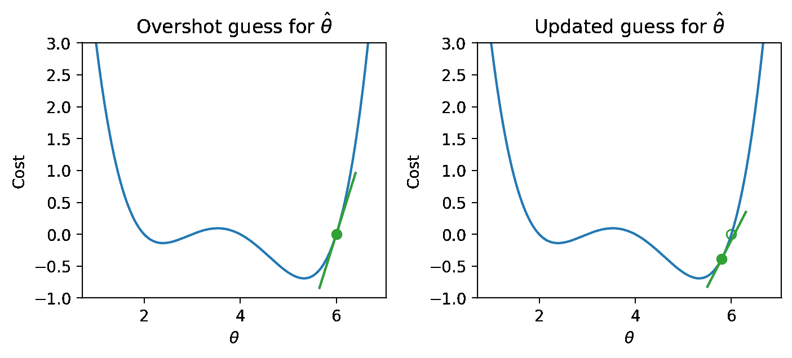

换句话说，每个点的函数的导数告诉我们我们下一个猜测的方向。*负斜率意味着我们想向右走，或者向*正*方向移动。*正斜率意味着我们想向左走，或者向*负*方向移动。

### 13.2.1 算法尝试 1

有了这个知识，让我们试着看看我们是否可以使用导数来优化函数。

我们首先对$x$的最小值进行一些猜测。然后，我们查看该$x$值的函数的导数，并向*相反*方向下坡。我们可以将我们的新规则表示为一个递归关系：

$$x^{(t+1)} = x^{(t)} - \frac{d}{dx} f(x^{(t)})$$

将这个陈述翻译成英文：我们通过取上一次的猜测($x^{(t)}$)并减去该点的函数的导数($\frac{d}{dx} f(x^{(t)})$)来获得**我们下一次的猜测**，即在时间步长$t+1$($x^{(t+1)}$)的最小值$x$。

下面显示了一些步骤，其中旧步骤显示为透明点，下一个步骤是填充为绿色的点。

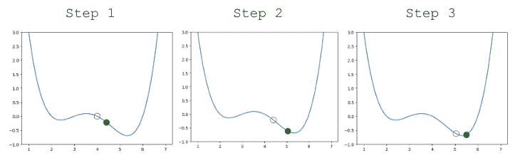

看起来不错！但是我们确实有一个问题 - 一旦我们接近函数的最小值，我们的猜测就会在最小值附近“反弹”而永远无法到达它。

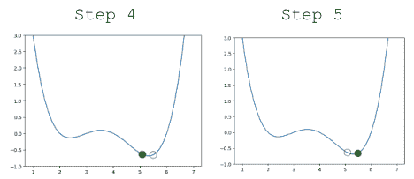

换句话说，每次更新我们的猜测时，我们走得太远了。我们可以通过减小每个步骤的大小来解决这个问题。

### 13.2.2 算法尝试 2

让我们更新我们的算法以使用**学习率**（有时也称为步长），它控制我们每次更新的距离。我们用$\alpha$表示学习率。

$$x^{(t+1)} = x^{(t)} - \alpha \frac{d}{dx} f(x^{(t)})$$

小的$\alpha$意味着我们会采取小步；大的$\alpha$意味着我们会采取大步。

更新我们的函数使用$\alpha=0.3$，我们的算法成功地**收敛**（在最小值上解决并停止显着更新，或者完全停止）。

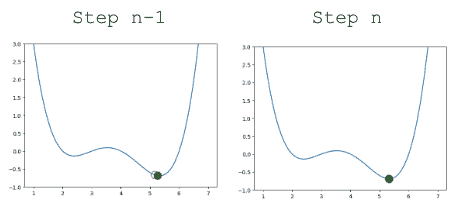

### 13.2.3 凸性

在我们上面的分析中，我们把注意力集中在损失函数的全局最小值上。你可能会想：左边的局部最小值呢？

如果我们选择了不同的$\theta$起始猜测，或者不同的学习率$\alpha$值，我们的算法可能会“卡住”，收敛到局部最小值，而不是真正的最优损失值。

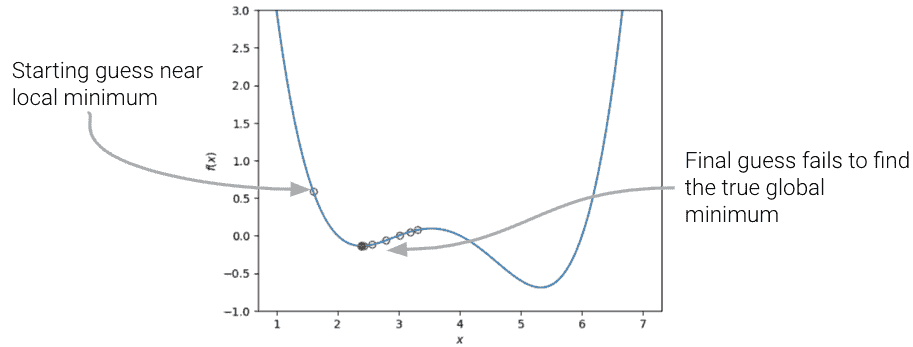

如果损失函数是**凸的**，梯度下降保证会收敛并找到目标函数的全局最小值。形式上，如果一个函数$f$满足：$$tf(a) + (1-t)f(b) \geq f(ta + (1-t)b)$$ 对于所有$f$的定义域中的$a, b$和$t \in [0, 1]$。

换句话说：如果你在曲线上的任意两点之间画一条线，曲线上的所有值必须*在或下*于该线。重要的是，凸函数的任何局部最小值也是它的全局最小值。

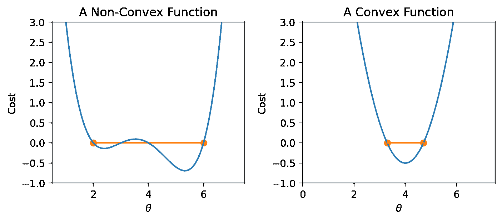

总之，非凸损失函数可能会导致优化问题。这意味着我们选择的损失函数是建模过程中的关键因素。事实证明，MSE *是*凸的，这也是它成为如此受欢迎的损失函数的主要原因。

## 13.3 一维梯度下降

> **术语澄清**：在过去的讲座中，我们使用“损失”来指代*单个*数据点上发生的错误。在应用中，我们通常更关心*所有*数据点的平均误差。未来，我们将把“模型的损失”理解为数据集上的模型平均误差。这有时也被称为经验风险、成本函数或目标函数。$$L(\theta) = R(\theta) = \frac{1}{n} \sum_{i=1}^{n} L(y, \hat{y})$$

在上面的讨论中，我们使用了一些任意函数$f$。作为数据科学家，我们几乎总是在优化*模型*的情况下使用梯度下降 - 具体来说，我们想要应用梯度下降来找到*损失函数*的最小值。在建模的情况下，我们的目标是通过选择最小化的模型*参数*来最小化*损失函数*。

回顾一下我们过去几节讲座的建模工作流程：* 定义具有一些参数$\theta_i$的模型 * 选择一个损失函数 * 选择使数据上的损失函数最小化的$\theta_i$的值

梯度下降是完成最后任务的强大技术。通过应用梯度下降算法，我们可以选择参数$\theta_i$的值，这将导致模型在训练数据上损失最小。

在建模上下文中使用梯度下降时：* 我们对最小化的$\theta_i$进行猜测 * 我们计算损失函数$L$的导数

我们可以通过用$\theta$替换$x$和用$L$替换$f$来“翻译”我们之前的梯度下降规则：

$$\theta^{(t+1)} = \theta^{(t)} - \alpha \frac{d}{d\theta} L(\theta^{(t)})$$

### 13.3.1 在`tips`数据集上的梯度下降

为了看到这一点，让我们考虑一个没有偏移的线性模型的情况。我们想要预测小费（y）给定一顿饭的价格（x）。为了做到这一点，我们

+   选择一个模型：$\hat{y} = \theta_1 x$，

+   选择一个损失函数：$L(\theta) = MSE(\theta) = \frac{1}{n} \sum_{i=1}^n (y_i - \theta_1x_i)^2$。

让我们应用之前的`gradient_descent`函数来优化我们在`tips`数据集上的模型。我们将尝试选择最佳参数$\theta_i$来预测`total_bill`$x$的`tip`$y$。

```py
df = sns.load_dataset("tips")
df.head()
```

|  | total_bill | tip | sex | smoker | day | time | size |
| --- | --- | --- | --- | --- | --- | --- | --- |
| 0 | 16.99 | 1.01 | Female | No | Sun | Dinner | 2 |
| 1 | 10.34 | 1.66 | Male | No | Sun | Dinner | 3 |
| 2 | 21.01 | 3.50 | Male | No | Sun | Dinner | 3 |
| 3 | 23.68 | 3.31 | Male | No | Sun | Dinner | 2 |
| 4 | 24.59 | 3.61 | Female | No | Sun | Dinner | 4 |

我们可以可视化我们的数据集上 MSE 的值，对于不同可能的$\theta_1$的选择。为了优化我们的模型，我们希望选择导致最低 MSE 的$\theta_1$的值。

代码

```py
import plotly.graph_objects as go

def derivative_arbitrary(x):
 return (4*x**3 - 45*x**2 + 160*x - 180)/10

fig = go.Figure()
roots = np.array([2.3927, 3.5309, 5.3263])

fig.add_trace(go.Scatter(x = xs, y = arbitrary(xs), 
 mode = "lines", name = "f"))
fig.add_trace(go.Scatter(x = xs, y = derivative_arbitrary(xs), 
 mode = "lines", name = "df", line = {"dash": "dash"}))
fig.add_trace(go.Scatter(x = np.array(roots), y = 0*roots, 
 mode = "markers", name = "df = zero", marker_size = 12))
fig.update_layout(font_size = 20, yaxis_range=[-1, 3])
fig.update_layout(autosize=False, width=800, height=600)
fig.show()
```

要应用梯度下降，我们需要计算损失函数对我们的参数$\theta_1$的导数。

+   给定我们的损失函数，$$L(\theta) = MSE(\theta) = \frac{1}{n} \sum_{i=1}^n (y_i - \theta_1x_i)^2$$

+   我们对$\theta_1$进行导数$$\frac{\partial}{\partial \theta_{1}} L(\theta_1^{(t)}) = \frac{-2}{n} \sum_{i=1}^n (y_i - \theta_1^{(t)} x_i) x_i$$

+   这导致梯度下降更新规则$$\theta_1^{(t+1)} = \theta_1^{(t)} - \alpha \frac{d}{d\theta}L(\theta_1^{(t)})$$

对于一些学习率$\alpha$。

在代码中实现这一点，我们可以可视化`tips`数据上的 MSE 损失。**MSE 是凸的**，因此有一个全局最小值。

代码

```py
def gradient_descent(df, initial_guess, alpha, n):
 """Performs n steps of gradient descent on df using learning rate alpha starting
 from initial_guess. Returns a numpy array of all guesses over time."""
 guesses = [initial_guess]
 current_guess = initial_guess
 while len(guesses) < n:
 current_guess = current_guess - alpha * df(current_guess)
 guesses.append(current_guess)

 return np.array(guesses)

def mse_single_arg(theta_1):
 """Returns the MSE on our data for the given theta1"""
 x = df["total_bill"]
 y_obs = df["tip"]
 y_hat = theta_1 * x
 return np.mean((y_hat - y_obs) ** 2)

def mse_loss_derivative_single_arg(theta_1):
 """Returns the derivative of the MSE on our data for the given theta1"""
 x = df["total_bill"]
 y_obs = df["tip"]
 y_hat = theta_1 * x

 return np.mean(2 * (y_hat - y_obs) * x)

loss_df = pd.DataFrame({"theta_1":np.linspace(-1.5, 1), "MSE":[mse_single_arg(theta_1) for theta_1 in np.linspace(-1.5, 1)]})

trajectory = gradient_descent(mse_loss_derivative_single_arg, -0.5, 0.0001, 100)

plt.plot(loss_df["theta_1"], loss_df["MSE"])
plt.scatter(trajectory, [mse_single_arg(guess) for guess in trajectory], c="white", edgecolor="firebrick")
plt.scatter(trajectory[-1], mse_single_arg(trajectory[-1]), c="firebrick")
plt.xlabel(r"$\theta_1$")
plt.ylabel(r"$L(\theta_1)$");

print(f"Final guess for theta_1: {trajectory[-1]}")
```

```py
Final guess for theta_1: 0.14369554654231262
```

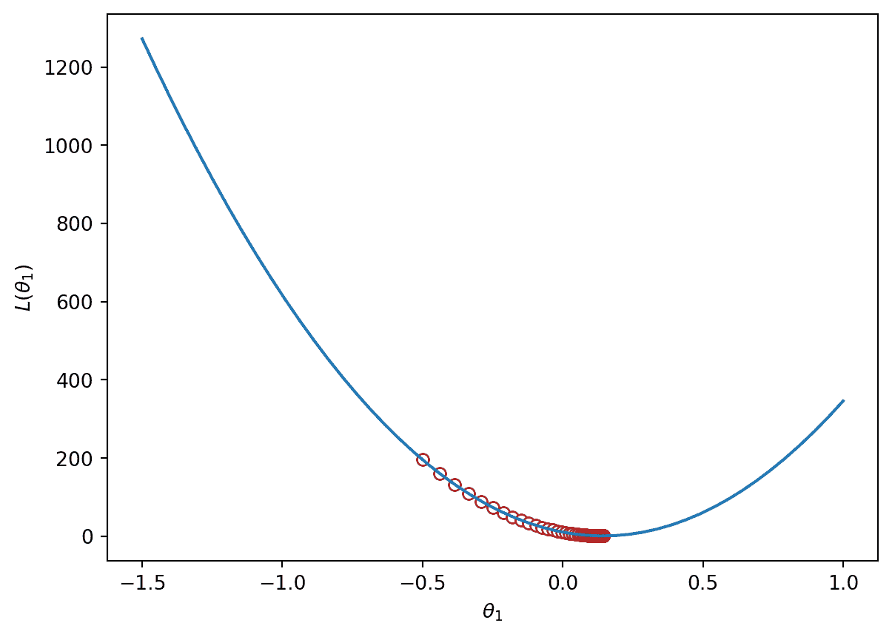

## 13.4 多维模型的梯度下降

我们上面使用的函数是一维的 - 我们只是在最小化函数相对于单个参数$\theta$。然而，模型通常具有需要优化的多个参数的成本函数。例如，简单线性回归有 2 个参数：$\hat{y} + \theta_0 + \theta_1x$，多元线性回归有$p+1$个参数：$\mathbb{Y} = \theta_0 + \theta_1 \Bbb{X}_{:,1} + \theta_2 \Bbb{X}_{:,2} + \cdots + \theta_p \Bbb{X}_{:,p}$

我们需要扩展梯度下降，这样我们就可以一次性更新所有模型参数的猜测。

有多个参数要优化时，我们考虑**损失表面**，或者模型对一组可能的参数值的损失。

代码

```py
import plotly.graph_objects as go

def mse_loss(theta, X, y_obs):
 y_hat = X @ theta
 return np.mean((y_hat - y_obs) ** 2) 

tips_with_bias = df.copy()
tips_with_bias["bias"] = 1
tips_with_bias = tips_with_bias[["bias", "total_bill"]]

uvalues = np.linspace(0, 2, 10)
vvalues = np.linspace(-0.1, 0.35, 10)
(u,v) = np.meshgrid(uvalues, vvalues)
thetas = np.vstack((u.flatten(),v.flatten()))

def mse_loss_single_arg(theta):
 return mse_loss(theta, tips_with_bias, df["tip"])

MSE = np.array([mse_loss_single_arg(t) for t in thetas.T])

loss_surface = go.Surface(x=u, y=v, z=np.reshape(MSE, u.shape))

ind = np.argmin(MSE)
optimal_point = go.Scatter3d(name = "Optimal Point",
 x = [thetas.T[ind,0]], y = [thetas.T[ind,1]], 
 z = [MSE[ind]],
 marker=dict(size=10, color="red"))

fig = go.Figure(data=[loss_surface, optimal_point])
fig.update_layout(scene = dict(
 xaxis_title = "theta0",
 yaxis_title = "theta1",
 zaxis_title = "MSE"), autosize=False, width=800, height=600)

fig.show()
```

我们还可以使用等高线图从上方可视化损失表面的鸟瞰图：

```py
contour = go.Contour(x=u[0], y=v[:, 0], z=np.reshape(MSE, u.shape))
fig = go.Figure(contour)
fig.update_layout(
 xaxis_title = "theta0",
 yaxis_title = "theta1", autosize=False, width=800, height=600)

fig.show()
```

### 13.4.1 梯度向量

与以前一样，损失函数的导数告诉我们通往最小值的最佳方式。

在 2D（或更高维度）的表面上，向下（梯度）的最佳方式由*向量*描述。

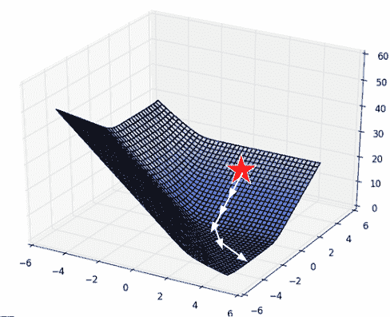

> 数学旁注：偏导数 - 对于具有多个变量的方程，我们通过分别针对一个变量进行微分来进行**偏导数**。偏导数用$\partial$表示。直观地，我们想要看到函数在只改变一个变量的情况下如何变化，同时保持其他变量不变。- 以$f(x, y) = 3x^2 + y$为例，- 对 x 进行偏导数并将 y 视为常数，得到$\frac{\partial f}{\partial x} = 6x$ - 对 y 进行偏导数并将 x 视为常数，得到$\frac{\partial f}{\partial y} = 1$

对于参数值的*向量*$\vec{\theta} = \begin{bmatrix} \theta_{0} \\ \theta_{1} \\ \end{bmatrix}$，我们对每个参数的损失进行*偏导数*：$\frac{\partial L}{\partial \theta_0}$和$\frac{\partial L}{\partial \theta_1}$。

**梯度向量**因此为$$\nabla_\theta L = \begin{bmatrix} \frac{\partial L}{\partial \theta_0} \\ \frac{\partial L}{\partial \theta_1} \\ \vdots \end{bmatrix}$$其中$\nabla_\theta L$始终指向表面的下坡方向。

我们可以使用这个来更新我们的具有多个参数的 1D 梯度规则的模型。

+   回想一下我们的 1D 更新规则：$$\theta^{(t+1)} = \theta^{(t)} - \alpha \frac{d}{d\theta}L(\theta^{(t)})$$

+   对于具有多个参数的模型，我们使用向量来工作：$$\begin{bmatrix} \theta_{0}^{(t+1)} \\ \theta_{1}^{(t+1)} \\ \vdots \end{bmatrix} = \begin{bmatrix} \theta_{0}^{(t)} \\ \theta_{1}^{(t)} \\ \vdots \end{bmatrix} - \alpha \begin{bmatrix} \frac{\partial L}{\partial \theta_{0}} \\ \frac{\partial L}{\partial \theta_{1}} \\ \vdots \\ \end{bmatrix}$$

+   更紧凑地写成，$$\vec{\theta}^{(t+1)} = \vec{\theta}^{(t)} - \alpha \nabla_{\vec{\theta}} L(\theta^{(t)}) $$

    +   $\theta$ 是我们模型权重的向量

    +   $L$ 是损失函数

    +   $\alpha$ 是学习率（我们的是恒定的，但其他技术使用随时间减小的 $\alpha$）

    +   $\vec{\theta}^{(t)}$ 是 $\theta$ 的当前值

    +   $\vec{\theta}^{(t+1)}$ 是 $\theta$ 的下一个值

    +   $\nabla_{\vec{\theta}} L(\theta^{(t)})$ 是在当前 $\vec{\theta}^{(t)}$ 处评估的损失函数的梯度

## 13.5 批量、小批量梯度下降和随机梯度下降

形式上，我们上面推导的算法称为**批量梯度下降**。对于算法的每次迭代，计算整个包含所有 $n$ 个数据点的批次的损失的导数。虽然这个更新规则在理论上效果很好，但在大多数情况下并不实用。对于大型数据集（可能有数十亿个数据点），在所有数据上找到梯度是非常耗费计算资源的；梯度下降会收敛缓慢，因为每次单独的更新都很慢。

**小批量梯度下降**试图解决这个问题。在小批量下降中，只使用*子集*数据来估计梯度。**批量大小**是每个子集中使用的数据点数。

每次完整“通过”数据称为**训练周期**。在小批量梯度下降的单个**训练周期**中，我们

+   计算第一个 x% 的数据的梯度。更新参数猜测。

+   计算下一个 x% 的数据的梯度。更新参数猜测。

+   （省略）

+   计算最后 x% 的数据的梯度。更新参数猜测。

每个数据点在单个训练周期中只出现一次。然后我们进行多个训练周期，直到满意为止。

在最极端的情况下，我们可能选择只有 1 个数据点的批量大小——也就是说，每次更新步骤中只使用一个数据点来估计损失的梯度。这被称为**随机梯度下降**。在随机梯度下降的单个**训练周期**中，我们

+   计算第一个数据点的梯度。更新参数猜测。

+   计算下一个数据点的梯度。更新参数猜测。

+   （省略）

+   计算最后一个数据点的梯度。更新参数猜测。

批量梯度下降是一种确定性技术——因为在每次更新迭代中都使用整个数据集，算法总是朝着损失曲面的最小值前进。相比之下，小批量和随机梯度下降都涉及一定的随机性。由于每次迭代更新参数 $\vec{\theta}$ 时只使用完整数据的子集，算法有可能不会在每次更新中朝着真正的损失最小值前进。从长远来看，这些随机技术仍然应该收敛到最优解。

下面的图表代表了从上方俯视的损失曲面。注意批量梯度下降直接朝向最优的 $\hat{\theta}$。相比之下，随机梯度下降在损失曲面上“跳跃”。这反映了每次更新步骤中抽样过程的随机性。

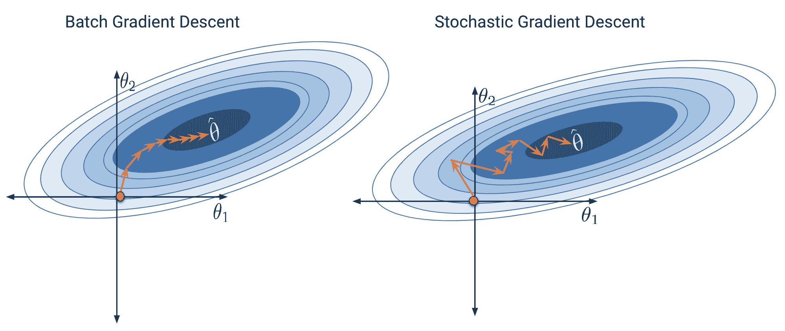 
