# 十四、Sklearn 和特征工程

> 原文：[Sklearn and Feature Engineering](https://ds100.org/course-notes/feature_engineering/feature_engineering.html)
> 
> 译者：[飞龙](https://github.com/wizardforcel)
> 
> 协议：[CC BY-NC-SA 4.0](https://creativecommons.org/licenses/by-nc-sa/4.0/)

*学习成果*

+   应用`sklearn`库进行模型创建和训练

+   认识到特征工程作为提高模型性能的工具的价值

+   实现多项式特征生成和独热编码

+   了解模型复杂性、模型方差和训练误差之间的相互作用

到目前为止，我们已经对建模过程非常熟悉。我们介绍了损失的概念，用它来拟合多种类型的模型，并且最近扩展了我们的分析到多元回归。在这个过程中，我们通过推导出最佳模型参数的数学细节，艰难地走过了一段路。现在是时候让我们的生活变得更轻松一些了-让我们在代码中实现建模过程！

在本讲座中，我们将探讨两种模型拟合技术：

1.  将我们推导出的回归公式翻译成`python`

1.  使用`python`的`sklearn`包

有了我们手头的新编程框架，我们还将通过引入更复杂的特征来增强模型性能，为我们的模型增加复杂性。

## 14.1 在代码中实现推导出的公式

在本讲座中，我们将引用`penguins`数据集。

```py
import pandas as pd
import seaborn as sns
import numpy as np

penguins = sns.load_dataset("penguins")
penguins = penguins[penguins["species"] == "Adelie"].dropna()
penguins.head()
```

| | species | island | bill_length_mm | bill_depth_mm | flipper_length_mm | body_mass_g | sex |
| --- | --- | --- | --- | --- | --- | --- | --- |
| 0 | Adelie | Torgersen | 39.1 | 18.7 | 181.0 | 3750.0 | Male |
| 1 | Adelie | Torgersen | 39.5 | 17.4 | 186.0 | 3800.0 | Female |
| 2 | Adelie | Torgersen | 40.3 | 18.0 | 195.0 | 3250.0 | Female |
| 4 | Adelie | Torgersen | 36.7 | 19.3 | 193.0 | 3450.0 | Female |
| 5 | Adelie | Torgersen | 39.3 | 20.6 | 190.0 | 3650.0 | Male |

我们的目标是预测给定企鹅的`flipper_length_mm`和`body_mass_g`时，`bill_depth_mm`的值。我们还将添加一个全为 1 的偏置列来表示我们模型的截距项。

```py
# Add a bias column of all ones to `penguins`
penguins["bias"] = np.ones(len(penguins), dtype=int) 

# Define the design matrix, X...
X = penguins[["bias", "flipper_length_mm", "body_mass_g"]].to_numpy()

# ...as well as the target variable, y
Y = penguins[["bill_depth_mm"]].to_numpy()
# Converting X and Y to NumPy arrays avoids misinterpretation of column labels
```

在普通最小二乘法的讲座中，我们使用矩阵表示法表示多元线性回归。

$$\hat{\mathbb{Y}} = \mathbb{X}\theta$$

我们使用了几何方法来推导出最佳模型参数的以下表达式：

$$\hat{\theta} = (\mathbb{X}^T \mathbb{X})^{-1}\mathbb{X}^T \mathbb{Y}$$

这是大量的矩阵操作。我们如何在`python`中实现它呢？

这里有三个操作我们需要执行：矩阵相乘、求转置和求逆。

+   要进行矩阵乘法，使用`@`运算符

+   要进行转置，调用`NumPy`数组或`DataFrame`的`.T`属性

+   要计算逆矩阵，使用`NumPy`的内置方法`np.linalg.inv`

将这一切放在一起，我们可以计算存储在数组`theta_hat`中的最佳模型参数的 OLS 估计值。

```py
theta_hat = np.linalg.inv(X.T @ X) @ X.T @ Y
theta_hat
```

```py
array([[1.10029953e+01],
       [9.82848689e-03],
       [1.47749591e-03]])
```

要使用我们优化的参数值进行预测，我们将设计矩阵与参数向量进行矩阵乘法：

$$\hat{\mathbb{Y}} = \mathbb{X}\theta$$

```py
Y_hat = X @ theta_hat
pd.DataFrame(Y_hat).head()
```

|  | 0 |
| --- | --- |
| 0 | 18.322561 |
| 1 | 18.445578 |
| 2 | 17.721412 |
| 3 | 17.997254 |
| 4 | 18.263268 |

## 14.2 `sklearn`

通过将我们推导出的公式转化为代码，我们已经节省了大量时间（并避免了繁琐的计算）。但是，我们仍然需要自己编写线性代数的过程。

为了让生活变得*更加轻松*，我们可以转向`sklearn`[`python`库](https://scikit-learn.org/stable/)。`sklearn`是一个强大的机器学习工具库，在研究和工业中被广泛使用。它为我们提供了各种内置的建模框架和方法，因此在我们进行 Data 100 的过程中，我们将不断返回`sklearn`技术。

无论实现的具体模型类型是什么，`sklearn`都遵循一套标准的创建模型步骤。

1.  创建一个模型对象。这将生成模型类的一个新实例。你可以把它看作是对模型的标准“模板”进行新的“复制”。在代码中，这看起来像：

    ```py
    my_model = ModelClass() 
    ```

1.  将模型拟合到`X`设计矩阵和`Y`目标向量。这将在不需要显式进行计算的情况下“在后台”计算出最佳的模型参数。然后，拟合的参数将存储在模型中以备将来进行预测使用：

    ```py
    my_model.fit(X, Y) 
    ```

1.  使用拟合的模型对`X`输入数据进行预测，使用`.predict`。

    ```py
    my_model.predict(X) 
    ```

要提取拟合的参数，我们可以使用：

```py
my_model.coef_

my_model.intercept_ 
```

让我们在多元回归任务中将其付诸实践。

**1\. 初始化模型类的一个实例**

`sklearn`存储了用于机器学习的有用模型的“模板”。我们通过制作一个这些模板的“副本”来开始建模过程以供我们自己使用。模型初始化看起来像`ModelClass()`，其中`ModelClass`是我们希望创建的模型类型。

现在，让我们使用`LinearRegression()`创建一个线性回归模型。

`my_model`现在是`LinearRegression`类的一个实例。你可以把它看作是线性回归模型的“想法”。我们还没有对它进行训练，所以它不知道任何模型参数，也不能用来进行预测。事实上，我们甚至还没有告诉它要用什么数据进行建模！它只是等待进一步的指示。

```py
import sklearn.linear_model as lm

my_model = lm.LinearRegression()
```

**2\. 使用`.fit`训练模型**

在模型可以进行预测之前，我们需要将其拟合到我们的训练数据中。当我们拟合模型时，`sklearn`将在后台运行梯度下降来确定最佳的模型参数。然后它会将这些模型参数保存到我们的模型实例中以备将来使用。

所有`sklearn`模型类都包括一个`.fit`方法，用于拟合模型。它接受两个输入：设计矩阵`X`和目标变量`Y`。

让我们从只有一个特征的模型开始：脚蹼长度。我们通过从`DataFrame`中提取`"flipper_length_mm"`列来创建一个设计矩阵`X`。

```py
# .fit expects a 2D data design matrix, so we use double brackets to extract a DataFrame
X = penguins[["flipper_length_mm"]]
Y = penguins["bill_depth_mm"]

my_model.fit(X, Y)
```

```py
LinearRegression()
```

**在 Jupyter 环境中，请重新运行此单元格以显示 HTML 表示或信任笔记本。

在 GitHub 上，HTML 表示无法呈现，请尝试使用 nbviewer.org 加载此页面。**

```py
LinearRegression()
```

请注意，我们使用**双括号**来提取这一列。为什么使用双括号而不是单括号？`.fit`方法默认期望接收**二维**数据 - 一种包含行和列的数据。写`penguins["flipper_length_mm"]`会返回一个 1D`Series`，导致`sklearn`出错。我们通过写`penguins[["flipper_length_mm"]]`来产生一个 2D`DataFrame`来避免这种情况。

我们的模型只用了三行代码就运行了梯度下降来确定最佳的模型参数！我们的单特征模型采用以下形式：

$$\text{bill depth} = \theta_0 + \theta_1 \text{flipper length}$$

请注意，`LinearRegression`将自动包括一个截距项。

拟合的模型参数被存储为模型实例的属性。`my_model.intercept_`将返回$\hat{\theta}_0$的值作为标量。`my_model.coef_`将以数组的形式返回所有值$\hat{\theta}_1, \hat{\theta}_1, ...$。因为我们的模型只包含一个特征，所以下面的单元格中只会看到$\hat{\theta}_1$的值。

```py
# The intercept term, theta_0
my_model.intercept_
```

```py
7.297305899612306
```

```py
# All parameters theta_1, ..., theta_p
my_model.coef_
```

```py
array([0.05812622])
```

**3\. 使用拟合的模型进行预测**

现在模型已经训练好了，我们可以用它进行预测！为此，我们使用`.predict`方法。`.predict`接受一个参数：应该用来生成预测的设计矩阵。为了了解模型在训练集上的表现，我们会传入训练数据。或者，为了对未见过的数据进行预测，我们会传入一个未用于训练模型的新数据集。

在下面，我们调用`.predict`来在原始训练数据上生成模型预测。与之前一样，我们使用双括号来确保我们提取的是二维数据。

```py
Y_hat_one_feature = my_model.predict(penguins[["flipper_length_mm"]])

print(f"The RMSE of the model is {np.sqrt(np.mean((Y-Y_hat_one_feature)**2))}")
```

```py
The RMSE of the model is 1.1549363099239012
```

如果我们想要一个具有两个特征的模型呢？

$$\text{bill depth} = \theta_0 + \theta_1 \text{flipper length} + \theta_2 \text{body mass}$$

我们通过初始化一个新的模型对象，然后像以前一样调用`.fit`和`.predict`来重复这个三步过程。

```py
# Step 1: initialize LinearRegression model
two_feature_model = lm.LinearRegression()

# Step 2: fit the model
X_two_features = penguins[["flipper_length_mm", "body_mass_g"]]
Y = penguins["bill_depth_mm"]

two_feature_model.fit(X_two_features, Y)

# Step 3: make predictions
Y_hat_two_features = two_feature_model.predict(X_two_features)

print(f"The RMSE of the model is {np.sqrt(np.mean((Y-Y_hat_two_features)**2))}")
```

```py
The RMSE of the model is 0.9881331104079044
```

我们还可以看到，我们使用`sklearn`得到的预测与之前应用普通最小二乘公式时得到的预测相同！

代码

```py
pd.DataFrame({"Y_hat from OLS":np.squeeze(Y_hat), "Y_hat from sklearn":Y_hat_two_features}).head()
```

|  | Y_hat from OLS | Y_hat from sklearn |
| --- | --- | --- |
| 0 | 18.322561 | 18.322561 |
| 1 | 18.445578 | 18.445578 |
| 2 | 17.721412 | 17.721412 |
| 3 | 17.997254 | 17.997254 |
| 4 | 18.263268 | 18.263268 |

## 14.3 特征工程

在课程的这一阶段，我们已经掌握了一些强大的技术来构建和优化模型。我们已经探讨了如何开发多变量模型，以及如何转换变量以帮助**线性化**数据集，并拟合这些模型以最大化它们的性能。

所有这些都是在一个主要的警告下完成的：到目前为止，我们所使用的回归模型都是**输入变量的线性**。我们假设我们的预测应该是一些线性变量的组合。虽然在某些情况下这很有效，但现实世界并不总是那么简单。我们将学习一种重要的方法来解决这个问题 - 特征工程 - 并考虑在这样做时可能出现的一些新问题。

特征工程是将原始特征转换为*更具信息性的特征*的过程，这些特征可以用于建模或 EDA 任务，并提高模型性能。

特征工程允许您：

+   捕获领域知识

+   使用线性模型表达非线性关系

+   在模型中使用非数值特征

## 14.4 特征函数

**特征函数**描述了我们对数据集中的原始特征应用的转换，以创建一个转换特征的设计矩阵。我们通常将特征函数表示为$\Phi$（想想：“phi”-ture 函数）。当我们将特征函数应用于我们的原始数据集$\mathbb{X}$时，结果$\Phi(\mathbb{X})$是一个经过转换的设计矩阵，可以用于建模。

例如，我们可以设计一个特征函数，计算现有特征的平方并将其添加到设计矩阵中。在这种情况下，我们现有的矩阵$[x]$被转换为$[x, x^2]$。其*维度*从 1 增加到 2。通常，*特征化*数据集的维度会增加，如此处所示。

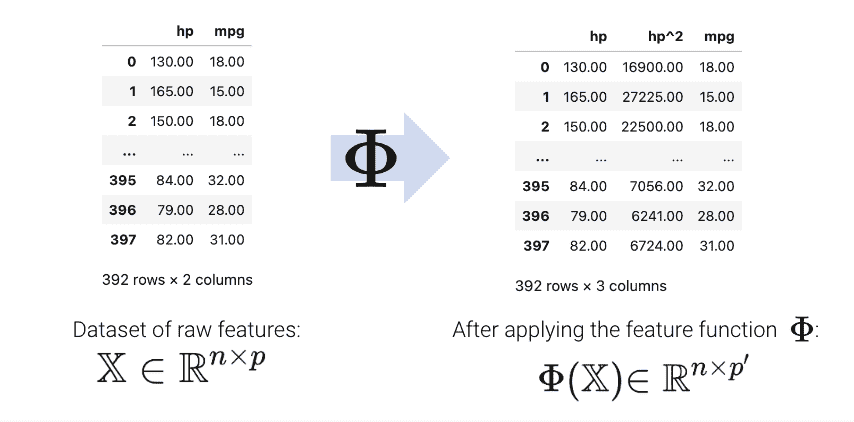

特征函数引入的新特征然后可以用于建模。通常，我们使用符号$\phi_i$表示特征工程后的转换特征。

$$\hat{y} = \theta_1 x + \theta_2 x^2$$

$$\hat{y}= \theta_1 \phi_1 + \theta_2 \phi_2$$

在矩阵表示中，符号$\Phi$有时用于表示特征工程后的设计矩阵。请注意，在下面的用法中，$\Phi$现在是一个经过特征工程处理的矩阵，而不是一个函数。

$$\hat{\mathbb{Y}} = \Phi \theta$$

更正式地，我们将特征函数描述为将原始的$\mathbb{R}^{n \times p}$数据集$\mathbb{X}$转换为一个经过特征处理的$\mathbb{R}^{n \times p'}$数据集$\mathbb{\Phi}$的过程，其中$p'$通常大于$p$。

$$\mathbb{X} \in \mathbb{R}^{n \times p} \longrightarrow \Phi \in \mathbb{R}^{n \times p'}$$

## 14.5 独热编码

特征工程为设计更好的性能模型打开了一整套新的可能性。正如您将在实验室和家庭作业中看到的那样，特征工程是整个建模过程中最重要的部分之一。

特征工程的一个特别强大的用途是允许我们对*非数值*特征执行回归。**独热编码**是一种特征工程技术，它从分类数据生成数值特征，使我们能够使用通常的方法在数据上拟合回归模型。

为了说明这是如何工作的，我们将回顾以前讲座中的“小费”数据集。考虑数据集的`day`列：

代码

```py
import numpy as np
tips = sns.load_dataset("tips")
tips.head()
```

|  | total_bill | tip | sex | smoker | day | time | size |
| --- | --- | --- | --- | --- | --- | --- | --- |
| 0 | 16.99 | 1.01 | Female | No | Sun | Dinner | 2 |
| 1 | 10.34 | 1.66 | Male | No | Sun | Dinner | 3 |
| 2 | 21.01 | 3.50 | Male | No | Sun | Dinner | 3 |
| 3 | 23.68 | 3.31 | Male | No | Sun | Dinner | 2 |
| 4 | 24.59 | 3.61 | Female | No | Sun | Dinner | 4 |

乍一看，似乎不可能对这些数据拟合回归模型——我们无法直接对“太阳”进行任何数学运算。

为了解决这个问题，我们创建一个新表，其中包含原始`day`列中每个唯一值的特征。然后我们迭代`day`列。对于`day`中的每个条目，我们将新表中对应的特征填充为 1。所有其他特征都设置为 0。

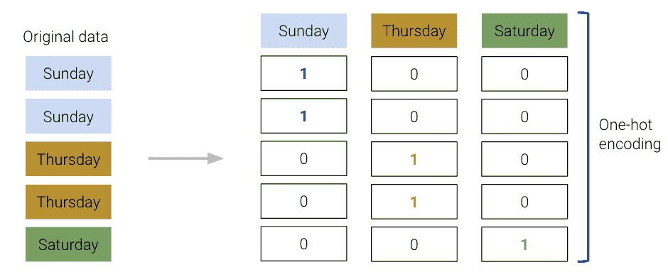

`sklearn`的`OneHotEncoder`类（[文档](https://scikit-learn.org/stable/modules/generated/sklearn.preprocessing.OneHotEncoder.html#sklearn.preprocessing.OneHotEncoder.get_feature_names_out)）提供了一种快速执行这种独热编码的方法。您将在实验室中详细探讨它的用法。现在，要认识到我们遵循的工作流程与我们使用`LinearRegression`类时非常相似：我们初始化一个`OneHotEncoder`对象，将其拟合到我们的数据，然后使用`.transform`来应用拟合的编码器。

```py
from sklearn.preprocessing import OneHotEncoder

# Initialize a OneHotEncoder object
ohe = OneHotEncoder()

# Fit the encoder
ohe.fit(tips[["day"]])

# Use the encoder to transform the raw "day" feature
encoded_day = ohe.transform(tips[["day"]]).toarray()
encoded_day_df = pd.DataFrame(encoded_day, columns=ohe.get_feature_names_out())

encoded_day_df.head()
```

|  | day_Fri | day_Sat | day_Sun | day_Thur |
| --- | --- | --- | --- | --- |
| 0 | 0.0 | 0.0 | 1.0 | 0.0 |
| 1 | 0.0 | 0.0 | 1.0 | 0.0 |
| 2 | 0.0 | 0.0 | 1.0 | 0.0 |
| 3 | 0.0 | 0.0 | 1.0 | 0.0 |
| 4 | 0.0 | 0.0 | 1.0 | 0.0 |

然后，独热编码的特征可以用于设计矩阵来训练模型：

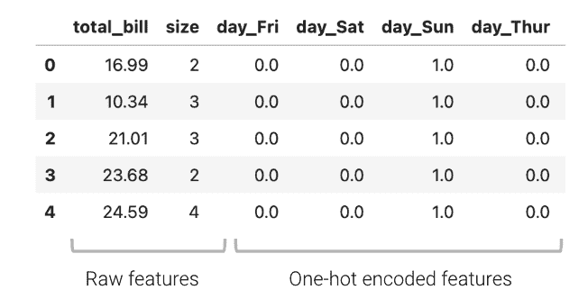

$$\hat{y} = \theta_1 (\text{total}\textunderscore\text{bill}) + \theta_2 (\text{size}) + \theta_3 (\text{day}\textunderscore\text{Fri}) + \theta_4 (\text{day}\textunderscore\text{Sat}) + \theta_5 (\text{day}\textunderscore\text{Sun}) + \theta_6 (\text{day}\textunderscore\text{Thur})$$

或者简写为：

$$\hat{y} = \theta_1\phi_1 + \theta_2\phi_2 + \theta_3\phi_3 + \theta_4\phi_4 + \theta_5\phi_5 + \theta_6\phi_6$$

现在，`day`特征（或者说，代表天的四个新布尔特征）可以用来拟合模型。

使用`sklearn`来拟合新模型，我们可以确定模型系数，从而了解每个特征对预测小费的影响。

```py
from sklearn.linear_model import LinearRegression
data_w_ohe = tips[["total_bill", "size", "day"]].join(encoded_day_df).drop(columns = "day")
ohe_model = lm.LinearRegression(fit_intercept=False) #Tell sklearn to not add an additional bias column. Why?
ohe_model.fit(data_w_ohe, tips["tip"])

pd.DataFrame({"Feature":data_w_ohe.columns, "Model Coefficient":ohe_model.coef_})
```

|  | Feature | Model Coefficient |
| --- | --- | --- |
| 0 | total_bill | 0.092994 |
| 1 | size | 0.187132 |
| 2 | day_Fri | 0.745787 |
| 3 | day_Sat | 0.621129 |
| 4 | day_Sun | 0.732289 |
| 5 | day_Thur | 0.668294 |

例如，当查看`day_Fri`的系数时，我们可以了解星期五的事实对预测小费的影响有多大。

在独热编码时，要记住任何一组独热编码的列总是会加和为全为 1 的一列，表示偏置列。更正式地说，偏置列是 OHE 列的线性组合。

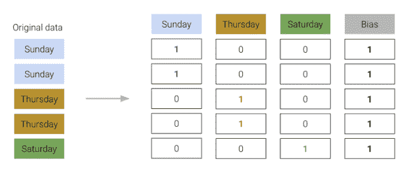

我们必须小心不要在我们的设计矩阵中包含这个偏置列。否则，模型中将存在线性依赖，这意味着$\mathbb{X}^T\mathbb{X}$将不再可逆，我们的 OLS 估计$\hat{\theta} = (\mathbb{X}^T\mathbb{X})^{-1}\mathbb{X}^T\mathbb{Y}$将失败。

为了解决这个问题，我们简单地省略了一个独热编码的列*或*不包括截距项。

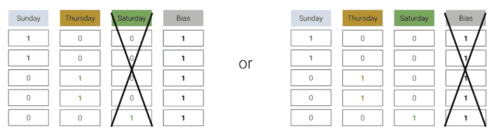

任何一种方法都可以——我们仍然保留了与省略列相同的信息，即省略列是剩余列的线性组合。

## 14.6 多项式特征

我们已经遇到了几种情况，其中具有线性特征的模型在显示明显非线性曲率的数据集上表现不佳。

举个例子，考虑包含有关汽车信息的`vehicles`数据集。假设我们想要使用汽车的`hp`（马力）来预测其`"mpg"`（每加仑英里数的汽油里程）。如果我们可视化这两个变量之间的关系，我们会看到一个非线性的曲率。将线性模型拟合到这些变量会导致高（差）的 RMSE 值。

$$\hat{y} = \theta_0 + \theta_1 (\text{hp})$$

代码

```py
pd.options.mode.chained_assignment = None 
vehicles = sns.load_dataset("mpg").dropna().rename(columns = {"horsepower": "hp"}).sort_values("hp")

X = vehicles[["hp"]]
Y = vehicles["mpg"]

hp_model = lm.LinearRegression()
hp_model.fit(X, Y)
hp_model_predictions = hp_model.predict(X)

import matplotlib.pyplot as plt

sns.scatterplot(data=vehicles, x="hp", y="mpg")
plt.plot(vehicles["hp"], hp_model_predictions, c="tab:red");

print(f"MSE of model with (hp) feature: {np.mean((Y-hp_model_predictions)**2)}")
```

```py
MSE of model with (hp) feature: 23.943662938603108
```

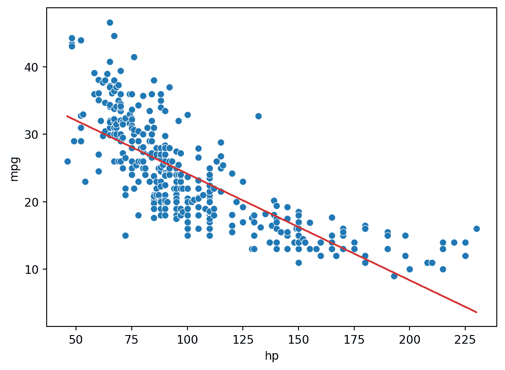

为了捕捉数据集中的非线性，将**非线性**特征纳入其中是有意义的。让我们在回归模型中引入一个**多项式**项，$\text{hp}^2$。模型现在的形式是：

$$\hat{y} = \theta_0 + \theta_1 (\text{hp}) + \theta_2 (\text{hp}^2)$$

$$\hat{y} = \theta_0 + \theta_1 \phi_1 + \theta_2 \phi_2$$

我们如何拟合具有非线性特征的模型？我们可以使用与以前完全相同的技术：普通最小二乘法、梯度下降或`sklearn`。这是因为我们的新模型仍然是一个**线性模型**。尽管它包含非线性*特征*，但它在模型*参数*方面是线性的。我们以前所有拟合模型的工作都是在假设我们正在处理线性模型的情况下进行的。因为我们的新模型仍然是线性的，我们可以应用我们现有的方法来确定最佳参数。

```py
# Add a hp^2 feature to the design matrix
X = vehicles[["hp"]]
X["hp^2"] = vehicles["hp"]**2

# Use sklearn to fit the model
hp2_model = lm.LinearRegression()
hp2_model.fit(X, Y)
hp2_model_predictions = hp2_model.predict(X)

sns.scatterplot(data=vehicles, x="hp", y="mpg")
plt.plot(vehicles["hp"], hp2_model_predictions, c="tab:red");

print(f"MSE of model with (hp^2) feature: {np.mean((Y-hp2_model_predictions)**2)}")
```

```py
MSE of model with (hp^2) feature: 18.984768907617223
```

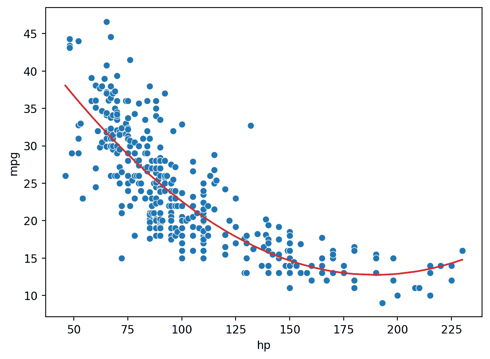

看起来好多了！通过引入一个平方特征，我们能够捕捉数据集的曲率。我们的模型现在是一个以我们的数据为中心的抛物线。请注意，相对于具有线性特征的原始模型，我们的新模型的误差已经减少了。

## 14.7 复杂性和过拟合

我们现在已经看到，特征工程使我们能够构建各种特征来提高模型的性能。特别是，我们看到设计更复杂的特征（在先前的`vehicles`数据中对`hp`进行平方）大大提高了模型捕捉非线性关系的能力。为了充分利用这一点，我们可能倾向于设计越来越复杂的特征。考虑以下三个不同阶数的模型（每个模型的最大指数幂）：

+   二次模型：$\hat{\text{mpg}} = \theta_0 + \theta_1 (\text{hp}) + \theta_2 (\text{hp}^2)$

+   三次模型：$\hat{\text{mpg}} = \theta_0 + \theta_1 (\text{hp}) + \theta_2 (\text{hp}^2) + \theta_3 (\text{hp}^3)$

+   四次模型：$\hat{\text{mpg}} = \theta_0 + \theta_1 (\text{hp}) + \theta_2 (\text{hp}^2) + \theta_3 (\text{hp}^3) + \theta_4 (\text{hp}^4)$

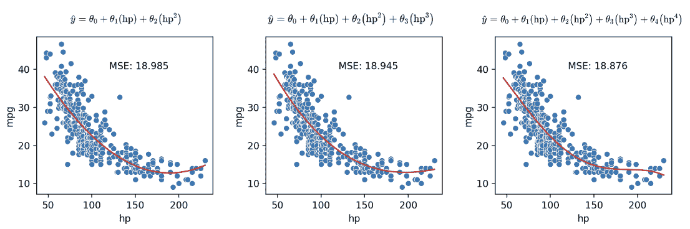

正如我们在上面的图中所看到的，随着每个额外的多项式项，均方误差继续减小。为了进一步可视化，让我们将模型从复杂度 0 增加到 6 进行绘制：

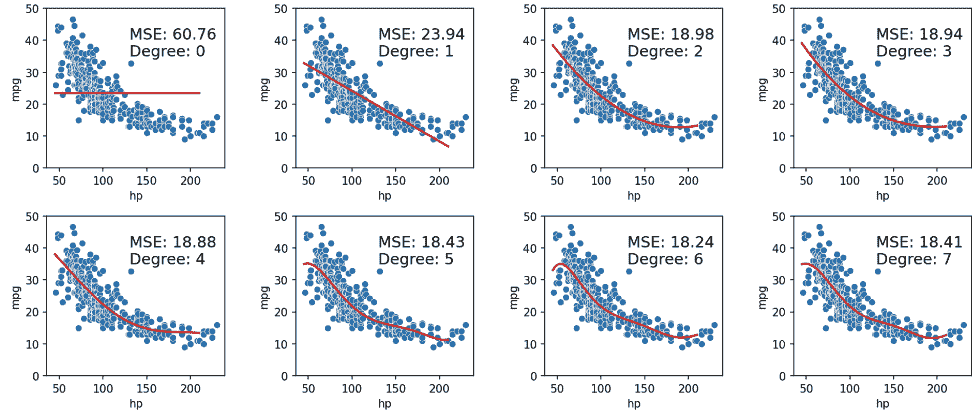

当我们使用我们的模型对用于拟合模型的相同数据进行预测时，我们发现随着每个额外的多项式项（随着我们的模型变得更复杂），MSE 会减少。**训练误差**是模型在生成来自用于训练目的的相同数据的预测时的误差。我们可以得出结论，随着模型复杂度的增加，训练误差会下降。

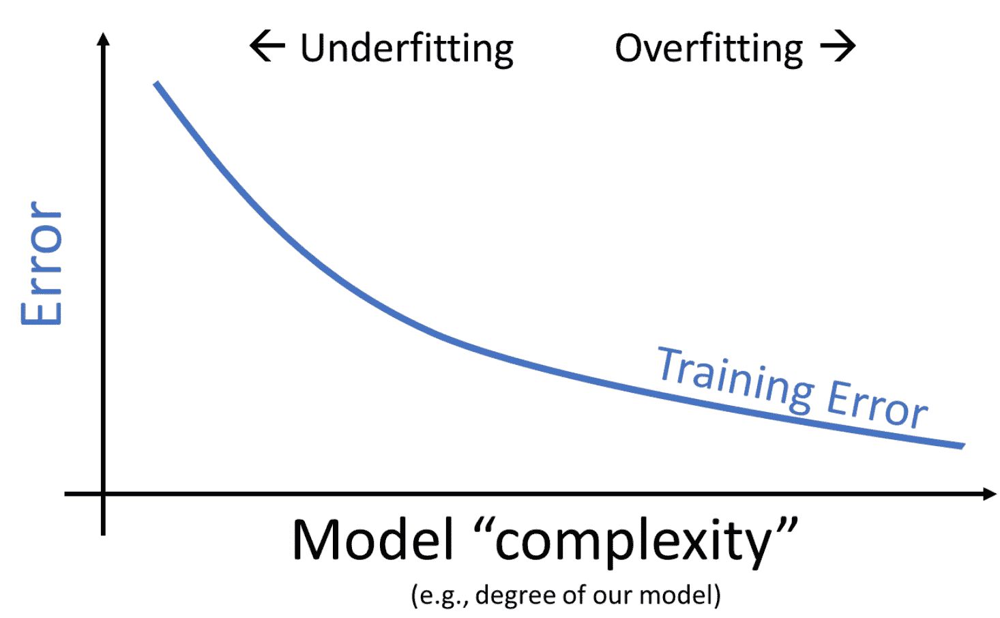

这看起来像是个好消息 - 在处理**训练数据**时，我们可以通过设计越来越复杂的模型来提高模型性能。

> **数学事实**：给定$N$个重叠的数据点，我们总是可以找到一个通过所有这些点的$N-1$次多项式。

> 例如：总是存在一个 4 次多项式曲线，可以完美地模拟一个包含 5 个数据点的数据集！[train_error](img/06b47c32bc7ba078801b2b21a5dc0ee7.png)

然而，高模型复杂性也带来了自己的一系列问题。在构建上述`vehicles`模型时，我们在*整个*数据集上训练了模型，然后评估了它们在同一数据集上的性能。实际上，我们很可能会在*样本*中训练模型，然后使用它对在训练期间未遇到的数据进行预测。

让我们通过一个更现实的例子来看看。假设我们有一个仅包含 6 个数据点的训练数据集，并希望训练一个模型，然后对*不同*的数据点进行预测。我们可能会倾向于制作一个非常复杂的模型（例如，5 次方），特别是考虑到它在左侧清晰地对训练数据进行了完美的预测。然而，如右侧图表所示，这个模型在整个数据集上的表现会非常糟糕！

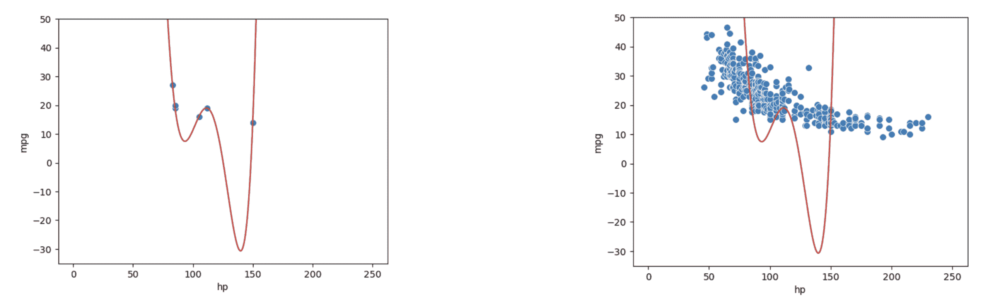

上述现象被称为**过拟合**。该模型实际上只是记住了它在拟合时遇到的训练数据，导致它无法很好地对在训练期间未遇到的数据进行**泛化**。

此外，由于复杂模型对用于训练它们的特定数据集敏感，它们具有高**方差**。具有高方差的模型在训练不同数据集时往往会产生更大的变化。回到上面的例子，我们可以看到我们的 5 次方模型在拟合来自`vehicles`的不同 6 点样本时变化不稳定。

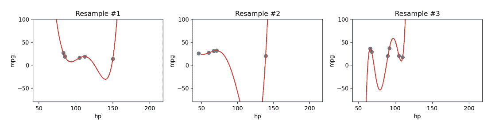

现在我们面临一个两难选择：我们知道我们可以通过增加模型复杂性来**减少训练误差**，但是过于复杂的模型开始过拟合，并且由于**高方差**无法重新应用于新的数据集。

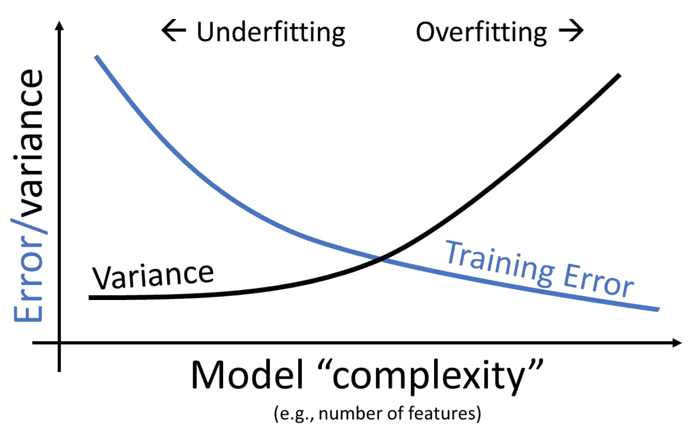

我们可以看到，模型复杂性带来了明显的权衡。随着模型复杂性的增加，模型在训练数据上的误差减少。与此同时，模型的方差往往会增加。

这里的要点是：我们需要在模型的复杂性上取得平衡；我们希望模型能够泛化到“未见过”的数据。一个太简单的模型将无法捕捉我们感兴趣的变量之间的关键关系；一个太复杂的模型则有过拟合的风险。

这引出了一个问题：我们如何控制模型的复杂性？请关注我们的第 16 讲，交叉验证和正则化！
