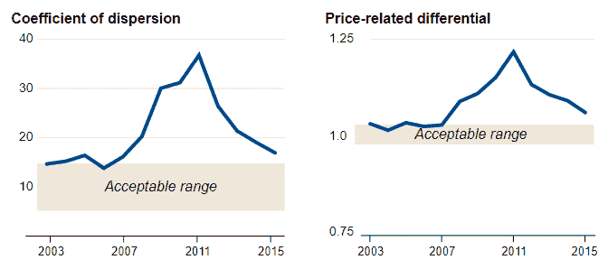
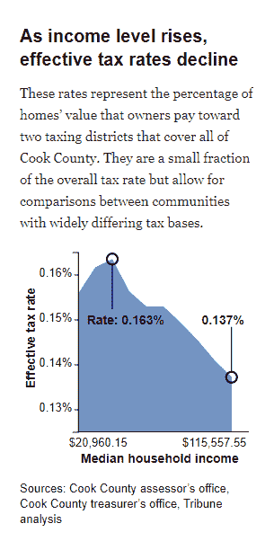
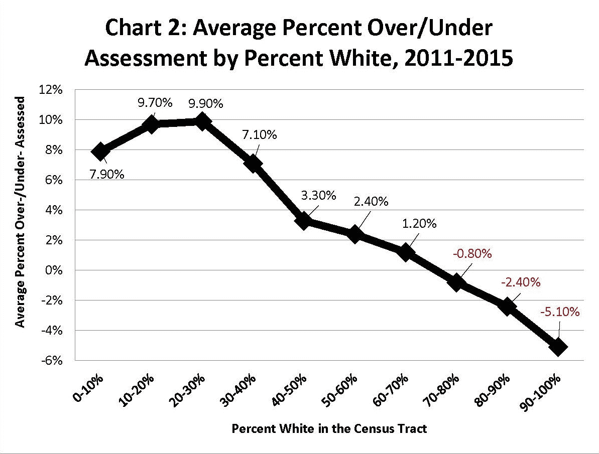
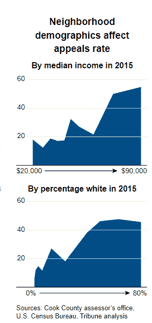
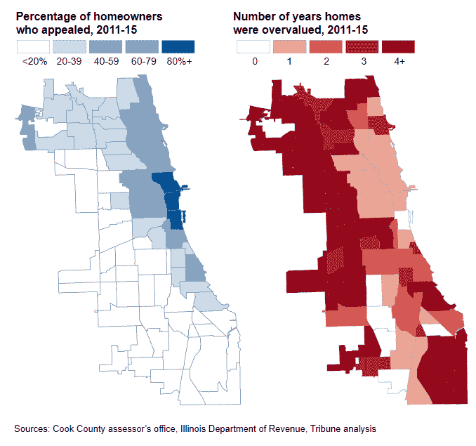
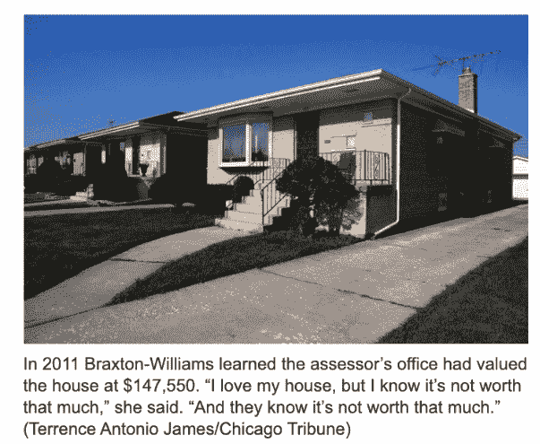
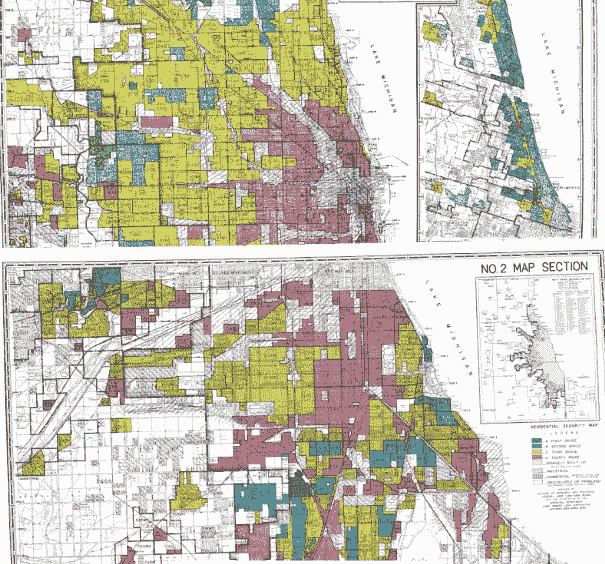
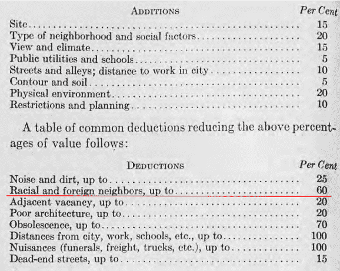
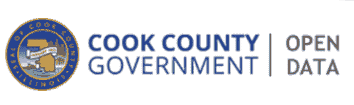
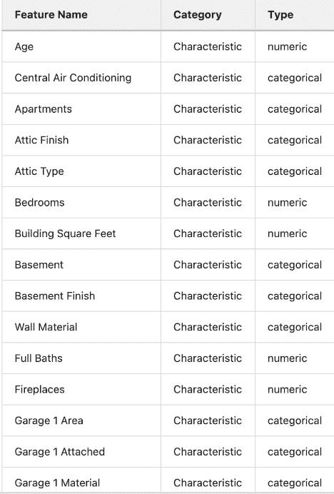

# 十五、人类背景和伦理的案例研究

> 原文：[Case Study in Human Contexts and Ethics](https://ds100.org/course-notes/case_study_HCE/case_study_HCE.html)
> 
> 译者：[飞龙](https://github.com/wizardforcel)
> 
> 协议：[CC BY-NC-SA 4.0](https://creativecommons.org/licenses/by-nc-sa/4.0/)

*学习成果*

+   了解数据科学家面临的道德困境。

+   了解如何使用有关数据的上下文知识批判模型。

> **免责声明**：以下章节讨论了结构性种族主义的问题。本章中的一些内容可能比较敏感，可能或可能不是收集材料的学生的意见、想法和信念。Data 100 课程工作人员尽最大努力只呈现与教授课程相关的信息。

**注意：**由于讲座中提出的一些论点的微妙性质，强烈建议您观看讲座录像，以便充分参与和理解材料。课程笔记将具有相同的更广泛结构，但绝不是全面的。

让我们沉浸在一个名为库克县评估员办公室（CCAO）的组织的数据科学家的现实故事中。他们的工作是**估算房屋的价值**以**分配财产税**。这是因为该地区的税收负担是由房屋的估算**价值**决定的，这与其价格不同。由于价值随时间变化，且没有明显的价值指标，他们创建了一个**模型**来估算房屋的价值。在本章中，我们将深入探讨偏见模型存在的问题，对人类生活的后果，以及我们如何从这个例子中学习以做得更好。

## 15.1 问题

《芝加哥论坛报》的一份[报告](https://apps.chicagotribune.com/news/watchdog/cook-county-property-tax-divide/assessments.html)揭露了一个重大丑闻：该团队表明该模型延续了一个高度累进的税收体系，不成比例地加重了库克县的非裔美国人和拉丁裔房主的负担。他们是如何知道的呢？

在住房评估领域，评估员使用的标准指标是：[离散系数](https://www.realestateagent.com/real-estate-glossary/real-estate/coefficient-of-dispersion.html)和[价格相关差异](https://leg.wa.gov/House/Committees/FIN/Documents/2009/RatioText.pdf)。这些指标已经在该领域的专家进行了严格测试，超出了我们课程的范围。对库克县价格计算这些指标显示，CCAO 制定的价格不在可接受范围内（见上图）。这本身并不是故事的结束，但是一个很好的指示**有些不对劲**。

这促使他们调查模型本身是否产生了公平的税率。显然，当考虑到房主的收入时，他们发现该模型实际上产生了**累进**的税率（见上图）。如果百分比税率对收入较低的个人更高，则税率是**累进**的。如果百分比税率对收入较高的个人更高，则税率是**累进**的。

进一步的调查表明，这个系统不仅对收入的轴线上的人不公平，也对种族的轴线上的人不公平（见上图）。一栋房产被低估或高估的可能性高度依赖于业主的种族，这让许多房主感到不安。

### 15.1.1 重点：上诉

这到底是什么导致了这种情况？一个全面的答案超出了模型。归根结底，这些都是有很多活动部分的真实系统。其中之一是**上诉系统**。房主会收到 CCAO 评估的房屋价值的邮件，房主可以选择向一组选举官员上诉，试图改变他们的房屋价值清单，从而改变他们被征税的金额。从理论上讲，这听起来是一个非常公平的系统：有人监督房屋的最终定价，而不仅仅是一个算法。然而，它最终加剧了问题。

> “上诉是一件好事，”估价和上诉副主管托马斯·雅科内蒂在一次采访中说。“这里的目标是公平。我们制定了这些数字。我们可以改变它们。”

在这里，我们可以从[批判种族理论](https://www.britannica.com/topic/critical-race-theory)中汲取教训。表面上，每个人都有法定权利尝试上诉是不可否认的。然而，并非每个人都有平等的能力这样做。那些有钱雇佣税务律师为他们上诉的人尝试和成功的机会大大提高（见上图）。这种模式是潜在腐败的深层制度模式的一部分。

上诉的房主相对于没有上诉的房主通常被低估（见上图）。收入较高的人支付较少的房产税，税务律师能够因为他们在上诉中的角色而发展业务，政客通常与上述税务律师和富裕的房主有社会联系。所有这些利益相关者都有理由宣传这种模式作为公平制度的一个组成部分。在这里提出问题是有价值的：一个表面上看起来公平的系统在仔细观察后实际上可能是不公平的。

### 15.1.2 人类影响

住房模式的影响超出了房屋所有权和税收的范围。歧视性做法在美国有着悠久的历史，而这种模式则服务于延续这一事实。直到今天，芝加哥是美国最种族隔离的城市之一（[来源](https://fivethirtyeight.com/features/the-most-diverse-cities-are-often-the-most-segregated/)）。这些因素对我们作为数据科学家来说至关重要。

### 15.1.3 聚焦：房地产和种族的交汇

住房一直是美国历史上种族不平等的持续来源，也是其他因素之一。它是不平等产生和再生产的主要领域之一。起初，[吉姆·克劳](https://www.history.com/topics/early-20th-century-us/jim-crow-laws)法明确禁止有色人种进入学校、公共设施等。

今天，尽管民权方面取得了进展，但美国许多地方的法律精神仍然存在。房地产行业在 20 世纪 20 年代和 30 年代被“专业化”，渴望成为一门由严格方法和原则指导的科学，如下所述：

+   红线政策：使在特定被编码为“高风险”（红色）的社区购买联邦支持抵押贷款变得困难或不可能。

    +   根据这些制造商的说法，是什么使它们“高风险”。

    +   种族隔离不仅是联邦政策的结果，而且是房地产专业人士发展起来的。

+   方法集中在创建客观的评级系统（信息技术）来评估房产价值，这些系统将**种族**编码为估值因素（见下图），

    +   这反过来影响了联邦政策和实践。

来源：Colin Koopman，《我们如何成为我们的数据》（2019 年）第 137 页

## 15.2 回应：库克县开放数据倡议

回应始于政治。新的评估员弗里茨·凯吉当选并制定了两个目标的新任务：

1.  财产税的分配公平，意味着同等价值的财产在评估过程中受到同等对待。

1.  创建一个新的数据科学办公室。

### 15.2.1 问题/问题的形成

*驱动问题*

+   我们想知道什么？

+   我们试图解决什么问题？

+   我们想要测试什么假设？

+   我们的成功指标是什么？

数据科学办公室通过重新定义他们的目标来开始。

1.  准确、一致和公正地评估房屋价值

    +   遵循国际标准（离散系数）

    +   尽可能准确地预测所有房屋的价值

1.  创建一个强大的管道，能够准确评估规模化的财产价值，并且公平

    +   打破腐败的循环（评审委员会的上诉程序）

    +   消除累退性

    +   在所有利益相关者中建立对系统的信任

**定义**：公平和透明度

库克县评估员办公室给出的定义如下：

+   公平：我们的管道能够准确评估财产价值，考虑到地理、信息等方面的差异。

+   透明度：数据科学部门分享和解释管道结果和决策的能力，向内部和外部利益相关者

请注意办公室如何以准确性来定义“公平”。因此，问题——使系统更公平——已经以数据科学家易于处理的术语来表述：使评估更准确。

这里的想法是，如果模型更准确，它也会（或许必然会）变得更公平，这是一个很大的假设。从某种意义上说，存在两个不同的问题——做出准确的评估，建立一个公平的系统。

目标的定义方式导致我们提出了一个问题：准确评估财产价值实际上意味着什么，以及“规模”在其中扮演了什么角色？

1.  房屋价值的评估是什么？

1.  一项评估比另一项更准确的原因是什么？

1.  一批评估比另一批更准确的原因是什么？

以上每个问题都引发了一系列更多的问题。仅考虑第一个问题，一个答案可能是评估是对房屋价值的估计。这带来了更多的疑问：房屋的价值是多少？是什么决定了它？我们怎么知道？在这个课程中，我们认为它是房屋的市场价值。

### 15.2.2 数据获取和清理

*驱动问题* 

+   我们有什么数据，我们需要什么数据？

+   我们将如何取样更多的数据？

+   我们的数据是否代表我们想研究的人口？

数据科学家还对他们最初的销售数据进行了批判性审查：

并提出了以下问题：

1.  这些数据是如何收集的？

1.  这些数据是何时收集的？

1.  谁收集了这些数据？

1.  数据收集的目的是什么？

1.  特定类别是如何创建的，为什么创建的？

例如，属性在数据中出现的可能性不同，芝加哥洪水平原地理区域的住房数据比其他地区少。

这些特征甚至可以以不同的速度报告。改善房屋，往往会增加房产价值，但业主们不太可能报告这一点。

此外，他们发现低收入社区的缺失数据更多。

### 15.2.3 探索性数据分析

*驱动问题*

+   我们的数据是如何组织的，它包含了什么？

+   我们已经有相关的数据了吗？

+   数据中存在什么偏见、异常或其他问题？

+   我们如何转换数据以实现有效的分析？

在建模步骤之前，他们调查了许多关键问题：

1.  哪些属性对销售价格的预测最有帮助？

1.  数据是否均匀分布？

1.  所有社区的数据都是最新的吗？所有社区的粒度都一样吗？

1.  一些社区的数据是否缺失或过时？

首先，他们发现某些特征的影响，比如卧室数量，在确定某些社区内房屋价值方面比其他社区更有影响力。这让他们知道应该根据社区使用不同的模型。

他们还注意到低收入社区的数据不足。这让他们知道他们需要开发新的数据收集实践，包括寻找新的数据来源。

### 15.2.4 预测和推断

*驱动问题* 

+   数据对世界有何说法？

+   它是否回答了我们的问题或准确解决了问题？

+   我们的结论有多可靠，我们能相信这些预测吗？

CCA0 不是使用单一模型来预测未售出房产的销售价格（“公平市场价”），而是使用机器学习模型来发现使用已知销售价格和**相似和附近房产**特征的模式。它为每个乡镇使用不同的模型权重。

与传统的大规模评估相比，CCA0 的新方法更加细致，并对社区变化更加敏感。

在这里，我们可能会问为什么任何特定的个人应该相信该模型对他们的房产是准确的？

这让我们认识到，CCA0 依赖于其“透明度”的表现（将数据、模型、管道放到 GitLab 上）来促进公众的信任，这将有助于将“准确评估”的产出与“公平”相提并论。

在评估我们的模型时，准确性、公平性和我们倾向使用的指标之间的关系还有很多需要讨论的地方。鉴于论点的微妙性质，建议您查看相应的讲座，因为课程笔记对于讲座的这一部分并不那么全面。

### 15.2.5 报告决策和结论

*驱动问题* 

+   系统对每个目标有多成功？

    +   模型的准确性/一致性

    +   消除回归性和建立信任的公平和透明度

+   你怎么知道的？

模型并不是终点。新办公室仍然向房主发送他们的房屋评估报告，但现在他们会考虑从房主那里得到的数据。办公室本身正在撰写更详细的报告，以使信息民主化。市政厅和其他面向公众的宣传活动有助于让整个社区参与到住房评估的过程中，而不是仅限于少数人参与。****

## 15.3 主要收获

1.  准确性是公平系统的必要条件，但不是充分条件。

1.  公平和透明度是依赖于环境和社会技术概念的。

1.  学会与环境一起工作，并考虑你的数据分析将如何重塑它们。

1.  牢记数据分析的力量和局限性。

## 15.4 数据科学实践的教训

1.  问题/问题的制定

    +   谁负责框定问题？

    +   谁是利益相关者？他们如何参与问题的框架？

    +   你能提供什么？你的立场如何影响你对问题的理解？

    +   你正在利用哪些叙事？

1.  数据获取和清理

    +   数据从哪里来？

    +   谁收集了它？为了什么目的？

    +   使用了什么样的收集和记录系统和技术？

    +   过去如何使用这些数据？

    +   对于数据访问有什么限制，以及是什么使您能够访问？

1.  探索性数据分析和可视化

    +   在这些数据中，有哪些个人或群体身份变得突出？

    +   哪些变量变得突出，它们之间有什么样的关系？

    +   任何可见的关系是否会导致对特定社区可能有害的争论？

1.  预测和推断

    +   预测或推断在世界上起到什么作用？

    +   结果对预期目的有用吗？

    +   是否有基准可以比较结果？

    +   你的预测和推断如何依赖于模型所在的更大系统？

1.  报告、决策和解决方案

    +   我们如何知道我们是否实现了我们的目标？

    +   你的工作如何融入更广泛的文献？

    +   你的工作在哪些方面与现状一致或不一致？

    +   你的结论是否合理？
