# 十六、交叉验证和正则化

> [Cross Validation and Regularization](https://ds100.org/course-notes/cv_regularization/cv_reg.html)
> 
> 译者：[飞龙](https://github.com/wizardforcel)
> 
> 协议：[CC BY-NC-SA 4.0](https://creativecommons.org/licenses/by-nc-sa/4.0/)

*学习成果*

+   认识到需要验证和测试集来预览模型在未知数据上的表现

+   应用交叉验证来选择模型超参数

+   了解 L1 和 L2 正则化的概念基础

在特征工程讲座结束时（第 14 讲），我们提出了调整模型复杂度的问题。我们发现一个过于复杂的模型会导致过拟合，而一个过于简单的模型会导致欠拟合。这带来了一个自然的问题：我们如何控制模型复杂度以避免欠拟合和过拟合？

为了回答这个问题，我们需要解决两件事：首先，我们需要通过评估模型在未知数据上的表现来了解*何时*我们的模型开始过拟合。我们可以通过**交叉验证**来实现这一点。其次，我们需要引入一种调整模型复杂度的技术 - 为此，我们将应用**正则化**。

## 16.1 训练、测试和验证集

从上一讲中，我们了解到*增加*模型复杂度*减少*了模型的训练误差，但*增加*了它的方差。这是很直观的：添加更多的特征使我们的模型更紧密地拟合了训练过程中遇到的数据，但对新数据的泛化能力更差。因此，低训练误差并不总是代表我们模型的基本性能 - 我们还需要评估它在未知数据上的表现，以确保它没有过拟合。

事实上，唯一知道我们的模型何时过拟合的方法是在未知数据上评估它。不幸的是，这意味着我们需要等待更多的数据。这可能非常昂贵和耗时。

我们应该如何进行？在本节中，我们将建立一个可行的解决方案来解决这个问题。

### 16.1.1 测试集

避免过拟合的最简单方法是将一些数据“保密”不让自己知道。我们可以将完整数据集的随机部分保留下来，仅用于测试目的。这个**测试集**中的数据点*不*会用于模型拟合过程。相反，我们将：

+   使用我们数据集的剩余部分 - 现在称为**训练集** - 运行普通最小二乘法、梯度下降或其他一些技术来拟合模型参数

+   拿到拟合的模型并用它对测试集中的数据点进行预测。模型在测试集上的表现（以 MSE、RMSE 等表示）现在表明了它在未知数据上的预测能力有多好

重要的是，最佳模型参数是通过*仅*考虑训练集中的数据找到的。在模型拟合到训练数据之后，我们在进行测试集上的预测之前不改变任何参数。重要的是，我们在最终确定所有模型设计后，只对测试集进行**一次**预测。我们将测试集的表现视为模型表现的最终测试。

将我们的数据集分成训练集和测试集的过程被称为**训练-测试拆分**。通常，10%到 20%的数据被分配给测试集。

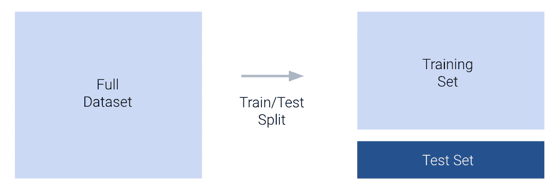

在`sklearn`中，`model_selection`模块的`train_test_split`函数允许我们自动生成训练-测试拆分。

在今天的工作中，我们将继续使用之前讲座中的`vehicles`数据集。与以往一样，我们将尝试从`hp`的转换中预测车辆的`mpg`。在下面的单元格中，我们将完整数据集的 20%分配给测试，剩下的 80%分配给训练。

代码

```py
import pandas as pd
import numpy as np
import seaborn as sns
import warnings
warnings.filterwarnings('ignore')

# Load the dataset and construct the design matrix
vehicles = sns.load_dataset("mpg").rename(columns={"horsepower":"hp"}).dropna()
X = vehicles[["hp"]]
X["hp^2"] = vehicles["hp"]**2
X["hp^3"] = vehicles["hp"]**3
X["hp^4"] = vehicles["hp"]**4

Y = vehicles["mpg"]
```

```py
from sklearn.model_selection import train_test_split

# `test_size` specifies the proportion of the full dataset that should be allocated to testing
# `random_state` makes our results reproducible for educational purposes
X_train, X_test, Y_train, Y_test = train_test_split(X, Y, test_size=0.2, random_state=220)

print(f"Size of full dataset: {X.shape[0]} points")
print(f"Size of training set: {X_train.shape[0]} points")
print(f"Size of test set: {X_test.shape[0]} points")
```

```py
Size of full dataset: 392 points
Size of training set: 313 points
Size of test set: 79 points
```

在进行训练-测试拆分后，我们将模型拟合到训练集，并评估其在测试集上的表现。

```py
import sklearn.linear_model as lm
from sklearn.metrics import mean_squared_error

model = lm.LinearRegression()

# Fit to the training set
model.fit(X_train, Y_train)

# Make predictions on the test set
test_predictions = model.predict(X_test)
```

### 16.1.2 验证集

现在，如果我们对测试集的性能不满意怎么办？按照我们目前的框架，我们就会陷入困境。如前所述，评估模型在测试集上的性能是模型设计过程的*最终*阶段。我们不能回头根据新发现的过拟合来调整模型 - 如果这样做，我们就会*考虑测试集的信息*来设计我们的模型。测试误差将不再是模型在未见数据上性能的真实代表！

我们的解决方案是引入一个**验证集**。验证集是训练集的一个随机部分，用于在模型*仍在开发中*时评估模型性能。使用验证集的过程是：

+   进行训练-测试分割。将测试集放在一边；直到模型设计过程的最后才会使用。

+   设置一部分训练集用于验证。

+   将模型参数拟合到剩余训练集中包含的数据点。

+   评估模型在验证集上的性能。根据需要调整模型，重新拟合剩余部分的训练集，然后在验证集上重新评估。如有必要，重复此过程直到满意为止。

+   在*所有*模型开发完成后，评估模型在测试集上的性能。这是模型在未见数据上表现如何的最终测试。不应对模型进行进一步修改。

创建验证集的过程称为**验证分割**。

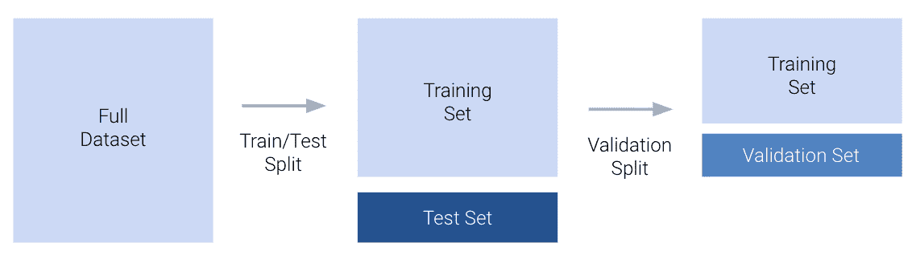

请注意，验证误差与之前探讨的训练误差行为有很大不同。回想一下，训练误差随着模型度数的增加而单调递减 - 随着模型变得更复杂，它在训练数据上做出了更好的预测。相反，验证误差在增加模型复杂度时先减少*然后增加*。这反映了从欠拟合到过拟合的转变。在低模型复杂度时，模型欠拟合，因为它不够复杂以捕捉数据的主要趋势。在高模型复杂度时，模型过拟合，因为它对训练数据进行了过于紧密的“记忆”。

我们可以更新我们对误差、复杂度和模型方差之间关系的理解：

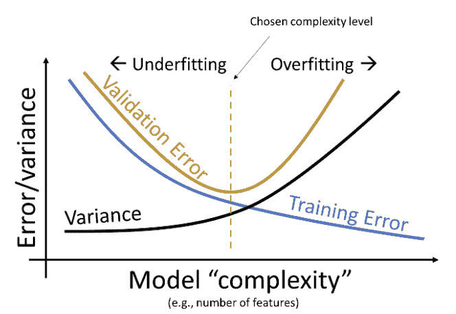

我们的目标是训练一个复杂度接近橙色虚线的模型 - 这是我们的模型在验证集上达到最小误差的地方。请注意，这种关系是对现实世界的简化。但对于 Data 100 来说，这已经足够了。

## 16.2 K-Fold Cross-Validation

引入验证集给了我们一个“额外”的机会，评估模型在另一组未见数据上的性能。我们能够根据模型在这一组验证数据上的性能来微调模型设计。

但是，如果碰巧我们的验证集包含了很多异常值怎么办？可能我们设置的验证数据点实际上并不代表模型可能遇到的其他未见数据。理想情况下，我们希望在几个不同的未见数据集上验证模型的性能。这将让我们更加自信地了解模型在新数据上的行为。

让我们回顾一下我们的验证框架。之前，我们设置了训练数据的 x%（比如 20%）用于验证。


在上面的例子中，我们设置了前 20%的训练数据点作为验证集。这是一个任意的选择。我们可以将*任何*20%的训练数据用于验证。事实上，有 5 个不重叠的“块”训练数据点，我们可以指定为验证集。

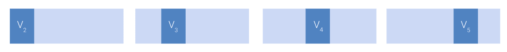

其中一个这样的块的常见术语是**折叠**。在上面的示例中，我们有 5 个折叠，每个折叠包含 20%的训练数据。这给了我们一个新的视角：我们在我们的训练集中实际上有*5*个“隐藏”的验证集。

在**交叉验证**中，我们为训练集中的每个折叠执行验证拆分。对于具有$K$个折叠的数据集，我们：

+   选择一个折叠作为验证折叠

+   将模型拟合到除验证折叠之外的每个折叠的训练数据

+   计算验证折叠上的模型误差并记录它

+   对所有$K$个折叠重复

交叉验证误差然后是所有$K$个验证折叠的*平均*误差。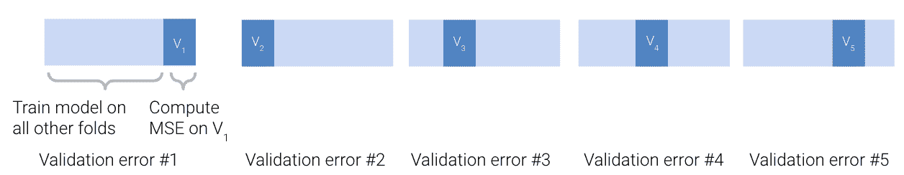

### 16.2.1 模型选择工作流程

在这个阶段，我们已经完善了我们的模型选择工作流程。我们首先执行训练-测试拆分，以设置一个测试集，用于最终评估模型性能。然后，我们在调整设计矩阵和计算交叉验证误差之间交替，以微调模型的设计。在下面的示例中，我们说明了使用 4 折交叉验证来帮助确定模型设计。

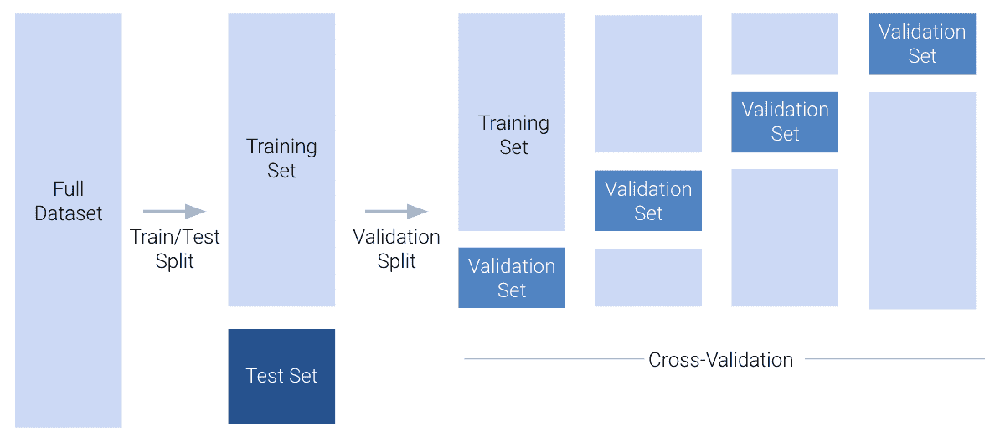

### 16.2.2 超参数

交叉验证的一个重要用途是进行超参数选择。超参数是模型中在模型拟合到任何数据之前选择的一些值。这意味着它与模型参数$\theta_i$不同，因为它的值是在训练过程开始之前选择的。我们不能使用我们通常的技术 - 微积分、普通最小二乘法或梯度下降 - 来选择它的值。相反，我们必须自己决定。

Data 100 中一些超参数的例子是：

+   我们的多项式模型的程度（回想一下，在创建设计矩阵和调用`.fit`之前我们选择了程度）

+   梯度下降中的学习率$\alpha$

+   正则化惩罚$\lambda$（稍后将介绍）

为了通过交叉验证选择超参数值，我们首先列出了几个关于最佳超参数可能是什么的“猜测”。对于每个猜测，我们然后运行交叉验证，计算模型在使用该超参数值时产生的交叉验证误差。然后我们选择导致最低交叉验证误差的超参数值。

例如，我们可能希望使用交叉验证来决定我们应该使用什么值作为$\alpha$，它控制每次梯度下降更新的步长。为此，我们列出了最佳$\alpha$的一些可能猜测：0.1、1 和 10。对于每个可能的值，我们执行交叉验证，看当我们使用该$\alpha$值来训练模型时，模型产生了什么错误。

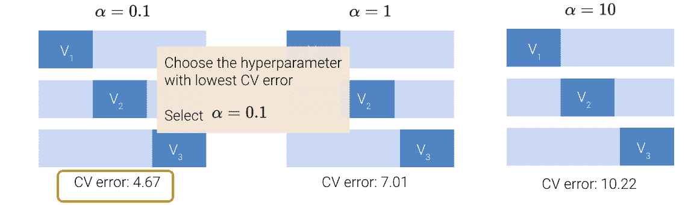

## 16.3 正则化

我们现在已经解决了今天的两个目标中的第一个：创建一个框架来评估模型在未见数据上的性能。现在，我们将讨论我们的第二个目标：开发一种调整模型复杂性的技术。这将使我们能够直接解决欠拟合和过拟合的问题。

早些时候，我们通过调整超参数（多项式的程度）来调整多项式模型的复杂性。我们尝试了几个不同的多项式程度，计算了每个的验证误差，并选择了最小化验证误差的值。调整“复杂性”很简单；只需要调整多项式程度。

在大多数机器学习问题中，复杂性的定义与我们迄今为止所见的不同。今天，我们将探讨复杂性的两种不同定义：$\theta_i$系数的*平方*和*绝对*大小。

### 16.3.1 约束模型参数

回想一下我们使用梯度下降来下降损失曲面的工作。您可能会发现参考梯度下降笔记来提醒自己会很有帮助。我们的目标是找到导致模型损失最小的模型参数组合。我们通过在水平和垂直轴上绘制可能的参数值来使用等高线图来可视化这一点，这使我们可以从上方鸟瞰损失曲面。我们希望找到对应于损失曲面上最低点的模型参数。

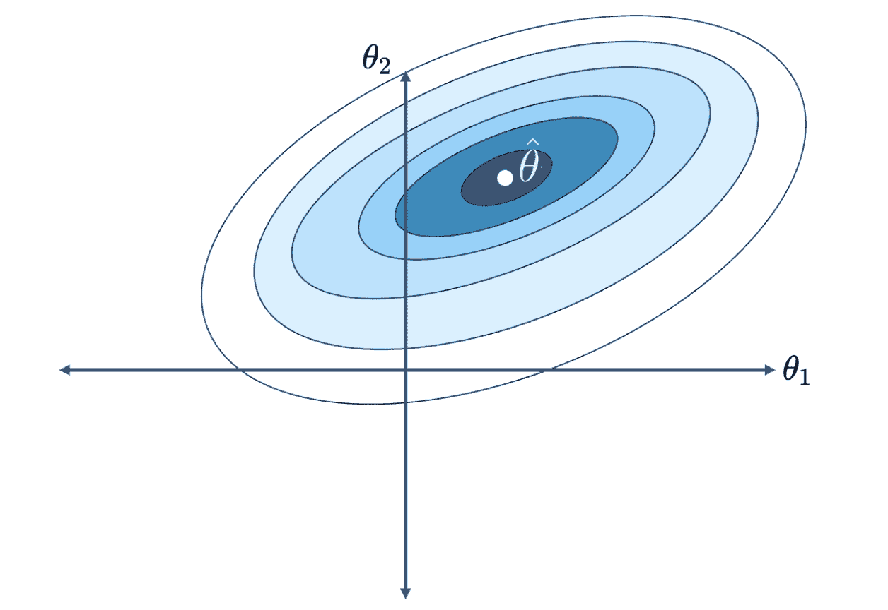

让我们回顾一下我们当前的建模框架。

$$\hat{\mathbb{Y}} = \theta_0 + \theta_1 \phi_1 + \theta_2 \phi_2 + \ldots + \theta_p \phi_p$$

回想一下，我们用$\phi_i$表示我们的特征，以反映我们进行了特征工程的事实。

以前，我们通过限制模型中存在的特征的总数来限制模型的复杂性。我们一次只包括有限数量的多项式特征；所有其他多项式都被排除在模型之外。

如果我们不是完全删除特定特征，而是保留所有特征，并且每个特征只使用“一点点”，会怎么样？如果我们限制每个特征对预测的贡献*量*，我们仍然可以控制模型的复杂性，而无需手动确定应该删除多少个特征。

我们所说的“一点点”是什么意思？考虑某个参数$\theta_i$接近或等于 0 的情况。那么，特征$\phi_i$几乎不会影响预测 - 特征的权重值如此之小，以至于它的存在并不会显著改变$\hat{\mathbb{Y}$的值。如果我们限制每个参数$\theta_i$的大小，我们就限制了特征$\phi_i$对模型的贡献。这会*减少*模型的复杂性。

在**正则化**中，我们通过对模型参数$\theta_i$的大小*设置限制*来限制模型的复杂性。

这些限制看起来是什么样子？假设我们规定所有绝对参数值的总和不能大于某个数字$Q$。换句话说：

$$\sum_{i=1}^p |\theta_i| \leq Q$$

其中$p$是模型中参数的总数。您可以将这看作是我们为模型分配每个参数的大小的“预算”。如果模型为某些$\theta_i$分配了一个较大的值，它可能必须为其他一些$\theta_j$分配一个较小的值。这会增加特征$\phi_i$对预测的影响，同时减少特征$\phi_j$的影响。模型需要战略地分配参数权重 - 理想情况下，更“重要”的特征将获得更大的权重。

请注意，截距项$\theta_0$不受此约束的影响。**我们通常不对截距项进行正则化**。

现在，让我们回想一下梯度下降，并将损失曲面可视化为等高线图。损失曲面表示每个点代表模型对$\theta_1$、$\theta_2$的特定组合的损失。假设我们的目标是找到使我们获得最低损失的参数组合。

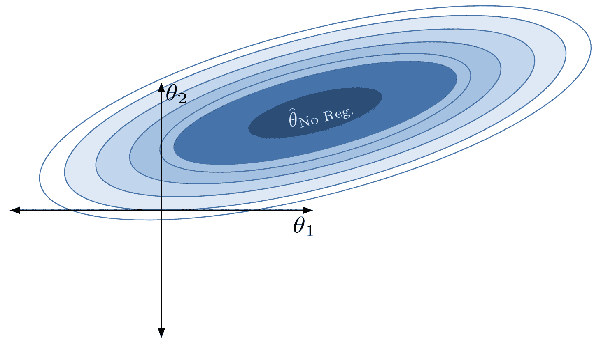

在没有约束的情况下，最优的$\hat{\theta}$位于中心。

应用这个约束限制了模型参数的有效组合。现在我们只能考虑总绝对和小于或等于我们的数字$Q$的参数组合。这意味着我们只能将我们的*正则化*参数向量$\hat{\theta}_{\text{Reg}}$分配到下面绿色菱形中的位置。

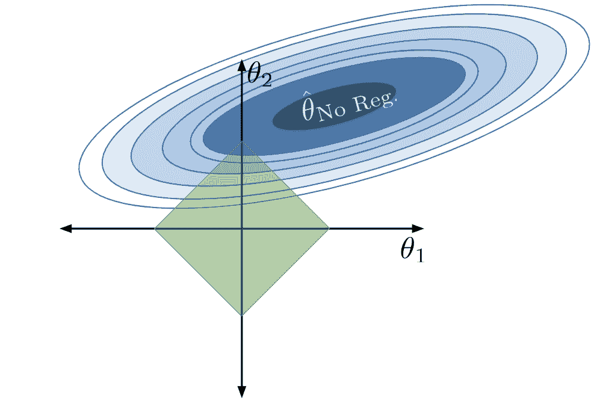

我们不能再选择*真正*最小化损失曲面的参数向量$\hat{\theta}_{\text{No Reg}}$，因为这组参数不在我们允许的区域内。相反，我们选择任何允许的组合，使我们尽可能接近真正的最小损失。

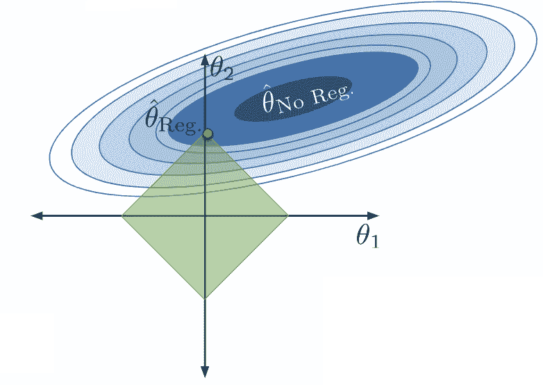

请注意，在正则化下，我们优化的$\theta_1$和$\theta_2$的值要比没有正则化时小得多（确实，$\theta_1$已经减少到 0）。模型的*复杂度降低*，因为我们限制了特征对模型的贡献。事实上，通过将其参数设置为 0，我们有效地从模型中完全删除了特征$\phi_1$的影响。

如果我们改变$Q$的值，我们就改变了允许的参数组合区域。模型仍然会选择产生最低损失的参数组合——最接近受约束区域中真正的最小化器$\hat{\theta}_{\text{No Reg}}$的点。

如果我们使$Q$更小：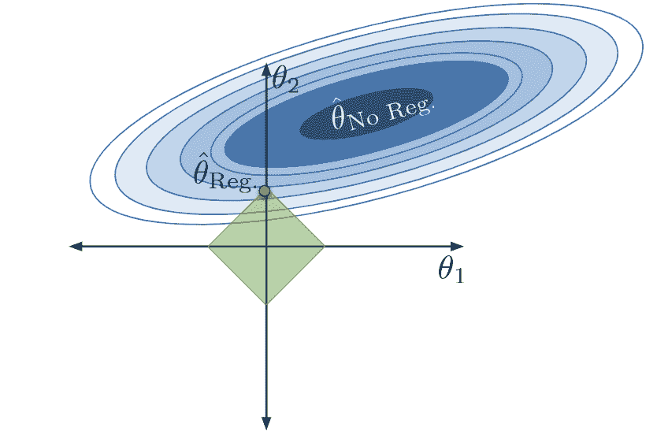如果我们使$Q$更大：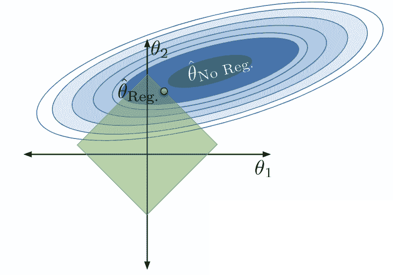

+   当$Q$很小时，我们严重限制参数的大小。$\theta_i$的值很小，特征$\phi_i$对模型的贡献很小。模型参数的允许区域收缩，模型变得简单得多。

+   当$Q$很大时，我们并不严重限制参数的大小。$\theta_i$的值很大，特征$\phi_i$对模型的贡献更大。模型参数的允许区域扩大，模型变得更复杂。

考虑当$Q$极大时的极端情况。在这种情况下，我们的限制基本上没有效果，允许的区域包括 OLS 解！

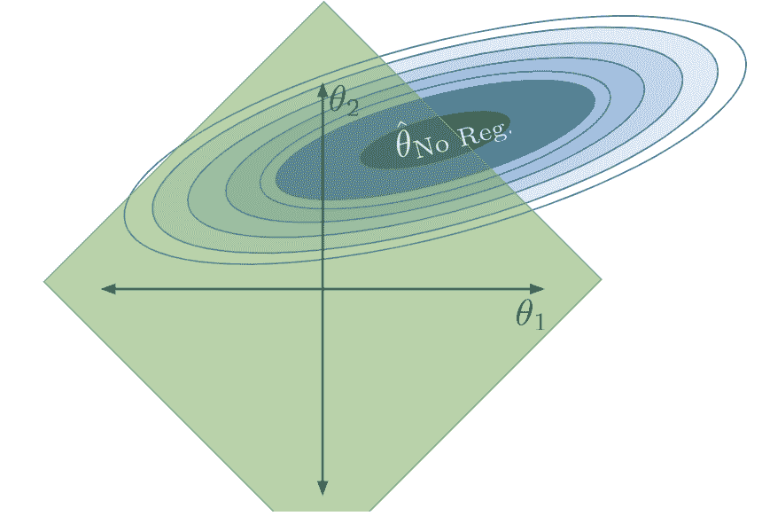

现在如果$Q$非常小会怎么样？我们的参数将被设置为（基本上是 0）。如果模型没有截距项：$\hat{\mathbb{Y}} = (0)\phi_1 + (0)\phi_2 + \ldots = 0$。如果模型有一个截距项：$\hat{\mathbb{Y}} = (0)\phi_1 + (0)\phi_2 + \ldots = \theta_0$。请记住，截距项被排除在约束之外——这样我们就避免了总是预测 0 的情况。

让我们总结一下我们所看到的。

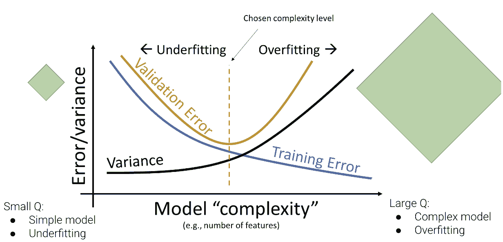

## 16.4 L1（LASSO）正则化

我们如何实际应用我们的约束$\sum_{i=1}^p |\theta_i| \leq Q$？我们将通过修改我们在拟合模型时寻求最小化的*目标函数*来实现。

回想一下我们的普通最小二乘目标函数：我们的目标是找到最小化模型均方误差的参数。

$$\frac{1}{n} \sum_{i=1}^n (y_i - \hat{y}_i)^2 = \frac{1}{n} \sum_{i=1}^n (y_i - (\theta_0 + \theta_1 \phi_{i, 1} + \theta_2 \phi_{i, 2} + \ldots + \theta_p \phi_{i, p}))^2$$

要应用我们的约束，我们需要重新表述我们的最小化目标。

$$\frac{1}{n} \sum_{i=1}^n (y_i - (\theta_0 + \theta_1 \phi_{i, 1} + \theta_2 \phi_{i, 2} + \ldots + \theta_p \phi_{i, p}))^2\:\text{such that} \sum_{i=1}^p |\theta_i| \leq Q$$

不幸的是，我们不能直接使用这个公式作为我们的目标函数——在约束上进行数学优化并不容易。相反，我们将应用[拉格朗日对偶](https://en.wikipedia.org/wiki/Duality_(optimization))的魔力。这方面的细节超出了范围（如果你有兴趣了解更多，请参加 EECS 127 课程），但最终结果非常有用。事实证明，最小化以下*增广*目标函数等同于我们上面的最小化目标。

$$\frac{1}{n} \sum_{i=1}^n (y_i - (\theta_0 + \theta_1 \phi_{i, 1} + \theta_2 \phi_{i, 2} + \ldots + \theta_p \phi_{i, p}))^2 + \lambda \sum_{i=1}^p \vert \theta_i \vert = ||\mathbb{Y} - \mathbb{X}\theta||_2^2 + \lambda \sum_{i=1}^p |\theta_i|$$

这两个表达式中的第二个包括使用向量表示的 MSE。

注意，我们已经用目标函数中的第二项替换了约束。我们现在正在最小化一个带有额外正则化项的函数，该项*惩罚大的系数*。为了最小化这个新的目标函数，我们最终会平衡两个组成部分：

+   保持模型在训练数据上的误差低，表示为术语$\frac{1}{n} \sum_{i=1}^n (y_i - (\theta_0 + \theta_1 x_{i, 1} + \theta_2 x_{i, 2} + \ldots + \theta_p x_{i, p}))^2$

+   同时，保持模型参数的幅度低，表示为术语$\lambda \sum_{i=1}^p |\theta_i|$

$\lambda$因子控制正则化的程度。粗略地说，$\lambda$与之前的$Q$约束相关，规则为$\lambda \approx \frac{1}{Q}$。

为了理解原因，让我们考虑两个极端的例子：

+   假设$\lambda \rightarrow \infty$。那么，$\lambda \sum_{j=1}^{d} \vert \theta_j \vert$ 主导成本函数。为了最小化这个项，我们对所有$j \ge 1$设置$\theta_j = 0$。这是一个非常受限的模型，从数学上讲等同于常数模型。早些时候，我们解释了当 L2 范数球半径$Q \rightarrow 0$时，常数模型也会出现。

+   假设$\lambda \rightarrow 0$。那么，$\lambda \sum_{j=1}^{d} \vert \theta_j \vert$为 0。最小化成本函数等价于$\min_{\theta} \frac{1}{n} || Y - X\theta ||_2^2$，我们通常的 MSE 损失函数。最小化 MSE 损失的行为就是我们熟悉的 OLS，最优解是全局最小值$\hat{\theta} = \hat\theta_{No Reg.}$。我们表明当 L2 范数球半径$Q \rightarrow \infty$时，全局最优解被实现。

我们称$\lambda$为**正则化惩罚超参数**，并通过交叉验证选择其值。

找到最优$\hat{\theta}$以最小化我们的新目标函数的过程称为**L1 正则化**。它有时也被称为首字母缩写“LASSO”，代表“最小绝对收缩和选择算子”。

与普通最小二乘法不同，可以通过封闭形式解$\hat{\theta}_{OLS} = (\mathbb{X}^{\top}\mathbb{X})^{-1}\mathbb{X}^{\top}\mathbb{Y}$来解决，L1 正则化下的最优参数向量没有封闭形式解。相反，我们使用`sklearn`的`Lasso`模型类。

```py
import sklearn.linear_model as lm

# The alpha parameter represents our lambda term
lasso_model = lm.Lasso(alpha=2)
lasso_model.fit(X_train, Y_train)

lasso_model.coef_
```

```py
array([-2.54932056e-01, -9.48597165e-04,  8.91976284e-06, -1.22872290e-08])
```

注意所有模型系数的幅度都非常小。实际上，其中一些系数非常小，基本上为 0。L1 正则化的一个重要特征是许多模型参数被设置为 0。换句话说，LASSO 有效地**只选择了一部分**特征。这一原因可以追溯到我们先前的损失曲面和允许的“菱形”区域 - 我们通常可以在菱形的一个角附近更接近最低损失轮廓，而不是沿着边缘。

当模型参数设置为 0 或接近 0 时，其对应的特征基本上从模型中移除了。我们说 L1 正则化执行**特征选择**，因为通过将不重要特征的参数设置为 0，LASSO“选择”了哪些特征对建模更有用。

## 16.5 特征缩放用于正则化

我们刚刚执行的正则化过程有一个微妙的问题。为了看清楚，让我们来看看我们的`lasso_model`的设计矩阵。

```py
X_train.head()
```

|  | hp | hp^2 | hp^3 | hp^4 |
| --- | --- | --- | --- | --- |
| 259 | 85.0 | 7225.0 | 614125.0 | 52200625.0 |
| 129 | 67.0 | 4489.0 | 300763.0 | 20151121.0 |
| 207 | 102.0 | 10404.0 | 1061208.0 | 108243216.0 |
| 302 | 70.0 | 4900.0 | 343000.0 | 24010000.0 |
| 71 | 97.0 | 9409.0 | 912673.0 | 88529281.0 |

我们的特征——`hp`、`hp^2`、`hp^3`和`hp^4`——在数值尺度上有着截然不同的差异！`hp^4`中的值比`hp`中的值大几个数量级！这可能是一个问题，因为`hp^4`的值自然上会对每个预测的$\hat{y}$贡献更多，因为它比其他特征的值大得多。对于`hp`对每个预测产生影响，它必须被一个大的模型参数所缩放。

通过检查我们模型的拟合参数，我们发现这种情况确实存在——`hp`的参数的数量级远大于`hp^4`的参数。

```py
pd.DataFrame({"Feature":X_train.columns, "Parameter":lasso_model.coef_})
```

|  | Feature | Parameter |
| --- | --- | --- |
| 0 | hp | -2.549321e-01 |
| 1 | hp^2 | -9.485972e-04 |
| 2 | hp^3 | 8.919763e-06 |
| 3 | hp^4 | -1.228723e-08 |

通过应用正则化，我们给我们的模型一个“预算”，来分配模型参数的值。为了让`hp`对每个预测产生影响，LASSO 被迫在`hp`的参数上“花费”更多的预算。

我们可以通过在正则化之前对数据进行**缩放**来避免这个问题。这是一个过程，我们将所有特征转换为相同的数值尺度。一个常见的缩放数据的方法是进行**标准化**，使得所有特征的均值为 0，标准差为 1；基本上，我们用 Z 分数替换所有内容。

$$z_k = \frac{x_k - \mu_k}{\sigma_k}$$

## 16.6 L2（岭）正则化

在我们上面的所有工作中，我们考虑了约束$\sum_{i=1}^p |\theta_i| \leq Q$来限制模型的复杂性。如果我们应用了不同的约束会怎样呢？

在 L2 正则化中，也被称为岭回归，我们约束模型，使得*平方*参数的总和必须小于某个数$Q$。这个约束的形式如下：

$$\sum_{i=1}^p \theta_i^2 \leq Q$$

与以前一样，我们通常不对截距项进行正则化。

对于给定的$Q$值，参数的允许区域现在呈球状。

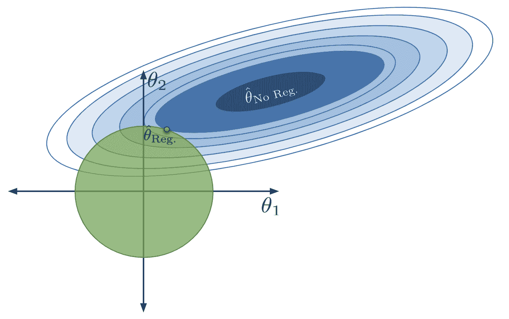

如果我们像之前一样修改我们的目标函数，我们发现我们的新目标是最小化函数：$$\frac{1}{n} \sum_{i=1}^n (y_i - (\theta_0 + \theta_1 \phi_{i, 1} + \theta_2 \phi_{i, 2} + \ldots + \theta_p \phi_{i, p}))^2\:\text{such that} \sum_{i=1}^p \theta_i^2 \leq Q$$

请注意，我们所做的只是改变了模型参数的约束。表达式中的第一项，均方误差，没有改变。

使用拉格朗日对偶性，我们可以重新表达我们的目标函数为：$$\frac{1}{n} \sum_{i=1}^n (y_i - (\theta_0 + \theta_1 \phi_{i, 1} + \theta_2 \phi_{i, 2} + \ldots + \theta_p \phi_{i, p}))^2 + \lambda \sum_{i=1}^p \theta_i^2 = ||\mathbb{Y} - \mathbb{X}\theta||_2^2 + \lambda \sum_{i=1}^p \theta_i^2$$

应用 L2 正则化时，我们的目标是最小化这个更新的目标函数。

与 L1 正则化不同，L2 正则化在应用正则化时确实有一个最佳参数向量的封闭形式解：

$$\hat\theta_{\text{ridge}} = (\mathbb{X}^{\top}\mathbb{X} + n\lambda I)^{-1}\mathbb{X}^{\top}\mathbb{Y}$$

即使$\mathbb{X}$不是完全列秩，这个解仍然存在。这是 L2 正则化经常被使用的一个主要原因——即使特征中存在共线性，它也可以产生一个解。我们将在未来的讲座中讨论共线性的概念。我们不会在 Data 100 中推导这个结果，因为它涉及相当多的矩阵微积分。

在`sklearn`中，我们使用`Ridge`类来执行 L2 正则化。请注意，在正则化之前我们会对数据进行缩放。

```py
ridge_model = lm.Ridge(alpha=1) # alpha represents the hyperparameter lambda
ridge_model.fit(X_train, Y_train)

ridge_model.coef_
```

```py
array([ 5.89130559e-02, -6.42445915e-03,  4.44468157e-05, -8.83981945e-08])
```

## 16.7 回归总结

我们的回归模型总结如下。请注意，目标函数是梯度下降优化器最小化的内容。

| 类型 | 模型 | 损失 | 正则化 | 目标函数 | 解决方案 |
| --- | --- | --- | --- | --- | --- |
| 普通最小二乘法（OLS） | $\hat{\mathbb{Y}} = \mathbb{X}\theta$ | 均方误差 | 无 | $\frac{1}{n} \|\mathbb{Y}-\mathbb{X} \theta\|^2_2$ | $\hat{\theta}_{OLS} = (\mathbb{X}^{\top}\mathbb{X})^{-1}\mathbb{X}^{\top}\mathbb{Y}$ 如果 $\mathbb{X}$ 是满秩的 |
| 岭回归 | $\hat{\mathbb{Y}} = \mathbb{X} \theta$ | 均方误差 | L2 | $\frac{1}{n} \\|\mathbb{Y}-\mathbb{X}\theta\\|^2_2 + \lambda \sum_{i=1}^p \theta_i^2$ | $\hat{\theta}_{ridge} = (\mathbb{X}^{\top}\mathbb{X} + n \lambda I)^{-1}\mathbb{X}^{\top}\mathbb{Y}$ |
| LASSO | $\hat{\mathbb{Y}} = \mathbb{X} \theta$ | 均方误差 | L1 | $\frac{1}{n} \\|\mathbb{Y}-\mathbb{X}\theta\\|^2_2 + \lambda \sum_{i=1}^p \vert \theta_i \vert$ | 无闭式解 |
