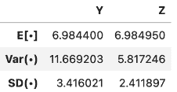

# 十七、随机变量

> 原文：[Random Variables](https://ds100.org/course-notes/probability_1/probability_1.html)
> 
> 译者：[飞龙](https://github.com/wizardforcel)
> 
> 协议：[CC BY-NC-SA 4.0](https://creativecommons.org/licenses/by-nc-sa/4.0/)

*学习成果*

+   以其分布的形式定义随机变量

+   计算随机变量的期望和方差

+   熟悉伯努利和二项式随机变量

在过去的几节课中，我们已经考虑了复杂性对模型性能的影响。我们已经考虑了模型复杂性在两个竞争因素之间的权衡：模型方差和训练误差。

到目前为止，我们的分析大部分是定性的。我们已经承认我们对模型复杂性的选择需要在模型方差和训练误差之间取得平衡，但我们还没有讨论为什么会存在这种权衡。

为了更好地理解这种权衡的起源，我们需要引入**随机变量**的语言。接下来的两节关于概率的讲座将是对我们在建模工作中的一个简短的离题，这样我们就可以建立起理解这所谓的**偏差-方差权衡**所需的概念。我们接下来几节的路线图将是：

1.  随机变量估计器：引入随机变量，考虑期望、方差和协方差的概念

1.  估计器、偏差和方差：用随机变量的术语重新表达模型方差和训练误差的概念，并利用这种新的视角来研究我们对模型复杂性的选择

*Data 8 复习*

1.  回顾 Data 8 中的以下概念：

1.  样本均值：你的随机样本的均值

1.  中心极限定理：如果你进行了一个带有替换的大样本随机抽样，那么无论总体分布如何，样本均值的概率分布

    1.  大致是正态的

    1.  以总体均值为中心

    1.  有一个$SD = \frac{\text{总体 SD}}{\sqrt{\text{样本大小}}}$

## 17.1 随机变量和分布

假设我们生成了一组随机数据，比如从某个总体中随机抽取的一个随机样本。**随机变量**是数据中随机性的*数值函数*。它是*随机*的，因为我们的样本是随机抽取的；它是*变量*的，因为它的确切值取决于这个随机样本的结果。因此，我们的随机变量的定义域或输入是一个*样本空间*中所有可能的（随机的）结果，它的值域或输出是数轴。我们通常用大写字母表示随机变量，如$X$或$Y$。

### 17.1.1 分布

对于任何随机变量$X$，我们需要能够指定两件事：

1.  可能的值：随机变量可以取得的值的集合。

1.  概率：描述 100%总概率如何分布在可能值上的概率集合。

如果$X$是离散的（有有限个可能的值），随机变量$X$取值$x$的概率由$P(X=x)$给出，概率必须总和为 1：$\sum_{\text{all} x} P(X=x) = 1$,

我们通常可以使用**概率分布表**来显示这一点，你将在下面的抛硬币示例中看到。

随机变量$X$的**分布**是对 100%总概率如何分布在$X$的所有可能值上的描述，它完全定义了一个随机变量。离散随机变量的分布也可以用直方图表示。如果一个变量是**连续的** - 它可以取无限多个值 - 我们可以用密度曲线来说明它的分布。

概率是区域。对于离散随机变量，*红色条形的面积*表示离散随机变量$X$落在这些值范围内的概率。对于连续随机变量，*曲线下的面积*表示离散随机变量$Y$落在这些值范围内的概率。

如果我们将条形图/密度曲线下的总面积相加，应该得到 100%，或 1。

### 17.1.2 例子：抛硬币

举个具体的例子，让我们正式定义一个公平的硬币抛掷。一枚公平的硬币可以正面朝上($H$)或反面朝上($T$)，每种情况的概率都是 0.5。有了这些可能的结果，我们可以将随机变量$X$定义为：$$X = \begin{cases} 1, \text{如果硬币正面朝上} \\ 0, \text{如果硬币反面朝上} \end{cases}$$

$X$是一个具有域或输入$\{H, T\}$和值域或输出$\{1, 0\}$的函数。我们可以用函数符号表示为$$\begin{cases} X(H) = 1 \\ X(T) = 0 \end{cases}$$ $X$的概率分布表如下。

| $x$ | $P(X=x)$ |
| --- | --- |
| 0 | $\frac{1}{2}$ |
| 1 | $\frac{1}{2}$ |

假设我们从 Data 100 中所有注册学生中随机抽取一个大小为 3 的样本$s$。我们可以将$Y$定义为我们样本中数据科学学生的数量。它的域是大小为 3 的所有可能样本，其值域是$\{0, 1, 2, 3\}$。

我们可以在下表中显示$Y$的分布。左侧的表列出了所有可能的样本$s$及其出现次数($Y(s)$)。我们可以使用这个来计算右侧的表的值，即**概率分布表**。

### 17.1.3 模拟

给定随机变量$X$的分布，我们如何**生成/模拟**一个总体？为此，我们可以根据其分布随机选择$X$的值，使用`np.random.choice`或`df.sample`。

## 17.2 期望和方差

描述随机变量的方法有几种。上面显示的方法 - 所有样本$s, X(s)$的表，分布表$P(X=x)$和直方图 - 都是*完全描述*随机变量的定义。通常，用一些*数值摘要*来描述随机变量比完全定义其分布更容易。这些数值摘要是表征随机变量某些属性的数字。因为它们给出了随机变量的行为倾向的“摘要”，它们*不是*随机的 - 将它们视为描述随机变量某个属性的静态数字。在 Data 100 中，我们将关注随机变量的期望和方差。

### 17.2.1 期望

随机变量$X$的**期望**是$X$的值的加权平均值，其中权重是每个值发生的概率。有两种等效的计算期望的方法：

1.  一次应用一个*样本*的权重：$$\mathbb{E}[X] = \sum_{\text{所有可能的} s} X(s) P(s)$$。

1.  一次应用权重一个可能的*值*：$$\mathbb{E}[X] = \sum_{\text{所有可能的} x} x P(X=x)$$

我们要强调的是，期望是一个*数字*，不是一个随机变量。期望是平均值的一种概括，它与随机变量具有相同的单位。它也是概率分布直方图的重心，这意味着如果我们多次模拟变量，它是随机变量的长期平均值。

#### 17.2.1.1 示例 1：抛硬币

回到我们抛硬币的例子，我们将随机变量$X$定义为：$$X = \begin{cases} 1, \text{如果硬币正面朝上} \\ 0, \text{如果硬币反面朝上} \end{cases}$$ 我们可以使用第二种方法，一次应用权重一个可能的值来计算其期望$\mathbb{E}[X]$：$$\begin{align} \mathbb{E}[X] &= \sum_{x} x P(X=x) \\ &= 1 * 0.5 + 0 * 0.5 \\ &= 0.5 \end{align}$$ 请注意，$\mathbb{E}[X] = 0.5$不是$X$的可能值；这是一个平均值。**X 的期望值不需要是 X 的可能值**。

#### 17.2.1.2 示例 2

考虑随机变量$X$：

| $x$ | $P(X=x)$ |
| --- | --- |
| 3 | 0.1 |
| 4 | 0.2 |
| 6 | 0.4 |
| 8 | 0.3 |

计算期望，$$\begin{align} \mathbb{E}[X] &= \sum_{x} x P(X=x) \\ &= 3 * 0.1 + 4 * 0.2 + 6 * 0.4 + 8 * 0.3 \\ &= 0.3 + 0.8 + 2.4 + 2.4 \\ &= 5.9 \end{align}$$ 再次注意，$\mathbb{E}[X] = 5.9$ 不是 $X$ 的可能值；这是一个平均值。**X 的期望值不需要是 X 的可能值**。

### 17.2.2 方差

随机变量的**方差**是其随机误差的度量。它被定义为$X$的期望值的平方偏差。更简单地说，方差问：$X$通常从其平均值变化多少，仅仅是由于偶然？$X$的分布是如何传播的？

$$\text{Var}(X) = \mathbb{E}[(X-\mathbb{E}[X])^2]$$

方差的单位是$X$的单位的平方。要将其恢复到正确的比例，使用$X$的标准差：$$\text{SD}(X) = \sqrt{\text{Var}(X)}$$

与期望一样，**方差是一个数，不是一个随机变量**！它的主要用途是量化偶然误差。

根据[切比雪夫不等式](https://www.inferentialthinking.com/chapters/14/2/Variability.html#Chebychev's-Bounds)，你在 Data 8 中看到的，无论$X$的分布形状如何，绝大多数的概率都在“期望值加上或减去几个标准差”的区间内。

如果我们展开平方并使用期望的属性，我们可以重新表达方差作为**方差的计算公式**。当手动计算变量的方差时，这种形式通常更方便使用，并且在均方误差计算中也很有用，因为如果$X$是居中的，那么$\mathbb{E}[X^2] = \text{Var}(X)$。

$$\text{Var}(X) = \mathbb{E}[X^2] - (\mathbb{E}[X])^2$$

*证明*

$$\begin{align} \text{Var}(X) &= \mathbb{E}[(X-\mathbb{E}[X])^2] \\ &= \mathbb{E}(X^2 - 2X\mathbb{E}(X) + (\mathbb{E}(X))^2) \\ &= \mathbb{E}(X^2) - 2 \mathbb{E}(X)\mathbb{E}(X) +( \mathbb{E}(X))^2\\ &= \mathbb{E}[X^2] - (\mathbb{E}[X])^2 \end{align}$$

我们如何计算$\mathbb{E}[X^2]$? 任何随机变量的函数也是*随机变量* - 这意味着通过平方$X$，我们创建了一个新的随机变量。要计算$\mathbb{E}[X^2]$，我们可以简单地将我们的期望值定义应用于随机变量$X^2$。

$$\mathbb{E}[X^2] = \sum_{x} x^2 P(X = x)$$

### 17.2.3 例子：骰子

设$X$是单次公平掷骰子的结果。$X$是一个随机变量，定义为$$X = \begin{cases} \frac{1}{6}, \text{if } x \in \{1,2,3,4,5,6\} \\ 0, \text{otherwise} \end{cases}$$

*期望值 $\mathbb{E}[X]?$*

$$ \begin{align} \mathbb{E}[X] &= 1(\frac{1}{6}) + 2(\frac{1}{6}) + 3(\frac{1}{6}) + 4(\frac{1}{6}) + 5(\frac{1}{6}) + 6(\frac{1}{6}) \\ &= (\frac{1}{6}) ( 1 + 2 + 3 + 4 + 5 + 6) \\ &= \frac{7}{2} \end{align}$$

方差 $\text{Var}(X)?$

使用方法 1: $$\begin{align} \text{Var}(X) &= (\frac{1}{6})((1 - \frac{7}{2})^2 + (2 - \frac{7}{2})^2 + (3 - \frac{7}{2})^2 + (4 - \frac{7}{2})^2 + (5 - \frac{7}{2})^2 + (6 - \frac{7}{2})^2) \\ &= \frac{35}{12} \end{align}$$

使用方法 2：$$\mathbb{E}[X^2] = \sum_{x} x^2 P(X = x) = \frac{91}{6}$$

$$\text{Var}(X) = \frac{91}{6} - (\frac{7}{2})^2 = \frac{35}{12}$$

## 17.3 随机变量的和

通常，我们会同时处理多个随机变量。随机变量的函数也是随机变量；如果你基于样本创建多个随机变量，那么这些随机变量的函数也是随机变量。

例如，如果$X_1, X_2, ..., X_n$是随机变量，那么这些也是随机变量：

+   $X_n^2$

+   $\#\{i : X_i > 10\}$

+   $\text{max}(X_1, X_2, ..., X_n)$

+   $\frac{1}{n} \sum_{i=1}^n (X_i - c)^2$

+   $\frac{1}{n} \sum_{i=1}^n X_i$

### 17.3.1 相等 vs. 相同分布 vs. i.i.d.

假设我们有两个随机变量 $X$ 和 $Y$：

+   $X$ 和 $Y$ 如果对于每个样本 $s$ 都有 $X(s) = Y(s)$ 则它们是**相等**的。无论抽取的确切样本是什么，$X$ 总是等于 $Y$。

+   如果$X$和$Y$的分布相等，则$X$和$Y$是**相同分布**的。我们说“X 和 Y 在分布上相等”。也就是说，$X$和$Y$取相同的可能值集，并且每个可能值都以相同的概率取到。在任何特定的样本$s$上，相同分布的变量不一定共享相同的值。如果 X = Y，则 X 和 Y 是相同分布的；然而，反之则不成立（例如：Y = 7-X，X 是一个骰子）

+   如果

    1.  这些变量是相同分布的。

    1.  知道一个变量的结果不会影响我们对另一个变量结果的信念。

例如，让$X_1$和$X_2$是两个公平骰子的点数。$X_1$和$X_2$是 i.i.d，所以$X_1$和$X_2$具有相同的分布。然而，和$Y = X_1 + X_1 = 2X_1$和$Z=X_1+X_2$具有不同的分布，但是相同的期望值。

然而，$Y = X_1$的方差更大

### 17.3.2 期望值的性质

我们经常直接计算期望值和方差，而不是模拟完整的分布。回顾期望值的定义：$$\mathbb{E}[X] = \sum_{x} x P(X=x)$$ 从中，我们可以推导出期望值的一些有用的性质：

1.  **期望的线性性**。常数$a$和$b$的线性变换$aX+b$的期望值是：

$$\mathbb{E}[aX+b] = aE[\mathbb{X}] + b$$

*证明* 

$$\begin{align} \mathbb{E}[aX+b] &= \sum_{x} (ax + b) P(X=x) \\ &= \sum_{x} (ax P(X=x) + bP(X=x)) \\ &= a\sum_{x}P(X=x) + b\sum_{x}P(X=x)\\ &= a\mathbb{E}(X) + b * 1 \end{align}$$

2.  期望值在随机变量的*总和*中也是线性的。

$$\mathbb{E}[X+Y] = \mathbb{E}[X] + \mathbb{E}[Y]$$

*证明*

$$\begin{align} \mathbb{E}[X+Y] &= \sum_{s} (X+Y)(s) P(s) \\ &= \sum_{s} (X(s)P(s) + Y(s)P(s)) \\ &= \sum_{s} X(s)P(s) + \sum_{s} Y(s)P(s)\\ &= \mathbb{E}[X] + \mathbb{E}[Y] \end{align}$$

3.  如果$g$是一个非线性函数，那么一般来说，$$\mathbb{E}[g(X)] \neq g(\mathbb{E}[X])$$ 例如，如果$X$以相等的概率为-1 或 1，那么$\mathbb{E}[X] = 0$，但$\mathbb{E}[X^2] = 1 \neq 0$.

### 17.3.3 方差的性质

回顾方差的定义：$$\text{Var}(X) = \mathbb{E}[(X-\mathbb{E}[X])^2]$$ 结合期望值的性质，我们可以推导出方差的一些有用的性质：

1.  与期望值不同，方差是*非线性*的。线性变换$aX+b$的方差是：$$\text{Var}(aX+b) = a^2 \text{Var}(X)$$

+   随后，$$\text{SD}(aX+b) = |a| \text{SD}(X)$$

+   可以通过方差的定义找到这个事实的完整证明。作为一般直觉，考虑$aX+b$通过因子$a$缩放变量$X$，然后将$X$的分布移位$b$单位。

*证明* 

我们知道$$\mathbb{E}[aX+b] = aE[\mathbb{X}] + b$$

为了计算$\text{Var}(aX+b)$，考虑到 b 单位的移位不会影响扩展，因此$\text{Var}(aX+b) = \text{Var}(aX)$。

因此，$$\begin{align} \text{Var}(aX+b) &= \text{Var}(aX) \\ &= E((aX)^2) - (E(aX))^2 \\ &= E(a^2 X^2) - (aE(X))^2\\ &= a^2 (E(X^2) - (E(X))^2) \\ &= a^2 \text{Var}(X) \end{align}$$

*   将分布移位 b *不会* 影响分布的*扩展*。因此，$\text{Var}(aX+b) = \text{Var}(aX)$。

+   通过$a$缩放分布*会* 影响分布的扩展。

1.  随机变量的和的方差受到随机变量的（不）独立性的影响。$$\text{Var}(X + Y) = \text{Var}(X) + \text{Var}(Y) + 2\text{cov}(X,Y)$$

$$\text{Var}(X + Y) = \text{Var}(X) + \text{Var}(Y) \qquad \text{if } X, Y \text{ independent}$$

*证明*

两个随机变量相加的方差受到它们之间的依赖关系的影响。让我们展开$\text{Var}(X + Y)$的定义，看看发生了什么。

为了简化数学，让$\mu_x = \mathbb{E}[X]$和$\mu_y = \mathbb{E}[Y]$。

$$ \begin{align} \text{Var}(X + Y) &= \mathbb{E}[(X+Y- \mathbb{E}(X+Y))^2] \\ &= \mathbb{E}[((X - \mu_x) + (Y - \mu_y))^2] \\ &= \mathbb{E}[(X - \mu_x)^2 + 2(X - \mu_x)(Y - \mu_y) + (Y - \mu_y)^2] \\ &= \mathbb{E}[(X - \mu_x)^2] + \mathbb{E}[(Y - \mu_y)^2] + \mathbb{E}[(X - \mu_x)(Y - \mu_y)] \\ &= \text{Var}(X) + \text{Var}(Y) + \mathbb{E}[(X - \mu_x)(Y - \mu_y)] \end{align}$$

### 17.3.4 Covariance and Correlation

我们将两个随机变量的**协方差**定义为期望的偏差乘积。更简单地说，协方差是方差对*两个*随机变量的泛化：$\text{Cov}(X, X) = \mathbb{E}[(X - \mathbb{E}[X])^2] = \text{Var}(X)$

$$\text{Cov}(X, Y) = \mathbb{E}[(X - \mathbb{E}[X])(Y - \mathbb{E}[Y])]$$

我们可以将协方差视为一种关联度量。还记得我们在建立简单线性回归时给出的相关性定义吗？

$$r(X, Y) = \mathbb{E}\left[\left(\frac{X-\mathbb{E}[X]}{\text{SD}(X)}\right)\left(\frac{Y-\mathbb{E}[Y]}{\text{SD}(Y)}\right)\right] = \frac{\text{Cov}(X, Y)}{\text{SD}(X)\text{SD}(Y)}$$

事实证明我们一直在悄悄使用协方差！如果$X$和$Y$是独立的，那么$\text{Cov}(X, Y) =0$和$r(X, Y) = 0$。然而，请注意，逆命题并不总是成立：$X$和$Y$可能有$\text{Cov}(X, Y) = r(X, Y) = 0$但并不是独立的。

### 17.3.5 Summary

+   设$X$是一个具有分布$P(X=x)$的随机变量。

    +   $\mathbb{E}[X] = \sum_{x} x P(X=x)$

    +   $\text{Var}(X) = \mathbb{E}[(X-\mathbb{E}[X])^2] = \mathbb{E}[X^2] - (\mathbb{E}[X])^2$

+   设$a$和$b$是标量值。

    +   $\mathbb{E}[aX+b] = aE[\mathbb{X}] + b$

    +   $\text{Var}(aX+b) = a^2 \text{Var}(X)$

+   设$Y$是另一个随机变量。

    +   $\mathbb{E}[X+Y] = \mathbb{E}[X] + \mathbb{E}[Y]$

    +   $\text{Var}(X + Y) = \text{Var}(X) + \text{Var}(Y) 2\text{cov}(X,Y)$
