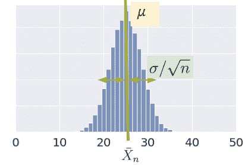
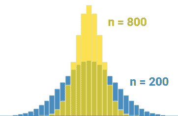
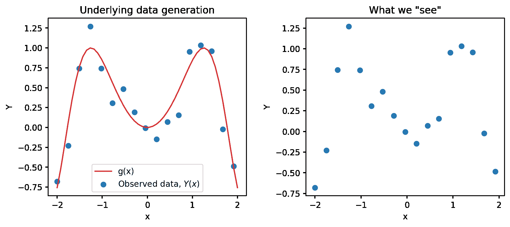
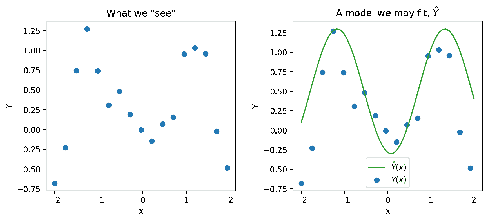
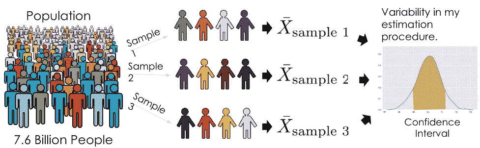
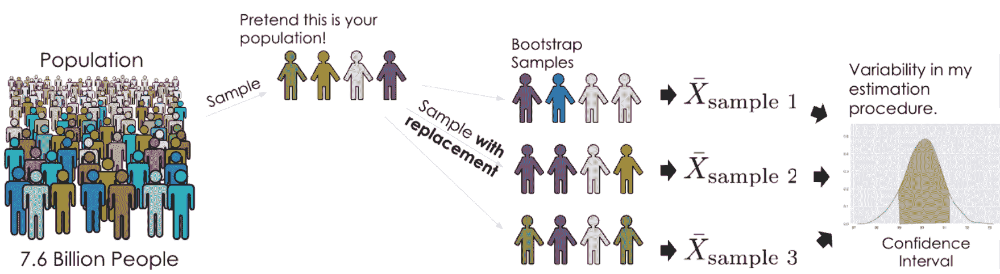
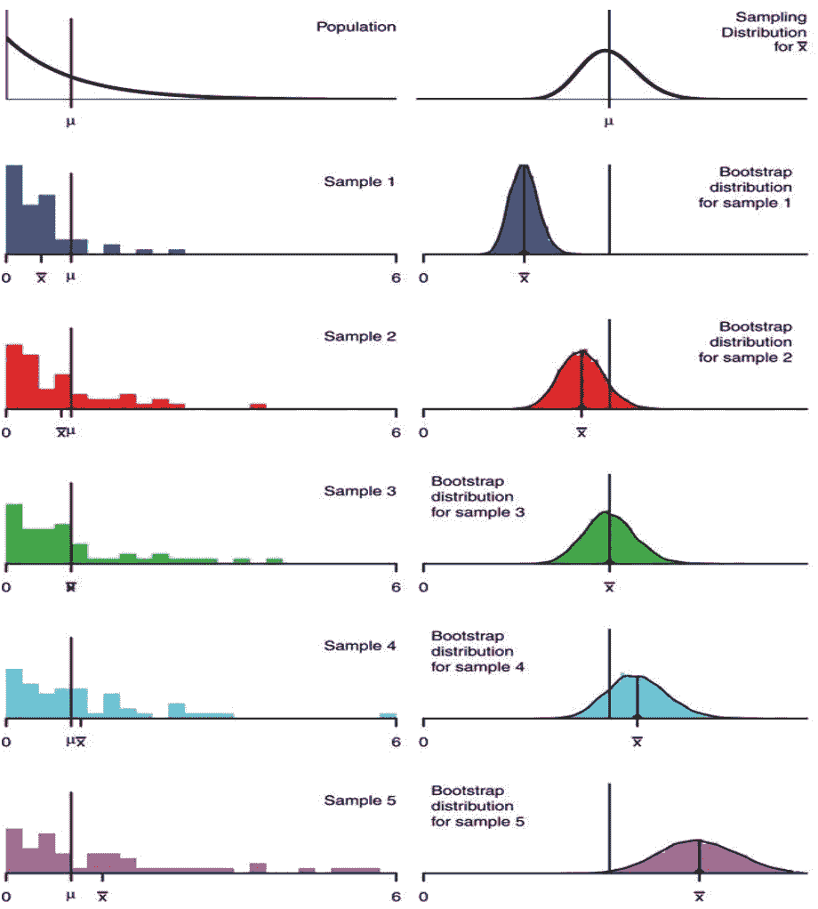

# 十八、估计器、偏差和方差

> [Estimators, Bias, and Variance](https://ds100.org/course-notes/probability_2/probability_2.html)
> 
> 译者：[飞龙](https://github.com/wizardforcel)
> 
> 协议：[CC BY-NC-SA 4.0](https://creativecommons.org/licenses/by-nc-sa/4.0/)

*学习成果*

+   探索常见的随机变量，如伯努利和二项式分布

+   应用中心极限定理来近似总体参数

+   使用抽样数据对真实的潜在分布进行建模估计

+   使用自助法技术从样本中估计真实总体分布

上次，我们介绍了随机变量的概念：样本的数值函数。在上一讲中，我们的大部分工作是建立概率和统计学的背景。现在我们已经建立了一些关键的思想，我们可以将我们学到的知识应用到我们最初的目标上 - 理解样本的随机性如何影响模型设计过程。

在本讲座中，我们将更深入地探讨将模型拟合到样本的想法。我们将探讨如何用随机变量重新表达我们的建模过程，并利用这种新的理解来引导模型的复杂性。

## 18.1 常见随机变量

有几种经常出现并且具有有用特性的随机变量情况。以下是我们将在本课程中进一步探讨的情况。括号中的数字是随机变量的参数，这些参数是常数。参数定义了随机变量的形状（即分布）和其值。在本讲座中，我们将更加重点关注加粗的随机变量及其特殊性质，但你应该熟悉下面列出的所有随机变量：

+   **伯努利(p)**

    +   以概率 p 取值 1，以概率 1-p 取值 0。

    +   又称“指示”随机变量。

    +   设 X 是一个伯努利(p)随机变量

        +   $\mathbb{E}[X] = 1 * p + 0 * (1-p) = p$

            +   $\mathbb{E}[X^2] = 1^2 * p + 0 * (1-p) = p$

        +   $\text{Var}(X) = \mathbb{E}[X^2] - (\mathbb{E}[X])^2 = p - p^2 = p(1-p)$

+   **二项式(n, p)**

    +   $n$ 独立伯努利(p)试验中的 1 的数量。

    +   设$Y$是一个二项式(n, p)随机变量。

        +   $Y$的分布由二项式公式给出，我们可以写成$Y = \sum_{i=1}^n X_i$，其中：

            +   $X_i$是第$i$次试验成功的指示。如果第$i$次试验成功，则$X_i = 1$，否则为 0。

            +   所有的$X_i$都是独立同分布的伯努利(p)。

        +   $\mathbb{E}[Y] = \sum_{i=1}^n \mathbb{E}[X_i] = np$

        +   $\text{Var}(X) = \sum_{i=1}^n \text{Var}(X_i) = np(1-p)$

            +   $X_i$是独立的，所以对于所有的 i, j，$\text{Cov}(X_i, X_j) = 0$。

+   有限值集上均匀分布

    +   每个值的概率是 1 / (可能的值的数量)。

    +   例如，一个标准/公平的骰子。

+   单位区间(0, 1)上均匀分布

    +   密度在(0, 1)上为 1，在其他地方为 0。

+   正态($\mu, \sigma^2$)

    +   $f(x) = \frac{1}{\sigma\sqrt{2\pi}} \exp\left( -\frac{1}{2}\left(\frac{x-\mu}{\sigma}\right)^{\!2}\,\right)$

### 18.1.1 例子

假设你根据 20 次抛硬币中得到的正面数量赢得现金。如果第$i$次抛硬币得到正面，则令$X_i = 1$，否则为 0。你会选择哪种支付策略？

A. $Y_A = 10 * X_1 + 10 * X_2$

B. $Y_B = \sum_{i=1}^{20} X_i$

C. $Y_C = 20 * X_1$

*解决方案*

设$X_1, X_2, ... X_{20}$是 20 个独立同分布的伯努利(0.5)随机变量。由于$X_i$是独立的，对于所有的$i, j$对，$\text{Cov}(X_i, X_j) = 0$。另外，由于$X_i$是伯努利(0.5)，我们知道$\mathbb{E}[X] = p = 0.5$和$\text{Var}(X) = p(1-p) = 0.25$。我们可以计算每种情况的如下内容：

|  | A. $Y_A = 10 * X_1 + 10 * X_2$ | B. $Y_B = \sum_{i=1}^{20} X_i$ | C. $Y_C = 20 * X_1$ |
| --- | --- | --- | --- |
| 期望 | $\mathbb{E}[Y_A] = 10 (0.5) + 10(0.5) = 10$ | $\mathbb{E}[Y_B] = 0.5 + ... + 0.5 = 10$ | $\mathbb{E}[Y_C] = 20(0.5) = 10$ |
| 方差 | $\text{Var}(Y_A) = 10^2 (0.25) + 10^2 (0.25) = 50$ | $\text{Var}(Y_B) = 0.25 + ... + 0.25 = 5$ | $\text{Var}(Y_C) = 20^2 (0.25) = 100$ |
| 标准差 | $\text{SD}(Y_A) \approx 7.07$ | $\text{SD}(Y_B) \approx 2.24$ | $\text{SD}(Y_C) = 10$ |

正如我们所看到的，所有的情景都有相同的期望值，但方差不同。方差越大，风险和不确定性就越大，因此“正确”的策略取决于个人的偏好。你会选择“最安全”的选项 B，最“冒险”的选项 C，还是介于两者之间的选项 A？

## 18.2 样本统计

今天，我们已经广泛讨论了总体；如果我们知道随机变量的分布，我们可以可靠地计算期望、方差、随机变量的函数等。请注意：

+   *总体*的分布描述了随机变量在*所有*感兴趣的个体中的行为。

+   *样本*的分布描述了随机变量在来自总体的*特定样本*中的行为。

然而，在数据科学中，我们经常无法接触到整个总体，因此我们不知道它的分布。因此，我们需要收集一个样本，并使用它的分布来估计或推断总体的属性。在这种情况下，我们可以从总体中取几个大小为$n$的样本（一个简单的方法是使用`df.sample(n, replace=True)`），并计算每个*样本*的均值。在抽样时，我们做出（很大的）假设，即我们从总体中均匀随机地进行有放回抽样；我们样本中的每个观察都是从我们的总体分布中独立同分布地随机抽取的随机变量。请记住，我们的样本均值是一个随机变量，因为它取决于我们随机抽取的样本！另一方面，我们的总体均值只是一个数字（一个固定的值）。

### 18.2.1 样本均值

考虑一个从具有均值𝜇和标准差𝜎的总体中抽取的 i.i.d.样本$X_1, X_2, ..., X_n$。我们定义样本均值为$$\bar{X}_n = \frac{1}{n} \sum_{i=1}^n X_i$$

样本均值的期望值由以下公式给出：$$\begin{align} \mathbb{E}[\bar{X}_n] &= \frac{1}{n} \sum_{i=1}^n \mathbb{E}[X_i] \\ &= \frac{1}{n} (n \mu) \\ &= \mu \end{align}$$

方差由以下公式给出：$$\begin{align} \text{Var}(\bar{X}_n) &= \frac{1}{n^2} \text{Var}( \sum_{i=1}^n X_i) \\ &= \frac{1}{n^2} \left( \sum_{i=1}^n \text{Var}(X_i) \right) \\ &= \frac{1}{n^2} (n \sigma^2) = \frac{\sigma^2}{n} \end{align}$$

$\bar{X}_n$根据中心极限定理（CLT）呈正态分布。

### 18.2.2 中心极限定理

在[Data 8](https://inferentialthinking.com/chapters/14/4/Central_Limit_Theorem.html?)和之前的讲座中，你遇到了**中心极限定理（CLT）**。这是一个强大的定理，用于从一系列较小的样本中估计具有均值$\mu$和标准差$\sigma$的总体的分布。中心极限定理告诉我们，如果一个大小为$n$的 i.i.d 样本很大，那么**样本均值**的概率分布**大致正态**，均值为$\mu$，标准差为$\frac{\sigma}{\sqrt{n}}$。更一般地，任何提供统计量粗略分布并且**不需要总体分布**的定理对于数据科学家来说都是有价值的！这是因为我们很少对总体了解很多。



重要的是，中心极限定理假设我们样本中的每个观察都是从总体的分布中抽取的 i.i.d。此外，中心极限定理仅在$n$“大”时才准确，但什么样的“大”样本量取决于特定的分布。如果一个总体高度对称和单峰，我们可能只需要$n=20$；如果一个总体非常倾斜，我们需要更大的$n$。如果有疑问，可以对样本均值进行自举，并查看自举分布是否呈钟形。像 Data 140 这样的课程会对这个想法进行详细的探讨。

要了解更详细的演示，请查看[onlinestatbook](https://onlinestatbook.com/stat_sim/sampling_dist/)。

### 18.2.3 使用样本均值估计总体均值

现在假设我们想使用样本均值来**估计**总体均值，例如，加州大学本科生的平均身高。通常我们可以收集一个**单一样本**，其中只有一个平均值。但是，如果我们碰巧以随机方式抽取了一个具有不同均值或扩展性的样本，会怎么样呢？我们可能会对总体行为有一个偏斜的看法（考虑极端情况，我们碰巧抽取了相同的值 $n$ 次！）。



例如，注意这两个分布之间的变化差异，这两个分布在样本大小上是不同的。样本量更大的分布（$n=800$）比样本量较小的分布（$n=200$）更紧密地围绕均值。尝试将这些值代入正态分布的标准偏差方程中，以理解这一点！

应用中心极限定理使我们能够理解所有这些并解决这个问题。通过抽取许多样本，我们可以考虑样本分布在数据的多个子集中的变化。这使我们能够近似总体的属性，而无需调查每个成员。

鉴于这种潜在的差异，我们还要考虑所有可能的样本均值的**平均值和扩展性**，以及这对 $n$ 应该有多大的影响。对于每个样本量，样本均值的期望值是总体均值：$$\mathbb{E}[\bar{X}_n] = \mu$$。我们称样本均值是总体均值的**无偏估计量**，并将在下一讲中更多地探讨这个想法。

*Data 8 Recap: 平方根定律* 

平方根定律（[Data 8](https://inferentialthinking.com/chapters/14/5/Variability_of_the_Sample_Mean.html#the-square-root-law)）指出，如果将样本量增加一个因子，标准偏差将减少该因子的平方根。 $$\text{SD}(\bar{X_n}) = \frac{\sigma}{\sqrt{n}}$$ 如果我们有更大的样本量，样本均值更有可能接近总体均值。

## 18.3 预测和推断

在课程的这一阶段，我们花了大量时间研究模型。几周前我们首次介绍了建模的概念时，是在**预测**的背景下：使用模型对未知数据进行*准确预测*。我们构建模型的另一个原因是更好地理解我们周围复杂的现象。**推断**是使用模型推断特征和响应变量之间真实的基本关系的任务。例如，如果我们正在处理一组房屋数据，*预测*可能会问：根据房屋的属性，它值多少钱？*推断*可能会问：当地公园对房屋价值有多大影响？

推断的一个主要目标是仅凭随机样本对完整数据总体进行推断。为此，我们旨在估计*参数*的值，这是*总体*的数值函数（例如，总体均值 $\mu$）。我们使用收集的样本来构建**统计量**，这是随机*样本*的数值函数（例如，样本均值 $\bar{X}_n$）。将`p`视为“参数”和“总体”，将`s`视为“样本”和“统计量”是有帮助的。

由于样本代表总体的*随机*子集，我们生成的任何统计量可能会偏离真实的总体参数，并且*可能会有所不同*。我们说样本统计量是真实总体参数的**估计量**。在符号上，总体参数通常称为 $\theta$，而其估计量用 $\hat{\theta}$ 表示。

为了回答我们的推断问题，我们旨在构建能够紧密估计总体参数值的估计量。我们通过回答三个问题来评估估计量的“好坏”：

+   我们平均得到参数的正确答案吗？

+   答案有多大的变化？

+   我们的答案与参数有多接近？

### 18.3.1 建模作为估计

现在我们已经建立了估计量的概念，让我们看看如何将这种学习应用到建模过程中。为此，我们将花一点时间用随机变量的语言来形式化我们的数据收集和模型。

假设我们正在处理一个输入变量$x$和一个响应变量$Y$。我们假设$Y$和$x$通过某种关系$g$相关联；换句话说，$Y = g(x)$。$g$代表一些定义$x$和$Y$之间基础关系的“普遍真理”或“自然法则”。在下面的图像中，$g$由红线表示。

然而，作为数据科学家，我们无法直接“看到”基础关系$g$。我们能做的最好的事情就是收集在现实世界中观察到的数据，以尝试理解这种关系。不幸的是，数据收集过程总会存在一些固有的误差（想象一下在科学实验中进行测量时可能遇到的随机性）。我们说每个观察都伴随着一些随机误差或**噪声**项$\epsilon$。假定这个误差是一个随机变量，期望为$\mathbb{E}(\epsilon)=0$，方差为$\text{Var}(\epsilon) = \sigma^2$，并且在每个观察中都是独立同分布的。这种随机噪声的存在意味着我们的观察$Y(x)$是*随机变量*。



我们只能观察到我们的随机数据样本，用蓝色点表示。从这个样本中，我们想要估计真实关系$g$。我们通过构建模型$\hat{Y}(x)$来估计$g$。

$$\text{真实关系: } g(x)$$

$$\text{观察到的关系: }Y = g(x) + \epsilon$$

$$\text{预测: }\hat{Y}(x)$$



#### 18.3.1.1 估计线性关系

如果我们假设真实关系$g$是线性的，我们可以将响应表示为$Y = f_{\theta}(x)$，其中我们的真实关系由$$Y = g(x) + \epsilon$$

$$ f_{\theta}(x) = Y = \theta_0 + \sum_{j=1}^p \theta_j x_j + \epsilon$$来建模。

*哪些表达式是随机的？* 

*在我们上面的两个方程中，真实关系$g(x) = \theta_0 + \sum_{j=1}^p \theta_j x_j$不是随机的，但$\epsilon$是随机的。因此，$Y = f_{\theta}(x)$也是随机的。* 

*这个真实关系有真实的、不可观测的参数$\theta$，并且它有随机噪声$\epsilon$，所以我们永远无法观察到真实关系。相反，我们能做的下一个最好的事情就是获得一个样本$\Bbb{X}$，$\Bbb{Y}$的$n$个观察关系$(x, Y)$，并用它来训练一个模型并获得$\hat{\theta}$的估计$$\hat{Y}(x) = f_{\hat{\theta}}(x) = \hat{\theta_0} + \sum_{j=1}^p \hat{\theta_j} x_j$$

*哪些表达式是随机的？* 

在我们上面的估计方程中，我们的样本$\Bbb{X}$，$\Bbb{Y}$是随机的。因此，我们从样本中计算的估计$\hat{\theta}$也是随机的，所以我们的预测$\hat{Y}(x)$也是随机的。

现在看一下我们的原始方程，我们可以看到它们都有不同的随机来源。对于我们观察到的关系，$Y = g(x) + \epsilon$，$\epsilon$代表测量误差并反映未来的随机性。对于估计模型，我们拥有的数据是从总体中收集的随机样本，因此是过去的随机性。

## 18.4 自助法重采样（复习）

确定估计量的抽样分布的属性，比如方差，我们需要访问总体，以便我们可以考虑所有可能的样本并计算每个样本的估计。



然而，我们无法访问总体；我们只有来自总体的*一个*随机样本。如果我们只有一个样本，我们如何考虑所有可能的样本呢？

自助法的想法是将我们的随机样本视为“总体”，并从中进行*有放回*的重新采样。直观地说，随机样本类似于总体，因此随机*重新采样*也重新对随机样本进行重新采样。



Bootstrap 重采样是一种估计估计量抽样分布的技术。要执行它，我们可以按照下面的伪代码进行：

```py
collect a random sample of size n (called the bootstrap population)

initiate list of estimates

repeat 10,000 times:
    resample with replacement n times from bootstrap population

apply estimator f to resample

store in list

list of estimates is the bootstrapped sampling distribution of f
```

*为什么我们必须进行*有放回*的重新采样？* 

给定大小为$n$的原始样本，我们希望得到与原始样本相同大小$n$的重新采样。*不*进行替换的抽样将给我们洗牌后的原始样本。因此，当我们计算像平均值这样的摘要统计时，我们*不*进行替换的样本将始终具有与原始样本相同的平均值，从而破坏了自助法的目的。

自助法实际上如何代表我们的总体？估计量的自助法抽样分布并不完全匹配该估计量的抽样分布，但通常是接近的。同样，自助法分布的方差通常接近于估计量的真实方差。下面的示例显示了使用样本大小$n=50$从*已知*总体进行不同自助法的结果。**



在现实世界中，我们不知道总体分布。自助法分布的中心是应用于我们原始样本的估计量，因此我们无法恢复估计量的真实期望值。我们的自助法分布的质量取决于我们原始样本的质量；如果我们的原始样本不代表总体，自助法几乎没有用处。

需要注意的一点是，自助法通常对某些统计量（如中位数或其他基于分位数的统计量）效果不佳，这些统计量严重依赖于较大样本中的少数观察结果。**自助法无法克服小样本作为推断依据的弱点**。事实上，对于非常小的样本，最好是做出额外的假设，比如参数族。
