# 十九、偏差、方差和推断

> 原文：[Bias, Variance, and Inference](https://ds100.org/course-notes/inference_causality/inference_causality.html)
> 
> 译者：[飞龙](https://github.com/wizardforcel)
> 
> 协议：[CC BY-NC-SA 4.0](https://creativecommons.org/licenses/by-nc-sa/4.0/)

*学习成果*

+   计算参数的估计器的偏差、方差和均方误差

+   介绍拟合模型的模型风险

+   将模型风险分解为偏差和方差项

+   构建假设检验的置信区间

+   了解我们所做的假设及其对回归推断的影响

+   比较回归和因果关系

+   实验设置、混杂变量、平均处理效应和协变量调整**上次，我们介绍了随机变量的概念及其对我们用来拟合模型的观察关系的影响。

在本讲座中，我们将探讨从拟合模型中分解模型风险，通过假设检验进行回归推断，并考虑我们所做的假设以及理论和实践中理解因果关系的环境。

## 19.1 偏差-方差权衡

回顾上一节中建立的模型和我们从该模型中生成的数据：

$$ \text{真实关系：} g(x) $$

$$ \text{观察到的关系：}Y = g(x) + \epsilon $$

$$ \text{预测：} \hat{Y}(x) $$

通过这个重新制定的建模目标，我们现在可以重新审视两次讲座前的偏差-方差权衡（如下所示）：

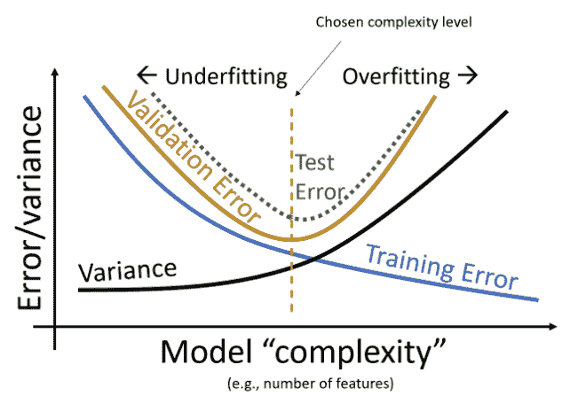

在今天的讲座中，我们将通过引入模型风险、观测方差、模型偏差和模型方差这些术语，探讨上面所见图表的更数学化版本。最终，我们将更新偏差-方差权衡图表，如下所示

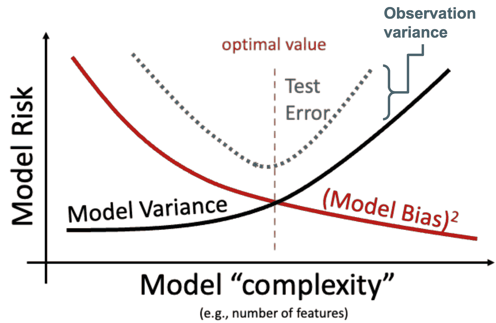

### 19.1.1 估计器的性能

假设我们想要使用估计器 $\hat{Y}(x)$ 估计目标 $Y$。对于我们训练的每个估计器，我们可以通过以下问题来确定模型的好坏：

+   我们平均得到正确答案吗？**(偏差)**

+   答案有多大的变化？**(方差)**

+   我们离 $Y$ 有多近？**(风险/MSE)**

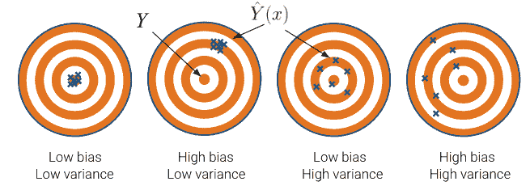

理想情况下，我们希望我们的估计器偏差和方差都很低，但我们如何在数学上量化呢？为此，让我们引入一些术语。

### 19.1.2 模型风险

**模型风险** 被定义为随机变量 $\hat{Y}$ 的均方预测误差。它是对我们拟合模型时可能得到的 *所有* 样本的期望，我们可以将其表示为随机变量 $X_1, X_2, \ldots, X_n, Y$。模型风险考虑了模型在理论上可能的任何样本上的表现，而不是我们收集到的具体数据。

$$ \text{模型风险} = E\left[(Y-\hat{Y(x)})^2\right] $$

模型风险所编码的错误的起源是什么？请注意，有两种类型的错误：

+   偶然误差：仅由随机性引起

    +   来源 1 **(观测方差)**：由于随机噪声 $\epsilon$ 导致新观测 $Y$ 的随机性

    +   来源 2 **(模型方差)**：在我们用来训练模型的样本中的随机性，因为样本 $X_1, X_2, \ldots, X_n, Y$ 是随机的

+   **(模型偏差)**：由于我们的模型与真实的基本函数 $g$ 不同而产生的非随机误差

回顾我们之前建立的数据生成过程。存在一个真实的基本关系 $g$，观察到的数据（带有随机噪声）$Y$，以及模型 $\hat{Y}$。

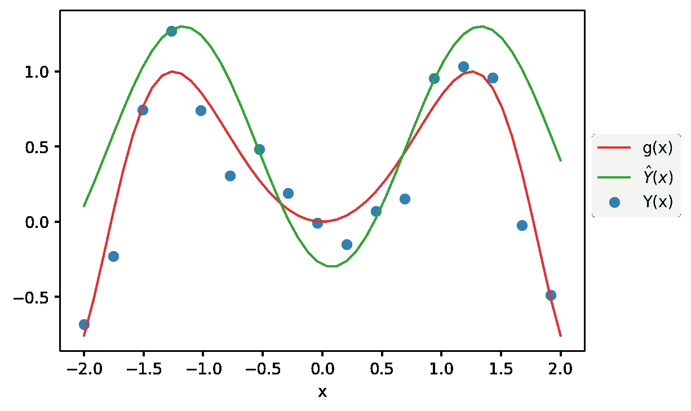

为了更好地理解模型风险，我们将放大上图中的一个数据点。

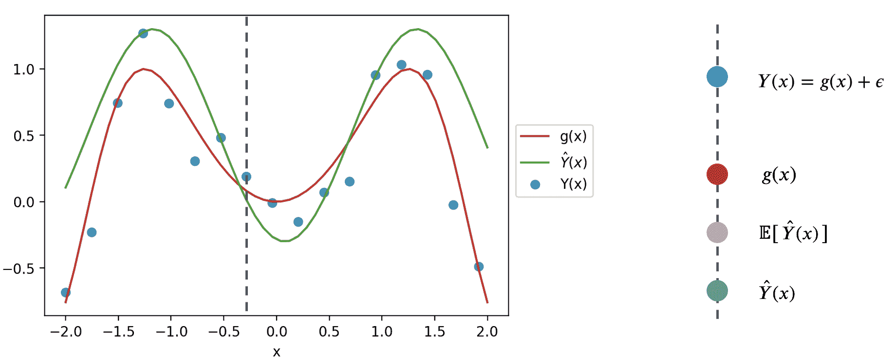

记住$\hat{Y}(x)$是一个随机变量 - 它是在用于训练的特定样本上拟合后对$x$的预测。如果我们使用不同的样本进行训练，可能会对这个值的预测进行不同的预测。为了捕捉这一点，上面的图考虑了对特定随机训练样本进行的预测$\hat{Y}(x)$，以及在所有可能的训练样本上的*预期*预测$E[\hat{Y}(x)]$。

我们可以使用这个简化的图表来将预测误差分解为更小的组件。首先，从单个预测的误差$Y(x)-\hat{Y}(x)$开始。

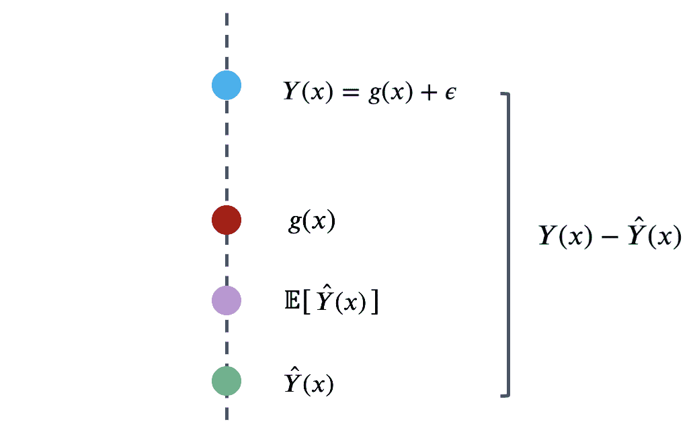

我们可以确定这个错误的三个组成部分。

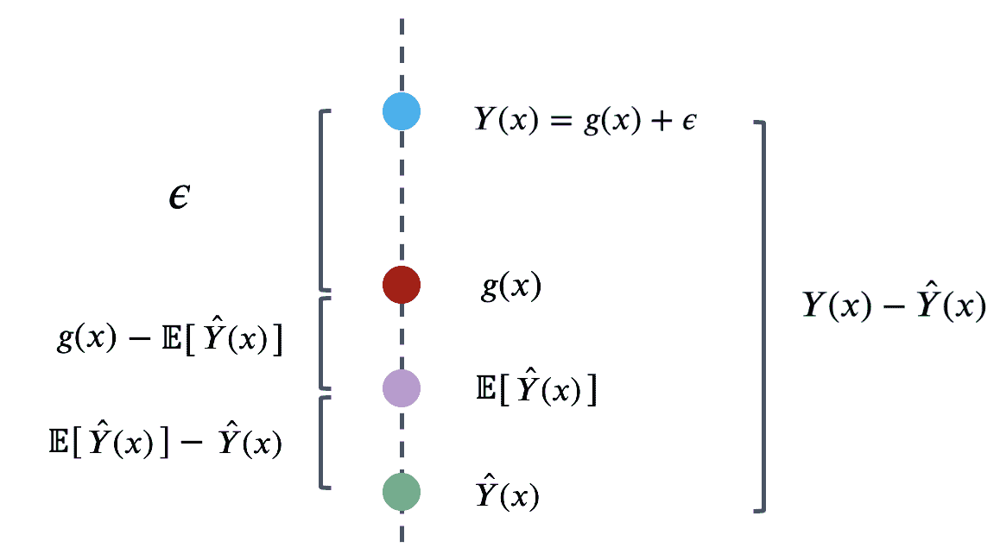

也就是说，错误可以写成：

$$Y(x)-\hat{Y}(x) = \epsilon + \left(g(x)-E\left[\hat{Y}(x)\right]\right) + \left(E\left[\hat{Y}(x)\right] - \hat{Y}(x)\right)$$ 

模型风险是上述表达式的平方的期望值，$E\left[(Y(x)-\hat{Y}(x))^2\right]$。如果我们两边平方，然后取期望值，我们将得到模型风险的以下分解：

$$E\left[(Y(x)-\hat{Y}(x))^2\right] = E[\epsilon^2] + \left(g(x)-E\left[\hat{Y}(x)\right]\right)^2 + E\left[\left(E\left[\hat{Y}(x)\right] - \hat{Y}(x)\right)^2\right]$$

看起来当我们平方右边时，我们缺少一些交叉乘积项，但事实证明所有这些交叉乘积项都为零。这门课程的详细推导超出了范围，但在本笔记的末尾包括了一个证明供您参考。

这个表达式乍一看可能很复杂，但实际上我们在本讲座中已经定义了每个术语！让我们逐个术语地来看。

#### 19.1.2.1 观察方差

上述分解中的第一项是$E[\epsilon^2]$。记住$\epsilon$是观察$Y$时的随机噪声，期望为$\mathbb{E}(\epsilon)=0$，方差为$\text{Var}(\epsilon) = \sigma^2$。我们可以证明$E[\epsilon^2]$是$\epsilon$的方差：$$ \begin{align*} \text{Var}(\epsilon) &= E[\epsilon^2] + \left(E[\epsilon]\right)^2\\ &= E[\epsilon^2] + 0^2\\ &= \sigma^2. \end{align*} $$

这个术语描述了每个观察中随机误差$\epsilon$（和$Y$）的变量。这被称为**观察方差**。它存在于我们的观察$Y$的随机性中。这是我们在抽样讲座中谈到的*偶然误差*的一种形式。

$$\text{观察方差} = \text{Var}(\epsilon) = \sigma^2.$$

观察方差是由观察数据时的测量误差或行为像噪声一样的缺失信息引起的。要减少这种观察方差，我们可以尝试获得更精确的测量，但这通常超出了数据科学家的控制范围。因此，观察方差$\sigma^2$有时被称为“不可减少的误差”。

#### 19.1.2.2 模型方差

然后我们来看最后一项：$E\left[\left(E\left[\hat{Y}(x)\right] - \hat{Y}(x)\right)^2\right]$。如果你回忆一下上一讲的方差的定义，这正是$\text{Var}(\hat{Y}(x))$。我们称之为**模型方差**。

它描述了当我们在不同样本上拟合模型时，预测$\hat{Y}(x)$往往变化多少。记住我们收集的样本可能会有很大的不同，因此预测$\hat{Y}(x)$也会有所不同。模型方差描述了由于我们抽样过程的随机性而产生的这种变异性。与观察方差一样，它也是一种*偶然误差* - 即使随机性的来源是不同的。

$$模型方差 = Var(\hat{Y}(x)) = E\left[\left(\hat{Y}(x) - E\left[\hat{Y}(x)\right]\right)^2\right]$$

模型方差较大的主要原因是**过拟合**：我们过于关注样本中的细节，导致随机样本中的微小差异导致拟合模型中的大差异。为了解决这个问题，我们尝试减少模型复杂性（例如去掉一些特征和限制估计模型系数的大小），并且不要在噪声上拟合我们的模型。

#### 19.1.2.3 模型偏差

最后，第二项是 $\left(g(x)-E\left[\hat{Y}(x)\right]\right)^2$。这是什么？术语 $E\left[\hat{Y}(x)\right] - g(x)$ 被称为**模型偏差**。

记住 $g(x)$ 是固定的基本真相，$\hat{Y}(x)$ 是我们拟合的模型，是随机的。因此，模型偏差衡量了 $g(x)$ 和 $\hat{Y}(x)$ 在所有可能样本上的平均偏差。

$$\text{模型偏差} = E\left[\hat{Y}(x) - g(x)\right] = E\left[\hat{Y}(x)\right] - g(x)$$

模型偏差不是随机的；它是特定个体 $x$ 的平均度量。如果偏差是正的，我们的模型倾向于高估 $g(x)$；如果是负的，我们的模型倾向于低估 $g(x)$。如果是 0，我们可以说我们的模型是**无偏的**。

*无偏估计* 

一个**无偏模型**具有 $\text{模型偏差 } = 0$。换句话说，我们的模型平均预测 $g(x)$。

类似地，我们可以为估计量定义偏差，比如均值。样本均值是总体均值的**无偏估计**，因为根据中心极限定理，$\mathbb{E}[\bar{X}_n] = \mu$。因此，$\text{估计器偏差 } = \mathbb{E}[\bar{X}_n] - \mu = 0$.

模型偏差较大的两个主要原因是：

+   拟合不足：我们的模型对数据来说太简单。

+   缺乏领域知识：我们不了解哪些特征对响应变量有用

为了解决这个问题，我们增加模型复杂性（但我们不想过拟合！）或请教领域专家，看看哪些模型是合理的。你可以开始看到这里的权衡：如果我们增加模型复杂性，我们会减少模型偏差，但我们也会增加模型方差。

### 19.1.3 分解

总结一下：

+   **模型风险**，$\mathbb{E}\left[(Y(x)-\hat{Y}(x))^2\right]$，是模型的平均预测误差的平方。

+   **观测方差**，$\sigma^2$，是观测中随机噪声的方差。它描述了每个观测中随机误差 $\epsilon$ 的变化程度。

+   **模型偏差**，$\mathbb{E}\left[\hat{Y}(x)\right]-g(x)$，是 $\hat{Y}(x)$ 作为真实基本关系 $g(x)$ 估计量的“偏离”程度。

+   **模型方差**，$\text{Var}(\hat{Y}(x))$，描述了当我们在不同样本上拟合模型时，预测 $\hat{Y}(x)$ 倾向于变化的程度。

上述定义使我们能够在之前简化模型风险的分解：

$$ E[(Y(x) - \hat{Y}(x))^2] = \sigma^2 + (E[\hat{Y}(x)] - g(x))^2 + \text{Var}(\hat{Y}(x)) $$ 

$$\text{模型风险 } = \text{观测方差} + (\text{模型偏差})^2 \text{+ 模型方差}$$

这被称为**偏差-方差权衡**。这是什么意思？记住，模型风险是模型性能的一个度量。我们建模的目标是保持模型风险低；这意味着我们希望确保模型风险的每个组成部分都保持在一个小的值。

观测方差是数据收集过程中固有的随机部分。我们无法减少观测方差，所以我们将把注意力集中在模型偏差和模型方差上。

在特征工程讲座中，我们考虑了过拟合的问题。我们发现，随着模型复杂度的增加，模型的误差或偏差往往会减少 - 如果我们设计一个非常复杂的模型，它往往会倾向于做出更接近真实关系$g$的预测。与此同时，模型方差往往会*增加*随着模型复杂度的增加；复杂模型可能会对训练数据过拟合，这意味着用于训练的随机样本的微小差异会导致拟合模型的巨大差异。我们有一个问题。为了减少模型偏差，我们可以增加模型的复杂度，这将导致过拟合和模型方差的增加。或者，我们可以通过减少模型的复杂度来减少模型方差，但这会增加由于欠拟合而产生的模型偏差。


我们需要取得平衡。我们在模型创建中的目标是使用足够高的复杂度水平来保持偏差低，但不要太高以至于模型方差很大。

## 19.2 解释回归系数

回想一下我们在本讲座中建立的框架。如果我们假设观察值和输入特征之间的潜在关系是线性的，我们可以用未知的真实模型参数$\theta$来表达这种关系。

$$f_{\theta}(x) = g(x) + \epsilon = \theta_0 + \theta_1 x_1 + \ldots + \theta_p x_p + \epsilon$$

我们的模型试图使用从设计矩阵$\Bbb{X}$和响应向量$\Bbb{Y}$计算出的估计值$\hat{\theta}_i$来估计每个真实参数$\theta_i$。

$$f_{\hat{\theta}}(x) = \hat{\theta}_0 + \hat{\theta}_1 x_1 + \ldots + \hat{\theta}_p x_p$$

让我们暂停一下。在这一点上，我们非常习惯于使用模型参数的概念。但是每个系数$\theta_i$实际上*意味着*什么呢？我们可以将每个$\theta_i$看作线性模型的*斜率* - 如果所有其他变量保持不变，$x_i$的单位变化将导致$f_{\theta}(x)$中的$\theta_i$变化。广义上讲，$\theta_i$的值越大，意味着特征$x_i$对响应的影响越大；相反，$\theta_i$的值越小，意味着$x_i$对响应的影响越小。在极端情况下，如果真实参数$\theta_i$为 0，则特征$x_i$对$Y(x)$没有**影响**。

如果某个特定特征的真实参数$\theta_i$为 0，这告诉我们一些非常重要的事情：$x_i$和$Y(x)$之间没有潜在关系！那么，我们如何测试参数是否为 0 呢？作为基线，我们按照通常的流程抽取样本，使用这些数据拟合模型，并计算估计值$\hat{\theta}_i$。然而，我们还需要考虑这样一个事实，即如果我们的随机样本结果不同，我们可能会得到不同的$\hat{\theta}_i$结果。为了推断真实参数$\theta_i$是否为 0，我们希望从我们可能在所有其他随机样本中抽取的$\hat{\theta}_i$估计的分布中得出结论。这就是[假设检验](https://inferentialthinking.com/chapters/11/Testing_Hypotheses.html)派上用场的地方！

测试真实参数$\theta_i$是否为 0，我们构建一个**假设检验**，其中零假设表明真实参数$\theta_i$为 0，备择假设表明真实参数$\theta_i$ *不是* 0。如果我们的 p 值小于我们的截断值（通常 p=0.05），我们拒绝零假设。

## 19.3 通过 Bootstrap 进行假设检验：PurpleAir 演示

执行上述假设检验的一个等价方法是通过**自举**（可以通过[对偶论证](https://stats.stackexchange.com/questions/179902/confidence-interval-p-value-duality-vs-frequentist-interpretation-of-cis)证明这种等价性，这超出了本课程的范围）。我们使用自举来计算每个$\theta_i$的近似 95%置信区间。如果区间不包含 0，我们在 5%的水平上拒绝零假设。否则，数据与零假设一致，因为真实参数*可能*为 0。

为了展示这个假设检验过程的一个例子，我们将在本节中使用[雪鸻](https://www.audubon.org/field-guide/bird/snowy-plover)数据集。这些数据是关于雪鸻的蛋和新孵出的雏鸟。这些数据是由伯克利的一位前[学生](https://openlibrary.org/books/OL2038693M/BLSS_the_Berkeley_interactive_statistical_system)在雷耶斯角国家海岸收集的。这是一个[父母鸟和一些蛋](http://cescos.fau.edu/jay/eps/articles/snowyplover.html)。


请注意，`蛋长`和`蛋宽`（最宽直径）以毫米为单位测量，`蛋重`和`鸟重`以克为单位测量；作为比较，一个标准的回形针重约一克。

代码

```py
# import numpy as np
# import pandas as pd
# import matplotlib
# import matplotlib.pyplot as plt
# import seaborn as sns
# import sklearn.linear_model as lm
# from sklearn.linear_model import LinearRegression

# # big font helper
# def adjust_fontsize(size=None):
#     SMALL_SIZE = 8
#     MEDIUM_SIZE = 10
#     BIGGER_SIZE = 12
#     if size != None:
#         SMALL_SIZE = MEDIUM_SIZE = BIGGER_SIZE = size

#     plt.rc('font', size=SMALL_SIZE)          # controls default text sizes
#     plt.rc('axes', titlesize=SMALL_SIZE)     # fontsize of the axes title
#     plt.rc('axes', labelsize=MEDIUM_SIZE)    # fontsize of the x and y labels
#     plt.rc('xtick', labelsize=SMALL_SIZE)    # fontsize of the tick labels
#     plt.rc('ytick', labelsize=SMALL_SIZE)    # fontsize of the tick labels
#     plt.rc('legend', fontsize=SMALL_SIZE)    # legend fontsize
#     plt.rc('figure', titlesize=BIGGER_SIZE)  # fontsize of the figure title

# plt.style.use('fivethirtyeight')
# sns.set_context("talk")
# sns.set_theme()
# #plt.style.use('default') # revert style to default mpl
# adjust_fontsize(size=20)
# %matplotlib inline
# csv_file = 'data/Full24hrdataset.csv'
# usecols = ['Date', 'ID', 'region', 'PM25FM', 'PM25cf1', 'TempC', 'RH', 'Dewpoint']
# full_df = (pd.read_csv(csv_file, usecols=usecols, parse_dates=['Date'])
#         .dropna())
# full_df.columns = ['date', 'id', 'region', 'pm25aqs', 'pm25pa', 'temp', 'rh', 'dew']
# full_df = full_df.loc[(full_df['pm25aqs'] < 50)]

# bad_dates = ['2019-08-21', '2019-08-22', '2019-09-24']
# GA = full_df.loc[(full_df['id'] == 'GA1') & (~full_df['date'].isin(bad_dates)) , :]
# AQS, PA = GA[['pm25aqs']], GA['pm25pa']
# AQS.head()
# pd.DataFrame(PA).head()
```

```py
import pandas as pd
eggs = pd.read_csv("data/snowy_plover.csv")
eggs.head(5)
```

|  | egg_weight | egg_length | egg_breadth | bird_weight |
| --- | --- | --- | --- | --- |
| 0 | 7.4 | 28.80 | 21.84 | 5.2 |
| 1 | 7.7 | 29.04 | 22.45 | 5.4 |
| 2 | 7.9 | 29.36 | 22.48 | 5.6 |
| 3 | 7.5 | 30.10 | 21.71 | 5.3 |
| 4 | 8.3 | 30.17 | 22.75 | 5.9 |

我们的目标是预测新生雪鸻雏鸟的重量，我们假设其遵循下面的真实关系$Y = f_{\theta}(x)$。

$$\text{bird\_weight} = \theta_0 + \theta_1 \text{egg\_weight} + \theta_2 \text{egg\_length} + \theta_3 \text{egg\_breadth} + \epsilon$$

+   对于每个$i$，参数$\theta_i$是一个固定的数字，但是不可观测的。我们只能估计它。

+   随机误差$\epsilon$也是不可观测的，但假定其期望为 0，并且在蛋中是独立且同分布的。

假设我们希望确定`蛋重`是否影响雏鸟的`鸟重`-我们想推断$\theta_1$是否等于 0。

首先，我们定义我们的假设：

+   **零假设**：真实参数$\theta_1$为 0；任何变化都是由随机机会引起的。

+   **备择假设**：真实参数$\theta_1$不为 0。

接下来，我们使用我们的数据来拟合一个模型$\hat{Y} = f_{\hat{\theta}}(x)$，该模型近似上面的关系。这给我们了$\hat{\theta}_1$的**观察值**，从我们的数据中找到。

```py
from sklearn.linear_model import LinearRegression
import numpy as np

X = eggs[["egg_weight", "egg_length", "egg_breadth"]]
Y = eggs["bird_weight"]

model = LinearRegression()
model.fit(X, Y)

# This gives an array containing the fitted model parameter estimates
thetas = model.coef_

# Put the parameter estimates in a nice table for viewing
display(pd.DataFrame([model.intercept_] + list(model.coef_),
 columns=['theta_hat'],
 index=['intercept', 'egg_weight', 'egg_length', 'egg_breadth']))

print("RMSE", np.mean((Y - model.predict(X)) ** 2))
```

|  | $\hat{\theta}$ |
| --- | --- |
| intercept | -4.605670 |
| egg_weight | 0.431229 |
| egg_length | 0.066570 |
| egg_breadth | 0.215914 |

```py
RMSE 0.04547085380275766
```

现在我们有了$\hat{\theta}_1$的值，考虑到我们拥有的单个数据样本。为了了解如果我们抽取不同的随机样本，这个估计可能会如何变化，我们将使用**[自举](https://inferentialthinking.com/chapters/13/2/Bootstrap.html?)**。为了构建一个自举样本，我们将从收集到的数据中抽取一个重采样：

+   具有与收集到的数据相同的样本大小

+   用替换的方式抽取（这确保我们不会每次抽取完全相同的样本！）

我们抽取一个自举样本，使用这个样本来拟合一个模型，并记录在这个自举样本上的$\hat{\theta}_1$的结果。然后我们重复这个过程很多次，以生成$\hat{\theta}_1$的**自举经验分布**。这给我们一个估计，即真实分布$\hat{\theta}_1$在所有可能的样本中可能是什么样子。

```py
# Set a random seed so you generate the same random sample as staff
# In the "real world", we wouldn't do this
import numpy as np
np.random.seed(1337)

# Set the sample size of each bootstrap sample
n = len(eggs)

# Create a list to store all the bootstrapped estimates
estimates = []

# Generate a bootstrap resample from `eggs` and find an estimate for theta_1 using this sample. 
# Repeat 10000 times.
for i in range(10000):
 bootstrap_resample = eggs.sample(n, replace=True)
 X_bootstrap = bootstrap_resample[["egg_weight", "egg_length", "egg_breadth"]]
 Y_bootstrap = bootstrap_resample["bird_weight"]

 bootstrap_model = LinearRegression()
 bootstrap_model.fit(X_bootstrap, Y_bootstrap)
 bootstrap_thetas = bootstrap_model.coef_

 estimates.append(bootstrap_thetas[0])

# calculate the 95% confidence interval 
lower = np.percentile(estimates, 2.5, axis=0)
upper = np.percentile(estimates, 97.5, axis=0)
conf_interval = (lower, upper)
conf_interval
```

```py
(-0.25864811956848754, 1.1034243854204049)
```

我们发现，我们的自举近似 95%置信区间为$[-0.259, 1.103]$。立即可以看到 0 确实包含在这个区间内 - 这意味着我们*无法*断定$\theta_1$不为零！更正式地说，我们未能拒绝零假设（即$\theta_1$为 0）在 5%的 p 值截断下。

## 19.4 共线性

我们可以重复这个过程，为模型的其他参数构建 95%置信区间。

代码

```py
np.random.seed(1337)

theta_0_estimates = []
theta_1_estimates = []
theta_2_estimates = []
theta_3_estimates = []

for i in range(10000):
 bootstrap_resample = eggs.sample(n, replace=True)
 X_bootstrap = bootstrap_resample[["egg_weight", "egg_length", "egg_breadth"]]
 Y_bootstrap = bootstrap_resample["bird_weight"]

 bootstrap_model = LinearRegression()
 bootstrap_model.fit(X_bootstrap, Y_bootstrap)
 bootstrap_theta_0 = bootstrap_model.intercept_
 bootstrap_theta_1, bootstrap_theta_2, bootstrap_theta_3 = bootstrap_model.coef_

 theta_0_estimates.append(bootstrap_theta_0)
 theta_1_estimates.append(bootstrap_theta_1)
 theta_2_estimates.append(bootstrap_theta_2)
 theta_3_estimates.append(bootstrap_theta_3)

theta_0_lower, theta_0_upper = np.percentile(theta_0_estimates, 2.5), np.percentile(theta_0_estimates, 97.5)
theta_1_lower, theta_1_upper = np.percentile(theta_1_estimates, 2.5), np.percentile(theta_1_estimates, 97.5)
theta_2_lower, theta_2_upper = np.percentile(theta_2_estimates, 2.5), np.percentile(theta_2_estimates, 97.5)
theta_3_lower, theta_3_upper = np.percentile(theta_3_estimates, 2.5), np.percentile(theta_3_estimates, 97.5)

# Make a nice table to view results
pd.DataFrame({"lower":[theta_0_lower, theta_1_lower, theta_2_lower, theta_3_lower], "upper":[theta_0_upper, \
 theta_1_upper, theta_2_upper, theta_3_upper]}, index=["theta_0", "theta_1", "theta_2", "theta_3"])
```

|  | lower | upper |
| --- | --- | --- |
| theta_0 | -15.278542 | 5.161473 |
| theta_1 | -0.258648 | 1.103424 |
| theta_2 | -0.099138 | 0.208557 |
| theta_3 | -0.257141 | 0.758155 |

这里有些不对劲。注意到在模型的每个参数的 95%置信区间中都包含了 0。根据我们上面概述的解释，这意味着我们无法确定*任何*输入变量对响应变量的影响！这似乎表明我们的模型无法进行任何预测 - 然而，我们在上面的自助法实验中拟合的每个模型都可以非常好地预测$Y$。

我们如何解释这个结果？回想一下我们如何解释线性模型的参数。我们将每个$\theta_i$都视为斜率，其中$x_i$的单位增加导致$Y$的$\theta_i$增加，**如果所有其他变量保持不变**。事实证明，最后这个假设非常重要。如果我们模型中的变量某种程度上相关，那么在保持其他变量不变的情况下可能不可能改变其中一个变量。这意味着我们的解释框架不再有效！在我们上面拟合的模型中，我们将`egg_length`、`egg_breadth`和`egg_weight`作为输入变量。这些变量很可能彼此相关 - 一个具有较大`egg_length`和`egg_breadth`的蛋很可能在`egg_weight`上很重。这意味着模型参数不能被有意义地解释为斜率。

为了支持这个结论，我们可以可视化我们的特征变量之间的关系。注意特征之间的强正相关。

代码

```py
import seaborn as sns
sns.pairplot(eggs[["egg_length", "egg_breadth", "egg_weight", 'bird_weight']]);
```

```py
/Users/Ishani/micromamba/lib/python3.9/site-packages/seaborn/axisgrid.py:118: UserWarning:

The figure layout has changed to tight 
```

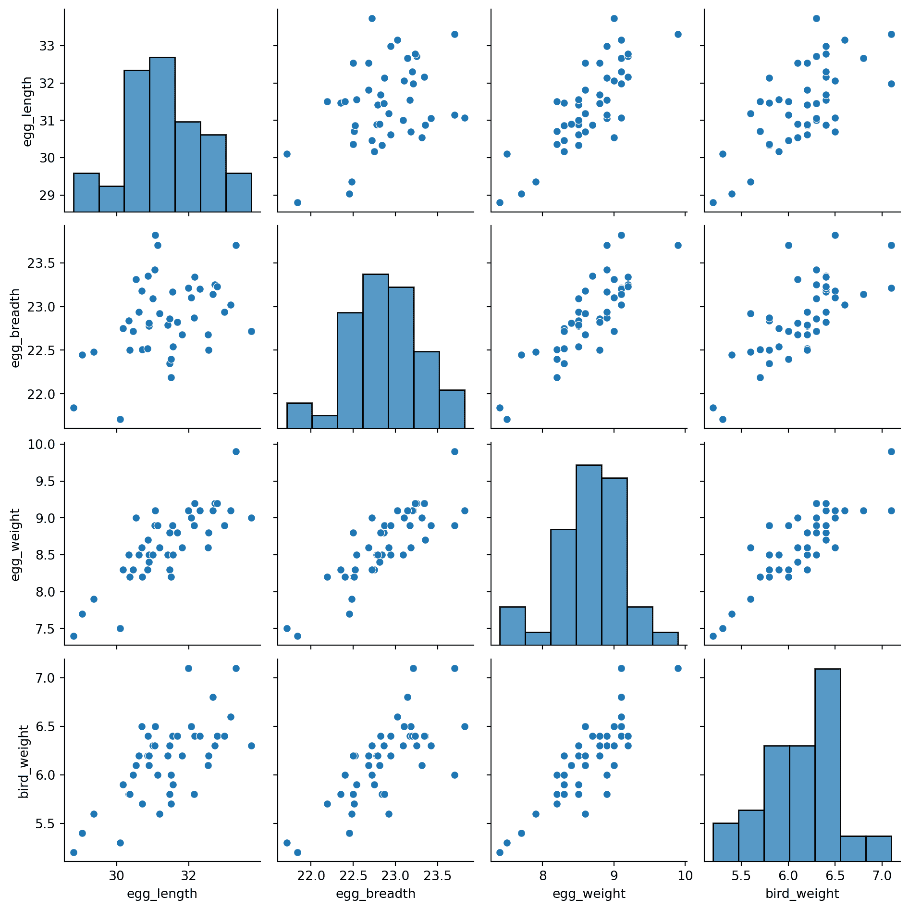

这个问题被称为**共线性**，有时也被称为**多重共线性**。当一个特征与其他特征高度相关时，就会发生共线性，这意味着一个特征可以被其他特征的线性组合相当准确地预测。

为什么共线性是一个问题？它的后果涵盖了建模过程的几个方面：

+   **推断**：斜率不能用于推断任务。

+   **模型方差**：如果特征彼此强烈影响，即使在采样数据中进行微小的变化也可能导致估计斜率的大幅变化。

+   **唯一解**：如果一个特征是其他特征的线性组合，设计矩阵将不是满秩的，$\mathbb{X}^{\top}\mathbb{X}$就不可逆。这意味着最小二乘法没有唯一解。

重点是，我们需要小心选择建模的特征。如果两个特征很可能编码相似的信息，通常最好只选择其中一个作为输入变量。

### 19.4.1 一个更简单的模型

让我们现在考虑一个更易解释的模型：我们假设真实关系只使用蛋重：

$$f_\theta(x) = \theta_0 + \theta_1 \text{egg\_weight} + \epsilon$$

代码

```py
from sklearn.linear_model import LinearRegression
X_int = eggs[["egg_weight"]]
Y_int = eggs["bird_weight"]

model_int = LinearRegression()

model_int.fit(X_int, Y_int)

# This gives an array containing the fitted model parameter estimates
thetas_int = model_int.coef_

# Put the parameter estimates in a nice table for viewing
pd.DataFrame({"theta_hat":[model_int.intercept_, thetas_int[0]]}, index=["theta_0", "theta_1"])
```

|  | theta_hat |
| --- | --- |
| theta_0 | -0.058272 |
| theta_1 | 0.718515 |

```py
import matplotlib.pyplot as plt

# Set a random seed so you generate the same random sample as staff
# In the "real world", we wouldn't do this
np.random.seed(1337)

# Set the sample size of each bootstrap sample
n = len(eggs)

# Create a list to store all the bootstrapped estimates
estimates_int = []

# Generate a bootstrap resample from `eggs` and find an estimate for theta_1 using this sample. 
# Repeat 10000 times.
for i in range(10000):
 bootstrap_resample_int = eggs.sample(n, replace=True)
 X_bootstrap_int = bootstrap_resample_int[["egg_weight"]]
 Y_bootstrap_int = bootstrap_resample_int["bird_weight"]

 bootstrap_model_int = LinearRegression()
 bootstrap_model_int.fit(X_bootstrap_int, Y_bootstrap_int)
 bootstrap_thetas_int = bootstrap_model_int.coef_

 estimates_int.append(bootstrap_thetas_int[0])

plt.figure(dpi=120)
sns.histplot(estimates_int, stat="density")
plt.xlabel(r"$\hat{\theta}_1$")
plt.title(r"Bootstrapped estimates $\hat{\theta}_1$ Under the Interpretable Model");
```

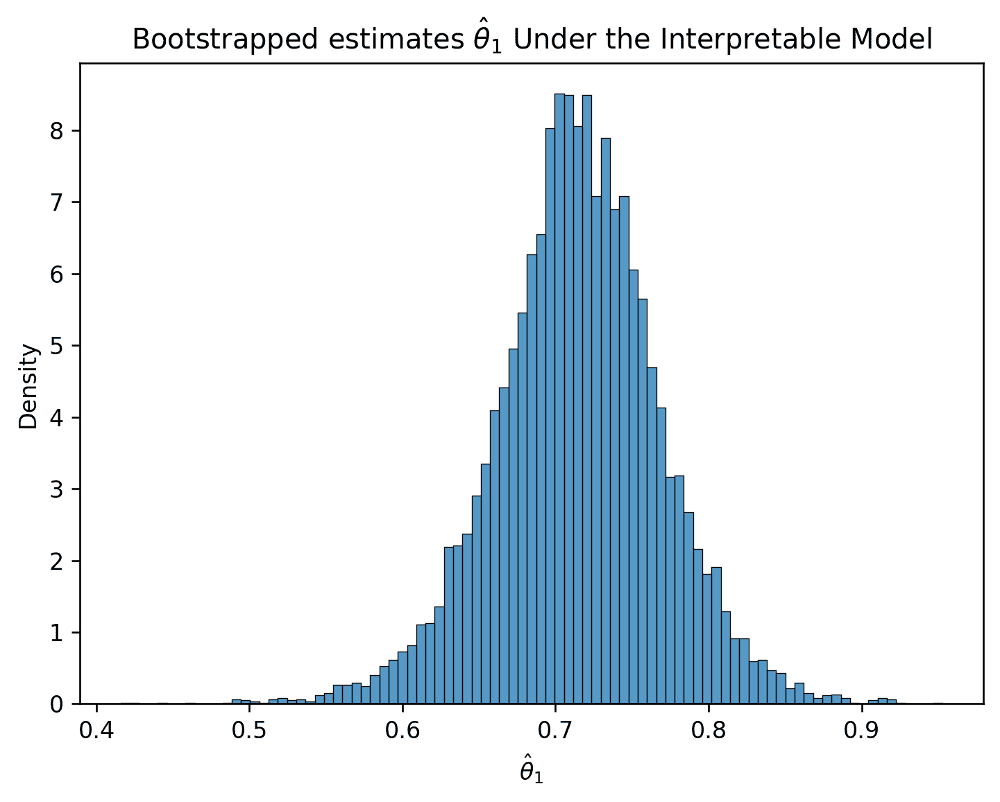

注意可解释模型的表现几乎与我们的其他模型一样好：

代码

```py
from sklearn.metrics import mean_squared_error

rmse = mean_squared_error(Y, model.predict(X))
rmse_int = mean_squared_error(Y_int, model_int.predict(X_int))
print(f'RMSE of Original Model: {rmse}')
print(f'RMSE of Interpretable Model: {rmse_int}')
```

```py
RMSE of Original Model: 0.04547085380275766
RMSE of Interpretable Model: 0.046493941375556846
```

然而，真实参数$\theta_{1}$的置信区间不包含零。

代码

```py
lower_int = np.percentile(estimates_int, 2.5)
upper_int = np.percentile(estimates_int, 97.5)

conf_interval_int = (lower_int, upper_int)
conf_interval_int
```

```py
(0.6029335250209633, 0.8208401738546206)
```

回顾来看，母鸡的重量最能预测新生小鸡的重量，这并不奇怪。

高度相关变量的模型会阻止我们解释变量与预测之间的关系。

### 19.4.2 提醒：假设很重要

请记住：所有推断都假设回归模型成立。

+   如果模型不成立，推断可能无效。

+   如果[自助法的假设](https://inferentialthinking.com/chapters/13/3/Confidence_Intervals.html?highlight=p%20value%20confidence%20interval#care-in-using-the-bootstrap-percentile-method)不成立…

    +   样本量 n 很大

    +   样本代表人口分布（随机抽取，无偏）…那么自助法的结果可能无效。

## 19.5（奖励）相关性与因果

让我们考虑一个任意回归问题中的一些问题。

在我们的回归中，$\theta_{j}$代表什么？

+   在保持其他变量不变的情况下，我们的预测应该随着$X_{j}$的变化而变化多少？

对于简单线性回归，这归结为相关系数

+   拥有更多的$x$是否预测更多的$y$（以及预测多少）？

**例子：**

+   拥有花岗岩台面的房屋是否更值钱？

+   获得某项奖学金的学生的大学 GPA 是否更高？

+   母乳喂养的婴儿更不容易患哮喘吗？

+   接受某种激进治疗的癌症患者是否有更高的 5 年生存率？

+   吸烟的人更容易患癌症吗？

这些听起来像是因果问题，但实际上并不是！

### 19.5.1 预测与因果

相关性/预测与因果之间的区别最好通过例子来说明。

一些关于**相关性/预测**的问题包括：

+   拥有花岗岩台面的房屋是否更值钱？

+   获得某项奖学金的学生的大学 GPA 是否更高？

+   母乳喂养的婴儿更不容易患哮喘吗？

+   接受某种激进治疗的癌症患者是否有更高的 5 年生存率？

+   吸烟的人更容易患癌症吗？

一些关于**因果关系**的问题包括：

+   花岗岩台面会**提高**房屋的价值多少？

+   获得奖学金是否**提高**了学生的 GPA？

+   母乳喂养是否**保护**婴儿免受哮喘？

+   治疗是否**提高**了癌症的生存率？

+   吸烟是否**导致**癌症？

因果问题涉及**干预**的**效果**（不仅仅是被动观察）。但需要注意的是，回归系数有时被称为“效果”，这可能是误导性的！

仅使用数据时，可以回答**预测性问题**（即母乳喂养的婴儿更健康吗？），但无法回答**因果问题**（即母乳喂养是否改善了婴儿的健康？）。原因在于我们的预测问题有许多可能的原因。例如，母乳喂养的婴儿平均更健康的可能解释包括：

1.  **因果效应：** 母乳喂养使婴儿更健康

1.  **逆因果关系：** 更健康的婴儿更有可能成功母乳喂养

1.  **共同原因：** 更健康/更富有的父母有更健康的婴儿，并更有可能母乳喂养

我们不能仅通过观察（$x$,$y$）对来判断哪些解释是真实的（或在多大程度上是真实的）。

此外，因果问题隐含地涉及**反事实**，即未发生的事件。例如，我们可以问，**如果**母乳喂养的婴儿没有被母乳喂养，他们是否会更健康？上面的解释 1 意味着他们会更健康，但解释 2 和 3 则不是。

### 19.5.2 混杂因素

让 T 代表一种治疗（例如，饮酒），Y 代表一个结果（例如，肺癌）。

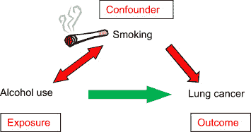

**混杂变量**是影响 T 和 Y 的变量，扭曲它们之间的相关性。使用上面的例子。混杂因素可以是一个已测量的协变量或者是我们不知道的未测量变量，它们通常会引起问题，因为 T 和 Y 之间的关系实际上受到我们看不到的数据的影响。

**常见假设：**所有混杂因素都是被观察到的（**可忽略性**）

### 19.5.3 术语

让我们定义一些术语，这些术语将帮助我们理解因果效应。

在预测中，我们有两种变量：

+   **响应** ($Y$)：我们试图预测的内容

+   **预测变量** ($X$)：我们预测的输入

因果推断中的其他变量包括：

+   **响应** ($Y$)：我们感兴趣的结果

+   **处理** ($T$)：我们可能进行干预的变量

+   **协变量** ($X$)：我们测量的其他可能影响$T$和/或$Y$的变量

对于本讲座，$T$是一个**二元（0/1）**变量：

### 19.5.4 Neyman-Rubin 因果模型

因果问题涉及**反事实**：

+   如果 T 不同会发生什么？

+   如果我们将来设定 T 会发生什么？

我们假设每个个体都有两个**潜在结果**：

+   $Y_{i}(1)$：如果$T_{i} = 1$的话，$y_{i}$的值（**受治疗结果**）

+   $Y_{i}(0)$：如果$T_{i} = 0$的话，$y_{i}$的值（**对照结果**）

对于数据集中的每个个体，我们观察到：

+   协变量$x_{i}$

+   处理$T_{i}$

+   响应$y_{i} = Y_{i}(T_{i})$

我们假设对于$i = 1,..., n$，($x_{i}$, $T_{i}$, $y_{i} = Y_{i}(T_{i})$)元组是独立同分布的

### 19.5.5 平均处理效应

对于每个个体，**处理效应**是$Y_{i}(1)-Y_{i}(0)$

最常见的估计是**平均处理效应（ATE）**

$$ATE = \mathbb{E}[Y(1)-Y(0)] = \mathbb{E}[Y(1)] - \mathbb{E}[Y(0)]$$

我们能否只取样本均值？

$$\hat{ATE} = \frac{1}{n}\sum_{i=1}^{n}Y_{i}(1) - Y_{i}(0)$$

我们不能。为什么？我们只观察到$Y_{i}(1)$，$Y_{i}(0)$中的一个。

**因果推断的基本问题：**我们只能观察到一个潜在结果

要得出因果结论，我们需要一些关于观察到的和未观察到的单位之间的因果假设

与其$\frac{1}{n}\sum_{i=1}^{n}Y_{i}(1) - Y_{i}(0)$，不如我们取每组的样本均值之间的差异？

$$\hat{ATE} = \frac{1}{n_{1}}\sum_{i: T_{i} = 1}{Y_{i}(1)} - \frac{1}{n_{0}}\sum_{i: T_{i} = 0}{Y_{i}(0)} = \frac{1}{n_{1}}\sum_{i: T_{i} = 1}{y_{i}} - \frac{1}{n_{0}}\sum_{i: T_{i} = 0}{y_{i}}$$

这个$ATE$的估计是否无偏？因此，这个提出的$\hat{ATE}$不适合我们的目的。

如果处理分配来自随机抛硬币，那么受治疗单位是来自$Y_{i}(1)$总体的大小为$n_{1}$的独立同分布随机样本。

这意味着，

$$\mathbb{E}[\frac{1}{n_{1}}\sum_{i: T_{i} = 1}{y_{i}}] = \mathbb{E}[Y_{i}(1)]$$

同样地，

$$\mathbb{E}[\frac{1}{n_{0}}\sum_{i: T_{i} = 0}{y_{i}}] = \mathbb{E}[Y_{i}(0)]$$

这使我们得出结论，$\hat{ATE}$是$ATE$的无偏估计：

$$\mathbb{E}[\hat{ATE}] = ATE$$

### 19.5.6 随机实验

然而，通常随机分配处理是不切实际或不道德的。例如，分配香烟治疗可能是不切实际和不道德的。

绕过这个问题的另一种方法是利用**观测研究**。

实验：

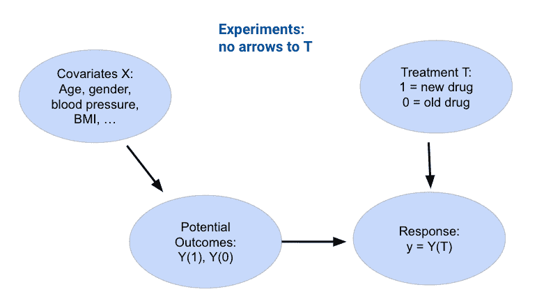

观测研究：

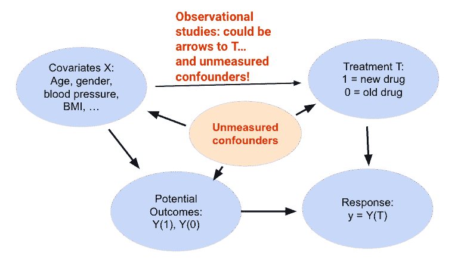

### 19.5.7 协变量调整

对于混杂因素该怎么办？

+   **可忽略性假设：**所有重要的混杂因素都在数据集中！

**一个想法：**提出一个包括它们的模型，比如：

$$Y_{i}(t) = \theta_{0} + \theta_{1}x_{1} + ... + \theta_{p}x_{p} + \tau{t} + \epsilon$$

**问题：**在这个模型中$ATE$是多少？$\tau$

这种方法可能有效，但是**脆弱**。如果：

+   重要的协变量缺失或者对$x$的真实依赖是非线性的

+   有时被贬低地称为**“因果推断”**

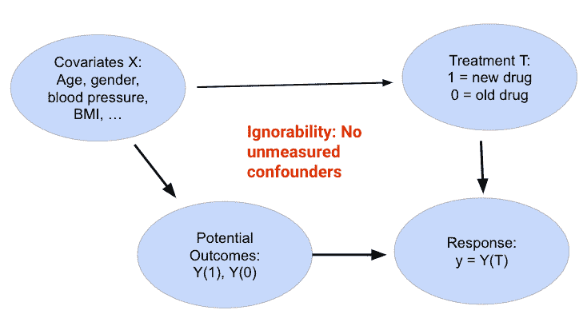

#### 19.5.7.1 不需要参数假设的协变量调整

对混杂因素怎么办？

+   **可忽略性假设：**数据集中包含所有可能的混杂因素！

**一个想法：**提出一个包括它们的模型，比如：

$$Y_{i}(t) = f_{\theta}(x, t) + \epsilon$$

然后：

$$ATE = \frac{1}{n}\sum_{i=1}^{n}{f_{\theta}(x_i, 1) - f_{\theta}(x_i, 0)}$$

有了足够的数据，我们可能能够非常准确地学习$f_{\theta}$

+   如果$x$是高维的/其函数形式高度非线性，则非常困难

+   需要额外的假设：**重叠**

### 19.5.8 其他方法

因果推断很难，协变量调整通常不是最佳方法

许多其他方法是一些组合：

+   将处理 T 建模为协变量 x 的函数

+   将结果 y 建模为 x，T 的函数

如果我们不相信可忽略性呢？其他方法寻找一个

+   最喜欢的例子：**回归不连续**

## 19.6（奖励）偏差-方差分解的证明

本节详细推导了偏差-方差分解在前面笔记中的偏差-方差权衡部分。

*点击显示*

我们想证明模型风险可以分解为

$$ \begin{align*} E\left[(Y(x)-\hat{Y}(x))^2\right] &= E[\epsilon^2] + \left(g(x)-E\left[\hat{Y}(x)\right]\right)^2 + E\left[\left(E\left[\hat{Y}(x)\right] - \hat{Y}(x)\right)^2\right]. \end{align*} $$

为了证明这一点，我们首先需要以下引理：

如果$V$和$W$是独立的随机变量，则$E[VW] = E[V]E[W]$。

我们将在离散有限的情况下证明这一点。相信它在更广泛的情况下也是成立的。

工作是计算$VW$值的加权平均值，其中权重是这些值的概率。开始吧。

$$\begin{align*} E[VW] ~ &= ~ \sum_v\sum_w vwP(V=v \text{ and } W=w) \\ &= ~ \sum_v\sum_w vwP(V=v)P(W=w) ~~~~ \text{根据独立性} \\ &= ~ \sum_v vP(V=v)\sum_w wP(W=w) \\ &= ~ E[V]E[W] \end{align*}$$

现在我们进入实际的证明：

### 19.6.1 目标

将模型风险分解为可识别的组成部分。

### 19.6.2 步骤 1

$$ \begin{align*} \text{模型风险} ~ &= ~ E\left[\left(Y - \hat{Y}(x)\right)^2 \right] \\ &= ~ E\left[\left(g(x) + \epsilon - \hat{Y}(x)\right)^2 \right] \\ &= ~ E\left[\left(\epsilon + \left(g(x)- \hat{Y}(x)\right)\right)^2 \right] \\ &= ~ E\left[\epsilon^2\right] + 2E\left[\epsilon \left(g(x)- \hat{Y}(x)\right)\right] + E\left[\left(g(x) - \hat{Y}(x)\right)^2\right]\\ \end{align*} $$

右边：

+   第一项是观测方差$\sigma^2$。

+   交叉乘积项为 0，因为$\epsilon$与$g(x) - \hat{Y}(x)$独立，且$E(\epsilon) = 0$

+   最后一项是我们预测值与$x$处真实函数值之间的均方差差

### 19.6.3 步骤 2

到这个阶段我们有

$$ \text{模型风险} ~ = ~ E\left[\epsilon^2\right] + E\left[\left(g(x) - \hat{Y}(x)\right)^2\right] $$

我们还不太了解$g(x) - \hat{Y}(x)$。但我们了解偏差$D_{\hat{Y}(x)} = \hat{Y}(x) - E\left[\hat{Y}(x)\right]$。我们知道

+   $E\left[D_{\hat{Y}(x)}\right] ~ = ~ 0$

+   $E\left[D_{\hat{Y}(x)}^2\right] ~ = ~ \text{模型方差}$

因此，让我们添加并减去$E\left[\hat{Y}(x)\right]，看看是否有帮助。

$$ g(x) - \hat{Y}(x) ~ = ~ \left(g(x) - E\left[\hat{Y}(x)\right] \right) + \left(E\left[\hat{Y}(x)\right] - \hat{Y}(x)\right) $$

右边的第一项是$x$处的模型偏差。第二项是$-D_{\hat{Y}(x)}$。所以

$$ g(x) - \hat{Y}(x) ~ = ~ \text{模型偏差} - D_{\hat{Y}(x)} $$

### 19.6.4 步骤 3

记住，在$x$处的模型偏差是一个常数，不是一个随机变量。把它看作你最喜欢的数字，比如 10。那么 $$ \begin{align*} E\left[ \left(g(x) - \hat{Y}(x)\right)^2 \right] ~ &= ~ \text{模型偏差}^2 - 2(\text{模型偏差})E\left[D_{\hat{Y}(x)}\right] + E\left[D_{\hat{Y}(x)}^2\right] \\ &= ~ \text{模型偏差}^2 - 0 + \text{模型方差} \\ &= ~ \text{模型偏差}^2 + \text{模型方差} \end{align*} $$

同样，交叉乘积项为 0，因为$E\left[D_{\hat{Y}(x)}\right] ~ = ~ 0$。

### 19.6.5 第 4 步：偏差-方差分解

在第 2 步中我们有

$$ \text{模型风险} ~ = ~ \text{观测方差} + E\left[\left(g(x) - \hat{Y}(x)\right)^2\right] $$

第 3 步显示

$$ E\left[ \left(g(x) - \hat{Y}(x)\right)^2 \right] ~ = ~ \text{模型偏差}^2 + \text{模型方差} $$

因此，我们已经展示了偏差-方差分解：

$$ \text{模型风险} = \text{观测方差} + \text{模型偏差}^2 + \text{模型方差}。 $$

也就是说，

$$ E\left[(Y(x)-\hat{Y}(x))^2\right] = \sigma^2 + \left(E\left[\hat{Y}(x)\right] - g(x)\right)^2 + E\left[\left(\hat{Y}(x)-E\left[\hat{Y}(x)\right]\right)^2\right] $$
