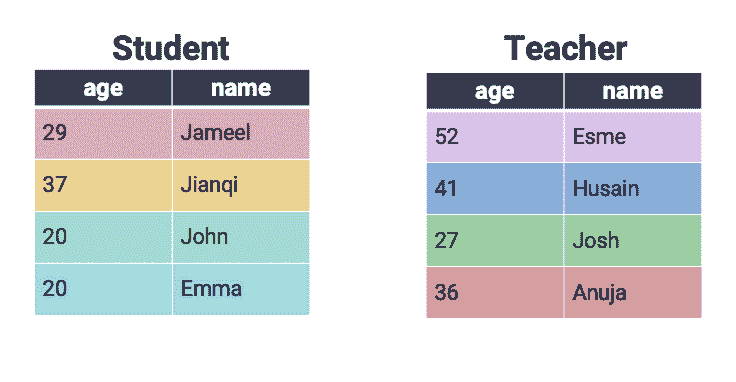

# 二十一、SQL II

> 原文：[SQL II](https://ds100.org/course-notes/sql_II/sql_II.html)
> 
> 译者：[飞龙](https://github.com/wizardforcel)
> 
> 协议：[CC BY-NC-SA 4.0](https://creativecommons.org/licenses/by-nc-sa/4.0/)

*学习成果*

+   介绍过滤组的能力

+   在 SQL 中执行数据清理和文本操作

+   跨表连接数据

在本讲座中，我们将继续上次的工作，介绍一些高级的 SQL 语法。

首先，让我们加载上一堂课的数据库。

```py
# Load the SQL Alchemy Python library
import sqlalchemy
import pandas as pd
```

```py
%load_ext sql
```

```py
%%sql
sqlite:///data/basic_examples.db 
```

## 21.1 过滤组

`HAVING`通过在每个组的所有行上应用一些条件来过滤组。我们将其解释为只保留具有某些条件的组的一种方式。请注意`WHERE`和`HAVING`之间的区别：我们使用`WHERE`来过滤行，而我们使用`HAVING`来过滤组。在 SQL 执行查询时，`WHERE`在`HAVING`之前。

让我们看看`Dish`表，看看我们如何使用`HAVING`。

```py
%%sql
SELECT *
FROM Dish;
```

```py
 * sqlite:///data/basic_examples.db
Done.
```

| Name | type | cost |
| --- | --- | --- |
| ravioli | entree | 10 |
| ramen | entree | 13 |
| taco | entree | 7 |
| edamame | appetizer | 4 |
| fries | appetizer | 4 |
| potsticker | appetizer | 4 |
| ice cream | dessert | 5 |

下面的代码按类型对不同的菜品进行分组，并仅保留那些最大费用仍然小于 8 的组。

```py
%%sql
SELECT type, COUNT(*)
FROM Dish
GROUP BY type
HAVING MAX(cost) < 8;
```

```py
 * sqlite:///data/basic_examples.db
Done.
```

| type | COUNT(*) |
| --- | --- |
| appetizer | 3 |
| dessert | 1 |

相比之下，下面的代码首先过滤成本小于 8 的行，然后进行分组。请注意输出的差异 - 在这种情况下，`taco`也被包括在内，而同一组中其他成本大于或等于 8 的条目则不被包括在内。

```py
%%sql
SELECT type, COUNT(*)
FROM Dish
WHERE cost < 8
GROUP BY type;
```

```py
 * sqlite:///data/basic_examples.db
Done.
```

| type | COUNT(*) |
| --- | --- |
| appetizer | 3 |
| dessert | 1 |
| entree | 1 |

## 21.2 SQL 中的探索性数据分析

在上一堂课中，我们大多是在假设我们的数据已经被清理过的情况下工作。然而，正如我们在数据科学生命周期的第一遍中看到的那样，我们很少会得到没有格式问题的数据。考虑到这一点，我们将学习如何在 SQL 中清理和转换数据。

我们在处理“大数据”时的典型工作流程是：

1.  使用 SQL 查询数据库中的数据

1.  使用`python`（带有`pandas`）详细分析这些数据

然而，我们仍然可以直接使用 SQL 执行简单的数据清理和重组。为此，我们将使用`imdbmini`数据库中的`Title`表。

### 21.2.1 使用`LIKE`匹配文本

我们在首次进行探索性数据分析时遇到的一个常见任务是需要匹配字符串数据。例如，我们可能希望在数据清理过程中删除以相同前缀开头的条目。

在 SQL 中，我们使用`LIKE`运算符来（你猜对了）查找与给定字符串模式*相似*的字符串。

```py
%%sql
sqlite:///data/imdbmini.db 
```

```py
%%sql
SELECT titleType, primaryTitle
FROM Title
WHERE primaryTitle LIKE "Star Wars: Episode I - The Phantom Menace"
```

```py
 sqlite:///data/basic_examples.db
 * sqlite:///data/imdbmini.db
Done.
```

| titleType | primaryTitle |
| --- | --- |
| movie | Star Wars: Episode I - The Phantom Menace |

如果我们想要找到*所有*星球大战电影呢？`%`是通配符运算符，它表示“查找任意字符，任意次数”。这使得它有助于识别与我们期望提取的模式相似的字符串，即使我们不知道我们的目标模式的完整文本是什么。相比之下，`_`表示“查找正好 1 个字符”，正如你在随后的哈利波特示例中所看到的。

```py
%%sql
SELECT titleType, primaryTitle
FROM Title
WHERE primaryTitle LIKE "%Star Wars%"
LIMIT 10;
```

```py
 sqlite:///data/basic_examples.db
 * sqlite:///data/imdbmini.db
Done.
```

| titleType | primaryTitle |
| --- | --- |
| movie | Star Wars: Episode IV - A New Hope |
| movie | Star Wars: Episode V - The Empire Strikes Back |
| movie | Star Wars: Episode VI - Return of the Jedi |
| movie | Star Wars: Episode I - The Phantom Menace |
| movie | Star Wars: Episode II - Attack of the Clones |
| movie | Star Wars: Episode III - Revenge of the Sith |
| tvSeries | Star Wars: Clone Wars |
| tvSeries | Star Wars: The Clone Wars |
| movie | Star Wars: The Clone Wars |
| movie | Star Wars: Episode VII - The Force Awakens |

```py
%%sql
SELECT titleType, primaryTitle
FROM Title
WHERE primaryTitle LIKE "Harry Potter and the Deathly Hallows: Part _"
```

```py
 sqlite:///data/basic_examples.db
 * sqlite:///data/imdbmini.db
Done.
```

| titleType | primaryTitle |
| --- | --- |
| movie | Harry Potter and the Deathly Hallows: Part 1 |
| movie | Harry Potter and the Deathly Hallows: Part 2 |

### 21.2.2 数据类型转换

一个常见的数据清理任务是将数据转换为正确的变量类型。`CAST`关键字用于生成新的输出列。此输出列中的每个条目都是将现有列中的数据转换为新数据类型的结果。例如，我们可能希望将存储为字符串的数字数据转换为整数。

```py
%%sql
SELECT primaryTitle, CAST(runtimeMinutes AS INT), CAST(startYear AS INT)
FROM Title
LIMIT 5
```

```py
 sqlite:///data/basic_examples.db
 * sqlite:///data/imdbmini.db
Done.
```

| primaryTitle | CAST(runtimeMinutes AS INT) | CAST(startYear AS INT) |
| --- | --- | --- |
| A Trip to the Moon | 13 | 1902 |
| The Birth of a Nation | 195 | 1915 |
| The Cabinet of Dr. Caligari | 76 | 1920 |
| The Kid | 68 | 1921 |
| Nosferatu | 94 | 1922 |

我们在为输出表`SELECT`列时使用`CAST`。在上面的例子中，我们希望`SELECT`由`CAST`创建的整数年份和运行时间数据的列。

SQL 将根据用于`SELECT`它的命令自动命名一个新列，这可能导致笨拙的列名。我们可以使用`AS`关键字重命名`CAST`列。

```py
%%sql
SELECT primaryTitle AS title, CAST(runtimeMinutes AS INT) AS minutes, CAST(startYear AS INT) AS year
FROM Title
LIMIT 5;
```

```py
 sqlite:///data/basic_examples.db
 * sqlite:///data/imdbmini.db
Done.
```

| Title | Minute | Year |
| --- | --- | --- |
| A Trip to the Moon | 13 | 1902 |
| The Birth of a Nation | 195 | 1915 |
| The Cabinet of Dr. Caligari | 76 | 1920 |
| The Kid | 68 | 1921 |
| Nosferatu | 94 | 1922 |

### 21.2.3 使用`CASE`的条件语句

在使用`pandas`时，我们经常遇到希望使用某种形式的条件语句生成新列的情况。例如，假设我们想根据其发行年份将电影标题描述为“老”、“中年”或“新”。

在 SQL 中，使用`CASE`子句执行条件操作。在概念上，`CASE`的行为很像`CAST`操作：它创建一个新列，然后我们可以`SELECT`它以出现在输出中。`CASE`子句的语法如下：

```py
CASE WHEN <condition> THEN <value>
     WHEN <other condition> THEN <other value>
     ...
     ELSE <yet another value>
END
```

通过扫描上面的骨架代码，您可以看到逻辑与`python`中的`if`语句类似。条件语句首先通过调用`CASE`打开。每个新条件由`WHEN`指定，`THEN`指示满足条件时应填充的值。`ELSE`指定如果没有满足其他条件应填充的值。最后，`END`指示条件语句的结束；一旦调用了`END`，SQL 将继续像往常一样评估查询。

让我们看看这个例子。在下面的例子中，我们给`CASE`语句创建的新列命名为`movie_age`。

```py
%%sql
/* If a movie was filmed before 1950, it is "old"
Otherwise, if a movie was filmed before 2000, it is "mid-aged"
Else, a movie is "new" */

SELECT titleType, startYear,
CASE WHEN startYear < 1950 THEN "old"
 WHEN startYear < 2000 THEN "mid-aged"
 ELSE "new"
 END AS movie_age
FROM Title
LIMIT 10;
```

```py
 sqlite:///data/basic_examples.db
 * sqlite:///data/imdbmini.db
Done.
```

| titleType | startYear | movie_age |
| --- | --- | --- |
| short | 1902 | old |
| movie | 1915 | old |
| movie | 1920 | old |
| movie | 1921 | old |
| movie | 1922 | old |
| movie | 1924 | old |
| movie | 1925 | old |
| movie | 1925 | old |
| movie | 1927 | old |
| movie | 1926 | old |

## 21.3 `JOIN`表

到目前为止，我们已经熟练地使用 SQL 作为清理、操作和转换表中数据的工具。请注意，这句话特指一个*表*。如果我们需要的数据分布在多个表中会发生什么？这是在使用 SQL 时需要考虑的重要问题——回想一下，我们最初将 SQL 介绍为一种从数据库查询的语言。数据库通常以多维结构存储数据。换句话说，信息存储在多个表中，每个表包含数据库存储的所有数据的一个小子集。

组织数据库的一种常见方式是使用**星型模式**。星型模式由两种类型的表组成。**事实表**是数据库的中心表，它包含了跨多个**维度表**的条目链接所需的信息，维度表包含有关数据的更详细的信息。

假设我们正在处理一个关于伯克利波霸供应的数据库。数据库的维度表可能包含有关茶品种和波霸配料的信息。事实表将用于在各种维度表之间链接这些信息。


如果我们明确标记表之间的关系，我们开始看到星型模式的结构。


要跨多个表连接数据，我们将使用（创造性地命名的）`JOIN`关键字。我们首先考虑更简单的`cats`数据集，其中包含表`s`和`t`。


要执行连接，我们修改`FROM`子句。您可以将其视为说：“`SELECT`我的数据`FROM`已连接在一起的表。”

记住：SQL 在解释查询时不考虑换行或空格。下面示例中给出的缩进是为了帮助提高可读性。如果愿意，可以编写不遵循此格式的代码。

```py
SELECT <column list>
FROM table_1 
    JOIN table_2 
    ON key_1 = key_2;
```

我们还需要指定应从每个表中使用哪个列来确定匹配的条目。通过定义这些键，我们为 SQL 提供了它需要的信息，以便将数据行配对在一起。

在**交叉连接**中，输出表中出现*所有*可能的行组合，无论行是否共享匹配键。因为所有行都被连接，即使没有匹配键，也不需要在`ON`语句中指定要考虑的键。交叉连接也称为笛卡尔积。


最常用的 SQL `JOIN`类型是**内连接**。原来你已经熟悉内连接的作用和工作原理 - 这就是我们一直在`pandas`中使用的连接类型！在内连接中，我们将第一个表中的每一行与第二个表中的匹配条目组合在一起。如果任一表中的行在另一表中没有匹配项，则将其从输出中省略。


解释内连接的另一种方法：执行交叉连接，然后删除所有不共享匹配键的行。请注意，上面内连接的输出包含交叉连接示例的所有行，该示例在整个行中包含单个颜色。

在**全外连接**中，将两个表之间有匹配的所有行连接在一起。如果一行在第二个表中没有匹配项，则该第二个表的列的值将填充为 null。换句话说，全外连接执行内连接*同时保留*在另一表中没有匹配的行。这最好通过可视化理解：


我们已经使用内连接实现了相同的输出，同时为在第二个表中没有匹配的`S`和`t`条目添加了部分空行。请注意，SQLite 不支持`FULL OUTER JOIN`，这是实验和作业中将使用的 SQL“风格”。

**左外连接**类似于全外连接。在左外连接中，输出表中保留了左表中的*所有*行。如果右表中的行与左表共享匹配，则将保留此行；否则，右表中的行将从输出中省略。


**右外连接**保留右表中的所有行。只有左表中的行在右表中有匹配时才会保留。SQLite 不支持右外连接。


在上面的示例中，我们通过检查两个表之间的相等性（即通过设置`s.id = t.id`）执行了连接。SQL 还支持在*不等式*上连接行，这是我们在`pandas`中无法做到的。考虑一个包含有关学生和教师信息的新数据集。



通常，我们希望比较不同表中行的相对值，而不是检查它们是否完全相等。例如，我们可能希望连接学生比相应的老师年龄大的行。我们可以通过在`ON`语句中指定不等式来实现这一点。


