# 二十二、逻辑回归 I

> 原文：[Logistic Regression I](https://ds100.org/course-notes/logistic_regression_1/logistic_reg_1.html)
> 
> 译者：[飞龙](https://github.com/wizardforcel)
> 
> 协议：[CC BY-NC-SA 4.0](https://creativecommons.org/licenses/by-nc-sa/4.0/)

*学习成果*

+   了解回归和分类之间的区别

+   推导用于分类数据的逻辑回归模型

+   用交叉熵损失量化我们的逻辑回归模型的错误

到目前为止，在课堂上，我们专注于**回归**任务 - 也就是说，从给定数据集中预测一个*数值*数量。我们讨论了优化、特征工程和正则化，都是在执行回归以预测某个数量的情况下。

现在我们对建模任务的可能性有了深入的了解，让我们扩展我们对可能建模任务的了解。

## 22.1 分类

在接下来的两次讲座中，我们将解决**分类**的任务。分类问题旨在将数据分类为*类别*。与回归不同，在回归中我们预测了一个数值输出，分类涉及预测一些**分类变量**或**响应**$y$。分类任务的例子包括：

+   从失误百分比预测哪支球队赢得比赛

+   从总餐厅账单预测一餐的星期几

+   从其马力预测汽车的型号

有几种不同类型的分类：

+   二元分类：将数据分类为两类，响应$y$要么是 0，要么是 1

+   多类分类：将数据分类为多个类别（例如，图像标记，句子中的下一个单词等）

+   结构化预测任务：进行多个相关的分类预测（例如，翻译，语音识别等）

在 Data 100 中，我们将主要处理**二元分类**，我们试图将数据分类为两类之一。

为了构建一个分类模型，我们需要稍微修改我们的建模工作流程。回想一下，在回归中我们：

1.  创建了一个数值特征的设计矩阵

1.  将我们的模型定义为这些数值特征的线性组合

1.  使用模型输出数值预测

然而，在分类中，我们不再希望输出数值预测；相反，我们希望预测数据点属于哪个类。这意味着我们需要更新我们的工作流程。为了构建一个分类模型，我们将：

1.  创建一个数值特征的设计矩阵。

1.  将我们的模型定义为这些数值特征的线性组合，通过非线性**sigmoid 函数**进行转换。这会输出一个数值数量。

1.  应用**决策规则**来解释输出的数量并决定分类。

1.  输出一个预测的类。

有两个关键的区别：正如我们很快会看到的，我们需要加入一个非线性转换来捕捉我们数据中隐藏的非线性关系。我们通过将 sigmoid 函数应用于特征的线性组合来实现这一点。其次，我们必须应用一个决策规则，将我们模型计算出的数值数量转换为实际的类别预测。这可以简单地说，任何具有大于某个数字$x$的特征的数据点都属于类 1。

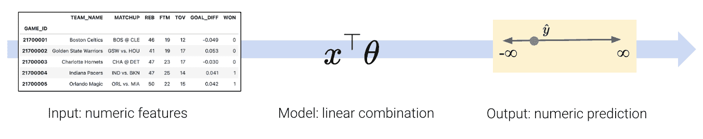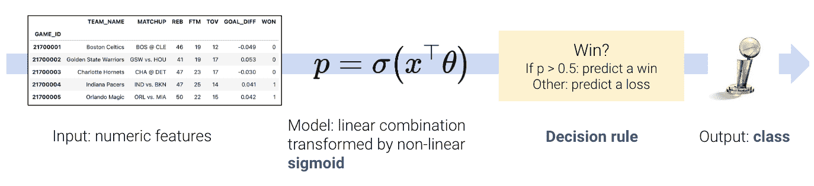

这只是一个非常高层次的概述。让我们详细地走一遍流程，澄清我们的意思。

## 22.2 推导逻辑回归模型

在本讲座中，我们将使用`games`数据集，其中包含 NBA 篮球联赛中比赛的信息。我们的目标是使用篮球队的`GOAL_DIFF`来预测给定球队是否赢得比赛（`WON`）。如果一支球队赢得比赛，我们将说他们属于类 1。如果他们输了，他们属于类 0。

对于那些好奇的人，`GOAL_DIFF`代表两支竞争球队之间成功投篮百分比的差异。

代码

```py
import warnings
warnings.filterwarnings("ignore")

import pandas as pd
import numpy as np
np.seterr(divide='ignore')

games = pd.read_csv("data/games").dropna()
games.head()
```

|  | GAME_ID | TEAM_NAME | MATCHUP | WON | GOAL_DIFF | AST |
| --- | --- | --- | --- | --- | --- | --- |
| 0 | 21701216 | Dallas Mavericks | DAL vs. PHX | 0 | -0.251 | 20 |
| 1 | 21700846 | Phoenix Suns | PHX @ GSW | 0 | -0.237 | 13 |
| 2 | 21700071 | San Antonio Spurs | SAS @ ORL | 0 | -0.234 | 19 |
| 3 | 21700221 | New York Knicks | NYK @ TOR | 0 | -0.234 | 17 |
| 4 | 21700306 | Miami Heat | MIA @ NYK | 0 | -0.222 | 21 |

让我们使用 Seaborn 函数`sns.stripplot`来可视化`"GOAL_DIFF"`和`"WON"`之间的关系。条带图会自动引入一小部分随机噪声来使数据发生抖动。回想一下，`"WON"`列中的所有值都是 1（赢）或 0（输）- 如果我们直接绘制它们而不进行抖动，我们将看到严重的重叠。

Code

```py
import seaborn as sns
import matplotlib.pyplot as plt

sns.stripplot(data=games, x="GOAL_DIFF", y="WON", orient="h")
# By default, sns.stripplot plots 0, then 1\. We invert the y axis to reverse this behavior
plt.gca().invert_yaxis();
```

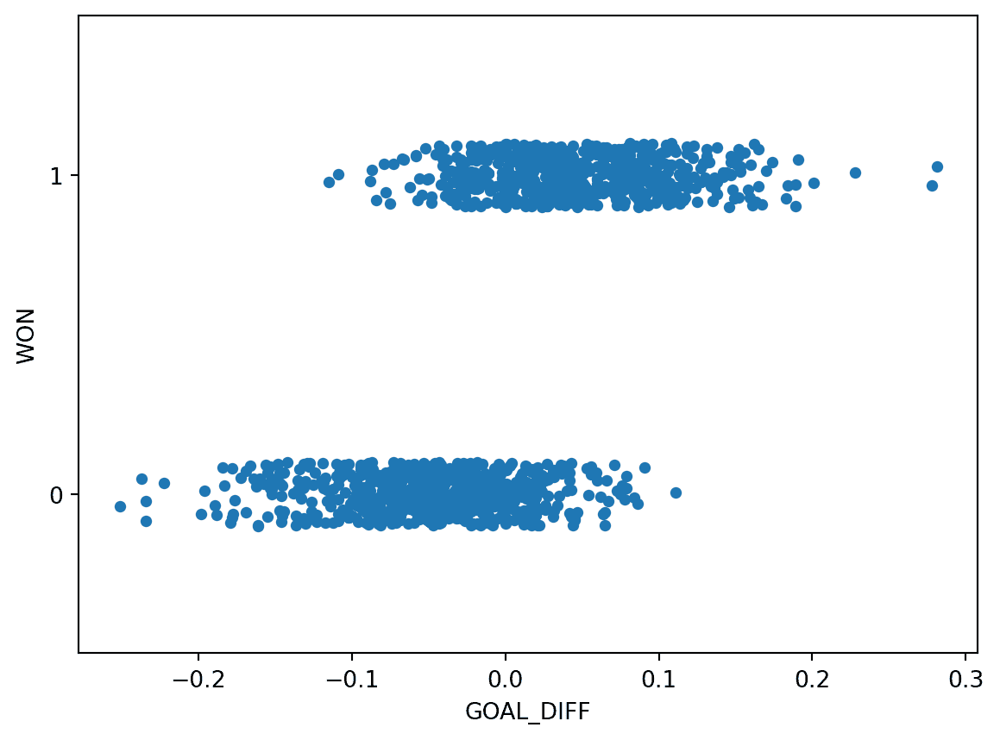

这个数据集不像我们以前见过的任何东西-我们的目标变量只包含两个唯一的值！记住，每个 y 值要么是 0，要么是 1；上面的图稍微抖动了 y 数据以便阅读。

我们所使用的回归模型总是假设我们试图预测一个连续的目标。如果我们将线性回归模型应用于这个数据集，会发生一些奇怪的事情。

Code

```py
import sklearn.linear_model as lm

X, Y = games[["GOAL_DIFF"]], games["WON"]
regression_model = lm.LinearRegression()
regression_model.fit(X, Y)

plt.plot(X.squeeze(), regression_model.predict(X), "k")
sns.stripplot(data=games, x="GOAL_DIFF", y="WON", orient="h")
plt.gca().invert_yaxis();
```

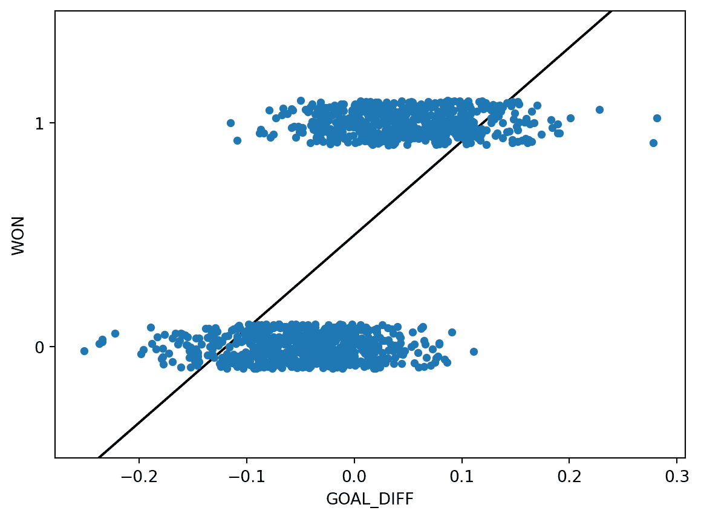

线性回归拟合尽可能地与数据保持一致。然而，这种方法存在一些关键缺陷：

+   预测输出$\hat{y}$可能超出可能类别的范围（有预测值大于 1 和小于 0）

+   这意味着输出并不总是可以解释（预测-2.3 的类别意味着什么？）

我们通常的线性回归框架在这里行不通。相反，我们需要更有创意。

回到[Data 8](https://inferentialthinking.com/chapters/08/1/Applying_a_Function_to_a_Column.html#example-prediction)，你通过使用**平均值图**逐渐建立了线性回归的概念。在你了解回归线的数学基础之前，你采取了更直观的方法：将$x$数据分成常见值的箱子，然后计算相同箱子中所有数据点的平均$y$。结果为你提供了推导回归拟合所需的洞察力。

让我们采用与我们应对新的分类任务相同的方法。在下面的单元格中，我们 1）将`"GOAL_DIFF"`数据分成相似值的箱子，2）计算箱子中所有数据点的平均`"WON"`值。

```py
bins = pd.cut(games["GOAL_DIFF"], 20)
games["bin"] = [(b.left + b.right) / 2 for b in bins]
win_rates_by_bin = games.groupby("bin")["WON"].mean()

# alpha makes the points transparent so we can see the line more clearly
sns.stripplot(data=games, x="GOAL_DIFF", y="WON", orient="h", alpha=0.3)
plt.plot(win_rates_by_bin.index, win_rates_by_bin, c="tab:red")
plt.gca().invert_yaxis();
```

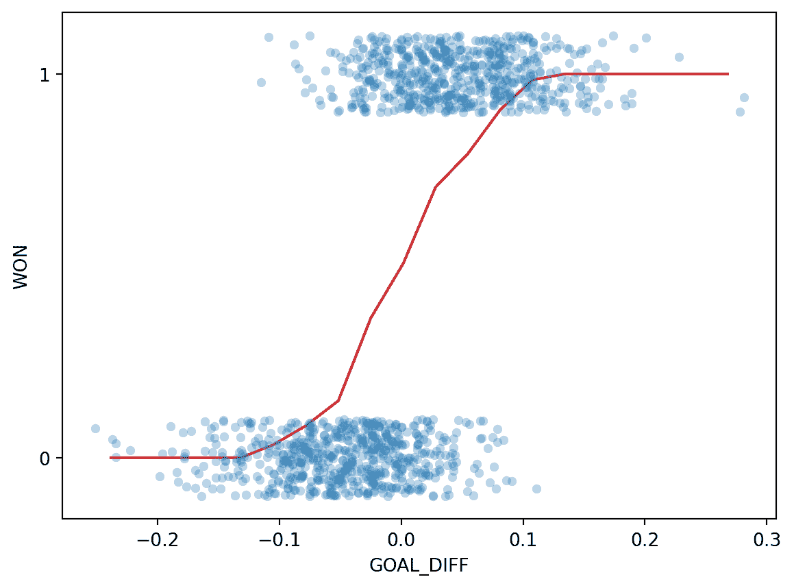

有趣的是：我们的结果肯定不像通过找到线性关系的平均值图产生的直线。我们可以做两个观察：

+   我们线上的所有预测都在 0 和 1 之间

+   预测是**非线性**的，遵循一个粗略的“S”形状

让我们更深入地思考一下我们刚刚做的事情。

为了找到每个箱子的平均$y$值，我们计算：

$$\frac{1 \text{(\# Y = 1 in bin)} + 0 \text{(\# Y = 0 in bin)}}{\text{\# datapoints in bin}} = \frac{\text{\# Y = 1 in bin}}{\text{\# datapoints in bin}} = P(\text{Y = 1} | \text{bin})$$

这只是该箱中数据点属于类别 1 的概率！这与我们之前的观察一致：我们所有的预测都在 0 和 1 之间，正如我们对概率的预期一样。

我们的平均值图实际上在建模概率$p$，即数据点属于类别 1 的概率，或者本质上是对于特定值的$\text{x}$，$\text{Y = 1}$的概率。

$$ p = P(Y = 1 | \text{ x} )$$

在逻辑回归中，我们有一个新的建模目标。我们想要建模**特定数据点属于类别 1 的概率**。为此，我们需要创建一个可以近似我们上面绘制的 S 形曲线的模型。

对我们来说幸运的是，我们已经熟悉了一种模拟非线性关系的技术——对线性关系进行非线性转换。回想一下我们之前应用过的步骤：

+   对变量进行转换，直到线性化它们的关系

+   对转换后的变量拟合线性模型

+   “撤销”我们的转换，以确定原始变量之间的基本关系

在过去的例子中，我们使用了凸起图来帮助我们决定哪些转换可能有用。然而，我们上面看到的 S 形曲线与我们过去看到的任何关系都不相似。我们需要仔细考虑哪些转换会线性化这条曲线。

让我们考虑我们最终的目标：确定我们是否应该预测每个数据点的类别是 0 还是 1。换句话说，我们想要确定数据点更“可能”属于类别 0 还是类别 1。决定这一点的一种方法是看哪个类别对于给定的数据点有更高的预测概率。**赔率**被定义为数据点属于类别 1 的概率除以它属于类别 0 的概率。

$$\text{odds} = \frac{P(Y=1|x)}{P(Y=0|x)} = \frac{p}{1-p}$$

如果我们为每个输入`GOAL_DIFF`($x$)绘制赔率，我们会看到一些看起来更有希望的东西。

```py
p = win_rates_by_bin
odds = p/(1-p) 

plt.plot(odds.index, odds)
plt.xlabel("x")
plt.ylabel(r"Odds $= \frac{p}{1-p}$");
```

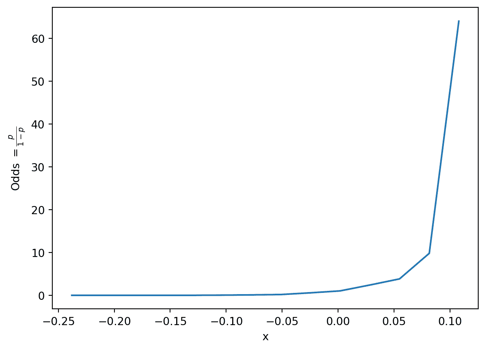

事实证明，我们的输入`GOAL_DIFF`和赔率之间的关系大致是指数的！让我们通过取对数来线性化指数。作为提醒，你应该假设 Data 100 中的任何对数都是以$e$为底的自然对数，除非另有说明。

```py
import numpy as np
log_odds = np.log(odds)
plt.plot(odds.index, log_odds, c="tab:green")
plt.xlabel("x")
plt.ylabel(r"Log-Odds $= \log{\frac{p}{1-p}}$");
```

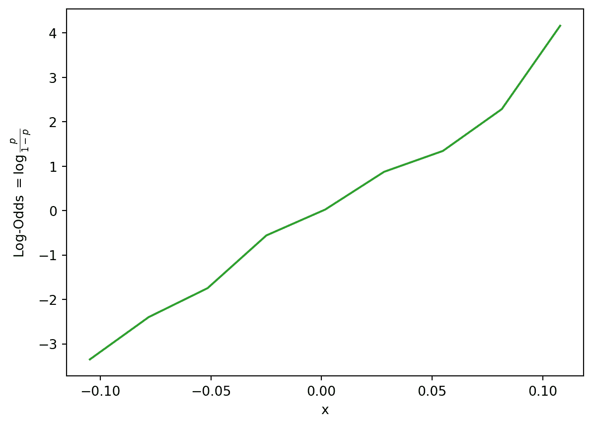

我们看到了一些有希望的东西——对数几率和我们的输入特征之间的关系大致是线性的。这意味着我们可以使用线性模型来描述对数几率和$x$之间的关系。换句话说：

$$\begin{align} \log{(\frac{p}{1-p})} &= \theta_0 + \theta_1 x_i\\ &= x^{\top} \theta \end{align}$$

在这里，我们使用$x^{\top}$来表示数据集中的一个观察值，存储为行向量。你可以想象它是我们设计矩阵中的一行。$x^{\top} \theta$表示这个观察的特征的线性组合（就像我们在多元线性回归中使用的那样）。

我们做得很好！我们现在得出了以下关系：

$$\log{(\frac{p}{1-p})} = x^{\top} \theta$$

记住我们的目标是预测数据点属于类别 1 的概率$p$。让我们重新排列这个关系，以揭示$p$和我们的输入数据$x^{\top}$之间的原始关系。

$$\begin{align} \log{(\frac{p}{1-p})} &= x^T \theta\\ \frac{p}{1-p} &= e^{x^T \theta}\\ p &= (1-p)e^{x^T \theta}\\ p &= e^{x^T \theta}- p e^{x^T \theta}\\ p(1 + e^{x^T \theta}) &= e^{x^T \theta} \\ p &= \frac{e^{x^T \theta}}{1+e^{x^T \theta}}\\ p &= \frac{1}{1+e^{-x^T \theta}}\\ \end{align}$$

哎呀，这是很多代数。我们发现的是用于预测数据点$x^{\top}$属于类别 1 的**逻辑回归模型**。如果我们为我们的数据绘制这种关系，我们会看到之前的 S 形曲线！

代码

```py
# We'll discuss the `LogisticRegression` class next time
xs = np.linspace(-0.3, 0.3)

logistic_model = lm.LogisticRegression(C=20)
logistic_model.fit(X, Y)
predicted_prob = logistic_model.predict_proba(xs[:, np.newaxis])[:, 1]

sns.stripplot(data=games, x="GOAL_DIFF", y="WON", orient="h", alpha=0.5)
plt.plot(xs, predicted_prob, c="k", lw=3, label="Logistic regression model")
plt.plot(win_rates_by_bin.index, win_rates_by_bin, lw=2, c="tab:red", label="Graph of averages")
plt.legend(loc="upper left")
plt.gca().invert_yaxis();
```

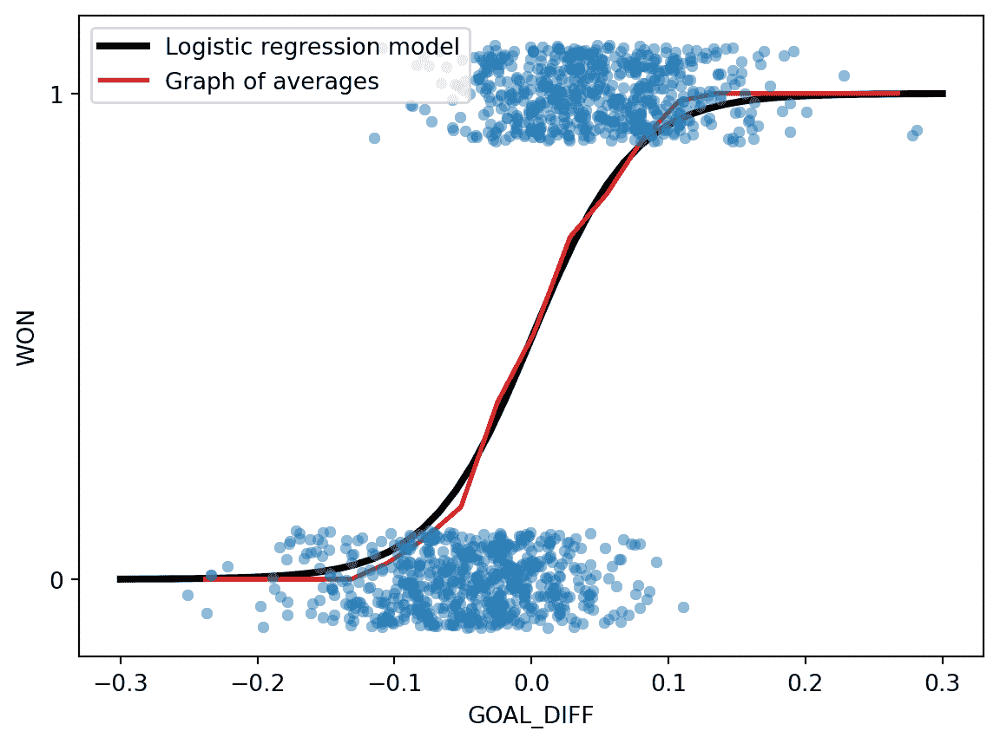

使用逻辑回归模型来预测概率时，我们：

1.  计算特征的线性组合$x^{\top}\theta$

1.  应用 Sigmoid 激活函数，$\sigma(x^{\top} \theta)$。

我们的预测概率的形式为$P(Y=1|x) = p = \frac{1}{1+e^{-(\theta_0 + \theta_1 x_1 + \theta_2 x_2 + \ldots + \theta_p x_p)}}$

重要说明：尽管名字是这样，逻辑回归用于*分类*任务，而不是回归任务。在 Data 100 中，我们总是应用逻辑回归来分类数据。

S 形曲线在正式上被称为**Sigmoid 函数**，通常用$\sigma$表示。

$$\sigma(t) = \frac{1}{1+e^{-t}}$$

*Sigmoid 的属性*

+   反射/对称：$1-\sigma(t) = \frac{e^{-t}}{1+e^{-t}}=\sigma(-t)$

+   反函数：$t=\sigma^{-1}(p)=\log{(\frac{p}{1-p})}$

+   导数：$\frac{d}{dz} \sigma(t) = \sigma(t) (1-\sigma(t))=\sigma(t)\sigma(-t)$

+   域：$-\infty < t < \infty$

+   范围：$0 < \sigma(t) < 1$

在我们建模过程的背景下，Sigmoid 被认为是一个**激活函数**。它接收特征的线性组合并应用非线性变换。

让我们总结一下我们的逻辑回归建模工作流程。

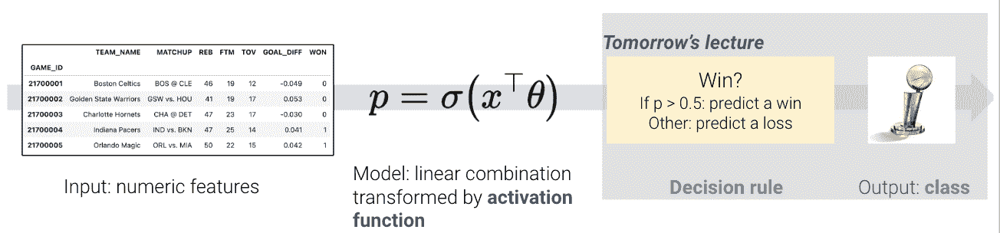

我们从本节中得出的主要结论是：

+   尽量最好地拟合“S”曲线

+   曲线模拟了概率：$P = (Y=1 | x)$

+   假设对数几率是$x$和$\theta$的线性组合

综上所述，我们知道给定特征$x$的响应的估计概率等于在值$x^{\top}\theta$处的逻辑函数$\sigma()$：

$$\begin{align} \hat{P}_{\theta}(Y = 1 | x) = \frac{1}{1 + e^{-x^{\top}\theta}} \end{align}$$

更常见的是，逻辑回归模型被写成：

$$\begin{align} \hat{P}_{\theta}(Y = 1 | x) = \sigma(x^{\top}\theta) \end{align}$$

*逻辑模型的属性* 

考虑一个具有一个特征和一个截距项的逻辑回归模型：

$$\begin{align} p = P(Y = 1 | x) = \frac{1}{1+e^{-(\theta_0 + \theta_1 x)}} \end{align}$$

属性：

+   $\theta_0$ 控制曲线沿水平轴的位置

+   $\theta_1$的大小控制了 Sigmoid 的“陡峭度”

+   $\theta_1$的符号控制曲线的方向

**示例计算* 

假设我们想要预测一个球队赢得比赛的概率，给定`GOAL_DIFF`（第一个特征）和罚球次数（第二个特征）。假设我们使用训练数据拟合了一个逻辑回归模型（没有截距），并估计了最优参数。现在我们想要预测一个新球队赢得比赛的概率。

$$\begin{align} \hat{\theta}^{\top} = \begin{matrix}[0.1 & -0.5]\end{matrix} \\x^{\top} = \begin{matrix}[15 & 1]\end{matrix} \end{align}$$

$$\begin{align} \hat{P}_{\hat{\theta}}(Y = 1 | x) = \sigma(x^{\top}\hat{\theta}) = \sigma(0.1 \cdot 15 + (-0.5) \cdot 1) = \sigma(1) = \frac{1}{1+e^{-1}} \approx 0.7311 \end{align}$$

我们看到响应更可能是 1 而不是 0，这表明一个合理的预测是$\hat{y} = 1$。我们将在下一讲中更深入地讨论这个问题。

# 22.3 交叉熵损失

为了量化我们的逻辑回归模型的误差，我们需要定义一个损失函数。

### 22.3.1 为什么不用 MSE？

你可能会想：为什么不使用我们熟悉的均方误差？事实证明，均方误差不适用于逻辑回归。为了理解原因，让我们考虑一个简单的、人工生成的“玩具”数据集（这比更复杂的“游戏”数据更容易处理）。

代码

```py
toy_df = pd.DataFrame({
 "x": [-4, -2, -0.5, 1, 3, 5],
 "y": [0, 0, 1, 0, 1, 1]})
toy_df.head()
```

|  | x | y |
| --- | --- | --- |
| 0 | -4.0 | 0 |
| 1 | -2.0 | 0 |
| 2 | -0.5 | 1 |
| 3 | 1.0 | 0 |
| 4 | 3.0 | 1 |

我们将构建一个只有一个特征和没有截距项的基本逻辑回归模型。我们的预测概率的形式为：

$$p=P(Y=1|x)=\frac{1}{1+e^{-\theta_1 x}}$$

在下面的单元格中，我们绘制了模型在数据上的 MSE。

代码

```py
def sigmoid(z):
 return 1/(1+np.e**(-z))

def mse_on_toy_data(theta):
 p_hat = sigmoid(toy_df['x'] * theta)
 return np.mean((toy_df['y'] - p_hat)**2)

thetas = np.linspace(-15, 5, 100)
plt.plot(thetas, [mse_on_toy_data(theta) for theta in thetas])
plt.title("MSE on toy classification data")
plt.xlabel(r'$\theta_1/details>)
plt.ylabel('MSE');
```

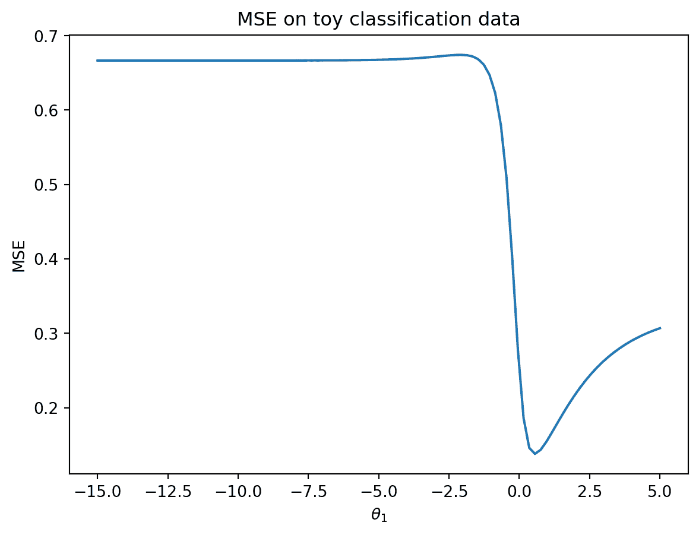

当我们绘制线性回归模型的 MSE 时，这看起来一点也不像我们找到的抛物线！特别是，我们可以确定使用 MSE 进行逻辑回归有两个缺陷：

1.  MSE 损失曲面是*非凸的*。在上面的损失曲面中既有全局最小值，也有一个（几乎不可察觉的）局部最小值。这意味着梯度下降有可能收敛到损失曲面的局部最小值，错过真正的最优参数$\theta_1$。

1.  对于分类任务，平方损失是*有界*的。回想一下，每个真实的 $y$ 的值要么是 0，要么是 1。这意味着即使我们的模型做出了最糟糕的预测（例如对于 $y=1$ 预测 $p=0$），一个观察的平方损失也不会大于 1：$$(y-p)^2=(1-0)^2=1$$ 均方误差并不会严厉地惩罚糟糕的预测。

### 22.3.2 激励交叉熵损失

可以说，我们不想在逻辑回归中使用均方误差。相反，我们将考虑在损失函数中看到的*希望*看到的行为。

让 $y$ 为二进制标签 ${0, 1}$，$p$ 是模型预测标签为 1 的概率。

+   当真实的 $y$ 为 1 时，当模型预测大的 $p$ 时，我们应该承担*低*的损失

+   当真实的 $y$ 为 0 时，当模型预测大的 $p$ 时，我们应该承担*高*的损失

换句话说，我们的损失函数应该根据真实类别 $y$ 的值而有所不同。

**交叉熵损失**包含了这种变化行为。我们将在逻辑回归的工作中使用它。下面，我们写出了*单个*数据点的交叉熵损失（暂时还没有平均值）。

$$\text{交叉熵损失} = \begin{cases} -\log{(p)} & \text{if } y=1 \\ -\log{(1-p)} & \text{if } y=0 \end{cases}$$

为什么这种（看似复杂的）损失函数“有效”？让我们来分解一下。

当 $y=1$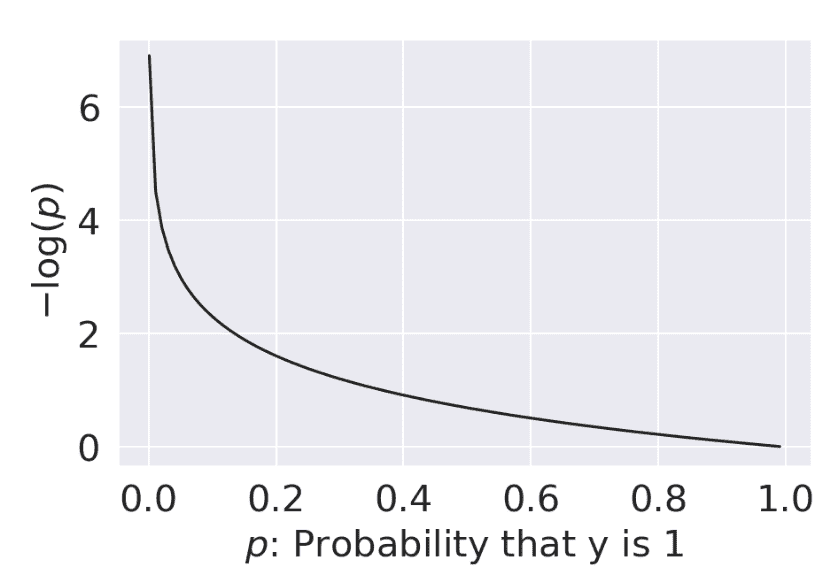

+   当 $p \rightarrow 0$ 时，损失趋近于 $\infty$

+   当 $p \rightarrow 1$ 时，损失趋近于 0

当 $y=0$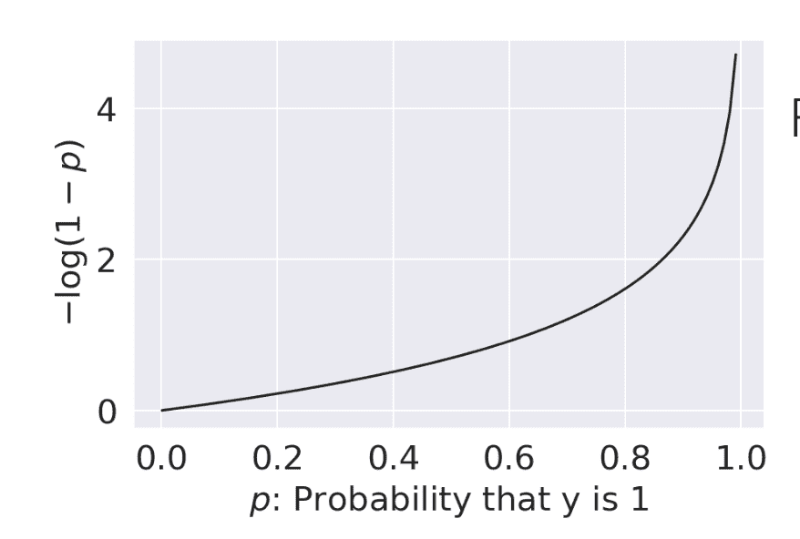

+   当 $p \rightarrow 0$ 时，损失趋近于 0

+   当 $p \rightarrow 1$ 时，损失趋近于 $\infty$

一切顺利 - 我们看到了我们希望在逻辑回归模型中看到的行为。

我们上面概述的分段函数很难优化：我们不想在选择最佳模型参数的每一步不断“检查”应该使用损失函数的哪种形式。我们可以以更方便的方式重新表达交叉熵损失：

$$\text{交叉熵损失} = -\left(y\log{(p)}-(1-y)\log{(1-p)}\right)$$

通过将 $y$ 设置为 0 或 1，我们看到这种新形式的交叉熵损失给了我们与原始公式相同的行为。

当 $y=1$：

$$\begin{align} \text{CE} &= -\left((1)\log{(p)}-(1-1)\log{(1-p)}\right)\\ &= -\log{(p)} \end{align}$$

当 $y=0$：

$$\begin{align} \text{CE} &= -\left((0)\log{(p)}-(1-0)\log{(1-p)}\right)\\ &= -\log{(1-p)} \end{align}$$

逻辑回归模型的经验风险是数据集中所有数据点的平均交叉熵损失。在拟合模型时，我们希望确定导致最低平均交叉熵损失的模型参数 $\theta$。

$$R(\theta) = - \frac{1}{n} \sum_{i=1}^n \left(y_i\log{(p_i)}-(1-y_i)\log{(1-p_i)}\right)$$ 

$$R(\theta) = - \frac{1}{n} \sum_{i=1}^n \left(y_i\log{(\sigma(X_i^{\top}\theta)}-(1-y_i)\log{(1-\sigma(X_i^{\top}\theta)}\right)$$

因此，优化问题是找到最小化 $R(\theta)$ 的估计 $\hat{\theta}$：

$$\begin{align} \hat{\theta} = \underset{\theta}{\arg\min} = - \frac{1}{n} \sum_{i=1}^n \left(y_i\log{(\sigma(X_i^{\top}\theta)}-(1-y_i)\log{(1-\sigma(X_i^{\top}\theta)}\right) \end{align}$$

绘制我们的`toy`数据集的交叉熵损失曲面给了我们一个更令人鼓舞的结果 - 我们的损失函数现在是凸的。这意味着我们可以使用梯度下降来优化它。计算逻辑模型的梯度是相当具有挑战性的，所以我们会让`sklearn`来为我们处理这个问题。在 Data 100 中，您不需要计算逻辑模型的梯度。

代码

```py
def cross_entropy(y, p_hat):
 return - y * np.log(p_hat) - (1 - y) * np.log(1 - p_hat)

def mean_cross_entropy_on_toy_data(theta):
 p_hat = sigmoid(toy_df['x'] * theta)
 return np.mean(cross_entropy(toy_df['y'], p_hat))

plt.plot(thetas, [mean_cross_entropy_on_toy_data(theta) for theta in thetas], color = 'green')
plt.ylabel(r'Mean Cross-Entropy Loss($\theta$)')
plt.xlabel(r'$\theta/details>);
```

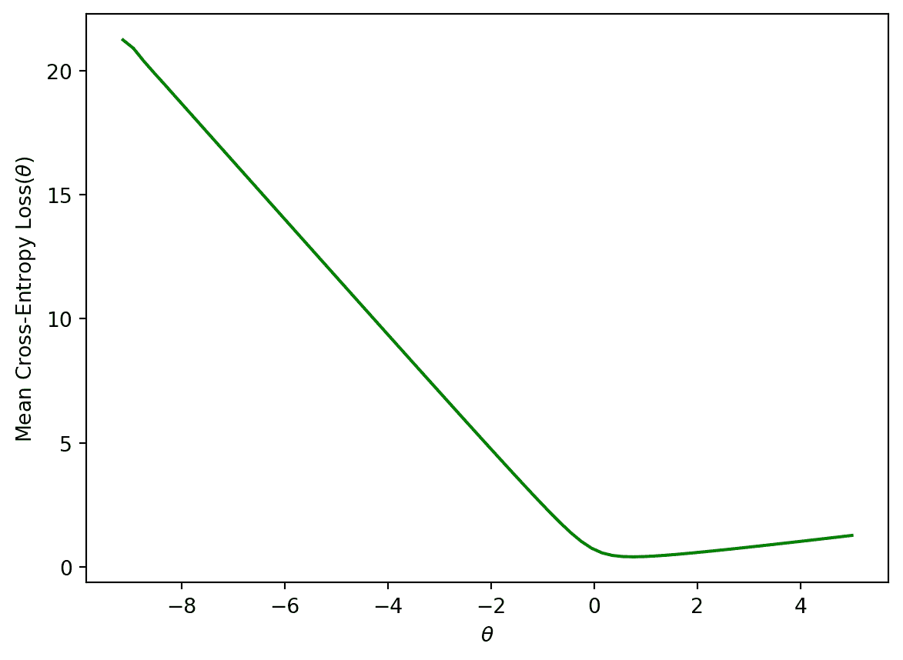

## 22.4 (奖励) 最大似然估计

看起来我们是凭空提出了交叉熵损失。我们怎么知道取负对数的概率会这么有效呢？事实证明，交叉熵损失是由概率论证明的。

以下部分超出了范围，但肯定是一个有趣的阅读！

### 22.4.1 建立直觉：抛硬币

为了对逻辑回归建立一些直觉，让我们看一个分类的入门例子：抛硬币。假设我们观察到一些抛硬币的结果（1 = 正面，0 = 反面）。

```py
flips = [0, 0, 1, 1, 1, 1, 0, 0, 0, 0]
flips
```

```py
[0, 0, 1, 1, 1, 1, 0, 0, 0, 0]
```

一个合理的模型是假设所有的翻转都是独立同分布的（独立且同分布）。换句话说，每次翻转都有相同的概率返回 1（或正面）。让我们定义一个参数$\theta$，即下一次翻转是正面的概率。我们将使用这个参数来决定我们对下一次翻转的$\hat y$（预测为 0 或 1）。如果$\theta \ge 0.5, \hat y = 1, \text{else } \hat y = 0$。

你可能会倾向于说$\theta = 0.5$是最好的选择。然而，请注意我们对硬币本身没有做任何假设。硬币可能是有偏的，所以我们应该只基于数据做出决定。我们知道确切地有$\frac{4}{10}$的翻转是正面，所以我们可能猜测$\hat \theta = 0.4$。在下一节中，我们将在数学上证明为什么这是最佳估计。

### 22.4.2 数据的可能性

让我们把硬币翻转的结果称为随机变量$Y$。这是一个有两个结果的伯努利随机变量。$Y$有以下分布：

$$P(Y = y) = \begin{cases} p, \text{if } y=1\\ 1 - p, \text{if } y=0 \end{cases} $$

$p$对我们来说是未知的。但我们可以找到使我们观察到的数据最*可能*的$p$。

观察到 4 个正面和 6 个反面的概率遵循二项分布。

$$\binom{10}{4} (p)^4 (1-p)^6$$

我们定义获得我们观察到的数据的**可能性**，作为与上述概率成比例的数量。要找到它，只需将获得每个硬币翻转的概率相乘。

$$(p)^{4} (1-p)^6$$

称为**最大似然估计**的技术找到了最大化上述可能性的$p$。你可以通过对可能性求导来找到这个最大值，但我们将提供一个更直观的图形解决方案。

```py
thetas = np.linspace(0, 1)
plt.plot(thetas, (thetas**4)*(1-thetas)**6)
plt.xlabel(r"$\theta$")
plt.ylabel("Likelihood");
```

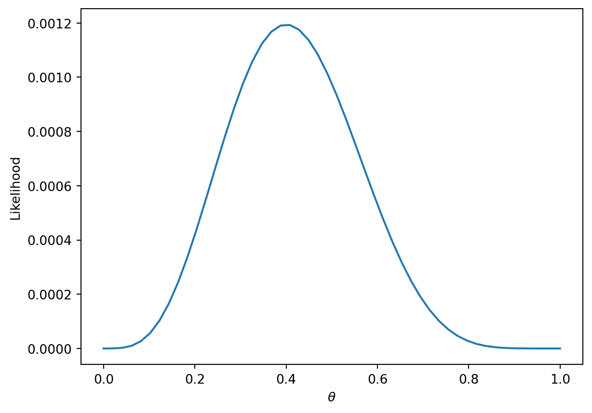

更一般地，对于某个伯努利($p$)随机变量$Y$的可能性是：

$$P(Y = y) = \begin{cases} 1, \text{with probability } p\\ 0, \text{with probability } 1 - p \end{cases} $$

等价地，这可以用一种简洁的方式来写：

$$P(Y=y) = p^y(1-p)^{1-y}$$

+   当$y = 1$时，这读作$P(Y=y) = p$

+   当$y = 0$时，这读作$P(Y=y) = (1-p)$

在我们的例子中，伯努利随机变量类似于一个单个数据点（例如，篮球队赢得或输掉一场比赛的一个实例）。所有在一起，我们的`games`数据由许多 IID 伯努利($p$)随机变量组成。要找到连续独立事件的可能性，只需将它们的可能性相乘。

$$\prod_{i=1}^{n} p^{y_i} (1-p)^{1-y_i}$$

与硬币的例子一样，我们想找到最大化这种可能性的参数$p$。之前，我们给出了一个直观的图形解决方案，但让我们对可能性的导数进行求解以找到这个最大值。

乍一看，这个导数会很复杂！我们将不得不使用乘法规则，然后是链式法则。相反，我们可以做一个简化问题的观察。

找到最大化$$\prod_{i=1}^{n} p^{y_i} (1-p)^{1-y_i}$$的$p$等同于最大化$$\text{log}(\prod_{i=1}^{n} p^{y_i} (1-p)^{1-y_i})$$

这是因为$\text{log}$是一个严格*增加*的函数。它不会改变它所应用的函数的最大值或最小值。根据$\text{log}$的性质，$\text{log}(a*b)$ = $\text{log}(a) + \text{log}(b)$。我们可以将这应用到我们上面的方程中得到：

$$=\underset{p}{\text{argmax}} \sum_{i=1}^{n} \text{log}(p^{y_i} (1-p)^{1-y_i})$$

$$= \underset{p}{\text{argmax}} \sum_{i=1}^{n} (\text{log}(p^{y_i}) + \text{log}((1-p)^{1-y_i}))$$

$$= \underset{p}{\text{argmax}} \sum_{i=1}^{n} (y_i\text{log}(p) + (1-y_i)\text{log}(1-p))$$

我们可以在前面添加一个常数因子$\frac{1}{n}$。这不会影响最大化我们的似然性的$p$。

$$=\underset{p}{\text{argmax}} \frac{1}{n} \sum_{i=1}^{n} y_i\text{log}(p) + (1-y_i)\text{log}(1-p)$$

我们可以做的最后一个“技巧”是通过取反来将其转换为最小化问题。这是因为我们正在处理一个*凹*函数，可以将其变为*凸*函数。

$$= \underset{p}{\text{argmin}} -\frac{1}{n} \sum_{i=1}^{n} y_i\text{log}(p) + (1-y_i)\text{log}(1-p)$$

现在假设我们有独立的具有不同概率$p_i$的数据。那么，我们希望找到最大化$$\prod_{i=1}^{n} p_i^{y_i} (1-p_i)^{1-y_i}$$的$p_1, p_2, \dots, p_n$。

像我们上面那样设置和简化优化问题，我们最终想要找到：

$$= \underset{p}{\text{argmin}} -\frac{1}{n} \sum_{i=1}^{n} y_i\text{log}(p_i) + (1-y_i)\text{log}(1-p_i)$$

对于逻辑回归，$p_i = \sigma(x^{\top}\theta)$。将其代入，我们得到：

$$= \underset{p}{\text{argmin}} -\frac{1}{n} \sum_{i=1}^{n} y_i\text{log}(\sigma(x^{\top}\theta)) + (1-y_i)\text{log}(1-\sigma(x^{\top}\theta))$$

这正是我们之前讨论过的平均交叉熵损失最小化问题！

为什么我们要做这么复杂的数学？我们已经证明*最小化*交叉熵损失等价于*最大化*训练数据的似然性。

+   通过最小化交叉熵损失，我们选择了对我们观察到的数据“最有可能”的模型参数。

请注意，这是在所有数据都是独立地从相同的逻辑回归模型中抽取的假设下。事实上，我们所见过的许多模型+损失组合都可以通过最大似然估计来解释（例如 OLS，岭回归等）。在概率和机器学习课程中，你将有机会进一步探讨最大似然估计。
