# 二十三、逻辑回归 II

> 原文：[Logistic Regression II](https://ds100.org/course-notes/logistic_regression_2/logistic_reg_2.html)
> 
> 译者：[飞龙](https://github.com/wizardforcel)
> 
> 协议：[CC BY-NC-SA 4.0](https://creativecommons.org/licenses/by-nc-sa/4.0/)

*学习成果*

+   应用决策规则进行分类

+   了解逻辑回归何时运行良好，何时不运行良好

+   引入模型性能的新指标

今天，我们将继续学习逻辑回归模型。我们将讨论决策边界，以帮助确定特定预测的分类。然后，我们将从上次讲座关于交叉熵损失的讨论中继续学习一些问题，并学习潜在的解决方法。我们还将提供`sklearn`逻辑回归模型的实现。最后，我们将回到决策规则，并讨论允许我们在不同情况下确定模型性能的指标。

这将使我们了解**阈值处理**的过程 - 一种用于从模型预测的概率或$P(Y=1|x)$对数据进行*分类*的技术。在这样做时，我们将重点关注这些阈值决策如何影响我们模型的行为。我们将学习对二元分类有用的各种评估指标，并将它们应用于我们对逻辑回归的研究中。

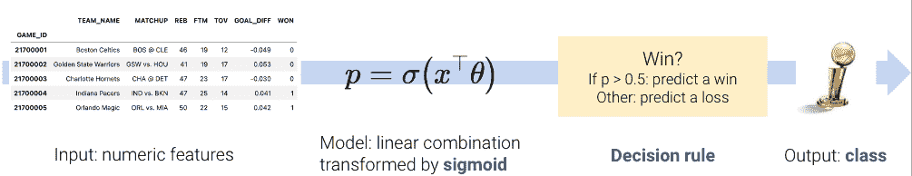

## 23.1 决策边界

在逻辑回归中，我们建模数据点属于类别 1 的*概率*。上周，我们开发了逻辑回归模型来预测该概率，但我们实际上并没有对我们的预测$y$属于类别 0 还是类别 1 进行任何*分类*。

$$ p = P(Y=1 | x) = \frac{1}{1 + e^{-x^T\theta}}$$

**决策规则**告诉我们如何解释模型的输出，以便对数据点进行分类。我们通常通过指定**阈值**$T$来制定决策规则。如果预测概率大于或等于$T$，则预测为类别 1。否则，预测为类别 0。

$$\hat y = \text{classify}(x) = \begin{cases} 1, & P(Y=1|x) \ge T\\ 0, & \text{otherwise } \end{cases}$$

阈值通常设置为$T = 0.5$，但*并非总是如此*。我们将讨论为什么我们可能希望在本讲座后期使用其他阈值$T \neq 0.5$。

使用我们的决策规则，我们可以将**决策边界**定义为根据其特征将数据分成类的“线”。对于逻辑回归，决策边界是一个**超平面** - 特征在 p 维中的线性组合 - 我们可以从最终的逻辑回归模型中恢复它。例如，如果我们有一个具有 2 个特征（2D）的模型，我们有$\theta = [\theta_0, \theta_1, \theta_2]$ 包括截距项，并且我们可以这样解决决策边界：

$$ \begin{align} T &= \frac{1}{1 + e^{-(\theta_0 + \theta_1 * \text{feature1} + \theta_2 * \text{feature2})}} \\ 1 + e^{-(\theta_0 + \theta_1 \cdot \text{feature1} + \theta_2 \cdot \text{feature2})} &= \frac{1}{T} \\ e^{-(\theta_0 + \theta_1 \cdot \text{feature1} + \theta_2 \cdot \text{feature2})} &= \frac{1}{T} - 1 \\ \theta_0 + \theta_1 \cdot \text{feature1} + \theta_2 \cdot \text{feature2} &= -\log(\frac{1}{T} - 1) \end{align} $$

对于具有 2 个特征的模型，决策边界是根据其特征的一条线。为了更容易可视化，我们在下面包括了一个一维和一个二维决策边界的示例。请注意，我们的逻辑回归模型预测的决策边界完美地将点分成了两类。

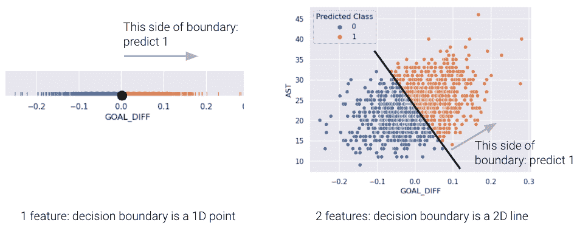

然而，在现实生活中，情况通常并非如此，我们经常看到不同类别的点在决策边界上有一些重叠。2D 数据的*真实*类如下所示：

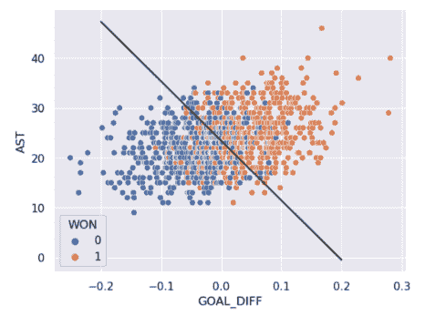

正如你所看到的，我们的逻辑回归预测的决策边界并不能完全将两个类别分开。在决策边界附近有一个“混乱”的区域，我们的分类器会预测错误的类别。数据看起来会是什么样子，使得分类器能够做出完美的预测呢？

## 23.2 线性可分性和正则化

如果存在一个超平面可以将输入特征$x$分开两个类别$y$，那么分类数据集就被称为**线性可分**。

在 1D 中的线性可分性可以通过单个特征的 rugplot 来找到。例如，注意左下角的图是沿着垂直线$x=0$线性可分的。然而，在右下角，没有这样的线可以完美地将两个类别分开。

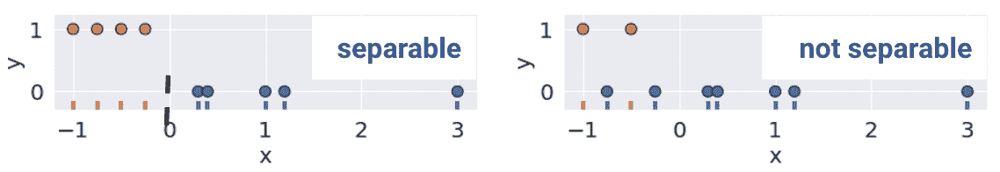

这个定义在更高的维度中也是成立的。如果有两个特征，分离的超平面必须存在于两个维度中（任何形式为$y=mx+b$的直线）。我们可以使用散点图来可视化这一点。

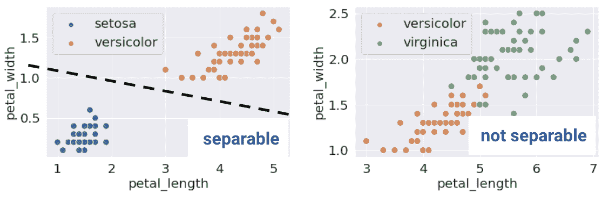

听起来很棒！当数据集是线性可分的时候，逻辑回归分类器可以完美地将数据点分配到类别中。然而，（意想不到的）复杂性可能会出现。考虑具有 2 个点和仅一个特征$x$的“玩具”数据集：

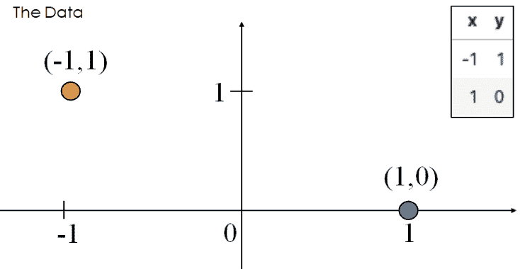

最小化损失的最佳$\theta$值将数据点的预测概率推向其真实类别。

+   $P(Y = 1|x = -1) = \frac{1}{1 + e^\theta} \rightarrow 1$

+   $P(Y = 1|x = 1) = \frac{1}{1 + e^{-\theta}} \rightarrow 0$

当$\theta = -\infty$时会发生这种情况。当$\theta = -\infty$时，我们观察到对于任何输入$x$的以下行为。

$$P(Y=1|x) = \sigma(\theta x) \rightarrow \begin{cases} 1, \text{if } x < 0\\ 0, \text{if } x \ge 0 \end{cases}$$

权重的发散会导致模型过度自信。例如，考虑新的点$(x, y) = (0.5, 1)$。根据上面的行为，我们的模型会错误地预测$p=0$，因此$\hat y = 0$。

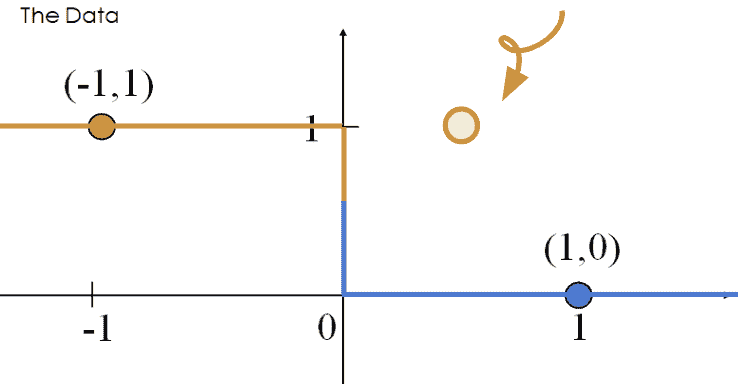

这个错误分类点所产生的损失是无穷大的。

$$-(y\text{ log}(p) + (1-y)\text{ log}(1-p))=1\text{log}(0)$$

因此，权重发散（$|\theta| \rightarrow \infty$）会出现在**线性可分**数据中。“过度自信”是过度拟合的一个特别危险的版本。

考虑损失函数关于参数$\theta$的情况。


虽然很难看到，但是对于$\theta$的负值，损失函数的平台略微向下倾斜，这意味着当$\theta$减小并趋近于$-\infty$时，损失趋近于$0$。

### 23.2.1 正则化逻辑回归

为了避免大的权重和无穷大的损失（特别是在线性可分的数据上），我们使用正则化。与线性回归一样，同样的原则适用-首先确保标准化你的特征。

例如，$L2$（Ridge）逻辑回归的形式如下：

$$\min_{\theta} -\frac{1}{n} \sum_{i=1}^{n} (y_i \text{log}(\sigma(x_i^T\theta)) + (1-y_i)\text{log}(1-\sigma(x_i^T\theta))) + \lambda \sum_{i=1}^{d} \theta_j^2$$

现在，让我们比较未正则化和正则化逻辑回归的损失函数。

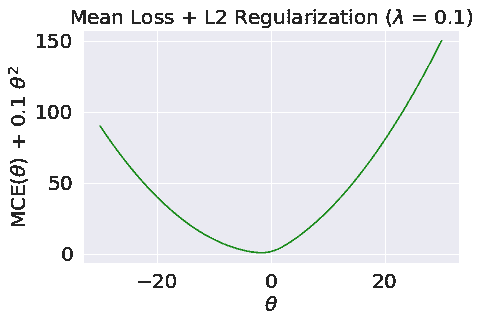

正如我们所看到的，$L2$正则化有助于防止权重发散，并且防止“过度自信”。

`sklearn`的逻辑回归默认使用 L2 正则化和`C=1.0`；`C`是$\lambda$的倒数：$C = \frac{1}{\lambda}$。将`C`设置为一个大的值，例如`C=300.0`，会导致最小的正则化。

```py
# sklearn defaults
model = LogisticRegression(penalty='l2', C=1.0, …)
model.fit()
```

请注意，在 Data 100 中，我们只使用`sklearn`来拟合逻辑回归模型。对于最优的 theta 向量，没有封闭形式的解，梯度有点混乱（有关详细信息，请参见下面的奖励部分）。

从这里，`.predict` 函数返回点的预测类别 $\hat y$。在简单的二进制情况下，

$$\hat y = \begin{cases} 1, & P(Y=1|x) \ge 0.5\\ 0, & \text{否则 } \end{cases}$$

## 23.3 性能指标

你可能会想，如果我们已经引入了交叉熵损失，为什么我们还需要额外的方法来评估我们的模型表现如何呢？在线性回归中，我们进行了数值预测，并使用损失函数来确定这些预测的“好坏”。在逻辑回归中，我们的最终目标是对数据进行分类 - 我们更关心每个数据点是否使用决策规则分配了正确的类。因此，我们对分类的*质量*感兴趣，而不是预测的概率。

最基本的评估指标是**准确率**，即被正确分类的点的比例。

$$\text{准确率} = \frac{\# \text{分类正确的点}}{\# \text{总点数}}$$

翻译成代码：

```py
def accuracy(X, Y):
    return np.mean(model.predict(X) == Y)

model.score(X, y) # built-in accuracy function
```

然而，准确率并不总是分类的一个很好的指标。要理解为什么，让我们考虑一个分类问题，有 100 封电子邮件，其中只有 5 封是真正的垃圾邮件，其余 95 封是真正的非垃圾邮件。我们将研究两个准确率不佳的模型。

+   **模型 1**：我们的第一个模型将每封电子邮件都分类为非垃圾邮件。模型的准确率很高（$\frac{95}{100} = 0.95$)，但它没有检测到任何垃圾邮件。尽管准确率很高，但这是一个糟糕的模型。

+   **模型 2**：第二个模型将每封电子邮件都分类为垃圾邮件。准确率低（$\frac{5}{100} = 0.05$)，但模型正确标记了每封垃圾邮件。不幸的是，它也错误分类了每封非垃圾邮件。

正如这个例子所说明的，准确率并不总是分类的一个很好的指标，特别是当你的数据可能表现出类别不平衡时（例如，1 的数量很少相对于 0）。

### 23.3.1 分类类型

我们的模型可能做出 4 种不同的分类：

1.  **真正例**：将正点正确分类为正（$y=1$ 和 $\hat{y}=1$）

1.  **真负例**：将负点正确分类为负（$y=0$ 和 $\hat{y}=0$）

1.  **假正例**：将负点错误分类为正（$y=0$ 和 $\hat{y}=1$）

1.  **假负例**：将正点错误分类为负（$y=1$ 和 $\hat{y}=0$）

这些分类可以简洁地总结在一个**混淆矩阵**中。

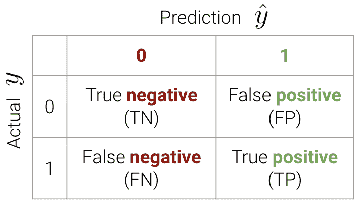

记住这个术语的一个简单方法如下：

1.  看短语中的第二个词。*正* 意味着预测为 1。*负* 意味着预测为 0。

1.  看短语中的第一个词。*真* 意味着我们的预测是正确的。*假* 意味着它是错误的。

现在我们可以将准确率计算写成 $$\text{准确率} = \frac{TP + TN}{n}$$

在`sklearn`中，我们使用以下语法

```py
from sklearn.metrics import confusion_matrix
cm = confusion_matrix(Y_true, Y_pred)
```

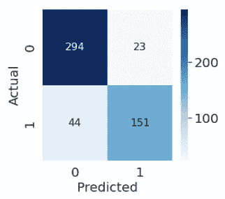

### 23.3.2 准确率、精度和召回率

我们讨论混淆矩阵的目的是激发对于具有类别不平衡的分类问题的更好的性能指标 - 即精度和召回率。

**精度** 定义为

$$\text{精度} = \frac{\text{TP}}{\text{TP + FP}}$$

精度回答了这个问题：“在所有被预测为 $1$ 的观察中，有多少比例实际上是 $1$？”它衡量了分类器在其预测为正时的准确性。

**召回率**（或**敏感度**）定义为

$$\text{召回率} = \frac{\text{TP}}{\text{TP + FN}}$$

召回旨在回答：“实际上是$1$的所有观察中，有多少被预测为$1$？”它衡量了有多少积极的预测被忽略了。

以下是一个有用的图表，总结了我们上面的讨论。

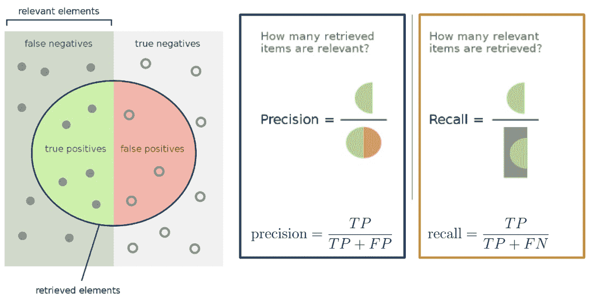

### 23.3.3 示例计算

在本节中，我们将计算我们之前的垃圾邮件分类示例的准确性、精度和召回率性能指标。作为提醒，我们有 100 封电子邮件，其中有 5 封是垃圾邮件。我们设计了两个模型：

+   模型 1：预测每封电子邮件都是*非垃圾邮件*

+   模型 2：预测每封电子邮件都是*垃圾邮件*

#### 23.3.3.1 模型 1

首先，让我们从创建混淆矩阵开始。

|  | 0 | 1 |
| --- | --- | --- |
| 0 | 真阴性：95 | 假阳性：0 |
| 1 | 假阴性：5 | 真阳性：0 |

说服自己为什么我们的混淆矩阵看起来像这样。 

$$\text{准确性} = \frac{95}{100} = 0.95$$

$$\text{精度} = \frac{0}{0 + 0} = \text{未定义}$$

$$\text{召回率} = \frac{0}{0 + 5} = 0$$

注意我们的精度是未定义的，因为我们从未预测过类$1$。由于相同的原因，我们的召回率为 0-分子为 0（我们没有积极的预测）。

#### 23.3.3.2 模型 2

我们的模型 2 的混淆矩阵如下。

|  | 0 | 1 |
| --- | --- | --- |
| 0 | 真阴性：0 | 假阳性：95 |
| 1 | 假阴性：0 | 真阳性：5 |

$$\text{准确性} = \frac{5}{100} = 0.05$$ 

$$\text{精度} = \frac{5}{5 + 95} = 0.05$$

$$\text{召回率} = \frac{5}{5 + 0} = 1$$

我们的精度很低，因为我们有很多假阳性，而我们的召回率是完美的-我们正确分类了所有的垃圾邮件（我们从未预测过类$0$）。

### 23.3.4 精度与召回率

精度（$\frac{\text{TP}}{\text{TP} + \textbf{ FP}}$)惩罚假阳性，而召回率（$\frac{\text{TP}}{\text{TP} + \textbf{ FN}}$)惩罚假阴性。

事实上，精度和召回率是*相互关联*的。这在我们的第二个模型中是明显的-我们观察到召回率高，精度低。通常，这两者之间存在权衡（大多数模型可以最小化 FP 或 FN 的数量；在少数情况下，两者都可以）。

要优先考虑的具体性能指标取决于上下文。在许多医疗环境中，错过阳性病例可能会带来更高的成本。例如，在我们的乳腺癌示例中，误将恶性肿瘤分类为良性肿瘤（假阳性）的成本更高，而不是将良性肿瘤错误地分类为恶性肿瘤（假阴性）。在后一种情况下，病理学家可以进行进一步的研究以验证恶性肿瘤。因此，我们应该最小化假阴性的数量。这等同于最大化召回率。

### 23.3.5 另外两个指标

**真阳性率（TPR）**定义为

$$\text{真阳性率} = \frac{\text{TP}}{\text{TP + FN}}$$

您会注意到这等同于*召回率*。在我们的垃圾邮件分类器的背景下，它回答了一个问题：“我标记了多少垃圾邮件是正确的？”。我们希望这个数字接近$1$

**假阳性率（FPR）**定义为

$$\text{假阳性率} = \frac{\text{FP}}{\text{FP + TN}}$$

FPR 的另一个词是*特异性*。这回答了一个问题：“我将多少常规邮件标记为垃圾邮件？”。我们希望这个数字接近$0$

随着阈值$T$的增加，TPR 和 FPR 都会减少。我们在下面为某个`toy`数据集上的某个模型绘制了这种关系。

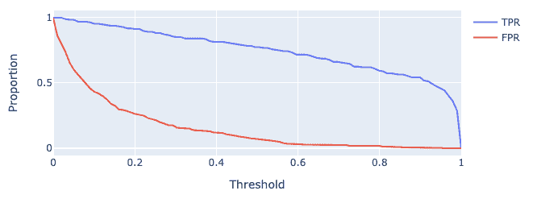

## 23.4 调整分类阈值

最小化 FP 与 FN 的数量（等效地，最大化精度与召回率）的一种方法是调整分类阈值$T$。

$$\hat y = \begin{cases} 1, & P(Y=1|x) \ge T\\ 0, & \text{otherwise } \end{cases}$$

`sklearn`中的默认阈值为$T = 0.5$。当我们增加阈值$T$时，我们“提高了标准”，即我们的分类器需要预测 1（即“积极”）的信心有多大。

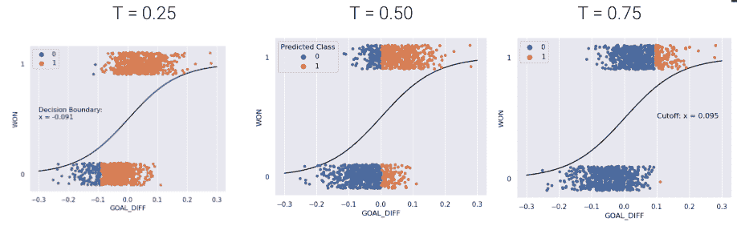

正如您可能注意到的，阈值$T$的选择会影响我们的分类器的性能。

+   高$T$：大多数预测为$0$。

    +   更多的假阴性

    +   更少的假阳性

+   低$T$：大多数预测为$1$。

    +   更多的假阳性

    +   更少的假阴性

事实上，我们可以根据我们期望的假阳性和假阴性的数量或比例选择一个阈值$T$。我们可以使用一些不同的工具来做到这一点。我们将在 Data 100 中介绍其中两个最重要的工具。

1.  精确-召回曲线（PR 曲线）

1.  “受试者工作特征”曲线（ROC 曲线）

### 23.4.1 精确-召回曲线

**精确-召回曲线（PR 曲线）**是 ROC 曲线的替代品，显示了不同阈值的精确度和召回率之间的关系。它的构造方式与 ROC 曲线类似。

让我们首先考虑精确度和召回率如何随阈值$T$的变化而变化。我们从前面很清楚 - 精确度通常会增加，召回率会减少。

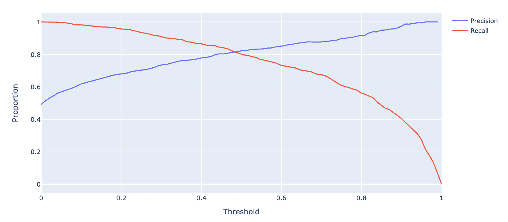

下面显示的是相同`toy`数据集的 PR 曲线。注意随着我们向左移动，阈值值会增加。

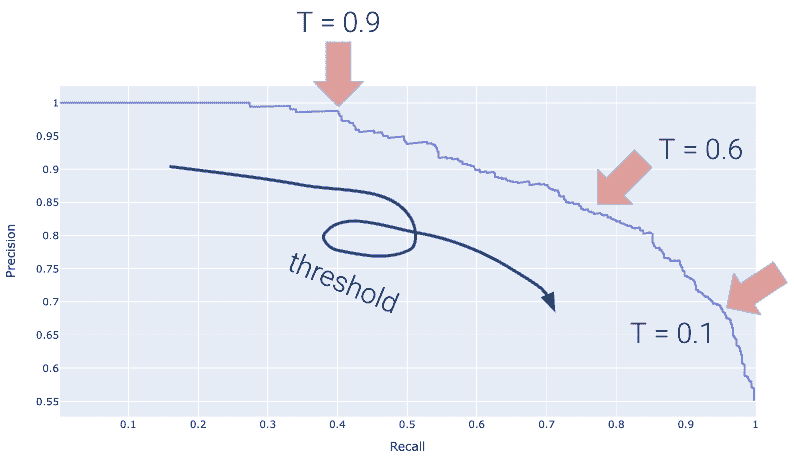

再次，完美的分类器将类似于橙色曲线，这次朝着相反的方向。

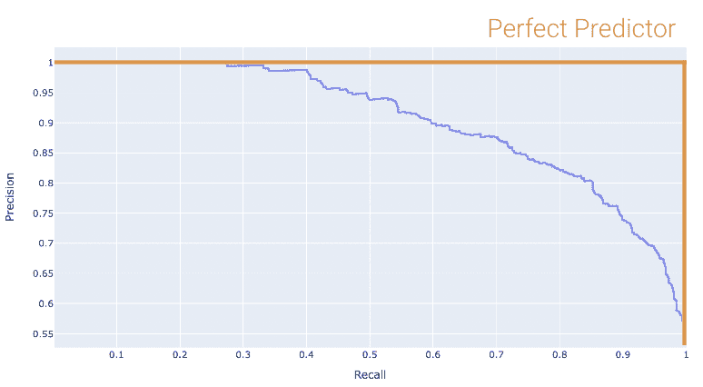

我们希望我们的 PR 曲线尽可能接近这张图的“右上角”。同样，我们使用 AUC 来确定“接近度”，完美的分类器表现为 AUC = 1（最差的为 AUC = 0.5）。

### 23.4.2 ROC 曲线

“受试者工作特征”曲线（**ROC 曲线**）绘制了 FPR 和 TPR 之间的权衡。注意曲线的最左侧对应于较高的阈值$T$值。

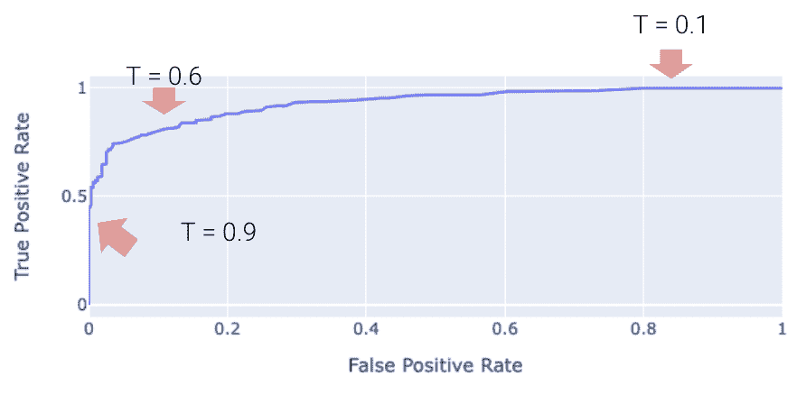

“完美”的分类器是具有 TPR = 1 和 FPR = 0 的分类器。这是在下面图中的左上角实现的。更一般地，它的 ROC 曲线类似于橙色曲线。

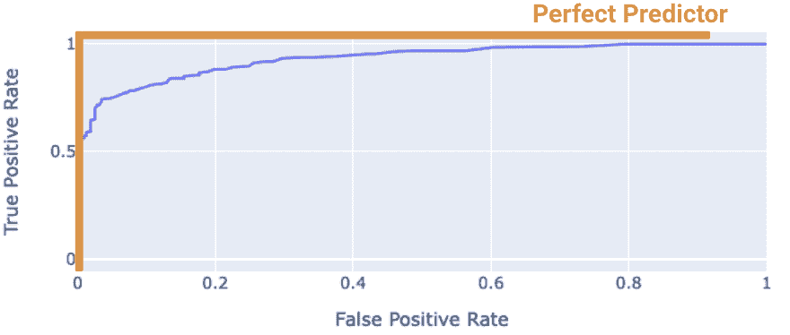

我们希望我们的模型尽可能接近这条橙色曲线。我们如何量化“接近度”？

我们可以计算 ROC 曲线下的**曲线下面积（AUC）**。注意完美分类器的 AUC = 1。我们的模型的 AUC 越接近 1，它就越好。

#### 23.4.2.1（奖励）什么是“最差”的 AUC，为什么是 0.5？

另一方面，糟糕的模型的 AUC 将更接近 0.5。随机预测器随机预测$P(Y = 1 | x)$在 0 和 1 之间均匀分布。这表明分类器无法区分正类和负类，因此随机预测其中之一。

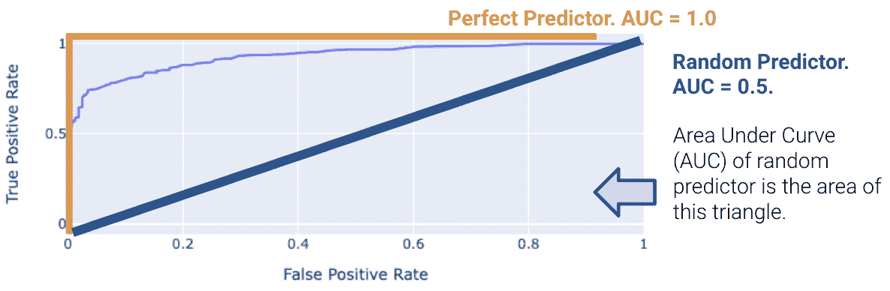

## 23.5（奖励）逻辑回归的梯度下降

让我们定义以下：$$ t_i = \phi(x_i)^T \theta \\ p_i = \sigma(t_i) \\ t_i = \log(\frac{p_i}{1 - p_i}) \\ 1 - \sigma(t_i) = \sigma(-t_i) \\ \frac{d}{dt} \sigma(t) = \sigma(t) \sigma(-t) $$

现在，我们可以简化交叉熵损失$$ \begin{align} y_i \log(p_i) + (1 - y_i) \log(1 - p_i) &= y_i \log(\frac{p_i}{1 - p_i}) + \log(1 - p_i) \\ &= y_i \phi(x_i)^T + \log(\sigma(-\phi(x_i)^T \theta)) \end{align} $$

因此，最佳的$\hat{\theta}$是$$\text{argmin}_{\theta} - \frac{1}{n} \sum_{i=1}^n (y_i \phi(x_i)^T + \log(\sigma(-\phi(x_i)^T \theta)))$$

我们希望最小化$$L(\theta) = - \frac{1}{n} \sum_{i=1}^n (y_i \phi(x_i)^T + \log(\sigma(-\phi(x_i)^T \theta)))$$

因此，我们对导数进行如下处理$$ \begin{align} \triangledown_{\theta} L(\theta) &= - \frac{1}{n} \sum_{i=1}^n \triangledown_{\theta} y_i \phi(x_i)^T + \triangledown_{\theta} \log(\sigma(-\phi(x_i)^T \theta)) \\ &= - \frac{1}{n} \sum_{i=1}^n y_i \phi(x_i) + \triangledown_{\theta} \log(\sigma(-\phi(x_i)^T \theta)) \\ &= - \frac{1}{n} \sum_{i=1}^n y_i \phi(x_i) + \frac{1}{\sigma(-\phi(x_i)^T \theta)} \triangledown_{\theta} \sigma(-\phi(x_i)^T \theta) \\ &= - \frac{1}{n} \sum_{i=1}^n y_i \phi(x_i) + \frac{\sigma(-\phi(x_i)^T \theta)}{\sigma(-\phi(x_i)^T \theta)} \sigma(\phi(x_i)^T \theta)\triangledown_{\theta} \sigma(-\phi(x_i)^T \theta) \\ &= - \frac{1}{n} \sum_{i=1}^n (y_i - \sigma(\phi(x_i)^T \theta)\phi(x_i)) \end{align} $$

将导数设置为 0 并解出$\hat{\theta}$，我们发现没有一般的解析解。因此，我们必须使用数值方法来解决。

### 23.5.1 梯度下降更新规则

$$\theta^{(0)} \leftarrow \text{初始向量（随机，零，...）} $$

对于从 0 到收敛的$\tau$：$$ \theta^{(\tau + 1)} \leftarrow \theta^{(\tau)} + \rho(\tau)\left( \frac{1}{n} \sum_{i=1}^n \triangledown_{\theta} L_i(\theta) \mid_{\theta = \theta^{(\tau)}}\right) $$

### 23.5.2 随机梯度下降更新规则

$$\theta^{(0)} \leftarrow \text{初始向量（随机，零，...）} $$

对于从 0 到收敛的$\tau$，令$B$ ~ $\text{索引的随机子集}$。$$ \theta^{(\tau + 1)} \leftarrow \theta^{(\tau)} + \rho(\tau)\left( \frac{1}{|B|} \sum_{i \in B} \triangledown_{\theta} L_i(\theta) \mid_{\theta = \theta^{(\tau)}}\right) $$
