# 二十四、PCA I

> 原文：[PCA I](https://ds100.org/course-notes/pca_1/pca_1.html)
> 
> 译者：[飞龙](https://github.com/wizardforcel)
> 
> 协议：[CC BY-NC-SA 4.0](https://creativecommons.org/licenses/by-nc-sa/4.0/)

*学习成果*

+   讨论数据集的维度和降维的策略

+   定义和执行 PCA 的过程

+   理解 PCA 和 SVD 之间的联系

## 24.1 维度

以前，我们一直在处理具有行和列的数据表。这些行和列对应于关于观察的属性。现在，我们必须更清楚地表达我们的措辞，以遵循线性代数的语言。

假设我们有一个数据集：

+   N 个观察（数据点/行）

+   d 个属性（特征/列）

在线性代数中，我们认为数据是向量的集合。向量有一个*维度*，意味着它们有一些唯一的元素。现在，行和列表示向量写的方向（水平，像一行，或垂直，像一列）：

线性代数将我们的数据视为一个矩阵：

+   d 维度中的 N 行向量，或

+   d 列向量在 N 维度

**数据的维度**是一个复杂的话题。有时，从行/列的数量就可以看出来，但有时却不行。

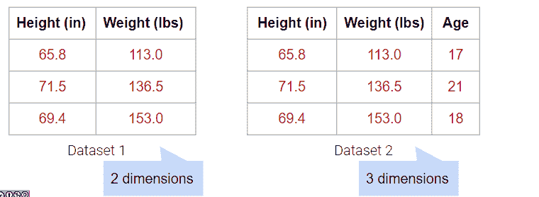

到目前为止，我们已经使用了像 rugplots 或 scatterplots 这样的可视化来帮助我们识别数据集中的聚类。由于我们人类是 3D 存在，我们无法可视化超过三个维度，但许多数据集具有超过三个特征。为了可视化多维数据，我们可以通过**降维**来将数据集减少到较低的维度。

例如，下面的数据集有 4 列，但`重量（磅）`列实际上只是`重量（千克）`列的线性变换。因此，没有捕获到新信息，我们的数据集的矩阵具有 3 的（列）秩！尽管有 4 列，我们仍然说这个数据是 3 维的。

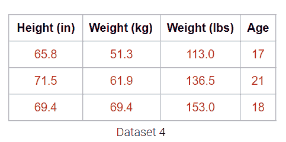

将重量列绘制在一起揭示了关键的视觉直觉。虽然两列在视觉上构成了一条线的 2D 空间，但数据并没有偏离那条单一的线。这意味着其中一个重量列是多余的！即使有了覆盖整个 2D 空间的选项，下面的数据也没有。它可能也没有这个维度，这就是为什么我们仍然认为下面的数据不跨越 1 个维度。

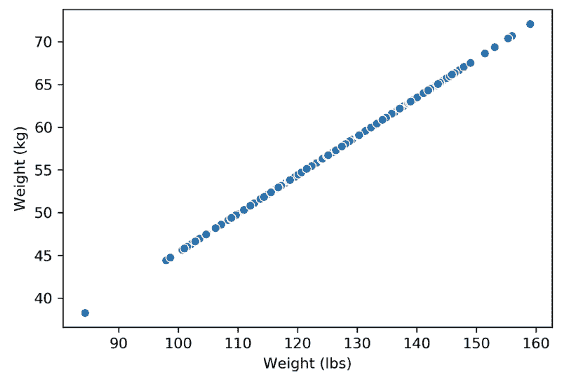

当出现异常值时会发生什么？下面，我们在上面的数据集中添加了一个异常值点，这就足以将矩阵的秩从 1 维改变为 2 维。然而，数据仍然是非常明显的 1 维。

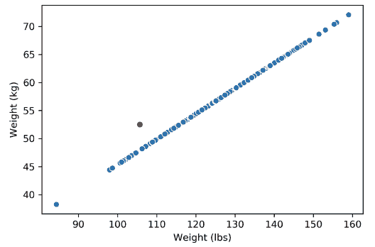

因此，降维通常是通过将数据投影到所需维度来实现对原始数据的*近似*。然而，有许多方法可以将数据集投影到较低的维度。我们如何选择最佳的方法？

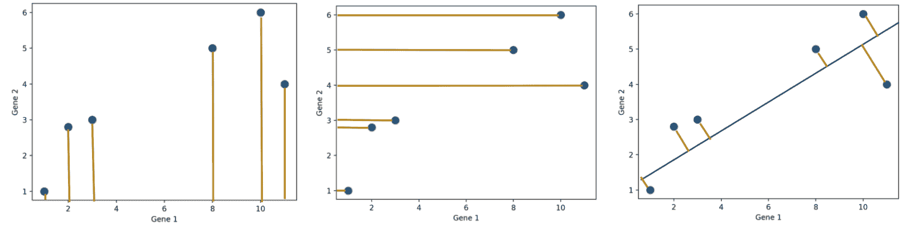

一般来说，我们希望找到最好的近似原始数据的投影（右侧的图）。换句话说，我们希望捕获原始数据的最大方差。在下一节中，我们将看到如何计算这一点。

## 24.2 矩阵作为变换

考虑下面的矩阵乘法示例：

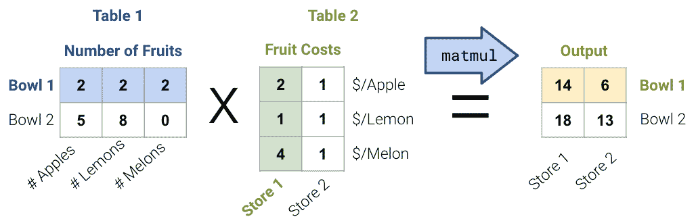

+   对于表 1，水果矩阵的每一行代表一碗水果；例如，第一碗/行有 2 个苹果，2 个柠檬和 2 个甜瓜。

+   对于表 2，美元矩阵的每一列代表商店水果的成本；例如，第一个商店/列收取 2 美元一个苹果，1 美元一个柠檬，和 4 美元一个甜瓜。

+   输出是每个商店每碗水果的成本。

一般来说，有两种解释矩阵乘法的方式：

1.  行点乘列以获得每个数据点。从这个角度来看，我们对数据执行多个线性操作！[](img/54563df5fadde9c2a9a026d33d506692.png)

1.  列的线性变换！[](img/504114f21100531d7baac9f2b3595f11.png)

## 24.3 主成分分析（PCA）

在 PCA 中，我们的目标是通过线性变换将观察从高维数据转换为低维（通常是 2 维，因为大多数可视化是 2D），换句话说，我们希望找到一个线性变换，创建一个低维表示，尽可能多地捕获原始数据的*总方差*。

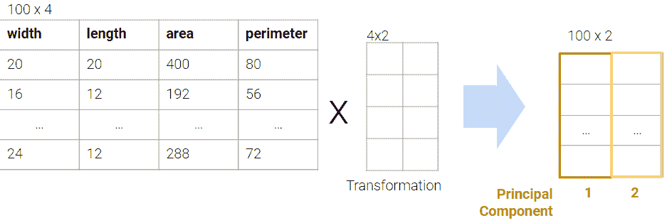

我们经常在数据科学生命周期的探索性数据分析（EDA）阶段进行 PCA，当我们不知道要使用什么模型时。它帮助我们：

+   在高维度中直观地识别相似观察的聚类。

+   如果我们怀疑数据集本质上是低秩的，可以去除不相关的维度。例如，如果列是共线的，有许多属性，但只有少数属性通过线性关联大部分决定其他属性。

+   找到表示复杂事物变化的小基础，例如图像、基因。

+   减少维度以使一些计算更便宜。

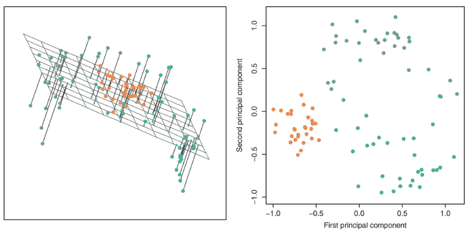

### 24.3.1 PCA 过程（概述）

对矩阵执行 PCA：

1.  通过减去每个属性列的平均值来使数据矩阵居中。

1.  要找到第$i$个主成分$v_i$：

    1.  $v$是一个单位向量，线性组合属性。

    1.  $v$给出了数据的一维投影。

    1.  选择$v$以最小化每个点与其在$v$上的投影之间的平方距离。

    1.  选择$v$，使其与所有先前的主成分正交。

第$k$个主成分捕获了数据矩阵的任何$k$维降维的最大方差。

然而，在实践中，我们不执行步骤 2 中的程序，因为计算时间太长。相反，我们使用奇异值分解（SVD）来高效地找到所有主成分。

## 24.4 奇异值分解（SVD）

奇异值分解（SVD）是线性代数中的一个重要概念。由于这门课程要求先修/同步学习线性代数课程（MATH 54, 56 或 EECS 16A），我们假设您已经学过或正在学习线性代数课程，因此我们不会完整地解释 SVD。特别是，我们将讨论：

+   为什么 SVD 是矩形矩阵的有效分解

+   为什么 PCA 是 SVD 的一个应用。

我们不会深入研究 SVD 的理论和细节。相反，我们只会涵盖数据科学解释所需的内容。如果您想了解更多信息，请查看[EECS 16B Note 14](https://eecs16b.org/notes/sp23/note14.pdf)或[EECS 16B Note 15](https://eecs16b.org/notes/sp23/note15.pdf)。

*[线性代数] 正交性* 

正交是两个词的组合：正交和正规。

当我们说一个矩阵的列是正交的时，我们说 1\. 列之间都是正交的（所有列对的点积为零）2\. 所有列都是单位向量（每个列向量的长度为 1）！[](img/fa359bda358778c4127394ff8bd822c0.png)

正交矩阵有一些重要的性质

+   **正交逆**：如果一个$m \times n$矩阵$Q$具有正交列，$QQ^T= Iₘ$和$Q^TQ=Iₙ$。

+   **坐标旋转**：由正交矩阵表示的线性变换通常是旋转（较少是反射）。我们可以想象矩阵的列是原始空间的单位向量将会落在哪里。**[线性代数] 对角矩阵

*对角矩阵**是具有对角轴上非零值的方阵，其他地方都是零。

右乘对角矩阵通过一个常数因子使每列缩放。从几何上看，这种变换可以被视为缩放坐标系。

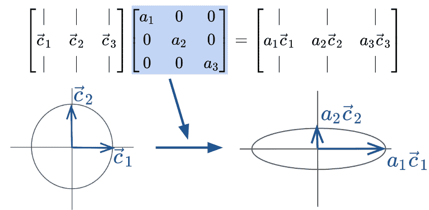

奇异值分解（SVD）描述了矩阵$X$的分解成三个矩阵：$$ X = U \Sigma V^T $$

让我们逐个分解这些术语。

### 24.4.1 $U$

+   $U$是一个$n \times d$的矩阵：$U \in \mathbb{R}^{n \times d}$。

+   它的列是**正交的**

    +   对于所有的$i, j$对，$\bar{u_i}^T\bar{u_j} = 0$

    +   所有向量$\bar{u_i}$都是长度为 1 的单位向量。

+   U 的列被称为**左奇异向量**。

+   $UU^T = I_n$和$U^TU = I_d$。

+   我们可以把$U$看作是一个旋转。

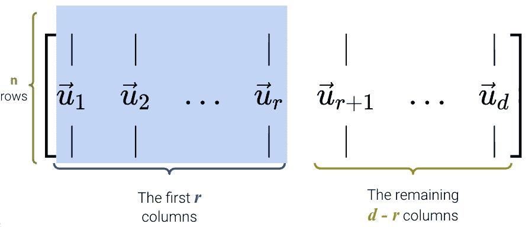

### 24.4.2 $\Sigma$

+   $\Sigma$是一个$d \times d$的矩阵：$\Sigma \in \mathbb{R}^{d \times d}$。

+   矩阵的大部分是零

+   它有$r$个**非零奇异值**，$r$是$X$的秩

+   对角值（**奇异值**$\sigma_1, \sigma_2, ... \sigma_r$）按从大到小的顺序排列$\sigma_1 > \sigma_2 > ... > \sigma_r$

+   我们可以把$\Sigma$看作是缩放。

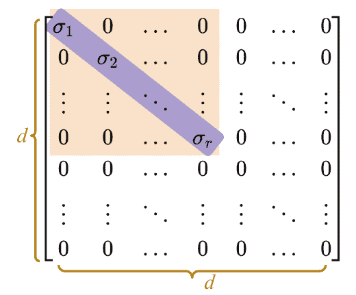

### 24.4.3 $V^T$

+   $V^T$是一个$d \times d$的矩阵：$V \in \mathbb{R}^{d \times d}$。

+   $V$的列是正交的，所以$V^T$的行也是正交的

+   $V$的列被称为**右奇异向量**。

+   $VV^T = V^TV = I_d$

+   我们可以把$V$看作是一个旋转。

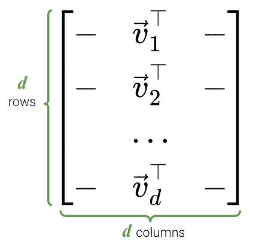

### 24.4.4 SVD：几何视角

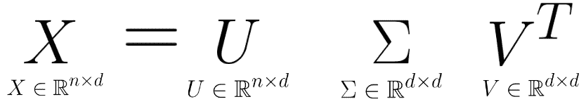

我们已经看到$U$和$V$代表旋转，$\Sigma$代表缩放。因此，SVD 表示任何矩阵都可以分解为一个旋转，然后一个缩放，再一个旋转。

### 24.4.5 `NumPy`中的 SVD

对于这个演示，我们将继续使用之前的矩形数据集，其中$n=100$行，$d=4$列。

代码

```py
import pandas as pd
import seaborn as sns
import matplotlib.pyplot as plt
import numpy as np
np.random.seed(23) #kallisti

plt.rcParams['figure.figsize'] = (4, 4)
plt.rcParams['figure.dpi'] = 150
sns.set()

rectangle = pd.read_csv("data/rectangle_data.csv")
rectangle.head(5)
```

|  | Width | Height | Area | Perimeter |
| --- | --- | --- | --- | --- |
| 0 | 8 | 6 | 48 | 28 |
| 1 | 2 | 4 | 8 | 12 |
| 2 | 1 | 3 | 3 | 8 |
| 3 | 9 | 3 | 27 | 24 |
| 4 | 9 | 8 | 72 | 34 |

在`NumPy`中，SVD 算法已经编写好，可以用`np.linalg.svd`来调用（[文档](https://numpy.org/doc/stable/reference/generated/numpy.linalg.svd.html)）。有多个版本的 SVD；要获得我们将遵循的版本，需要将`full_matrices`参数设置为`False`。

```py
U, S, Vt = np.linalg.svd(rectangle, full_matrices = False)
```

首先，让我们检查`U`。正如我们所看到的，它的维度是$n \times d$。

```py
U.shape
```

```py
(100, 4)
```

下面显示了`U`的前 5 行。

```py
pd.DataFrame(U).head(5)
```

|  | 0 | 1 | 2 | 3 |
| --- | --- | --- | --- | --- |
| 0 | -0.155151 | 0.064830 | -0.029935 | 0.638430 |
| 1 | -0.038370 | -0.089155 | 0.062019 | -0.351010 |
| 2 | -0.020357 | -0.081138 | 0.058997 | 0.018831 |
| 3 | -0.101519 | -0.076203 | -0.148160 | -0.199067 |
| 4 | -0.218973 | 0.206423 | 0.007274 | -0.079833 |

在`NumPy`中，$\Sigma$有点不同。因为对角矩阵$\Sigma$中唯一有用的值是对角轴上的奇异值，所以只返回这些值，并将它们存储在一个数组中。

我们的`rectangle_data`的秩是$3$，所以我们应该有 3 个非零奇异值，**按从大到小的顺序排列**。

```py
S
```

```py
array([3.62932568e+02, 6.29904732e+01, 2.56544651e+01, 2.56949990e-15])
```

看起来我们有 4 个非零值而不是 3 个，但请注意最后一个值非常小（$10^{-15}$），实际上几乎等于$0$。因此，我们可以四舍五入这些值，得到 3 个奇异值。

```py
np.round(S)
```

```py
array([363.,  63.,  26.,   0.])
```

要以矩阵格式获得`S`，我们使用`np.diag`。

```py
Sm = np.diag(S)
Sm
```

```py
array([[3.62932568e+02, 0.00000000e+00, 0.00000000e+00, 0.00000000e+00],
       [0.00000000e+00, 6.29904732e+01, 0.00000000e+00, 0.00000000e+00],
       [0.00000000e+00, 0.00000000e+00, 2.56544651e+01, 0.00000000e+00],
       [0.00000000e+00, 0.00000000e+00, 0.00000000e+00, 2.56949990e-15]])
```

最后，我们可以看到`Vt`确实是一个$d \times d$的矩阵。

```py
Vt.shape
```

```py
(4, 4)
```

```py
pd.DataFrame(Vt)
```

|  | 0 | 1 | 2 | 3 |
| --- | --- | --- | --- | --- |
| 0 | -0.146436 | -0.129942 | -8.100201e-01 | -0.552756 |
| 1 | -0.192736 | -0.189128 | 5.863482e-01 | -0.763727 |
| 2 | -0.704957 | 0.709155 | 7.951614e-03 | 0.008396 |
| 3 | -0.666667 | -0.666667 | -5.257886e-17 | 0.333333 |

要检查这个 SVD 是否是一个有效的分解，我们可以反向进行，并看它是否与我们原来的表匹配（它确实匹配，耶！）。

```py
pd.DataFrame(U @ Sm @ Vt).head(5)
```

|  | 0 | 1 | 2 | 3 |
| --- | --- | --- | --- | --- |
| 0 | 8.0 | 6.0 | 48.0 | 28.0 |
| 1 | 2.0 | 4.0 | 8.0 | 12.0 |
| 2 | 1.0 | 3.0 | 3.0 | 8.0 |
| 3 | 9.0 | 3.0 | 27.0 | 24.0 |
| 4 | 9.0 | 8.0 | 72.0 | 34.0 |

## 24.5 PCA with SVD

主成分分析（PCA）和奇异值分解（SVD）很容易混淆，尤其是当你不得不记住这么多首字母缩略词时。这里是一个快速总结：

+   SVD: 一个线性代数算法，将矩阵分成 3 个组成部分。

+   PCA: 一种用于降维的数据科学程序，*使用* SVD 作为其中一步。

为了从一个$n \times d$矩阵$X$中获得前$k$个主成分，我们需要：

1.  通过从每一列中减去均值来对$X$进行中心化。请注意，我们指定`axis=0`，以便按列计算均值。

```py
centered_df = rectangle - np.mean(rectangle, axis = 0)
centered_df.head(5)
```

|  | Width | Height | Area | Perimeter |
| --- | --- | --- | --- | --- |
| 0 | 2.97 | 1.35 | 24.78 | 8.64 |
| 1 | -3.03 | -0.65 | -15.22 | -7.36 |
| 2 | -4.03 | -1.65 | -20.22 | -11.36 |
| 3 | 3.97 | -1.65 | 3.78 | 4.64 |
| 4 | 3.97 | 3.35 | 48.78 | 14.64 |

1.  获得中心化$X$的奇异值分解：$U$，$Σ$ 和 $V^T$

```py
U, S, Vt = np.linalg.svd(centered_df, full_matrices = False)
Sm = pd.DataFrame(np.diag(np.round(S, 1)))
```

1.  将$UΣ$或$XV$相乘。从数学上讲，这些给出了相同的结果，但在计算上，浮点近似导致非常小的值的略有不同的数字（查看下面单元格中最右边的列）。

```py
# UΣ 
pd.DataFrame(U @ np.diag(S)).head(5) 
```

|  | 0 | 1 | 2 | 3 |
| --- | --- | --- | --- | --- |
| 0 | -26.432217 | 0.162686 | 0.807998 | -1.447811e-15 |
| 1 | 17.045285 | -2.181451 | 0.347732 | 3.893239e-15 |
| 2 | 23.245695 | -3.538040 | 1.995334 | -4.901321e-16 |
| 3 | -5.383546 | 5.025395 | 0.253448 | -3.544636e-16 |
| 4 | -51.085217 | -2.586948 | 2.099919 | -4.133102e-16 |

```py
# XV
pd.DataFrame(centered_df @ Vt.T).head(5)
```

|  | 0 | 1 | 2 | 3 |
| --- | --- | --- | --- | --- |
| 0 | -26.432217 | 0.162686 | 0.807998 | -1.539509e-15 |
| 1 | 17.045285 | -2.181451 | 0.347732 | -2.072416e-16 |
| 2 | 23.245695 | -3.538040 | 1.995334 | 4.588922e-16 |
| 3 | -5.383546 | 5.025395 | 0.253448 | -4.292862e-16 |
| 4 | -51.085217 | -2.586948 | 2.099919 | -1.650532e-15 |

1.  取$UΣ$（或$XV$）的前$k$列。这些是$X$的前$k$个主成分。

```py
two_PCs = (U @ np.diag(S))[:, :2] # using UΣ 
two_PCs = (centered_df @ Vt.T).iloc[:, :2] # using XV
pd.DataFrame(two_PCs).head()
```

|  | 0 | 1 |
| --- | --- | --- |
| 0 | -26.432217 | 0.162686 |
| 1 | 17.045285 | -2.181451 |
| 2 | 23.245695 | -3.538040 |
| 3 | -5.383546 | 5.025395 |
| 4 | -51.085217 | -2.586948 |

## 24.6 (奖金) PCA vs. 回归

### 24.6.1 回归：最小化水平/垂直误差

假设我们知道某个国家的儿童死亡率。线性回归试图从死亡率预测生育率；例如，如果死亡率为 6，我们可能猜测生育率接近 4。回归线告诉我们，通过最小化均方根误差[见垂直红线，仅显示部分]，给出了所有可能死亡率值的生育率的“最佳”预测。

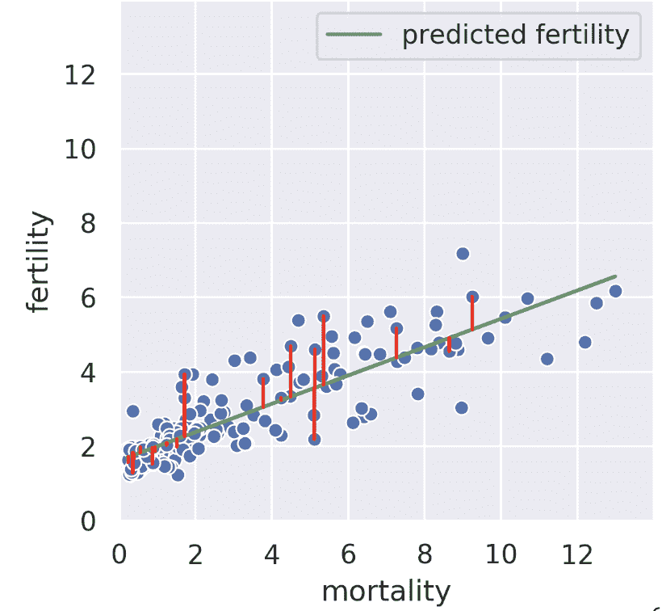

我们也可以在相反的方向进行回归，也就是说，给定生育率，我们试图预测死亡率。在这种情况下，我们得到了一条不同的回归线，它最小化了水平线的均方根长度。

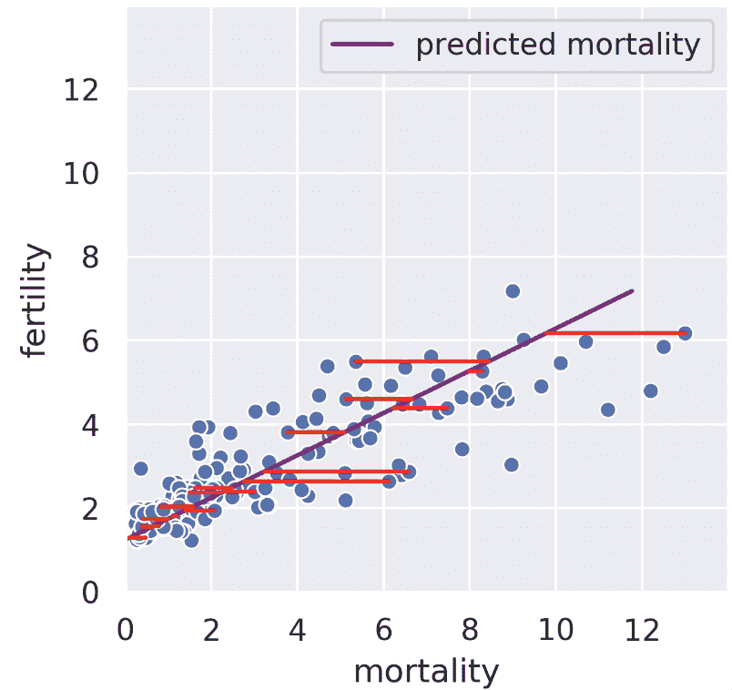

### 24.6.2 SVD：最小化垂直误差

秩 1 近似接近但不同于死亡率回归线。我们的秩 1 近似不是最小化*水平*或*垂直*误差，而是最小化*垂直*到我们投影的子空间上的误差。也就是说，SVD 找到了这样一条线，如果我们将我们的数据投影到该线上，投影与我们的原始数据之间的误差将被最小化。秩 1 近似与生育率的相似性只是一个巧合。从我们的身体测量数据集中查看脂肪和二头肌大小，我们看到我们正在投影的一维子空间位于两条回归线之间。

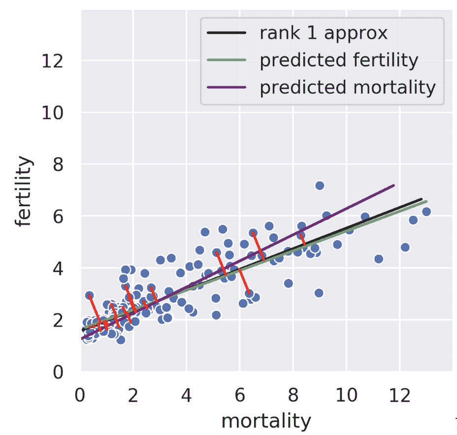

### 24.6.3 超过 1D 和 2D

在更高的维度中，主成分背后的思想是一样的！假设我们有 30 维数据，并决定使用前 5 个主成分。我们的过程最小化了原始 30 维数据与该 30 维数据投影到“最佳”5 维子空间之间的误差。有关更多详细信息，请参见[CS189](https://www.eecs189.org/static/notes/n10.pdf)。

## 24.7（奖金）自动因子分解

要记住的一个关键事实是，分解并不是任意的。矩阵的*秩*限制了如果我们想要完美重现我们的矩阵，我们的内部维度可以有多小。这个证明超出了范围。

即使我们知道我们必须使用 R 的内部维度来分解我们的矩阵，仍然留下了一个要遍历的大空间解决方案。如果我们有一个自动将秩为 R 的矩阵因子分解为具有一些变换矩阵的 R 维表示的过程呢？

+   低维表示避免了冗余特征。

+   想象一个 1000 维的数据集：如果秩只有 5，那么在这个神秘过程之后进行 EDA 会容易得多。

如果我们想要一个 2D 表示呢？将所有相关数据压缩到尽可能少的维度上以便有效地绘制它是有价值的。一些 2D 矩阵比其他矩阵产生更好的近似。我们能做得有多好呢？

## 24.8（奖金）组分得分的证明

定义组分得分的证明超出了本课程的范围，但为了您的方便，下面包括了它。

*设置*：考虑设计矩阵$X \in \mathbb{R}^{n \times d}$，其中第$j$列（对应于第$j$个特征）是$x_j \in \mathbb{R}^n$，第$i$行，第$j$列的元素是$x_{ij}$。此外，将$\tilde{X}$定义为**居中**设计矩阵。第$j$列是$\tilde{x}_j \in \mathbb{R}^n$，第$i$行，第$j$列的元素是$\tilde{x}_{ij} = x_{ij} - \bar{x_j}$，其中$\bar{x_j}$是原始$X$的$x_j$列向量的均值。

*方差*：构造**协方差矩阵**：$\frac{1}{n} \tilde{X}^T \tilde{X} \in \mathbb{R}^{d \times d}$。对角线上的第$j$个元素是原始设计矩阵$X$的第$j$列的**方差**：

$$\left( \frac{1}{n} \tilde{X}^T \tilde{X} \right)_{jj} = \frac{1}{n} \tilde{x}_j ^T \tilde{x}_j = \frac{1}{n} \sum_{i=i}^n (\tilde{x}_{ij} )^2 = \frac{1}{n} \sum_{i=i}^n (x_{ij} - \bar{x_j})^2$$

*SVD*：假设*居中*设计矩阵$\tilde{X}$的奇异值分解为$\tilde{X} = U \Sigma V^T$，其中$U \in \mathbb{R}^{n \times d}$和$V \in \mathbb{R}^{d \times d}$是具有正交列的矩阵，$\Sigma \in \mathbb{R}^{d \times d}$是具有$\tilde{X}$的奇异值的对角线矩阵。


最后一行定义了第$j$个组分得分。
