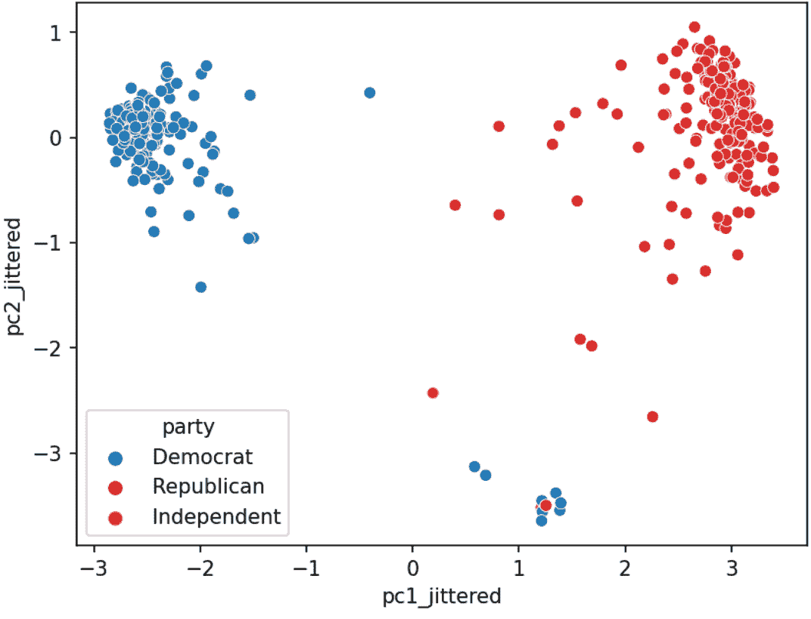

# 二十五、PCA II

> 原文：[PCA II](https://ds100.org/course-notes/pca_2/pca_2.html)
> 
> 译者：[飞龙](https://github.com/wizardforcel)
> 
> 协议：[CC BY-NC-SA 4.0](https://creativecommons.org/licenses/by-nc-sa/4.0/)

*学习成果* 

+   深入理解如何解释主成分分析（PCA）。

+   看看 PCA 在一些现实世界的应用。

## 25.1 PCA 回顾

### 25.1.1 使用 SVD 的 PCA

在找到$X$的 SVD 之后：

我们可以推导出数据的主成分。具体来说，$V^{T}$的前$n$行是$n$个主成分的方向。

### 25.1.2 V 的列是方向

$V$的每一列元素（$V^{T}$的每一行）将原始特征向量旋转成一个主成分。

V 的第一列表示每个特征对第一个主成分的贡献（例如正面、负面等）。

这种解释也让我们理解：

1.  主成分都是**正交**的，因为 U 的列是标准正交的。

1.  主成分是**轴对齐**的。也就是说，如果你在二维平面上绘制两个主成分，一个会在 x 轴上，另一个会在 y 轴上。

1.  主成分是我们数据 X 中列的**线性组合**

### 25.1.3 使用主成分

让我们总结通过 SVD 获取主成分的步骤：

1.  通过减去每个属性列的平均值来使数据矩阵居中。

1.  要找到$k$个**主成分**：

    1.  计算数据矩阵的 SVD（$X = U{\Sigma}V^{T}$）

    1.  $U{\Sigma}$的前$k$列（或者等价地，$XV$）包含了$X$的$k$个**主成分**。

## 25.2 数据方差和居中

我们定义数据矩阵的总方差为属性方差的总和。主成分是一个低维表示，尽可能多地捕捉原始数据的总方差。形式上，第$i$个奇异值告诉我们**成分得分**，即第$i$个主成分捕捉了多少数据方差。假设数据点的数量是$n$：

$$\text{i-th component score} = \frac{(\text{i-th singular value}^2)}{n}$$

将成分得分相加等同于计算总方差*如果我们对数据进行了居中*。

**数据居中**：PCA 有一个数据居中的步骤，它在任何奇异值分解之前进行，如果实施了，就会定义上面的成分得分。

如果你想深入了解 PCA，[Steve Brunton 的 SVD 视频系列](https://www.youtube.com/playlist?list=PLMrJAkhIeNNSVjnsviglFoY2nXildDCcv)是一个很好的资源。

## 25.3 解释 PCA

### 25.3.1 案例研究：众议院投票

让我们来看看众议院（第 116 届国会，第 1 届会议）在 2019 年 9 月投票的情况。

具体来说，我们将查看点名投票的记录。来自美国参议院（[链接](https://www.senate.gov/reference/Index/Votes.htm)）：点名投票发生在代表或参议员投票“赞成”或“反对”时，以便记录每一方投票的成员的名字。口头表决是指那些赞成或反对某项措施的人分别说“赞成”或“反对”，而不记录每一方投票的成员的名字或计数。

**立法者的点名投票是否与他们的政党有关？**

请访问此[链接](https://data100.datahub.berkeley.edu/hub/user-redirect/git-pull?repo=https%3A%2F%2Fgithub.com%2FDS-100%2Ffa23-student&urlpath=lab%2Ftree%2Ffa23-student%2Flecture%2Flec26%2Flec26-votes.ipynb&branch=main)查看完整的 Jupyter 笔记本演示。

正如演示所示，PCA 的主要目标是通过线性变换将高维数据的观测值转换为低维数据。

PCA 的一个相关目标是将数据的低维表示捕捉原始数据的变异性。例如，如果前两个奇异值很大，而其他奇异值相对较小，那么两个维度可能足以描述大部分区分观测之间的差异。然而，如果情况并非如此，那么 PCA 散点图可能遗漏了大量信息。

我们可以使用以下公式来量化每个主成分对总方差的贡献：

$$ \text{成分得分} = \frac{\sigma_i^{2}}{N}$$

$$ \text{总方差} = \text{所有成分得分之和} = \sum_{i=1}^k \frac{\sigma_i^{2}}{N} $$

$$ \text{主成分 i 的方差比率} = \frac{\text{主成分得分 i}}{\text{总方差}} = \frac{\sigma_i^{2} / N}{\sum_{i=1}^k \sigma_i^{2} / N}$$

在 Python 中，假设您有一个由`np.linalg.svd`返回的奇异值`s`的一维`NumPy`数组，您可以使用`s**2 / sum(s**2)`计算方差比率的列表。

### 25.3.2 PCA 图

我们经常使用散点图绘制前两个主成分，其中 PC1 在$x$-轴上，PC2 在$y$-轴上。这通常被称为 PCA 图。

如果前两个奇异值很大，而其他奇异值很小，那么两个维度足以描述大部分区分观测之间的差异。如果不是这样，那么 PCA 图遗漏了大量信息。

PCA 图帮助我们评估数据点之间的相似性以及数据集中是否存在任何聚类。例如，在之前的案例研究中，我们可以创建以下 PCA 图：

### 25.3.3 屏幕图

屏幕图显示了每个主成分捕获的**方差比率**，首先是最大的方差比率。它们帮助我们直观地确定描述数据所需的维度数量。在图中大幅下降后的区域中的奇异值对应于**不**需要描述数据的主成分，因为它们解释了数据总方差的相对较低比例。例如，在下面的图中，我们可以使用刚才描述的“拐点法”来确定前 2 个 PCs 捕获了大部分信息。

### 25.3.4 双标图

双标图将方向叠加到 PC2 vs PC1 的图上，其中向量$j$对应于特征$j$的方向（例如$v_{1j}, v_{2j}$）。有几种方法可以缩放双标图向量-在本课程中，我们绘制方向本身。对于其他缩放，可以导致更可解释的方向/载荷，请参阅[SAS 双标图](https://blogs.sas.com/content/iml/2019/11/06/what-are-biplots.html)

通过双标图，我们可以解释特征如何与所示的主成分相关联：正相关、负相关或几乎没有相关。

箭头的方向是($v_1$, $v_2$)，其中$v_1$和$v_2$是特定特征列对 PC1 和 PC2 的贡献，$v_1$和$v_2$分别是$V$的第一列和第二列的元素（即$V^T$的前两行）。

假设我们正在考虑特征 3，并且说这是标记为`520`的紫色箭头（指向右下角）。

+   $v_1$和$v_2$是$V$中相应列的第三个元素。它们是特征 3 的列向量在线性变换到 PC1 和 PC2 时的比例。

+   在这里，我们可以推断$v_1$（在$x$/PC1 方向上）是正的，这意味着特征 3 的线性增加将对应于 PC1 的线性增加，这意味着特征 3 和 PC1 呈正相关。

+   $v_2$（在$y$/pc2 方向）为负，意味着特征 3 的线性增加将导致 PC2 的线性减少，这意味着特征 3 和 PC2 呈负相关。

## 25.4 PCA 的应用

### 25.4.1 生物学中的 PCA

PCA 通常用于生物医学背景中，其中有许多命名变量！

1.  对数据进行聚类（[论文 1](https://bmcbioinformatics.biomedcentral.com/articles/10.1186/s12859-019-2680-1)，[论文 2](https://www.science.org/doi/10.1126/scirobotics.abk2378)）

1.  识别相关变量（[解释](https://docs.google.com/presentation/d/1-aDu0ILCkPx3iCcJGB3YXci-L4g90Q6AarXU6wffLB8/edit#slide=id.g62cb86badb_0_1128) $V^{T}$ 的行作为线性系数）（[论文 3](https://www.nature.com/articles/s41598-017-05714-1)）。使用[双标图](https://www.google.com/url?q=https://www.geo.fu-berlin.de/en/v/soga/Geodata-analysis/Principal-Component-Analysis/principal-components-basics/Interpretation-and-visualization/index.html%23:~:text%3DThe%2520biplot%2520is%2520a%2520very,in%2520a%2520single%2520biplot%2520display.%26text%3DThe%2520plot%2520shows%2520the%2520observations,principal%2520components%2520(synthetic%2520variables).&sa=D&source=editors&ust=1682131633152964&usg=AOvVaw2H9SOeMP5kUS890Fkhfthx)。

### 25.4.2 为什么执行 PCA

我们经常在数据科学生命周期的探索性数据分析（EDA）阶段执行 PCA（如果我们已经知道要建模什么，我们可能不需要 PCA）；它帮助我们：

+   在高维度中直观地识别相似观察的聚类。

+   如果怀疑数据集本质上是低秩的，则移除不相关的维度。例如，如果列是共线的：属性很多，但只有少数属性通过线性关联决定了其余属性。

+   寻找表示复杂事物变化的小基础，例如图像、基因。

+   减少维度以使某些计算更便宜。

### 25.4.3 图像分类

在机器学习中，PCA 经常用作在训练监督模型之前的预处理步骤。

查看以下[演示](https://data100.datahub.berkeley.edu/hub/user-redirect/git-pull?repo=https%3A%2F%2Fgithub.com%2FDS-100%2Ffa23-student&urlpath=lab%2Ftree%2Ffa23-student%2Flecture%2Flec26%2Flec26-fashion-mnist.ipynb&branch=main)以了解 PCA 如何有助于基于 MNIST-Fashion 数据集构建图像分类模型。

演示显示了我们如何在数据科学生命周期的探索性数据分析阶段使用 PCA 来：- 在高维度中直观地识别相似观察的聚类。- 寻找表示复杂事物变化的小基础。- 减少维度以使某些计算更便宜。

### 25.4.4 为什么先 PCA，然后建模？

1.  降低维度，使我们能够加快训练速度并减少特征数量等。

1.  避免新特征中的多重共线性（即主成分）

