# 二十六、聚类

> 原文：[Clustering](https://ds100.org/course-notes/clustering/clustering.html)
> 
> 译者：[飞龙](https://github.com/wizardforcel)
> 
> 协议：[CC BY-NC-SA 4.0](https://creativecommons.org/licenses/by-nc-sa/4.0/)

*学习成果*

+   聚类介绍

+   评估聚类方法的分类法

+   K 均值聚类

+   没有明确损失函数的聚类：最小化惯性

+   层次凝聚聚类

+   选择 K：一个超参数

上次，我们通过讨论主成分分析（PCA）开始了我们对无监督学习的探讨。

在本讲座中，我们将探讨另一个非常流行的无监督学习概念：聚类。聚类允许我们在没有给出“类”或每个点明确来自何处的标签的情况下将相似的数据点“分组”在一起。我们将讨论两种聚类算法：K 均值聚类和层次凝聚聚类，并且我们将检查每种算法的假设、优势和局限性。

## 26.1 回顾：机器学习分类法

### 26.1.1 监督学习

在“监督学习”中，我们的目标是创建一个将输入映射到输出的函数。每个模型都是从示例输入/输出对（训练集）中学习的，使用输入/输出对进行验证，并最终在更多的输入/输出对上进行测试。每对由以下组成：

+   输入向量

+   输出值（**标签**）

在回归中，我们的输出值是定量的，在分类中，我们的输出值是分类的。

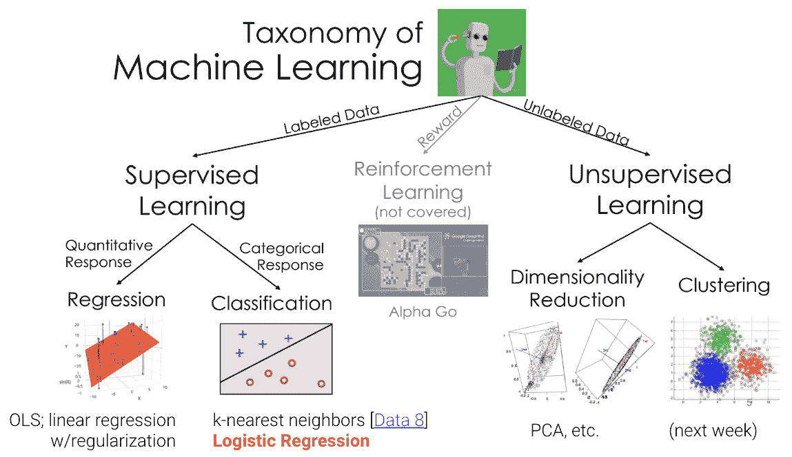

ML 分类法

### 26.1.2 无监督学习

在无监督学习中，我们的目标是识别无标签数据中的模式。在这种类型的学习中，我们没有输入/输出对。有时我们可能有标签，但选择忽略它们（例如在标记数据上进行 PCA）。相反，我们更感兴趣的是我们所拥有的数据的固有结构，而不是仅仅使用该数据的结构来预测标签。例如，如果我们对降维感兴趣，我们可以使用 PCA 将我们的数据降低到较低的维度。

现在让我们考虑一个新问题：聚类。

### 26.1.3 聚类示例

#### 26.1.3.1 示例 1

考虑一下 2019 年秋季期中考试 2 的图。原始数据集有 8 个维度，但我们已经使用 PCA 将我们的数据减少到 2 个维度。

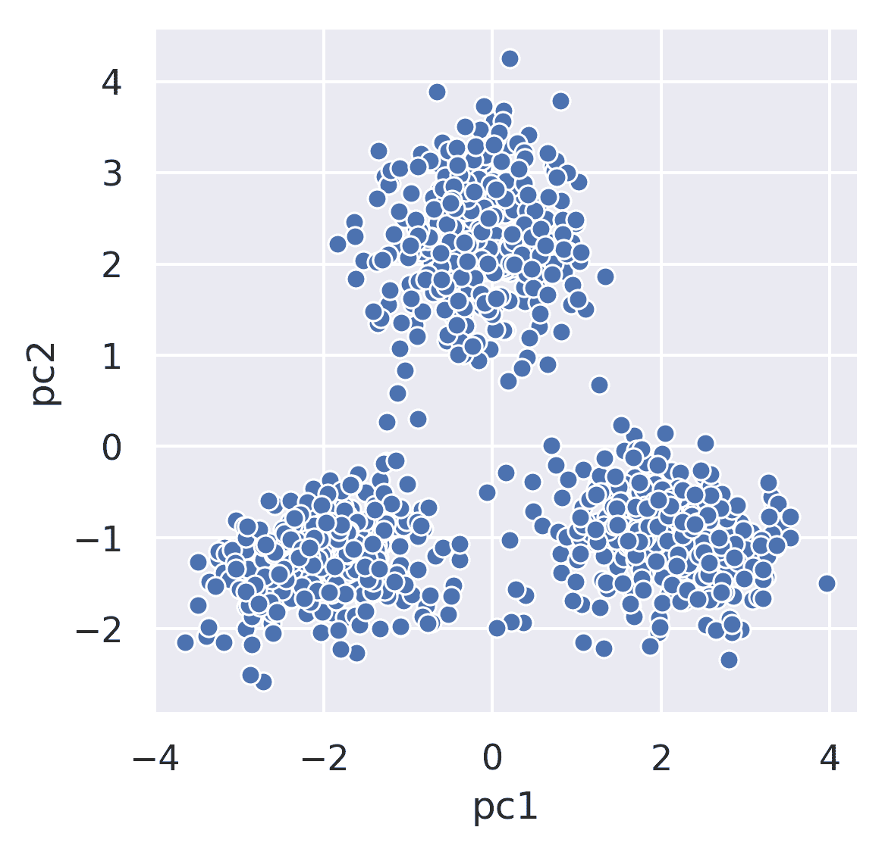

每个点表示游客在 8 个不同动物园展品上花费的时间的第一和第二主成分。从视觉和直觉上，我们可能会猜测这些数据属于 3 个组：每个集群一个。现在聚类的目标是将每个点（在 2 维 PCA 表示中）分配到一个集群中。

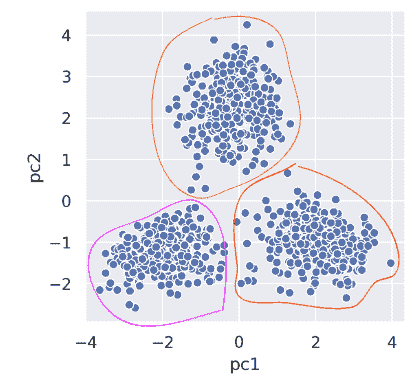

这是一个无监督的任务，因为：

+   我们没有每个访客的标签。

+   希望推断出模式，即使没有标签。

#### 26.1.3.2 示例 2：Netflix

现在假设你是 Netflix，正在查看有关客户观看习惯的信息。聚类在这里很有用。我们可以将每个人或节目分配到一个“集群”。（注意：虽然我们不能确定 Netflix 是否实际使用 ML 聚类来识别这些类别，但原则上他们可以这样做。）

请记住，对于聚类，我们不需要提前定义聚类。这标志着聚类和分类之间的一个关键区别，而在分类中，我们必须提前决定标签，而聚类会自动发现组。

#### 26.1.3.3 示例 3：教育

假设我们正在处理学生生成的材料，并将其传递到 S-BERT 模块以提取句子嵌入。从集群中提取特征：

+   检测组活动中的异常

+   预测组的中位数测验成绩

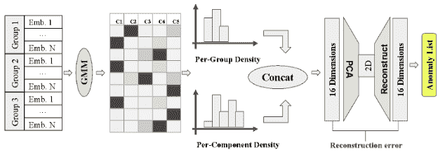

在这里，我们可以看到异常检测模块的大纲。它包括：

+   S-BERT 特征提取

+   主题提取

+   特征提取

+   16D $\rightarrow$ 2D PCA 降维和 2D $\rightarrow$ 16D 重构

+   基于重构误差的异常检测

更仔细地观察我们的聚类，我们可以更好地理解中心所代表的不同组件。下面我们有两个例子。

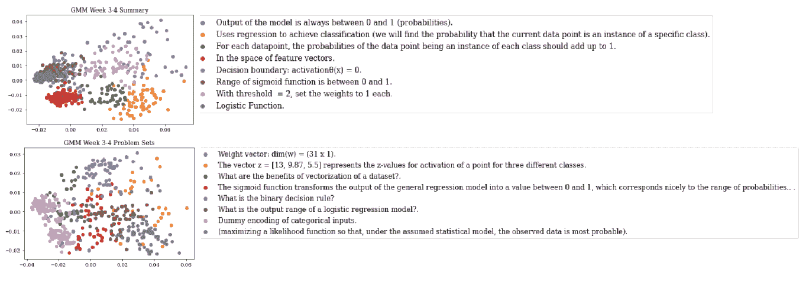

请注意，此示例的详细信息不在范围内。

#### 26.1.3.4 例 4：逆向工程生物学

现在，考虑下面的图：

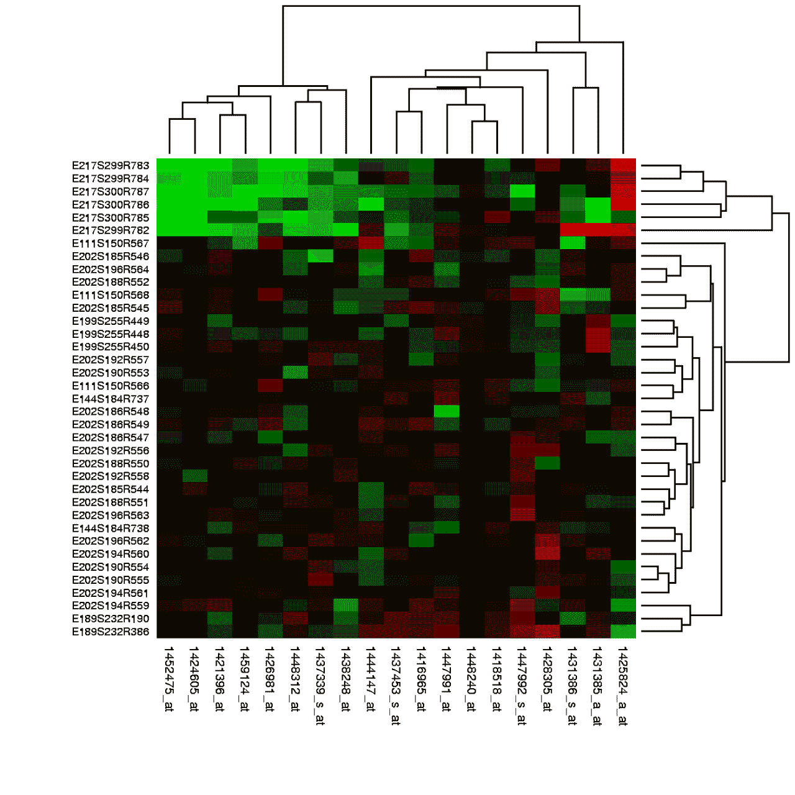

这个图的行是条件（例如一个行可能是：“在细胞上倒酸”），列是基因。绿色表示基因“关闭”（红色表示基因“开启”）。例如，图的左上角的~9 个基因都被顶部的 6 个实验（行）关闭。

在聚类的视角下，我们可能对基于对某些实验的反应（开/关）相似的观察结果进行聚类感兴趣。

例如，这是我们在聚类之前和之后的数据。

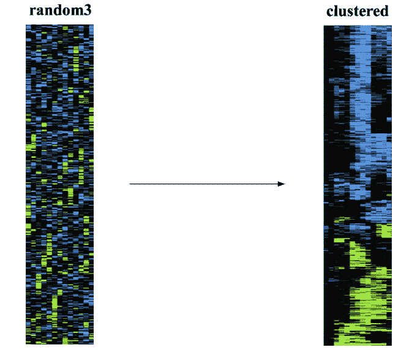

注意：如果你无法通过眼睛区分红色和绿色，我很抱歉！历史可视化并不总是最好的。

## 26.2 聚类方法的分类

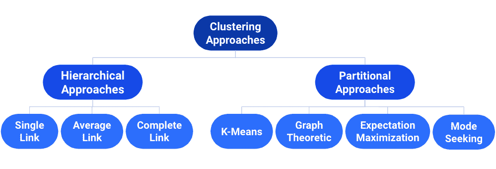

有许多类型的聚类算法，它们都有优势、固有的弱点和不同的用例。我们首先将专注于分区方法：K-Means 聚类。

## 26.3 K-Means 聚类

最流行的聚类方法是 K-Means。算法本身包括以下内容：

1.  选择一个任意的$K$，并随机放置$K$个不同颜色的“中心”。

1.  重复直到收敛：

    1.  根据最接近的中心对点进行着色。

    1.  将每种颜色的中心移动到具有该颜色的点的中心。

考虑以下具有任意$K = 2$和随机放置的不同颜色（蓝色、橙色）“中心”的数据：

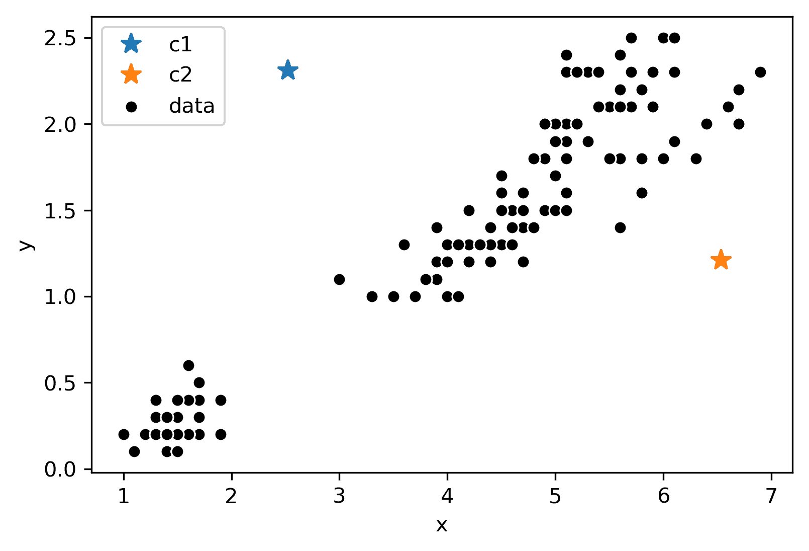

现在，我们将遵循算法的其余部分。首先，让我们根据最接近的中心对每个点进行着色：

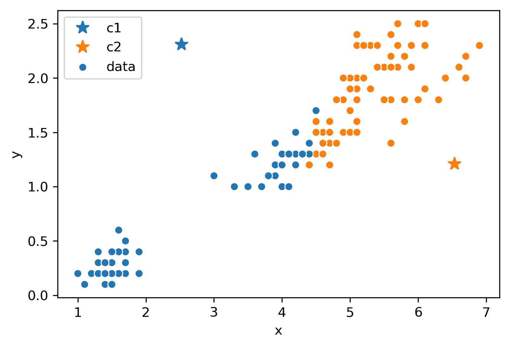

接下来，我们将把每种颜色的中心移动到具有该颜色的点的中心。请注意，中心通常在其颜色共享的数据中心位置。

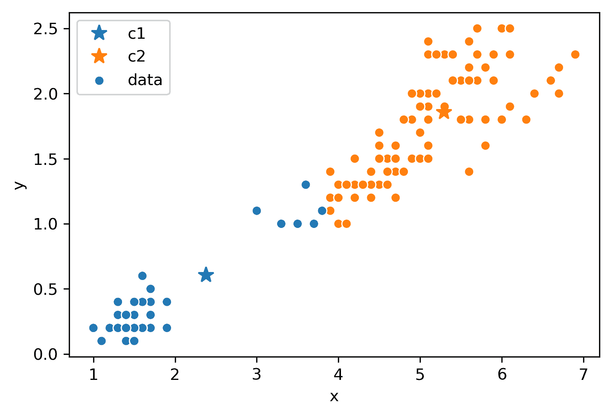

假设这个过程（重新着色，重新设置中心）重复了几次迭代，我们最终达到了这个状态。

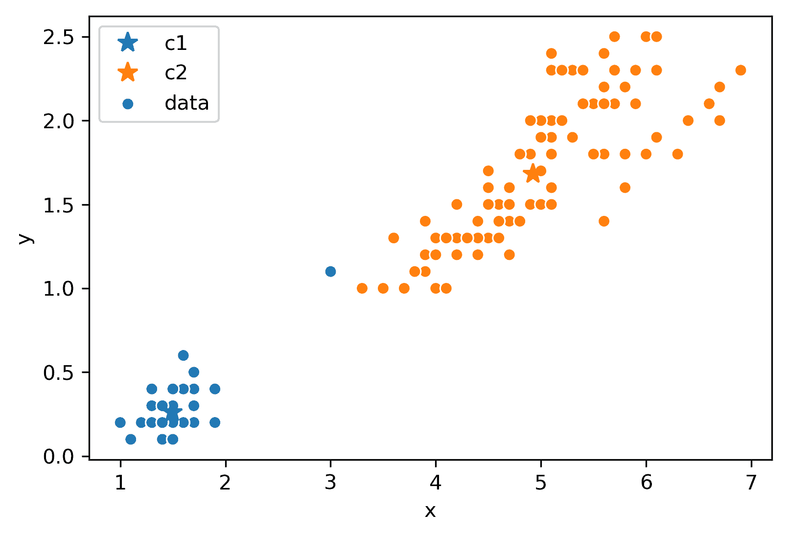

在这次迭代之后，中心保持不动，根本不移动。因此，我们已经收敛，聚类完成了！

#### 26.3.0.1 注意

一个快速的说明：K-Means 是一种完全不同的算法，与 K-最近邻算法完全不同。K-Means 用于*聚类*，其中每个点被分配到$K$个簇中的一个。另一方面，K-最近邻算法用于*分类*（或更少见的回归），预测值通常是训练集中$K$个最近数据点中最常见的类。这些名称可能相似，但实际上没有任何共同之处。

## 26.4 最小化惯性

考虑以下$K = 4$的例子：

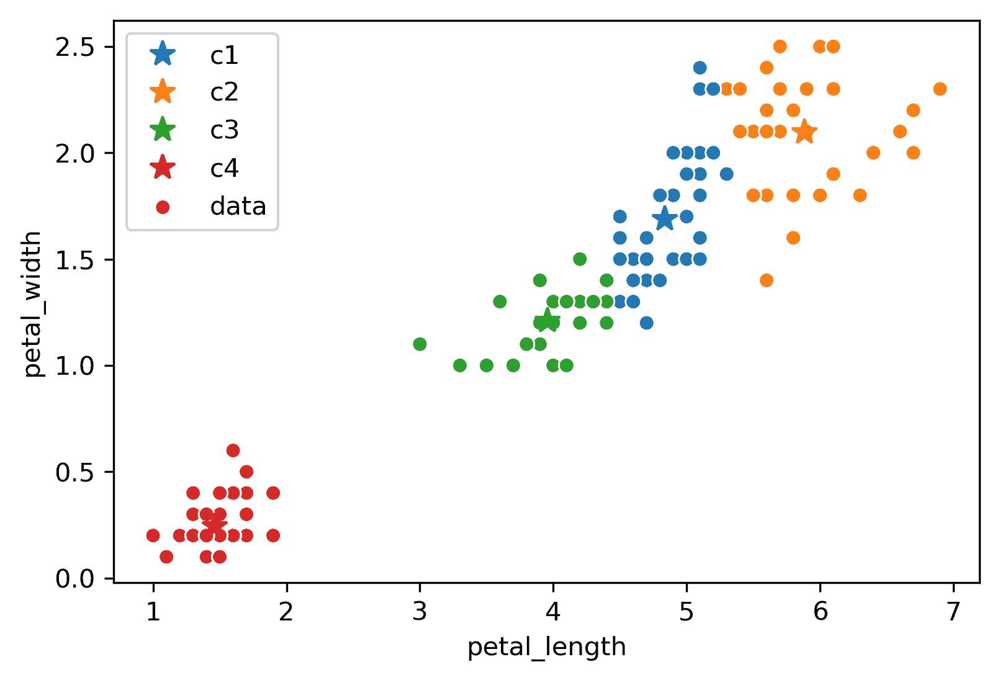

由于$K$中心初始化/开始的随机性，每次运行 K-Means 都会得到不同的输出/聚类。考虑三种可能的 K-Means 输出；算法已经收敛，颜色表示它们被聚类为的最终簇。

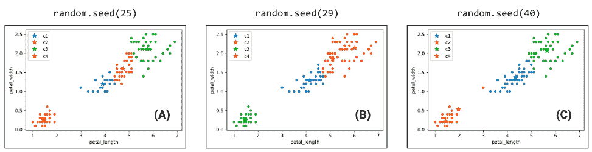

哪种聚类输出是最好的？要评估不同的聚类结果，我们需要一个损失函数。

两种常见的损失函数是：

+   **惯性**：每个数据点到其中心的平方距离的总和。

+   **畸变**：每个数据点到其中心的平方距离的加权和。

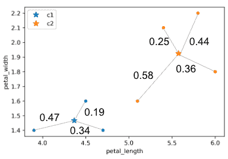

在上面的例子中：

+   计算的惯性：$0.47^2 + 0.19^2 + 0.34^2 + 0.25^2 + 0.58^2 + 0.36^2 + 0.44^2$

+   计算失真：$\frac{0.47^2 + 0.19^2 + 0.34^2}{3} + \frac{0.25^2 + 0.58^2 + 0.36^2 + 0.44^2}{4}$

回到本节开头的四簇示例，`random.seed(25)`的惯性为`44.96`，`random.seed(29)`的惯性为`45.95`，`random.seed(40)`的惯性为`54.35`。看来最佳的聚类输出是`random.seed(25)`，惯性为`44.96`！

事实证明，K-Means 试图最小化的函数是惯性，但通常无法找到全局最优解。为什么会这样？我们可以将 K-means 看作是一对轮流进行优化的优化器。第一个优化器保持*中心位置*恒定，并优化*数据颜色*。第二个优化器保持*数据颜色*恒定，并优化*中心位置*。两个优化器都没有完全控制！

这是一个困难的问题：给出一个优化给定$K$的惯性的算法；$K$是预先选择的。你的算法应该返回确切的最佳中心和颜色，但你不需要担心运行时间。

*注意：这是一个有点 CS61B/CS70/CS170 问题，所以不要太担心完全理解我们所处的棘手困境！*

一个潜在的算法：

+   对于所有可能的 k^n 种着色：

    +   计算该着色的 k 个中心。

    +   计算$k$个中心的惯性。

        +   如果当前的惯性比已知的最佳值更好，那么写下当前的中心和着色，并将其称为新的已知最佳值。

尚未找到更好的算法来解决最小化惯性的问题。

## 26.5 分层聚类

现在，让我们考虑分层聚类。

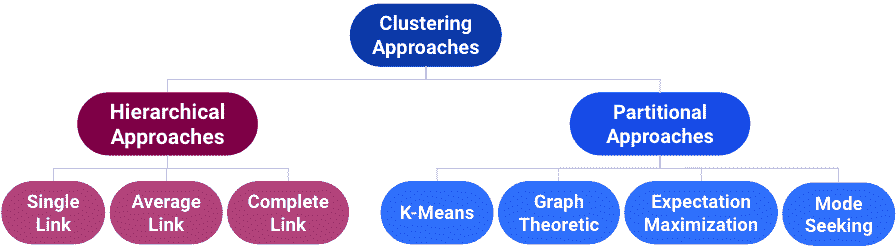

考虑两个 K-Means 聚类输出的结果：

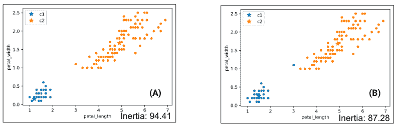

你更喜欢哪个聚类结果？看起来 K-Means 更喜欢右边的结果，因为它的惯性更低（每个数据点到其中心的平方距离之和），但这引发了一些问题：

+   为什么右边的惯性更低？K-Means 优化距离，而不是`blobbiness`。

+   右边的聚类“错误”吗？好问题！

现在，让我们介绍分层聚类！我们从每个数据点在一个单独的簇开始，然后我们将继续合并最相似的数据点/簇，直到最后只剩下一个大簇。这被称为**自下而上**或**聚合方法**。

有各种方法来决定合并簇的顺序，称为**链接标准**：

+   **单链接**（最相似的相似性）：两个簇之间的距离是第一个簇中的一个点与第二个簇中的一个点之间的**最小**距离。

+   **完全链接**（最不相似的相似性）：两个簇之间的距离是第一个簇中的一个点与第二个簇中的一个点之间的**最大**距离。

+   **平均链接**：簇中两个点的**平均**相似性。

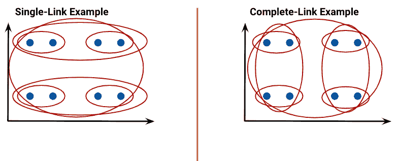

当算法开始时，每个数据点都在自己的簇中。在下面的图中，有 12 个数据点，所以算法从 12 个簇开始。随着聚类的开始，它开始评估哪些簇彼此最接近。

最接近的簇是 10 和 11，所以它们被合并在一起。

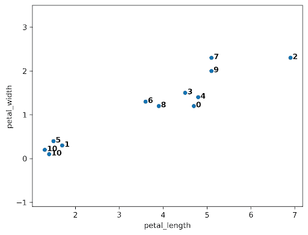

接下来，点 0 和 4 被合并在一起，因为它们最接近。

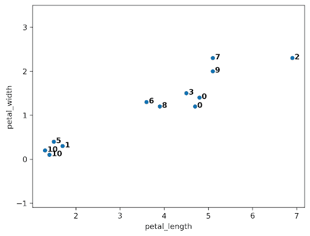

在这一点上，我们有 10 个簇：8 个单点（簇 1、2、3、4、5、6、7、8 和 9）和 2 个双点（簇 0 和 10）。

尽管簇 0 和 3 不是最接近的，但让我们考虑如果我们试图合并它们。一个棘手的问题出现了：簇 0 和 3 之间的距离是多少？我们可以使用“完全链接”方法，它使用组之间所有点对中的最大距离。

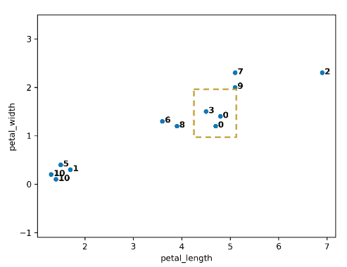

让我们假设算法运行时间稍长，并且我们已经达到了以下状态。接下来是簇 0 和 7，但为什么？0 和 6 之间的最大线长于 0 和 7 之间的最大线长。

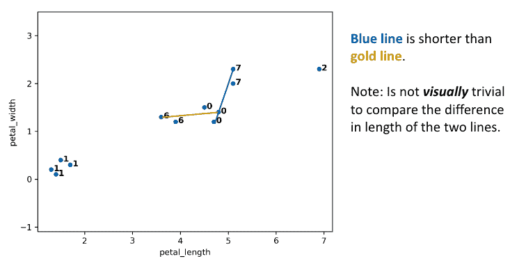

因此，0 和 7 被合并为 0。

经过更多迭代，我们最终收敛到左侧的图。有两个簇（0，1），凝聚算法已经收敛。

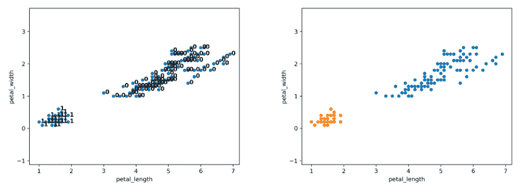

请注意，在完整数据集上，我们的凝聚聚类算法实现了更“正确”的输出。

### 26.5.1 聚类、树状图和直觉

聚合聚类是“分层聚类”的一种形式。它是可以解释的，因为我们可以跟踪两个簇何时被合并（每个簇都是一棵树），并且我们可以可视化合并层次，从而得到“树状图”。我们不会在本课程中进一步讨论这一点，但你可能会在实际应用中看到这些。以下是一些例子：

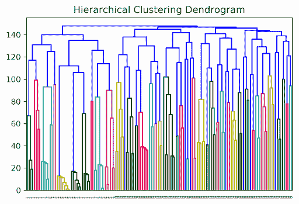 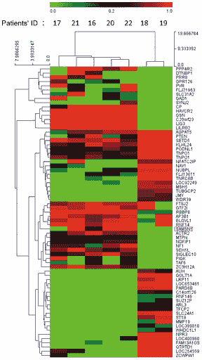

一些教授使用凝聚聚类来进行分级分箱；如果两个人之间有很大的差距，就在那里画一个分级阈值。其想法是，等级聚类应该更像下图左侧的情况，而不是右侧的情况。

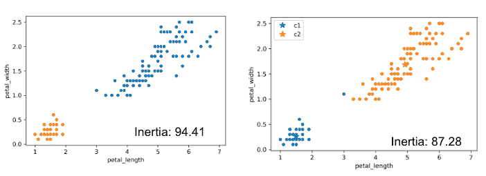

## 26.6 选择 K

我们讨论的算法要求我们在开始之前选择 K。但是我们如何选择 K？通常，最佳的 K 是主观的。例如，考虑下面的状态图。

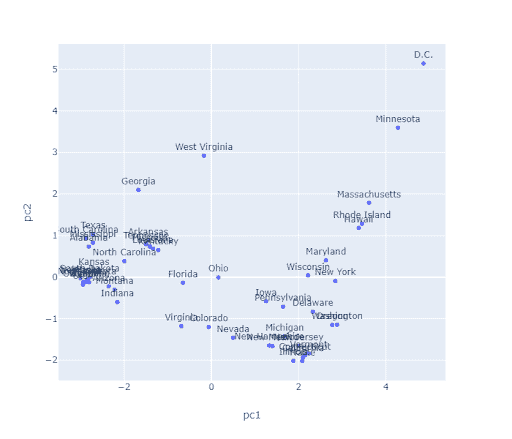

这里有多少个簇？对于 K-Means，确定这一点的一种方法是绘制惯性与许多不同的 K 值。我们会在“拐点”处选择 K，在此之后我们会得到递减的回报（请注意，大型复杂数据通常缺乏拐点，因此这种方法并不是百分之百可靠的）。在这里，我们可能会选择 K = 2。

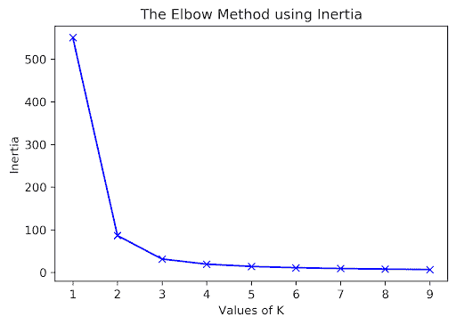

### 26.6.1 轮廓分数

为了评估特定数据点的“聚类效果”如何，我们可以使用“轮廓分数”，又称“轮廓宽度”。较高的轮廓分数表示该点接近其簇中的其他点；较低的分数意味着它远离其簇中的其他点。

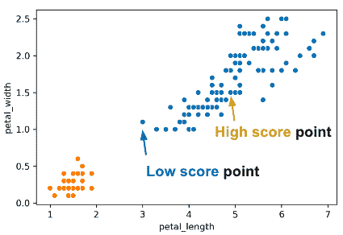

对于数据点 X，得分 S 是：$$S =\frac{B - A}{max(A, B)}$$其中 A 是到簇中*其他*点的距离，B 是到*最近*簇中点的平均距离。

考虑一下 S 的最大可能值以及该值如何出现。S 的最大可能值是 1，如果 X 的簇中的每个点都恰好在 X 的正上方；到 X 的簇中其他点的平均距离是 0，因此 A = 0。因此，S = \frac{B}{max(0, B)} = \frac{B}{B} = 1。另一种情况是 S = 1，如果 B 远大于 A（我们将其表示为 B >> A）。

S 可以是负数吗？答案是可以。如果到 X 的簇内成员的平均距离大于到最近簇的距离，那么这是可能的。例如，上图右侧的“低分”点具有 S = -0.13

### 26.6.2 轮廓图

我们可以绘制所有数据点的轮廓分数。轮廓宽度较大的点深深嵌入其簇中；红色虚线显示了平均值。下面，我们绘制了 K=2 的轮廓分数。

 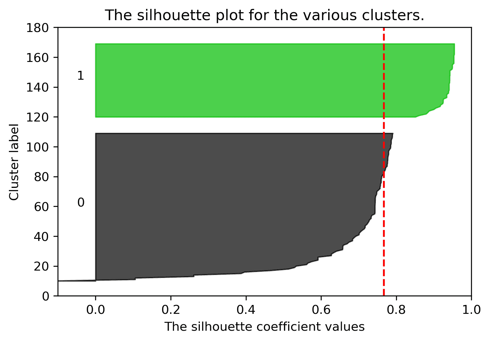

同样，我们可以为相同的数据集绘制 $K=3$ 的轮廓分数：

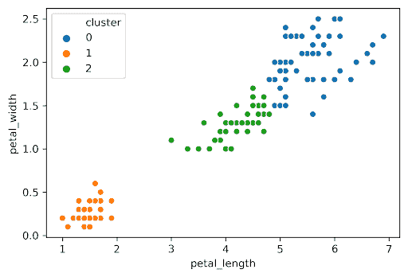 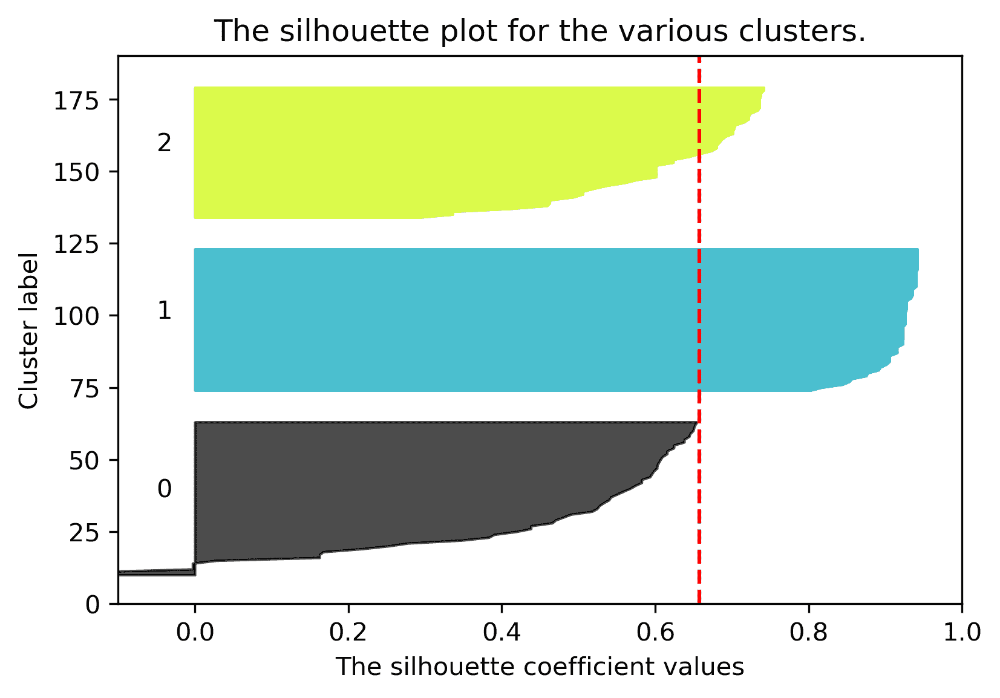

3 个集群的平均轮廓分数较低，因此 $K=2$ 是更好的选择。这也符合我们的直觉。

### 26.6.3 选择 K：真实世界的指标

有时候你可以依靠真实世界的指标来指导你选择 $K$。对于 T 恤，我们可以

+   客户的集群高度和体重，$K = 3$ 设计小号、中号和大号衬衫。

+   客户的集群高度和体重，$K = 5$ 设计 XS、S、M、L 和 XL 衬衫。

要选择 $K$，考虑两种不同 $K$ 的预期成本和销售，并选择最大化利润的那个。

## 26.7 结论

我们现在讨论了一个新的机器学习目标 - 聚类 - 并探讨了两种解决方案：

+   K-Means 尝试优化一个称为惯性的损失函数（没有已知的算法以有效的方式找到最佳答案）

+   层次凝聚

我们版本的这些算法需要一个超参数 $K$。有 4 种方法可以选择 $K$：直觉上、肘部法则、轮廓分数和利用真实世界的指标。

有许多机器学习问题。每个问题都可以通过许多不同的解决方案技术来解决。每个问题都有许多用于评估成功/损失的指标。许多技术可以用来解决不同的问题类型。例如，线性模型可以用于回归和分类。

我们只是触及了表面，并没有讨论许多重要的想法，比如神经网络/深度学习。我们将在最后一堂课上提供一些关于如何进一步探索这些主题的具体课程建议。
