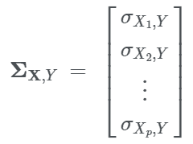
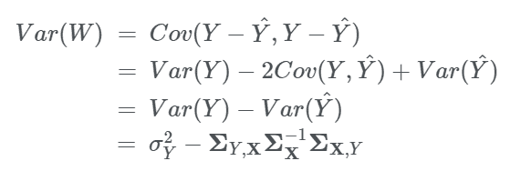
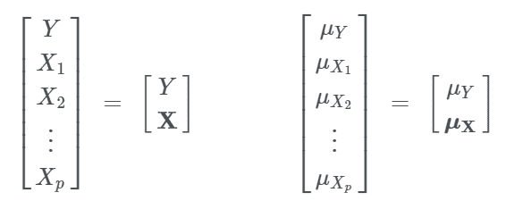
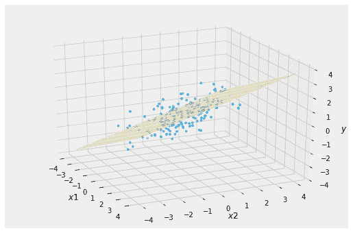
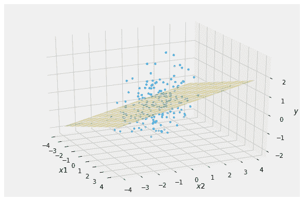
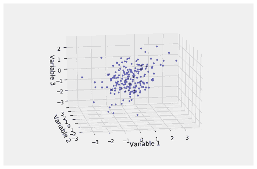

# 二十五、多元回归

> 原文：[prob140/textbook/notebooks/ch_25](https://nbviewer.jupyter.org/github/prob140/textbook/blob/gh-pages/notebooks/Chapter_25/)
> 
> 译者：[lanhaixuan](https://github.com/lanhaixuan)
> 
> 协议：[CC BY-NC-SA 4.0](http://creativecommons.org/licenses/by-nc-sa/4.0/)
> 
> 自豪地采用[谷歌翻译](https://translate.google.cn/

```py
# HIDDEN
from datascience import *
from prob140 import *
import numpy as np
import matplotlib.pyplot as plt
plt.style.use('fivethirtyeight')
%matplotlib inline
import math
from scipy import stats
from scipy import misc
```

回归的最常见用途是根据其他几个变量的值来预测数值变量的值。在我们的概率设置中,目标是预测$Y$基于$p$预测变量$X_1, X_2, \ldots, X_p$;这里$p$不是概率，而是表示预测变量数的正整数。

查找表单的最小二乘函数\
$\hat{Y} = a_1X_1 + a_2X_2 + \cdots + a_pX_p + b$被称为多元线性回归。术语“线性”是指函数在参数中是线性的$a_1, a_2, \ldots, a_p, b$。它并不是指适合的功能的形状。

例如，你可以拟合二次函数$X_1$通过采取$X_2 = X_1^2$。然后\
$\hat{Y} = a_1X_1 + a_2X_2 + b = a_1X_1 + a_2X_1^2 + b$是二次函数$X_1$。但它在系数中仍然是线性的，那些是你必须估计的。

在本章中，我们将简单回归的计算扩展到多元回归的情况。实际上，我们将利用我们关于简单回归的工作来激发对多元回归必须如何工作的猜测。然后我们将检查我们的猜测是否正确。

## 矩阵表示法中的双线性
作为回归的初步，我们将使用矩阵表示法以紧凑的形式表达双线性。本节的结果并不新鲜。它们只是使用新的符号和矩阵表示来重述关于方差和协方差的熟悉结果。

让$\mathbf{X}$为$p \times 1$预测变量的向量。我们知道这是一个$m \times p$矩阵$\mathbf{A}$和一个$m \times 1$向量$\mathbf{b}$，


以下结果是特殊情况。

###线性组合
定义两个通用的线性元素组合$\mathbf{X}$,使


然后


###两个线性组合的协方差
两个线性组合的协方差是$(1, 2)$协方差矩阵的元素$\mathbf{AX} + \mathbf{b}$,这个是$(1, 2)$的元素$\mathbf{A}\boldsymbol{\Sigma}_\mathbf{X}\mathbf{A}^T$。


###线性组合的方差
第一个线性组合的方差是$(1, 1)$的元素$\mathbf{A}\boldsymbol{\Sigma}_\mathbf{X}\mathbf{A}^T$。


###协方差向量
要预测$Y$基于$\mathbf{X}$我们需要与协方差一起工作$Y$和每个元素$\mathbf{X}$。使


并定义协方差向量 $\mathbf{X}$ 和 $Y$ 成为



协方差矢量的转置也有一个记法是很方便的：


通过协方差的线性，


## 最佳线性预测器
使 $Y$ 和 $p \times 1$ 向量 $\mathbf{X}$ 联合分发，并假设你正在试图预测 $Y$ 基于线性函数 $\mathbf{X}$。对于预测器 


预测的均方误差是


在本节中，我们将确定最小化均方误差的线性预测器。我们还将找到这个最佳预测器所产生的误差的方差。

### 线性预测器
在简单回归的情况下，我们通过使用微积分来最小化所有斜率和截距的均方误差，找到了最佳线性预测器。我们可以在这里进行该计算的多变量版本。但是由于我们在一个预测器的情况下所做的工作，我们将采取不同的方法。
 
我们将基于简单回归的答案猜测答案，然后确定我们的猜测是正确的。 
 
在简单回归的情况下，我们在表格中写了回归方程
 

 
现在定义
 

  
当
  

   
是 $p \times 1$ 线性函数系数的向量。
   
### 突出部分
注意 $E(\hat{Y}_\mathbf{b}) ~ = ~ \mu_Y$。预测器是公正的。\
定义预测中的错误
     


然后


我们现在将展示 $W$ 与所有 $\mathbf{X}$ 元素的线性组合不相关。


因为 $E(W) = 0$, 我们也有 $E(W\mathbf{a}^T\mathbf{X}) = Cov(W, \mathbf{a}^T\mathbf{X}) = 0$ 对于所有 $\mathbf{a}$ 成立。

### 最小二乘
为了展示 $\hat{Y}_\mathbf{b}$ 最小化均方误差，从练习开始：表明最佳线性预测器必须是无偏的。

完成后，您可以限制搜索所有无偏线性预测变量的最佳线性预测变量。通过定义这些通用的一个


这里 $\mathbf{h}$ 是某个 $p \times 1$ 系数向量。然后


### 回归方程和预测值
最小二乘线性预测器由下式给出


这里与 $\hat{Y}_\mathbf{b}$ 一样。我们只是为了方便而删除下标，现在我们已经确定它是最好的线性预测器。

如上所述，预测器是无偏见的：


预测值的方差是


### 误差方差
预测中的错误是 $W = Y - \hat{Y}$ 。因为 $\hat{Y}$ 是一个关于$\mathbf{X}$ 线性函数, 我么有


因此


误差的方差是



在双变量正态模型下的简单回归的情况下，我们看到误差方差为


这是我们在此建立的更通用公式的特例。不需要双变量正态假设。

与简单回归的情况一样，我们没有假设联合分布 $Y$ 和 $\mathbf{X}$ ，除了这样说 $\boldsymbol{\Sigma}_\mathbf{X}$
是肯定的。无论如何，有一个基于 $\mathbf{X}$ 的独特的最佳线性预测器 $Y$ 。


## 回归与多元正态
当 $Y$ 和 $\mathbf{X}$ 具有正定的协方差矩阵的多元正态分布，那么在前一节中导出的最佳线性预测器是所有预测器中基于 $\mathbf{X}$ 最好的 $Y$ 。这就是,


另外，条件分布 $Y$ 特定 $\mathbf{X}$ 是正常的。

这些结果是那些情况下的扩展 $Y$ 是基于一个预测因子预测 $X$。为了证明它们，你需要一些线性代数和一些耐心。我们不会在这里做证明。根据您在单个预测器的情况下所看到的情况，不应该难以相信它们是真的。

为了一些保证，我们可以模拟三变量正态分布的数据，并看看我们的条件期望公式如何与模拟点相关。

为此，我们将首先设置一些符号。我们说 $Y$ 和 $\mathbf{X}$ 具有多元正态分布，我们说 $(1+p) \times 1$ 随机向量 $[Y, X_1, X_2, \ldots, X_p]^T$ 具有二元正态分布。

为了保持变量的组织和符号的紧凑，我们将对随机向量及其均值向量进行分区。



我们也可以根据下面的分界线划分协方差矩阵。


下面的单元格生成了从多元正态分布中提取的 200 个点的模拟，其中提供了参数。在垂直维度上绘制的变量是 $Y$, 其他两个轴代表两个预测变量 $X_1$ 和 $X_2$。

这个平面是


请记住，它是根据此公式计算的;它没有基于 200 个模拟点进行估算。

请注意，所有三个变量都是标准单位，并且两个预测变量不是高度相关的：$r(X_1, X_2) = 0.2$。当然，您可以更改参数，但如果输入的“协方差矩阵”不是半正的，则会收到错误消息。

```py
mu = [0, 0, 0]
cov = np.array([[1, 0.6, 0.5],
                [0.6, 1, 0.2],
                [0.5, 0.2, 1]])
Plot_multivariate_normal_regression(mu, cov, 200)
```


这是熟悉的足球形散点图的三维版本，其中“最佳预测”线穿过它。飞机穿过云的“垂直中心”。

在下面的模拟中，这个相关性在 $Y$ 和 两个预测变量之间已经减少。注意平面的传播范围更大。

```py
mu = [0, 0, 0]
cov = np.array([[1, 0.3, 0.25],
                [0.3, 1, 0.2],
                [0.25, 0.2, 1]])
Plot_multivariate_normal_regression(mu, cov, 200)
```


本章的计算，用于预测随机变量的值 $Y$ 通过随机变量 $X_1, X_2, \ldots, X_p$的线性函数,直接应用于数据。我们看到的只是一堆观点：

```py
Scatter_multivariate_normal(mu, cov, 200)
```



但我们不知道分布的参数，因此我们无法通过散射绘制正确的平面。多元回归的问题是基于数据估计平面。

数据 - 即点云 - 包括 $n$ 个观察随机向量 $[Y, X_1, X_2, \ldots, X_p]$。那么，任务是估计平面使用 $n \times p$ 预测变量的观测值矩阵和 $n \times 1$观测值$Y$的向量。最佳平面的公式来自本章开发的随机变量的相应公式。

标准符号是使 $X$ 成为 $n \times p$ 预测矩阵，这个$j$th column $[x_{1j} ~ x_{2j} ~ \ldots ~ x_{nj}]^T$ 包含 $n$ 个第 $j$th 预测变量 $X_j$的观察值，是 $y$ 表示 $n \times 1$ 观察的$Y$向量。

我们的公式表示用于预测的最佳线性函数的系数$Y$ 基于 $\mathbf{X}$ 是整个 $p \times 1$ vector $\mathbf{b}= \boldsymbol{\Sigma}\mathbf{X}^{-1}\boldsymbol{\Sigma}{\mathbf{X}, Y}$。最佳线性函数的系数是基于整个 $p \times 1$ 向量数据 $\hat{\beta} = (X^TX)^{-1}X^Ty$。你应该能够找出原因。

## 进一步审查练习
其中许多练习需要第 19 章的材料，这当然依赖于前面章节的内容。但是，其中一些可以单独使用早期材料来解决。

根据学生和校友的说法，一些练习在“量子”访谈中出现了问题。

1. 硬币以 $p$ 概率代表，让 $X$ 为第一个头部出现之前的投掷次数，让 $Y$ 为第一个头部之前的尾部数量。

   (a) 找到生成 $X$ 函数的时刻。
 
   (b) 使用(a)的答案找到 $E(X)$。请注意，到目前为止，你已经在几个方面找到了 $E(X)$: 通过尾总和公式，通过调整第一次折腾，通过 pgf，现在通过 mgf。
 
   (c) 使用(a)的答案找到 $Y$ 的生成函数。

2. 设 $X_1, X_2, \ldots, X_n$ 是 i.i.d.Poisson $(\mu)$ 随机变量。找出 $\mu$ 的最大似然估计值。

3. 设 $X_1, X_2, \ldots, X_n$ 为 i.i.d.在 $(0, \theta)$ 统一。

    (a) 找到 $\theta$ 的 MLE。 [不要跳算计算。绘制您想要最大化的功能的图表，并注意其域名。]
    
    (b) MLE 是否不偏不倚？如果没有，请使用 MLE 构建 $\theta$ 的无偏估计。

4. $X$ 和 $Y$ 是 i.i.d.与矩生成函数$M(t) = e^{t + t^2}$, $-\infty < t < \infty$。 $(X-Y)^2$的分布是什么？

5. 捕获 - 再捕获方法有时用于估计种群大小。一个标准的图像是一个池中含有 $N$ 条鱼，一些固定但未知的$N$，$N$鱼的$G$已被捕获，标记并活着返回池中。

    在重新捕获阶段，假设从鱼池中的$N$条鱼中抽取一个简单的$n$条鱼随机样本（你可能需要用一些想象来相信这个假设）。我们可以观察样本中标记鱼的随机数$X$。
    
    目标是使用观察估计$N$。
    
    (a) 对于大的$n$，样本比例$X / n$可能接近常数。确定常量，从而根据$X$构建$N$的估计值。在本练习的后面，您将看到您的估算与$N$的 MLE 相关。
    
    (b) 对于$N\ge n$，找到可能$lik(N)$。您可以假设$n > G$。
    
    (c) 要最大化此似然函数，请调整您用于查找二项式和泊松分布模式的方法。找出似然比$\frac{lik(N+1)}{lik(N)}$ 并显示它是$N$的递减函数。 [回过头来看看我们如何显示二项式比值比的相应事实。]
    
    (d) 现在找到$N$的 MLE。它与(a)中的估算值相比如何？

6. 显示如果$r > 1$和$s > 1$那么 beta $(r, s)$发行版的模式是$(r-1)/(r+s-2)$。请记住忽略乘法常量并在最大化之前获取日志。

7. 假设$X$具有 beta $(r, s)$分布，并且给定$X=p$，$H$的条件分布是二项式$(10, p)$。找

    (a) 在$H = 7$的情况下，$X$的条件分配

    (b) $E(X \mid H = 7)$

    (c) 给出$H = 7$的 MAP 估计$X$

    (d) $P(H = 7)$

    (e) $E(H)$

8. 根据 beta $(r, s)$ 分布挑选随机硬币头的机会。硬币被反复抛掷。
 
    (a) 前三次投掷的头部有多少，接下来的三次投掷是尾部的几率是多少？
    
    (b) 鉴于前三次投掷是头部而接下来的三次投掷是尾部，第七次投掷的可能性是多少？
    
    (c) 鉴于前六次投掷中有三次是头部，第七次投掷的可能性是多少？与(b)的答案相比较。

9. A 人通过在$(0, 1)$上统一选择正面的机会来创造一枚硬币。在硬币的三次投掷中，人 A 得到两个面。

    独立于人 A，人 B 通过在$(0, 1)$上统一选择面的机会来创建一枚硬币。在硬币的三次投掷中，人 B 得到正面。
    
    (a) 鉴于这些数据，人 A 硬币正部的机会分布是什么？
    
    (b) 鉴于这些数据，人 B 硬币正部的机会分布是什么？
    
    (c) 鉴于这些数据，A 人的硬币比 B 人的硬币有更高的概率是多少？

10. **Poisson-Binomial 上尾的 Markov 和 Chebyshev 界**。对于$j \ge 1$，让$I_j$为独立指标，使得$P(I_j = 1) = p_j$。 设 $X = I_1 + I_2 + \ldots + I_n$。后$X$是$n$独立试验中不一定相同分布的成功次数。

    我们说$X$具有参数$p_1, p_2, \ldots, p_n$的泊松二项分布。当所有$p_j$相等时，二项式是特殊情况。
    
    您在实验室中看到，中餐馆流程中占用的表的数量具有 Poisson-Binomial 分布。这些分布出现在统计学习理论，随机算法理论和其他领域。
    
    设$E(X) = \mu$。对于$c > 0$，您将在$P(X \ge (1+c)\mu)$上找到上限。这是$X$超过其平均值的几率。
    
    在二项式的特殊情况下，$\mu = np$ 和$P(X \ge (1+c)\mu)$可以重写为$P(\frac{X}{n} - p \ge cp)$。这样的样本比例可能超过$p$百分之几。
    
    (a) 按$p_1, p_2, \ldots, p_n$查找 $\mu = E(X)$和$\sigma^2 = Var(X)$。
    
    (b) 在$P(X \ge (1+c)\mu)$上找到 Markov 的界限。
    
    (c) 在$\mu$和$\sigma$方面找到 Chebyshev 对$P(X \ge (1+c)\mu)$的约束。
    
    (d) 如果所有$p_j$都等于 $p$，那么(c)中的边界值是多少？

11. **Chernoff 绑定泊松二项式上尾**。此练习继续前一个练习并使用相同的表示法。

    (a) 显示所有$t$的$M_{I_j}(t) = 1 + p_j(e^t - 1)$ 给出$I_j$的 mgf。
    
    (b) 使用（a）导出$M_X(t)$的表达式，以$t$计算$X$的 mgf。
    
    (c) 一个有用的指数界限是所有$ x $的$e^x \ge 1 + x$ for all $x$。您不必显示它，但请查看图表。使用这个事实来显示所有$t$的$M_X(t) \le \exp\big{(}\mu(e^t -1)\big{)}$。请注意，右侧是泊松随机变量的 mgf，其平均值与$X$相同。
    
    (d) 使用 Chernoff 的方法和（c）中的界限来表明
    
    
    
    当所有$p_j$相等时，请记住$\mu = np$。如果$g(c) = \exp(c)/(1+c)^{1+c}$很小，则上限将随着$n$变大而呈指数下降。这是下一个练习的重点。

12. **Poisson-Binomial 上尾的简化 Chernoff 界**。此练习继续前一个练习并使用相同的表示法。

    上一练习中的界限有点​​复杂。通常，使用更简单的版本，因为即使它们较弱，它们也足够好。
    
    (a) 为$c > 0$显示 $\log(1+c) \ge \frac{2c}{2+c}$ for $c > 0$并不难。您不必显示它，但请查看图表。使用该事实来显示$c - (1+c)\log(1+c) \le -\frac{c^2}{2+c}$。
    
    (b) 显示如果$X$的 Poisson-binomial 分布均值为$\mu$。
    
    
    
    (c) 还经常使用（b）中更简单但更弱的界限版本。
    
    
    
13. 正随机变量$V$具有期望$\mu$和方差$\sigma^2$。

    (a) 对于每个$v > 0$，给定$V = v$的$X$的条件分布是 Poisson $(v)$。按$\mu$和$\sigma$查找 $E(X)$和$Var(X)$。
    
    (b) 对于每个$v > 0$，给定$V=v$的$X$的条件分布是某些固定$\lambda$的 gamma $(v, \lambda)$。按$\mu$和$\sigma$查找$E(X)$和$Var(X)$。

14. 设$X_1, X_2, \ldots, X_n$是 i.i.d.期望$\mu$和方差$\sigma^2$。设 $S = \sum_{i=1}^n X_i$。
   
    (a) 根据$X_1$查找$S$的最小二乘预测值，并找出预测变量的均方误差（MSE）。
    
    (b) 根据$S$查找$X_1$的最小二乘预测值，并找到预测变量的 MSE。预测器是$S$的线性函数吗？如果是这样，它也必须是基于$S$的所有线性预测变量中最好的，这通常被称为回归预测变量。

15. $p$ -coin 被反复抛出。让$W_{H}$为第一个头部出现之前的投掷数量，并且$W_{HH}$直到两个连续头部出现的投掷数量。

    (a) 描述一个随机变量$X$，它仅取决于$W_H$之后的抛出并满足$W_{HH} = W_H + X$。
    
    (b) 使用（a）部分找到$E(W_{HH})$和$Var(W_{HH})$。

16. 设$N$为非负整数值随机变量，让$X, X_1, X_2, \ldots $为 i.i.d.并且独立于$N$。和以前一样，定义随机和$S$

    

    (a) 让$M$成为我们通常用于生成函数的符号。通过调整$N$，显示出来
    
    
    
    假设上面的所有数量都已明确定义。 [$(e^a)^n = e^{an}$可能很方便。]
    
    (b) 让$N$在${1, 2, 3, \ldots }$上有几何$(p)$分布。找到$N$的 mgf。这不使用（a）部分。
    
    (c) 让$X_1, X_2, \ldots $为 i.i.d.指数$(\lambda)$变量，让$N$为几何，如（b）部分所示。使用（a）和（b）部分的结果来确定$S$的分布。

17. 让$\mathbf{X}$为$p \times 1$ 随机向量，假设我们试图用$\mathbf{X}$的线性函数预测随机变量$Y$。在前面的部分中，我们通过将搜索限制为$Y$的线性函数来确定最小二乘线性预测器，这些函数对于$Y$是无偏的。表明这是一个合法的举动。

    具体来说，让 $\hat{Y}_1 = \mathbf{c}^T \mathbf{X} + d$成为有偏见的预测因子，以便$E(\hat{Y}_1) \ne \mu_Y$。找到一个非零常数$k$，这样$\hat{Y}_2 = \hat{Y}_1 + k$是无偏的，并显示$MSE(\hat{Y}_1) \ge MSE(\hat{Y}_2)$。这将表明最小二乘线性预测器必须是无偏的。


