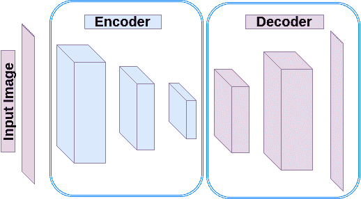

# 自编码器

> 原文： [https://machine-learning-course.readthedocs.io/en/latest/content/deep_learning/autoencoder.html](https://machine-learning-course.readthedocs.io/en/latest/content/deep_learning/autoencoder.html)

## 自编码器及其在 TensorFlow 中的实现

在本文中，您将学习自编码器背后的概念以及如何在 TensorFlow 中实现自编码器。

## 介绍

自编码器是一种神经网络，可模仿其输入并在其输出处生成确切的信息。 它们通常包括两部分：编码器和解码器。 编码器将输入转换为隐藏空间（隐藏层）。 然后，解码器将输入信息重建为输出。 有多种类型的自编码器：

*   **不完整的自编码器**：在这种类型中，隐藏的尺寸小于输入的尺寸。 训练此类自编码器可捕获最突出的特征。 但是，在缺乏足够的训练数据的情况下使用过度参数化的架构会导致过拟合，并妨碍学习有价值的特征。 线性解码器可以用作 PCA。 但是，非线性函数的存在创建了更强大的降维模型。
*   **正则化自编码器**：不会限制自编码器的尺寸和用于特征学习的隐藏层大小，将添加损失函数以防止过拟合。
*   **稀疏自编码器**：稀疏自编码器允许表示信息瓶颈，而无需减小隐藏层的大小。 取而代之的是，它基于损失函数对层内的激活进行惩罚。
*   **去噪自编码器（DAE）**：我们希望自编码器足够灵敏以重新生成原始输入，但不严格敏感，因此该模型可以学习通用的编码和解码。 该方法是将不显着地损坏了一些噪声与未损坏的数据作为目标输出的输入数据..
*   **压缩自编码器（CAE）**：在这种类型的自编码器中，对于较小的输入变化，编码后的特征也应该非常相似。 去噪自编码器强制重建特征抵抗输入的微小变化，而收缩式自编码器强制编码器抵抗输入扰动。
*   **变分自编码器**：变分自编码器（VAE）提出了一种概率方式，用于解释在隐藏空间中的观察。 因此，不是创建一个编码器来生成代表每个潜在特征的值，而是为每个隐藏特征生成一个概率分布。

在本文中，我们将在 TensorFlow 中设计一个欠完善的自编码器，以训练低维表示形式。

## 创建一个不完整的自编码器

我们正在努力构建具有 3 层编码器和 3 层解码器的自编码器。 编码器的每一层都将其输入沿空间维度压缩两倍。 类似地，解码器的每个段将其输入维数增加两倍。

```py
import tensorflow.contrib.layers as lays

def autoencoder(inputs):
    # encoder
    # 32 file code blockx 32 x 1   ->  16 x 16 x 32
    # 16 x 16 x 32  ->  8 x 8 x 16
    # 8 x 8 x 16    ->  2 x 2 x 8
    net = lays.conv2d(inputs, 32, [5, 5], stride=2, padding='SAME')
    net = lays.conv2d(net, 16, [5, 5], stride=2, padding='SAME')
    net = lays.conv2d(net, 8, [5, 5], stride=4, padding='SAME')
    # decoder
    # 2 x 2 x 8    ->  8 x 8 x 16
    # 8 x 8 x 16   ->  16 x 16 x 32
    # 16 x 16 x 32  ->  32 x 32 x 1
    net = lays.conv2d_transpose(net, 16, [5, 5], stride=4, padding='SAME')
    net = lays.conv2d_transpose(net, 32, [5, 5], stride=2, padding='SAME')
    net = lays.conv2d_transpose(net, 1, [5, 5], stride=2, padding='SAME', activation_fn=tf.nn.tanh)
    return net

```



**图 1**：自编码器

MNIST 数据集包含 28X28 的向量图像。 因此，我们定义了一个新函数，将每批 MNIST 图像的形状调整为 28X28，然后调整为 32X32。 调整为 32X32 大小的原因是使其具有 2 的幂，因此我们可以轻松地使用 2 的步幅进行下采样和上采样。

```py
import numpy as np
from skimage import transform

def resize_batch(imgs):
    # A function to resize a batch of MNIST images to (32, 32)
    # Args:
    #   imgs: a numpy array of size [batch_size, 28 X 28].
    # Returns:
    #   a numpy array of size [batch_size, 32, 32].
    imgs = imgs.reshape((-1, 28, 28, 1))
    resized_imgs = np.zeros((imgs.shape[0], 32, 32, 1))
    for i in range(imgs.shape[0]):
        resized_imgs[i, ..., 0] = transform.resize(imgs[i, ..., 0], (32, 32))
    return resized_imgs

```

现在，我们创建一个自编码器，定义一个平方误差损失和一个优化器。

```py
import tensorflow as tf

ae_inputs = tf.placeholder(tf.float32, (None, 32, 32, 1))  # input to the network (MNIST images)
ae_outputs = autoencoder(ae_inputs)  # create the Autoencoder network

# calculate the loss and optimize the network
loss = tf.reduce_mean(tf.square(ae_outputs - ae_inputs))  # claculate the mean square error loss
train_op = tf.train.AdamOptimizer(learning_rate=lr).minimize(loss)

# initialize the network
init = tf.global_variables_initializer()

```

现在我们可以读取批量，训练网络并最终通过重建一批测试图像来测试网络。

```py
from tensorflow.examples.tutorials.mnist import input_data

batch_size = 500  # Number of samples in each batch
epoch_num = 5     # Number of epochs to train the network
lr = 0.001        # Learning rate

# read MNIST dataset
mnist = input_data.read_data_sets("MNIST_data", one_hot=True)

# calculate the number of batches per epoch
batch_per_ep = mnist.train.num_examples // batch_size

with tf.Session() as sess:
    sess.run(init)
    for ep in range(epoch_num):  # epochs loop
        for batch_n in range(batch_per_ep):  # batches loop
            batch_img, batch_label = mnist.train.next_batch(batch_size)  # read a batch
            batch_img = batch_img.reshape((-1, 28, 28, 1))               # reshape each sample to an (28, 28) image
            batch_img = resize_batch(batch_img)                          # reshape the images to (32, 32)
            _, c = sess.run([train_op, loss], feed_dict={ae_inputs: batch_img})
            print('Epoch: {} - cost= {:.5f}'.format((ep + 1), c))

    # test the trained network
    batch_img, batch_label = mnist.test.next_batch(50)
    batch_img = resize_batch(batch_img)
    recon_img = sess.run([ae_outputs], feed_dict={ae_inputs: batch_img})[0]

    # plot the reconstructed images and their ground truths (inputs)
    plt.figure(1)
    plt.title('Reconstructed Images')
    for i in range(50):
        plt.subplot(5, 10, i+1)
        plt.imshow(recon_img[i, ..., 0], cmap='gray')
    plt.figure(2)
    plt.title('Input Images')
    for i in range(50):
        plt.subplot(5, 10, i+1)
        plt.imshow(batch_img[i, ..., 0], cmap='gray')
    plt.show()

```